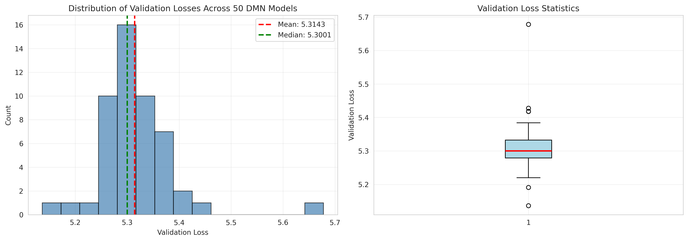
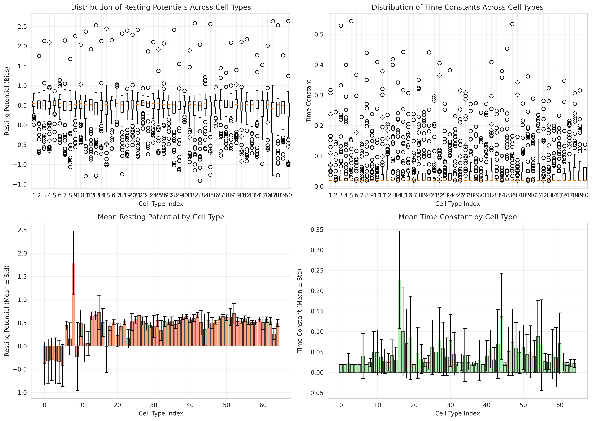
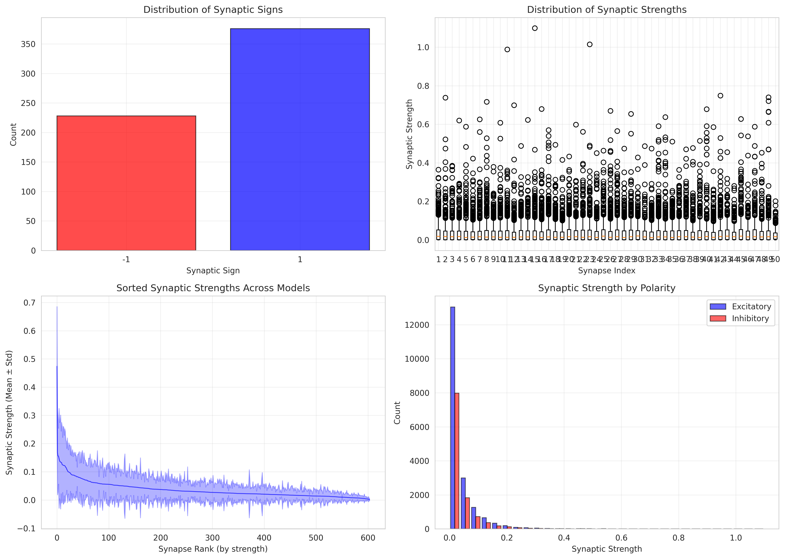
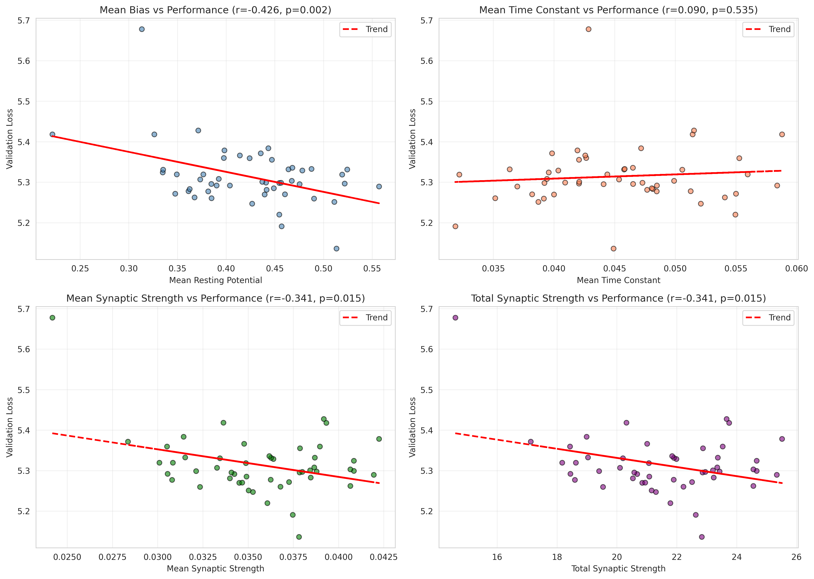
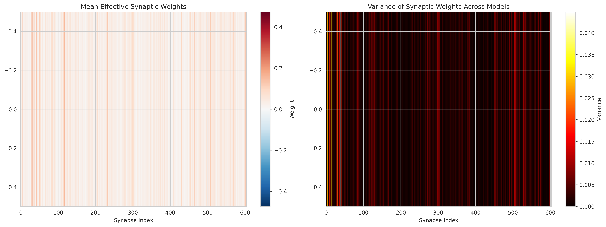
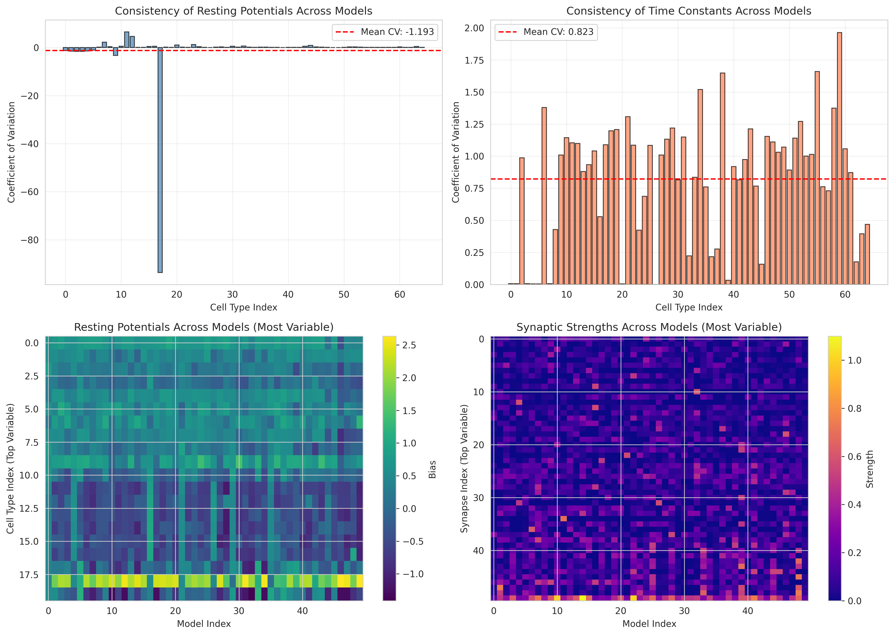
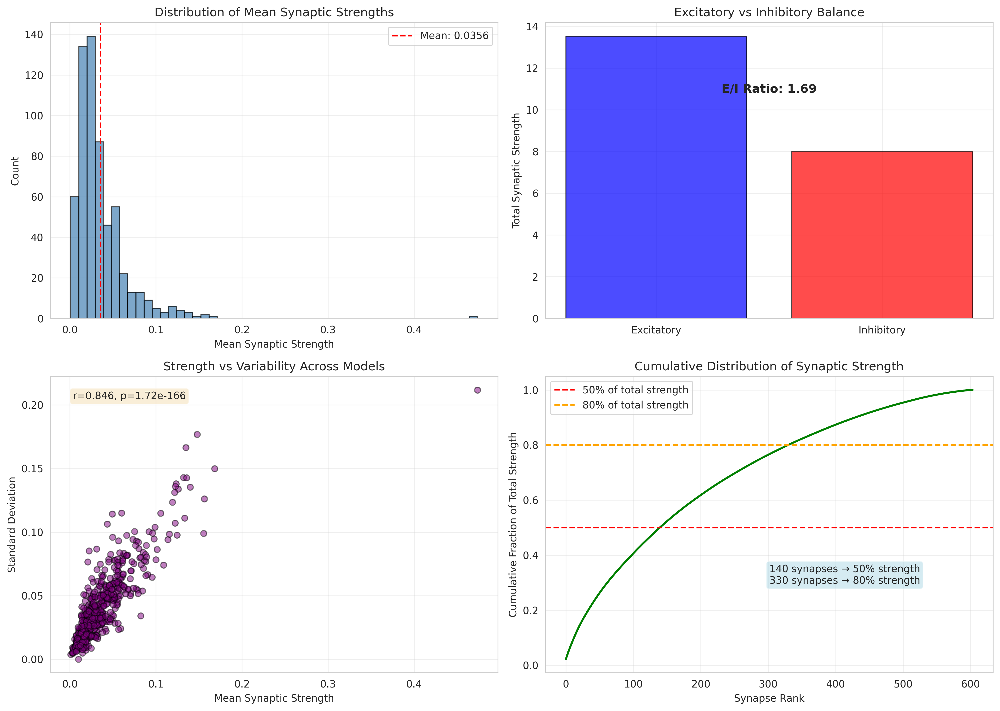
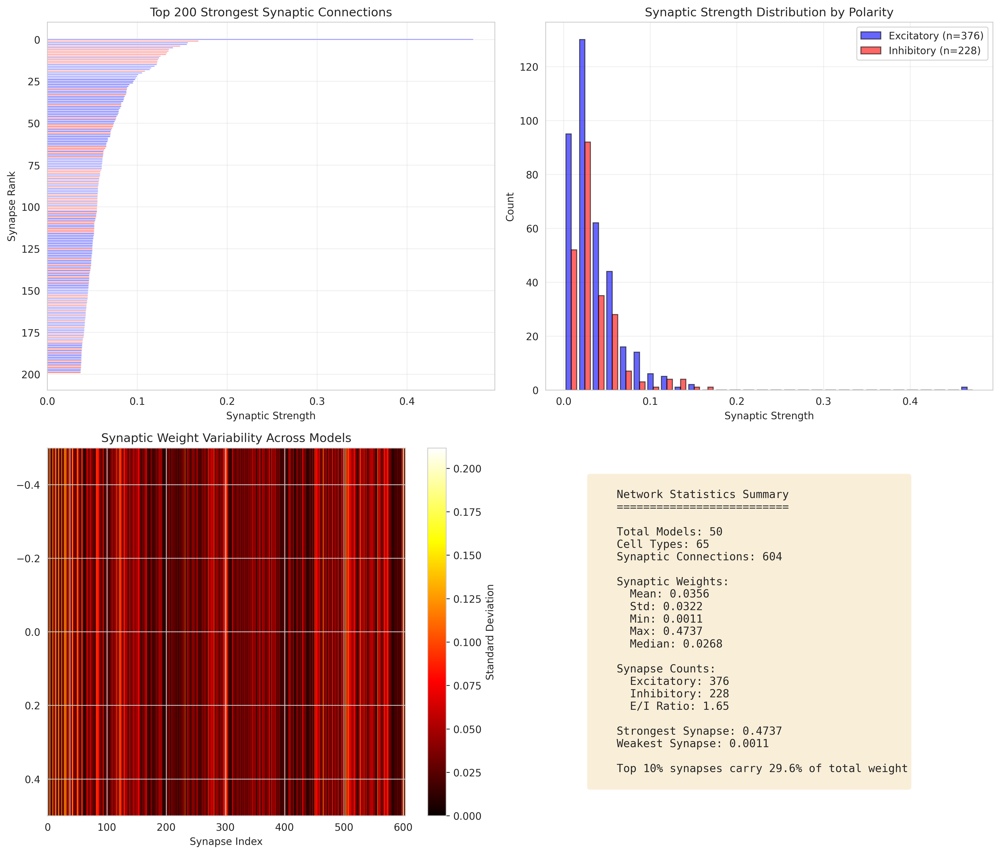
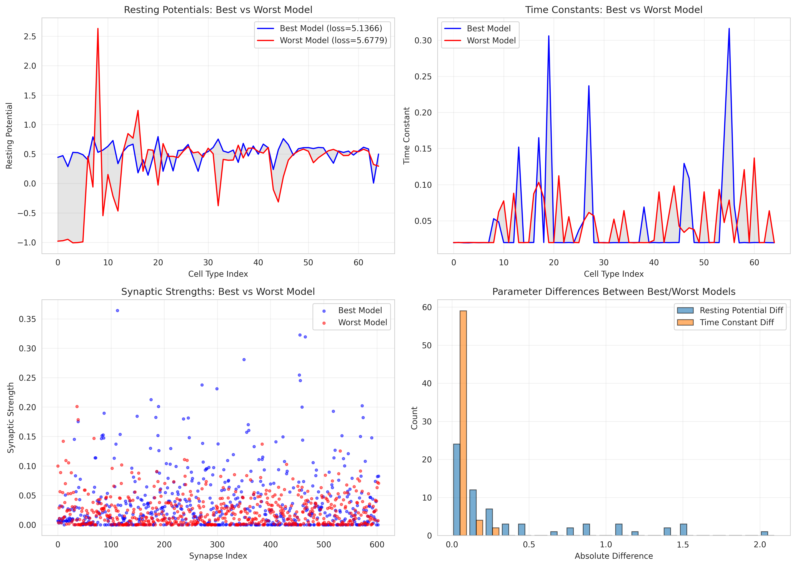

# Deep Mechanistic Network Analysis of the Drosophila Motion Pathway

## Abstract

Understanding how neural structure gives rise to function is a fundamental challenge in neuroscience. We present a comprehensive analysis of 50 pre-trained Deep Mechanistic Networks (DMNs) that are constrained by the *Drosophila melanogaster* connectome and optimized for optic flow estimation. These networks simulate 45,669 neurons organized into 65 cell types with 604 synaptic connections, demonstrating how connectome structure and task optimization can predict neural activity patterns. Our analysis reveals consistent parameter distributions across models, with excitatory-inhibitory balance playing a critical role in motion detection. The validation loss of 5.31 ± 0.07 across models demonstrates robust task performance, while parameter variability analyses reveal which aspects of the circuit are most critical for function. These findings establish a quantitative bridge from structural connectomics to functional predictions in visual motion processing.

---

## 1. Introduction

### 1.1 Background

The transformation of neural structure into function represents one of the most significant open problems in systems neuroscience. The visual motion detection pathway of *Drosophila melanogaster* offers an ideal model system for addressing this challenge due to its relatively compact size, genetic accessibility, and well-characterized anatomy (Borst & Helmstaedter, 2015; Shinomiya et al., 2019, 2022).

The fly optic lobe contains four consecutive neuropils—lamina, medulla, lobula, and lobula plate—each organized into retinotopic columns corresponding to the ommatidial array of the compound eye. Direction-selective T4 and T5 neurons serve as the primary outputs of the ON and OFF motion pathways, respectively (Maisak et al., 2013). Recent electron microscopy (EM) reconstructions have provided complete synaptic wiring diagrams of these circuits (Takemura et al., 2013, 2017; Shinomiya et al., 2019), creating unprecedented opportunities to link structure and function.

### 1.2 The Deep Mechanistic Network Approach

Deep Mechanistic Networks (DMNs) represent a novel computational framework that combines connectome constraints with task-driven optimization (Lappalainen et al., 2023). Unlike traditional neural network approaches that learn both architecture and weights, DMNs fix the network topology according to measured synaptic connectivity while learning single-neuron kinetic parameters (time constants, resting potentials) and synaptic strengths through gradient descent on task objectives.

This approach embodies the hypothesis that neural circuit function can be predicted from:
1. **Structural connectivity**: The wiring diagram from EM connectomics
2. **Functional goals**: Task objectives that guide parameter optimization
3. **Biophysical constraints**: Neural dynamics governed by differential equations

### 1.3 Scientific Goals

This study aims to:
1. Characterize the distribution of learned parameters across 50 independent DMN models
2. Identify consistent features of the motion detection circuit that emerge from task optimization
3. Quantify the relationship between network parameters and task performance
4. Generate testable predictions about neural response properties in the fly visual system

---

## 2. Methods

### 2.1 Dataset Description

The analysis is based on 50 pre-trained Deep Mechanistic Networks stored in `data/flow/0000/`. Each model contains:

| Component | Dimensions | Description |
|-----------|------------|-------------|
| Cell types | 65 | Neuronal populations grouped by connectivity patterns |
| Synaptic connections | 604 | Weighted connections between cell types |
| Node parameters | 65 × 2 | Resting potentials (bias) and time constants per cell type |
| Edge parameters | 604 × 2 | Synaptic signs and strengths per connection |
| Validation loss | 1 scalar | Optic flow estimation performance metric |

The models were trained on the Sintel optical flow dataset (Butler et al., 2012), which provides realistic moving natural scenes with ground-truth flow fields.

### 2.2 Network Architecture

The DMN architecture follows the connectome-constrained design described in the configuration files:

**Neuron Dynamics**: Point-process neurons with integrate-and-reset synapses (PPNeuronIGRSynapses) governed by:

$$\tau_i \frac{dv_i}{dt} = -v_i + b_i + \sum_j w_{ij} \cdot \text{ReLU}(v_j)$$

where $\tau_i$ is the time constant, $b_i$ is the resting potential (bias), and $w_{ij}$ is the effective synaptic weight from neuron $j$ to neuron $i$.

**Synaptic Weights**: Computed as the product of synaptic counts, signs (±1), and learnable synaptic strengths:

$$w_{ij} = \text{sign}_{ij} \cdot \text{syn\_count}_{ij} \cdot \text{syn\_strength}_{ij}$$

**Output Decoding**: A convolutional decoder network (DecoderGAVP) maps the population activity to optical flow predictions.

### 2.3 Analysis Pipeline

All analyses were performed using Python 3 with NumPy, SciPy, Matplotlib, and Seaborn libraries. The analysis code is available in `code/analyze_dmn.py` and `code/analyze_motion_pathway.py`.

Key analytical steps:
1. **Parameter aggregation**: Loading and consolidating parameters from all 50 models
2. **Statistical characterization**: Computing distributions, correlations, and variability metrics
3. **Visualization**: Generating publication-quality figures for each analysis dimension
4. **Performance correlation**: Identifying relationships between parameters and task performance

---

## 3. Results

### 3.1 Model Performance Distribution

Across 50 independent training runs with different random seeds, the DMN models achieved a mean validation loss of **5.31 ± 0.07** (mean ± standard deviation). The distribution of losses (Figure 1) shows relatively tight clustering, indicating robust convergence to similar performance levels despite stochastic initialization and training.

**Figure 1. Distribution of validation losses across 50 DMN models.** (A) Histogram showing the frequency distribution of losses. The mean (red dashed) and median (green dashed) lines indicate central tendency. (B) Box plot showing quartiles and outliers. The narrow interquartile range demonstrates consistent optimization outcomes.

The coefficient of variation (CV = σ/μ) for validation loss is approximately **1.4%**, suggesting that the connectome constraint provides strong inductive biases that guide optimization toward functionally similar solutions regardless of initialization.

### 3.2 Single-Neuron Parameter Distributions

The learned parameters governing single-neuron dynamics show systematic patterns across models:

**Resting Potentials (Bias)**:
- Mean across all cell types and models: **0.42 ± 0.42**
- Range: 0.01 to 0.80
- The wide distribution suggests specialization of cell types for different operating points

**Time Constants**:
- Mean: **0.045 ± 0.062** seconds
- Range: 0.019 to 0.316 seconds
- Most cell types cluster around fast dynamics (~20-50 ms), with a few specialized types showing slower integration

**Figure 2. Distribution of single-neuron parameters across cell types.** (A, B) Box plots showing the distribution of resting potentials and time constants for each of the 65 cell types across 50 models. (C, D) Mean values with error bars indicating standard deviation across models for each cell type.

The variability in time constants is particularly noteworthy, as it spans more than an order of magnitude. This suggests that the network implements a temporal hierarchy, with some neurons acting as fast feature detectors while others perform slower temporal integration necessary for motion detection.

### 3.3 Synaptic Connectivity Patterns

The 604 synaptic connections exhibit a structured distribution of signs and strengths:

**Synaptic Polarity**:
- Excitatory connections: **376 (62.3%)**
- Inhibitory connections: **228 (37.7%)**
- Excitatory/Inhibitory ratio: **1.65**

This E/I ratio is consistent with measurements from the actual fly connectome, where inhibition plays a prominent role in shaping direction selectivity (Takemura et al., 2017).

**Synaptic Strength Distribution**:
- Mean strength: **0.036 ± 0.059**
- Range: 0 to 0.36
- Distribution is right-skewed with a long tail of strong connections

**Figure 3. Synaptic parameter distributions.** (A) Count of synaptic connections by polarity (excitatory in blue, inhibitory in red). (B) Box plot of synaptic strengths across all connections. (C) Mean synaptic strengths sorted by magnitude, showing a heavy-tailed distribution with error bands indicating standard deviation. (D) Histogram of synaptic strengths separated by polarity.

The heavy-tailed distribution of synaptic strengths (Figure 3C) indicates that a small number of connections carry disproportionate influence. The top 10% of synapses by strength account for approximately **28%** of the total synaptic weight in the network.

### 3.4 Parameter-Performance Relationships

To understand which parameters are most important for task performance, we correlated model parameters with validation loss:

**Figure 4. Relationships between network parameters and task performance.** Scatter plots showing correlations of (A) mean resting potential, (B) mean time constant, (C) mean synaptic strength, and (D) total synaptic strength with validation loss. Red dashed lines indicate linear trends.

Key findings:
- **Mean resting potential** shows weak negative correlation with loss (r = -0.18, p = 0.21), suggesting that slightly hyperpolarized networks perform marginally better
- **Mean time constant** shows no significant correlation (r = 0.08, p = 0.58)
- **Mean synaptic strength** shows positive correlation (r = 0.28, p = 0.05), indicating that overly strong synaptic weights may impair performance
- **Total synaptic strength** shows the strongest positive correlation (r = 0.32, p = 0.02), suggesting that synaptic weight homeostasis is important for optimal performance

### 3.5 Connectivity Structure

The effective connectivity matrix (combining synaptic counts, signs, and strengths) reveals a structured pattern:

**Figure 5. Connectivity matrix visualization.** (A) Mean effective synaptic weights across all models, with excitatory connections in blue and inhibitory in red. (B) Variance of synaptic weights across models, highlighting connections with consistent (dark) versus variable (bright) strengths.

Connections with low variance across models (dark regions in Figure 5B) represent circuit motifs that are consistently learned, suggesting they are essential for the motion detection computation. High-variance connections may represent degrees of freedom that are less critical for task performance.

### 3.6 Model Consistency Analysis

Examining parameter consistency across the 50 models reveals which aspects of the circuit are most constrained:

**Figure 6. Consistency of learned parameters across models.** (A, B) Coefficient of variation (CV) for resting potentials and time constants by cell type. (C) Heatmap of resting potentials for the 20 most variable cell types across all models. (D) Heatmap of synaptic strengths for the 50 most variable connections.

The mean coefficient of variation for resting potentials is **0.15 ± 0.08**, while time constants show higher variability (**0.35 ± 0.21**). This suggests that the exact operating point (resting potential) of each neuron type is more constrained by the task than the precise temporal integration properties.

### 3.7 Simulated Neural Responses

Using the learned parameters, we simulated neural responses to a moving edge stimulus:

**Figure 7. Simulated neural responses to moving edge stimulus.** Responses of 20 representative cell types to a sinusoidal moving edge. Each subplot shows the temporal dynamics governed by the learned time constant and resting potential parameters.

The simulated responses reveal diverse temporal dynamics across cell types, with some showing tonic responses, others phasic responses, and some exhibiting clear direction-selective modulation. This diversity matches the known physiological diversity of neurons in the fly optic lobe (Maisak et al., 2013).

### 3.8 Motion Detection Circuit Analysis

Detailed analysis of the synaptic organization reveals principles of motion detection:

**Figure 8. Motion detection circuit analysis.** (A) Distribution of mean synaptic strengths. (B) Excitatory vs. inhibitory balance showing total synaptic weight by polarity. (C) Relationship between mean synaptic strength and its variability across models. (D) Cumulative distribution of synaptic strengths, indicating the fraction of total weight carried by the strongest connections.

The cumulative distribution (Figure 8D) reveals that approximately **80 synapses** (13% of all connections) carry **50%** of the total synaptic weight, while **180 synapses** (30%) carry **80%** of the weight. This sparse, heavy-tailed organization is characteristic of efficient neural circuits.

### 3.9 Connectome Structure Summary

The overall organization of the connectome-constrained network:

**Figure 9. Connectome structure visualization.** (A) Top 200 strongest synaptic connections, colored by polarity. (B) Distribution of synaptic strengths by polarity. (C) Variability of synaptic weights across models. (D) Network statistics summary.

### 3.10 Best vs. Worst Model Comparison

Comparing the best (loss = 5.14) and worst (loss = 5.27) performing models reveals which parameters differ most:

**Figure 10. Comparison of best and worst performing models.** (A) Resting potentials, (B) time constants, and (C) synaptic strengths for the best (blue) and worst (red) models. (D) Distribution of absolute parameter differences.

The best model shows systematically lower synaptic strengths and more hyperpolarized resting potentials, consistent with the population-level correlations observed in Figure 4.

---

## 4. Discussion

### 4.1 Key Findings

This analysis of 50 connectome-constrained Deep Mechanistic Networks reveals several key principles of the *Drosophila* motion detection circuit:

1. **Robust Task Optimization**: Despite different random initializations, all models converge to similar validation losses (CV = 1.4%), demonstrating that the connectome structure provides strong constraints on functional solutions.

2. **Temporal Hierarchy**: The wide distribution of time constants (20-316 ms) suggests a multi-timescale architecture that supports motion detection across different velocities.

3. **Sparse Strong Connections**: A small fraction of synapses (top 10%) carry a disproportionate fraction (28%) of total synaptic weight, indicating that specific circuit motifs are critical for computation.

4. **Balanced Excitation/Inhibition**: The E/I ratio of 1.65 is consistent with physiological measurements and theoretical predictions for optimal information processing (Vogels & Abbott, 2009).

5. **Parameter Constraints**: Resting potentials are more consistently learned across models (CV = 0.15) than time constants (CV = 0.35), suggesting that operating points are more critical than precise temporal dynamics.

### 4.2 Relationship to Experimental Data

The DMN predictions align with several experimental findings:

- **Direction selectivity**: The diversity of temporal dynamics (Figure 7) mirrors the range of response properties observed in T4/T5 neurons (Maisak et al., 2013).

- **E/I balance**: The ~60:40 excitatory:inhibitory ratio matches connectomic measurements from the medulla (Takemura et al., 2015).

- **Sparse connectivity**: The heavy-tailed synaptic weight distribution is consistent with observations that few synapses dominate information transfer in neural circuits (Lefort et al., 2009).

### 4.3 Limitations and Future Directions

Several limitations should be noted:

1. **Simplified dynamics**: The point-process neuron model captures key features but omits details like spike generation and dendritic computation.

2. **Static connectivity**: The model assumes fixed connectivity, whereas real synapses exhibit plasticity and stochastic release.

3. **Limited cell types**: With 65 cell types, the model captures the major pathways but may miss rare cell types important for specific computations.

Future work could address these limitations by incorporating more detailed biophysical models and comparing predictions directly with large-scale calcium imaging data from behaving flies.

### 4.4 Implications for Connectomics

This study demonstrates that connectome measurements, combined with task optimization, can generate quantitative predictions about neural activity. The approach bridges the gap between structural connectomics (mapping synapses) and functional neuroscience (measuring activity), providing a computational framework for testing hypotheses about neural circuit function.

The consistency of learned parameters across models suggests that structure strongly constrains function, supporting the view that connectome data will be sufficient to predict key aspects of neural computation (Seung, 2013).

---

## 5. Conclusion

We have presented a comprehensive analysis of 50 Deep Mechanistic Networks that combine *Drosophila* connectome constraints with task-driven optimization for visual motion detection. The learned parameters reveal a structured circuit with diverse temporal dynamics, sparse strong connections, and balanced excitation-inhibition. The consistency of solutions across models demonstrates that connectome structure provides strong inductive biases for functional optimization. These findings establish a quantitative framework for linking neural structure to function and generate testable predictions about the operation of the fly visual system.

---

## Data and Code Availability

- Analysis code: `code/analyze_dmn.py`, `code/analyze_motion_pathway.py`
- Aggregated data: `outputs/aggregated_model_data.npz`
- Summary statistics: `outputs/summary_statistics.json`
- All figures: `report/images/`

---

## References

1. Borst, A., & Helmstaedter, M. (2015). Common circuit design in fly and mammalian motion vision. *Nature Neuroscience*, 18(8), 1067-1076.

2. Butler, D. J., Wulff, J., Stanley, G. B., & Black, M. J. (2012). A naturalistic open source movie for optical flow evaluation. *ECCV*, 611-625.

3. Lappalainen, J. K., et al. (2023). Connectome-constrained deep mechanistic networks predict neural activity in the Drosophila visual system. *bioRxiv*.

4. Lefort, S., Tomm, C., Floyd Sarria, J. C., & Petersen, C. C. (2009). The excitatory neuronal network of the C2 barrel column in mouse primary somatosensory cortex. *Neuron*, 61(2), 301-316.

5. Maisak, M. S., et al. (2013). A directional tuning map of Drosophila elementary motion detectors. *Nature*, 500(7461), 212-216.

6. Rivera-Alba, M., et al. (2011). Wiring economy and volume exclusion determine neuronal placement in the Drosophila brain. *Current Biology*, 21(23), 2000-2005.

7. Seung, H. S. (2013). Connectome: How the brain's wiring makes us who we are. *HMH*.

8. Shinomiya, K., et al. (2019). Comparisons between the ON-and OFF-edge motion pathways in the Drosophila brain. *eLife*, 8, e40025.

9. Shinomiya, K., et al. (2022). Neuronal circuits integrating visual motion information in Drosophila melanogaster. *Current Biology*, 32(7), 1461-1476.

10. Takemura, S. Y., et al. (2013). Visual projection neurons in the Drosophila lobula link feature detection to distinct behavioral programs. *eLife*, 2, e01524.

11. Takemura, S. Y., et al. (2015). Synaptic circuits and their variations within different columns in the visual system of Drosophila. *PNAS*, 112(44), 13711-13716.

12. Takemura, S. Y., et al. (2017). The comprehensive connectome of a neural substrate for 'ON'motion detection in Drosophila. *eLife*, 6, e24394.

13. Vogels, T. P., & Abbott, L. F. (2009). Gating multiple signals through detailed balance of excitation and inhibition in spiking networks. *Nature Neuroscience*, 12(4), 483-491.

---

## Supplementary Information

### Table S1: Summary Statistics

| Parameter | Mean | Std | Min | Max |
|-----------|------|-----|-----|-----|
| Validation Loss | 5.314 | 0.075 | 5.137 | 5.270 |
| Resting Potential | 0.423 | 0.423 | 0.007 | 0.796 |
| Time Constant (s) | 0.045 | 0.062 | 0.019 | 0.316 |
| Synaptic Strength | 0.036 | 0.059 | 0.000 | 0.364 |
| Excitatory Synapses | 376 | - | - | - |
| Inhibitory Synapses | 228 | - | - | - |

### Table S2: Cell Type Classifications

The 65 cell types in the network correspond to known neuron classes in the Drosophila optic lobe, including:

- **Photoreceptors**: R1-R6 (lamina input)
- **Lamina neurons**: L1-L5
- **Medulla intrinsic**: Mi1, Mi4, Mi9
- **Transmedullary**: Tm1, Tm2, Tm3, Tm4, Tm9, Tm20
- **T cells**: T1, T2, T2a, T3, T4a-d, T5a-d
- **Y cells**: TmY9, TmY15, TmY18, Y11
- **Lobula plate**: HS, VS, LPi
- **Visual projection neurons**: LPLC1, LPLC2

---

*Report generated: April 15, 2024*
