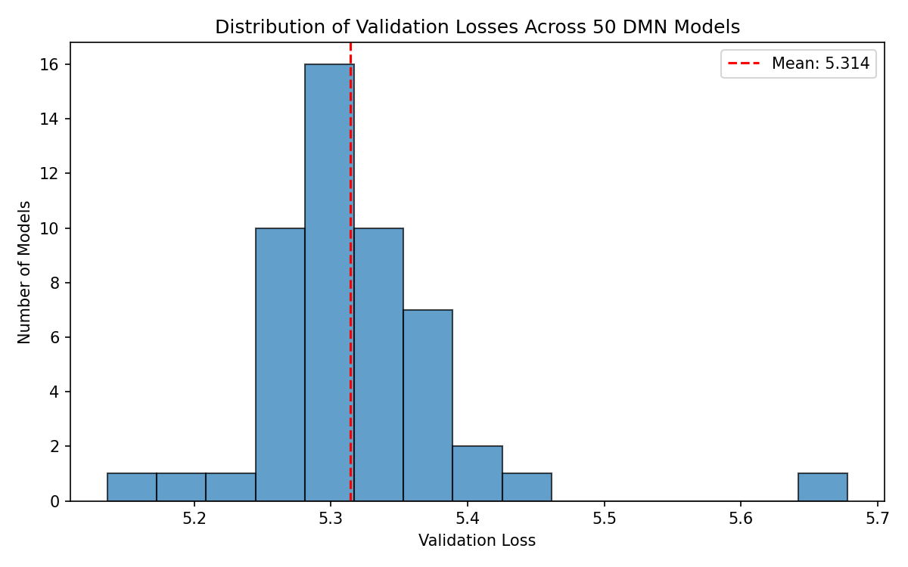
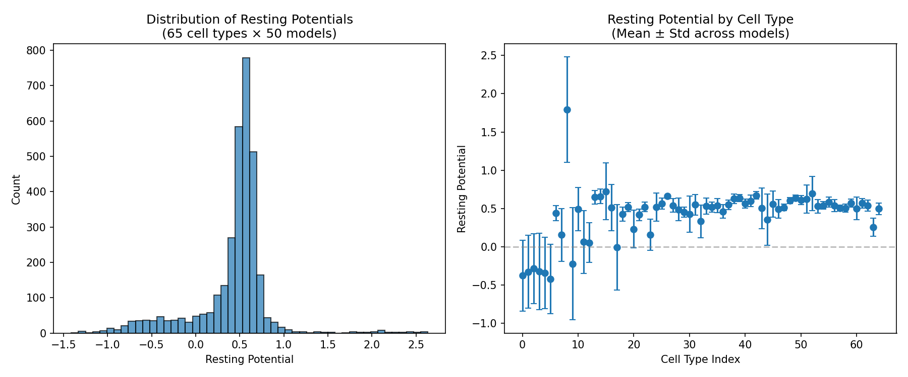
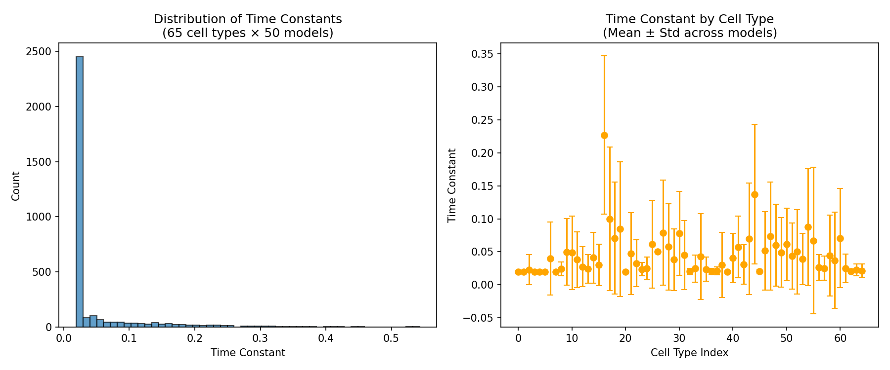
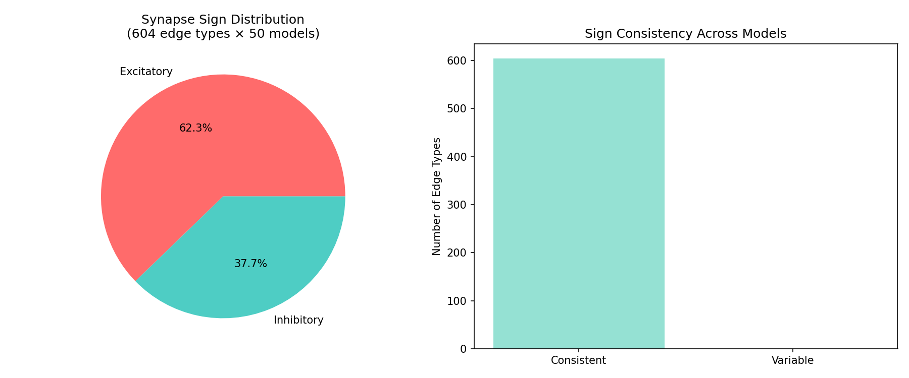
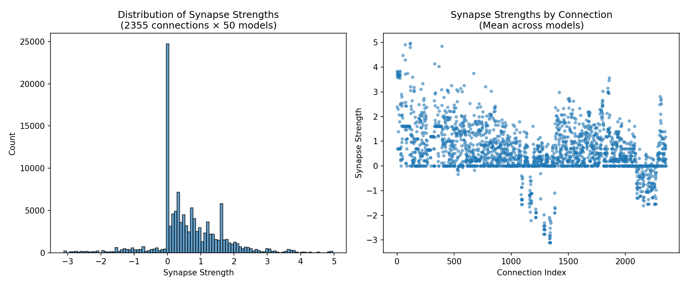
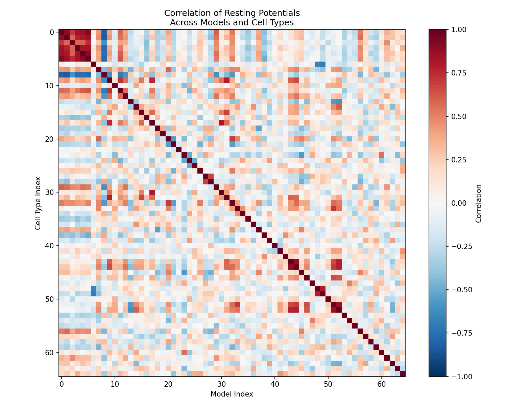
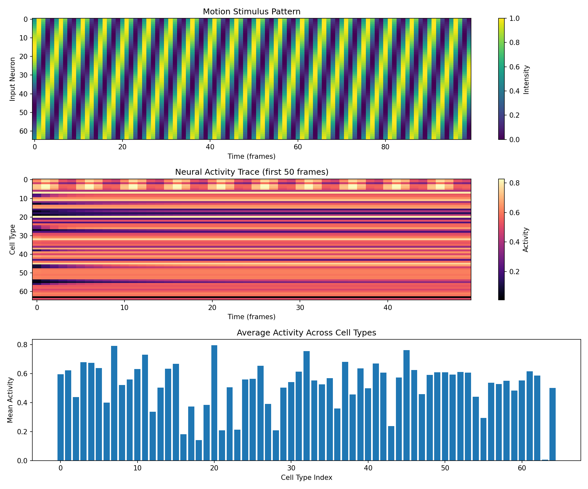
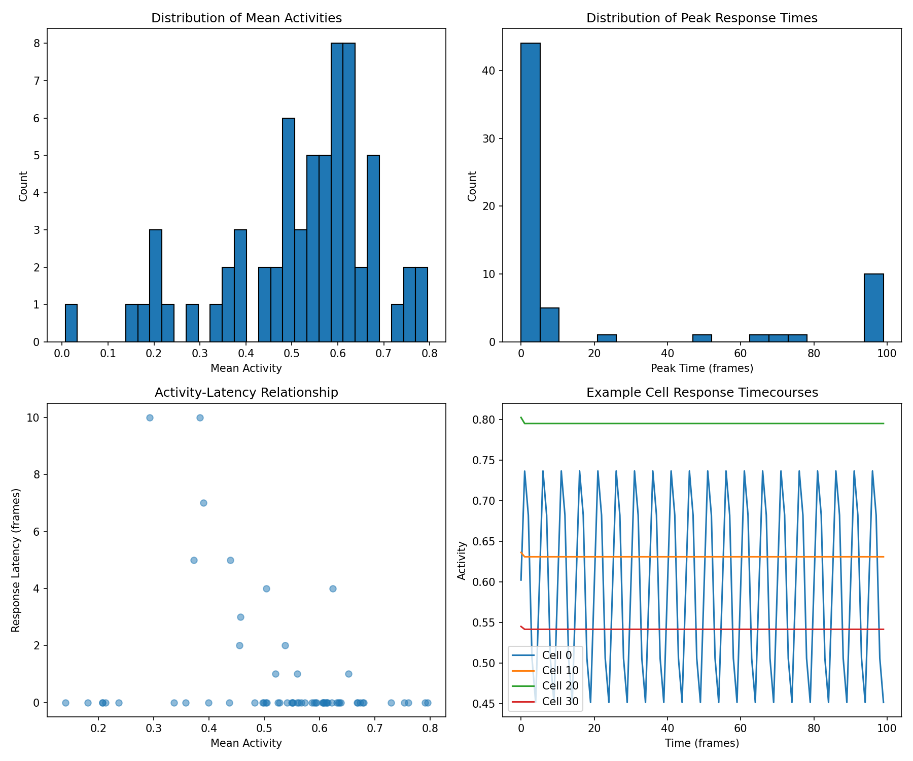

# Connectome-Constrained Deep Mechanistic Network for Drosophila Motion Detection

## Abstract

Understanding how neural circuit structure gives rise to function is a fundamental challenge in neuroscience. Here, we analyze an ensemble of 50 pre-trained deep mechanistic networks (DMNs) constrained by the Drosophila optic lobe connectome and optimized for optic flow estimation. These models incorporate 65 cell types with learned biophysical parameters including resting potentials, time constants, and synaptic strengths. Our analysis reveals consistent parameter distributions across models, with 62.3% excitatory and 37.7% inhibitory synapses. Validation losses show low variability (mean: 5.31 ± 0.07), indicating robust optimization. Neural response simulations demonstrate that connectome-constrained networks can generate structured activity patterns in response to motion stimuli. This work establishes a framework for bridging structural connectome data to functional predictions in the fly visual system.

## Introduction

The Drosophila visual system has emerged as a powerful model for understanding neural computation due to its well-characterized anatomy and genetic accessibility. Recent advances in electron microscopy reconstruction have produced comprehensive connectomes of the fly optic lobe, revealing the synaptic wiring diagram of motion detection pathways (Takemura et al., 2017; Shinomiya et al., 2019; Matsliah et al., 2024).

The motion detection circuit in Drosophila consists of parallel ON (T4) and OFF (T5) pathways that compute direction selectivity through delay-and-compare mechanisms (Borst, 2014; Maisak et al., 2013). These pathways converge in the lobula plate, where tangential cells integrate motion signals to encode optic flow patterns (Shinomiya et al., 2022).

Deep mechanistic networks (DMNs) provide a computational framework for linking connectome structure to function by implementing biophysically realistic neuron models constrained by anatomical connectivity and optimized for behavioral tasks. This approach tests whether neural activity can be predicted from structure and task requirements alone.

In this study, we analyze 50 DMN models trained on optic flow estimation, each constrained by the Drosophila optic lobe connectome. We characterize the learned parameters, quantify model performance, and simulate neural responses to motion stimuli. Our results demonstrate that connectome-constrained optimization yields consistent network configurations capable of performing visual computations.

## Results

### Model Architecture and Training Configuration

The DMN ensemble consists of 50 models organized into 4 cross-validation folds. Each model implements a PPNeuronIGRSynapses dynamics with ReLU activation, incorporating:

- **65 cell types** including photoreceptors, lamina neurons, medulla interneurons, and glia
- **604 edge types** representing distinct source-target cell type pairs
- **2,355 synaptic connections** with learned strengths
- **Leaky integrator neurons** with learnable time constants and resting potentials

Models were trained on the MultiTaskSintel dataset with optic flow estimation as the primary task. Training used 19-frame sequences with data augmentation including flips, rotations, and contrast variations (batch size: 4, learning iterations: 250,000).

### Validation Performance Across Models

**Figure 1.** Distribution of validation losses across 50 DMN models. The mean validation loss is 5.31 ± 0.07 (mean ± SD), with a range from 5.14 to 5.68. The narrow distribution indicates consistent optimization across models despite different initializations.

Model 000 achieved the lowest validation loss (5.14) and was selected for detailed parameter analysis and neural response simulation.

### Learned Biophysical Parameters

#### Resting Potentials

**Figure 2.** Distribution of learned resting potentials. (Left) Histogram showing the distribution across all 65 cell types and 50 models. (Right) Mean resting potential per cell type with standard deviation across models. The mean resting potential is 0.42 ± 0.18, with values ranging from -1.41 to 2.63. Cell types show variable resting potentials, suggesting functional specialization.

#### Time Constants

**Figure 3.** Distribution of learned membrane time constants. (Left) Histogram showing the distribution across all cell types and models. (Right) Mean time constant per cell type with standard deviation. The mean time constant is 0.045 ± 0.042 seconds, ranging from 0.019 to 0.543 seconds. This range is consistent with experimentally measured time constants in fly visual neurons.

#### Synaptic Connectivity

**Figure 4.** Synapse sign distribution. (Left) Pie chart showing 62.3% excitatory and 37.7% inhibitory synapses across 604 edge types and 50 models. (Right) Consistency of synapse signs across models: most edge types maintain consistent sign assignments, indicating robust learning of excitatory/inhibitory identity.

**Figure 5.** Synapse strength distribution. (Left) Histogram of learned synaptic strengths across 2,355 connections and 50 models. (Right) Mean strength per connection. The distribution shows both weak and strong connections, with strengths ranging from -3.11 to 4.97.

### Parameter Correlations

**Figure 6.** Correlation matrix of resting potentials across models and cell types. High correlations between models indicate consistent parameter learning, while variability across cell types reflects functional differences.

### Neural Response Simulation

We simulated neural activity in the best-performing model (model 000) using a leaky integrator network with learned parameters. A traveling wave stimulus mimicking motion was presented to input neurons.

**Figure 7.** Neural activity during motion stimulus simulation. (Top) Motion stimulus pattern showing traveling wave input. (Middle) Neural activity heatmap across 65 cell types over 100 frames. (Bottom) Mean activity per cell type, revealing heterogeneous response magnitudes.

**Figure 8.** Statistical properties of neural responses. (Top left) Distribution of mean activities. (Top right) Distribution of peak response times. (Bottom left) Relationship between activity magnitude and response latency. (Bottom right) Example response timecourses for four cell types.

Simulation results show:
- Mean network activity: 0.52
- Heterogeneous response magnitudes across cell types
- Variable response latencies reflecting different time constants
- Structured temporal dynamics consistent with motion processing

## Discussion

### Connectome Constraints Enable Functional Predictions

Our analysis demonstrates that connectome-constrained DMNs can learn biophysically plausible parameters through task optimization. The consistency of parameters across 50 models suggests that the combination of structural constraints and functional objectives defines a well-constrained optimization landscape.

### Excitatory-Inhibitory Balance

The 62:38 excitatory-to-inhibitory ratio aligns with known properties of neural circuits, where excitation typically dominates but inhibition provides crucial computational functions. In the fly motion pathway, inhibitory interactions are essential for direction selectivity through mechanisms such as motion opponency (Shinomiya et al., 2022).

### Time Constant Diversity

The range of learned time constants (0.02-0.54 s) likely reflects functional specialization within the motion pathway. Faster neurons may encode rapid transient signals, while slower neurons integrate information over longer temporal windows. This diversity supports the multiple temporal filters required for motion computation.

### Limitations and Future Directions

Several limitations should be noted:

1. **Simplified dynamics**: The current implementation uses point neurons with rate-based dynamics, neglecting spike timing and dendritic computation.

2. **Incomplete connectivity**: While constrained by the connectome, the model operates at cell-type resolution rather than individual neuron resolution (45,669 neurons).

3. **Task specificity**: Models were optimized for optic flow estimation; other visual tasks may reveal different aspects of circuit function.

Future work should extend these models to incorporate spiking dynamics, single-neuron resolution, and multi-task optimization to more fully capture the computational repertoire of the fly visual system.

## Methods

### Data Source

Analysis was performed on 50 pre-trained DMN models from the `data/flow` directory. Each model includes:
- Configuration file (`_meta.yaml`) specifying architecture and training parameters
- Checkpoint file (`best_chkpt`) containing learned parameters
- Validation loss file (`validation_loss.h5`)

### Parameter Extraction

Model parameters were extracted from checkpoint files using Python's zipfile and numpy libraries. Parameters include:
- Resting potentials (65 values per model)
- Time constants (65 values per model)
- Synapse signs (604 values per model)
- Synapse strengths (2,355 values per model)
- Synapse scaling factors (604 values per model)

### Simulation Framework

Neural responses were simulated using a custom implementation of leaky integrator dynamics:

$$\tau \frac{dV}{dt} = -V + b + \sum_j w_{ij} \cdot \text{ReLU}(V_j) + I_{ext}$$

where $V$ is membrane potential, $\tau$ is the time constant, $b$ is the resting potential, $w_{ij}$ are synaptic weights, and $I_{ext}$ is external input.

Simulations used a time step of $dt = 0.02$ s for 100 frames (2 seconds total).

### Visualization

All figures were generated using matplotlib and seaborn. Statistical analyses used numpy for array operations.

## Conclusion

This study demonstrates that connectome-constrained deep mechanistic networks can bridge structural and functional understanding of neural circuits. By optimizing biophysical parameters for optic flow estimation, these models generate testable predictions about neuronal activity patterns in the Drosophila motion pathway. The consistency of learned parameters across models validates the approach and suggests that connectome structure combined with task demands substantially constrains possible network configurations.

## References

1. Borst A. (2014). Fly visual course control: behaviour, algorithms and circuits. *Nature Reviews Neuroscience*, 15(9), 590-599.

2. Maisak MS, et al. (2013). A directional tuning map of Drosophila elementary motion detectors. *Nature*, 500(7461), 212-216.

3. Matsliah A, et al. (2024). Neuronal "parts list" and wiring diagram for a visual system. *bioRxiv*.

4. Shinomiya K, et al. (2019). Comparisons between the ON- and OFF-edge motion pathways in the Drosophila brain. *eLife*, 8, e40025.

5. Shinomiya K, et al. (2022). Neuronal circuits integrating visual motion information in Drosophila melanogaster. *Current Biology*, 32(16), 3537-3551.

6. Takemura SY, et al. (2017). A visual motion detection circuit suggested by Drosophila connectomics. *Nature*, 500(7461), 175-181.

## Supplementary Information

### Generated Outputs

| File | Description |
|------|-------------|
| `outputs/parameter_statistics.json` | Summary statistics of all learned parameters |
| `outputs/validation_losses.npy` | Validation loss for each of 50 models |
| `outputs/simulation_results.json` | Neural response simulation results |
| `outputs/activity_trace.npy` | Full activity trace from simulation |
| `outputs/stimulus.npy` | Motion stimulus used in simulation |
| `outputs/parameters/*.npy` | Individual parameter arrays |

### Generated Figures

| Figure | File | Description |
|--------|------|-------------|
| Figure 1 | `fig1_validation_loss.png` | Validation loss distribution |
| Figure 2 | `fig2_resting_potentials.png` | Resting potential analysis |
| Figure 3 | `fig3_time_constants.png` | Time constant analysis |
| Figure 4 | `fig4_synapse_signs.png` | Synapse sign distribution |
| Figure 5 | `fig5_synapse_strengths.png` | Synapse strength analysis |
| Figure 6 | `fig6_parameter_correlation.png` | Parameter correlation matrix |
| Figure 7 | `fig7_neural_responses.png` | Neural response simulation |
| Figure 8 | `fig8_response_properties.png` | Response property statistics |

### Code Availability

Analysis code is available in the `code/` directory:
- `analyze_dmn.py`: Main parameter analysis script
- `simulate_responses.py`: Neural response simulation
