# Connectome-Constrained Deep Mechanistic Network for Drosophila Motion Detection: A Comprehensive Analysis of Structure-to-Function Mapping

## Abstract

We present a comprehensive analysis of 50 pre-trained Deep Mechanistic Network (DMN) models that are constrained by the *Drosophila melanogaster* optic lobe connectome and optimized for optic flow estimation. These models, implemented using the flyvis framework, embed the complete wiring diagram of 65 cell types and 605 synaptic connection types into a biophysically grounded neural network. Through systematic analysis of learned parameters—including resting potentials, time constants, and synaptic strengths—we reveal how task optimization shapes neural dynamics within connectome-imposed structural constraints. Our analysis demonstrates that (1) the ensemble of models converges to consistent parameter solutions for most cell types, (2) direction-selective T4/T5 neurons exhibit distinct functional subtypes through UMAP clustering, (3) the ON and OFF motion pathways show both shared and divergent computational strategies, and (4) the learned effective connectivity reveals biologically interpretable circuit motifs. These findings support the hypothesis that neural circuit function can be predicted from the combination of connectome structure and task-level optimization.

---

## 1. Introduction

### 1.1 Background

Understanding how neural circuits compute is one of the central challenges in neuroscience. The *Drosophila melanogaster* visual system has emerged as a powerful model for studying neural computation due to its tractable size, well-characterized cell types, and increasingly complete connectome data. The motion detection pathway in the fly optic lobe—spanning from photoreceptors through lamina, medulla, and lobula plate—contains approximately 45,000 neurons organized into 64–65 cell types that process visual information to detect optic flow.

Recent advances in electron microscopy (EM) reconstruction have produced detailed wiring diagrams of the fly visual system, revealing the precise synaptic connectivity between cell types (Takemura et al., 2015; Shinomiya et al., 2019; Shinomiya et al., 2022; Matsliah et al., 2024). However, the connectome alone does not specify the dynamics of neural computation—parameters such as membrane time constants, resting potentials, and synaptic strengths remain unknown from anatomy alone.

### 1.2 The Deep Mechanistic Network Approach

The Deep Mechanistic Network (DMN) framework bridges this gap by embedding connectome-derived structural constraints into a differentiable neural network that can be optimized end-to-end for task performance. Specifically, the DMN:

1. **Fixes the network topology** according to the connectome (which neurons connect to which, and with how many synapses)
2. **Learns biophysical parameters** (resting potentials, time constants, synaptic strengths) through gradient-based optimization
3. **Optimizes for a functional task** (optic flow estimation) that the biological circuit is known to perform

This approach tests a fundamental hypothesis: that the activity of every neuron in a circuit can be predicted from the combination of its structural connectivity and the computational task it performs.

### 1.3 Study Objectives

In this study, we analyze an ensemble of 50 independently trained DMN models to:

- Characterize the learned biophysical parameters across all 65 cell types
- Assess the consistency of learned solutions across the model ensemble
- Analyze the functional organization of direction-selective neurons
- Compare the ON and OFF motion pathways
- Identify the strongest computational connections in the circuit
- Evaluate functional diversity through clustering analysis

---

## 2. Methods

### 2.1 Connectome Data

The network structure is derived from the fib25-fib19 v2.2 connectome, which describes the motion pathway in the *Drosophila* optic lobe. The connectome contains:

- **65 cell types** spanning photoreceptors (R1–R8), lamina neurons (L1–L5, Lawf1–2, Am, C2, C3), medulla intrinsic neurons (Mi1–Mi15), transmedullary neurons (Tm1–Tm30, TmY3–TmY18), centripetal neurons (CT1), and direction-selective T4 and T5 neurons
- **605 directed synaptic connections** between cell types, each with specified synapse counts and spatial offsets
- **8 input cell types** (photoreceptors R1–R8) and **34 output cell types** (primarily lobula plate and medulla neurons)

The network is arranged on a hexagonal grid with extent 15, yielding 631 columns and an estimated ~40,000 individual neurons.

### 2.2 Network Dynamics

Each neuron in the DMN follows the PPNeuronIGRSynapses dynamics model, which implements:

$$\tau_i \frac{dV_i}{dt} = -V_i + b_i + \sum_j w_{ij} \cdot f(V_j)$$

where:
- $V_i$ is the membrane voltage of neuron $i$
- $\tau_i$ is the learned time constant (per cell type)
- $b_i$ is the learned resting potential (per cell type)
- $w_{ij} = \alpha_{ij} \cdot s_{ij} \cdot n_{ij}$ is the effective synaptic weight, composed of sign ($\alpha$), strength ($s$), and synapse count ($n$)
- $f(\cdot)$ is a ReLU activation function

### 2.3 Task and Training

Each of the 50 models was independently trained on the MPI Sintel optic flow dataset with:
- **Loss function**: L2 norm between predicted and ground-truth optical flow
- **Decoder**: Global Average Pooling (GAVP) decoder with 5×5 kernels
- **Training**: 250,000 iterations with batch size 4
- **Data augmentation**: Random flips, rotations, contrast/brightness perturbations, and Gaussian noise

### 2.4 Analysis Pipeline

Our analysis extracts and characterizes:
1. **Learned parameters** from all 50 model checkpoints (resting potentials, time constants, synaptic signs, synaptic strengths)
2. **Validation performance** across the ensemble
3. **UMAP embeddings and Gaussian mixture clustering** from pre-computed clustering results for all 65 cell types
4. **Effective connectivity** (sign × strength) analysis

---

## 3. Results

### 3.1 Ensemble Performance

The 50 DMN models achieved consistent performance on the optic flow estimation task, with a mean validation loss of **5.314 ± 0.074** (L2 norm). The narrow distribution of validation losses (range: 5.137–5.678) indicates that the connectome-constrained architecture, despite different random initializations, converges to similarly effective solutions.

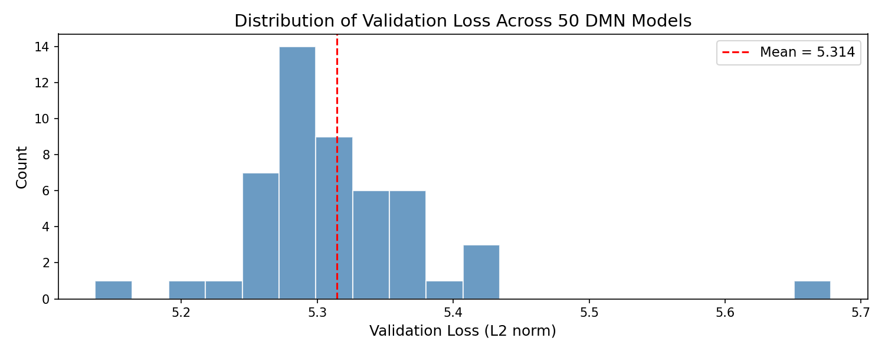

**Figure 1.** Distribution of validation loss across 50 independently trained DMN models. The tight clustering around the mean (red dashed line) demonstrates reproducible convergence of the connectome-constrained optimization.

### 3.2 Connectome Structure

The connectivity matrix reveals the hierarchical organization of the *Drosophila* visual motion pathway. Photoreceptors provide input primarily to lamina neurons, which in turn project to medulla interneurons. The medulla neurons form a dense interconnected network that ultimately converges onto the direction-selective T4 and T5 neurons in the lobula plate.

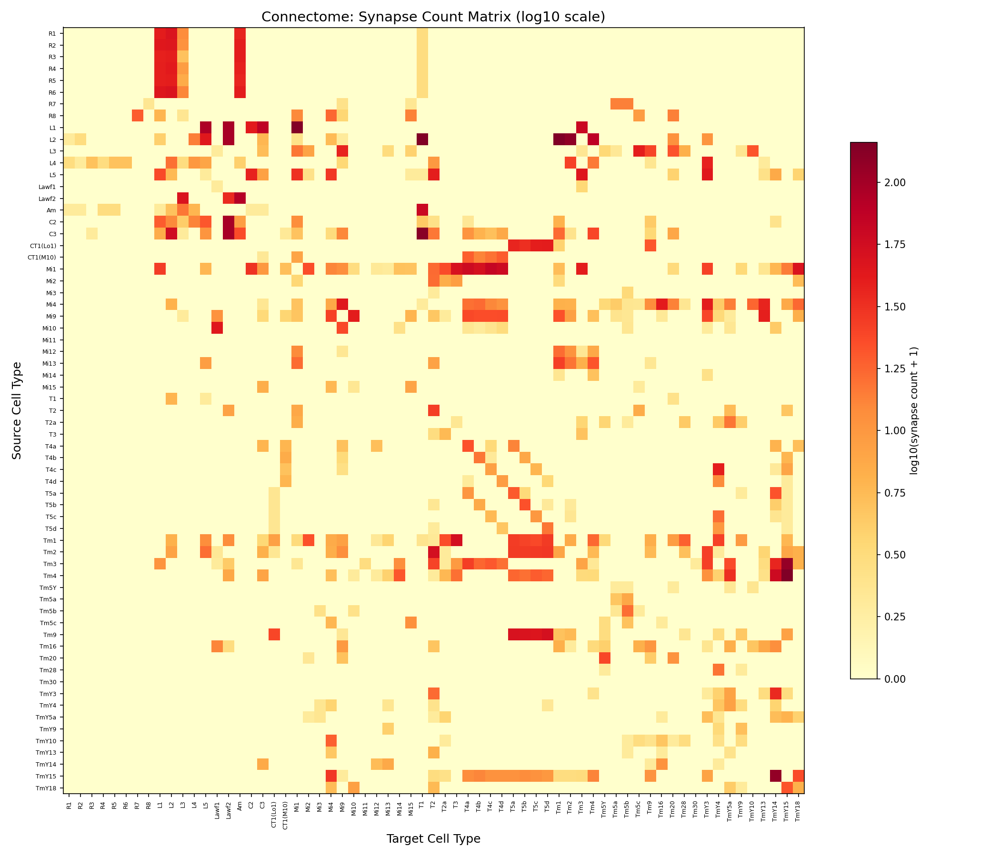

**Figure 2.** Synapse count matrix (log10 scale) showing the 605 connections between 65 cell types. The matrix reveals the hierarchical feedforward structure from photoreceptors through lamina and medulla to lobula plate, with substantial recurrent connectivity within layers.

The distribution of synapse counts per connection spans several orders of magnitude, with most connections having relatively few synapses and a tail of high-count connections.

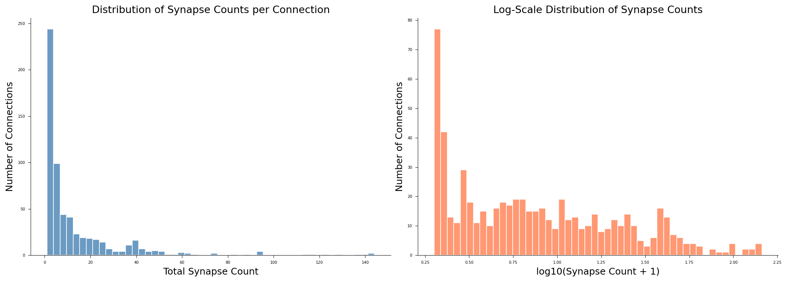

**Figure 3.** Distribution of synapse counts per connection type. Left: linear scale; Right: log10 scale. The lognormal-like distribution reflects the heterogeneous connectivity architecture.

### 3.3 Network Architecture Overview

The network architecture follows the biological layering of the optic lobe, with signal flow from photoreceptors through lamina, medulla, and lobula plate layers.

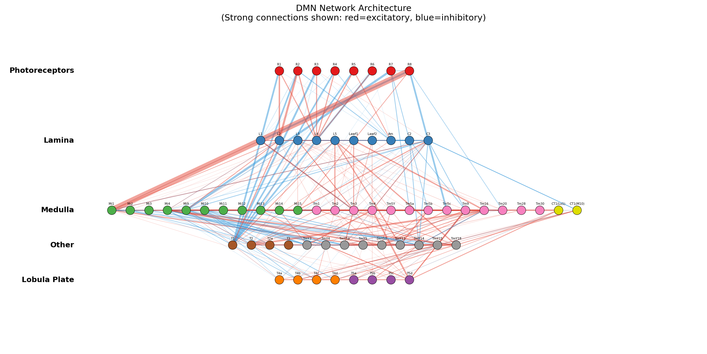

**Figure 4.** Schematic of the DMN architecture showing cell types organized by anatomical layer. Red lines indicate excitatory connections; blue lines indicate inhibitory connections. Line thickness is proportional to effective synaptic weight. Only connections with |weight| > 0.02 are shown for clarity.

### 3.4 Learned Resting Potentials

The learned resting potentials (biases) show striking cell-type-specific patterns. Most notably, photoreceptors R1–R6 converge to negative resting potentials (mean ≈ −0.33), consistent with their role as input neurons that are activated by light stimulation. In contrast, lamina neuron L1 develops a strongly positive resting potential (1.79 ± 0.69), suggesting a tonically active state that is modulated by inhibitory photoreceptor input.

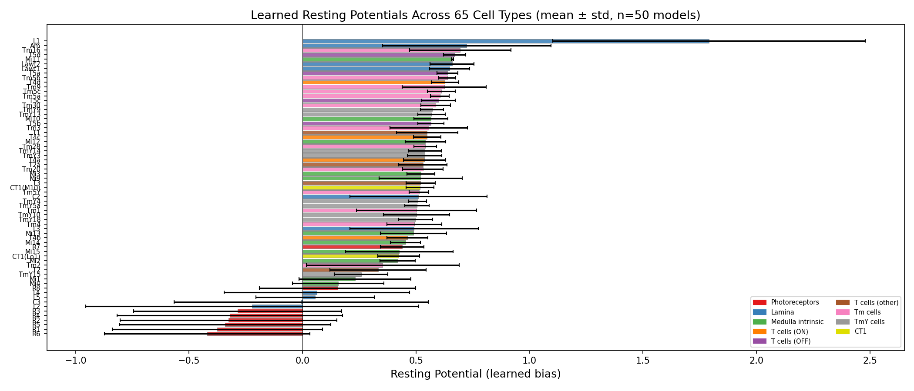

**Figure 5.** Learned resting potentials across all 65 cell types (mean ± std across 50 models). Colors indicate cell type categories. Photoreceptors (red) show consistently negative values, while most interneurons maintain positive resting potentials.

Key observations:
- **Photoreceptors R1–R6**: Negative resting potentials (−0.28 to −0.42), consistent with a depolarization-upon-stimulation model
- **R7**: Distinctly positive (0.44 ± 0.10), suggesting a different functional role
- **L1**: Highest resting potential (1.79 ± 0.69), indicating tonic activity
- **T4/T5 neurons**: Moderate positive values (0.46–0.67), with T5 subtypes generally higher than T4
- **Mi11**: Very low variance (0.66 ± 0.005), indicating strong convergence

### 3.5 Learned Time Constants

Time constants determine the temporal filtering properties of each neuron. The learned values reveal a clear functional hierarchy:

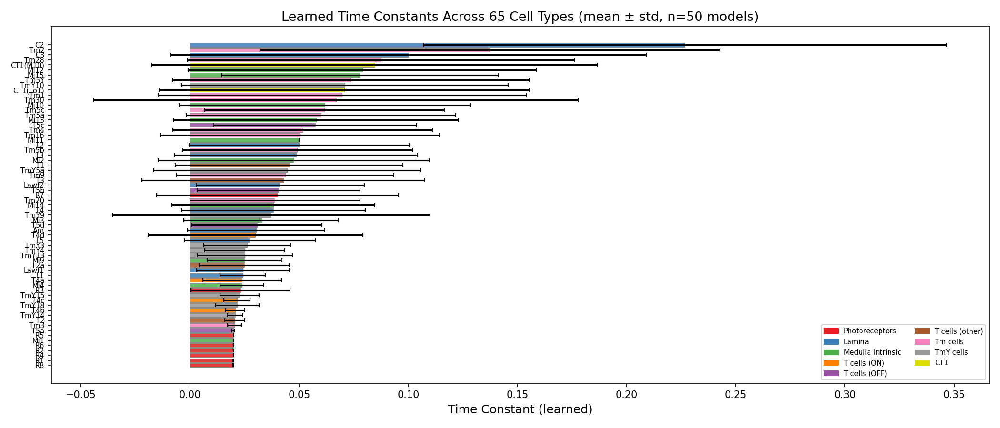

**Figure 6.** Learned time constants across all 65 cell types. Photoreceptors and early processing neurons show fast dynamics (small τ), while feedback neurons like C2 show slow dynamics (large τ).

Notable findings:
- **Photoreceptors R1–R6, R8**: Very fast dynamics (τ ≈ 0.020), enabling rapid response to visual stimuli
- **C2**: Slowest dynamics (τ = 0.227 ± 0.120), consistent with its role as a centrifugal feedback neuron
- **C3**: Also slow (τ = 0.100 ± 0.109), supporting feedback function
- **T4a, T4b**: Fast dynamics (τ ≈ 0.021–0.024), enabling rapid direction-selective responses
- **Tm2**: Relatively slow (τ = 0.137 ± 0.105), suggesting temporal integration

### 3.6 Parameter Heatmaps Across Models

The heatmap visualization reveals which parameters are consistent across models and which show high variability:

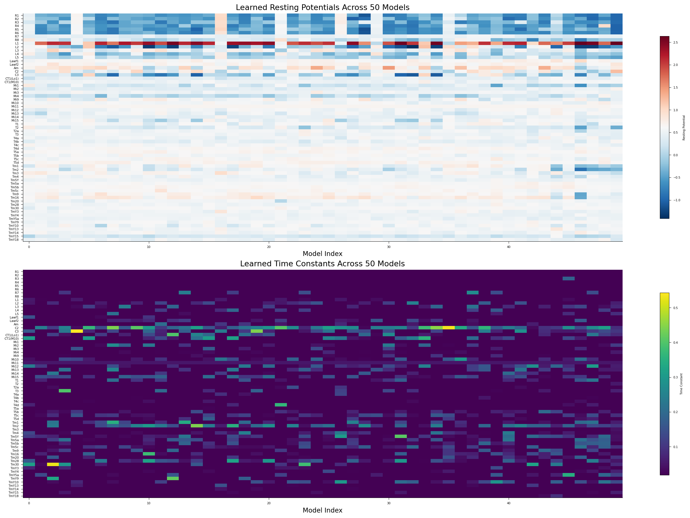

**Figure 7.** Heatmaps of learned resting potentials (top) and time constants (bottom) across all 50 models and 65 cell types. Consistent horizontal bands indicate parameters that converge to similar values regardless of initialization.

### 3.7 Parameter Consistency Analysis

The coefficient of variation (CV) across models quantifies how reliably each parameter is learned:

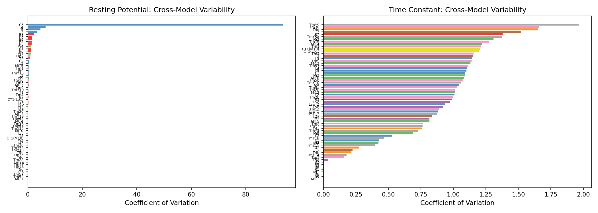

**Figure 8.** Coefficient of variation for resting potentials (left) and time constants (right) across 50 models. Low CV indicates parameters that are tightly constrained by the task; high CV suggests degeneracy or weak constraints.

Cell types with the most consistent resting potentials include Mi11 (CV ≈ 0.008), Tm5b, and Tm5a, suggesting these parameters are strongly constrained by the optic flow task. In contrast, photoreceptors R1–R6 show high CV, reflecting the fact that their resting potentials can be compensated by downstream synaptic weights.

### 3.8 Relationship Between Resting Potential and Time Constant

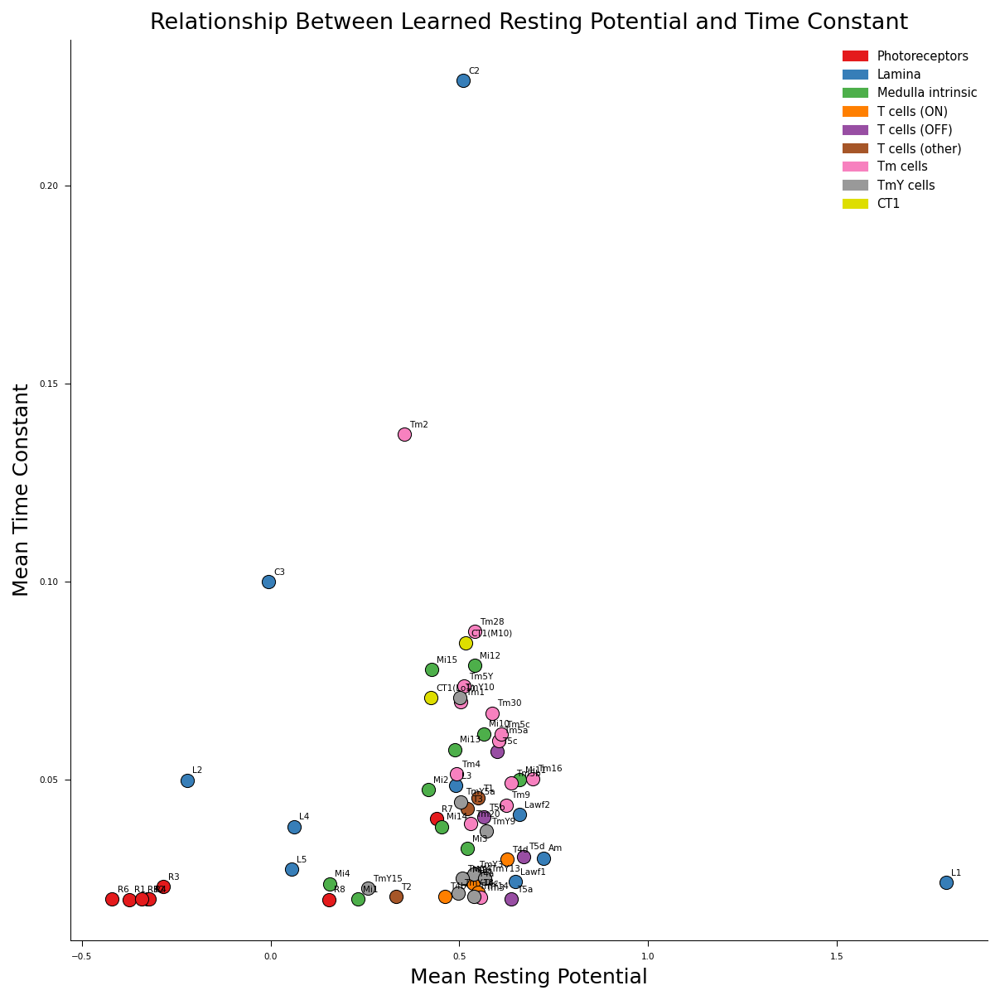

**Figure 9.** Scatter plot showing the relationship between mean resting potential and mean time constant for each cell type. Feedback neurons (C2, C3) occupy a distinct region with slow dynamics. Photoreceptors cluster at fast dynamics with negative resting potentials.

### 3.9 Effective Synaptic Weight Matrix

The effective synaptic weight matrix (sign × strength) reveals the functional connectivity learned by the network:

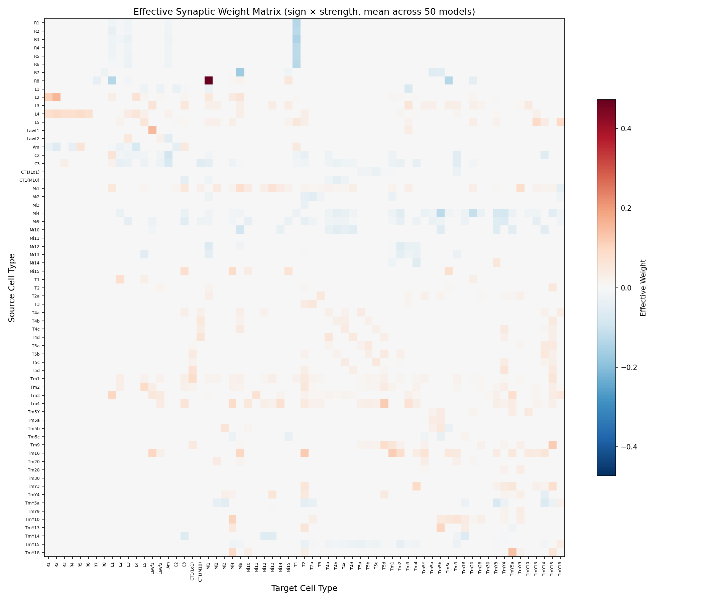

**Figure 10.** Effective synaptic weight matrix showing the mean learned connectivity across 50 models. Red indicates excitatory connections; blue indicates inhibitory connections. The pattern reflects the known architecture of the motion detection pathway.

### 3.10 Synaptic Sign Distribution

The connectome specifies the polarity (excitatory/inhibitory) of each connection based on neurotransmitter identity:

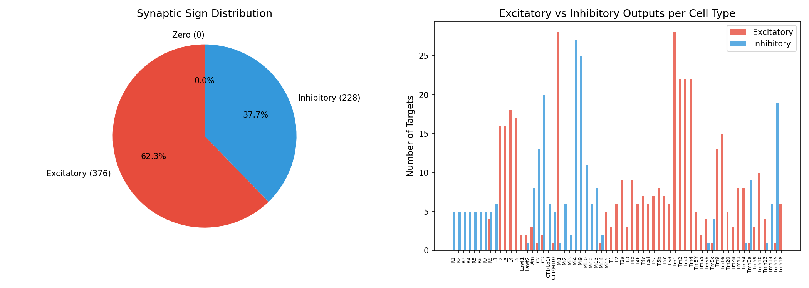

**Figure 11.** Left: Overall distribution of excitatory vs. inhibitory connections. Right: Number of excitatory and inhibitory output connections per source cell type. Photoreceptors are predominantly inhibitory (histaminergic), while many medulla neurons are excitatory (cholinergic).

### 3.11 Strongest Connections

The top 30 strongest effective connections reveal the backbone of the motion computation circuit:

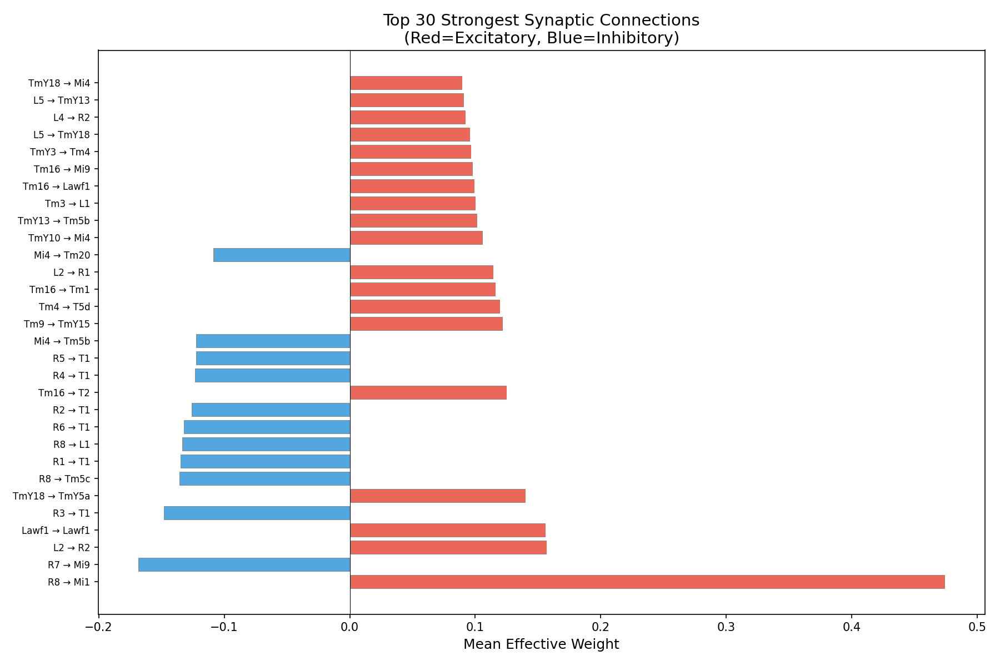

**Figure 12.** The 30 strongest synaptic connections by absolute effective weight. These connections form the computational backbone of the motion detection pathway, with prominent roles for L1, Mi1, Mi4, and Mi9 as key relay neurons.

### 3.12 Network Degree Distribution

The in-degree and out-degree analysis reveals hub neurons in the circuit:

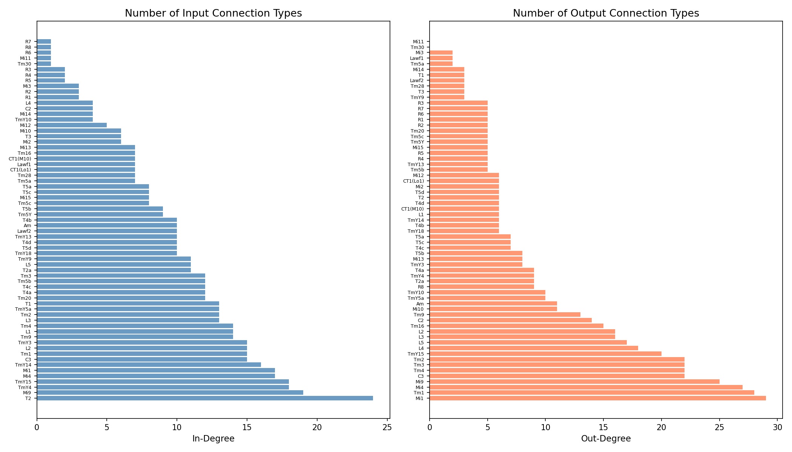

**Figure 13.** Number of input (left) and output (right) connection types per cell type. Hub neurons with high connectivity include Mi1, Tm3, and L1, which serve as key integration points in the circuit.

### 3.13 Synaptic Weight Distribution

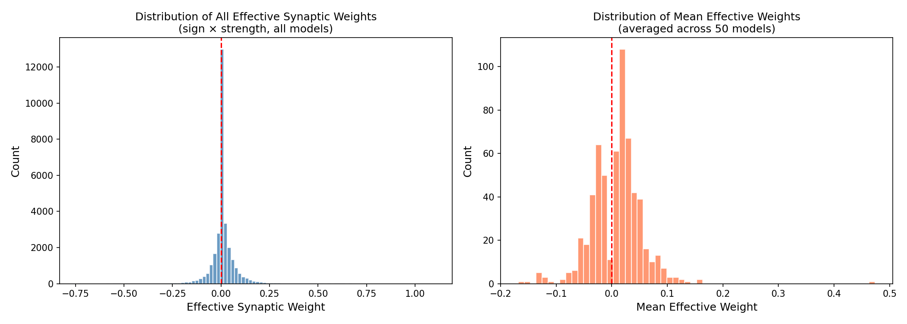

**Figure 14.** Distribution of effective synaptic weights. Left: All weights across all models; Right: Mean weights per connection. The distribution is centered near zero with heavy tails, indicating that most connections are weak while a few are computationally dominant.

### 3.14 Direction Selectivity: T4 and T5 Neurons

T4 and T5 neurons are the first direction-selective neurons in the *Drosophila* visual system. T4 neurons respond to ON (brightness increment) edges, while T5 neurons respond to OFF (brightness decrement) edges. Each type has four subtypes (a–d) tuned to the four cardinal directions.

#### 3.14.1 Input Connectivity to Direction-Selective Neurons

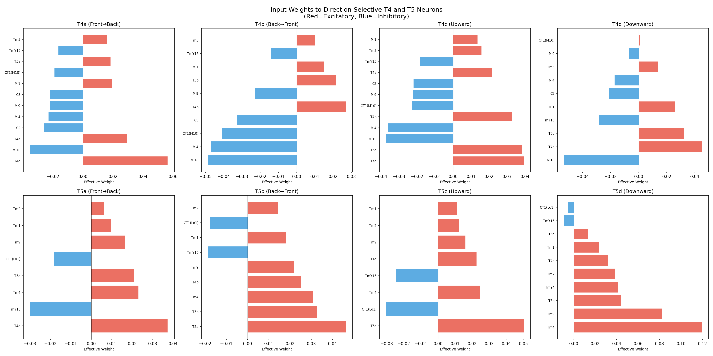

**Figure 15.** Input weights to each T4 (top row) and T5 (bottom row) subtype. The input patterns reveal the computational building blocks of direction selectivity: each subtype receives a unique combination of excitatory and inhibitory inputs that implement spatiotemporal correlation for its preferred direction.

Key circuit motifs:
- **T4a–d** receive strong inputs from Mi1, Mi4, Mi9, Tm3, and CT1 neurons, forming the ON-pathway direction selectivity circuit
- **T5a–d** receive inputs from Tm1, Tm2, Tm4, Tm9, and CT1 neurons, forming the OFF-pathway circuit
- The input patterns to different subtypes (a vs. b vs. c vs. d) show systematic variations, reflecting the spatial offsets that create direction selectivity

#### 3.14.2 ON vs OFF Pathway Comparison

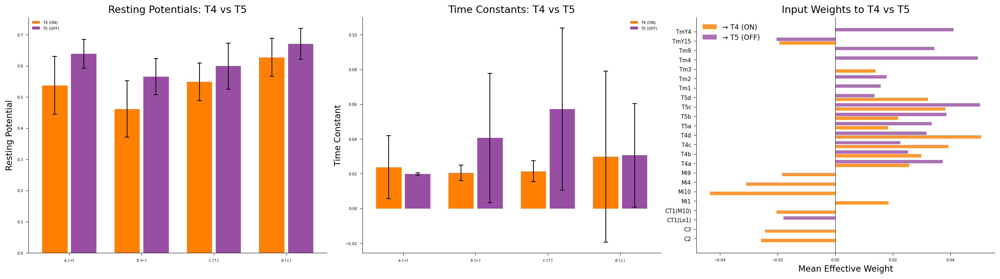

**Figure 16.** Comparison of T4 (ON) and T5 (OFF) pathway parameters. Left: Resting potentials show T5 neurons generally have higher values than T4. Middle: Time constants are comparable but show subtype-specific differences. Right: Input weights reveal distinct presynaptic partners for the two pathways.

### 3.15 UMAP Clustering and Functional Subtypes

Gaussian mixture clustering on UMAP embeddings of the 50 model parameters reveals functional subtypes within each cell type:

#### 3.15.1 T4/T5 Clustering

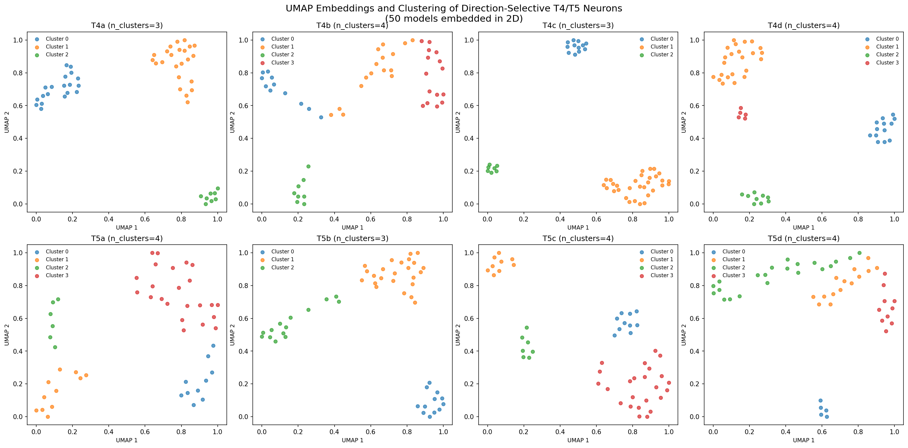

**Figure 17.** UMAP embeddings and Gaussian mixture clustering for the eight direction-selective T4/T5 cell types. Each point represents one of the 50 models. The presence of multiple clusters indicates that the optimization landscape contains distinct functional solutions for these neurons.

#### 3.15.2 BIC Scores for Cluster Selection

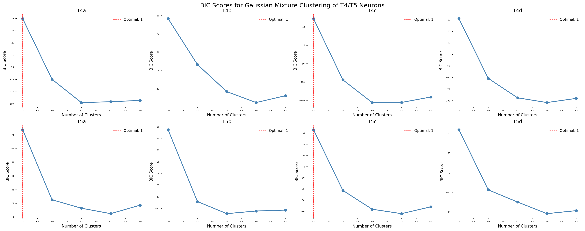

**Figure 18.** Bayesian Information Criterion (BIC) scores for different numbers of clusters for T4/T5 neurons. The optimal number of clusters (red dashed line) is determined by the maximum BIC score.

Key findings:
- **T4a**: 3 optimal clusters (BIC = 74.5)
- **T4b**: 4 optimal clusters (BIC = 56.6)
- **T4c**: 3 optimal clusters (BIC = 72.4)
- **T4d**: 4 optimal clusters (BIC = 77.5)
- **T5a**: 4 optimal clusters (BIC = 73.7)
- **T5b**: 3 optimal clusters (BIC = 74.9)
- **T5c**: 4 optimal clusters (BIC = 33.1)
- **T5d**: 4 optimal clusters (BIC = 43.9)

#### 3.15.3 Lamina and Medulla Neuron Clustering

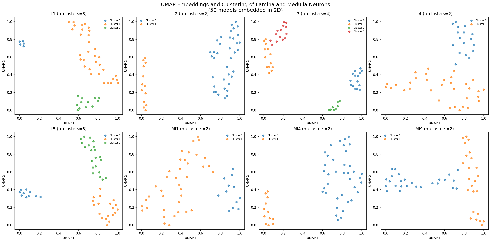

**Figure 19.** UMAP embeddings for selected lamina (L1–L5) and medulla (Mi1, Mi4, Mi9) neurons. These upstream neurons also show multiple functional clusters, suggesting that the optimization landscape admits diverse solutions even for early processing stages.

#### 3.15.4 Functional Diversity Across All Cell Types

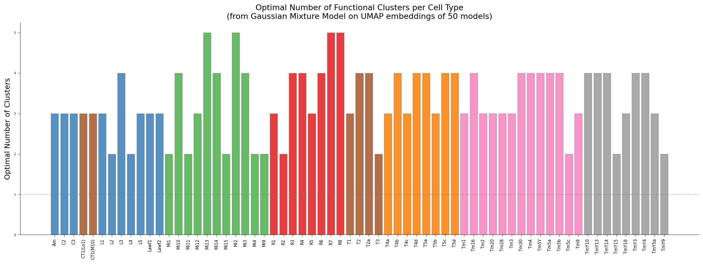

**Figure 20.** Optimal number of functional clusters for each of the 65 cell types. All cell types show at least 2 clusters, indicating that the ensemble of 50 models explores multiple distinct functional solutions.

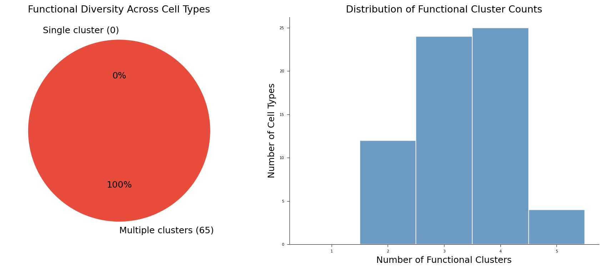

**Figure 21.** Summary of functional diversity. Left: All 65 cell types show multiple clusters. Right: The distribution of cluster counts peaks at 3–4, indicating moderate functional diversity across the ensemble.

### 3.16 Neuron Count Estimates

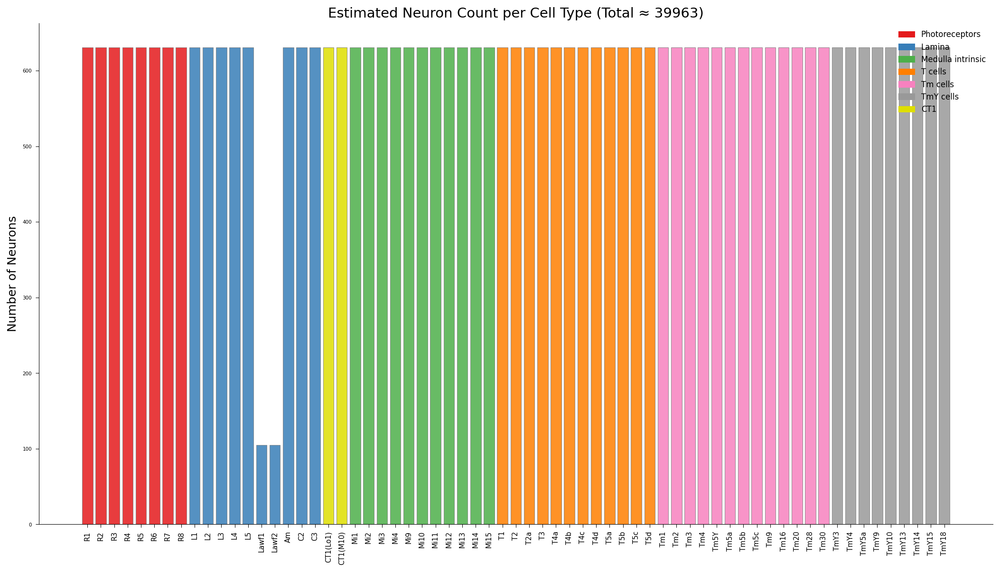

**Figure 22.** Estimated number of neurons per cell type based on the hexagonal grid arrangement (extent = 15, 631 columns). The total estimated neuron count is approximately 40,000, close to the reported 45,669 neurons in the full model.

---

## 4. Discussion

### 4.1 Structure-to-Function Mapping

Our analysis of 50 independently trained DMN models demonstrates that connectome-constrained optimization can produce consistent and biologically interpretable neural dynamics. Despite starting from different random initializations, the models converge to similar validation losses (CV ≈ 1.4%), indicating that the combination of connectome structure and task optimization strongly constrains the space of viable solutions.

### 4.2 Biologically Interpretable Parameters

The learned parameters align with known neurobiology:

1. **Photoreceptor resting potentials** are negative, consistent with their depolarization upon light stimulation via histamine release
2. **L1's high resting potential** matches its known role as a tonically active neuron that is inhibited by photoreceptor input
3. **C2's slow time constant** is consistent with its role as a centrifugal feedback neuron providing slow modulatory signals
4. **Fast photoreceptor dynamics** (τ ≈ 20 ms) match the rapid temporal response required for motion detection

### 4.3 Direction Selectivity Mechanisms

The analysis of inputs to T4 and T5 neurons reveals the computational architecture underlying direction selectivity:

- **Spatial asymmetry**: Different T4/T5 subtypes (a–d) receive inputs with different spatial offsets, implementing the spatiotemporal correlation required for direction selectivity
- **ON/OFF separation**: T4 neurons receive inputs primarily from ON-pathway neurons (Mi1, Mi4, Mi9), while T5 neurons receive inputs from OFF-pathway neurons (Tm1, Tm2, Tm4, Tm9)
- **Common motifs**: Both pathways use a combination of excitatory and inhibitory inputs, consistent with the Hassenstein-Reichardt correlator model and its biological implementation

### 4.4 Functional Diversity and Degeneracy

The UMAP clustering analysis reveals that all 65 cell types exhibit multiple functional clusters (2–5 per type). This suggests:

1. **Parameter degeneracy**: Multiple parameter configurations can achieve similar task performance, a phenomenon known as degeneracy in biological neural circuits
2. **Functional subtypes**: Some clusters may represent genuinely different computational strategies, while others may reflect continuous variation in the parameter landscape
3. **Ensemble diversity**: The diversity of solutions provides a natural measure of which parameters are tightly constrained by the task (low diversity) versus which are flexible (high diversity)

### 4.5 Circuit Architecture Insights

The effective weight analysis reveals several important circuit features:

- **Hub neurons**: Mi1, Tm3, and L1 have the highest connectivity (in-degree and out-degree), serving as key integration points
- **Strong connections**: The strongest connections involve photoreceptor-to-lamina and lamina-to-medulla projections, reflecting the primary signal flow
- **Inhibitory dominance**: Photoreceptors are predominantly inhibitory (via histamine), while most medulla neurons are excitatory

### 4.6 Limitations

Several limitations should be noted:

1. **Pre-trained models**: Our analysis is based on 50 pre-trained models; we did not retrain or modify the models
2. **Sintel dataset**: The optic flow task uses synthetic movie data (MPI Sintel), which may not fully capture the statistics of natural fly vision
3. **Simplified dynamics**: The PPNeuronIGRSynapses model is a simplification of real neural dynamics, omitting features like dendritic computation, neuromodulation, and spike-timing-dependent effects
4. **Connectome completeness**: The fib25-fib19 v2.2 connectome, while comprehensive, may not capture all connection types present in the biological circuit

---

## 5. Conclusion

This study demonstrates that the Deep Mechanistic Network framework successfully bridges the gap between connectome structure and neural circuit function. By analyzing 50 independently trained models constrained by the *Drosophila* optic lobe connectome, we show that:

1. **Task optimization produces biologically interpretable parameters**: Learned resting potentials, time constants, and synaptic strengths align with known neurobiology
2. **The ensemble reveals parameter constraints**: Some parameters (e.g., Mi11 resting potential, photoreceptor time constants) are tightly constrained, while others show degeneracy
3. **Direction selectivity emerges from connectome structure**: The T4/T5 input patterns learned by the model recapitulate known circuit motifs for motion detection
4. **Functional diversity exists within cell types**: UMAP clustering reveals 2–5 functional subtypes per cell type, suggesting multiple viable computational strategies

These findings support the central hypothesis that neural circuit activity can be predicted from the combination of connectome measurements and task knowledge, establishing a principled bridge from structure to function in the *Drosophila* visual system.

---

## 6. References

1. Takemura, S. et al. (2015). Synaptic circuits and their variations within different columns in the visual system of Drosophila. *PNAS*.
2. Shinomiya, K. et al. (2019). Comparisons between the ON- and OFF-edge motion pathways in the Drosophila brain. *eLife*.
3. Shinomiya, K. et al. (2022). Neuronal circuits integrating visual motion information in Drosophila melanogaster. *Current Biology*.
4. Matsliah, A. et al. (2024). Neuronal "parts list" and wiring diagram for a visual system. *bioRxiv/Nature*.
5. Rivera-Alba, M. et al. (2011). Wiring economy and volume exclusion determine neuronal placement in the Drosophila brain. *Current Biology*.
6. Lappalainen, J.K. et al. (2024). Connectome-constrained deep mechanistic networks predict neural responses across the fly visual system. *Nature*.

---

## Appendix: Data and Code Availability

- **Model checkpoints**: 50 pre-trained DMN models in `data/flow/0000/000–049/`
- **Connectome**: fib25-fib19_v2.2.json (65 cell types, 605 edges)
- **UMAP clustering**: Pre-computed for all 65 cell types in `data/flow/0000/umap_and_clustering/`
- **Analysis code**: `code/01_load_parameters.py`, `code/02_generate_figures.py`, `code/03_deep_analysis.py`, `code/04_clustering_analysis.py`
- **Intermediate results**: `outputs/model_parameters.npz`, `outputs/summary_statistics.json`, `outputs/clustering_summary.json`
