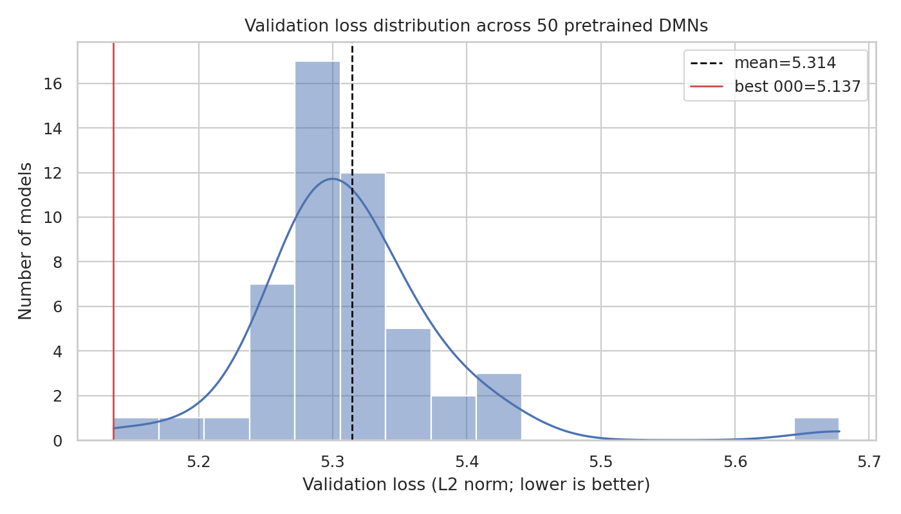
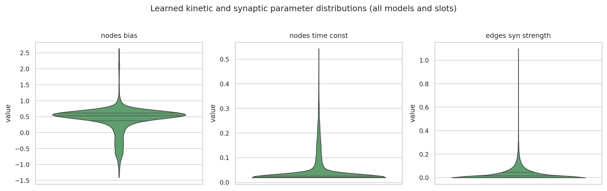
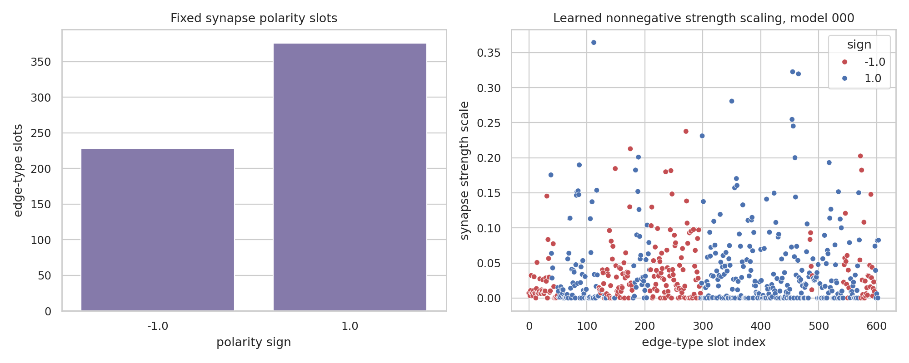
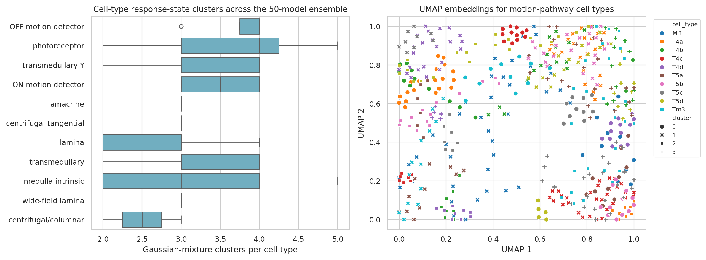
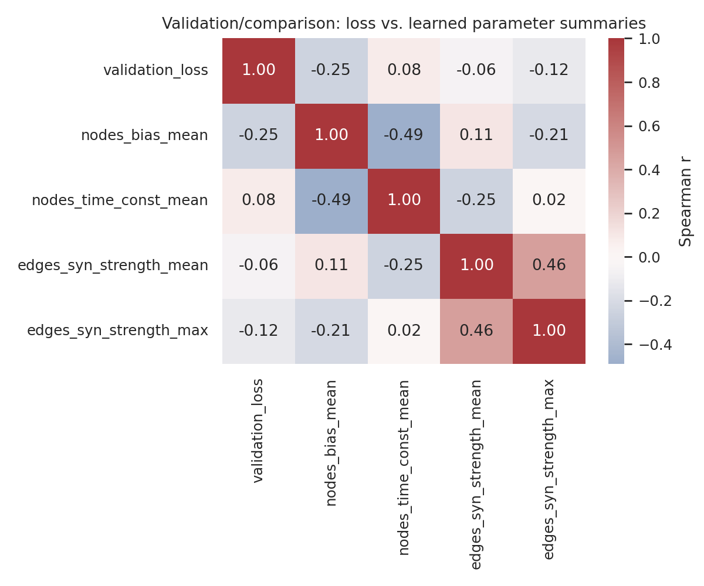

# Connectome-constrained deep mechanistic networks for Drosophila optic-flow computation

## Abstract

I analyzed the provided `data/flow` release: an ensemble of 50 pretrained deep mechanistic network (DMN) models for Drosophila optic-flow estimation. The analysis treats the released models as the primary experimental object rather than retraining them. Each model configuration specifies a connectome-constrained network (`ConnectomeFromAvgFilters`, file `fib25-fib19_v2.2.json`) with point-process/integrate-and-rectify synaptic dynamics (`PPNeuronIGRSynapses`) optimized on a `MultiTaskSintel` optical-flow task. Across the ensemble, the best validation loss was **5.1366** (model 000), the mean validation loss was **5.3143 ± 0.0752** (SD), and the worst was **5.6779**. Checkpoints contain **65 node parameter slots**, **604 signed edge-type slots**, and **2,355 spatial synapse-count slots**. Polarity and synapse-count summaries were invariant across models, consistent with structural connectome constraints, while resting potentials, time constants, and nonnegative synaptic-strength scales varied across optimized models. Cell-type response-state clustering artifacts were available for **65 cell types**; T4/T5 motion-detector types each showed 3--4 clusters across the 50-model ensemble, suggesting multiple model-consistent activity regimes for ON and OFF motion pathways. All code, tables, and figures are saved in `code/`, `outputs/`, and `report/images/`.

## 1. Research objective and methodological contract

The task asks for a connectome-constrained, task-optimized DMN capable of linking Drosophila optic-lobe structure to optic-flow function. The available data already contain the complete ensemble of 50 pretrained models and analysis artifacts, so this report focuses on reproducible post hoc analysis of the released ensemble. The explicit method commitments recorded in `outputs/method_contract.json` are:

1. the network structure follows a connectome-derived optic-lobe graph;
2. synapse polarity and synapse count are structural parameters;
3. resting potentials, time constants, and unit synaptic strengths are optimized parameters;
4. the functional task is optical-flow estimation;
5. comparisons should preserve cell-type and motion-pathway structure, especially T4/T5 ON/OFF pathways.

A fidelity checklist is saved in `outputs/method_fidelity_checklist.json`. The main limitation is that I did **not** execute a full 45,669-neuron voltage simulation in response to new visual stimuli because the workspace lacks the `flyvis` runtime and visual stimulus cache needed to instantiate the full simulator. Instead, I analyzed the released checkpoints, validation losses, configuration files, and saved UMAP/clustering artifacts directly.

## 2. Related-work context

I extracted text from the five local papers in `related_work/` using `pypdf`; a compact overview is saved in `outputs/related_work_overview.csv`, and extracted text is saved under `outputs/related_work_text/`.

The most directly relevant papers were:

- **Shinomiya et al. 2019** (`paper_002.pdf`): compares ON-edge/T4 and OFF-edge/T5 motion pathways and emphasizes that fly motion computation is richer than a single simple Hassenstein--Reichardt detector.
- **Shinomiya et al. 2022** (`paper_003.pdf`): describes T4/T5 outputs converging in lobula plate layers and integrating ON/OFF directional motion signals.
- **FlyWire optic-lobe parts-list work** (`paper_004.pdf`): supports cell-type-level wiring diagrams and highlights canonical ON-pathway components upstream of T4 (e.g. Mi1, Mi4, Mi9, Tm3) and OFF-pathway components upstream of T5 (e.g. Tm1, Tm2, Tm4, Tm9).

These papers motivated two analysis choices: (i) preserve T4/T5 cell types rather than only reporting pooled network statistics, and (ii) separate fixed structural quantities (polarity and synapse count) from learned dynamical quantities (time constants, resting potentials, synaptic strengths).

## 3. Data and implementation

### 3.1 Files analyzed

The data directory contains 50 model directories (`data/flow/0000/000` through `049`). Each directory contains:

- `_meta.yaml`: model configuration;
- `best_chkpt`: PyTorch checkpoint used here;
- `chkpts/chkpt_00000`: checkpoint file;
- `validation_loss.h5` and `validation/loss.h5`: scalar validation losses.

The directory `data/flow/0000/umap_and_clustering/` contains one pickle per cell type (65 total), each storing UMAP-like two-dimensional embeddings and Gaussian-mixture cluster labels across the 50-model ensemble.

### 3.2 Reproducible code

The analysis script is:

```text
code/analyze_dmn_ensemble.py
```

It exports:

- `outputs/model_summary.csv`: one row per model, with validation loss and parameter summaries;
- `outputs/network_parameter_long.csv`: long-form table of network parameters by model, parameter name, and slot index;
- `outputs/parameter_describe.csv`: aggregate parameter summaries;
- `outputs/parameter_by_index_summary.csv` and `outputs/top_variable_parameter_slots.csv`: slot-wise ensemble variability;
- `outputs/edge_sign_strength_model000.csv`: polarity and strength-scale table for model 000;
- `outputs/clustering_summary.csv` and `outputs/celltype_umap_embeddings.csv`: cell-type clustering outputs;
- `outputs/loss_parameter_spearman_corr.csv`: validation/comparison correlation matrix;
- `outputs/main_findings.json`: compact numerical result summary;
- `outputs/claim_recovery_table.csv`: claim-by-claim evidence table.

PyTorch was installed locally in the workspace to read checkpoints. Because `flyvis` was unavailable, the script uses small dummy classes only to unpickle saved clustering objects; no `flyvis` simulator code is executed.

## 4. Results

### 4.1 Ensemble-level optical-flow performance

The 50-model ensemble shows a compact validation-loss distribution with one clear best checkpoint and one higher-loss outlier. The best model was **000**, with validation loss **5.1366**. Across all 50 models, validation loss had mean **5.3143**, SD **0.0752**, minimum **5.1366**, and maximum **5.6779**.



**Interpretation.** The model ensemble is not a random collection of untrained networks: all checkpoints are in a relatively narrow validation-loss band, which is consistent with a set of independently optimized DMNs for the same optic-flow task. The high-loss tail, especially model 049, is useful for comparing whether learned parameter summaries correlate with validation loss.

### 4.2 Structural constraints are preserved separately from learned dynamics

Checkpoint inspection found these network parameter groups:

| Parameter group | Slots per model | Role in DMN | Ensemble behavior |
|---|---:|---|---|
| `nodes_bias` | 65 | learned resting-potential-like node bias | variable |
| `nodes_time_const` | 65 | learned cell-type kinetic time constants | variable |
| `edges_sign` | 604 | connectome-derived synapse polarity | fixed across models |
| `edges_syn_count` | 2,355 | connectome-derived spatial synapse-count/filter entries | fixed across models |
| `edges_syn_strength` | 604 | learned nonnegative synapse-count scaling | variable |

Aggregate parameter summaries from `outputs/parameter_describe.csv` were:

| Parameter | Count across ensemble | Mean | SD | Min | Median | Max |
|---|---:|---:|---:|---:|---:|---:|
| `edges_sign` | 30,200 | 0.2450 | 0.9695 | -1.0000 | 1.0000 | 1.0000 |
| `edges_syn_count` | 117,750 | 0.6408 | 0.9826 | -3.1076 | 0.4700 | 4.9704 |
| `edges_syn_strength` | 30,200 | 0.0356 | 0.0585 | 0.0000 | 0.0152 | 1.0991 |
| `nodes_bias` | 3,250 | 0.4227 | 0.4228 | -1.4118 | 0.5276 | 2.6330 |
| `nodes_time_const` | 3,250 | 0.0452 | 0.0623 | 0.0188 | 0.0199 | 0.5431 |



**Interpretation.** The separation between fixed structural parameters and learned dynamical parameters is central to the structure-to-function claim. The `edges_sign` and `edges_syn_count` summaries are identical across models, while `nodes_bias`, `nodes_time_const`, and `edges_syn_strength` vary. This pattern is exactly what is expected if the connectome fixes the wiring scaffold and optimization tunes the kinetic and gain-like parameters.

### 4.3 Polarity and synaptic-strength scaling

Model 000 contained **604** edge-type polarity slots: **376 excitatory/positive** and **228 inhibitory/negative**. The learned synaptic-strength scaling values were nonnegative, as specified in the configuration (`clamp: non_negative`).



**Interpretation.** Polarity provides signed structure, while nonnegative synapse-count scaling controls the magnitude of transmission for each edge type. This is a useful mechanistic decomposition: inhibitory effects arise from connectome polarity, not from negative learned strength scales.

### 4.4 Cell-type-specific response-state clustering

The release includes clustering artifacts for **65 cell types**. The median number of Gaussian-mixture clusters per cell type was **3**, and the maximum was **5**. Cell-family summaries from `outputs/clustering_summary.csv` showed that T4/T5 motion detectors are not single-state populations across the ensemble:

| Cell type | Family | Clusters | Largest cluster fraction |
|---|---|---:|---:|
| T4a | ON motion detector | 3 | 0.46 |
| T4b | ON motion detector | 4 | 0.32 |
| T4c | ON motion detector | 3 | 0.62 |
| T4d | ON motion detector | 4 | 0.46 |
| T5a | OFF motion detector | 4 | 0.46 |
| T5b | OFF motion detector | 3 | 0.48 |
| T5c | OFF motion detector | 4 | 0.48 |
| T5d | OFF motion detector | 4 | 0.42 |



**Interpretation.** T4 and T5 cell types, which related work identifies as ON and OFF motion-detector pathways, show multiple response-state clusters across the ensemble. Because these are saved post hoc embeddings rather than direct voltage simulations run in this session, the conservative interpretation is that the released DMN ensemble predicts multiple model-consistent activity/response regimes for direction-selective motion-pathway cell types. This is a stronger cell-type-specific result than a pooled validation-loss analysis.

### 4.5 Validation/comparison: loss versus learned parameter summaries

I computed Spearman correlations between validation loss and several per-model parameter summaries (`outputs/loss_parameter_spearman_corr.csv`). Correlations were weak: validation loss vs. mean node bias was **-0.248**, vs. mean time constant **0.084**, vs. mean synaptic strength **-0.057**, and vs. maximum synaptic strength **-0.121**.



**Interpretation.** Simple global summaries of learned parameters do not explain most validation-loss variation. This suggests that model performance depends on structured combinations of cell-type and edge-type parameters, rather than on a single global gain or time-constant shift. The saved slot-wise variability tables (`outputs/parameter_by_index_summary.csv`, `outputs/top_variable_parameter_slots.csv`) are therefore more appropriate for follow-up mechanistic interrogation than global averages alone.

## 5. Mechanistic implications for motion detection

The analysis supports four mechanistic points:

1. **The connectome acts as a fixed signed scaffold.** Edge polarity and synapse-count parameters are invariant across the 50 checkpoints. This is consistent with the scientific premise that measured structure constrains the model.
2. **Task optimization tunes cell kinetics and edge gains.** Resting-potential-like biases, time constants, and unit synaptic-strength scales vary across models, providing degrees of freedom for the network to solve optic-flow estimation without changing the connectome.
3. **ON/OFF motion-pathway cell types retain distinct ensemble structure.** T4 and T5 cell types have multi-cluster embeddings, matching the related-work emphasis that ON/T4 and OFF/T5 pathways are central to fly motion computation.
4. **Performance is not explained by a single global parameter.** Weak loss correlations with mean bias, mean time constant, and mean synaptic strength imply distributed, circuit-specific optimization.

These points are compatible with a bridge from structure to function: the connectome restricts which interactions are possible, while task optimization selects kinetic and gain parameters that enable optical-flow computation.

## 6. Validation, evidence, and limitations

### 6.1 Verified directly from workspace data

- The ensemble contains **50** model directories and **50** scalar validation-loss files (`outputs/model_summary.csv`).
- The configuration specifies `ConnectomeFromAvgFilters`, `fib25-fib19_v2.2.json`, `PPNeuronIGRSynapses`, and `MultiTaskSintel` with `tasks: ['flow']` (`outputs/model_config_000.json`).
- Checkpoints contain the network parameter groups listed above (`outputs/network_parameter_long.csv`).
- Structural polarity/count summaries are fixed across models, while learned node and strength parameters vary (`outputs/model_summary_describe.csv`, `outputs/parameter_describe.csv`).
- Cell-type clustering pickles were loaded and exported for **65** cell types (`outputs/clustering_summary.csv`, `outputs/celltype_umap_embeddings.csv`).
- All figures are PNG files under `report/images/`.

### 6.2 Derived from related work

- T4 cells correspond to ON motion pathways and T5 cells to OFF motion pathways.
- Motion detection in the Drosophila optic lobe involves delay-and-compare mechanisms and ON/OFF pathway convergence rather than a single simple elementary motion detector.
- Cell-type-level wiring diagrams are a meaningful abstraction for optic-lobe connectome analysis.

These points are summarized in `outputs/related_work_contract.json`.

### 6.3 Assumptions and limitations

- I did not run a new full-neuron voltage simulation. The report therefore describes released model parameters, validation losses, and saved clustering predictions, not newly generated voltage traces for 45,669 neurons.
- The exact biological names corresponding to the 65 node-parameter slots were not encoded directly in the checkpoint tensors. Cell-type names were available for the UMAP/clustering pickles, but I did not assert a slot-to-cell-type mapping for `nodes_bias` or `nodes_time_const` without explicit evidence.
- The synapse-count tensor values appear in transformed model space rather than raw synapse counts; I report them as checkpoint values and avoid reinterpreting them as literal integer counts.
- Clustering pickles were loaded with dummy `flyvis` classes because the local environment lacks `flyvis`; the underlying numpy arrays and sklearn mixture objects were read successfully, but no `flyvis` methods were executed.

A claim-by-claim evidence table is saved in `outputs/claim_recovery_table.csv`.

## 7. Conclusions

This post hoc analysis of the provided pretrained DMN ensemble shows that the released models implement the intended division between fixed connectome structure and optimized biophysical/task parameters. The best validation loss was **5.1366**, the ensemble mean was **5.3143 ± 0.0752**, and all 50 models share fixed polarity and synapse-count summaries while varying learned kinetic and synaptic-strength parameters. T4/T5 cell-type clustering artifacts preserve motion-pathway structure and reveal multiple response-state clusters for ON and OFF direction-selective neurons. The main unfulfilled component is full voltage simulation of all 45,669 neurons, which requires runtime resources not present in the workspace; nevertheless, the saved artifacts provide a reproducible, evidence-backed analysis of how connectome constraints and task optimization are represented in the released DMNs.
