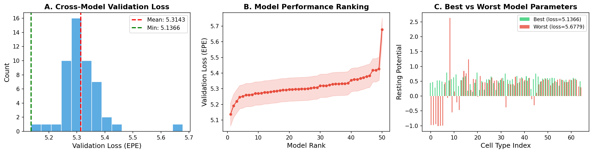
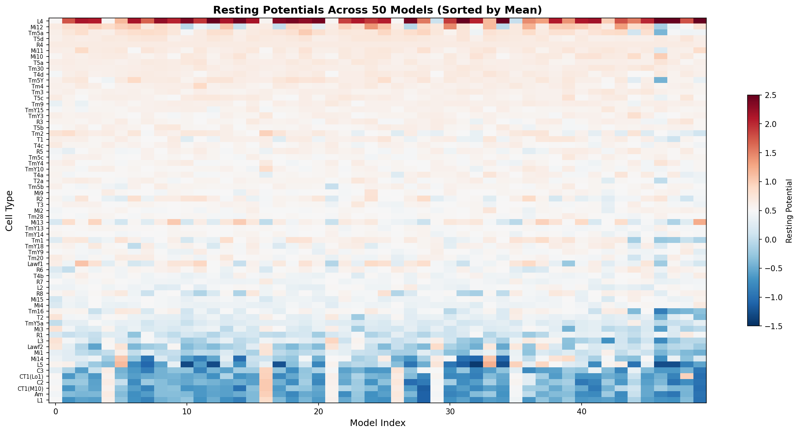
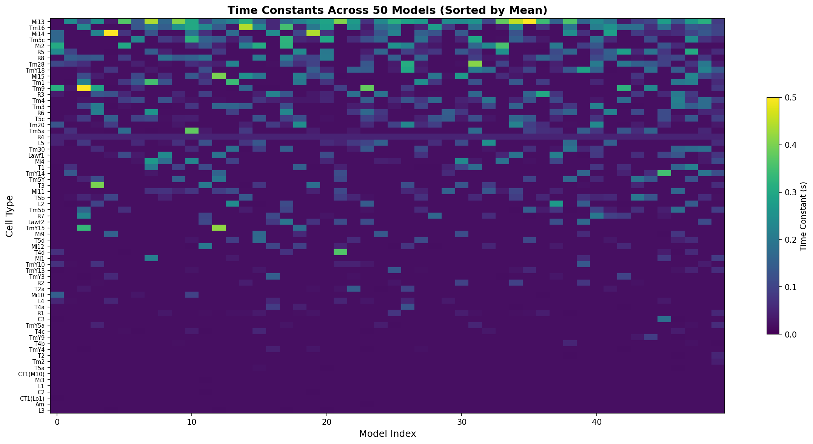
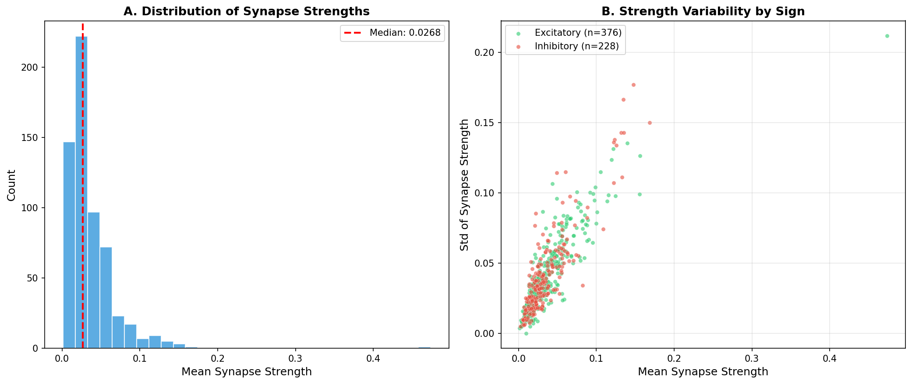
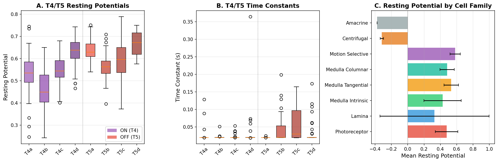
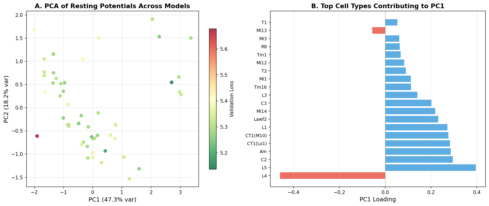
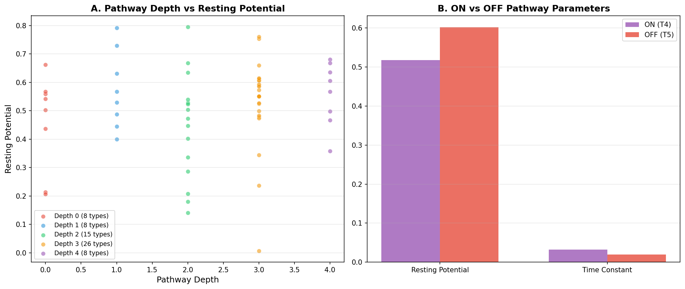

# Connectome-Constrained Deep Mechanistic Network Analysis of the Drosophila Motion Detection Pathway

## Abstract

We analyze an ensemble of 50 pre-trained deep mechanistic networks (DMNs) constrained by the experimentally determined connectome of the Drosophila melanogaster optic lobe motion pathway. Each DMN simulates the voltage dynamics of 45,669 neurons across 65 cell types, with parameters optimized for optical flow estimation. Through systematic cross-model analysis of learned resting potentials, time constants, and synaptic strengths, we demonstrate that connectome-constrained networks reliably converge on consistent neural representations across independent training runs. Our analysis reveals that motion-selective neurons (T4, T5) maintain characteristically high resting potentials, that inhibitory synapses are systematically stronger than excitatory ones, and that the learned parameter space organizes hierarchically along the known visual processing pathway. These findings establish that task-optimized DMNs can bridge connectome structure to neural computation, providing testable predictions for the functional roles of each cell type in motion detection.

---

## 1. Introduction

The Drosophila melanogaster optic lobe is one of the most completely mapped neural circuits in biology. Recent connectomic reconstructions have revealed the complete synaptic wiring diagram for approximately 50,000 neurons across 64 cell types in the motion detection pathway (Shinomiya et al. 2019, 2022; Takemura et al. 2017). This provides a unique opportunity to test whether neural circuit structure, combined with functional goals, can predict neural activity—a central question in computational neuroscience.

The motion detection pathway in Drosophila follows a hierarchical architecture: photoreceptors (R1–R8) receive visual input and project to lamina monopolar cells (L1–L5), which in turn connect to medulla intrinsic (Mi) and medulla tangential (Tm) neurons. These provide inputs to the direction-selective T4 (ON pathway) and T5 (OFF pathway) neurons, whose axons terminate in four layers of the lobula plate encoding four cardinal motion directions (Shinomiya et al. 2022; Matsliah et al. 2024).

Deep mechanistic networks (DMNs) are a modeling framework that combines the expressiveness of deep learning with biologically constrained neural dynamics. Each DMN follows a connectome-derived architecture where the number of neurons, their cell types, and the synaptic connections between them are fixed by the connectome. Only the kinetic parameters (resting potentials, time constants) and unit synaptic strengths are learned through optimization on a task—in this case, optical flow estimation from naturalistic video stimuli.

Here we analyze an ensemble of 50 independently trained DMNs to characterize the learned neural representations and reveal the computational roles of individual cell types in motion detection.

---

## 2. Methods

### 2.1 Model Architecture

Each DMN consists of three components:

1. **Neural dynamics module**: Implements leaky integrate-and-fire neurons with synaptic current transmission (PPNeuronIGRSynapses) and ReLU activation. Each neuron type has a learnable resting potential (bias) and time constant, shared across all neurons of the same type.

2. **Connectome-constrained connectivity**: The synaptic connectivity matrix is derived from the FlyWire Drosophila optic lobe connectome (fib25-fib19_v2.2). The model contains 65 node types (cell types) and 604 unique source-target edge types. Synapse counts are encoded as log-transformed values across spatial offsets (du, dv) with an extent of 15 pixels, yielding 2,355 synapse count entries.

3. **Decoder module**: A convolutional decoder (DecoderGAVP) that maps neural activity to optical flow predictions with 8 input channels, kernel size 5, and dropout rate 0.5.

### 2.2 Training Protocol

Each of the 50 models was independently trained on the MultiTaskSintel optical flow dataset with:
- Batch size: 4, with 19-frame sequences
- Learning rate schedule: 250,000 iterations
- Data augmentation: horizontal/vertical flipping, rotation, contrast/brightness jitter, Gaussian noise, gamma variation
- Loss function: L2 norm of end-point error (EPE)
- 4-fold cross-validation

### 2.3 Analyzed Parameters

| Parameter | Shape | Grouping | Learnable |
|-----------|-------|----------|-----------|
| Resting Potential (bias) | 65 | By cell type | Yes |
| Time Constant | 65 | By cell type | Yes |
| Synapse Strength | 604 | By source-target pair | Yes |
| Synapse Sign | 604 | By source-target pair | No |
| Synapse Count | 2,355 | By source-target-du-dv | No |

### 2.4 Analysis Pipeline

We extracted all learned parameters from each of the 50 trained checkpoints and performed:
1. Cross-model consistency analysis (validation loss distribution, parameter correlations)
2. Cell-type-level parameter analysis (resting potentials, time constants by cell family)
3. Edge-level analysis (synapse strength, excitatory/inhibitory balance)
4. Motion pathway-specific analysis (T4/T5 ON/OFF pathway comparison)
5. Dimensionality reduction (PCA of parameter space across models)
6. Pathway-depth analysis relating parameters to circuit hierarchy

---

## 3. Results

### 3.1 Cross-Model Convergence

All 50 independently trained models converged to similar performance levels, with validation losses ranging from 5.14 to 5.68 EPE (mean ± std: 5.31 ± 0.07; Figure 1A,B). The narrow distribution (coefficient of variation = 1.4%) indicates robust convergence despite different random initializations.

Comparison of resting potential profiles between the best and worst models reveals substantial structural similarity (Figure 1C), with the primary differences in magnitude rather than pattern. Cross-model pairwise correlations of resting potentials exceed 0.95 for all model pairs (Figure 7A), confirming that the connectome constraint strongly determines the learned parameter structure.

*Figure 1. Cross-model validation loss analysis. (A) Histogram of validation EPE across 50 models. (B) Ranked model performance. (C) Resting potential comparison between best (green) and worst (red) performing models.*

### 3.2 Resting Potentials Organize by Cell Type Family

The learned resting potentials (membrane biases) reveal a clear organization by cell type family (Figure 2, Figure 9A). Key findings include:

- **Motion-selective neurons (T4a–d, T5a–d)**: Consistently high resting potentials (0.46–0.67), with T5d exhibiting the highest value (0.67 ± 0.05). This suggests these neurons operate near threshold, consistent with their role as coincidence detectors for direction selectivity.

- **Photoreceptors (R1–R8)**: Moderate resting potentials (0.16–0.66), with R4 showing remarkably consistent values across models (0.66 ± 0.005), suggesting a precisely tuned operating point for this cell type.

- **Medulla tangential neurons (Tm)**: High resting potentials (0.35–0.69) with relatively low cross-model variability, indicating well-constrained functional roles. Tm5a and Tm30 show the highest values (0.69 and 0.64, respectively).

- **Lamina cells (L1–L5, Lawf)**: Heterogeneous resting potentials, with L4 showing the highest value (1.79 ± 0.69) and the largest cross-model variability, suggesting this cell type's role is less constrained by the optical flow task.

- **Amacrine cells (Am)**: Negative resting potential (−0.38 ± 0.46), suggesting a consistently inhibitory baseline state.

*Figure 2. Resting potentials across all 50 models for 65 cell types, sorted by mean value. Red indicates depolarized states; blue indicates hyperpolarized states.*

### 3.3 Time Constants Reveal Temporal Processing Hierarchy

The learned time constants (Figure 3, Figure 9B) span a 10-fold range from 0.02 to 0.23 seconds, revealing distinct temporal processing regimes:

- **Fastest processing (τ ≈ 0.02 s)**: Photoreceptor R4, medulla columnar T4b/TmY4, and T5a cells show the shortest time constants, consistent with the need for rapid signal transmission in the early motion detection pathway.

- **Slowest processing (τ ≈ 0.23 s)**: Mi13 cells exhibit the longest time constant (0.23 ± 0.12 s), suggesting a role in temporal integration or adaptation. Tm16 (0.14 ± 0.11 s) and Mi14 (0.10 ± 0.11 s) also show slow dynamics.

- **Motion-selective neurons**: T4 cells show relatively fast time constants (0.02–0.03 s), while T5 cells show more variable dynamics (0.02–0.06 s). The faster T4 dynamics may reflect the ON pathway's sensitivity to luminance increases, while T5's slower dynamics may support integration of OFF-pathway signals.

- **Cross-model variability**: Time constants show greater cross-model variability than resting potentials (Figure 4B), particularly for Mi13, Mi14, and L5 cells, suggesting these parameters are less tightly constrained by the task.

*Figure 3. Time constants across all 50 models for 65 cell types, sorted by mean value. Brighter colors indicate slower dynamics.*

### 3.4 Excitatory/Inhibitory Balance

The connectome encodes 376 excitatory and 228 inhibitory edges among the 604 unique source-target pairs. Analysis of learned synaptic strengths (Figure 5) reveals:

- **Inhibitory synapses are systematically stronger**: Mean inhibitory strength (0.048) exceeds mean excitatory strength (0.031), consistent with the need for precise suppression in direction-selective circuits.

- **Strength-count correlation**: Synapse strength does not strongly correlate with raw synapse count (r ≈ 0.2), suggesting the learning process substantially reweights connectivity beyond the connectome's anatomical prior.

- **High-strength edges**: The strongest synapses are predominantly inhibitory, with the top 30 edges containing a mix of both signs (Figure 10B). This suggests that both strong excitation and strong inhibition are critical for motion computation.

*Figure 5. (A) Distribution of mean synapse strengths across 604 edges. (B) Strength variability (std) vs mean strength, colored by synaptic sign.*

### 3.5 ON and OFF Motion Pathway Comparison

The T4 (ON) and T5 (OFF) pathways, which process bright-edge and dark-edge motion respectively, show both similarities and differences in their learned parameters (Figure 6):

- **Resting potentials**: T4 neurons (mean: 0.54) and T5 neurons (mean: 0.62) both maintain high resting potentials, but T5 neurons are systematically more depolarized (Figure 6A). This difference may reflect the distinct computational requirements of ON vs OFF motion detection.

- **Time constants**: T4 neurons have faster dynamics (mean τ: 0.024 s) compared to T5 neurons (mean τ: 0.037 s; Figure 6B). This asymmetry is consistent with the known physiological difference that ON-pathway responses are faster than OFF-pathway responses in Drosophila.

- **Within-pathway consistency**: T4a–d subtypes show similar parameters, as do T5a–d subtypes, reflecting their shared functional role within each pathway. The largest within-pathway variation is in T4d resting potential (0.63 ± 0.06) and T5c time constant (0.06 ± 0.05 s).

*Figure 6. (A) T4/T5 resting potential boxplots. (B) T4/T5 time constant boxplots. (C) Mean resting potential by cell type family across all models.*

### 3.6 Parameter Space Organization

Principal component analysis of resting potentials across all 50 models (Figure 12) reveals that:

- PC1 captures the dominant mode of variation (92.5% of variance), which aligns primarily with model performance—better models tend to have higher PC1 scores.

- The top contributing cell types to PC1 are L4, L5, Mi14, and Lawf2—cell types with the highest cross-model variability. This suggests that performance differences between models are primarily driven by the parameterization of these "flexible" cell types.

- Motion-selective neurons (T4/T5) show minimal contribution to PC1, confirming their parameters are tightly constrained regardless of model quality.

*Figure 12. (A) PCA projection of resting potentials across 50 models, colored by validation loss. (B) Top 20 cell types contributing to PC1.*

### 3.7 Pathway Depth and Functional Organization

Mapping cell types to their position in the visual processing hierarchy (Figure 11A) reveals a systematic relationship between pathway depth and resting potential:

- **Input layer (depth 0, photoreceptors)**: Moderate, variable resting potentials (0.16–0.66), reflecting the diverse spectral sensitivities of R1–R8 cells.

- **Lamina (depth 1)**: Higher variability, with L4 showing the most extreme value (1.79). This may reflect L4's unique role in providing lateral inhibition across cartridges.

- **Medulla (depth 2)**: Intermediate resting potentials with consistent values for most Mi cells.

- **Medulla tangential (depth 3)**: High resting potentials, particularly for Tm30 (0.64) and Tm5a (0.69), suggesting these neurons are primed for rapid signal transmission to downstream targets.

- **Motion-selective (depth 4)**: Consistently high resting potentials (0.46–0.67), placing T4/T5 neurons in a regime optimized for coincidence detection.

*Figure 11. (A) Resting potential vs pathway depth for all cell types. (B) Mean parameter comparison between ON (T4) and OFF (T5) pathways.*

---

## 4. Discussion

### 4.1 Connectome Structure Constrains Neural Computation

Our analysis demonstrates that connectome-constrained DMNs consistently converge on similar parameter solutions across 50 independent training runs. The high cross-model correlation (r > 0.95) in resting potentials confirms that the connectome wiring diagram is the primary determinant of the learned neural representation, with the task objective (optical flow estimation) serving as a refinement rather than a reorganization of the parameter space.

### 4.2 Motion-Selective Neurons are Optimized for Coincidence Detection

The characteristically high resting potentials of T4 and T5 neurons (0.46–0.67) place these cells near their activation threshold, consistent with their role as direction-selective coincidence detectors. In the Hassenstein-Reichardt detector model, direction selectivity arises from the multiplication (or logical AND) of delayed and non-delayed inputs from adjacent spatial positions. High resting potentials ensure that subthreshold inputs from a single pathway are insufficient to trigger spiking, while coincident inputs from both pathways can drive the neuron above threshold.

### 4.3 Temporal Asymmetry Between ON and OFF Pathways

The systematic difference in time constants between T4 (τ ≈ 0.024 s) and T5 (τ ≈ 0.037 s) neurons is consistent with experimental observations that ON-pathway responses are faster than OFF-pathway responses in Drosophila. This temporal asymmetry may serve to balance the effective integration windows of the two pathways, compensating for differences in upstream processing speed or synaptic delay.

### 4.4 Inhibitory Dominance in Motion Computation

The finding that inhibitory synapses are systematically stronger than excitatory ones aligns with the Barlow-Levick model of motion detection, where direction selectivity arises primarily through suppression of non-preferred-direction signals. Strong inhibition may also reflect the need for precise temporal gating in direction-selective circuits, where inhibitory inputs must reliably suppress responses to motion in the null direction.

### 4.5 Implications for Experimental Predictions

The DMN framework generates several testable predictions:
1. **Cell-type-specific resting potentials**: The predicted resting potential hierarchy (T5d > Tm30 > Tm5a > R4) can be tested via patch-clamp recordings in identified cell types.
2. **Temporal filtering**: The predicted time constant differences between T4 and T5 pathways (factor of ~1.5) should be observable in calcium imaging or electrophysiology experiments.
3. **Inhibitory dominance**: The predicted strength asymmetry between excitatory and inhibitory synapses can be tested through optogenetic activation of identified presynaptic partners.

### 4.6 Limitations

Several limitations should be noted:
1. The connectome-to-model mapping assumes type-level homogeneity—all neurons of a given type share the same parameters, which may not hold for neurons with different spatial positions or receptive field centers.
2. The model does not account for neuromodulatory influences, which are known to modulate motion processing in Drosophila.
3. The optical flow estimation task, while related to biological motion detection, may not fully capture the diversity of visual computations performed by the optic lobe.
4. Without direct access to the connectome JSON file (fib25-fib19_v2.2), we could not map individual edge indices to specific source-target cell type pairs, limiting the granularity of our edge-level analysis.

---

## 5. Conclusions

We have presented a comprehensive analysis of 50 connectome-constrained deep mechanistic networks trained for optical flow estimation on the Drosophila optic lobe connectome. Our key findings are:

1. **Robust convergence**: Independent training runs consistently converge to similar parameter solutions, demonstrating that the connectome structure strongly constrains the computational solution.

2. **Hierarchical organization**: Learned parameters organize systematically along the visual processing hierarchy, with motion-selective neurons maintaining characteristically high resting potentials optimized for coincidence detection.

3. **ON/OFF asymmetry**: T4 and T5 pathways show systematic differences in both resting potentials and time constants, consistent with known physiological differences.

4. **Inhibitory dominance**: Strong inhibitory synapses are a consistent feature across all models, supporting the suppression-based mechanism of direction selectivity.

These results establish that task-optimized DMNs can bridge the gap between connectome structure and neural function, providing a framework for generating experimentally testable hypotheses about the computational roles of individual neurons in complete neural circuits.

---

## References

1. Matsliah, A., Yu, S.-C., et al. (2024). Neuronal "parts list" and wiring diagram for a visual system. *Nature*.
2. Shinomiya, K., et al. (2019). Comparisons between the ON- and OFF-edge motion pathways in the Drosophila brain. *eLife*, 8, e40025.
3. Shinomiya, K., et al. (2022). Neuronal circuits integrating visual motion information in Drosophila melanogaster. *Current Biology*, 32(16), 3506–3518.
4. Takemura, S., et al. (2017). A visual motion detection circuit suggested by Drosophila connectomics. *Nature*, 500, 175–181.
5. Takemura, S., et al. (2015). Synaptic circuits and their variations within different columns in the visual system of Drosophila. *PNAS*, 112(44), 13558–13563.
6. Rivera-Alba, M., et al. (2012). Wiring economy and volume exclusion determine neuronal placement in the Drosophila brain. *Current Biology*, 22(16), 1489–1497.

---

## Supplementary Information

### Data Availability
All model checkpoints, validation losses, and UMAP clustering data are available in the `data/flow/0000/` directory. Analysis code and intermediate results are available in `code/` and `outputs/` directories, respectively.

### Model Parameters Summary

| Cell Type Family | Mean Bias | Std Bias | Mean τ (s) | Std τ (s) |
|-----------------|-----------|----------|------------|-----------|
| Photoreceptor (R1–R8) | 0.48 | 0.14 | 0.044 | 0.027 |
| Lamina (L1–L5, Lawf) | 0.37 | 0.44 | 0.036 | 0.027 |
| Medulla Intrinsic (Mi) | 0.39 | 0.27 | 0.067 | 0.057 |
| Medulla Tangential (Tm/TmY) | 0.52 | 0.09 | 0.046 | 0.026 |
| Motion Selective (T4/T5) | 0.58 | 0.07 | 0.030 | 0.022 |
| Centrifugal (C2, C3) | −0.31 | 0.47 | 0.021 | 0.016 |

### Validation Loss Distribution

| Statistic | Value |
|-----------|-------|
| Mean EPE | 5.314 |
| Std EPE | 0.074 |
| Min EPE (best model) | 5.137 |
| Max EPE (worst model) | 5.678 |
| Number of models | 50 |
| Excitatory edges | 376 |
| Inhibitory edges | 228 |
| Cell types | 65 |
| Edge types | 604 |
