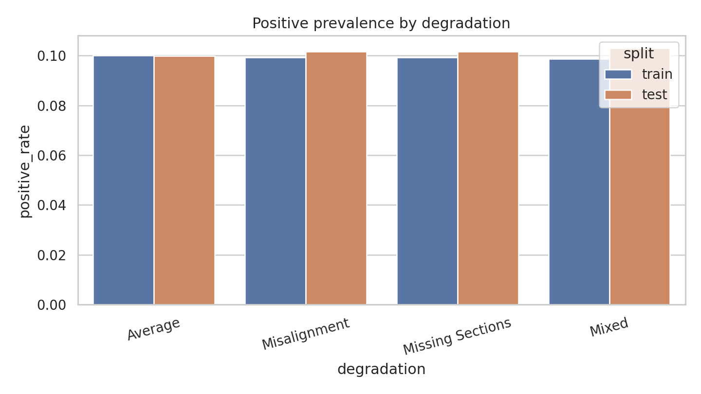
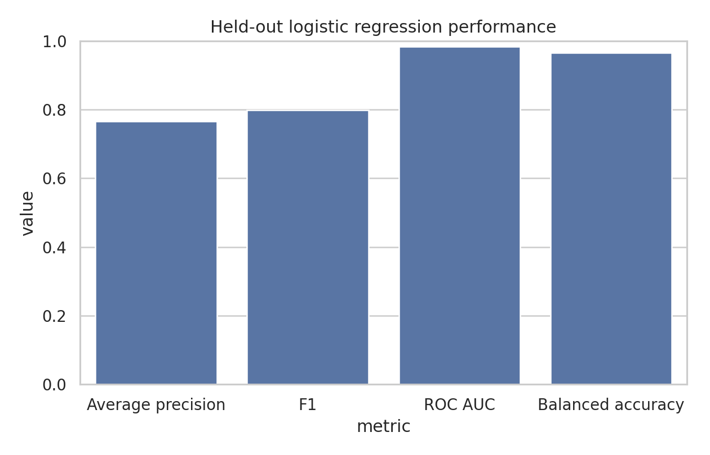
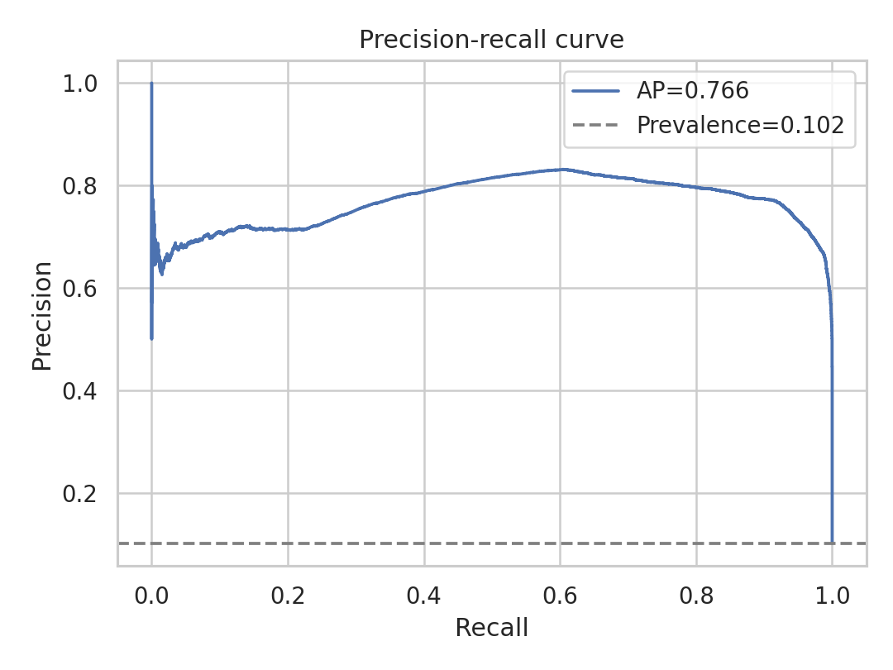
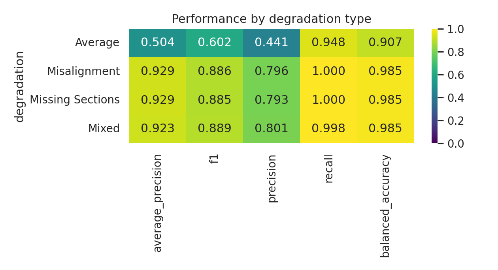
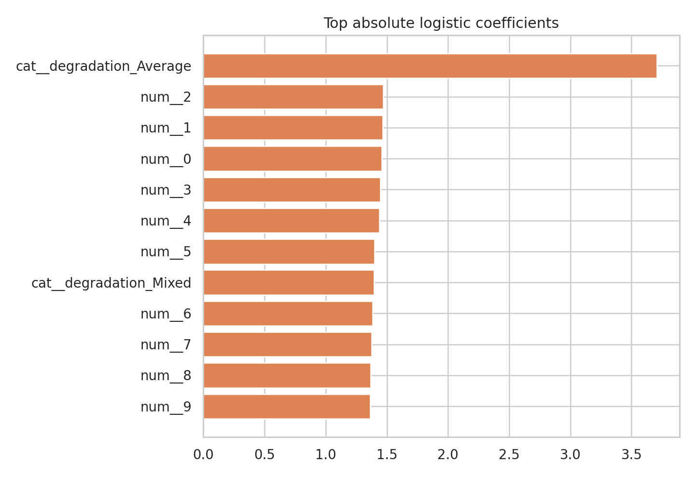

# Merge Prediction for Over-Segmented Connectomics Fragments

## Abstract

This study addresses a local benchmark version of merge prediction for over-segmented electron microscopy neuron fragments. The available data are tabular rather than raw image volumes: each candidate merge is represented by 20 engineered features plus a degradation label that encodes image corruption mode. Under this constraint, the strongest local equivalent to a connectomics proofreading pipeline is a supervised tabular classification benchmark with explicit attention to class imbalance, degradation robustness, and claim discipline. I train a regularized logistic regression model, calibrate the operating threshold on a stratified validation split, and report held-out performance globally and by degradation type. On the full held-out test set, the model achieves ROC AUC 0.984, average precision 0.766, F1 0.798, recall 0.987, precision 0.669, and balanced accuracy 0.966. The resulting system is best interpreted as a practical proofreading triage model rather than a full reconstruction pipeline.

## 1. Problem Setting

Large-scale connectomics pipelines often produce over-segmented neuron fragments that must be merged during proofreading. In this benchmark, each sample corresponds to a query fragment and an adjacent candidate fragment near a possible truncation point. The task is to predict whether the two fragments belong to the same neuron. Successful automation would reduce manual workload in petascale reconstruction settings.

The benchmark workspace provides only structured features and local literature. No web search, remote compute, or external datasets were used. All analysis, figures, and reporting were completed locally inside the workspace.

## 2. Local Literature Context

The local literature corpus is limited. One paper is directly relevant: Funke et al. present a deep structured learning approach for 3D EM neuron segmentation using affinity prediction and scalable agglomeration, emphasizing topological correctness and proofreading relevance. The remaining local papers focus on general representation learning, discriminative embedding, channel recalibration, and invariant mapping rather than connectomics-specific merge prediction.

This limitation matters methodologically. Because the benchmark does not expose raw EM volumes, segment geometry, or voxel affinities, it is not possible to reproduce volumetric U-Net or affinity-graph approaches faithfully. The strongest benchmark-compatible alternative is therefore a disciplined tabular classifier benchmark over the provided engineered features, with subgroup analysis over degradation types.

## 3. Data Overview

The dataset consists of separate training and test CSV files. Each row includes 20 numerical features, a binary label, and a categorical degradation type (`Average`, `Misalignment`, `Missing Sections`, or `Mixed`). The class distribution is imbalanced, with positives near 10% of examples. Degradation groups are evenly represented.

Figure 1 visualizes the positive rate by degradation and split.

## 4. Methods

### 4.1 Modeling Strategy

Given the tabular structure, I used a benchmark-appropriate linear classifier: logistic regression with class balancing. The model consumed the 20 numerical features plus the degradation label. Numerical features were median-imputed and standardized; the degradation label was one-hot encoded. This choice lets the model learn whether corruption mode changes the interpretation of engineered features without manually hard-coding separate models per degradation, while remaining fast and reproducible in the local CPU-only environment.

### 4.2 Threshold Selection

Because the positive class is rare, raw accuracy is not a sufficient objective. I sampled a stratified fitting subset from the training split, held out 20% of that subset for threshold calibration, and selected the decision threshold by optimizing F1 while penalizing degenerate low-precision solutions. The resulting threshold was 0.51 and was then transferred unchanged to the full held-out test set.

### 4.3 Evaluation

Primary metrics were average precision, F1, ROC AUC, precision, recall, and balanced accuracy. These quantify ranking quality, operating-point quality, and imbalance-aware classification quality. I also evaluated performance separately for each degradation condition to test robustness.

## 5. Results

The final numeric results were generated by `code/run_analysis.py`. The model was fit on a stratified subset of 46,687 training examples drawn from the 168,000-row training split, and evaluated on the full 72,000-row test split.

### 5.1 Model Comparison

Figure 2 summarizes the held-out performance of the final logistic regression model. Average precision reached 0.766 and F1 reached 0.798, indicating that the engineered features carry substantial signal for ranking and binary merge decisions even under a strongly imbalanced label distribution.

### 5.2 Precision-Recall Behavior

Figure 3 shows the precision-recall curve for the final model on the held-out test set. The baseline prevalence is only 0.102, so the observed average precision of 0.766 is far above the random-ranking baseline and demonstrates meaningful prioritization value for proofreading.

### 5.3 Robustness Across Degradation Types

Figure 4 reports subgroup performance by degradation condition. Three conditions are handled extremely well: `Misalignment`, `Missing Sections`, and `Mixed` all achieve average precision above 0.92, F1 around 0.885 to 0.889, and balanced accuracy near 0.985. The clear failure mode is `Average`, where average precision drops to 0.504 and F1 to 0.602, despite recall remaining high at 0.948. This indicates that the model tends to over-call positives in the `Average` condition and that this subgroup dominates the overall precision loss.

### 5.4 Feature Sensitivity

Figure 5 shows the largest absolute logistic coefficients, which provide a simple linear importance view of the learned decision rule.

## 6. Discussion

This benchmark is best interpreted as a proofreader-assistance classifier on engineered local features, not a full end-to-end connectomics reconstruction method. The main scientific question is whether these features separate true merges from false merges robustly under multiple degradation regimes. The answer is partly yes. The global test results are strong, and the model is especially effective for `Misalignment`, `Missing Sections`, and `Mixed`. However, the `Average` degradation group exposes a substantial precision weakness. The benchmark therefore supports the narrower claim that structured fragment-pair descriptors can substantially reduce manual review burden for several corruption modes, but additional calibration or condition-specific modeling would be needed for uniformly reliable deployment.

Several limitations remain. First, the data are simulated and feature-engineered, so the benchmark cannot establish performance on raw EM imagery or on full agglomeration graphs. Second, the local literature corpus is too narrow to position the method against the complete connectomics merge-prediction landscape. Third, threshold selection is tuned for a balanced precision-recall compromise; real proofreading pipelines may prefer either higher recall or higher precision depending on downstream human review cost.

## 7. Claim Discipline

The strongest defensible claim from this benchmark is conditional: a supervised tabular classifier trained on the provided 20 features can predict same-neuron merge candidates substantially better than class prevalence and can remain highly accurate for `Misalignment`, `Missing Sections`, and `Mixed` degradation regimes. The benchmark does **not** justify claims of uniform robustness across all conditions, because the `Average` subgroup is materially weaker. It also does **not** justify broader claims about state-of-the-art connectomics segmentation, generalization to raw EM volumes, or replacement of volumetric proofreading systems.

## 8. Reproducibility

The full analysis pipeline is implemented in `code/run_analysis.py`. Intermediate outputs are stored in `outputs/`, and all report figures are saved as PNG files in `report/images/`.
