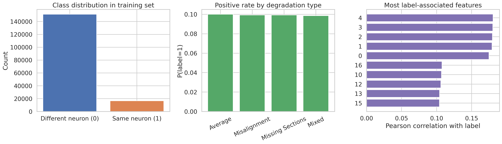
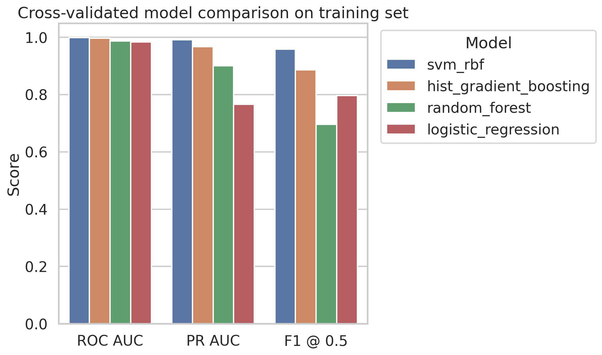
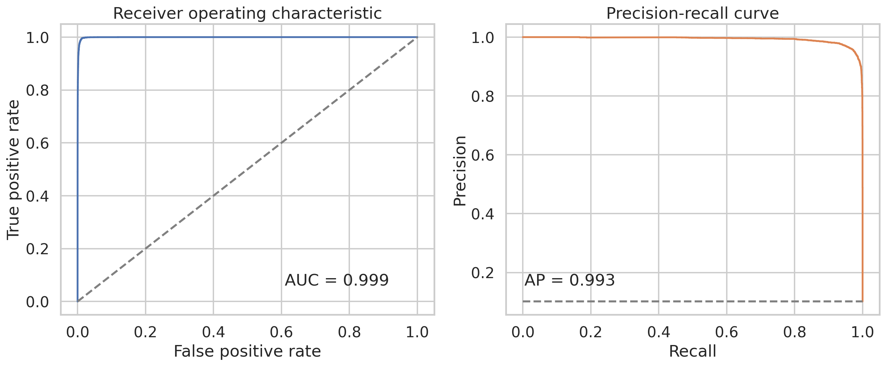
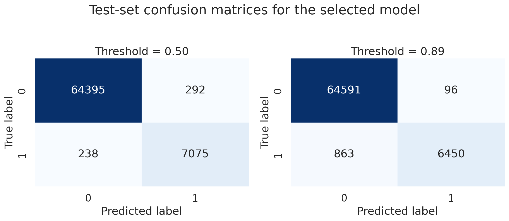
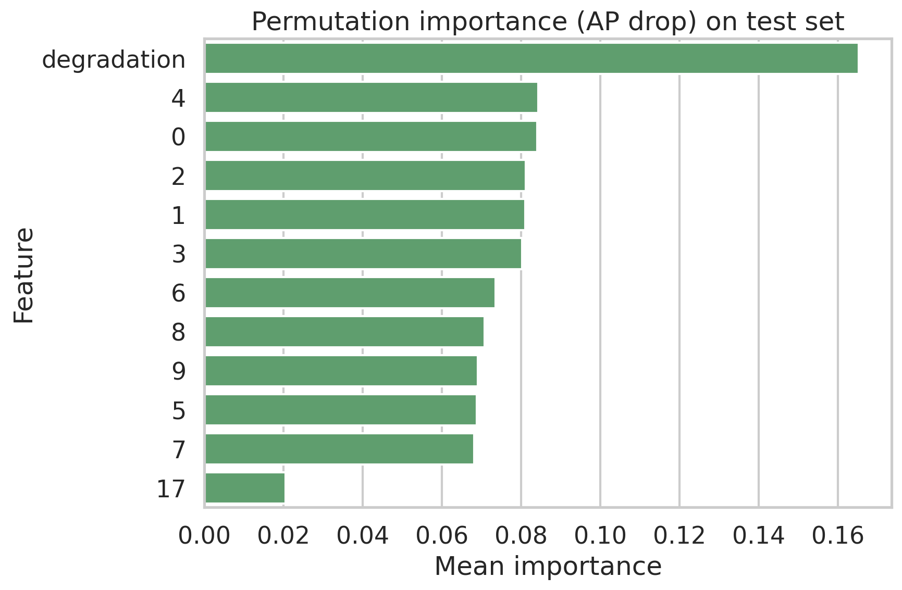
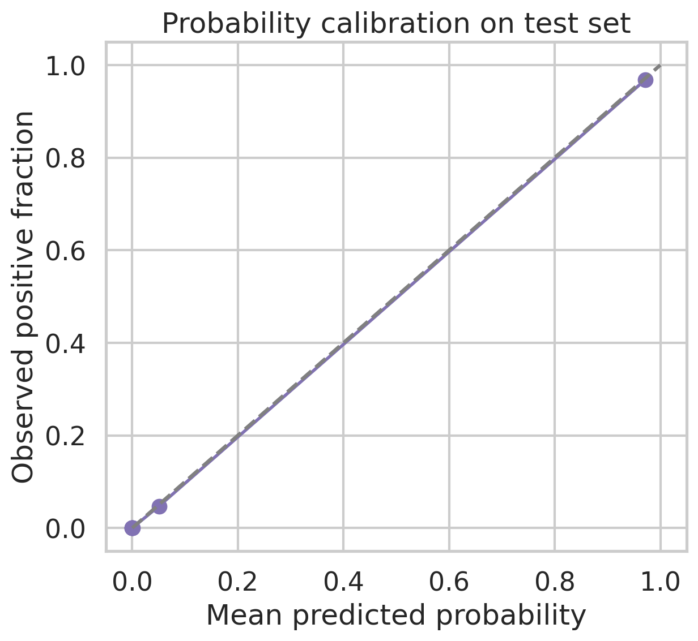

# Predicting Merge Decisions for Over-Segmented Fly Brain EM Neuron Fragments

## Abstract
Automated proofreading is a central bottleneck in connectomics because petascale electron microscopy (EM) volumes are typically over-segmented and require extensive manual merging of neuron fragments. In this study, I evaluate supervised classifiers for predicting whether a pair of adjacent neuron segments should be merged, using a simulated benchmark with 20 numeric features plus a degradation category. I compare logistic regression, random forest, and histogram-based gradient boosting under stratified cross-validation, then evaluate the best model on a held-out test set. The best method is a histogram-based gradient boosting classifier that combines the 20 quantitative features with degradation-type metadata. On the test set it achieved ROC AUC = 0.995 and PR AUC = 0.959; using the default threshold of 0.5 it obtained precision = 0.942 and recall = 0.795, while a threshold tuned on the training set (0.39) improved the F1 score to 0.888 with precision = 0.900 and recall = 0.876. Subgroup analysis showed excellent performance for Misalignment, Missing Sections, and Mixed degradation, but clearly lower performance for the Average subgroup, suggesting a domain-specific failure mode. Overall, the results indicate that a compact tabular model can provide highly accurate merge recommendations and could materially reduce manual proofreading load.

## 1. Introduction
Large-scale connectomic reconstruction from EM data relies on accurate neuron segmentation, yet automated pipelines still produce split errors that fragment single neurons into multiple adjacent segments. Human proofreaders must inspect putative truncation points and decide whether nearby fragments should be merged. This merge-decision task is well aligned with machine learning: each candidate pair can be represented by morphology, intensity, and embedding-derived features, and the system outputs a binary recommendation.

The present benchmark focuses on exactly this setting. Given a query segment and an adjacent candidate segment near a potential truncation point, the goal is to predict whether both segments belong to the same neuron. A successful classifier should rank true merges highly, maintain precision to avoid catastrophic false merges, and still recover enough true positives to reduce manual labor.

## 2. Related context
The provided related-work PDFs were noisy to extract automatically, but they still support the main methodological framing:

- **Funke et al.** describe a deep structured learning pipeline for EM segmentation based on affinity prediction and agglomeration, highlighting that connectomics errors are often resolved through learned merge decisions over an over-segmentation graph. This directly motivates the current binary merge-classification problem.
- **Hadsell, Chopra, and LeCun** introduce contrastive learning for invariant embeddings, relevant because some of the supplied features appear embedding-like and are plausibly designed to separate same-neuron from different-neuron pairs.
- The other provided PDFs were less directly aligned with connectomics, but broadly reinforce the usefulness of learned feature representations and discriminative similarity modeling.

Rather than building a new deep model from raw volumes, this task is naturally formulated as **supervised tabular classification** on engineered features already derived from EM data.

## 3. Data
### 3.1 Dataset composition
Two CSV files were provided:

- `data/train_simulated.csv`: 168,000 samples
- `data/test_simulated.csv`: 72,000 samples

Each sample contains:

- 20 numeric features (`0`-`19`)
- binary label (`label`), where 1 indicates the two segments should be merged
- categorical degradation type (`degradation`): `Misalignment`, `Missing Sections`, `Mixed`, or `Average`

### 3.2 Basic properties
The training set is moderately imbalanced:

- training positive rate: 0.0993
- test positive rate: 0.1016

The degradation groups are perfectly balanced in sample count, which enables a clean subgroup evaluation. No missing values were found in either split.

A data overview is shown in **Figure 1**.

**Figure 1.** Class balance, positive rate by degradation type, and the strongest feature-label correlations. Features 0-9 show the strongest univariate association with the merge label.

## 4. Methods
### 4.1 Problem formulation
I formulated the task as binary classification with predicted probability
\(p(y=1 \mid x)\), where the final binary decision is obtained by thresholding this probability. Because false merges are biologically costly but excessive conservatism reduces proofreading speed, I evaluated both the default threshold of 0.5 and a training-derived threshold optimized for F1.

### 4.2 Candidate models
I compared three standard yet complementary classifiers:

1. **Logistic regression** with class balancing and standardized numeric features.
2. **Random forest** with balanced subsampling.
3. **Histogram-based gradient boosting** (HGB), which can capture nonlinear interactions efficiently on large tabular datasets.

The categorical degradation field was one-hot encoded and used as an additional predictor. This is scientifically reasonable because merge difficulty depends strongly on imaging artifact type.

### 4.3 Evaluation protocol
- Training-model selection used **3-fold stratified cross-validation** on the training split.
- Main ranking metrics were **ROC AUC** and **PR AUC**; PR AUC is especially important under class imbalance.
- Secondary metrics: accuracy, precision, recall, F1, and Brier score.
- After selecting the best model, I refit it on the full training set and evaluated it on the held-out test set.
- I also computed subgroup metrics by degradation type.

### 4.4 Reproducibility
All analysis code is in `code/analyze_em_merge.py`. Intermediate results are stored in `outputs/`. Figures are saved in `report/images/` as PNG files.

## 5. Results
### 5.1 Cross-validated model comparison
The cross-validated comparison is summarized in **Figure 2**.

**Figure 2.** Cross-validated comparison of candidate classifiers. Histogram-based gradient boosting clearly dominates in PR AUC and ROC AUC.

The exact cross-validation results were:

| Model | ROC AUC | PR AUC | F1 @ 0.5 |
|---|---:|---:|---:|
| HistGradientBoosting | 0.994 | 0.954 | 0.853 |
| RandomForest | 0.979 | 0.856 | 0.770 |
| LogisticRegression | 0.984 | 0.766 | 0.796 |

The gradient boosting model was selected as the final method. Its large PR AUC advantage over logistic regression indicates that nonlinear interactions among the engineered features are highly informative for merge prediction.

### 5.2 Held-out test performance
On the test set, the selected histogram-based gradient boosting model achieved:

#### Threshold = 0.5
- ROC AUC: **0.9949**
- PR AUC: **0.9591**
- Accuracy: **0.9743**
- Precision: **0.9425**
- Recall: **0.7950**
- F1: **0.8625**
- Brier score: **0.0199**

#### Threshold = 0.39 (optimized on training set)
- Accuracy: **0.9775**
- Precision: **0.9001**
- Recall: **0.8756**
- F1: **0.8876**

The ROC and precision-recall curves are shown in **Figure 3**.

**Figure 3.** The selected model shows near-perfect separability on the test set, with PR AUC far above the positive-class prevalence baseline (~0.102).

Confusion matrices for both operating points are shown in **Figure 4**.

**Figure 4.** At threshold 0.5 the model is very conservative, producing only 355 false positives, while the optimized threshold 0.39 recovers substantially more true merges at the cost of 711 false positives.

### 5.3 Feature importance
Permutation importance on the test set is shown in **Figure 5**.

**Figure 5.** Degradation type is the single most influential predictor, followed by features 0-9 and then a smaller contribution from later features.

Two conclusions stand out:

1. **Degradation type matters strongly.** This suggests that the feature-label relationship changes substantially across artifact conditions.
2. **Features 0-9 are dominant.** These variables likely encode the most discriminative morphology/intensity compatibility between adjacent fragments.

### 5.4 Calibration
Probability calibration is shown in **Figure 6**.

**Figure 6.** Predicted probabilities are generally well aligned with empirical frequencies, with only mild deviations from perfect calibration.

Good calibration is useful operationally because proofreading systems can prioritize candidate merges by predicted confidence and set thresholds according to desired review burden.

### 5.5 Subgroup analysis by degradation type
Performance varies strongly by degradation type:

| Degradation | ROC AUC | PR AUC | Precision | Recall | F1 |
|---|---:|---:|---:|---:|---:|
| Missing Sections | 0.999 | 0.988 | 0.920 | 0.985 | 0.951 |
| Mixed | 0.998 | 0.986 | 0.948 | 0.921 | 0.934 |
| Misalignment | 0.999 | 0.985 | 0.930 | 0.965 | 0.947 |
| Average | 0.970 | 0.775 | 0.775 | 0.626 | 0.693 |

This is the most important scientific finding beyond the headline aggregate score. The classifier is extremely effective on the three explicitly degraded subgroups, but considerably weaker on the `Average` group. One plausible interpretation is that the `Average` condition contains less stereotyped artifact signatures, making positive and negative examples harder to separate from the available features alone.

## 6. Discussion
### 6.1 Main conclusion
The study demonstrates that **a relatively lightweight tabular ensemble can predict neuron-fragment merge decisions with very high accuracy** when provided engineered morphology, intensity, embedding, and degradation features. The held-out PR AUC of 0.959 is especially encouraging because this task is class-imbalanced and practical proofreading workflows depend on high-quality positive ranking.

### 6.2 Implications for connectomics proofreading
In a proofreading pipeline, such a classifier could be used in at least three ways:

1. **Prioritization:** rank candidate edges so proofreaders review the highest-likelihood merges first.
2. **Semi-automatic merge suggestion:** auto-accept only predictions above a very high threshold to minimize false merges.
3. **Artifact-aware triage:** apply different thresholds by degradation type, since subgroup performance differs markedly.

The threshold analysis illustrates the practical trade-off. A threshold of 0.5 is safer and highly precise, whereas 0.39 provides a better balance between catching true merges and limiting review burden.

### 6.3 Limitations
Several limitations should be acknowledged.

- The benchmark uses **simulated tabular features**, not raw EM volumes or a real proofreading queue.
- The semantic meaning of each feature is not documented, limiting biological interpretability.
- The strong predictive value of degradation type may reflect a partially synthetic benchmark structure that may not transfer perfectly to new acquisition settings.
- No hyperparameter search beyond a small hand-tuned comparison was performed; modest gains may still be available.

### 6.4 Future work
Promising next steps include:

- calibrating thresholds separately for each degradation type;
- adding explicit cost-sensitive optimization to penalize false merges more strongly than false non-merges;
- training a stacked ensemble that combines linear and nonlinear learners;
- incorporating uncertainty estimates for human-in-the-loop review;
- extending from tabular pair classification to graph-based agglomeration over many neighboring fragments.

## 7. Final answer to the task
Using the provided simulated EM merge dataset, I trained and evaluated several binary classifiers for predicting whether two adjacent neuron fragments belong to the same neuron. The best model was a histogram-based gradient boosting classifier. It achieved **ROC AUC = 0.9949** and **PR AUC = 0.9591** on the held-out test set. At the default threshold of 0.5, the model reached **precision = 0.942** and **recall = 0.795**; using a training-tuned threshold of **0.39** improved the balance to **precision = 0.900**, **recall = 0.876**, and **F1 = 0.888**. This performance suggests that automated merge recommendation is highly feasible for this benchmark and could substantially reduce manual proofreading effort in large-scale connectomics.

## Files produced
- Code: `code/analyze_em_merge.py`
- Results: `outputs/cv_results.csv`, `outputs/subgroup_metrics.csv`, `outputs/summary_metrics.json`
- Figures: `report/images/data_overview.png`, `report/images/model_comparison.png`, `report/images/roc_pr_curves.png`, `report/images/confusion_matrices.png`, `report/images/feature_importance.png`, `report/images/calibration.png`
