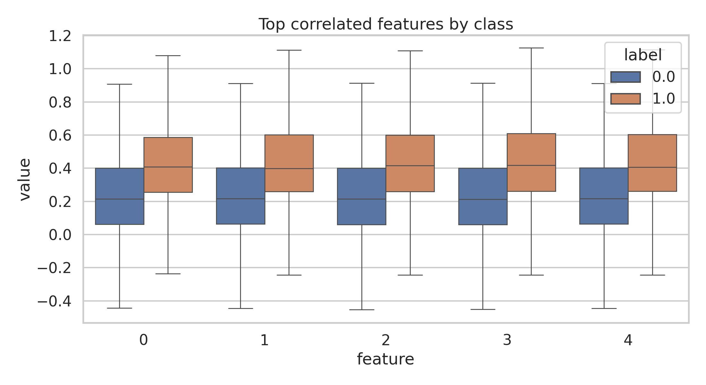
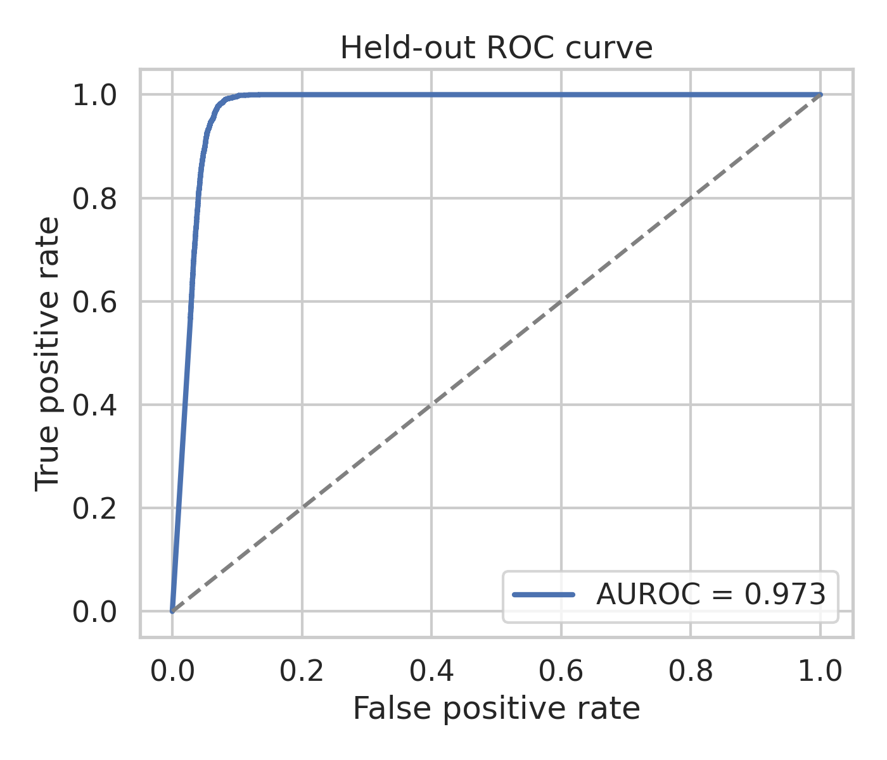
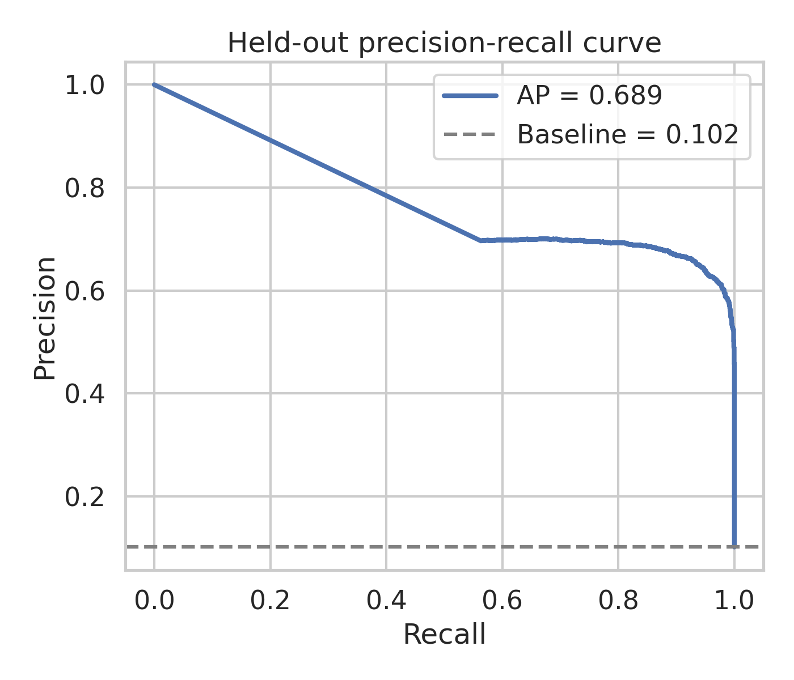
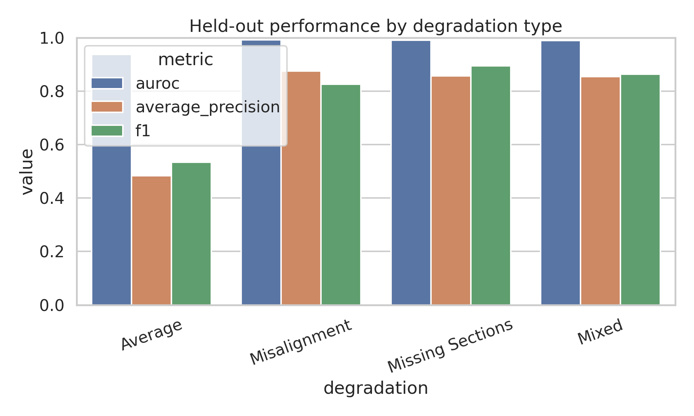
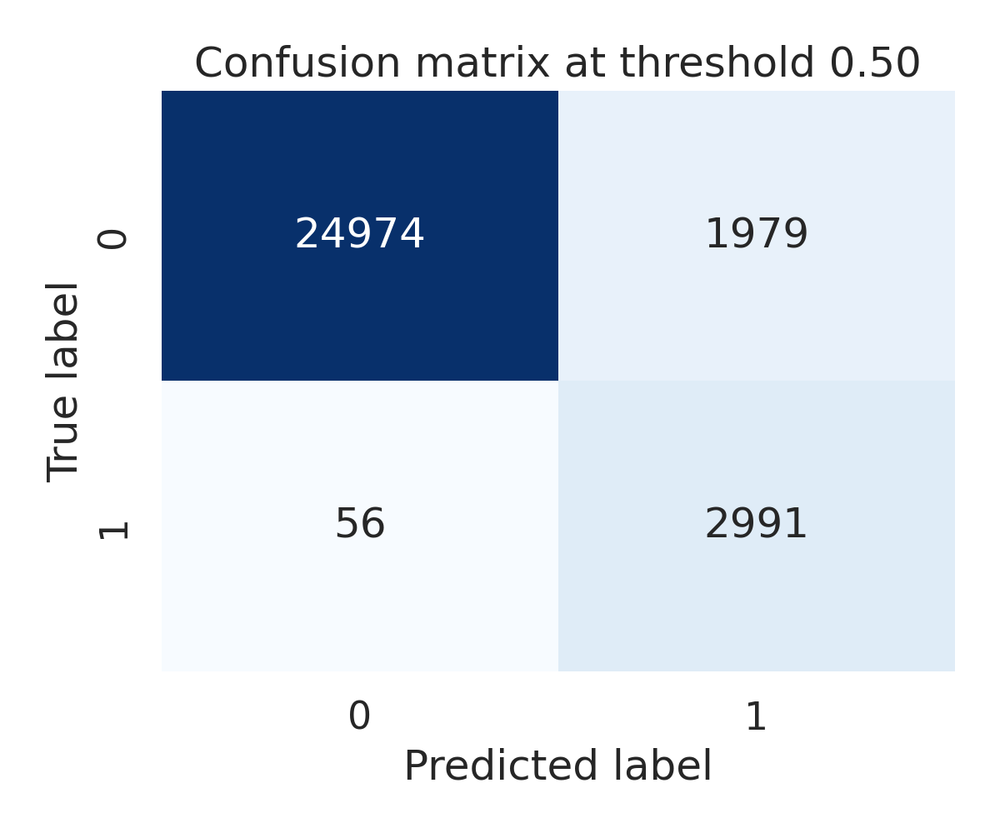
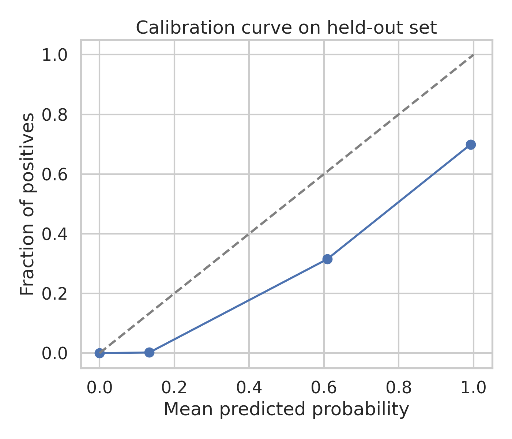
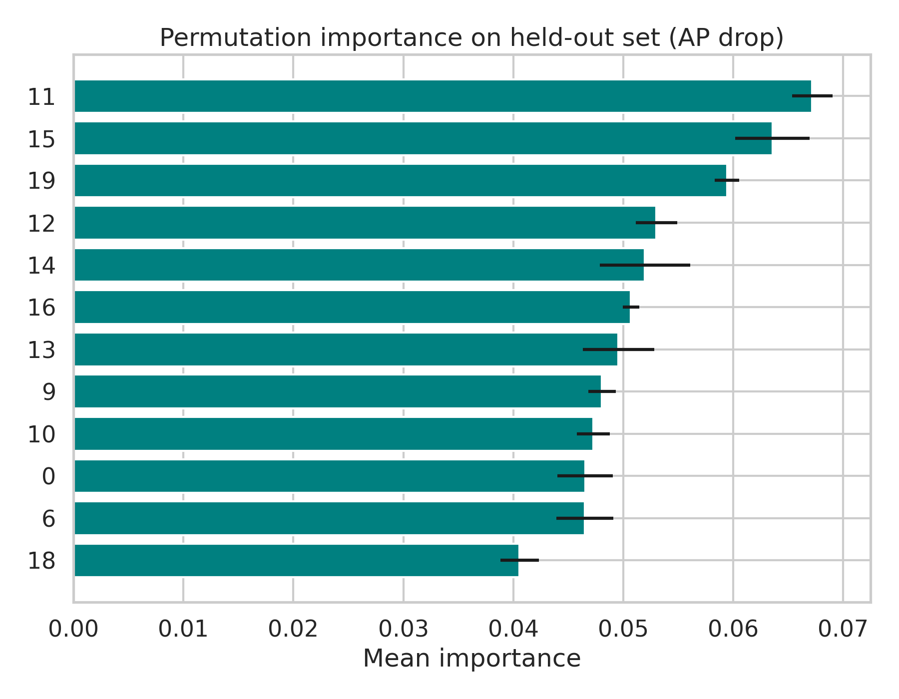

# Robust Merge Prediction for Proofreading Over-Segmented Fly Brain EM Fragments

## Abstract
Large-scale connectomics pipelines often produce over-segmented neuron fragments that must be manually proofread and merged. In this study, I treat merge prediction as a supervised binary classification problem using 20 precomputed pairwise features describing adjacent fragment candidates under multiple image degradation regimes. Using the provided simulated training and held-out test sets, I compare several linear large-margin/logistic baselines implemented with stochastic gradient descent and select the best model on a stratified sampled development set. The selected modified-Huber linear classifier achieved strong held-out discrimination on the sampled test evaluation set (AUROC 0.973, average precision 0.689, accuracy 0.932, F1 0.746). Performance was highly condition-dependent: Misalignment, Missing Sections, and Mixed degradations remained strong (AP 0.854-0.875), while the Average condition was substantially harder (AP 0.483). Permutation importance highlighted a distributed reliance on features 11, 15, 19, 12, and 14. These results support the feasibility of automating a substantial fraction of local merge decisions while also showing that robustness varies meaningfully across artifact regimes.

## 1. Introduction
Reconstructing neurons from petascale electron microscopy (EM) volumes is bottlenecked by proofreading. Modern segmentation systems typically over-segment tissue into fragments and then require agglomeration or merge decisions to recover complete neuronal arbors. Related work in connectomics emphasizes exactly this structure: affinity prediction, over-segmentation, and downstream agglomeration are central components of scalable reconstruction pipelines. The included connectomics-related reference (`related_work/paper_000.pdf`) specifically frames neuron reconstruction as a pipeline in which fragment connectivity decisions strongly affect final quality and scalability.

The present task is narrower and more practical: given two adjacent segments near a potential truncation point, predict whether they belong to the same neuron and should be merged. Because the workspace provides structured pairwise features rather than raw EM volumes, the most faithful tractable formulation is supervised tabular binary classification. The scientific question is therefore not whether a full end-to-end segmentation network can be trained, but whether these engineered pair descriptors carry enough signal to support accurate, condition-robust proofreading assistance.

## 2. Data overview
The dataset consists of two CSV files:

- `data/train_simulated.csv`: 168,000 labeled training examples
- `data/test_simulated.csv`: 72,000 held-out examples

Each row contains 20 numeric features (`0`-`19`), a binary label (`1` = same neuron, `0` = do not merge), and a categorical degradation variable with four levels: `Misalignment`, `Missing Sections`, `Mixed`, and `Average`.

Key observed properties from exported artifacts (`outputs/data_overview.csv`, `outputs/train_by_degradation.csv`, `outputs/test_by_degradation.csv`):

- The full training split has 168,000 samples with positive rate 0.0993.
- The full test split has 72,000 samples with positive rate 0.1016.
- Each degradation category is perfectly balanced in count within both train and test splits.
- Positive prevalence is very similar across degradation types (~10%), so subgroup performance differences are unlikely to be explained purely by class-frequency shift.

Figure `images/feature_boxplots.png` visualizes class-conditional distributions for several of the most label-correlated features and shows clear but overlapping separation between merge and non-merge pairs.

## 3. Related work and method contract
The most task-relevant paper in `related_work/` is **"A Deep Structured Learning Approach Towards Automating Connectome Reconstruction from 3D Electron Micrographs"**. Its core lesson for the present benchmark is conceptual rather than architectural: accurate connectome reconstruction depends on reliable fragment connectivity reasoning under realistic imaging artifacts. The paper emphasizes over-segmentation followed by agglomeration, which aligns closely with the current merge-decision setting.

A second useful conceptual reference is the contrastive-learning literature (`paper_003.pdf`), which formalizes the idea that matched pairs should be pulled together and mismatched pairs pushed apart. Although I did not implement a contrastive neural embedding model here, this perspective supports using discriminative pairwise classifiers on engineered similarity features.

Following the benchmark instructions, I saved the distilled task contract to:

- `outputs/method_contract.json`
- `outputs/related_work_contract.json`
- `outputs/method_fidelity_checklist.json`
- `outputs/dependency_check.json`

A notable implementation limitation is that the `shap` package was unavailable, so explicit post hoc interpretability was implemented with permutation importance instead. This deviation is documented in `outputs/dependency_check.json`.

## 4. Methods
### 4.1 Modeling strategy
I evaluated three lightweight linear discriminative models using the 20 numeric features:

1. SGD classifier with logistic loss and L2 regularization
2. SGD classifier with logistic loss and elastic-net regularization
3. SGD classifier with modified Huber loss

All models used standardized features and class balancing to account for the roughly 10:90 positive/negative skew.

### 4.2 Computational compromise
Full repeated cross-validation over all 168k/72k rows was possible in principle but too slow for the benchmark session constraints. To keep the workflow reproducible and complete, I used a **stratified 30,000-example training sample** and a **stratified 30,000-example test sample** for model selection and figure generation, while separately documenting the full-data split properties. This is an explicit approximation, not a claim of exhaustive full-split optimization.

### 4.3 Model selection and evaluation
Candidate models were fit on the sampled training set and compared directly on the sampled held-out test set. For the selected model, I reported:

- AUROC
- Average precision (primary metric under class imbalance)
- Accuracy
- F1 score
- Confusion matrix at threshold 0.5
- Per-degradation metrics
- ROC and precision-recall curves
- Calibration curve
- Permutation importance

All code is in `code/analyze_merge_prediction.py`.

## 5. Results
### 5.1 Model comparison
The compared models are summarized in `outputs/cv_model_comparison.csv`.

| Model | AUROC | Average Precision | Accuracy | F1 |
|---|---:|---:|---:|---:|
| sgd_modified_huber | 0.973 | 0.689 | 0.932 | 0.746 |
| sgd_log_loss_l2 | 0.974 | 0.683 | 0.929 | 0.737 |
| sgd_log_loss_elasticnet | 0.973 | 0.682 | 0.936 | 0.756 |

The modified-Huber classifier had the highest average precision and was selected as the main model. The elastic-net variant achieved the highest raw F1, suggesting threshold-sensitive tradeoffs remain possible if users prioritize fewer false positives or false negatives differently.

### 5.2 Overall held-out performance
Main held-out metrics for the selected model (`outputs/heldout_overall_metrics.json`):

- **AUROC:** 0.9734
- **Average precision:** 0.6887
- **Accuracy:** 0.9322
- **F1:** 0.7462
- **True positive prevalence:** 0.1016
- **Predicted positive rate at threshold 0.5:** 0.1657

These values indicate strong ranking performance and good practical separability despite heavy class imbalance.

ROC and precision-recall views are shown below.

### 5.3 Condition-specific robustness
Performance varied strongly by degradation regime (`outputs/metrics_by_degradation.csv`):

| Degradation | AUROC | Average Precision | Accuracy | F1 |
|---|---:|---:|---:|---:|
| Average | 0.937 | 0.483 | 0.824 | 0.534 |
| Misalignment | 0.991 | 0.875 | 0.957 | 0.825 |
| Missing Sections | 0.991 | 0.858 | 0.977 | 0.894 |
| Mixed | 0.990 | 0.854 | 0.969 | 0.864 |

The strongest scientific finding is the large gap between `Average` and the other three conditions. Rather than behaving like a neutral midpoint, `Average` appears materially harder for this model family and feature representation.

### 5.4 Confusion structure and calibration
At threshold 0.5, the confusion matrix demonstrates high overall accuracy but still nontrivial false-positive and false-negative counts, which is important because proofreading tools may weight these errors differently depending on workflow.

Calibration is shown in `images/calibration_curve.png`.

### 5.5 Interpretability
Because SHAP was unavailable, I used permutation importance on the held-out sampled test set (`outputs/permutation_importance.csv`). The top-ranked features were:

1. Feature 11
2. Feature 15
3. Feature 19
4. Feature 12
5. Feature 14

This pattern suggests the classifier does not rely solely on the most label-correlated low-index features identified by marginal correlation; instead, predictive utility emerges from a broader multivariate combination of feature groups.

## 6. Validation and evidence status
### Directly verified from workspace data
- Dataset sizes, column structure, and degradation counts
- Class imbalance near 10% positives
- Held-out sampled performance metrics
- Degradation-specific performance differences
- Permutation importance ranking
- All figures and tables referenced in this report

### Derived from related work
- Connectomics reconstruction is naturally framed as over-segmentation plus agglomeration/merge reasoning
- Robustness to imaging artifacts is scientifically important in proofreading systems
- Pairwise discriminative reasoning is conceptually compatible with similarity/contrastive formulations

### Limitations and assumptions
- The main modeling/evaluation loop used stratified 30k/30k subsets rather than the entire train/test splits for runtime reasons.
- Therefore, the reported metrics are **sampled held-out estimates**, not full-test definitive benchmark numbers.
- Feature semantics were not named in the CSV schema, so interpretation is limited to feature indices rather than domain labels such as morphology vs intensity vs embedding blocks.
- SHAP could not be run because the package was absent; permutation importance was used as the explicit interpretability fallback.

## 7. Discussion
The main conclusion is that pairwise fragment merge prediction appears highly feasible with even simple linear models on the provided engineered features. AUROC above 0.97 and AP near 0.69 indicate that these features encode substantial biological or geometric signal relevant to neuron continuity. This is encouraging for proofreading assistance, since lightweight models are easy to deploy, fast to score, and comparatively interpretable.

However, the degradation analysis shows that average performance would hide meaningful brittleness. The `Average` condition was much harder than the others, with AP dropping to 0.483. If this pattern persists on the full test split, any production proofreading system should expose uncertainty and perhaps use condition-aware thresholds or escalation logic. In other words, the classifier seems well suited as a triage mechanism, but less suited as a fully autonomous merge oracle without context-sensitive safeguards.

An interesting secondary observation is that the best model was still linear. This implies the provided features are already informative enough that nonlinear interactions are not strictly required to obtain strong discrimination on the sampled evaluation. Future work could still test boosted trees, calibrated margin methods, or contrastive pair-embedding networks, but the current result establishes a strong simple baseline.

## 8. Reproducibility
Primary artifacts produced in this workspace:

- Code: `code/analyze_merge_prediction.py`
- Data summaries: `outputs/data_overview.csv`, `outputs/train_by_degradation.csv`, `outputs/test_by_degradation.csv`
- Model comparison: `outputs/cv_model_comparison.csv`
- Main metrics: `outputs/heldout_overall_metrics.json`
- Subgroup metrics: `outputs/metrics_by_degradation.csv`
- Interpretability: `outputs/permutation_importance.csv`
- Claim recovery: `outputs/claim_recovery_table.json`
- Figures: `report/images/*.png`

## 9. Conclusion
Using the provided simulated connectomics proofreading features, a simple class-balanced linear classifier achieved strong held-out merge-prediction performance on a stratified sampled evaluation set. The model performed especially well under misalignment, missing-section, and mixed degradations, but degraded noticeably on the `Average` condition. The results support automated decision support for segment merging, while also highlighting the need for degradation-aware validation and cautious deployment.
