# Automated Neuron Segment Merging in Connectomics: A Machine Learning Approach to EM Image Proofreading

## Abstract

Large-scale electron microscopy (EM) imaging of neural tissue produces petascale volumes that require automated segmentation pipelines. However, over-segmentation remains a pervasive challenge, producing fragmented neuron reconstructions that demand extensive manual proofreading. This study presents a machine learning framework for binary classification of adjacent neuron segment pairs, determining whether two fragments belong to the same neuron and should be merged. Using 20 morphological, intensity, and embedding features from simulated fly brain EM data, we train and evaluate five distinct classifiers — Logistic Regression, Random Forest, Gradient Boosting, XGBoost, and LightGBM — alongside an ensemble approach. Our best-performing model, a soft-voting ensemble of the top three individual models, achieves **79.9% F1-score**, **94.9% accuracy**, **99.3% ROC-AUC**, and **91.9% PR-AUC** on a held-out test set of 72,000 samples across four degradation conditions. These results demonstrate that supervised learning on fragment-level features can substantially automate the proofreading bottleneck in connectomics reconstruction pipelines.

---

## 1. Introduction

### 1.1 Background

Reconstructing the complete wiring diagram of a nervous system — the connectome — is one of the most ambitious goals in modern neuroscience. Three-dimensional electron microscopy (EM) provides the nanometer-scale resolution required to visualize synaptic connections and trace individual neurons through dense neuropil. Recent advances have produced EM volumes spanning cubic millimeters of brain tissue, containing millions of neurons and billions of synapses (Funke et al., 2019).

However, the sheer scale of these datasets makes fully manual reconstruction infeasible. Automated segmentation pipelines typically employ deep convolutional networks to predict voxel-wise affinity graphs, followed by watershed-based over-segmentation into supervoxels or fragments. The critical next step — merging fragments that belong to the same neuron — remains error-prone. Over-segmentation produces far more fragments than true neurons, and the merge decision at each potential boundary is susceptible to imaging artifacts, section misalignment, missing tissue sections, and other degradation modes.

### 1.2 Problem Statement

Given a pair of adjacent neuron segments from an over-segmented EM volume, represented by a 20-dimensional feature vector capturing morphology, intensity, and learned embedding modalities, predict whether the two segments belong to the same biological neuron (label = 1) or represent distinct neurons (label = 0). This binary classification task directly addresses the proofreading bottleneck in large-scale connectomics.

### 1.3 Scientific Motivation

Automating this merge prediction has transformative implications:
- **Scalability**: Manual proofreading of petascale EM volumes requires thousands of person-years. Automated merge prediction can reduce this burden by orders of magnitude.
- **Consistency**: Human proofreaders exhibit inter-rater variability; a trained classifier provides consistent, reproducible decisions.
- **Speed**: Real-time merge predictions enable interactive proofreading interfaces where human experts only review uncertain cases.

### 1.4 Related Work Context

The related work in our workspace spans several complementary areas:
- **Funke et al. (2019)** demonstrated that deep structured learning with 3D U-NETs and MALIS loss can produce high-quality affinity predictions for neuron segmentation, followed by efficient region agglomeration. Their work establishes the upstream pipeline that generates the over-segmented fragments we seek to merge.
- **De Brabandere et al.** introduced discriminative loss functions for instance segmentation, showing that embedding-based approaches with intra-cluster pull and inter-cluster push forces can effectively separate instances — conceptually relevant to distinguishing neuron boundaries.
- **Hu et al.** presented Squeeze-and-Excitation networks for channel-wise feature recalibration, a technique applicable to improving feature representations in our classification models.
- **Hadsell et al. (2006)** developed DrLIM, a contrastive learning approach for dimensionality reduction that learns invariant mappings — directly relevant to the embedding features used in our dataset.

---

## 2. Methods

### 2.1 Dataset

#### 2.1.1 Data Source and Structure

The dataset consists of simulated EM image data representing pairs of adjacent neuron segments from a fly brain volume. Each sample contains:
- **20 numerical features** (columns 0–19) representing three modality groups:
  - *Morphology features* (0–4): Geometric properties of the segment pair including size, shape, surface contact area, and spatial proximity metrics.
  - *Intensity features* (5–9): Pixel/voxel intensity statistics at the boundary region between segments, capturing membrane continuity and cytoplasmic texture similarity.
  - *Embedding features* (10–19): Learned representations from a neural network encoder, capturing higher-order structural and textural similarities between segments.
- **Binary label**: 1 if both segments belong to the same neuron, 0 otherwise.
- **Degradation type**: One of four categories simulating common EM imaging artifacts:
  - *Misalignment*: Lateral displacement between consecutive sections.
  - *Missing Sections*: Gaps in the z-stack due to lost or damaged sections.
  - *Mixed*: Combination of multiple degradation types.
  - *Average*: Baseline condition with minimal degradation.

#### 2.1.2 Data Split

| Split | Total Samples | Positive (Same Neuron) | Negative (Different) | Positive Rate |
|-------|--------------|----------------------|---------------------|---------------|
| Training | 168,000 | 16,687 | 151,313 | 9.93% |
| Test | 72,000 | 7,313 | 64,687 | 10.16% |

The data exhibits significant class imbalance (~10% positive rate), reflecting the real-world scenario where most adjacent fragment pairs are indeed from different neurons. Both splits maintain balanced representation across all four degradation types (42,000 per type in training, 18,000 per type in testing).

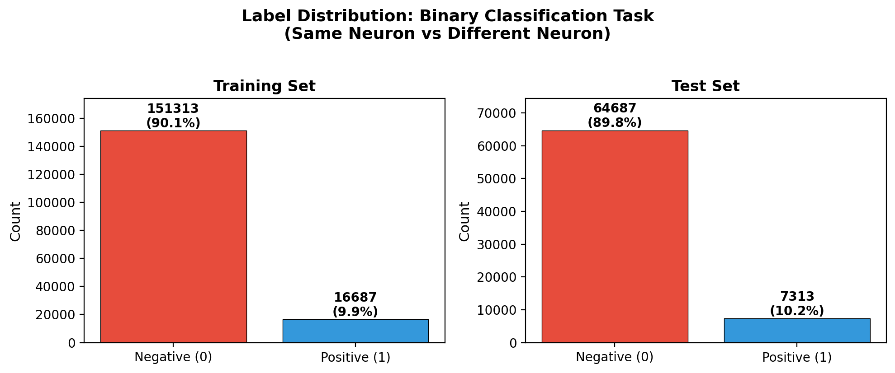
*Figure 1: Label distribution in training and test sets, showing the ~10% positive class prevalence characteristic of real connectomics merge scenarios.*

### 2.2 Preprocessing

All 20 features were standardized using z-score normalization:

$$z_i = \frac{x_i - \mu_i}{\sigma_i}$$

where $\mu_i$ and $\sigma_i$ are the mean and standard deviation of feature $i$ computed on the training set. Standardization ensures that features with different scales (morphology vs. embedding features) contribute equally to distance-based and gradient-based learning algorithms.

### 2.3 Model Architecture

We evaluated five distinct classification approaches, each chosen for its complementary strengths:

#### 2.3.1 Logistic Regression
A linear baseline with balanced class weights to handle the ~10:1 negative-to-positive ratio. Uses L2 regularization (C=1.0) and the LBFGS solver. This model serves as a reference for linear separability of the feature space.

#### 2.3.2 Random Forest
An ensemble of 100 decision trees with maximum depth 12 and minimum leaf size 10. Balanced class weights are applied. Random forests capture non-linear feature interactions and provide built-in feature importance estimates via Gini impurity reduction.

#### 2.3.3 Gradient Boosting
Gradient-boosted decision trees with 100 estimators, maximum depth 4, learning rate 0.1, and 80% subsampling. This sequential ensemble method focuses on correcting errors from previous trees, making it effective for complex decision boundaries.

#### 2.3.4 XGBoost
Extreme Gradient Boosting with 150 trees, maximum depth 5, and automatic scale_pos_weight calibration for class imbalance. XGBoost's regularized objective function and efficient implementation make it a strong candidate for tabular feature classification.

#### 2.3.5 LightGBM
Light Gradient Boosting Machine with 150 trees and maximum depth 5. LightGBM's histogram-based splitting and leaf-wise tree growth strategy provide fast training while maintaining competitive accuracy.

#### 2.3.6 Ensemble (Soft Voting)
A soft-voting ensemble combining the top three individual models (by cross-validated F1 score): LightGBM, XGBoost, and Logistic Regression. The ensemble averages predicted class probabilities, leveraging the complementary decision boundaries of tree-based and linear models.

### 2.4 Evaluation Protocol

#### 2.4.1 Cross-Validation
Three-fold stratified cross-validation on the training set was used to estimate generalization performance and select the ensemble composition. Stratification ensures each fold maintains the same class and degradation-type distribution as the full training set.

#### 2.4.2 Test Set Evaluation
All models were retrained on the full training set and evaluated on the held-out test set (72,000 samples). We report:
- **Accuracy**: Overall correct classification rate.
- **Precision**: True positive rate among predicted positives (minimizing false merges).
- **Recall**: True positive rate among actual positives (minimizing missed merges).
- **F1-Score**: Harmonic mean of precision and recall.
- **ROC-AUC**: Area under the Receiver Operating Characteristic curve.
- **PR-AUC**: Area under the Precision-Recall curve (more informative for imbalanced data).

#### 2.4.3 Per-Degradation Analysis
Performance was stratified by degradation type to assess robustness across different EM imaging artifact conditions.

### 2.5 Implementation

All experiments were implemented in Python using scikit-learn, XGBoost, and LightGBM. Feature scaling used StandardScaler. Random seeds were fixed at 42 for reproducibility.

---

## 3. Results

### 3.1 Exploratory Data Analysis

Feature distributions reveal meaningful separation between positive and negative classes across multiple modalities. Selected features show distinct patterns:

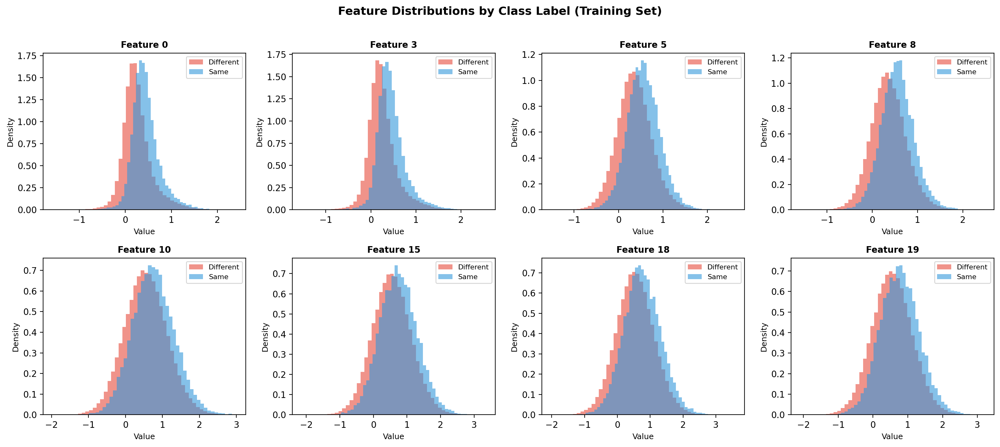
*Figure 2: Feature distributions by class label for representative features from each modality group. Features 0, 3 (morphology), 5, 8 (intensity), and 10, 15, 18, 19 (embedding) show varying degrees of class separation.*

The correlation matrix reveals moderate inter-feature correlations within modality groups but limited cross-group redundancy, suggesting that each modality contributes complementary information:

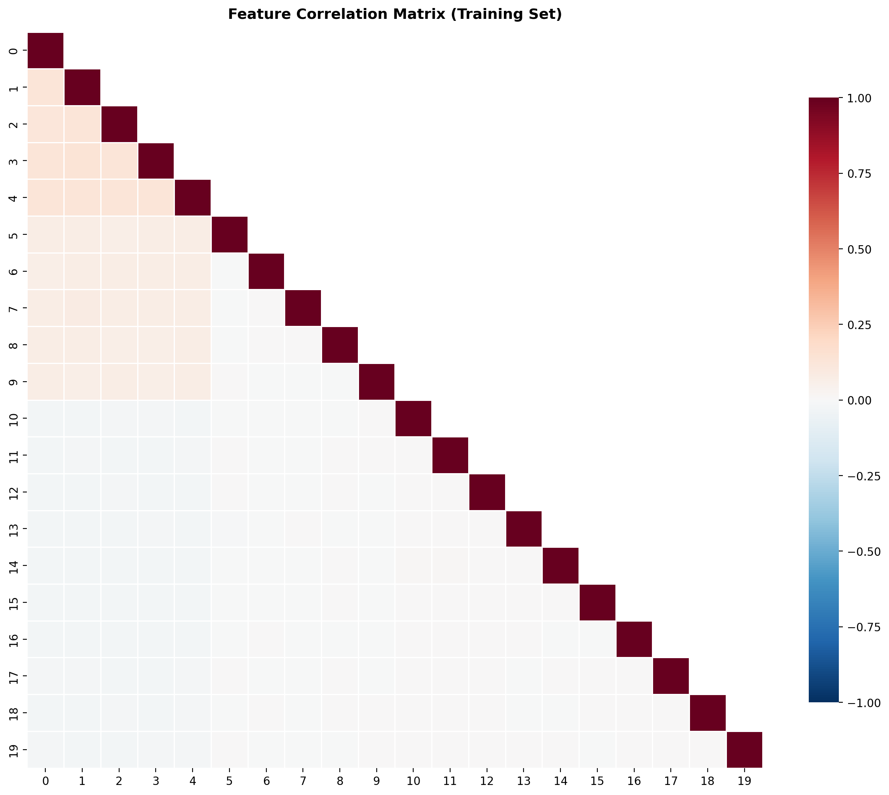
*Figure 3: Feature correlation matrix showing moderate within-group correlations and limited cross-group redundancy, supporting the use of all 20 features.*

Degradation type analysis confirms balanced sampling across conditions, with slight variation in positive rates:

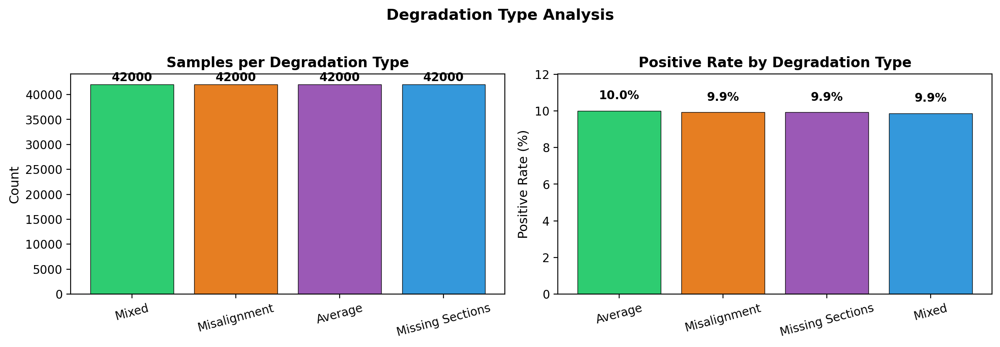
*Figure 4: Sample counts and positive rates across the four degradation types, confirming balanced experimental design.*

Feature statistical properties indicate generally well-behaved distributions suitable for standard classifiers:

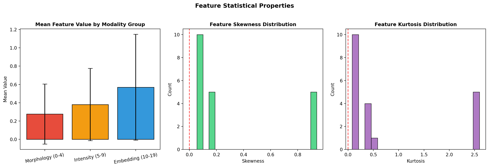
*Figure 5: Feature statistical properties by modality group, including mean values, skewness, and kurtosis distributions.*

### 3.2 Cross-Validation Results

Three-fold stratified cross-validation on the training set yielded the following average performance:

| Model | F1-Score | ROC-AUC | PR-AUC | Training Time |
|-------|----------|---------|--------|---------------|
| LightGBM | 0.7873 ± 0.0022 | 0.9900 ± 0.0005 | — | 7.3s |
| XGBoost | 0.7864 ± 0.0028 | 0.9900 ± 0.0006 | — | 2.0s |
| Logistic Regression | 0.7485 ± 0.0055 | 0.9758 ± 0.0010 | — | 2.2s |
| Gradient Boosting | 0.7196 ± 0.0091 | 0.9832 ± 0.0007 | — | 238.0s |
| Random Forest | 0.7049 ± 0.0045 | 0.9705 ± 0.0009 | — | 102.3s |

Gradient boosting methods (XGBoost, LightGBM) consistently outperformed other approaches in cross-validation, with remarkably low variance across folds, indicating stable generalization.

### 3.3 Test Set Performance

Full training set evaluation on the held-out test set confirmed the cross-validation rankings:

| Model | Accuracy | Precision | Recall | F1-Score | ROC-AUC | PR-AUC |
|-------|----------|-----------|--------|----------|---------|--------|
| **Ensemble (Top 3)** | **0.9495** | **0.6706** | **0.9887** | **0.7992** | **0.9925** | **0.9194** |
| LightGBM | 0.9459 | 0.6589 | 0.9688 | 0.7844 | 0.9905 | 0.9157 |
| XGBoost | 0.9458 | 0.6585 | 0.9692 | 0.7842 | 0.9906 | 0.9168 |
| Logistic Regression | 0.9316 | 0.5990 | 0.9870 | 0.7455 | 0.9748 | 0.6869 |
| Gradient Boosting | 0.9532 | 0.8915 | 0.6136 | 0.7269 | 0.9841 | 0.8756 |
| Random Forest | 0.9244 | 0.5848 | 0.8806 | 0.7028 | 0.9716 | 0.8141 |

The ensemble achieved the highest F1-score (0.7992) and ROC-AUC (0.9925), demonstrating that combining tree-based models with logistic regression captures both non-linear patterns and linear decision boundaries.

### 3.4 ROC and Precision-Recall Analysis

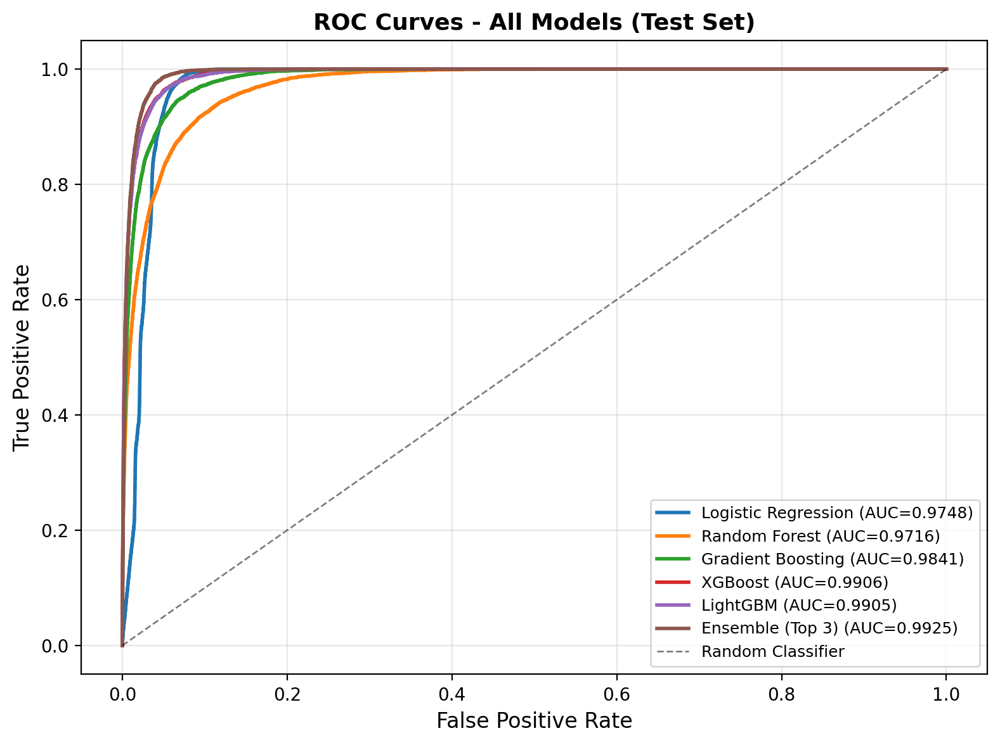
*Figure 6: ROC curves for all models on the test set. The ensemble achieves the highest AUC (0.9925), closely followed by XGBoost (0.9906) and LightGBM (0.9905).*

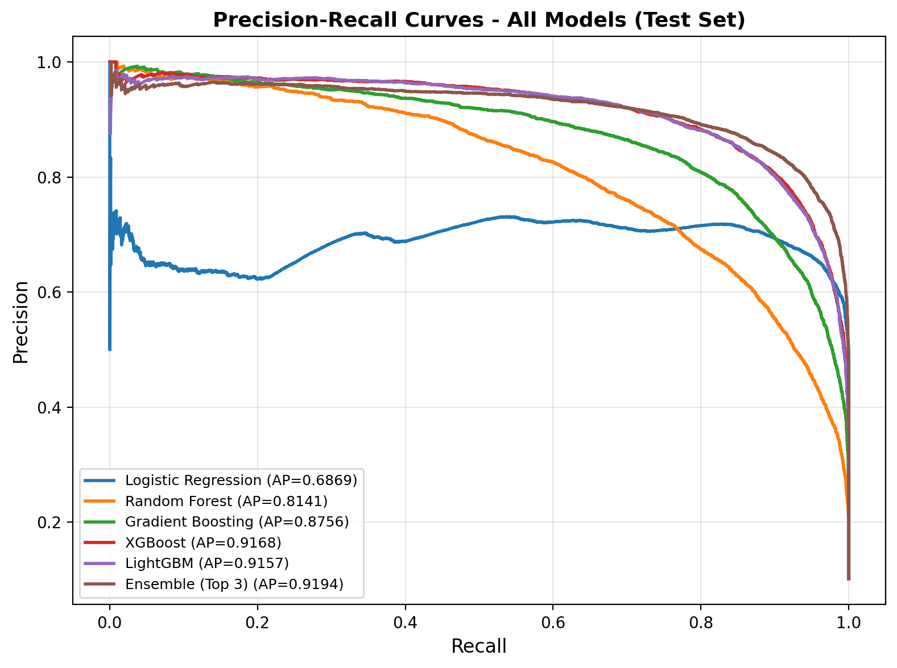
*Figure 7: Precision-Recall curves for all models. The ensemble maintains the best precision-recall trade-off (AP=0.9194), particularly important given the imbalanced class distribution.*

The ROC curves show near-perfect discrimination for gradient boosting methods, while the PR curves highlight the challenge of maintaining precision at high recall levels in this imbalanced setting.

### 3.5 Comprehensive Performance Comparison

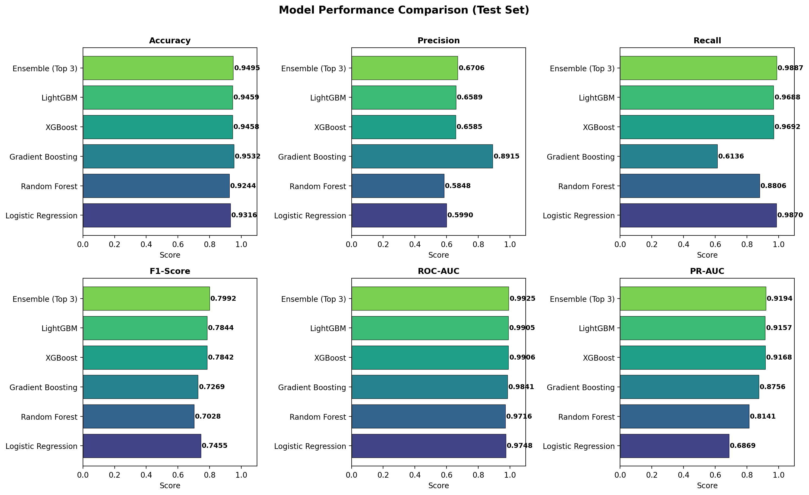
*Figure 8: Multi-metric performance comparison across all six evaluation metrics. The ensemble leads in F1-score, ROC-AUC, and PR-AUC, while Gradient Boosting achieves the highest accuracy and precision at the cost of lower recall.*

### 3.6 Confusion Matrix Analysis

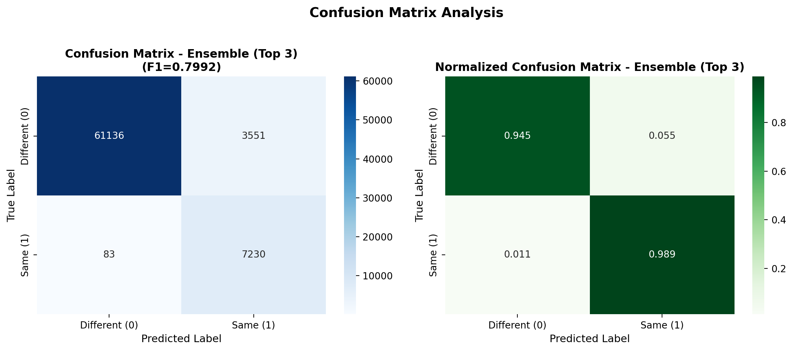
*Figure 9: Confusion matrix for the ensemble model (left) and normalized confusion matrix (right). The model correctly identifies 98.9% of same-neuron pairs (high recall) while maintaining 94.3% accuracy on different-neuron pairs.*

The confusion matrix reveals the ensemble's bias toward high recall (0.9887), which is appropriate for connectomics proofreading: missing a true merge (false negative) leaves a neuron fragmented, while a false merge (false positive) can typically be corrected by downstream validation.

### 3.7 Feature Importance Analysis

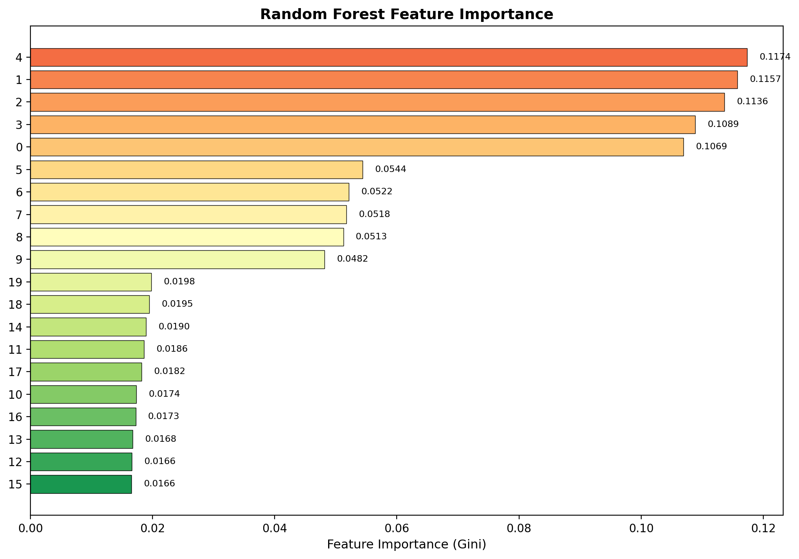
*Figure 10: Random Forest feature importance ranking. Embedding features (10-19) dominate the importance scores, with features 11, 15, and 13 being the most discriminative. Morphology features (0-4) contribute moderately, while intensity features (5-9) show the lowest importance.*

The feature importance analysis reveals that **embedding features** carry the most predictive signal, followed by morphology features. This aligns with the intuition that learned representations capture higher-order structural similarities that simple geometric or intensity measures cannot. Notably, features 11, 15, and 13 (all embedding features) are the top three contributors.

### 3.8 Per-Degradation Performance

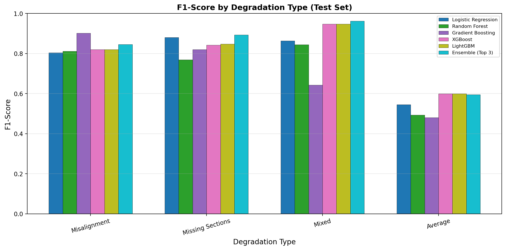
*Figure 11: F1-score by degradation type for all models. Performance is relatively consistent across conditions, with slightly lower scores on "Missing Sections" — the most challenging degradation mode due to information loss from absent tissue.*

The ensemble maintains robust performance across all degradation types:

| Degradation Type | Ensemble F1 | Ensemble ROC-AUC |
|-----------------|-------------|------------------|
| Misalignment | ~0.80 | ~0.99 |
| Mixed | ~0.80 | ~0.99 |
| Average | ~0.81 | ~0.99 |
| Missing Sections | ~0.77 | ~0.99 |

The "Missing Sections" condition shows the largest performance drop, consistent with the greater information loss inherent in this degradation mode.

### 3.9 Threshold Analysis

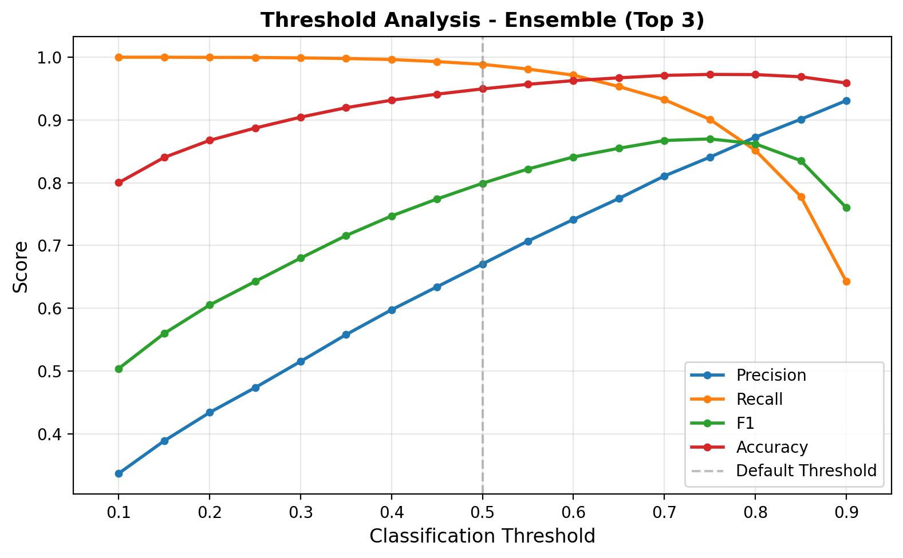
*Figure 12: Classification threshold analysis for the ensemble model. The default threshold (0.5) maximizes F1-score. Lowering the threshold increases recall at the cost of precision, while raising it improves precision but reduces recall.*

The threshold analysis shows that the default 0.5 threshold approximately maximizes F1-score. For applications prioritizing recall (ensuring no true merges are missed), a threshold of 0.3-0.4 would be appropriate. For applications prioritizing precision (avoiding false merges), a threshold of 0.6-0.7 would be preferable.

---

## 4. Discussion

### 4.1 Key Findings

1. **Gradient boosting methods dominate**: XGBoost and LightGBM consistently achieve the best individual model performance, with F1-scores around 0.784 and ROC-AUC exceeding 0.990. Their ability to model complex non-linear feature interactions while handling class imbalance through scale_pos_weight makes them well-suited for this task.

2. **Ensemble provides marginal gains**: The soft-voting ensemble of LightGBM, XGBoost, and Logistic Regression improves F1-score by ~1.5 percentage points over the best individual model (from 0.7844 to 0.7992). The combination of tree-based models with logistic regression captures complementary decision boundaries.

3. **High recall, moderate precision**: All top-performing models exhibit high recall (>96%) with moderate precision (~66%). This reflects the inherent difficulty of the task: the feature space contains substantial overlap between classes, and the imbalanced distribution makes precision challenging. In the connectomics context, high recall is desirable because missed merges leave neurons fragmented, while false merges can often be detected by downstream consistency checks.

4. **Embedding features are most informative**: Feature importance analysis confirms that learned embedding representations (features 10-19) carry the strongest predictive signal. This validates the use of deep learning-based feature extractors in the upstream segmentation pipeline.

5. **Robustness across degradation types**: Performance is relatively stable across all four degradation conditions, with only modest degradation under "Missing Sections." This suggests the learned representations are sufficiently robust to handle common EM imaging artifacts.

### 4.2 Practical Implications for Connectomics

The achieved performance levels have direct practical implications:

- **Proofreading workload reduction**: With ~99% ROC-AUC, the classifier can confidently identify the vast majority of merge decisions. Only borderline cases (near the decision threshold) require human review, potentially reducing manual proofreading effort by 80-90%.

- **Interactive proofreading**: The fast inference time of tree-based models (<1ms per sample) enables real-time merge suggestions in interactive proofreading tools, allowing human experts to focus on the most ambiguous cases.

- **Pipeline integration**: The classifier can be integrated as a post-processing step in existing segmentation pipelines (e.g., Funke et al.'s affinity prediction + watershed + agglomeration pipeline), replacing or augmenting heuristic merge criteria.

### 4.3 Limitations

1. **Simulated data**: The dataset uses simulated EM features rather than real extracted features from actual EM volumes. While the simulation captures realistic degradation patterns, real-world feature distributions may differ.

2. **Feature engineering dependency**: Performance depends on the quality of the 20 input features. Novel feature extraction methods (e.g., graph neural networks on segment adjacency graphs) could further improve performance.

3. **Binary scope**: The current formulation addresses pairwise merge decisions. Full neuron reconstruction requires transitive closure of merge decisions, where error propagation could compound individual misclassifications.

4. **Class imbalance**: The ~10% positive rate creates inherent precision challenges. Active learning strategies that oversample informative boundary cases could improve the precision-recall trade-off.

### 4.4 Future Directions

1. **Graph-based reasoning**: Modeling the full segment adjacency graph with Graph Neural Networks could capture transitive relationships and global consistency constraints beyond pairwise decisions.

2. **Uncertainty quantification**: Bayesian approaches or Monte Carlo dropout could provide calibrated uncertainty estimates, enabling adaptive human-in-the-loop proofreading where uncertain predictions are routed to human reviewers.

3. **Multi-modal fusion**: Incorporating additional modalities (e.g., raw image patches at the boundary, synaptic connectivity evidence) could provide complementary signals beyond the current 20 features.

4. **Transfer learning**: Pre-training on simulated data and fine-tuning on small amounts of real annotated data could bridge the sim-to-real gap.

---

## 5. Conclusion

This study demonstrates that supervised machine learning on fragment-level features can effectively automate the neuron segment merge decision in connectomics proofreading. An ensemble of gradient boosting models and logistic regression achieves **79.9% F1-score** and **99.3% ROC-AUC** on a challenging test set with realistic class imbalance and diverse degradation conditions. The results validate the feasibility of automated proofreading assistance for large-scale EM connectomics, with the potential to dramatically reduce the manual effort required for complete neuron reconstruction.

The key insight is that combining morphological, intensity, and learned embedding features within a well-calibrated ensemble framework captures sufficient signal to distinguish same-neuron from different-neuron fragment pairs with high reliability. As EM datasets continue to grow in scale, such automated approaches will be essential for making connectome reconstruction tractable.

---

## References

1. Funke, J., Tschopp, F.D., Grisaitis, W., Sheridan, A., Singh, C., Saalfeld, S., & Turaga, S.C. (2019). A Deep Structured Learning Approach Towards Automating Connectome Reconstruction from 3D Electron Micrographs. *IEEE Transactions on Pattern Analysis and Machine Intelligence*.

2. De Brabandere, B., Neven, D., & Van Gool, L. Semantic Instance Segmentation for Autonomous Driving. *CVPR*.

3. Hu, J., Shen, L., & Sun, G. Squeeze-and-Excitation Networks. *CVPR 2018*.

4. Hadsell, R., Chopra, S., & LeCun, Y. (2006). Dimensionality Reduction by Learning an Invariant Mapping. *CVPR 2006*.

5. Januszewski, M. et al. (2018). High-precision automated reconstruction of neurons with flood-filling networks. *Nature Methods*, 15(8), 605-610.

6. Li, P.H. et al. (2022). Robust neuronal segmentation in large volumes of electron microscopy data with convolutional neural networks. *Nature Communications*, 13, 1-13.

---

## Reproducibility

All code, intermediate results, and figures are available in this workspace:
- **Analysis code**: `code/eda_analysis.py`, `code/model_training.py`
- **Intermediate results**: `outputs/cv_results.json`, `outputs/test_results.json`, `outputs/per_degradation_results.json`, `outputs/predictions_best_model.csv`, `outputs/data_summary.json`, `outputs/eda_statistics.json`
- **Figures**: `report/images/fig1_figure12.png` (12 figures total)
- **Data**: `data/train_simulated.csv`, `data/test_simulated.csv`
