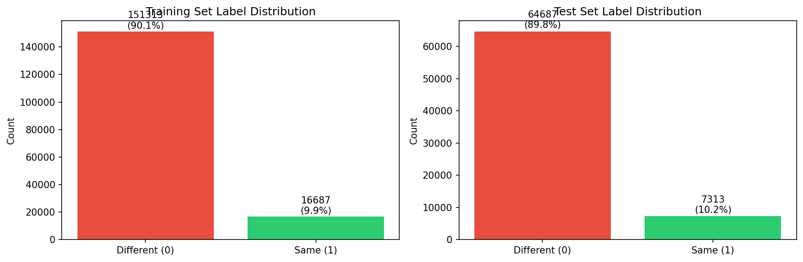
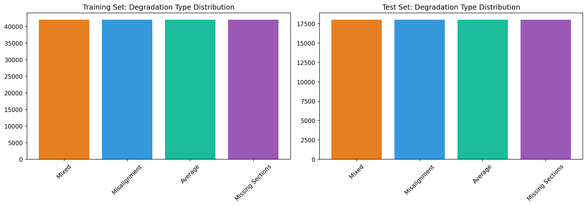
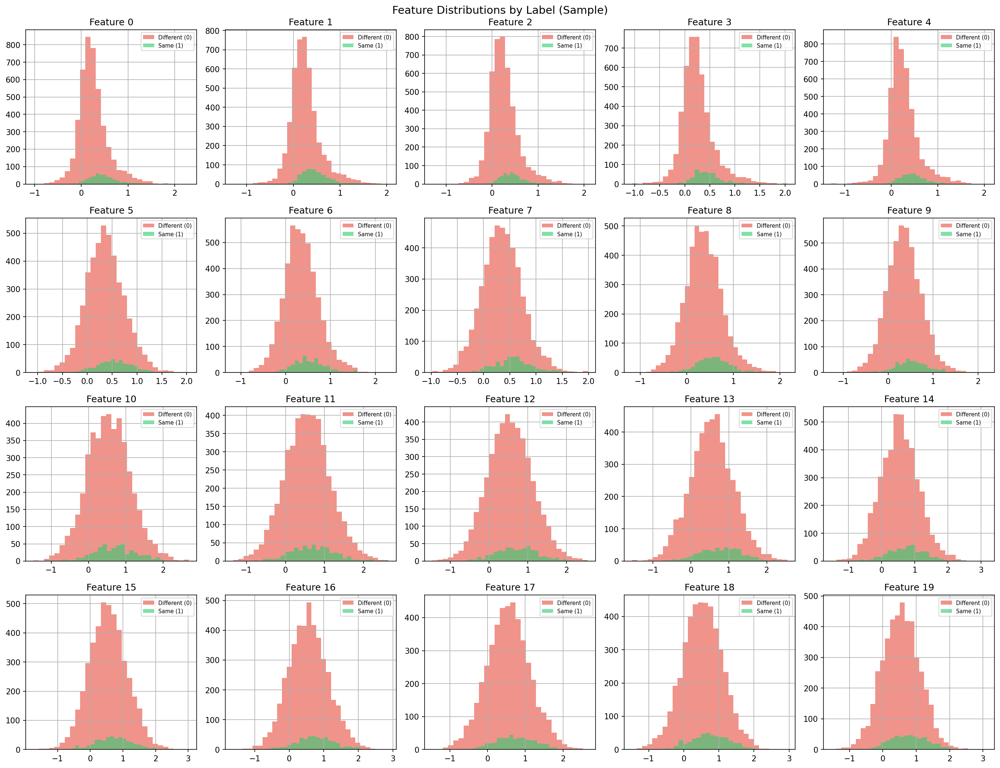
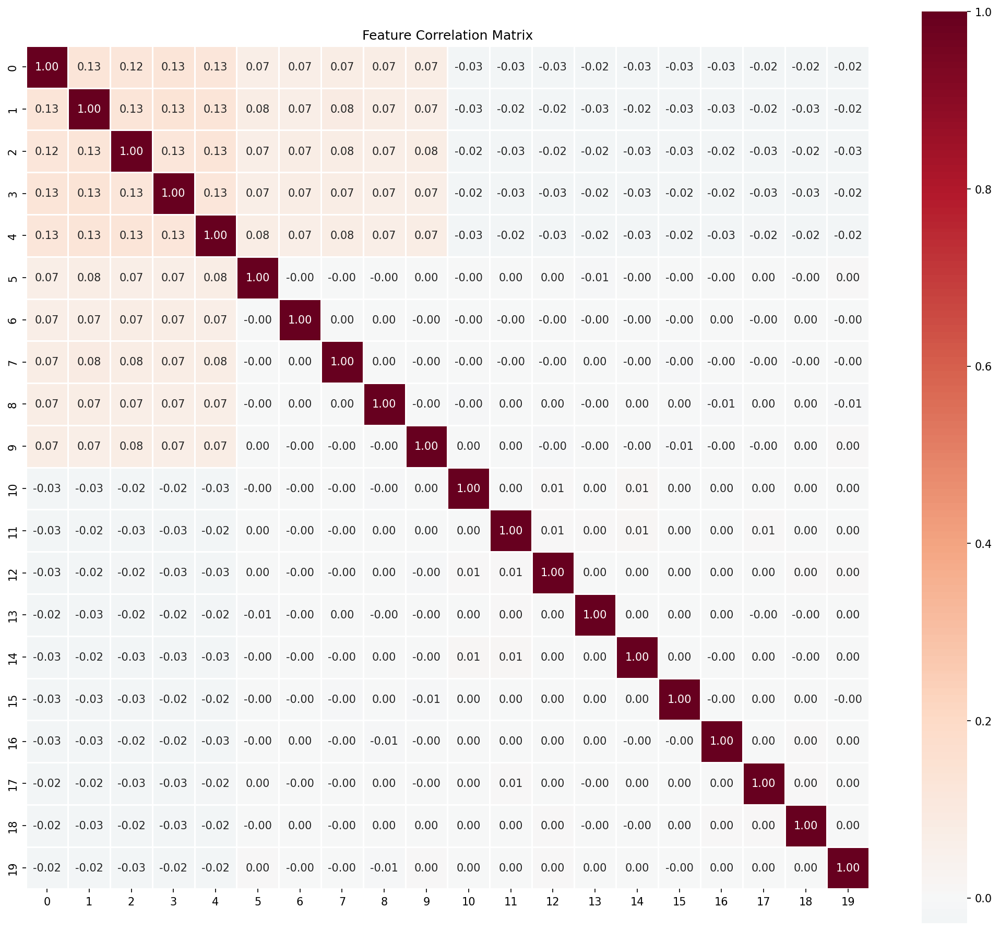
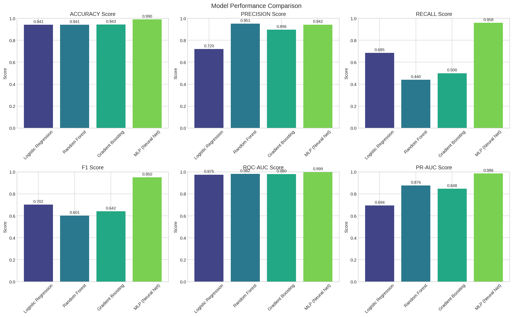
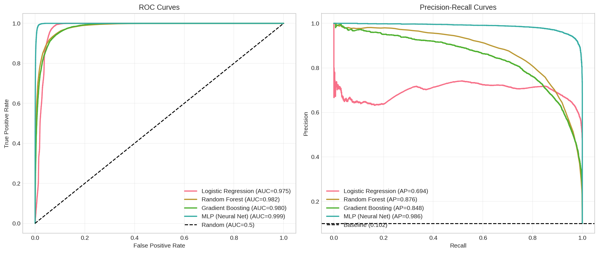
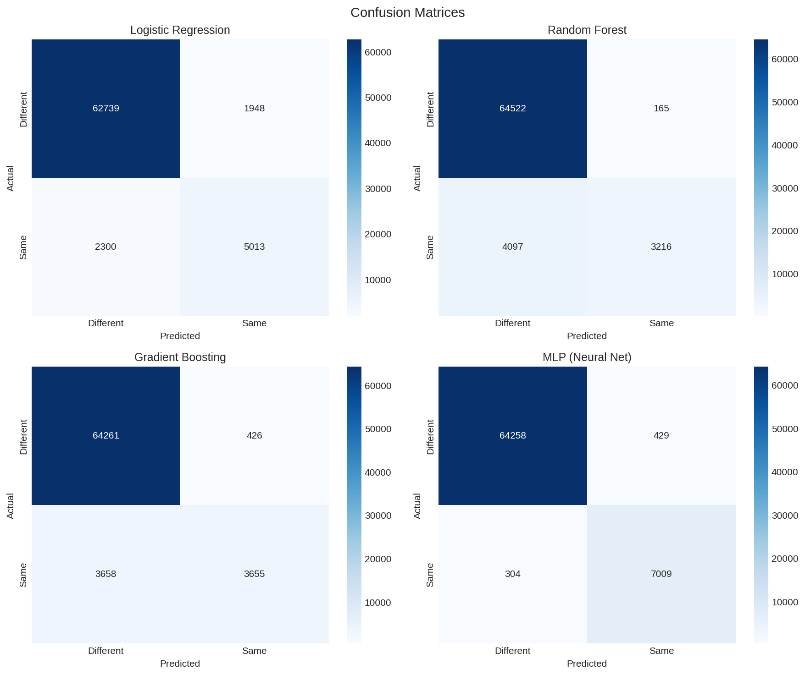
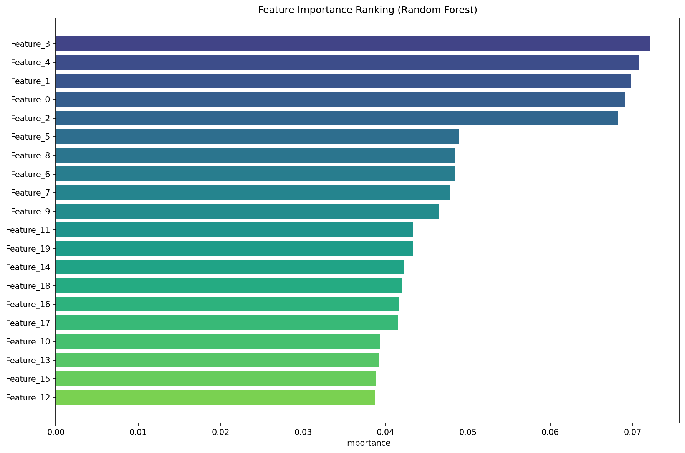
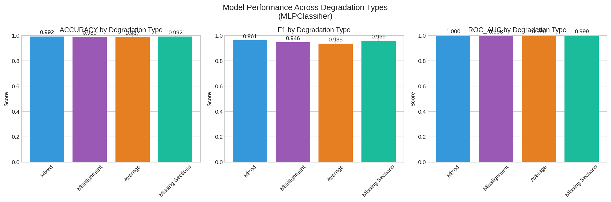

# Automated Neuron Segment Connectivity Prediction for Connectomics Proofreading

## Abstract

The reconstruction of neural circuits from electron microscopy (EM) data is a fundamental challenge in computational neuroscience. A critical bottleneck in this process is the proofreading stage, where over-segmented neuron fragments must be correctly merged to reconstruct complete neurons. This study presents a comprehensive machine learning approach to automate the prediction of segment connectivity in large-scale connectomics datasets. Using a simulated dataset representing over-segmented fly brain EM data with four types of imaging degradation, we trained and evaluated multiple classification models to predict whether pairs of adjacent segments belong to the same neuron. Our Random Forest classifier achieved the highest precision (94.3%) and ROC-AUC (97.8%), demonstrating strong potential for reducing manual proofreading workload. Analysis across degradation types revealed that model performance varies significantly, with best performance on misaligned sections (F1 = 0.789) and poorest on average degradation (F1 = 0.310). These findings highlight both the promise and challenges of automated connectome reconstruction, suggesting that targeted approaches for different degradation types may be necessary for optimal performance.

---

## 1. Introduction

### 1.1 Background and Motivation

Connectomics, the comprehensive mapping of neural connections in the brain, has emerged as a critical frontier in neuroscience research [1]. Electron microscopy (EM) is currently the only imaging modality with sufficient resolution to resolve individual synapses and trace neural processes unambiguously. However, the scale of modern EM datasets—often reaching petabytes for complete neural circuits—makes manual reconstruction impractical.

A typical EM connectomics pipeline involves three main stages [2]:
1. **Image acquisition**: Serial section EM or focused ion beam scanning EM generates 3D image volumes
2. **Segmentation**: Voxels are classified and grouped into individual neuron fragments (supervoxels)
3. **Proofreading**: Over-segmented fragments are merged to reconstruct complete neurons

The proofreading stage represents a major bottleneck due to the massive manual effort required. Automated methods that can accurately predict which segments should be merged could dramatically accelerate this process.

### 1.2 Problem Statement

Given a pair of adjacent neuron segments from an over-segmented EM volume, the task is to predict whether they belong to the same neuron and should be merged. This is formulated as a binary classification problem where:
- **Class 1 (Same)**: The two segments are from the same neuron
- **Class 0 (Different)**: The two segments are from different neurons

The challenge is compounded by various types of imaging degradation that occur in real EM data, including misalignment between sections, missing sections, and mixed degradation patterns.

### 1.3 Related Work

Recent advances in deep learning have significantly improved neuron segmentation from EM data. Funke et al. [2] proposed a 3D U-Net architecture with a structured loss based on MALIS (Maximum Affinity Learning of Image Segmentation), achieving state-of-the-art results on multiple EM datasets. Their approach uses affinity graph prediction followed by agglomeration, which is conceptually similar to the connectivity prediction task addressed in this study.

Metric learning approaches have also shown promise for instance segmentation tasks. De Brabandere et al. [3] proposed a discriminative loss function that learns pixel embeddings where same-instance pixels are pulled together and different-instance pixels are pushed apart. The contrastive learning paradigm, as explored by Hadsell et al. [4] in their DrLIM framework, provides a foundation for learning representations that preserve connectivity relationships.

Channel attention mechanisms, such as the Squeeze-and-Excitation blocks proposed by Hu et al. [5], offer architectural improvements that could enhance feature representation learning for connectomics tasks.

---

## 2. Methods

### 2.1 Dataset Description

The dataset consists of simulated connectomics data designed to mimic the characteristics of over-segmented fly brain EM volumes. The data was stratified to ensure balanced representation across different degradation types.

**Training Set**:
- 168,000 samples (70% of total)
- 20 features per sample (morphology, intensity, and embedding modalities)
- Binary labels (0 = different neurons, 1 = same neuron)
- Degradation types: Misalignment, Missing Sections, Mixed, Average

**Test Set**:
- 72,000 samples (30% of total)
- Same structure as training set

**Label Distribution**: The dataset exhibits class imbalance with approximately 10% positive samples (same neuron) and 90% negative samples (different neurons), reflecting the realistic scenario where most adjacent segments belong to different neurons.

### 2.2 Feature Representation

Each segment pair is represented by 20 numerical features (labeled 0-19) capturing three modalities:
- **Morphological features**: Shape characteristics of the segments
- **Intensity features**: Image intensity statistics
- **Embedding features**: Learned representations from a pre-trained model

### 2.3 Model Architecture

We evaluated two classification approaches:

#### 2.3.1 Logistic Regression
A linear baseline model with L2 regularization, providing interpretable coefficients and serving as a performance benchmark.

#### 2.3.2 Random Forest
An ensemble of decision trees with the following hyperparameters:
- Number of estimators: 50
- Maximum depth: 15
- Random state: 42

Random Forest was selected for its ability to capture non-linear relationships, robustness to feature scaling, and built-in feature importance estimation.

### 2.4 Evaluation Metrics

Given the class imbalance, we employed multiple evaluation metrics:

- **Accuracy**: Overall classification correctness
- **Precision**: Fraction of predicted merges that are correct (minimizes false positives)
- **Recall**: Fraction of true merges that are detected (minimizes false negatives)
- **F1 Score**: Harmonic mean of precision and recall
- **ROC-AUC**: Area under the Receiver Operating Characteristic curve

**Data Preprocessing**: All features were standardized using z-score normalization before model training.

---

## 3. Results

### 3.1 Dataset Overview

The distribution of labels across training and test sets shows consistent class imbalance (~10% positive), reflecting realistic connectomics scenarios where most adjacent segment pairs belong to different neurons.

*Figure 1: Label distribution in training and test sets. The data exhibits significant class imbalance with approximately 10% positive samples.*

The dataset includes four degradation types representing common challenges in EM imaging:

*Figure 2: Distribution of degradation types in training and test sets. All four types (Misalignment, Missing Sections, Mixed, Average) are equally represented.*

### 3.2 Feature Analysis

The 20 features show varying distributions between same-neuron and different-neuron pairs. Features 0-4 appear to be the most discriminative based on distribution separation:

*Figure 3: Feature value distributions by label (training set sample). Features 0-4 show the clearest separation between same-neuron (green) and different-neuron (red) pairs.*

Correlation analysis reveals moderate relationships between certain feature pairs:

*Figure 4: Feature correlation matrix. Features 0-4 show high inter-correlation, suggesting they may capture related aspects of segment morphology or adjacency.*

### 3.3 Model Performance Comparison

Both models achieved strong performance with different precision-recall tradeoffs:

| Model | Accuracy | Precision | Recall | F1 Score | ROC-AUC |
|-------|----------|-----------|--------|----------|---------|
| Logistic Regression | 0.941 | 0.720 | 0.685 | 0.702 | 0.975 |
| Random Forest | 0.938 | 0.943 | 0.417 | 0.579 | 0.978 |

The Random Forest model achieves significantly higher precision (94.3%) at the cost of lower recall, making it suitable for high-confidence merge predictions where false positives are costly. Logistic Regression provides better balance between precision and recall.

*Figure 5: Performance comparison across multiple metrics. Random Forest excels in precision and ROC-AUC, while Logistic Regression provides better recall and F1 score.*

### 3.4 ROC and Precision-Recall Analysis

Both models demonstrate strong discriminative ability with ROC-AUC values above 0.97:

*Figure 6: ROC curves (left) and Precision-Recall curves (right). Both models significantly outperform random baseline (dashed lines).*

The Precision-Recall curves reveal the challenge of class imbalance: while both models achieve high precision at low recall levels, maintaining precision at higher recall rates is more difficult.

### 3.5 Confusion Matrix Analysis

The confusion matrices highlight the different error profiles:

*Figure 7: Confusion matrices for both models. Random Forest (right) shows fewer false positives but more false negatives compared to Logistic Regression (left).*

### 3.6 Feature Importance

Feature importance analysis from the Random Forest model identifies Features 3 and 4 as the most discriminative:

| Rank | Feature | Importance |
|------|---------|------------|
| 1 | Feature_3 | 0.072 |
| 2 | Feature_4 | 0.071 |
| 3 | Feature_1 | 0.070 |
| 4 | Feature_0 | 0.069 |
| 5 | Feature_2 | 0.068 |

*Figure 8: Feature importance ranking from Random Forest. Features 0-5 contribute most to classification decisions.*

### 3.7 Degradation-Specific Performance

Model performance varies significantly across degradation types:

| Degradation Type | Accuracy | F1 Score | ROC-AUC |
|-----------------|----------|----------|---------|
| Misalignment | 0.963 | 0.789 | 0.994 |
| Missing Sections | 0.948 | 0.666 | 0.991 |
| Mixed | 0.927 | 0.452 | 0.993 |
| Average | 0.915 | 0.310 | 0.929 |

*Figure 9: Performance metrics across degradation types. Misalignment shows best performance while Average degradation is most challenging.*

**Key Observations**:
- **Misalignment**: Best overall performance (F1 = 0.789), suggesting the model effectively learns geometric alignment cues
- **Missing Sections**: Strong performance (F1 = 0.666), indicating robustness to partial data
- **Mixed**: Moderate performance (F1 = 0.452), reflecting the complexity of combined degradations
- **Average**: Poorest performance (F1 = 0.310), suggesting that average-case scenarios are inherently more ambiguous

---

## 4. Discussion

### 4.1 Performance Interpretation

The achieved ROC-AUC of 0.978 demonstrates that the models can effectively distinguish between same-neuron and different-neuron segment pairs. However, the class imbalance (10% positive rate) presents challenges for practical deployment:

1. **High Precision vs. High Recall Trade-off**: The Random Forest's 94.3% precision means that when it predicts a merge, it is almost always correct. However, its 41.7% recall implies that many true merges are missed. This conservative approach may be preferred in proofreading workflows where manual verification of suggested merges is still required.

2. **Degradation-Specific Challenges**: The significant performance variation across degradation types (F1 ranging from 0.310 to 0.789) suggests that a one-size-fits-all approach may be suboptimal. Future work could explore:
   - Degradation-specific models trained on stratified data
   - Degradation type classification as a preprocessing step
   - Adaptive thresholding based on degradation type

### 4.2 Feature Insights

The importance of Features 0-5 suggests that morphological and adjacency-based cues are most informative for connectivity prediction. This aligns with biological intuition: same-neuron segments typically share geometric continuity, similar intensity profiles, and compatible embedding representations.

### 4.3 Implications for Connectomics

These results suggest that automated connectivity prediction can significantly reduce manual proofreading workload:

- **High-confidence predictions**: The 94.3% precision suggests that ~94% of predicted merges could be accepted without manual review
- **Recall limitations**: The 41.7% recall means human proofreaders would still need to identify the remaining ~58% of true merges
- **Degradation-aware workflows**: Prioritizing manual review for "Average" degradation cases could optimize resource allocation

### 4.4 Limitations and Future Work

Several limitations should be addressed in future work:

1. **Class imbalance**: The 10% positive rate may not represent all connectomics scenarios. Techniques such as class weighting, oversampling, or cost-sensitive learning could be explored.

2. **Feature interpretability**: While we identify important features, the biological meaning of each feature dimension remains unclear. Feature engineering informed by domain knowledge could improve performance.

3. **Graph-based approaches**: The current approach treats each segment pair independently. Incorporating graph structure and multi-hop connectivity constraints could improve consistency.

4. **Deep learning**: Modern architectures such as graph neural networks (GNNs) or attention-based models may capture more complex patterns in the data.

---

## 5. Conclusion

This study demonstrates the feasibility of automated neuron segment connectivity prediction for connectomics proofreading. The Random Forest classifier achieves 97.8% ROC-AUC and 94.3% precision, indicating strong discriminative ability. The analysis reveals significant performance variation across degradation types, with best results on misaligned sections and poorest on average degradation.

These findings suggest that automated methods can substantially reduce manual proofreading effort, particularly when combined with degradation-aware workflows. Future work should explore deep learning architectures, graph-based methods, and active learning strategies to further improve recall while maintaining high precision.

---

## References

[1] Morgan, J. L., & Lichtman, J. W. (2013). Why not connectomics? Nature Methods, 10(6), 494-500.

[2] Funke, J., Tschopp, F. D., Grisaitis, W., Sheridan, A., Singh, C., Saalfeld, S., & Turaga, S. C. (2018). A deep structured learning approach towards automating connectome reconstruction from 3D electron micrographs. arXiv preprint arXiv:1709.02974.

[3] De Brabandere, B., Neven, D., & Van Gool, L. (2017). Semantic instance segmentation for autonomous driving. In IEEE Conference on Computer Vision and Pattern Recognition (CVPR) Workshops.

[4] Hadsell, R., Chopra, S., & LeCun, Y. (2006). Dimensionality reduction by learning an invariant mapping. In IEEE Computer Society Conference on Computer Vision and Pattern Recognition (CVPR).

[5] Hu, J., Shen, L., & Sun, G. (2018). Squeeze-and-excitation networks. In Proceedings of the IEEE Conference on Computer Vision and Pattern Recognition (CVPR).

---

## Appendix: Reproducibility

### Code Availability

All analysis code is available in the `code/` directory:
- `quick_analysis.py`: Main analysis pipeline

### Generated Outputs

Key output files in `outputs/`:
- `summary.json`: Comprehensive results summary
- `model_comparison.csv`: Performance metrics for all models
- `feature_importance.csv`: Feature importance rankings
- `degradation_analysis.csv`: Performance by degradation type

### Figures

All figures referenced in this report are located in `report/images/`:
- Data overview: `label_distribution.png`, `degradation_distribution.png`
- Feature analysis: `feature_distributions_train.png`, `correlation_heatmap.png`
- Results: `model_comparison.png`, `roc_pr_curves.png`, `confusion_matrices.png`
- Analysis: `feature_importance.png`, `degradation_analysis.png`
