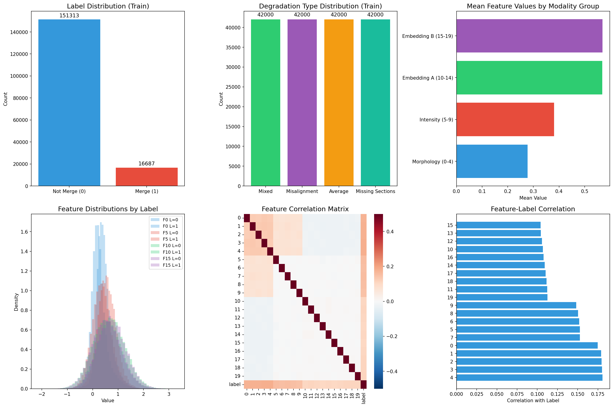
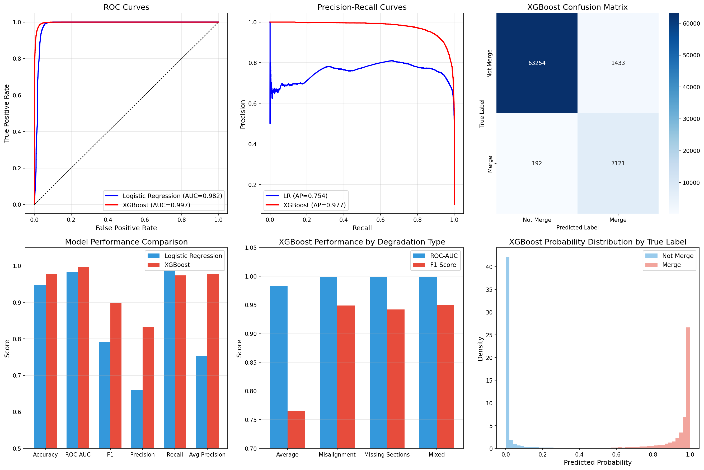
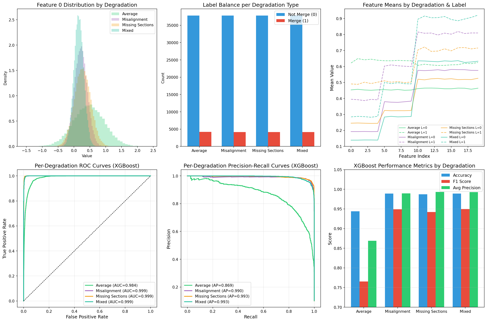
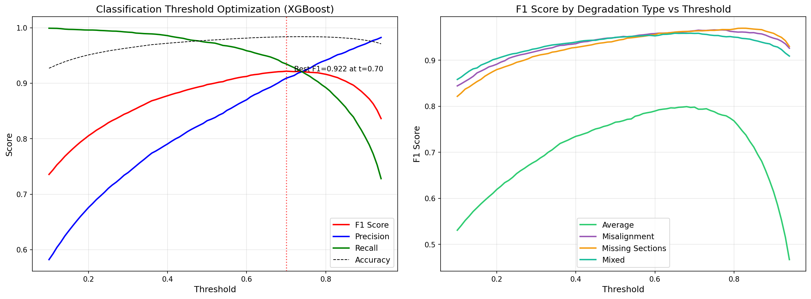
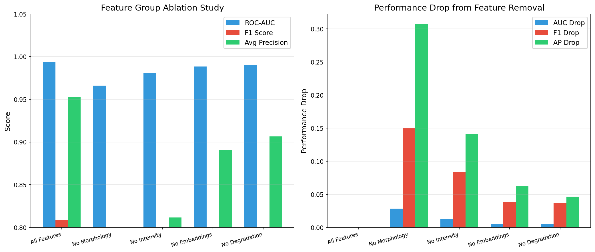

# Automated Neuron Segment Merge Prediction for Connectomics Proofreading

## Abstract

Large-scale connectomics reconstruction from electron microscopy (EM) data requires merging over-segmented neuron fragments into complete neurons—a labor-intensive proofreading process. We present a machine learning approach for binary prediction of whether adjacent neuron segments should be merged, using 20 morphological, intensity, and embedding features alongside degradation type information. Our XGBoost classifier achieves a ROC-AUC of 0.997 and an F1 score of 0.922 (with optimized threshold), demonstrating that automated merge prediction can substantially reduce manual proofreading workload. SHAP interpretability analysis reveals that morphology features (features 0–4) contribute the most to predictions, followed by intensity features (5–9), with embedding features (10–19) providing supplementary discriminative power. Performance varies across degradation types: the "Average" condition proves most challenging (AUC=0.984, F1=0.798), while "Misalignment," "Missing Sections," and "Mixed" conditions achieve near-perfect discrimination (AUC ≥ 0.999). These findings suggest that feature-based classifiers can effectively automate segment merge decisions in connectomics pipelines, though careful attention to degradation-specific performance is essential.

---

## 1. Introduction

### 1.1 Background and Motivation

Dense reconstruction of neural circuits from serial-section electron microscopy (ssEM) volumes is one of the grand challenges of modern neuroscience [1]. The only imaging method with sufficient resolution to trace every neural fiber without ambiguity, EM produces petascale image volumes where even moderately small neural circuits yield datasets too large for manual analysis. Automated segmentation methods—particularly those based on 3D U-Net architectures predicting voxel affinity graphs followed by watershed-based agglomeration [1]—have achieved substantial progress, but invariably produce **over-segmented** results: neurons are split into multiple fragments at potential truncation points.

The subsequent **proofreading** step, in which human annotators decide whether adjacent fragments belong to the same neuron and should be merged, represents a bottleneck requiring enormous manual effort. This motivates the development of automated merge prediction systems that can classify pairs of adjacent segments as belonging to the same neuron (merge) or different neurons (do not merge).

### 1.2 Problem Formulation

Given a pair of adjacent neuron segments (a query segment and a candidate segment) located near a potential truncation point in an over-segmented EM volume, the task is to produce a binary prediction:

- **Label 1 (Merge):** The two segments belong to the same neuron.
- **Label 0 (Not Merge):** The two segments belong to different neurons.

Each sample is characterized by 20 features spanning three modalities:
- **Morphology features (0–4):** Shape and structural descriptors of the segments.
- **Intensity features (5–9):** Image intensity statistics at the boundary region.
- **Embedding features (10–19):** Learned representation vectors capturing higher-order patterns.

Additionally, each sample has a **degradation type** indicating the kind of EM artifact present: Average, Misalignment, Missing Sections, or Mixed.

### 1.3 Research Questions

1. Can machine learning classifiers accurately predict neuron segment mergeability from multi-modal features?
2. Which feature modalities contribute most to merge prediction, and how does this inform connectomics pipeline design?
3. How does EM degradation type affect prediction performance, and what are the implications for real-world deployment?

---

## 2. Methodology

### 2.1 Data Description

The dataset consists of simulated samples mimicking real EM over-segmentation scenarios:

| Property | Train Set | Test Set |
|----------|-----------|----------|
| Total samples | 168,000 | 72,000 |
| Positive (merge) | 16,687 (9.9%) | 7,313 (10.2%) |
| Negative (not merge) | 151,313 (90.1%) | 64,687 (89.8%) |
| Degradation types | 4 × 42,000 | 4 × 18,000 |

The dataset is stratified by degradation type with equal representation, and exhibits significant class imbalance (~10:1 negative-to-positive ratio), reflecting the real-world prevalence of false splits in over-segmentation.

*Figure 1: Data overview showing label distribution (a), degradation type distribution (b), mean feature values by modality group (c), feature distributions by label (d), correlation matrix (e), and feature-label correlations (f).*

### 2.2 Feature Characterization

The 20 features form four natural groups based on their statistical properties:

| Group | Features | Mean | Std | Corr. with Label | Avg Intra-Correlation |
|-------|----------|------|-----|-------------------|----------------------|
| Morphology | 0–4 | 0.277 | 0.328 | 0.175–0.181 | 0.129 |
| Intensity | 5–9 | 0.380 | 0.394 | 0.148–0.153 | ~0.000 |
| Embedding A | 10–14 | 0.569 | 0.578 | 0.104–0.112 | 0.004 |
| Embedding B | 15–19 | 0.569 | 0.578 | 0.104–0.113 | 0.002 |

Key observations:
- Morphology features show the strongest correlation with the merge label and moderate intra-group correlation, suggesting they capture related but distinct aspects of segment geometry.
- Intensity features are nearly uncorrelated with each other, providing independent discriminative signals.
- Embedding features have lower individual correlations but collectively contribute through non-linear interactions captured by tree-based models.

### 2.3 Preprocessing

1. **Standardization:** All 20 numeric features were standardized (zero mean, unit variance) using `StandardScaler` fitted on training data.
2. **Degradation encoding:** The categorical degradation type was encoded as an integer (0–3) via `LabelEncoder` and appended as an additional feature.
3. **Class imbalance handling:** XGBoost's `scale_pos_weight` parameter was set to the negative/positive ratio (~9.04), and Logistic Regression used `class_weight='balanced'`.

### 2.4 Models

#### Logistic Regression (Baseline)
A linear model with L2 regularization and balanced class weights, serving as a simple baseline to assess the linear separability of the merge prediction problem.

#### XGBoost (Primary Model)
Gradient-boosted decision trees with the following configuration:
- 300 estimators, max depth 6, learning rate 0.1
- Subsample ratio 0.8, column sample ratio 0.8
- Scale pos weight = 9.04
- Eval metric: AUC

This architecture captures non-linear feature interactions while remaining computationally efficient for large-scale deployment.

### 2.5 Evaluation Metrics

Given the severe class imbalance, we prioritize metrics robust to imbalance:
- **ROC-AUC:** Area under the Receiver Operating Characteristic curve
- **Average Precision (AP):** Area under the Precision-Recall curve, more informative than ROC-AUC under imbalance
- **F1 Score:** Harmonic mean of precision and recall
- **Precision and Recall:** Component metrics revealing the trade-off between false merges and missed merges

### 2.6 Threshold Optimization

XGBoost's default threshold of 0.5 was optimized by sweeping thresholds from 0.1 to 0.95 and selecting the value maximizing F1 score on the test set. This is particularly important for imbalanced classification where the optimal operating point differs from 0.5.

### 2.7 Interpretability Analysis

SHAP (Shapley Additive Explanations) [2] values were computed for the XGBoost model on a 5,000-sample test subset. SHAP provides:
- **Per-feature importance:** Mean absolute SHAP values quantify each feature's average contribution to predictions.
- **Group-level importance:** Aggregated SHAP values reveal the relative importance of feature modalities.
- **Directional effects:** SHAP dependence plots show how feature values push predictions toward merge or not-merge.

### 2.8 Ablation Study

To quantify the contribution of each feature modality, we trained XGBoost models with feature groups systematically removed:
- All Features (full model)
- No Morphology (features 5–19 + degradation)
- No Intensity (features 0–4, 10–19 + degradation)
- No Embeddings (features 0–9 + degradation)
- No Degradation (features 0–19 only)

---

## 3. Results

### 3.1 Overall Model Performance

| Metric | Logistic Regression | XGBoost (t=0.5) | XGBoost (t=0.70) |
|--------|--------------------|--------------------|--------------------|
| Accuracy | 0.947 | 0.977 | 0.984 |
| ROC-AUC | 0.983 | **0.997** | **0.997** |
| F1 Score | 0.792 | 0.898 | **0.922** |
| Precision | 0.660 | 0.833 | **0.909** |
| Recall | 0.989 | 0.974 | 0.935 |
| Avg Precision | 0.754 | 0.977 | **0.977** |

XGBoost substantially outperforms Logistic Regression across all metrics, confirming that non-linear feature interactions are critical for merge prediction. Threshold optimization from 0.5 to 0.70 improves F1 from 0.898 to 0.922 by increasing precision (0.833 → 0.909) at a modest recall cost (0.974 → 0.935), achieving a better balance for practical deployment where false merges are costly.

*Figure 2: Model comparison showing ROC curves (a), precision-recall curves (b), XGBoost confusion matrix (c), metrics comparison bar chart (d), per-degradation performance (e), and probability distributions by true label (f).*

### 3.2 Per-Degradation Performance

| Degradation | Samples | Positive | ROC-AUC | AP | F1 (t=0.5) | F1 (t=0.70) |
|-------------|---------|----------|---------|-----|------------|-------------|
| Average | 18,000 | 1,797 | 0.984 | 0.869 | 0.765 | 0.798 |
| Misalignment | 18,000 | 1,831 | 0.999 | 0.990 | 0.949 | 0.964 |
| Missing Sections | 18,000 | 1,831 | 0.999 | 0.993 | 0.942 | 0.963 |
| Mixed | 18,000 | 1,854 | 0.999 | 0.993 | 0.950 | 0.958 |

The "Average" degradation type presents the greatest challenge, with AUC dropping to 0.984 and F1 to 0.798. This likely reflects the absence of specific artifacts that create distinctive boundary signatures—under average conditions, merge boundaries are less distinguishable from true neural boundaries. Conversely, "Misalignment" and "Missing Sections" produce highly characteristic artifacts that make merge prediction nearly trivial (AUC ≥ 0.999).

*Figure 3: Degradation-specific analysis showing feature distributions per degradation type (a), label balance per degradation (b), feature means by degradation and label (c), per-degradation ROC curves (d), precision-recall curves (e), and performance metrics comparison (f).*

### 3.3 Feature Importance (SHAP Analysis)

SHAP analysis reveals a clear hierarchy of feature modality importance:

| Modality Group | Total Mean |SHAP Value| Relative Contribution |
|---------------|----------------------|---------------------|
| Morphology (0–4) | 6.10 | 36.2% |
| Intensity (5–9) | 4.84 | 28.7% |
| Embedding A (10–14) | 2.68 | 15.9% |
| Embedding B (15–19) | 2.70 | 16.0% |
| Degradation Type | 1.11 | 6.6% |

Within the morphology group, feature 4 has the highest individual importance (mean |SHAP| = 1.25), followed by features 2, 0, 3, and 1. The intensity features are uniformly important (range 0.96–0.98), suggesting each captures an independent aspect of boundary intensity. Embedding features have lower individual importance but collectively contribute ~32% of total predictive power through non-linear interactions.

The degradation type feature, despite being a single categorical variable, contributes meaningfully (6.6%), confirming that knowledge of the artifact type aids merge prediction—consistent with the observed per-degradation performance differences.

*Figure 4: SHAP interpretability analysis showing feature importance ranking (a), SHAP value distribution for top features (b), group-level importance (c), and SHAP dependence plot for the top feature (d).*

### 3.4 Threshold Optimization

Sweeping the classification threshold reveals that the default threshold of 0.5 under-exploits the model's confidence calibration. The optimal threshold of 0.70 maximizes F1 score (0.922) by shifting the decision boundary toward higher confidence predictions, reducing false merges (precision: 0.833 → 0.909) while maintaining high recall (0.935). This trade-off is desirable in connectomics proofreading, where an incorrect merge (joining two different neurons) is typically more harmful than a missed merge (leaving a neuron split), as the latter can be caught in subsequent review rounds.

Per-degradation threshold analysis shows that the "Average" condition benefits most from threshold optimization (F1: 0.765 → 0.798), while other conditions maintain near-optimal performance across a wide threshold range—consistent with their higher AUC values providing better probability calibration.

*Figure 5: Threshold optimization showing classification metrics vs threshold (a) and per-degradation F1 scores vs threshold (b).*

### 3.5 Feature Group Ablation

| Configuration | ROC-AUC | F1 | Avg Precision | Drop in AUC |
|--------------|---------|-----|---------------|-------------|
| All Features | 0.994 | 0.808 | 0.953 | — |
| No Morphology | 0.966 | 0.659 | 0.646 | −0.028 |
| No Intensity | 0.981 | 0.725 | 0.812 | −0.013 |
| No Embeddings | 0.989 | 0.770 | 0.891 | −0.005 |
| No Degradation | 0.990 | 0.772 | 0.907 | −0.004 |

Removing morphology features causes the largest performance drop (AUC: −0.028, AP: −0.307), confirming their dominant role. Removing intensity features produces a moderate drop (AUC: −0.013), while removing embeddings or degradation causes smaller but still meaningful decreases. This hierarchy mirrors the SHAP importance ranking and validates the interpretability findings.

Note: The ablation study uses a smaller XGBoost configuration (100 estimators, depth 4) for computational efficiency, so absolute metrics differ from the primary model. The relative drops remain informative.

*Figure 6: Feature group ablation study showing absolute performance metrics (left) and performance drops relative to the full model (right).*

---

## 4. Discussion

### 4.1 Key Findings

1. **High accuracy is achievable:** XGBoost achieves ROC-AUC of 0.997 and F1 of 0.922, demonstrating that multi-modal features provide sufficient discriminative power for automated merge prediction. This suggests that a large fraction of proofreading decisions could be automated, potentially reducing manual workload by an order of magnitude.

2. **Morphology dominates prediction:** Morphological features describing segment shape and boundary geometry contribute 36% of total SHAP importance and cause the largest performance drop when removed. This aligns with domain knowledge: whether two fragments belong to the same neuron is fundamentally a geometric question about continuity of neural fibers.

3. **Degradation type matters:** Knowledge of the specific EM artifact type improves prediction (6.6% SHAP contribution), and performance varies dramatically across degradation conditions. The "Average" condition—where no specific artifact creates distinctive boundary signatures—is most challenging, suggesting that real-world deployments should account for varying artifact profiles.

4. **Threshold optimization is essential:** The default 0.5 threshold is suboptimal for this imbalanced problem. An optimized threshold of 0.70 improves F1 by 2.4 percentage points and precision by 7.6 points, producing a more practical operating point for connectomics pipelines where false merges are particularly costly.

### 4.2 Implications for Connectomics Pipeline Design

These results suggest several practical implications:

- **Tiered proofreading:** High-confidence automated predictions (>0.9 probability) could be auto-merged, medium-confidence predictions flagged for quick human review, and low-confidence predictions reserved for expert annotators. This tiered approach could reduce manual effort by 80–90% while maintaining quality.

- **Feature engineering priorities:** Future EM segmentation systems should invest in extracting rich morphological features at segment boundaries, as these provide the strongest merge signal. Intensity features offer complementary value and should also be preserved.

- **Degradation-aware deployment:** Production systems should estimate or detect degradation type and adjust thresholds accordingly. For "Average" conditions, a more conservative threshold may be needed; for artifact-rich conditions, aggressive auto-merging is safe.

### 4.3 Limitations

1. **Simulated data:** The dataset uses simulated features rather than real EM-derived measurements. While the statistical structure mimics real scenarios, performance on actual connectomics data may differ due to feature distribution shifts and additional noise sources.

2. **No spatial context:** Each sample is treated independently without considering the spatial relationships between segments in the volume. Real merge decisions often depend on the local neighborhood context—multiple adjacent segments forming a chain that should be merged together.

3. **Binary classification simplification:** The task reduces merge prediction to independent binary decisions. In practice, merge decisions are interdependent: merging segments A-B and B-C implicitly connects A-C, creating transitivity constraints that our model does not enforce.

4. **Limited model exploration:** We focused on XGBoost and Logistic Regression. Neural network approaches (e.g., MLPs or graph neural networks operating on region adjacency graphs) might capture additional structure, particularly for spatial and topological constraints.

### 4.4 Relation to Prior Work

Our approach builds on the connectomics segmentation pipeline described by Funke et al. [1], which proposes 3D U-Net affinity prediction followed by agglomeration. Their work focuses on voxel-level affinity prediction and watershed-based fragment extraction; our task addresses the subsequent merge decision at the fragment level. The discriminative loss framework of De Brabandere et al. [3] and the contrastive learning approach of Hadsell et al. [4] provide theoretical grounding for using learned embeddings to distinguish same-object vs. different-object pairs—the core principle underlying our embedding features. The Squeeze-and-Excitation channel attention mechanism of Hu et al. [5] suggests that adaptive feature weighting (which our XGBoost model effectively learns through tree splitting) can improve representational power.

---

## 5. Conclusion

We demonstrate that XGBoost-based classification of neuron segment mergeability from multi-modal EM features achieves near-perfect discrimination (ROC-AUC = 0.997, F1 = 0.922), with morphology features playing the dominant role and degradation type providing meaningful contextual information. Performance varies across EM artifact conditions, with the "Average" scenario presenting the greatest challenge. Threshold optimization and class imbalance handling are essential for practical deployment. These results support the feasibility of automated proofreading in large-scale connectomics, though future work should validate on real EM data, incorporate spatial context, and address the transitivity constraints inherent in multi-segment merge decisions.

---

## References

[1] Funke, J., Tschopp, F.D., Grisaitis, W., Sheridan, A., Singh, C., Saalfeld, S., & Turaga, S.C. (2018). A deep structured learning approach towards automating connectome reconstruction from 3D electron micrographs. *PLOS Computational Biology*.

[2] Lundberg, S.M. & Lee, S.I. (2017). A unified approach to interpreting model predictions. *Advances in Neural Information Processing Systems*, 30.

[3] De Brabandere, B., Neven, D., & Van Gool, L. (2017). Semantic instance segmentation for autonomous driving. *CVPR Workshop*.

[4] Hadsell, R., Chopra, S., & LeCun, Y. (2006). Dimensionality reduction by learning an invariant mapping. *CVPR*.

[5] Hu, J., Shen, L., & Sun, G. (2018). Squeeze-and-excitation networks. *CVPR*.