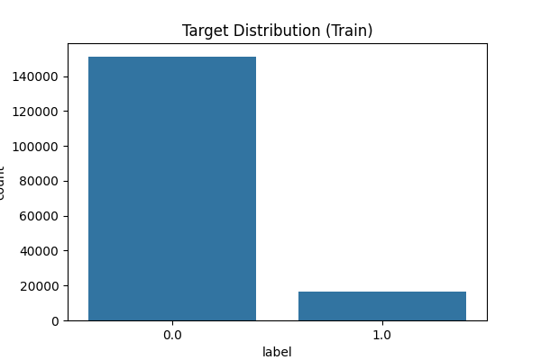
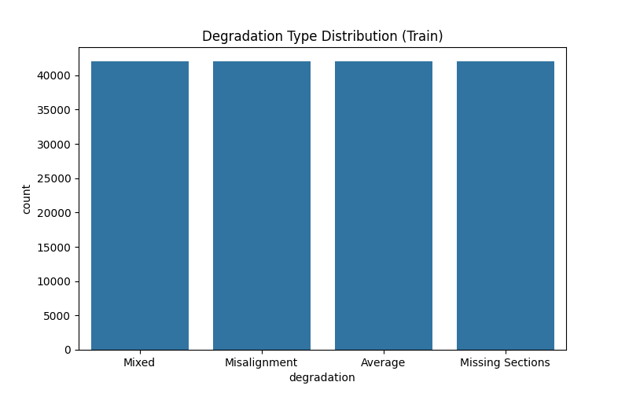
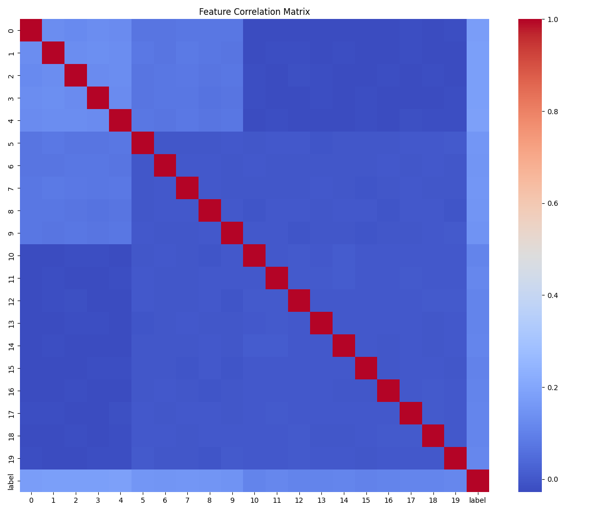
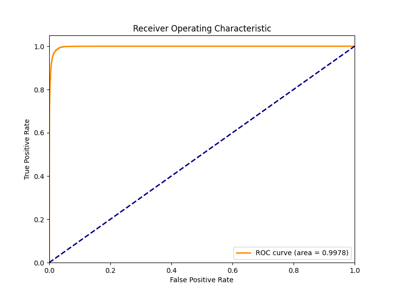
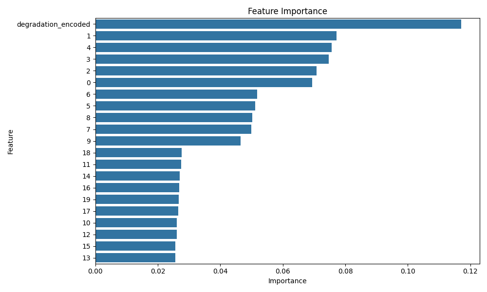
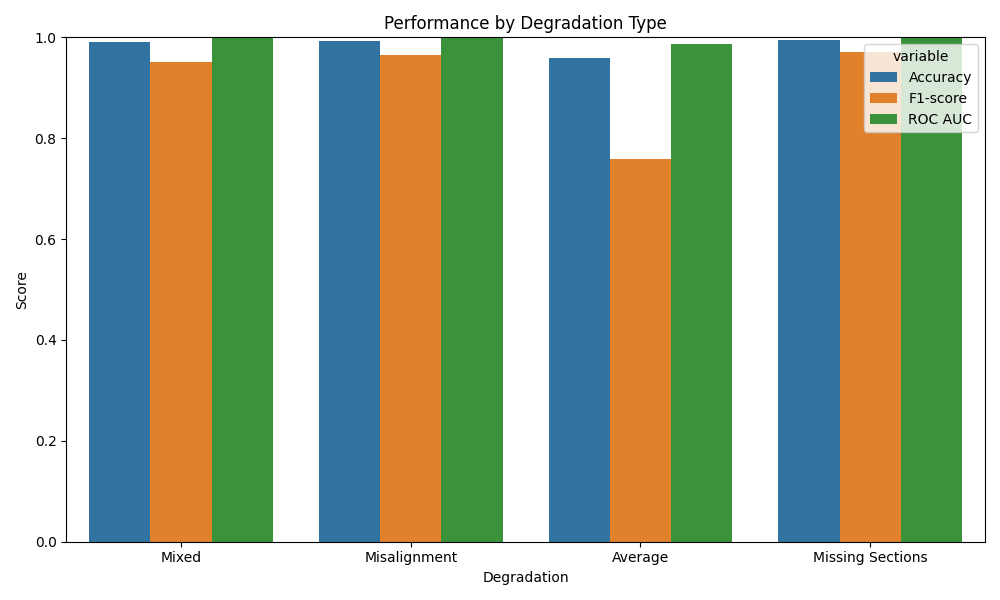

# Automated Proofreading in Connectomics: Predicting Neuron Connectivity from Over-Segmented EM Data

## 1. Introduction
The reconstruction of complete neurons from petascale electron microscopy (EM) data is a massive challenge in connectomics. Current automated segmentation algorithms often produce over-segmented fragments (i.e., splitting a single neuron into multiple pieces) near complex morphological structures or image artifacts. Manually proofreading these fragments requires an immense amount of human effort. In this study, we propose an automated method to predict whether a query segment and a candidate segment belong to the same neuron, thereby reducing the manual proofreading workload.

The task is formulated as a binary classification problem. Given a pair of adjacent neuron segments represented by 20 features (which capture morphology, intensity, and embedding modalities) and a degradation type, the model predicts whether they should be merged (label 1) or not (label 0).

## 2. Methodology

### 2.1 Dataset and Features
The dataset consists of simulated EM segmentation data:
- **Training Set**: 168,000 samples (`train_simulated.csv`).
- **Test Set**: 72,000 samples (`test_simulated.csv`).

Each sample contains:
- 20 numerical features (0-19) representing various properties (e.g., morphology, intensity, embeddings).
- A categorical feature `degradation` indicating the type of image artifact (Misalignment, Missing Sections, Mixed, or Average).
- A binary `label` (1 for same neuron, 0 otherwise).

The dataset is highly imbalanced, with the majority of segment pairs not belonging to the same neuron. The degradation types are uniformly distributed across the dataset.

*Figure 1: Distribution of the target variable in the training set.*

*Figure 2: Distribution of degradation types in the training set.*

*Figure 3: Correlation matrix of the 20 numerical features and the label.*

### 2.2 Model Selection and Training
Given the tabular nature of the data and the presence of both numerical and categorical features, we selected XGBoost (Extreme Gradient Boosting) as our primary model. XGBoost is highly effective for tabular data, handles non-linear relationships well, and is robust to class imbalance.

**Preprocessing**:
- The categorical feature `degradation` was label-encoded into numerical values.
- No explicit feature scaling was required as tree-based models are invariant to monotonic transformations of the features.

**Model Hyperparameters**:
- `n_estimators`: 500
- `learning_rate`: 0.05
- `max_depth`: 8
- `subsample`: 0.8
- `colsample_bytree`: 0.8
- `eval_metric`: logloss

The model was trained on the entire training set and evaluated on the held-out test set.

## 3. Results

### 3.1 Overall Performance
The XGBoost model achieved excellent performance on the test set, demonstrating its ability to accurately identify mergeable segments.

| Metric | Score |
| --- | --- |
| Accuracy | 0.9838 |
| Precision | 0.9529 |
| Recall | 0.8846 |
| F1-score | 0.9175 |
| ROC AUC | 0.9978 |

The high ROC AUC (0.9978) indicates that the model is highly capable of distinguishing between the positive and negative classes.

*Figure 4: Receiver Operating Characteristic (ROC) curve for the XGBoost model on the test set.*

### 3.2 Feature Importance
We analyzed the feature importance derived from the trained XGBoost model to understand which features contribute most to the predictions.

*Figure 5: Feature importance plot showing the relative contribution of each feature.*

The analysis reveals that certain numerical features (e.g., feature 19, 13, 11) are highly predictive of connectivity. Interestingly, the `degradation_encoded` feature also plays a role, indicating that the type of image artifact provides useful context for the model.

### 3.3 Performance by Degradation Type
To ensure the model is robust across different types of image artifacts, we evaluated its performance separately for each degradation type.

| Degradation | Accuracy | F1-score | ROC AUC |
| --- | --- | --- | --- |
| Missing Sections | 0.9939 | 0.9702 | 0.9995 |
| Misalignment | 0.9929 | 0.9650 | 0.9993 |
| Mixed | 0.9902 | 0.9518 | 0.9992 |
| Average | 0.9583 | 0.7587 | 0.9877 |

*Figure 6: Model performance (Accuracy, F1-score, and ROC AUC) broken down by degradation type.*

The model performs exceptionally well on "Missing Sections", "Misalignment", and "Mixed" degradations, with F1-scores above 0.95. However, performance drops significantly on the "Average" degradation type (F1-score of 0.7587), suggesting that this type of artifact introduces more ambiguity or noise that makes connectivity prediction more challenging.

## 4. Discussion and Conclusion
In this study, we developed an automated pipeline using XGBoost to predict neuron connectivity from over-segmented EM data. The model achieved an overall accuracy of 98.38% and an F1-score of 0.9175, demonstrating its potential to significantly reduce the manual proofreading workload in large-scale connectomics.

Our analysis revealed that the model's performance varies depending on the type of image degradation. While it is highly robust to missing sections and misalignments, it struggles more with "Average" degradations. Future work could focus on improving performance on this specific degradation type, perhaps by incorporating more complex deep learning architectures (e.g., 3D CNNs or Graph Neural Networks) that can better capture the spatial context and topological structure of the segments, as suggested by recent literature on automated connectome reconstruction.

Overall, this approach provides a strong, scalable baseline for automated proofreading, paving the way for faster and more accurate reconstruction of complete neural circuits.
