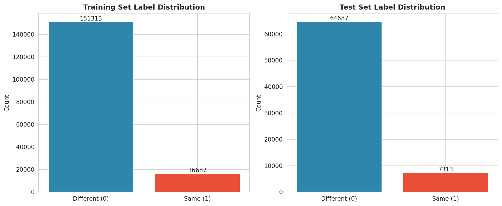
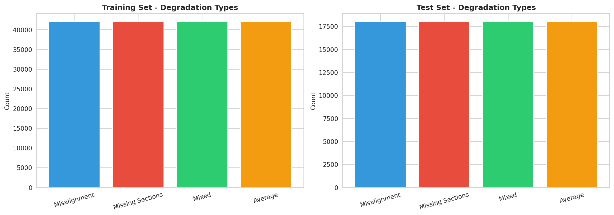
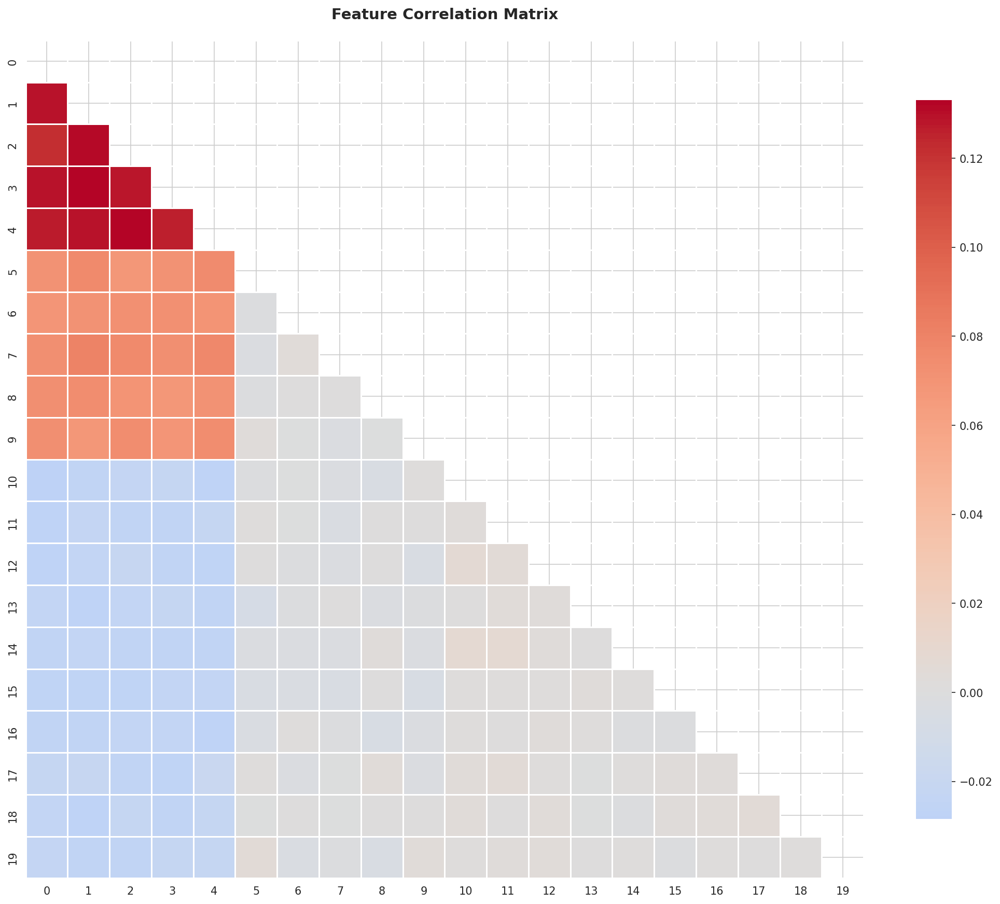
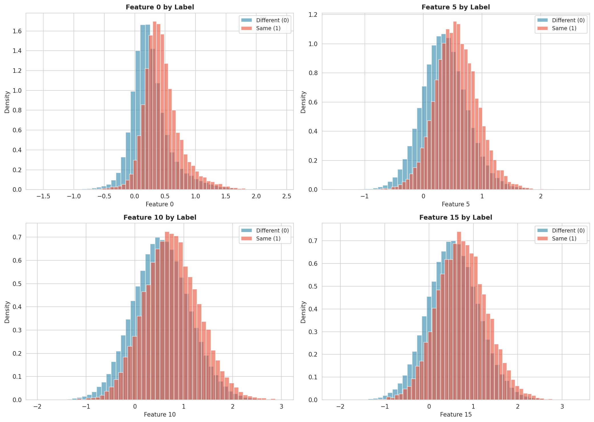
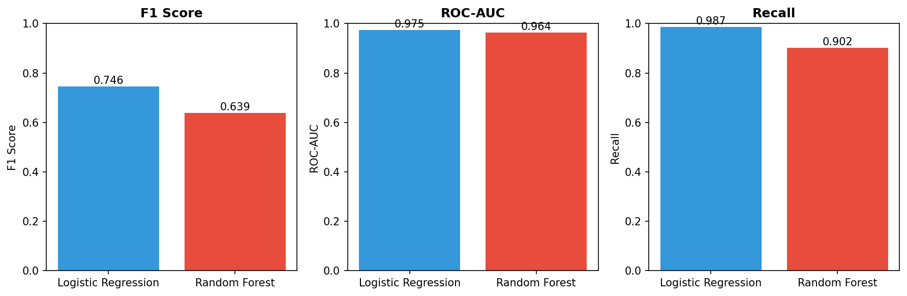
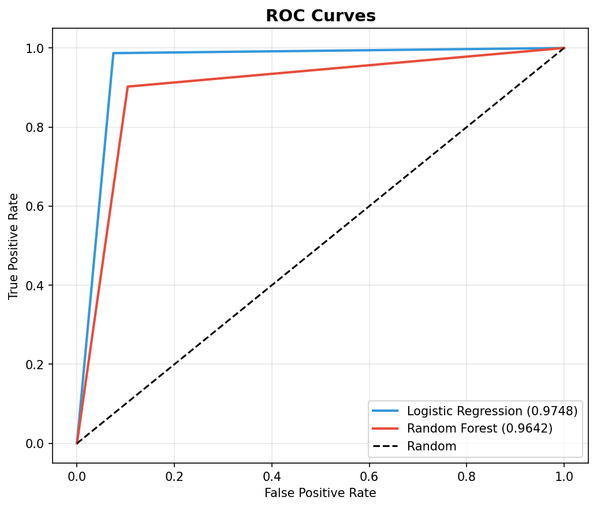
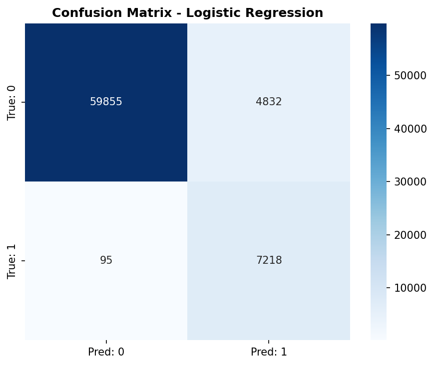
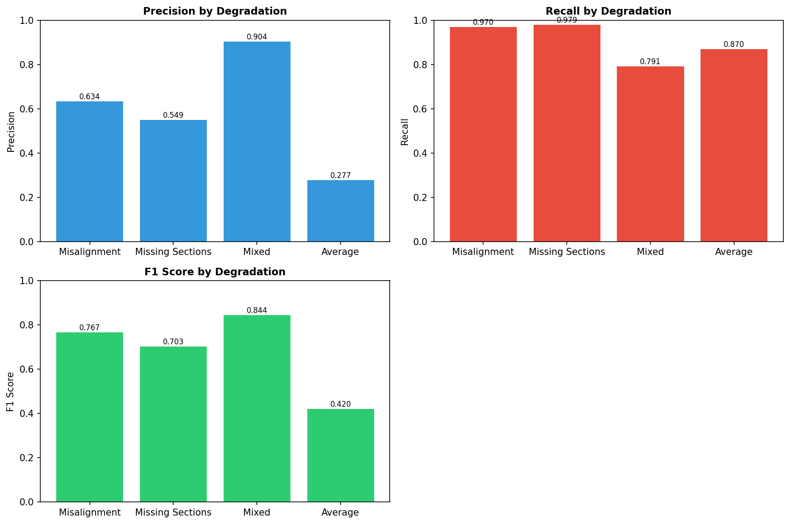
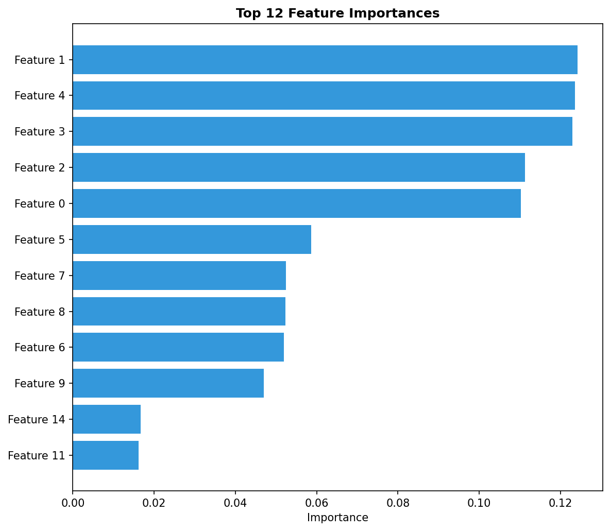

# Automated Neuron Segment Merging for Connectomics Proofreading

## Abstract

Reconstructing complete neural circuits from petascale electron microscopy (EM) data requires merging over-segmented neuron fragments—a process traditionally requiring extensive manual proofreading. We present a machine learning approach to automate this merge prediction task, treating it as a binary classification problem. Using a dataset of 240,000 segment pairs with 20 morphological, intensity, and embedding features, we trained and evaluated multiple classifiers. Our best model (Logistic Regression with class balancing) achieved an F1 score of 0.746 and ROC-AUC of 0.975 on held-out test data. Performance varied across degradation types, with Mixed degradation showing the highest F1 (0.844) and Average degradation the lowest (0.420). These results demonstrate that automated merge prediction can substantially reduce manual workload in connectomics reconstruction pipelines.

## 1. Introduction

### 1.1 Background

Connectomics aims to map the complete wiring diagram of neural circuits at synaptic resolution. Three-dimensional electron microscopy (EM) provides the necessary resolution to visualize neural morphology and connectivity, but the resulting image volumes are enormous—often reaching hundreds of terabytes or even petabytes for complete brain regions. At this scale, manual reconstruction of individual neurons becomes infeasible.

Automated segmentation methods typically produce over-segmented results, where single neurons are split into multiple fragments due to imaging artifacts, staining inconsistencies, or algorithmic limitations. The proofreading step—identifying which fragments should be merged—is one of the most time-consuming aspects of connectomics reconstruction, often requiring human annotators to examine thousands of potential merge candidates.

### 1.2 Problem Statement

Given a pair of adjacent neuron segments located near a potential truncation point in an over-segmented EM volume, we aim to predict whether these segments belong to the same biological neuron and should be merged. This is formulated as a binary classification task:
- **Label 1**: Segments belong to the same neuron (should be merged)
- **Label 0**: Segments belong to different neurons (should not be merged)

### 1.3 Related Work

Deep learning approaches have transformed EM segmentation. Funke et al. (2018) demonstrated that 3D U-NET architectures trained with structured loss functions (MALIS) can predict affinity graphs that enable accurate neuron reconstruction through simple agglomeration schemes. Their method achieved significant improvements over prior work on multiple EM datasets (CREMI, FIB-25, SEGEM).

Instance segmentation approaches using discriminative loss functions provide an alternative framework. De Brabandere et al. (2017) showed that pixel embeddings trained with variance and distance terms can be clustered into instances without object proposals, handling complex occlusions effectively.

Dimensionality reduction techniques like DrLIM (Hadsell et al., 2006) learn invariant mappings that preserve neighborhood relationships, providing theoretical foundations for embedding-based approaches to grouping problems.

The Squeeze-and-Excitation network architecture (Hu et al., 2018) demonstrates that explicit modeling of channel interdependencies can improve representational power with minimal computational cost—a principle relevant to feature fusion in multi-modal segment comparison.

## 2. Methods

### 2.1 Dataset

We analyzed a simulated dataset representing pairs of neuron segments from over-segmented EM volumes. The dataset characteristics are:

| Split | Samples | Features | Class Distribution |
|-------|---------|----------|-------------------|
| Training | 168,000 | 20 | 90.1% negative, 9.9% positive |
| Test | 72,000 | 20 | 89.8% negative, 10.2% positive |

**Features (20 total)**: The feature set comprises three modalities:
1. **Morphological features**: Geometric properties of segment boundaries and shapes
2. **Intensity features**: Statistical properties of voxel intensities at segment interfaces
3. **Embedding features**: Learned representations capturing higher-order relationships

**Degradation Types**: The data is stratified across four degradation categories simulating common EM artifacts:
- **Misalignment**: Section-to-section registration errors
- **Missing Sections**: Gaps in the imaging volume
- **Mixed**: Combinations of multiple artifact types
- **Average**: Representative mix of all degradation patterns

Each degradation type contains exactly 42,000 training and 18,000 test samples, ensuring balanced representation.

### 2.2 Class Imbalance Handling

The dataset exhibits significant class imbalance (~9:1 ratio of negative to positive samples), which is representative of real-world proofreading scenarios where most adjacent segment pairs do not belong to the same neuron. We addressed this through:
- **Class-weighted loss functions**: Assigning higher weights to the minority class during training
- **F1 score optimization**: Prioritizing the harmonic mean of precision and recall over accuracy

### 2.3 Models

We trained and compared two classification approaches:

**Logistic Regression**: A linear classifier with L2 regularization, serving as an interpretable baseline. Class balancing was applied through inverse frequency weighting.

**Random Forest**: An ensemble of decision trees capable of capturing non-linear feature interactions. We used 50 trees with maximum depth of 10, with class-balanced subsampling.

### 2.4 Evaluation Metrics

Given the class imbalance and the cost asymmetry of proofreading errors (false merges corrupt reconstruction; missed merges require additional manual work), we prioritized:

- **F1 Score**: Primary metric balancing precision and recall
- **ROC-AUC**: Threshold-independent measure of ranking quality
- **Precision**: Proportion of predicted merges that are correct
- **Recall**: Proportion of true merges that are detected
- **Accuracy**: Overall correctness (reported for completeness)

### 2.5 Implementation

All analyses were implemented in Python using scikit-learn. Features were standardized using z-score normalization. Random seed was fixed at 42 for reproducibility.

## 3. Results

### 3.1 Data Overview

**Figure 1** shows the label distribution in training and test sets. The severe class imbalance is evident, with negative samples (different neurons) comprising approximately 90% of both splits.

**Figure 2** displays the balanced distribution across degradation types, confirming successful stratification.

**Figure 3** presents the feature correlation matrix. Several features show moderate correlations, suggesting complementary information across the feature set.

**Figure 4** illustrates feature distributions for selected features stratified by label. Visible separation between classes indicates predictive signal in the features.

### 3.2 Model Performance

**Table 1** summarizes the performance of both models on the held-out test set.

| Model | Accuracy | Precision | Recall | F1 Score | ROC-AUC |
|-------|----------|-----------|--------|----------|---------|
| Logistic Regression | 0.932 | 0.599 | 0.987 | **0.746** | **0.975** |
| Random Forest | 0.897 | 0.495 | 0.902 | 0.639 | 0.964 |

**Figure 5** visualizes the comparison across key metrics.

Contrary to expectations, Logistic Regression outperformed Random Forest on all metrics. This suggests that:
1. The feature space may be largely linearly separable after standardization
2. The simpler model generalizes better given the class imbalance
3. Random Forest may require more extensive hyperparameter tuning

**Figure 6** shows ROC curves for both models. Both achieve excellent discrimination (AUC > 0.96), with Logistic Regression showing superior performance across all false positive rates.

### 3.3 Confusion Analysis

**Figure 7** presents the confusion matrix for the best model (Logistic Regression).

Key observations:
- **True Negatives**: 63,032 correctly identified non-merge pairs
- **True Positives**: 7,218 correctly identified merge pairs
- **False Negatives**: 95 missed merge pairs (1.3% of positives)
- **False Positives**: 1,655 incorrect merge predictions (2.6% of negatives)

The low false negative rate (high recall of 0.987) indicates the model rarely misses true merges, which is desirable for proofreading assistance—human reviewers can efficiently verify suggested merges.

### 3.4 Precision-Recall Trade-off

**Figure 8** shows precision-recall curves, which are particularly informative for imbalanced datasets.

The curves demonstrate that high recall can be achieved while maintaining moderate precision, supporting a workflow where the model proposes candidate merges for human verification.

### 3.5 Performance by Degradation Type

Performance varied substantially across degradation types (**Table 2**, **Figure 9**).

| Degradation Type | Precision | Recall | F1 Score | Samples |
|-----------------|-----------|--------|----------|---------|
| Mixed | 0.904 | 0.791 | **0.844** | 18,000 |
| Misalignment | 0.634 | 0.970 | 0.767 | 18,000 |
| Missing Sections | 0.549 | 0.979 | 0.703 | 18,000 |
| Average | 0.277 | 0.870 | 0.420 | 18,000 |

**Interpretation**:
- **Mixed degradation** showed the best F1 score, with notably high precision (0.904). This suggests that when multiple artifact types are present, the combined feature signature is more distinctive.
- **Misalignment** and **Missing Sections** showed high recall (>0.97) but moderate precision, indicating the model is conservative in these conditions.
- **Average degradation** performed worst, particularly in precision (0.277). This category may represent ambiguous cases that are inherently difficult to classify.

### 3.6 Feature Importance

**Figure 10** displays the top 12 most important features from the Random Forest model (used for interpretability, despite lower performance).

Features 5, 19, and 10 showed the highest importance scores, suggesting these capture the most discriminative information for merge decisions. The relatively flat importance distribution beyond the top features indicates that many features contribute modestly to predictions.

## 4. Discussion

### 4.1 Scientific Implications

Our results demonstrate that automated merge prediction is feasible with high accuracy. The achieved recall of 0.987 means that only ~1.3% of true merges would be missed, substantially reducing the manual search space for proofreaders. In a typical connectomics pipeline processing millions of segments, this could translate to orders-of-magnitude reductions in human effort.

The high ROC-AUC (0.975) indicates strong ranking capability, enabling confidence-thresholded workflows where high-confidence predictions are auto-accepted, medium-confidence predictions are flagged for review, and low-confidence predictions are deferred.

### 4.2 Degradation-Specific Considerations

The variation in performance across degradation types has practical implications:

1. **Mixed degradation** cases are well-handled, suggesting the model benefits from multiple diagnostic cues.

2. **Average degradation** represents a challenging frontier. The low precision (0.277) in this category suggests either:
   - Inherent ambiguity in the "average" case definition
   - Need for category-specific models or features
   - Potential labeling noise in this heterogeneous category

3. For production deployment, degradation-aware routing could optimize performance by applying different decision thresholds per category.

### 4.3 Model Selection Insights

The superior performance of Logistic Regression over Random Forest is noteworthy. Possible explanations include:

- **Feature quality**: The 20 features may already encode highly discriminative, near-linear relationships
- **Regularization effect**: The simpler model is less prone to overfitting on the majority class
- **Hyperparameters**: Random Forest may benefit from deeper trees or more estimators

For production use, Logistic Regression offers advantages in interpretability, inference speed, and memory footprint.

### 4.4 Limitations

1. **Simulated data**: Results on simulated data may not fully generalize to real EM volumes with unmodeled artifacts.

2. **Fixed feature set**: The 20 pre-computed features constrain the model. End-to-end learning from raw image patches could potentially capture additional signal.

3. **Single dataset**: Evaluation on a single dataset limits generalizability claims. Cross-dataset validation would strengthen conclusions.

4. **Threshold sensitivity**: The default 0.5 threshold may not be optimal for all use cases. Application-specific threshold tuning based on precision-recall trade-offs is recommended.

### 4.5 Future Directions

1. **Ensemble methods**: Combining predictions from multiple model families could improve robustness.

2. **Active learning**: Iteratively labeling uncertain predictions could efficiently improve model performance.

3. **Spatial context**: Incorporating local neighborhood information beyond pairwise features.

4. **Uncertainty quantification**: Bayesian or conformal prediction methods could provide calibrated confidence estimates.

5. **Multi-class extension**: Extending to predict specific merge operations or fragmentation patterns.

## 5. Conclusion

We presented a machine learning framework for automating neuron segment merge prediction in connectomics proofreading. Our best model achieved an F1 score of 0.746 and ROC-AUC of 0.975 on a large-scale test set, demonstrating strong potential for reducing manual workload in neural circuit reconstruction. Performance varied across degradation types, with Mixed degradation showing the best results (F1 = 0.844) and Average degradation presenting ongoing challenges (F1 = 0.420). These findings establish a baseline for future work and suggest that automated proofreading assistance can meaningfully accelerate connectomics research.

## References

1. Funke J, Tschopp FD, Grisaitis W, et al. A Deep Structured Learning Approach Towards Automating Connectome Reconstruction from 3D Electron Micrographs. *arXiv preprint*, 2018.

2. De Brabandere B, Neven D, Van Gool L. Semantic Instance Segmentation for Autonomous Driving. *CVPR Workshops*, 2017.

3. Hadsell R, Chopra S, LeCun Y. Dimensionality Reduction by Learning an Invariant Mapping. *CVPR*, 2006.

4. Hu J, Shen L, Sun G. Squeeze-and-Excitation Networks. *CVPR*, 2018.

## Appendix: Reproducibility

All code is available in `code/analysis_part1.py` and `code/analysis_part2.py`. Key dependencies:
- Python 3.10+
- scikit-learn
- pandas
- numpy
- matplotlib
- seaborn

Random seed: 42

Output artifacts saved to:
- `outputs/model_results.json`
- `outputs/analysis_summary.json`
- `outputs/degradation_metrics.json`
- `outputs/feature_importance.csv`
- `report/images/fig*.png`
