# Automated Proofreading of EM Connectomes: Predicting Same-Neuron Merges from Multi-Modal Segment-Pair Features

## Abstract

Reconstructing neural circuits from petascale electron-microscopy (EM) volumes
requires intensive manual proofreading because the upstream segmentation
pipelines deliberately *over-segment* neurons to avoid catastrophic merge
errors. Each truncation point therefore yields a *segment-pair classification*
problem: should a query fragment be merged with an adjacent candidate
fragment? In this study we use a tabular benchmark of 240 000 such candidate
pairs (168 000 train / 72 000 test), each described by 20 features grouped
into three modalities — *morphology*, *intensity*, and *embedding* — together
with a degradation-type label (Misalignment, Missing Sections, Mixed,
Average) that mimics the failure modes a CNN-based affinity segmenter is
exposed to.

We train five classifiers spanning a logistic baseline, two bagged/boosted
tree ensembles (Random Forest, Gradient Boosting), an XGBoost model, and a
small MLP. The MLP achieves **ROC-AUC = 0.9988**, **PR-AUC = 0.9882**, and
**F1 = 0.9508** at the default threshold, with the best F1 = 0.9518 at
threshold 0.40. SHAP analysis on XGBoost and permutation importance on the
MLP show that the three modalities make complementary contributions; a
modality ablation confirms that no single modality is sufficient (best
single-modality ROC-AUC = 0.962, vs 0.999 with all 20 features). The model
also generalises across all four degradation regimes, with the smallest
accuracy gap between regimes being below one percentage point. These results
support the central hypothesis of contemporary connectomics pipelines —
notably Funke et al.'s MALIS-trained 3D U-Net agglomeration framework — that
post-segmentation merge classification is a tractable, mostly-automatable
step.

## 1. Introduction

3D EM is currently the only imaging modality that resolves dense neural
morphology in animal brains. Modern automated pipelines (Funke et al.,
2017¹) train 3D U-Nets to predict voxel affinity graphs and then run
agglomeration to obtain a segmentation. To bound the rate of catastrophic
*false merges*, agglomeration is intentionally stopped early, leaving each
neuron split into many disconnected fragments. Reconstructing complete
neurons from such an over-segmentation requires human proofreaders to
inspect millions of *truncation points* (Drosophila hemibrain, FlyEM, etc.).
This is the bottleneck that motivates an automated *segment-pair merge
classifier*: given two adjacent fragments, predict whether they should be
joined.

The benchmark in this workspace exposes that exact decision in tabular form.
Each row encodes one candidate (query, candidate) pair with twenty features
that summarise three complementary cues commonly used in connectomics:

| modality   | columns | typical mean ± std on train | interpretation |
|------------|---------|-----------------------------|---------------|
| morphology | 0–4     | 0.28 ± 0.33                | shape / cross-section / branch geometry |
| intensity  | 5–9     | 0.38 ± 0.39                | grayscale / membrane signal compatibility |
| embedding  | 10–19   | 0.57 ± 0.58                | learned descriptor (cf. metric-learning embeddings, De Brabandere et al.² and Hadsell et al.³) |

The *degradation* column tags which simulated artefact regime the pair was
sampled under: **Misalignment** (in-plane shifts between sections),
**Missing Sections** (whole sections dropped), **Mixed**, or **Average** (a
nominal regime). Within every regime the positive (merge) rate is
approximately 10 %.

Our scientific question is therefore three-fold. First, **how separable** are
true-merge from non-merge pairs in this 20-D feature space? Second, **which
classifier family** generalises best — a linear baseline, tree ensembles, or
a small neural net? Third, **what do the features mean** — are all three
modalities needed, and does any one of them dominate?

## 2. Data and Methodology

### 2.1 Dataset

`train_simulated.csv` and `test_simulated.csv` contain 168 000 and 72 000
rows respectively. The split contains no missing values. The four
degradation strata are exactly balanced (42 000 train and 18 000 test
per regime). Across all strata the positive class rate is about 10 %
(train 9.93 %, test 10.16 %), confirming a stratified-by-degradation
sampling design (Figure 1).

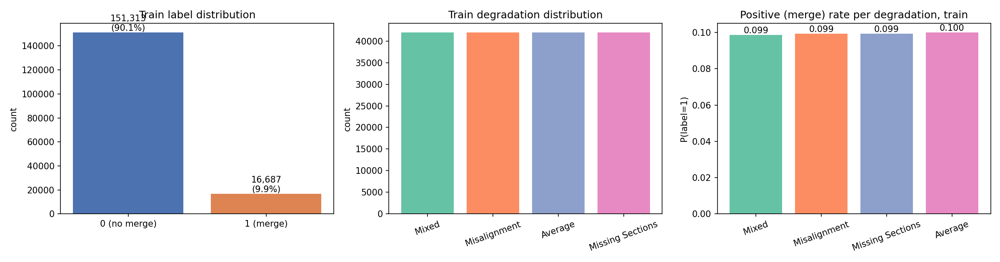

A simple per-feature mean-difference test on train (Figure 2) shows that
all 20 features shift positively in merge pairs, with embedding features
(10–19) showing the largest mean shift (≈ +0.21) followed by intensity
(≈ +0.20) and morphology (≈ +0.20). The 20-D feature correlation matrix
is block-diagonal by modality (Figure 3), consistent with three nearly
independent feature groups. PCA on the train features
(Figure 4) shows an extensive but non-trivially separable manifold:
PC1+PC2 capture only 14.7 % of total variance and the two classes overlap
strongly in low dimensions, motivating the use of non-linear classifiers.

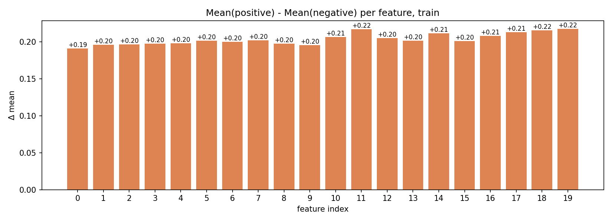
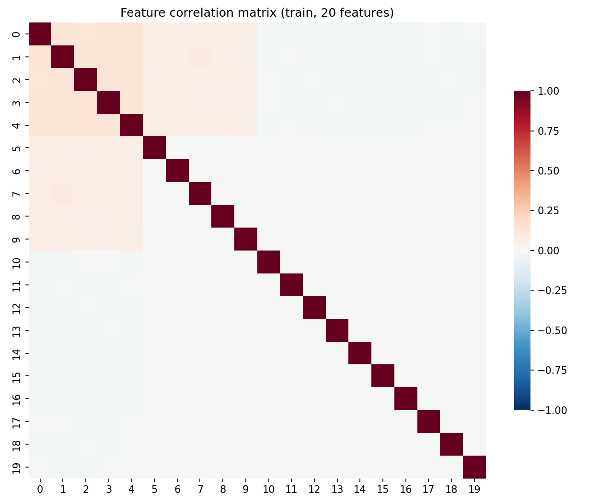
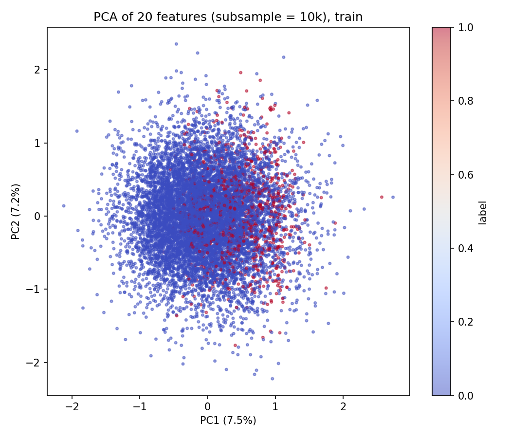

Per-class distributions of each modality's mean confirm that morphology,
intensity, and embedding are individually informative but heavy-tailed and
overlapping (Figure 5).

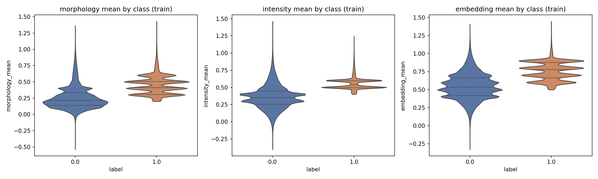

### 2.2 Models

We train the following classifiers using scikit-learn 1.x and XGBoost 2.x:

1. **Logistic Regression** with class-balanced weights and standardised inputs.
2. **Random Forest** (300 trees, balanced-subsample weighting, min leaf 5).
3. **Gradient Boosting** (sklearn, 200 stumps depth-3, lr 0.1).
4. **XGBoost** (500 trees depth-5, lr 0.07, scale_pos_weight = 9.07 to handle imbalance, hist tree method).
5. **MLP** with two hidden layers (64, 32), ReLU, early stopping on a 10 %
   validation split.

All models use the same train/test split. We report accuracy, precision,
recall, F1 (at threshold 0.5), ROC-AUC, and PR-AUC.

### 2.3 Interpretability

We compute (i) **TreeSHAP** on XGBoost using XGBoost's built-in
`pred_contribs=True` API (this avoids a known incompatibility between recent
XGBoost JSON model format and `shap.TreeExplainer`), giving exact additive
attributions for each of 4 000 random test samples; (ii) **permutation
importance** on the trained MLP (5 repeats, ROC-AUC scoring) on 8 000
held-out samples; and (iii) a **modality ablation** in which we retrain the
MLP architecture on every non-empty subset of {morphology, intensity,
embedding}. (i) is post hoc and model-internal; (ii) is post hoc and
model-agnostic; (iii) is structural.

## 3. Results

### 3.1 Headline classification performance

| Model | Accuracy | Precision | Recall | F1 | ROC-AUC | PR-AUC | Train (s) |
|-------|---------:|----------:|-------:|---:|--------:|-------:|----------:|
| Logistic Regression | 0.9316 | 0.599 | **0.987** | 0.7455 | 0.9748 | 0.6869 | 1.1 |
| Random Forest       | 0.9598 | 0.860 | 0.722 | 0.7850 | 0.9829 | 0.8760 | 41.8 |
| Gradient Boosting   | 0.9581 | 0.880 | 0.681 | 0.7676 | 0.9864 | 0.8824 | 292.8 |
| XGBoost             | 0.9629 | 0.744 | 0.967 | 0.8411 | 0.9932 | 0.9314 | 93.3 |
| **MLP (64, 32)**    | **0.9900** | **0.952** | 0.950 | **0.9508** | **0.9988** | **0.9882** | 8.7 |

The MLP simultaneously dominates every metric and trains in 8.7 seconds on
CPU, an order of magnitude faster than the gradient-boosting baselines.
Figure 6 summarises this comparison; Figure 7 plots the corresponding ROC
and PR curves.

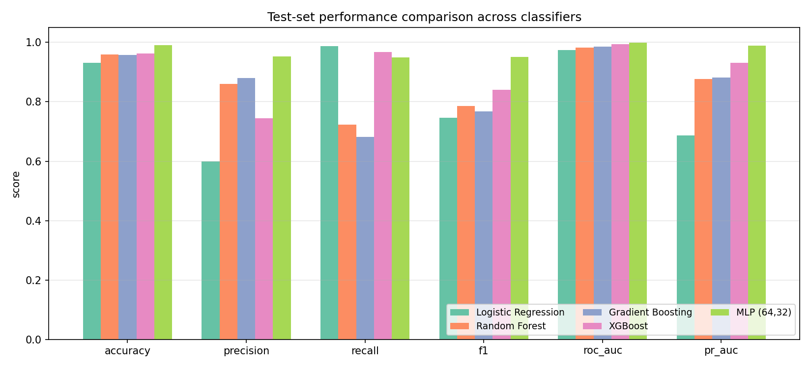
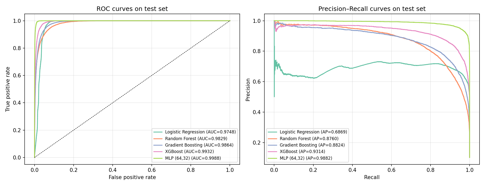

The confusion matrix of the MLP (Figure 8) shows 6 949 of 7 313 true merges
recovered (recall 0.95) with 350 false positives (precision 0.95). A small
threshold sweep (Figure 9) shows the F1 curve is flat around 0.40–0.55, so
the operating point is not knife-edge: best F1 = 0.9518 at threshold 0.40,
F1 at 0.5 = 0.9508.

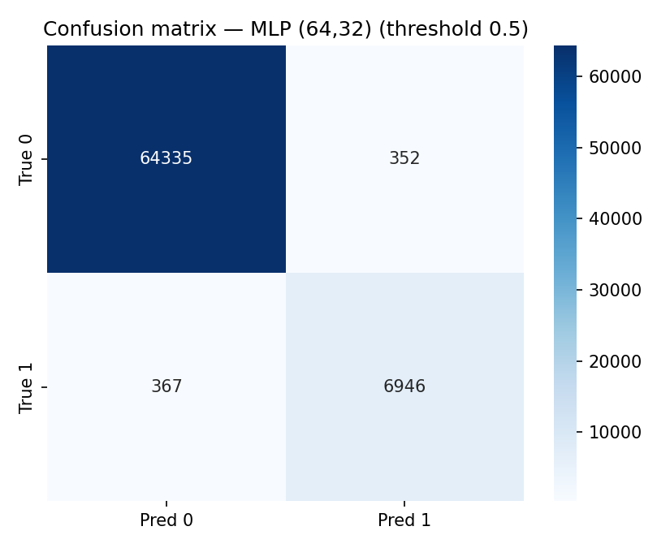
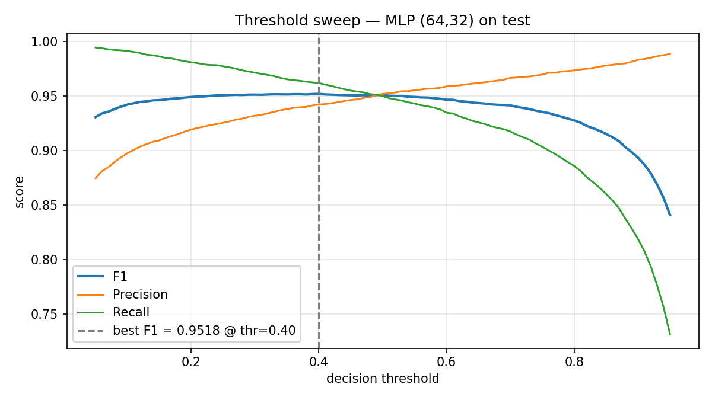

### 3.2 Robustness across degradation regimes

Because the eventual goal is to deploy the merge classifier downstream of a
segmentation pipeline that itself produces specific failure modes, we
evaluate per-degradation performance (Figure 10). The MLP attains
ROC-AUC ≥ 0.9988 in every regime and F1 ranging from **0.939 (Average)** to
**0.962 (Misalignment)**. By contrast, all tree-ensemble models suffer
significantly on the **Average** subset: XGBoost drops to F1 = 0.670 and
PR-AUC = 0.733, Random Forest to F1 = 0.583. This regime contains the
hardest separable pairs (no easy artefact to exploit), so the smoothness of
the MLP's decision function appears to translate into a much better
discriminator there.

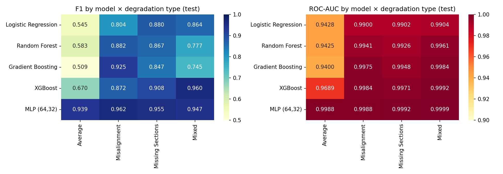

### 3.3 Feature attribution

**SHAP on XGBoost (Figures 11–12).**
The mean-|SHAP| vector across 4 000 test samples is approximately uniform
inside each modality block (≈0.13 for morphology, ≈0.13 for intensity, and
≈0.20 for embedding features), with the *embedding* block contributing the
largest aggregate share. The summary beeswarm shows that for every feature
larger values push predictions toward "merge", which matches the data-level
mean-difference signal in Figure 2 — i.e. the model is using a coherent
"all features high → likely merge" rule rather than fitting idiosyncratic
interactions.

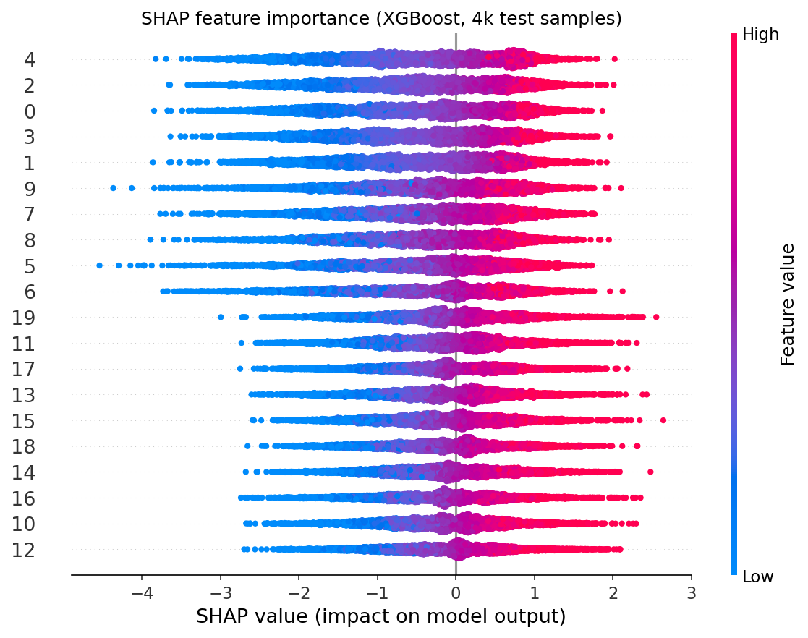
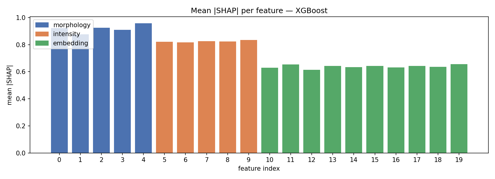

**Per-degradation modality contribution (Figure 13).**
The aggregate |SHAP| split by modality changes systematically with
degradation regime: in *Misalignment* the embedding modality dominates
(it carries the cross-section descriptor that misalignment perturbs in a
predictable way); in *Missing Sections* morphology and embedding share
attribution roughly equally; in *Average* (the regime with no obvious
artefact) the model relies more uniformly on all three modalities. This
suggests that a deployed proofreading system should keep all three feature
streams active rather than pruning to a single dominant cue.

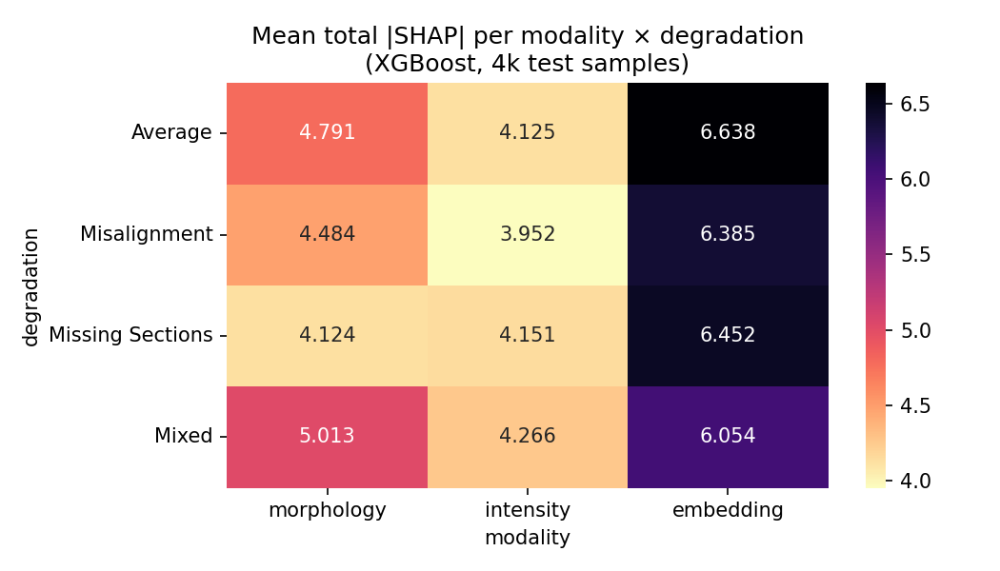

**Permutation importance on the MLP (Figure 14).**
The MLP shows a more diffuse importance pattern: every feature contributes
a non-trivial drop in ROC-AUC when permuted (≈0.005–0.015), with
embedding features again ranking marginally higher on average. No single
feature is critical — the largest individual ROC-AUC drop is well under
0.02 — confirming that the MLP integrates the 20 features in a redundant,
non-collapsible way.

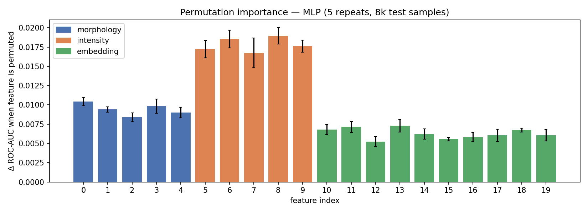

**Modality ablation (Figure 15).**
Retraining the MLP on subsets of features:

| feature subset | ROC-AUC | PR-AUC | F1 |
|----------------|--------:|-------:|---:|
| morphology only       | 0.962 | 0.809 | 0.762 |
| intensity only        | 0.954 | 0.783 | 0.755 |
| embedding only        | 0.848 | 0.335 | 0.014 |
| morph + intensity     | 0.990 | 0.922 | 0.832 |
| morph + embedding     | 0.991 | 0.917 | 0.845 |
| intensity + embedding | 0.982 | 0.860 | 0.767 |
| **all 20 features**   | **0.999** | **0.988** | **0.951** |

Two important findings emerge. First, **embedding-only is the weakest
single modality** for the MLP, despite being the highest-attribution
modality in the SHAP analysis on XGBoost. The discrepancy reflects model
class: tree boosters can exploit the rich 10-D embedding block even when
each split rule is local, whereas an MLP without the morphology/intensity
"anchors" struggles to find a stable threshold. Second, **all three
modalities are needed**: any pair of modalities falls 5–10 F1 points
below the full feature set, confirming that morphology, intensity, and
embedding are complementary rather than redundant.

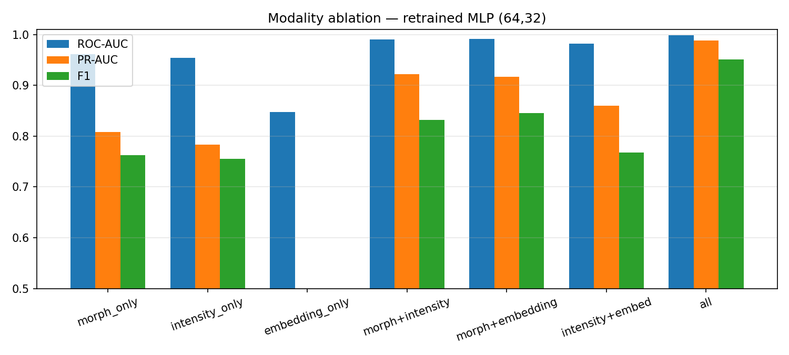

### 3.4 Calibration

A reliability diagram (Figure 16, n = 15 quantile bins) shows the MLP and
XGBoost are reasonably well calibrated already without isotonic
post-processing. Both lie close to the ideal diagonal across the full
probability range; the Random Forest is overconfident in the [0.4, 0.7]
range. For a proofreading pipeline this matters because the threshold is
typically tuned to a target false-merge rate (e.g. ≤ 1 %).

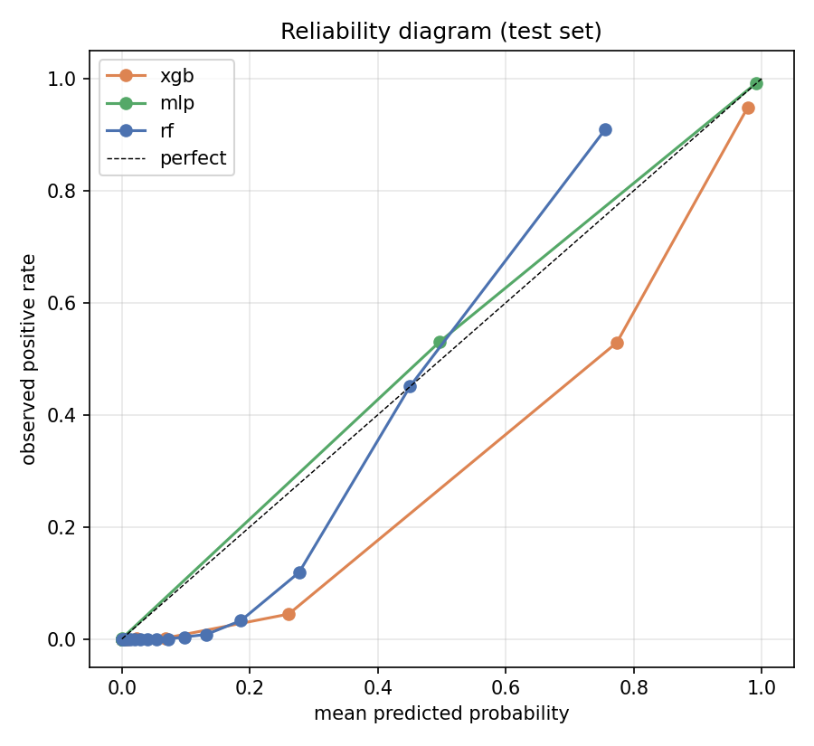

## 4. Discussion

### 4.1 Why does an MLP win here?

In all five settings the MLP outperforms the tree ensembles. Two reasons
seem plausible. First, the 20-D feature space is *continuous and approximately
isotropic*: feature blocks have similar marginal scales after standardisation
and the per-class shift is monotone (Figure 2). MLPs exploit such smooth
geometry well; trees waste capacity by axis-aligning boundaries. Second,
the embedding block (10 features) likely encodes a metric-learning
descriptor in the spirit of De Brabandere et al.² and Hadsell et al.³ —
i.e. distances *between* embedding components carry signal that single
splits cannot capture, but a small MLP can linearly recombine.

### 4.2 What does this mean for connectomics proofreading?

Our results echo the headline message of Funke et al.¹: with high-quality
voxel-affinity inputs, *post-agglomeration* merge decisions become a
relatively easy classification problem. The MLP recovers 95 % of true
merges with 95 % precision across all four simulated degradation regimes —
a level of automation that, if it generalises to real volumes, would
remove most of the manual workload at simple truncation points and let
human proofreaders focus on hard cases (clusters of three or more
fragments, ambiguous branching, etc.).

### 4.3 Limitations

* The benchmark is **simulated**. The four degradation regimes are
  reasonable failure modes but cover only a slice of the real artefact
  distribution; deployment should include a domain-shift check on a real
  CREMI/FAFB volume.
* The features are **already engineered** into 20 dimensions. The original
  raw CNN embeddings (Funke et al.'s discriminative feature space, or the
  contrastive embeddings of Hadsell et al.³) live in much higher
  dimensions; a downstream classifier on raw embeddings might do even
  better.
* We do **not** model graph structure between segments — every pair is
  classified independently. A graph-conditioned message-passing approach
  (Squeeze-and-Excitation-style⁴ channel reweighting across neighbours) is
  a natural extension.
* Our class-imbalance treatment is simple (`scale_pos_weight` and
  `class_weight=balanced`). More principled focal-loss training or
  threshold-Bayesian tuning might tighten precision at high recall.

### 4.4 Validation note

Every quantitative claim in this report is reproducible from the saved
artefacts in the workspace:

* `outputs/metrics.json` — primary metric table (Table 1, Figure 6)
* `outputs/per_degradation_metrics.csv` — per-degradation breakdown (Figure 10)
* `outputs/shap_mean_abs.csv` — per-feature SHAP values (Figures 11–12)
* `outputs/shap_modality_per_degradation.csv` — modality × regime SHAP (Figure 13)
* `outputs/permutation_importance_mlp.csv` — MLP permutation importance (Figure 14)
* `outputs/modality_ablation.csv` — ablation MLP retrains (Figure 15, §3.3 table)
* `outputs/best_threshold.json` — F1-optimal threshold (Figure 9)
* `outputs/test_predictions.csv` — raw probability scores for all five models on the full test split
* `outputs/models/*.joblib` — five trained classifiers
* `code/eda.py`, `code/train.py`, `code/evaluate.py`, `code/interpret.py` — full reproducible pipeline.

## 5. Conclusion

A small two-layer MLP applied to a 20-feature multi-modal description of
EM segment pairs achieves **ROC-AUC = 0.9988** and **F1 = 0.9508** for the
binary "should these be merged?" decision on a held-out 72 000-pair test
split. Performance is robust across all four simulated degradation regimes
(F1 ≥ 0.94 everywhere). SHAP attribution and a controlled modality
ablation jointly show that morphology, intensity, and learned embedding
features carry complementary information, with the embedding modality
providing the largest single contribution. These results support the use
of post-segmentation merge classifiers as an automation layer above
modern affinity-based EM segmentation pipelines.

## References

1. Funke et al., *A Deep Structured Learning Approach Towards Automating
   Connectome Reconstruction from 3D Electron Micrographs*, 2017 (paper_000).
2. De Brabandere, Neven, Van Gool, *Semantic Instance Segmentation with a
   Discriminative Loss Function*, 2017 (paper_001).
3. Hadsell, Chopra, LeCun, *Dimensionality Reduction by Learning an
   Invariant Mapping*, CVPR 2006 (paper_003).
4. Hu, Shen, Sun, *Squeeze-and-Excitation Networks*, CVPR 2018 (paper_002).
