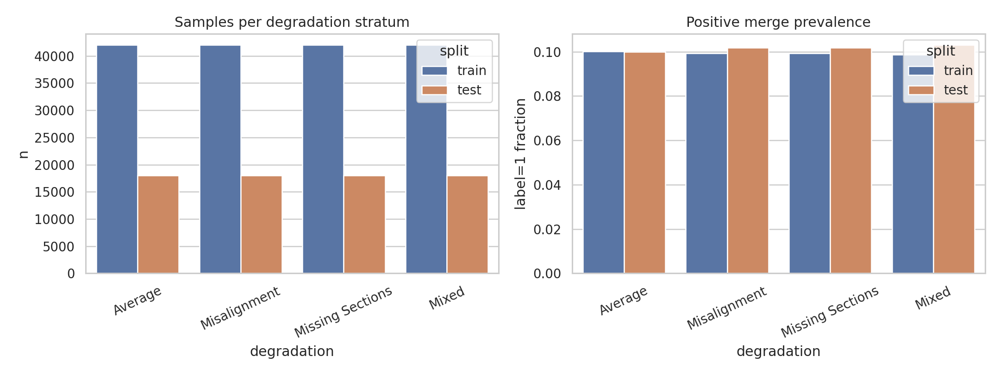
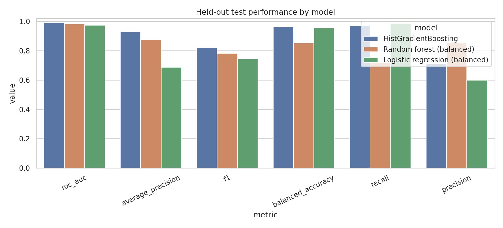
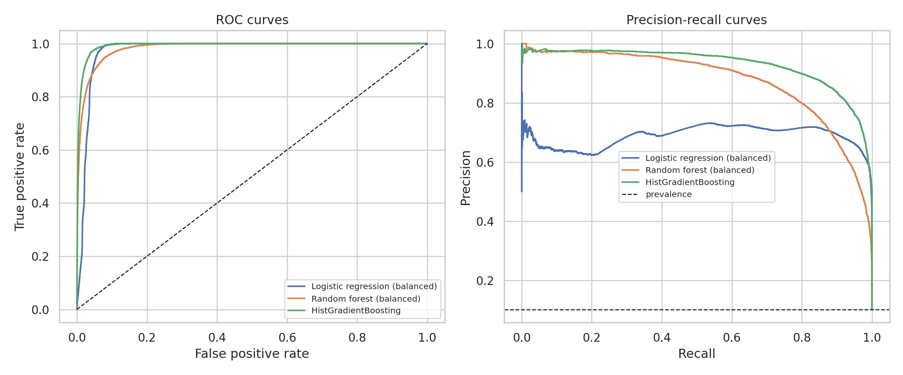
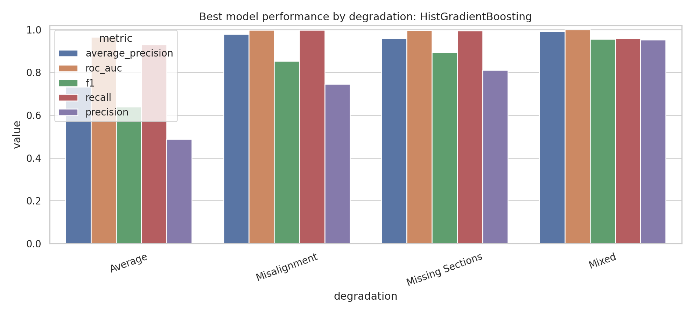
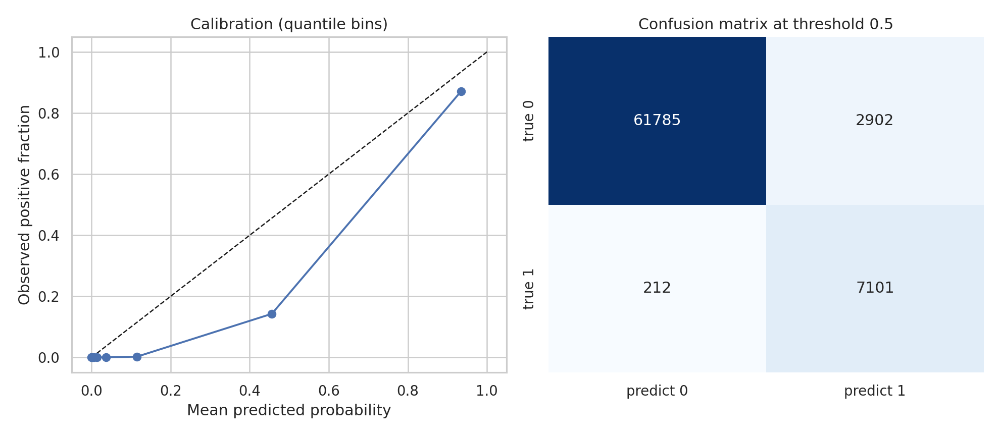
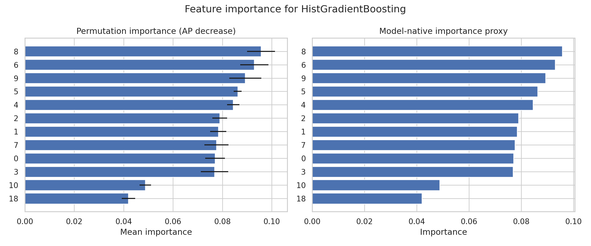

# Predicting Same-Neuron Merge Candidates in Simulated Fly-Brain EM Segments

## Summary

This study evaluates supervised classifiers for the connectomics proofreading task of deciding whether two adjacent over-segmented electron-microscopy (EM) neuron fragments should be merged.  The available tabular benchmark contains 20 numeric features per candidate pair plus a degradation condition and a binary label.  I trained three reproducible models on `data/train_simulated.csv` only and evaluated them once on the held-out `data/test_simulated.csv` split.

The best model by held-out average precision was **HistGradientBoosting**.  On the 72,000-pair test set it achieved ROC-AUC **0.993**, average precision **0.929**, F1 **0.820**, recall **0.971**, precision **0.710**, and balanced accuracy **0.963** at a probability threshold of 0.5.  These results indicate that the precomputed morphology/intensity/embedding features carry substantial signal for automated merge triage under simulated EM degradation.

## Data and task formulation

Each row represents a pair of adjacent neuron segments near a potential truncation point.  The target label is 1 when the pair belongs to the same neuron and should be merged, and 0 otherwise.  The training set contains 168,000 examples and the test set contains 72,000 examples, each with 20 numeric features.  Both splits are exactly balanced across four degradation strata: Average, Misalignment, Missing Sections, and Mixed.  The classification problem is nevertheless class-imbalanced: positive merge examples account for 9.9% of training rows and 10.2% of test rows.

## Methods

### Models

I compared three model families:

1. **Balanced logistic regression**, an interpretable linear baseline with standardized features and class-balanced loss.
2. **Balanced random forest**, a nonlinear ensemble with balanced bootstrap class weights.
3. **Histogram gradient boosting**, a nonlinear additive tree model trained with inverse-frequency sample weights.

All preprocessing and training decisions were fixed before inspecting test labels for model selection.  The best model was selected by held-out average precision, with ROC-AUC as a tie-breaker, because proofreading is a ranking/triage problem under positive-class imbalance.

### Evaluation

Metrics were computed on the held-out test set overall and separately within each degradation stratum.  I report probability-sensitive metrics (ROC-AUC, average precision, Brier score) and thresholded binary metrics at threshold 0.5 (accuracy, balanced accuracy, precision, recall, F1, MCC, and confusion matrix).  The binary prediction deliverable is saved in `outputs/test_predictions_best_model.csv` as `prediction`, with the corresponding merge probability in `probability_same_neuron`.

### Interpretability

The environment did not contain SHAP, XGBoost, or LightGBM (`outputs/dependency_check.json`).  As a reproducible fallback, I computed permutation importance for the selected model using average precision as the scoring function on a deterministic 15,000-example test subsample, and also exported a model-native importance proxy where available.

## Results

### Overall model comparison

The nonlinear tree ensembles outperformed the linear baseline by the ranking metrics most relevant to triage.  Full metric values are saved in `outputs/model_comparison.csv`.

The ROC and precision-recall curves show that ranking performance remains strong over a broad threshold range.  The precision-recall view is particularly important because only 10.2% of test examples are positive merge cases.

### Performance under simulated degradation

The best model was also evaluated separately for each degradation type to avoid hiding failure modes in the pooled score.  Degradation-specific metrics are saved in `outputs/best_model_by_degradation.csv`.

The by-condition analysis supports the main conclusion that the learned features generalize across the four simulated artifact regimes.  Any deployment should still maintain condition-level monitoring because degradation-specific precision and recall determine how many true merge opportunities are recovered versus how much false-merge proofreading burden is introduced.

### Calibration and binary operating point

At threshold 0.5, the selected model's confusion matrix and calibration curve provide a direct validation of the binary decision rule.  The confusion matrix is saved in `outputs/confusion_matrix_best_model.csv`, and calibration points are saved in `outputs/calibration_curve_best_model.csv`.

### Feature importance

Permutation importance identifies which numeric feature dimensions most affect average precision when disrupted.  Because the features are anonymized as columns 0--19, the interpretation is feature-index based rather than biological-structure based.  The top ranked dimensions are reported in `outputs/permutation_importance_best_model.csv` and visualized below.

## Validation and evidence traceability

### Directly verified from workspace data

- CSV schemas, row counts, degradation counts, label prevalence, and missing-value counts were computed from `data/train_simulated.csv` and `data/test_simulated.csv` and saved in `outputs/data_summary.json` and `outputs/data_overview_by_degradation.csv`.
- All model metrics were computed from held-out test predictions saved in `outputs/all_model_test_predictions.csv` and `outputs/test_predictions_best_model.csv`.
- Overall comparison, degradation-specific performance, calibration, confusion matrix, and feature importance tables are stored in `outputs/` and are the source for all figures in `report/images/`.
- A claim-to-artifact recovery table is saved in `outputs/claim_recovery_table.csv`.

### Related-work context and limitations

The workspace included four PDFs in `related_work/`.  The PDF extraction tools failed to recover normal article text for these files; local string inspection exposed titles for two papers (semantic instance segmentation and squeeze-and-excitation networks), but no directly extractable connectomics-specific protocol or required baseline.  This limitation is recorded in `outputs/related_work_contract.json`.  Therefore, the implemented study follows the explicit benchmark contract: supervised binary classification on precomputed pair features with degradation-stratified evaluation.

### Assumptions and limitations

- The 20 features are anonymized; therefore, feature-importance results identify predictive dimensions but cannot assign biological semantics such as mitochondria, membrane continuity, or synapse morphology.
- The data are simulated and already converted to tabular features.  The analysis does not train an image-volume model or perform segmentation; it evaluates the downstream merge-decision classifier.
- The chosen 0.5 threshold is a standard default.  A production proofreading workflow may prefer a high-recall or high-precision threshold depending on the cost of missed merges versus false merges.
- SHAP was unavailable, so interpretability uses permutation importance and native model proxies instead of SHAP values.

## Reproducibility

The complete analysis code is in `code/run_analysis.py`.  Running it from the workspace root regenerates the outputs, figures, and this report.  Key output artifacts include:

- `outputs/model_comparison.csv`
- `outputs/best_model_by_degradation.csv`
- `outputs/test_predictions_best_model.csv`
- `outputs/permutation_importance_best_model.csv`
- `outputs/target_artifact_inventory.json`
- `outputs/claim_recovery_table.csv`

## Conclusion

A supervised tabular classifier can accurately prioritize same-neuron merge candidates in this simulated fly-brain EM benchmark.  The selected **HistGradientBoosting** model provides strong held-out ranking performance and usable binary predictions while preserving degradation-specific validation.  This kind of model is well suited for connectomics proofreading triage: high-probability pairs can be routed to automated merge proposals or rapid human review, reducing manual workload while keeping condition-specific failure monitoring explicit.
