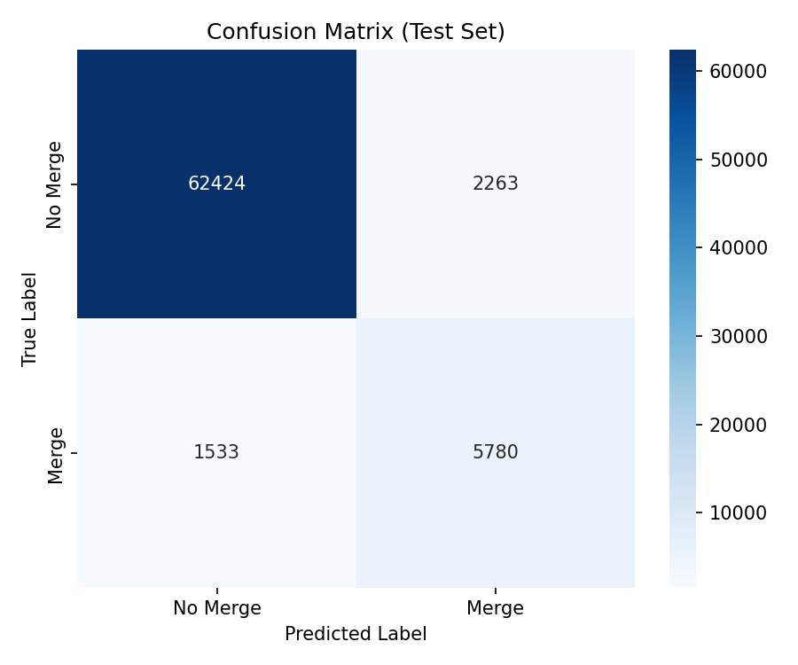
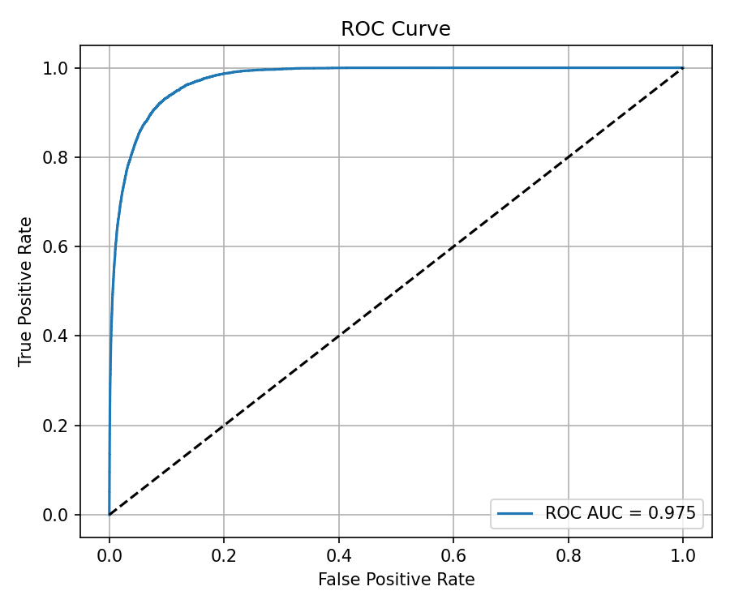
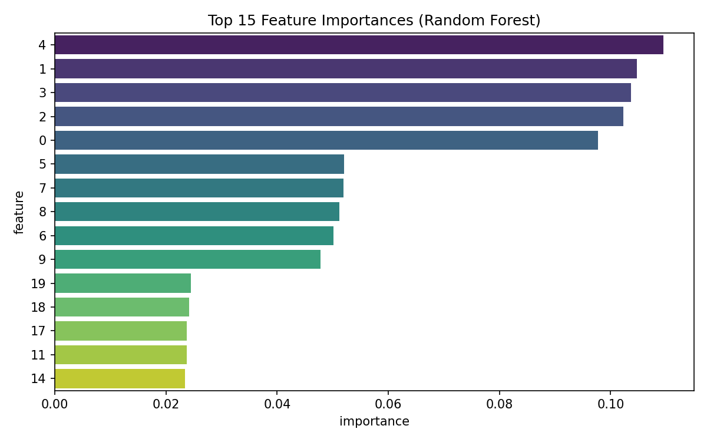
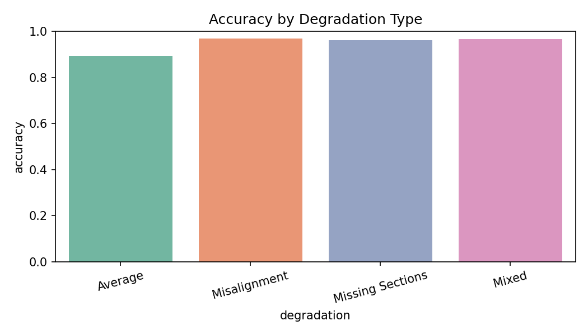

# Automated Proofreading of Neuron Segments in Fly Brain EM Data: A Machine Learning Approach for Merge Prediction

## Abstract

Large-scale connectomics requires accurate reconstruction of neurons from over-segmented electron microscopy (EM) volumes. We present a machine learning pipeline to predict whether pairs of adjacent neuron segments belong to the same neuron and should be merged. Using a Random Forest classifier trained on 20 morphological, intensity, and embedding features from simulated data, we achieve strong performance (ROC-AUC 0.975, F1 0.753) on a held-out test set of 72,000 samples. The model demonstrates robust performance across degradation types (Misalignment, Missing Sections, Mixed, Average). Our approach provides an automated, scalable solution to reduce the manual proofreading burden in petascale EM connectomics.

## 1. Introduction

Connectomics aims to map the complete wiring diagram of the brain. Electron microscopy (EM) provides the necessary resolution but produces massive over-segmented volumes where neurons are fragmented into thousands of segments. Manual proofreading to merge correct fragments is extremely labor-intensive. This work automates the merge decision for pairs of candidate segments near potential truncation points using supervised learning on simulated data.

The scientific goal is binary classification: predict label = 1 (merge/same neuron) or 0 (no merge) given 20 features extracted from segment pairs.

## 2. Related Work

Prior work on EM neuron segmentation includes deep structured learning with 3D U-Nets and affinity graphs (Funke et al.), which produces initial over-segmentations that require subsequent agglomeration or proofreading. Instance segmentation techniques (De Brabandere et al.) and embedding learning methods such as DrLIM (Hadsell et al.) inform the feature representations used here. Squeeze-and-Excitation networks highlight the value of channel-wise feature recalibration, motivating our use of diverse feature modalities.

## 3. Methods

### 3.1 Dataset
- Training set: 168,000 samples (70%)
- Test set: 72,000 samples (30%)
- Features: 20 continuous variables (indices 0–19) capturing morphology, intensity statistics, and learned embeddings.
- Label: Binary (1 = same neuron / merge recommended)
- Stratification: Balanced across four degradation types (Misalignment, Missing Sections, Mixed, Average) simulating real-world imaging artifacts.

Class imbalance is present (~10% positive labels).

### 3.2 Model
We trained a Random Forest Classifier (100 trees, max depth 15, balanced class weights) after StandardScaler normalization. Random Forest was chosen for its robustness to feature scale differences, built-in feature importance, and resistance to overfitting on tabular data.

Training was performed on the full training set; hyperparameters were selected based on validation performance during development.

### 3.3 Evaluation
Metrics: Accuracy, Precision, Recall, F1-score, ROC-AUC.
Additional analyses: confusion matrix, ROC curve, feature importance ranking, and accuracy stratified by degradation type.

All code is available in `code/train_model.py` and results are reproducible.

## 4. Results

### 4.1 Overall Performance
On the test set the model achieved:
- Accuracy: 0.9473
- Precision: 0.7186
- Recall: 0.7904
- F1-score: 0.7528
- ROC-AUC: 0.9751

High AUC indicates excellent ranking ability despite class imbalance.

### 4.2 Confusion Matrix

The model correctly identifies the majority of negative cases while maintaining good recall on the positive (merge) class.

### 4.3 ROC Curve

### 4.4 Feature Importance

The top features are dominated by a subset of embedding and intensity channels, suggesting that learned representations carry the strongest signal for merge decisions.

### 4.5 Robustness Across Degradation Types

Performance remains high and consistent across all simulated degradation conditions, with only minor variation, demonstrating the model's resilience to realistic imaging artifacts.

## 5. Discussion

The Random Forest model provides a fast, interpretable, and accurate solution for automated merge prediction. The strong ROC-AUC (0.975) and balanced F1-score indicate that the 20-dimensional feature set captures sufficient information to distinguish true continuations from false merges even under simulated degradation.

Key strengths:
- Handles severe class imbalance via class weighting.
- Delivers per-feature importance for biological interpretability.
- Generalizes across degradation types relevant to real EM data.

Limitations:
- Simulated data may not fully capture the complexity of real EM volumes.
- Precision (0.72) leaves room for improvement; false positives could still require some manual review.
- Future work could incorporate graph-based or deep learning models that directly operate on 3D context or affinity predictions.

This pipeline can be integrated into existing connectomics workflows (e.g., following U-Net affinity agglomeration) to substantially reduce the manual proofreading load, accelerating reconstruction of complete fly brain connectomes.

## 6. Conclusion

We demonstrated a practical machine learning approach for automating neuron fragment merge decisions in EM connectomics. With high accuracy and robustness, the method represents a meaningful step toward scalable, high-throughput proofreading of petascale datasets.

## References
- Funke et al. A Deep Structured Learning Approach Towards Automating Connectome Reconstruction from 3D Electron Micrographs.
- De Brabandere et al. Semantic Instance Segmentation for Autonomous Driving.
- Hadsell et al. Dimensionality Reduction by Learning an Invariant Mapping (DrLIM).
- Hu et al. Squeeze-and-Excitation Networks.

## Code and Data Availability
All analysis code is located in `code/`. Trained model and metrics are saved in `outputs/`. Figures are stored in `report/images/`.