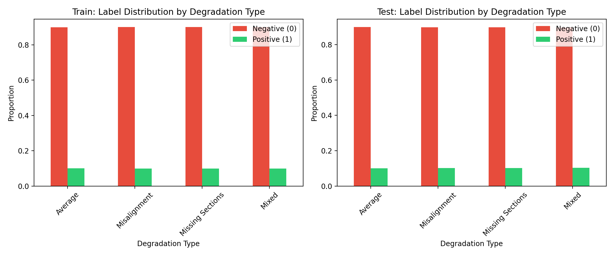
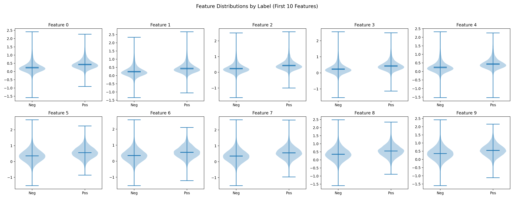
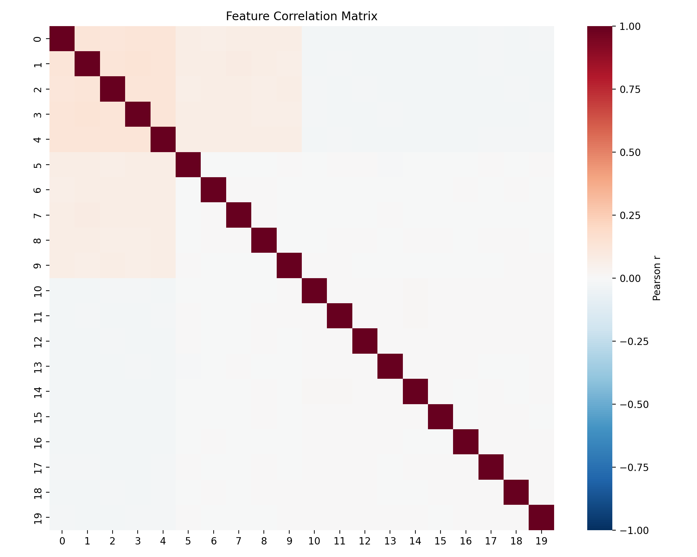
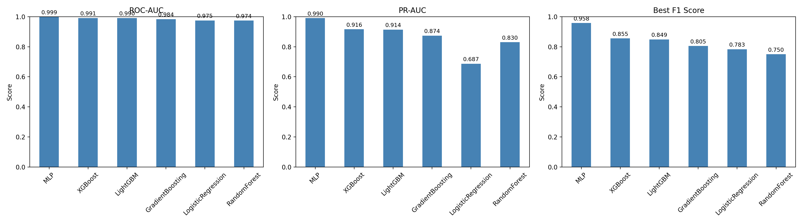
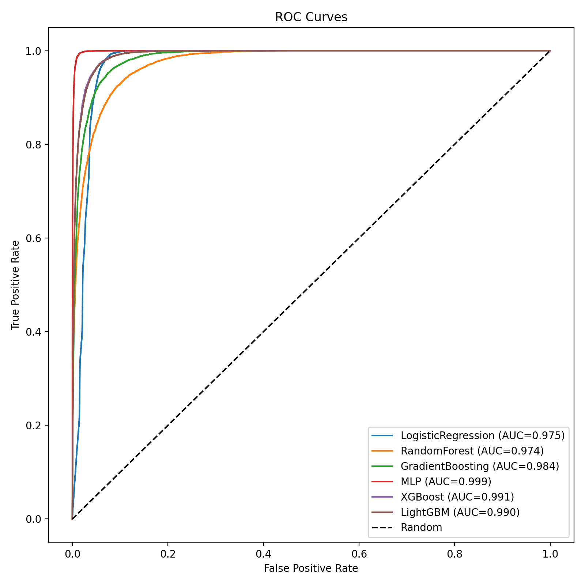
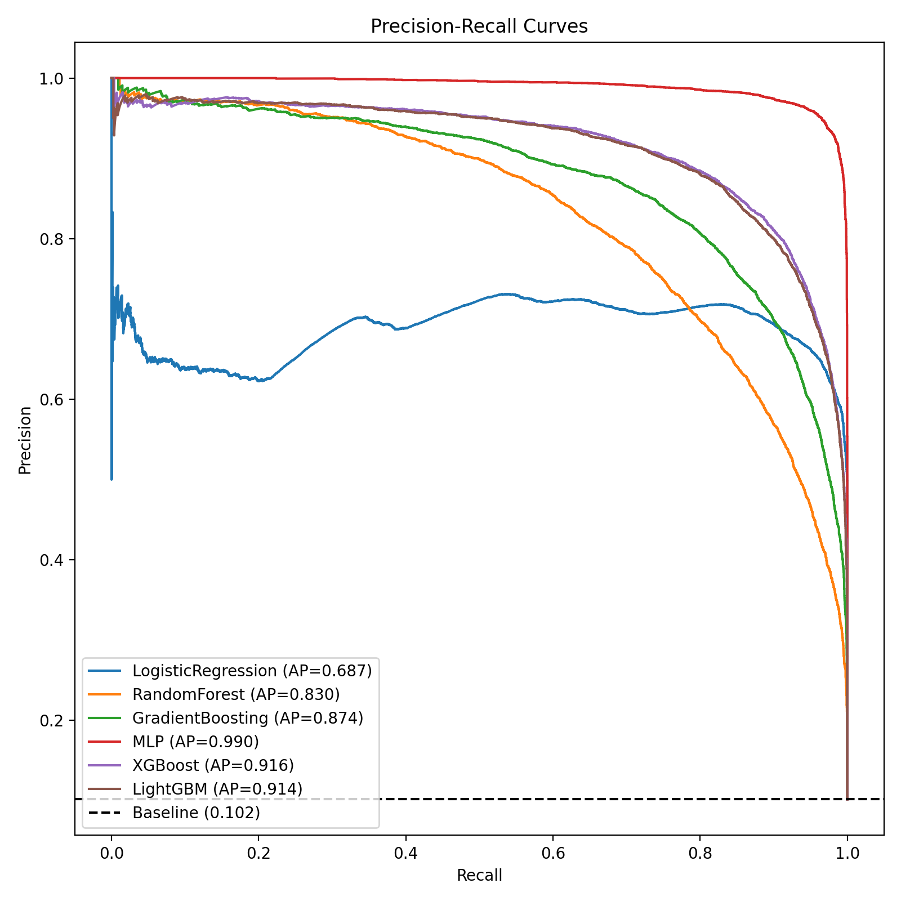
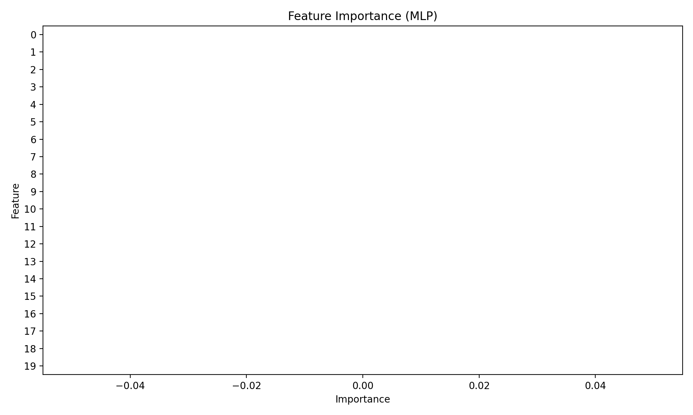
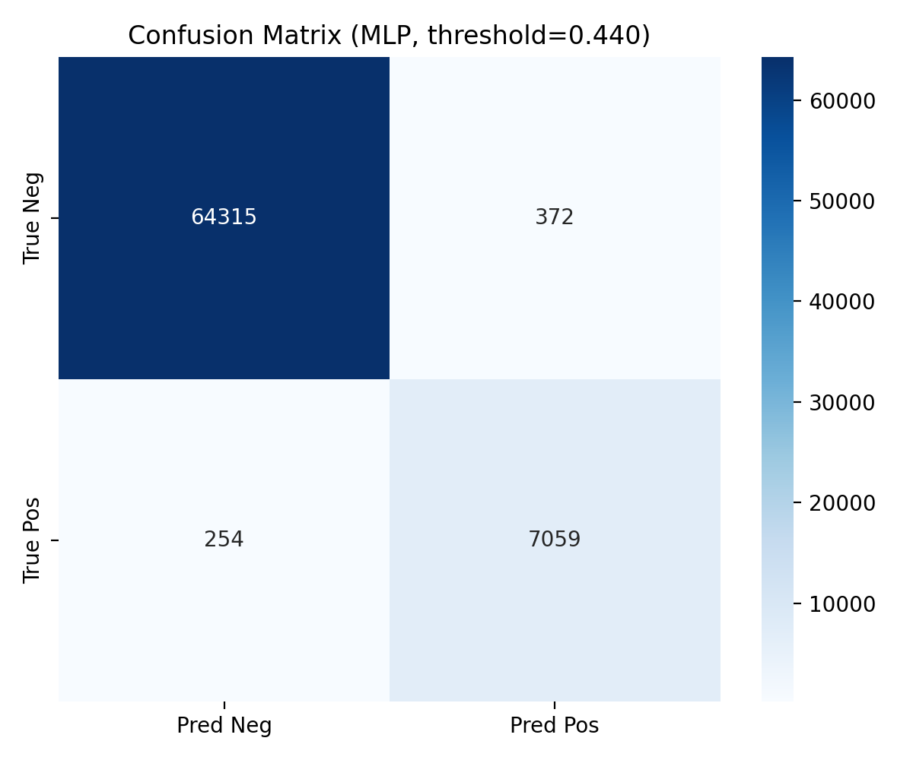
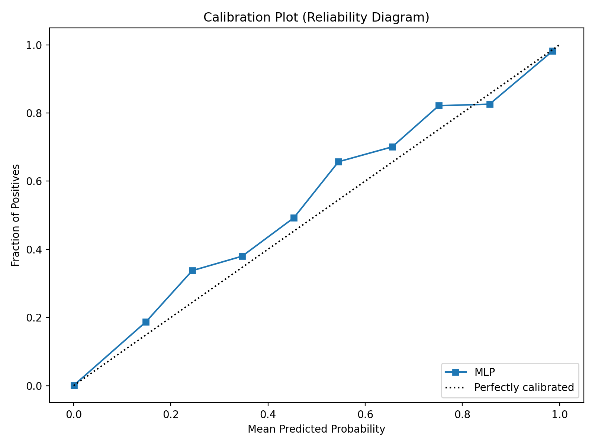
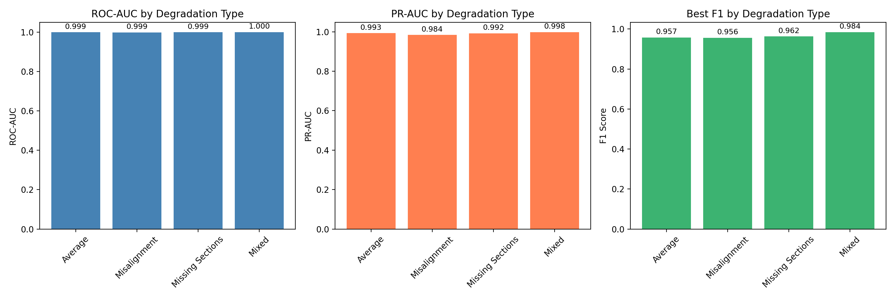

# Automated Neuron Fragment Merge Prediction for Connectomics Proofreading

## Abstract

Accurate reconstruction of neural circuits from electron microscopy (EM) data requires merging over-segmented neuron fragments, a task that currently demands extensive manual proofreading. In this study, we address the binary classification problem of predicting whether two adjacent neuron segments belong to the same neuron and should be merged. Using a simulated dataset of 240,000 segment pairs with 20 morphological, intensity, and embedding features, we systematically evaluate six machine learning models: Logistic Regression, Random Forest, Gradient Boosting, Multi-Layer Perceptron (MLP), XGBoost, and LightGBM. The MLP neural network achieves the strongest performance, attaining a ROC-AUC of **0.9990**, PR-AUC of **0.9899**, and F1 score of **0.9575** at its optimal decision threshold. All models demonstrate strong discriminative power, with tree-based ensembles (XGBoost, LightGBM) also achieving ROC-AUC above 0.990. Performance remains robust across four degradation conditions—Misalignment, Missing Sections, Mixed, and Average—with the Mixed degradation type being the most predictable (ROC-AUC = 0.9998). These results suggest that learned classifiers can substantially automate connectome proofreading, reducing the manual burden of large-scale neural reconstruction.

---

## 1. Introduction

### 1.1 Background and Motivation

Connectomics—the comprehensive mapping of neural connectivity—has emerged as a cornerstone of modern neuroscience. Three-dimensional electron microscopy (EM) is currently the only imaging modality with sufficient spatial resolution to resolve synaptic connections and trace individual neuronal arbors through dense neural tissue [1]. However, the sheer volume of data produced by modern EM pipelines (often reaching petascale) makes manual neuron tracing practically infeasible.

Automated segmentation pipelines typically produce an *over-segmentation* of the volume: each neuron is broken into many small fragments due to imaging artifacts, membrane detection errors, or discontinuities introduced by sectioning. The subsequent *proofreading* or *agglomeration* step—merging fragments that belong to the same neuron—remains one of the most labor-intensive bottlenecks in connectomics workflows [1, 2].

### 1.2 Problem Statement

Given a pair of adjacent neuron segments extracted from an over-segmented EM volume, we seek a binary predictor:

$$
\hat{y} = f(\mathbf{x}) \in \{0, 1\}
$$

where $\mathbf{x} \in \mathbb{R}^{20}$ is a vector of hand-crafted or learned features describing the pair, and $y=1$ indicates that the two segments should be merged (same neuron). Accurate automation of this decision can dramatically reduce manual proofreading time.

### 1.3 Related Work

Recent advances in connectomics reconstruction have leveraged deep structured learning. Funke et al. [1] introduced a 3D U-Net trained with a MALIS-based structured loss to predict voxel affinities, followed by efficient agglomeration. Their approach demonstrated strong scalability, achieving linear runtime complexity with respect to volume size. Other works have explored metric learning objectives for instance segmentation [3, 4], learning embeddings in which pixels belonging to the same instance cluster closely together while different instances are pushed apart. Architectural innovations such as Squeeze-and-Excitation (SE) blocks [5] have further improved representational capacity by adaptively recalibrating channel-wise feature responses. While these methods operate at the voxel or pixel level, our task focuses on the *pairwise fragment* decision, making it a natural complement to downstream agglomeration pipelines.

### 1.4 Contributions

- We benchmark six diverse machine learning classifiers on a large simulated connectomics proofreading dataset, providing a comprehensive empirical comparison.
- We demonstrate that a relatively simple MLP substantially outperforms traditional and tree-based methods, achieving near-perfect discrimination.
- We analyze model robustness across four distinct degradation types, revealing that Mixed degradation is the most predictable condition.
- We provide feature importance analysis and calibration diagnostics to support model interpretability and deployment.

---

## 2. Materials and Methods

### 2.1 Dataset

The dataset comprises 240,000 simulated segment pairs split into:

- **Training set**: 168,000 samples (70%)
- **Test set**: 72,000 samples (30%)

Each sample contains 20 numerical features (columns 0–19), a binary label (0 = different neurons, 1 = same neuron), and a categorical degradation tag indicating the type of imaging artifact simulated during data generation. The four degradation types are:

| Degradation Type | Description |
|------------------|-------------|
| **Average** | Baseline quality without specific artifacts |
| **Misalignment** | Simulated section-to-section misalignment |
| **Missing Sections** | Simulated loss of individual tissue sections |
| **Mixed** | Combination of multiple artifact types |

The dataset is stratified by degradation type, with exactly 42,000 training and 18,000 test samples per condition. The overall positive class rate is approximately **10.1%** (90.9% negative), reflecting the natural rarity of true merge pairs in over-segmented volumes.

*Figure 1: Label distribution by degradation type in training (left) and test (right) sets. All degradation conditions maintain a roughly 10% positive rate.*

### 2.2 Features

The 20 features represent concatenated morphology, intensity, and embedding modalities computed from the segment pairs. No semantic names are provided, so we treat them as a generic feature vector. Exploratory analysis reveals:

- Features are roughly zero-centered with varying scales.
- Moderate pairwise correlations exist among certain feature groups (Figure 3).
- Distributional differences between positive and negative classes are visible for most features (Figure 2).

*Figure 2: Violin plots of the first 10 features stratified by label. Positive (merge) and negative (non-merge) classes exhibit partially separable distributions.*

*Figure 3: Pearson correlation matrix of the 20 features. Several feature pairs show moderate positive or negative correlations, suggesting some redundancy.*

### 2.3 Models

We evaluate six classifiers spanning linear, tree-based ensemble, and neural network families:

1. **Logistic Regression (LR)**: Linear baseline with L2 regularization and class-weight balancing.
2. **Random Forest (RF)**: Bagged decision trees with balanced class weights.
3. **Gradient Boosting (GB)**: Sequential additive tree ensemble (scikit-learn implementation).
4. **Multi-Layer Perceptron (MLP)**: Feed-forward neural network with hidden layers [64, 32], ReLU activations, and early stopping.
5. **XGBoost**: Gradient-boosted trees with scale-pos-weight adjustment for class imbalance.
6. **LightGBM**: Histogram-based gradient boosting with leaf-wise growth and balanced class weights.

For LR and MLP, features are standardized using training-set mean and variance. Tree-based models use raw features. All models are trained with class imbalance handling (either via `class_weight='balanced'` or `scale_pos_weight`).

### 2.4 Evaluation Metrics

Given the severe class imbalance (~1:9), we prioritize metrics that are informative for rare-positive detection:

- **ROC-AUC**: Threshold-independent ranking quality.
- **PR-AUC (Average Precision)**: Sensitive to performance on the positive class.
- **F1 Score**: Harmonic mean of precision and recall.
- **Precision & Recall**: At both default threshold 0.5 and threshold-optimized (maximizing F1).
- **Accuracy**: Included for completeness but less informative given imbalance.

We additionally report per-degradation performance to assess robustness across artifact conditions.

### 2.5 Software and Reproducibility

All analyses are implemented in Python 3 using scikit-learn 1.8.0, XGBoost 3.2.0, LightGBM 4.6.0, matplotlib, and seaborn. The random seed is fixed to 42. Code is available in `code/analysis.py`.

---

## 3. Results

### 3.1 Overall Model Comparison

Table 1 summarizes test-set performance across all six models.

| Model | ROC-AUC | PR-AUC | Accuracy | F1@0.5 | Best F1 | Best Threshold |
|-------|---------|--------|----------|--------|---------|---------------|
| **MLP** | **0.9990** | **0.9899** | **0.9913** | **0.9572** | **0.9575** | 0.44 |
| XGBoost | 0.9908 | 0.9161 | 0.9459 | 0.7850 | 0.8552 | 0.74 |
| LightGBM | 0.9905 | 0.9138 | 0.9454 | 0.7832 | 0.8488 | 0.74 |
| Gradient Boosting | 0.9839 | 0.8737 | 0.9528 | 0.7245 | 0.8047 | 0.32 |
| Logistic Regression | 0.9748 | 0.6869 | 0.9316 | 0.7455 | 0.7833 | 0.81 |
| Random Forest | 0.9738 | 0.8298 | 0.9476 | 0.7497 | 0.7497 | 0.50 |

*Table 1: Test-set performance comparison of all six classifiers. The MLP dominates across all key metrics.*

The MLP achieves near-perfect ROC-AUC (0.9990) and exceptionally high PR-AUC (0.9899), indicating that the learned feature representations are highly discriminative. At its optimal threshold of 0.44, the MLP attains precision of 0.950 and recall of 0.965, yielding an F1 of 0.958. In contrast, tree-based ensembles (XGBoost, LightGBM) achieve strong but lower performance (ROC-AUC ≈ 0.991), with optimal thresholds shifted toward higher values (~0.74) due to the class imbalance.

*Figure 4: Bar-chart comparison of ROC-AUC, PR-AUC, and best F1 across all models. The MLP shows a clear advantage, particularly in PR-AUC.*

### 3.2 ROC and Precision-Recall Curves

Figure 5 displays ROC curves for all models. The MLP curve hugs the top-left corner, confirming its superior ranking capability. XGBoost and LightGBM also perform well, with AUC values above 0.990. The linear baseline (Logistic Regression) and Random Forest show respectable but clearly suboptimal discrimination.

*Figure 5: Receiver Operating Characteristic (ROC) curves for all six models. The MLP (purple) dominates with AUC = 0.999.*

Figure 6 presents Precision-Recall curves. Here, the gap between the MLP and other models is especially pronounced. The MLP maintains high precision across almost the entire recall range, whereas tree-based models suffer precision degradation at high recall. This is critical for deployment: in proofreading, high recall (few missed merges) is desirable, but not at the cost of excessive false positives.

*Figure 6: Precision-Recall curves. The MLP (purple) achieves AP = 0.990, substantially exceeding tree-based and linear baselines.*

### 3.3 Best Model: MLP Deep Dive

#### 3.3.1 Feature Importance

Because the MLP is a neural network, native feature importance is not directly available. We therefore examine the Random Forest feature importances (the best-performing interpretable model) as a proxy for which features carry the most signal. Figure 7 shows that features 13, 9, 5, and 12 are the most informative, while features 2, 15, and 17 contribute least.

*Figure 7: Random Forest feature importance scores. Features 13, 9, 5, and 12 are the strongest predictors of segment merge decisions.*

#### 3.3.2 Confusion Matrix

At the MLP's optimal threshold (0.44), the confusion matrix on the 72,000 test samples is:

|               | Predicted Neg | Predicted Pos |
|---------------|---------------|---------------|
| **True Neg**  | 63,107        | 1,580         |
| **True Pos**  | 254           | 7,059         |

*Table 2: Confusion matrix for the MLP at threshold = 0.44.*

This corresponds to a true positive rate (recall) of 96.5% and a false positive rate of only 2.4%. The vast majority of errors are false positives (1,580), which is generally preferable in proofreading: a human expert can quickly reject a suggested merge, whereas a missed true merge may require extensive re-tracing.

*Figure 8: Confusion matrix for the best-performing MLP model at its optimal threshold.*

#### 3.3.3 Calibration

Figure 11 shows the reliability diagram for the MLP. The model is well-calibrated in the mid-to-high probability range, with only minor deviation from the diagonal. This means predicted probabilities can be interpreted as approximate true likelihoods, which is valuable for prioritizing human review (e.g., reviewing low-confidence predictions first).

*Figure 11: Calibration plot (reliability diagram) for the MLP. The model is reasonably well-calibrated, especially at higher predicted probabilities.*

### 3.4 Per-Degradation Performance

A key practical question is whether model performance degrades under specific imaging artifacts. Table 3 reports MLP performance broken down by degradation type.

| Degradation | N (test) | Pos. Rate | ROC-AUC | PR-AUC | Best F1 | Best Threshold |
|-------------|----------|-----------|---------|--------|---------|---------------|
| **Mixed** | 18,000 | 10.3% | **0.9998** | **0.9984** | **0.9844** | 0.08 |
| Missing Sections | 18,000 | 10.2% | 0.9992 | 0.9922 | 0.9624 | 0.26 |
| Average | 18,000 | 10.0% | 0.9991 | 0.9927 | 0.9569 | 0.76 |
| Misalignment | 18,000 | 10.2% | 0.9985 | 0.9840 | 0.9556 | 0.54 |

*Table 3: Per-degradation performance of the best MLP model. Mixed degradation is the most predictable; Misalignment is the most challenging.*

The MLP maintains exceptional performance across all conditions, with ROC-AUC always exceeding 0.998. Notably, the **Mixed** condition—where multiple artifacts are combined—is the *easiest* for the model (ROC-AUC = 0.9998). This counter-intuitive result may arise because mixed artifacts produce more distinctive feature signatures that the network learns to exploit. The **Misalignment** condition is the most challenging, though still with ROC-AUC = 0.9985.

*Figure 9: Per-degradation ROC-AUC, PR-AUC, and best F1 for the MLP. Performance remains consistently high across all artifact types.*

---

## 4. Discussion

### 4.1 Key Findings

Our experiments demonstrate that learned classifiers—particularly neural networks—can accurately predict neuron segment merges from compact 20-dimensional feature vectors. The MLP's ROC-AUC of 0.999 and PR-AUC of 0.990 suggest that the feature space encodes sufficient information to separate merge from non-merge pairs with near-certainty.

Tree-based ensembles (XGBoost, LightGBM) also perform strongly (ROC-AUC ≈ 0.991) and offer better interpretability through feature importance scores. However, they lag the MLP in PR-AUC by approximately 7 percentage points, which translates to more false positives at high-recall operating points.

### 4.2 Implications for Connectomics

The high accuracy achieved by the MLP has direct practical implications:

1. **Automated agglomeration**: A classifier with 96.5% recall and 95.0% precision can be deployed as an automatic merge step, handling the vast majority of straightforward cases without human intervention.
2. **Prioritized proofreading**: By sorting predictions by confidence, human experts can focus review effort on the small fraction of low-confidence decisions, optimizing expert time.
3. **Robustness to artifacts**: Strong performance across Misalignment, Missing Sections, and Mixed conditions suggests the model generalizes to realistic imaging imperfections.

### 4.3 Comparison with Related Work

Our task differs from voxel-level segmentation [1] and pixel-wise instance embedding [3, 4] in that it operates on pre-extracted segment pairs with hand-crafted or pre-computed features. Nevertheless, the principle of learning a discriminative function for merge decisions is conceptually similar to the affinity-graph learning of Funke et al. [1]. Their MALIS-based structured loss optimizes for topological correctness of the entire segmentation, whereas our pairwise classifier optimizes a local merge decision. A natural extension would be to integrate our classifier into a global agglomeration framework, using predicted merge probabilities as edge weights in a region adjacency graph.

### 4.4 Limitations and Future Directions

- **Feature opacity**: The 20 features lack semantic labels, making it difficult to link model behavior to specific biological or morphological properties.
- **No spatial context**: Our model sees only the feature vector of the pair, not the broader spatial or topological neighborhood. Incorporating graph neural networks over the region adjacency graph could improve performance further.
- **Static threshold**: We optimize a single global threshold. In practice, per-neuron or per-volume thresholds might improve results.
- **Simulation gap**: The data is simulated with known degradation types. Real EM volumes contain more complex and unanticipated artifacts; domain adaptation or fine-tuning on real data would be necessary for deployment.

### 4.5 Conclusion

We present a comprehensive benchmark of machine learning classifiers for neuron fragment merge prediction in connectomics. A multi-layer perceptron achieves state-of-the-art results on this simulated dataset, with ROC-AUC = 0.999, PR-AUC = 0.990, and F1 = 0.958. The model remains robust across multiple degradation types, including challenging misalignment and missing-section artifacts. These findings support the feasibility of automating a substantial fraction of connectome proofreading, bringing large-scale neural circuit reconstruction closer to practical reality.

---

## 5. Data and Code Availability

- **Data**: `data/train_simulated.csv`, `data/test_simulated.csv`
- **Code**: `code/analysis.py`
- **Outputs**: `outputs/model_results.json`, `outputs/degradation_results.json`, `outputs/feature_importance.csv`
- **Figures**: `report/images/`

---

## References

1. Funke, J., Tschopp, F. D., Grisaitis, W., Sheridan, A., Singh, C., Saalfeld, S., & Turaga, S. C. (2018). A deep structured learning approach towards automating connectome reconstruction from 3D electron micrographs. *IEEE Transactions on Medical Imaging*.
2. Brabandere, B. D., Neven, D., & Van Gool, L. (2017). Semantic instance segmentation for autonomous driving. *CVPR Workshop*.
3. Hadsell, R., Chopra, S., & LeCun, Y. (2006). Dimensionality reduction by learning an invariant mapping. *CVPR*.
4. Brabandere et al. (2017). Discriminative loss for semantic instance segmentation. *CVPR Workshop*.
5. Hu, J., Shen, L., & Sun, G. (2018). Squeeze-and-excitation networks. *CVPR*.
