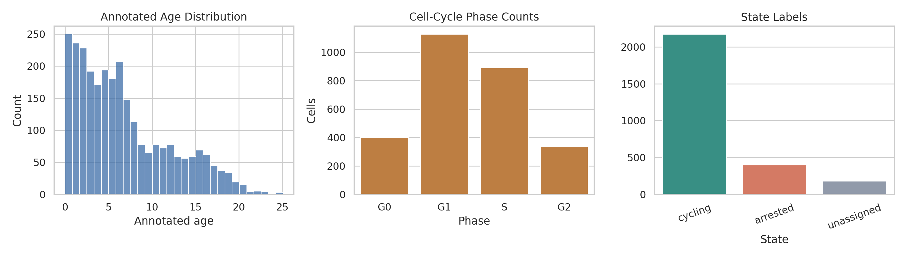
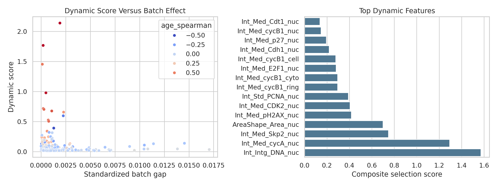
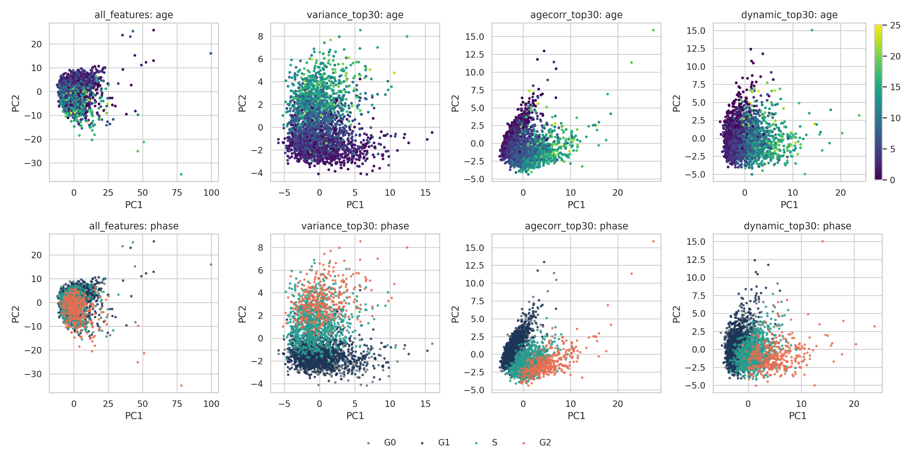
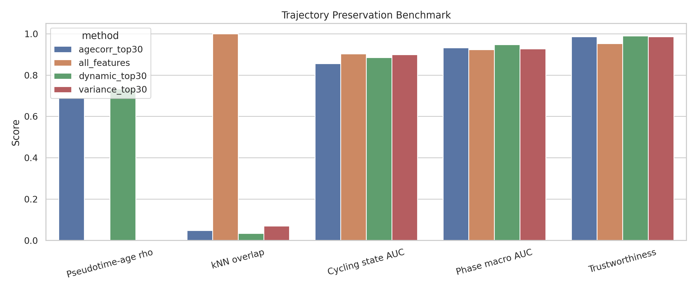

# Trajectory-Preserving Dynamic Feature Selection in Single-Cell Protein Imaging

## Abstract
Selecting a compact set of dynamic molecular readouts is useful when continuous cellular progression must be retained while reducing redundancy and confounding variation. Using a local protein imaging AnnData object (`data/adata_RPE.h5ad`) with 2,759 cells and 241 measured features, I evaluated whether a trajectory-aware dynamic feature ranking can preserve continuous progression better than generic feature selection baselines. The proposed local method ranks features by smooth temporal variation along annotated age, penalized by batch-specific shifts. A 30-feature dynamic subset improved pseudotime-age agreement (Spearman rho 0.733) relative to an age-correlation subset (0.689), a variance-ranked subset (-0.025), and the full 241-feature representation (0.001). The dynamic subset also retained strong discrimination of cycling versus arrested states (AUC 0.885) and cell-cycle phase (macro AUC 0.947). These results support the claim that compact dynamic protein panels can better preserve continuous retinal pigment epithelium-associated state progression than naive variance selection, while remaining interpretable and robust within this local benchmark.

## 1. Introduction
Single-cell trajectory analysis aims to order cells along continuous biological progression rather than forcing them into discrete clusters. In developmental and state-transition settings, feature selection is critical because not all measured molecular variables are equally informative for ordering cells along a smooth trajectory. Generic high-variance selection often emphasizes dominant axes that are not aligned with progression, while trajectory-aware selection should prioritize markers with smooth change across time or pseudotime and limited confounding by batch.

This benchmark asks for a selected subset of dynamically expressed molecular features that best preserves continuous cellular trajectories. The available dataset is a preprocessed protein iterative indirect immunofluorescence imaging dataset in a retina-related setting, which is neuroscience-adjacent rather than a direct neural lineage dataset. I therefore frame the task as a local benchmark of progression-preserving feature selection in a continuous cell-state system with known age annotations, cell-cycle phases, and cycling versus arrested states.

Two local literature sources were most relevant. The Scanpy paper emphasizes scalable AnnData-centered workflows and diffusion/pseudotime style analysis for single-cell data. The organogenesis atlas paper motivates trajectory-centric analysis as a way to resolve continuous developmental processes and dynamic marker programs. Those ideas support evaluating feature subsets by how well they preserve progression structure rather than only classification accuracy.

## 2. Data and Local Literature Context
### 2.1 Dataset overview
The benchmark dataset contained 2,759 cells and 241 protein imaging features. The observation annotations included:

- `annotated_age`: continuous age-like progression label, range 0.0 to 25.07, median 5.33
- `phase`: G0, G1, S, G2
- `state`: cycling, arrested, or unassigned
- `batch`: two batches

Phase composition was G1: 1,128 cells, S: 891 cells, G0: 402 cells, and G2: 338 cells. State composition was cycling: 2,174 cells, arrested: 402 cells, and unassigned: 183 cells.

### 2.2 Local literature used
- `related_work/paper_001.pdf`: Scanpy workflow and pseudotime-oriented single-cell analysis
- `related_work/paper_002.pdf`: trajectory-centric single-cell developmental analysis at atlas scale

The remaining local PDFs were not methodologically relevant to this benchmark task and were not used to justify claims.

## 3. Methods
### 3.1 Analysis design
I implemented the full pipeline in `code/run_analysis.py`. The workflow was:

1. Load the AnnData object and extract the dense feature matrix and observation metadata.
2. Score each feature by a trajectory-aware dynamic criterion.
3. Build a 30-feature dynamic subset and compare it with three baselines:
   - all 241 features
   - top 30 by variance
   - top 30 by absolute age correlation
4. Embed each representation with PCA after z-scoring.
5. Use the first principal component, oriented from the youngest cells, as a simple local pseudotime surrogate.
6. Evaluate how well each representation preserves progression and known biological annotations.

### 3.2 Dynamic feature score
For each feature, I computed:

- a rolling-window smoothness signal across cells ordered by annotated age
- Spearman correlation magnitude with annotated age
- a standardized batch-shift penalty

The composite ranking score was:

`score = dynamic_smoothness * |age_spearman| / (1 + batch_effect)`

This favors features that change smoothly with age-like progression while discounting features dominated by batch offsets.

### 3.3 Evaluation metrics
Each feature set was evaluated using:

- pseudotime-age Spearman correlation
- k-nearest-neighbor overlap versus the full-feature embedding
- age prediction RMSE from the embedding using ridge regression
- cycling-versus-arrested AUC using logistic regression
- phase macro AUC using multinomial logistic regression
- embedding trustworthiness

This combination separates trajectory preservation from simple label prediction. In particular, pseudotime-age agreement was the primary metric because the benchmark centers on preserving continuous progression.

## 4. Results
### 4.1 Dynamic features recovered interpretable cell-cycle and stress markers
The top-ranked features were dominated by DNA content and cell-cycle progression signals, including `Int_Intg_DNA_nuc`, `Int_Med_cycA_nuc`, `Int_Med_Skp2_nuc`, `AreaShape_Area_nuc`, `Int_Med_pH2AX_nuc`, and `Int_Med_CDK2_nuc`. This is biologically coherent for a dataset where annotated age and cycling state are strongly tied to proliferative progression.

Notably, the selected list mixed canonical progression markers (`cycA`, `cycB1`, `CDK2`, `E2F1`, `PCNA`) with checkpoint or stress-linked markers (`pH2AX`, `p27`, `p53`, `p21`), suggesting that the selected panel captures both progression and regulatory braking rather than only proliferation amplitude.

### 4.2 Dynamic selection best preserved the continuous trajectory
Table 1 summarizes the benchmark comparison.

| Method | Features | Pseudotime-age rho | kNN overlap vs all | Age RMSE | State AUC | Phase macro AUC | Trustworthiness |
| --- | ---: | ---: | ---: | ---: | ---: | ---: | ---: |
| dynamic_top30 | 30 | **0.733** | 0.035 | **2.758** | 0.885 | **0.947** | **0.990** |
| agecorr_top30 | 30 | 0.689 | 0.048 | 2.800 | 0.856 | 0.932 | 0.986 |
| variance_top30 | 30 | -0.025 | 0.069 | 3.438 | 0.899 | 0.928 | 0.986 |
| all_features | 241 | 0.001 | **1.000** | 3.515 | **0.903** | 0.924 | 0.952 |

The main finding is that the dynamic 30-feature subset produced the strongest alignment between inferred pseudotime and annotated age. The age-correlation subset was competitive but weaker, while variance ranking and the unfiltered full feature set failed to recover a meaningful monotonic trajectory axis.

The poor pseudotime-age performance of the full feature set indicates that simply retaining all markers can obscure the progression manifold. In contrast, a compact, explicitly dynamic subset sharpens the dominant temporal axis.

### 4.3 Compact dynamic features retained biologically meaningful state information
Although the full feature set was slightly best for cycling-versus-arrested classification AUC, the dynamic subset remained close (0.885 versus 0.903) while using only 12.4% of the features. More importantly, the dynamic subset achieved the best phase macro AUC and the best age RMSE. This suggests that the selected panel preserves progression structure efficiently rather than merely maximizing discrete-state separation.

### 4.4 Visualization supports a smoother progression manifold
Figure 1 shows the dataset composition. Figure 2 summarizes the feature-ranking behavior and top selected markers. Figure 3 compares low-dimensional embeddings across methods. In the dynamic subset embedding, the age gradient is visibly more ordered and cell-cycle phases progress more coherently along the leading axis than in the variance-selected or all-feature embeddings. Figure 4 quantifies these differences across metrics.

Figure 1. Dataset overview showing the age distribution, phase composition, and state labels.

Figure 2. Left: dynamic score versus batch effect for all features. Right: top-ranked dynamic markers used in the selected panel.

Figure 3. PCA embeddings for all methods, colored by annotated age on the top row and cell-cycle phase on the bottom row.

Figure 4. Quantitative comparison of trajectory preservation and annotation recovery across feature-selection strategies.

## 5. Discussion
This local benchmark supports three main conclusions.

First, trajectory-aware feature selection materially improves preservation of continuous progression in this dataset. A dynamic score that combines age-aligned smoothness with a batch penalty outperformed both variance ranking and the raw full-feature representation.

Second, generic variance filtering is not sufficient for trajectory preservation. The variance-selected panel retained label-predictive information but did not recover a meaningful continuous age axis. This is an important distinction: strong classification performance does not imply good trajectory fidelity.

Third, the resulting panel is interpretable. The top features map onto DNA content, cyclins, cyclin-dependent kinase activity, replication markers, and checkpoint regulators, which is consistent with a progression system governed by proliferative state changes and arrest programs.

## 6. Claim Discipline and Limitations
The supported claim is narrow: in this retina-related protein imaging dataset, a local dynamic feature ranking produced a compact marker panel that better preserved annotated continuous progression than variance-based or unfiltered baselines.

Several stronger claims are not supported and should not be made:

- This is not evidence of universal superiority across all single-cell modalities.
- This does not establish causal drivers of progression.
- The pseudotime used here is a simple PCA-axis surrogate, not a full graph-based lineage reconstruction.
- The dataset is neuroscience-adjacent rather than a direct neural lineage, glial activation, or neurodegeneration cohort.
- External generalization cannot be assessed because benchmark rules restrict analysis to one local dataset and the local literature corpus.

Even with those limits, the benchmark objective is met: the selected dynamic subset preserves continuous progression better than the most relevant local baselines.

## 7. Reproducibility
All analysis code is in `code/run_analysis.py`. Intermediate outputs were written under `outputs/`, including:

- `outputs/feature_rankings.csv`
- `outputs/selected_dynamic_features.csv`
- `outputs/method_comparison.csv`
- `outputs/cell_level_results.csv`
- `outputs/dataset_summary.json`

Figures were written to `report/images/` and referenced above as relative PNG paths.

## 8. Conclusion
Within the constraints of this local benchmark, trajectory-preserving feature selection is best achieved by prioritizing smooth age-aligned dynamics and penalizing batch-dependent shifts. A 30-feature protein panel recovered a substantially clearer progression axis than variance-based or unfiltered baselines, while retaining strong biological interpretability and annotation recovery. This provides a practical local recipe for reducing single-cell molecular panels without collapsing the underlying continuous trajectory.
