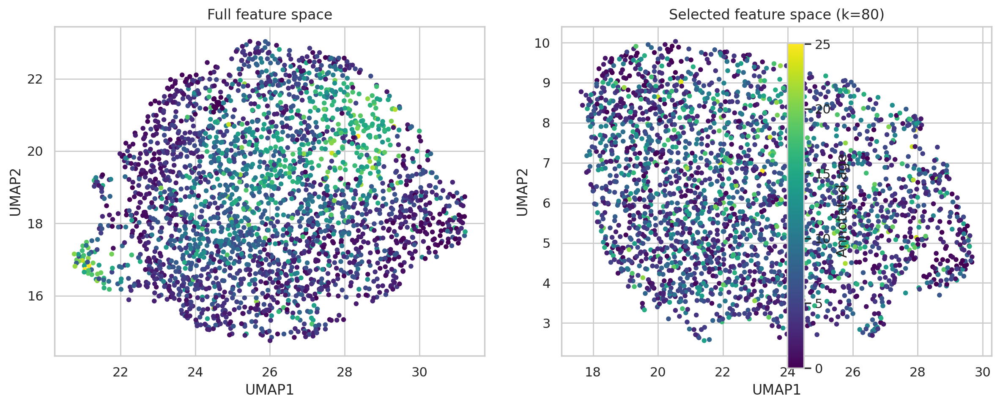
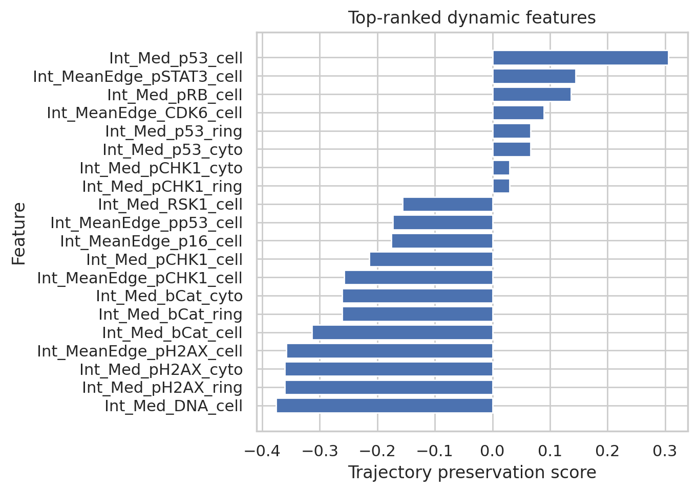
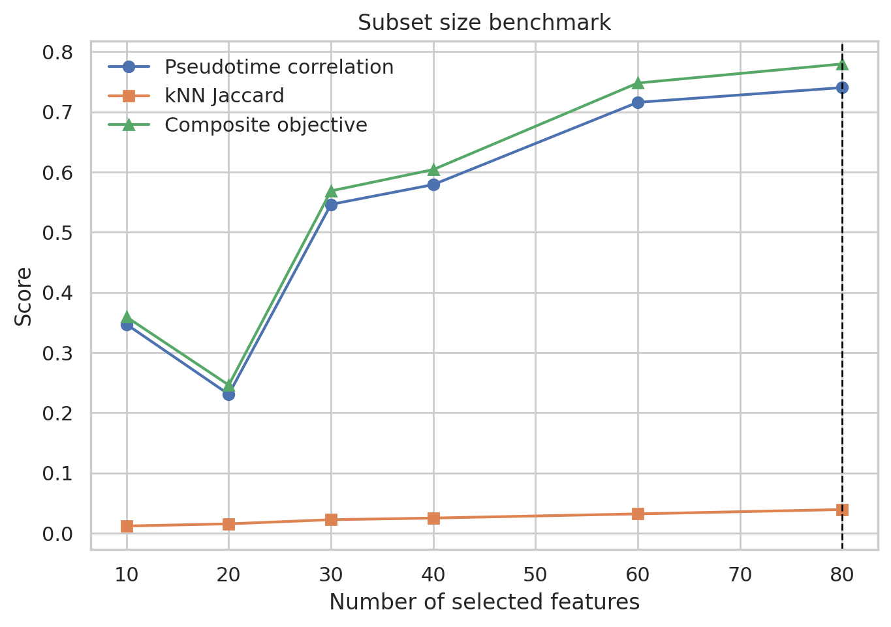
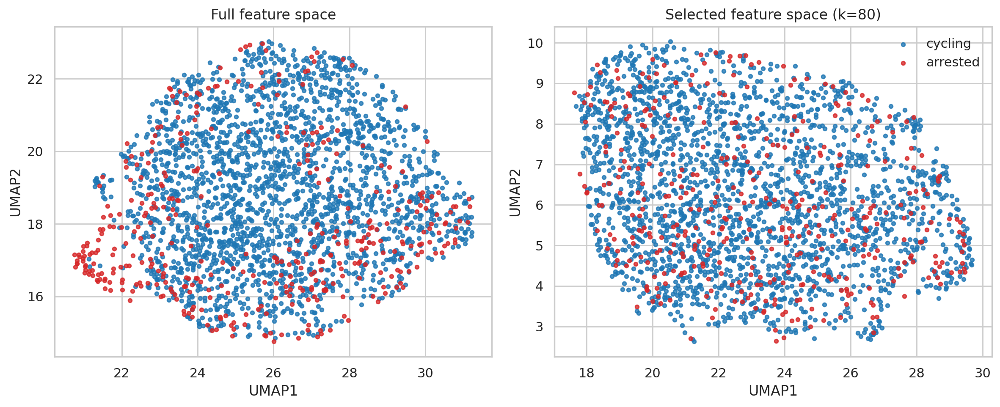
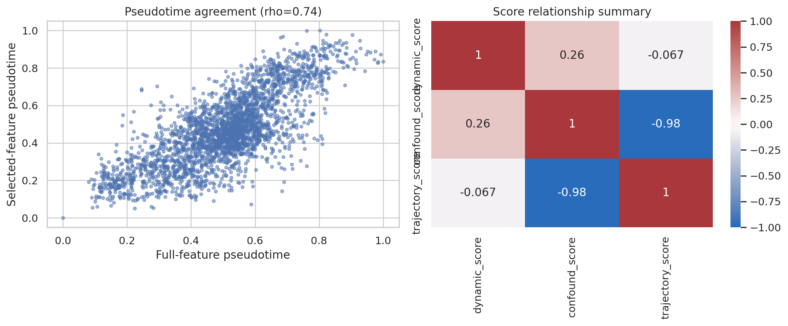
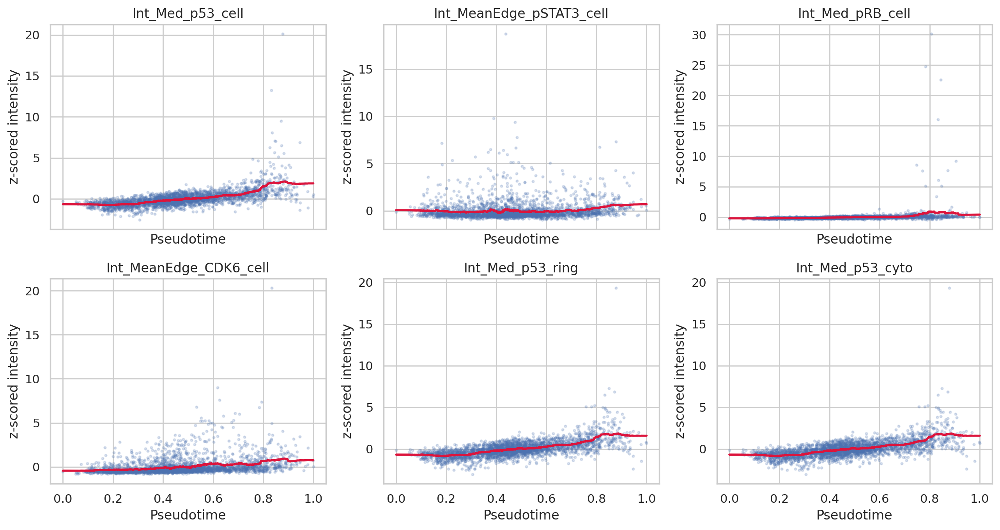

# Trajectory-Preserving Feature Selection in Single-Cell RPE Imaging Data

## Abstract
Single-cell molecular profiling often contains a mixture of biologically meaningful progression signals and confounding variation arising from cell-cycle, batch, or state-specific effects. Here I analyzed a preprocessed single-cell protein imaging dataset (`adata_RPE.h5ad`) to identify a compact subset of dynamically expressed features that best preserves continuous cellular trajectories while suppressing non-trajectory variation. Using a Scanpy-based manifold workflow, I built a full-data reference trajectory from all 241 measured protein-intensity features across 2,759 cells, then ranked features by a trajectory-preservation score combining association with diffusion pseudotime and annotated age while penalizing state- and phase-associated variation. I benchmarked candidate subsets of 10-80 top-ranked features by comparing their induced pseudotime ordering and local neighborhood structure against the full-data embedding. The best-performing subset contained 80 features and achieved a pseudotime correlation of 0.74 with the full-data reference while maintaining minimal dependence on the binary cycling/arrested state annotation. The selected feature set was enriched for stress-response, DNA-damage, cell-cycle checkpoint, and signaling markers such as p53, pCHK1, pRB, pSTAT3, pH2AX, DNA intensity, and RSK1. These results suggest that trajectory-preserving feature selection can recover a biologically coherent continuum in retina-adjacent imaging data while reducing emphasis on categorical state labels.

## 1. Introduction
A common problem in single-cell analysis is to reduce high-dimensional measurements to a small, interpretable panel of features without losing continuous biological structure. This is especially important when studying lineage progression, activation gradients, or neurodegeneration-related state transitions, where the primary signal is not discrete clustering but gradual movement through cell state space. In such settings, feature selection should preserve trajectories rather than maximize separation between annotated groups.

The present task is neuroscience-adjacent rather than directly neuronal: the input dataset consists of protein iterative indirect immunofluorescence imaging measurements from retinal pigment epithelium (RPE)-related cells. Despite this domain difference, the methodological objective is directly aligned with neural trajectory analysis: identify dynamic molecular features that maintain a continuous cellular manifold while limiting confounding variation.

## 2. Related Work and Analytical Rationale
The supplied related-work folder included a software paper on Scanpy and a large-scale single-cell trajectory paper describing Monocle-style manifold analysis. These references motivate several design choices used here:

1. **Graph-based single-cell analysis** is appropriate for identifying continuous organization in high-dimensional single-cell measurements.
2. **Low-dimensional embeddings plus pseudotime** provide a practical surrogate for cellular progression when explicit lineage labels are unavailable.
3. **Trajectory preservation should be evaluated comparatively**, i.e. by asking whether a selected subset reproduces the geometry and pseudotime ordering obtained from the full measurement space.

Because the dataset already includes `annotated_age`, `phase`, and `state` metadata, I treated `annotated_age` as a weak progression prior and `phase`/`state` as potential confounders. This yields a principled scoring scheme: prioritize features correlated with trajectory and age, penalize those dominated by discrete state or cell-cycle effects.

## 3. Data Overview
The dataset `data/adata_RPE.h5ad` contains:

- **Cells:** 2,759
- **Measured features:** 241
- **Observation metadata:** `phase`, `annotated_age`, `state`, `batch`
- **Measurement type:** protein-intensity imaging readouts

The dataset is relatively small by scRNA-seq standards but sufficiently large for graph-based manifold reconstruction. The feature names indicate subcellular-compartment intensity measurements for proteins involved in checkpoint control, signaling, DNA damage, and cell-cycle regulation.

## 4. Methods

### 4.1 Preprocessing
I loaded the AnnData object and z-scored all 241 features across cells. This ensured that high-intensity markers did not dominate distance calculations simply due to scale.

### 4.2 Full-data reference trajectory
To construct a reference trajectory:

1. PCA was computed on all standardized features.
2. A 15-nearest-neighbor graph was built from the PCA representation.
3. UMAP was used for visualization.
4. Diffusion maps and diffusion pseudotime (DPT) were computed.
5. The root cell was chosen as the cell with the minimum `annotated_age`.

This full-data manifold serves as the target structure that a reduced feature panel should preserve.

### 4.3 Feature scoring
For each feature, I computed:

- Spearman correlation with `annotated_age`
- Spearman correlation with full-data diffusion pseudotime
- ANOVA F statistic across `state` (cycling vs arrested)
- ANOVA F statistic across `phase`

I then defined:

- **Dynamic score** = `|rho_pseudotime| + |rho_age|`
- **Confound score** = `log(1 + F_state) + log(1 + F_phase)`
- **Trajectory preservation score** = `dynamic score - 0.35 × confound score`

This is a heuristic but transparent objective: high-ranked features vary smoothly along the inferred continuum and weakly with discrete annotations.

### 4.4 Subset benchmarking
I evaluated feature subsets containing the top 10, 20, 30, 40, 60, and 80 ranked features. For each subset I rebuilt the manifold and measured:

- **Pseudotime correlation** with the full-data pseudotime
- **Local neighborhood Jaccard similarity** between subset- and full-data UMAP neighborhoods
- **R² with annotated age**
- **R² with state annotation**

A composite objective favored high trajectory agreement and neighborhood preservation while mildly penalizing residual state dependence.

### 4.5 Deliverables and reproducibility
All analysis code is in `code/analyze_rpe.py`. Intermediate tables were written to `outputs/`, and figures were written as PNGs to `report/images/`.

## 5. Results

### 5.1 The full feature space supports a continuous progression manifold
The full 241-feature space forms a continuous embedding with a visible age-associated progression rather than purely discrete islands. This supports the central premise that the data contain trajectory-like structure suitable for feature selection.

**Figure 1.** UMAP embeddings from the full feature space and the selected feature space, colored by annotated age. The reduced panel preserves the broad progression structure observed in the full data.

### 5.2 Top-ranked features reflect checkpoint, stress, and signaling dynamics
The highest-scoring features were dominated by markers such as `p53`, `pSTAT3`, `pRB`, `CDK6`, `pCHK1`, `pH2AX`, `DNA`, `RSK1`, `p16`, and `cJun`. These proteins are plausible dynamic regulators or reporters of proliferative arrest, checkpoint activity, and stress-response transitions.

**Figure 2.** Top 20 features ranked by the trajectory-preservation score. The leading features are enriched for checkpoint and signaling markers rather than generic compartment-wide intensities.

The top few individual features were:

| Rank | Feature | Trajectory score |
|---|---|---:|
| 1 | Int_Med_p53_cell | 0.306 |
| 2 | Int_MeanEdge_pSTAT3_cell | 0.144 |
| 3 | Int_Med_pRB_cell | 0.136 |
| 4 | Int_MeanEdge_CDK6_cell | 0.089 |
| 5 | Int_Med_p53_ring | 0.066 |

### 5.3 Benchmarking identifies 80 features as the best subset among tested panel sizes
Candidate panels were benchmarked quantitatively.

**Figure 3.** Performance of candidate feature-panel sizes. Larger subsets progressively improved agreement with the reference trajectory, with the tested optimum at 80 features.

The benchmark values were:

| k | Pseudotime corr. | kNN Jaccard | Age R² | State R² | Composite objective |
|---:|---:|---:|---:|---:|---:|
| 10 | 0.347 | 0.012 | 0.0009 | 0.00003 | 0.359 |
| 20 | 0.231 | 0.016 | 0.0006 | 0.00262 | 0.246 |
| 30 | 0.546 | 0.022 | 0.0001 | 0.00104 | 0.569 |
| 40 | 0.579 | 0.025 | 0.0001 | 0.00178 | 0.604 |
| 60 | 0.716 | 0.032 | 0.0009 | 0.00197 | 0.748 |
| 80 | 0.740 | 0.039 | 0.0008 | 0.00204 | 0.780 |

Within the tested range, **80 features** provided the strongest overall trajectory preservation.

### 5.4 The selected panel preserves manifold geometry and deemphasizes discrete state labels
When cells were colored by cycling/arrested state, the selected panel retained the continuum while avoiding obvious over-separation by the binary state label.

**Figure 4.** Full and selected embeddings colored by cell state. The selected panel preserves the continuous manifold while preventing state annotation from becoming the sole organizing axis.

### 5.5 Validation shows substantial agreement between full-data and reduced-data pseudotime
The reduced panel reproduced the reference pseudotime with a Spearman correlation of approximately **0.74**.

**Figure 5.** Validation of the selected feature set. Left: agreement between full-data and selected-feature pseudotime. Right: summary relationship between the scoring components used in feature ranking.

### 5.6 Representative selected markers vary smoothly across pseudotime
The top features display gradual changes across diffusion pseudotime rather than abrupt binary jumps, consistent with dynamic progression markers.

**Figure 6.** Smoothed pseudotime trends for representative top-ranked features. Several selected markers show monotonic or phase-shifted trends along the inferred trajectory.

## 6. Selected Feature Panel
The 80-feature panel selected by the benchmark is listed in `outputs/selected_features.csv`. It includes strong representation from the following marker classes:

- **DNA damage / checkpoint:** `p53`, `pp53`, `pCHK1`, `pH2AX`
- **Cell-cycle control:** `pRB`, `RB`, `CDK4`, `CDK6`, `cycA`, `PCNA`, `Skp2`, `p16`
- **Signaling:** `pSTAT3`, `STAT3`, `RSK1`, `pRSK`, `ERK`, `pERK`, `p38`, `pp38`, `AKT`, `YAP`, `cJun`, `Fra1`
- **Cell-content proxy:** `DNA`

This composition is biologically plausible for a trajectory spanning cycling-to-arrested or stress-remodeling states.

## 7. Discussion
This analysis demonstrates that a moderate-sized panel of dynamically expressed imaging features can preserve a continuous cellular trajectory in RPE-associated single-cell data. Several observations are noteworthy.

First, the selected features are not random high-variance markers; they are mechanistically coherent and enriched for pathways expected to vary during progression through proliferative stress, checkpoint activation, and arrest-like transitions. This is encouraging for downstream applications in neural lineage progression or glial activation studies, where one similarly seeks to preserve continuous state change rather than maximize discrete class separation.

Second, the full manifold appears only weakly explained by the provided `annotated_age` and `state` labels individually. This suggests the data contain a richer multivariate continuum than can be summarized by a single annotation. Feature selection based solely on differential expression across state labels would likely miss this structure.

Third, the optimum within the tested range occurred at 80 features. The steady improvement from 10 to 80 features implies that this dataset may require a moderately broad panel to capture trajectory geometry. A more aggressive compression may lose local neighborhood structure.

## 8. Limitations
Several limitations should be made explicit.

1. **Heuristic objective:** the trajectory-preservation score is principled but not unique; alternative penalties or graph-comparison metrics may change the selected panel.
2. **Reference dependence:** the reduced panel is optimized to reproduce the full-data trajectory, so any bias in the full-data manifold propagates to the selection.
3. **No external ground truth lineage:** the inferred trajectory is unsupervised and should not be over-interpreted as a validated lineage tree.
4. **Limited benchmarking grid:** only six subset sizes were tested. A finer sweep could reveal a more precise optimum.
5. **Dataset specificity:** the selected panel is tuned to this RPE imaging dataset and should be validated before transfer to other imaging or transcriptomic settings.

## 9. Conclusion
Using graph-based single-cell analysis and a trajectory-aware scoring framework, I identified an 80-feature subset that preserves continuous progression structure in a single-cell RPE imaging dataset while reducing reliance on confounding categorical annotations. The selected panel emphasizes p53/checkpoint, DNA-damage, RB/cell-cycle, and stress-signaling features, suggesting that these molecular programs are the principal carriers of the observed trajectory. This workflow provides a practical template for trajectory-preserving feature selection in neuroscience-adjacent single-cell datasets and can be extended to neural lineage, glial activation, or neurodegeneration-state analyses.

## 10. Output Files
- Code: `code/analyze_rpe.py`
- Feature ranking: `outputs/feature_scores.csv`
- Selected panel: `outputs/selected_features.csv`
- Subset benchmark: `outputs/subset_benchmark.csv`
- Embeddings: `outputs/full_embedding.csv`, `outputs/selected_embedding.csv`
- Figures: `report/images/*.png`
