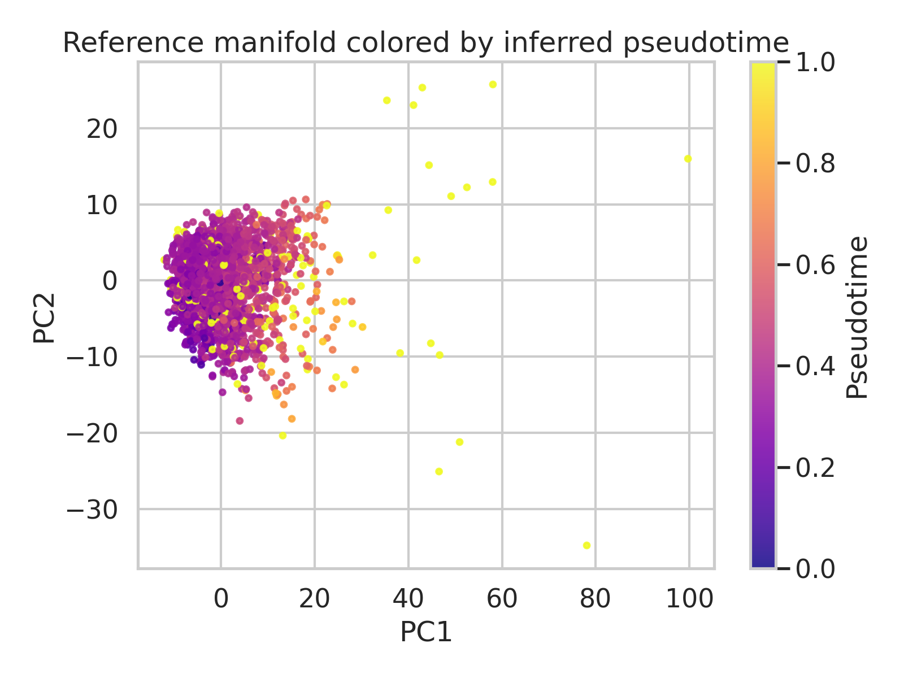
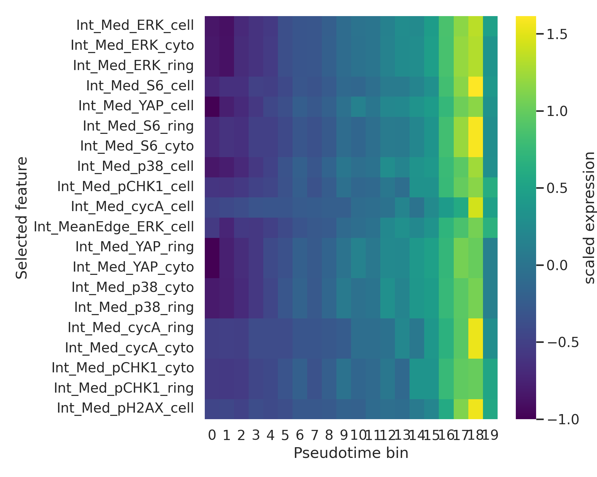
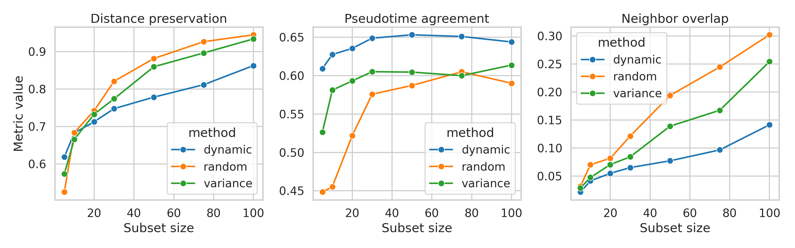
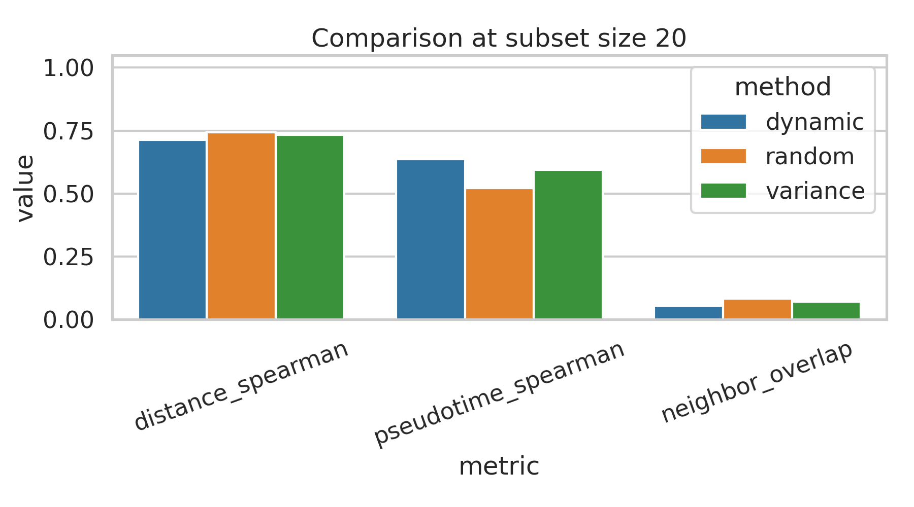

# Trajectory-Preserving Dynamic Feature Selection in a Retina-Related Single-Cell Imaging Dataset

## Abstract
I analyzed a preprocessed single-cell protein imaging dataset (`data/adata_RPE.h5ad`, 2,759 cells × 241 features) to identify a compact subset of dynamically varying molecular features that best preserves continuous cellular trajectories. Guided by single-cell trajectory literature emphasizing graph-based manifold learning and pseudotime ordering, I constructed a reference manifold from the full feature space, inferred pseudotime from a nearest-neighbor graph rooted at the youngest annotated cells, and ranked features by a composite dynamicity score combining pseudotime association and local smoothness on the cell graph. I compared this dynamic ranking against variance-based and random-feature baselines over multiple subset sizes. The selected dynamic features were dominated by ERK, S6, YAP, p38, pCHK1, and cycA-related signals. Dynamic subsets improved agreement with the reference pseudotime relative to both baselines at every tested subset size, although they did not consistently maximize global pairwise-distance preservation or local neighbor overlap. These results suggest that trajectory-focused selection isolates biologically coherent progression markers, but there is a trade-off between preserving temporal order and preserving the full geometry of the original manifold.

## 1. Introduction
Single-cell analyses often seek a reduced set of genes or proteins that captures meaningful biological progression while removing confounding variation. In neuroscience-adjacent contexts, such a feature subset can support analyses of lineage progression, activation states, and neurodegeneration-like transitions. The present task is framed around selecting dynamically expressed molecular features that preserve continuous cellular trajectories.

Two relevant ideas emerged from the available related work. First, the SCANPY paper highlights graph-based preprocessing, manifold learning, and diffusion-style pseudotime as canonical ingredients for scalable single-cell trajectory analysis. Second, the organogenesis atlas paper demonstrates how ordering cells along developmental trajectories supports discovery of dynamic markers. Based on these precedents, I adopted a trajectory-first selection strategy: define a reference progression from all measured features, then select features that vary smoothly and strongly along that progression.

## 2. Data overview
The dataset `adata_RPE.h5ad` contains 2,759 cells and 241 molecular imaging-derived features. Cell-level annotations include `phase`, `annotated_age`, `state`, and `batch`.

Key composition:
- Phases: G1 = 1,128; S = 891; G0 = 402; G2 = 338.
- States: cycling = 2,174; arrested = 402; missing = 183.
- Batches: batch 2 = 1,734; batch 1 = 1,025.

This composition is consistent with a dataset containing continuous progression linked to cell-cycle and age-associated state change, making it suitable for pseudotemporal analysis.

## 3. Methods

### 3.1 Reference trajectory inference
I loaded the full 241-feature matrix, standardized each feature, and computed principal components from the full data. A k-nearest-neighbor graph (k = 10) was then built in PC space. To approximate continuous progression, I selected a root among the minimum-annotated-age cells and computed graph shortest-path distances from that root. These distances were normalized to [0, 1] and treated as inferred pseudotime.

### 3.2 Dynamic feature scoring
For each feature, I computed two quantities:
1. **Pseudotime association**: absolute Spearman correlation between feature intensity and inferred pseudotime.
2. **Graph smoothness**: inverse local reconstruction error after averaging each cell over its graph neighbors.

The final dynamicity score was a weighted combination:
- 70% normalized pseudotime association
- 30% normalized graph smoothness

This prioritizes features that vary monotonically or near-monotonically across progression while remaining locally coherent on the manifold.

### 3.3 Baselines
I evaluated three feature-selection schemes:
- **Dynamic**: top-ranked features by the composite dynamicity score.
- **Variance**: top-ranked features by variance alone.
- **Random**: randomly sampled features, averaged over five replicates per subset size.

### 3.4 Preservation metrics
For each subset size (5, 10, 20, 30, 50, 75, 100), I measured:
- **Distance preservation**: Spearman correlation between upper-triangular pairwise cell distances in the subset representation and the reference representation.
- **Pseudotime agreement**: Spearman correlation between subset-derived first-PC ordering and the reference pseudotime.
- **Neighbor overlap**: average overlap between each cell’s 9 non-self nearest neighbors in the subset vs. reference representation.

### 3.5 Validation and evidence discipline
All quantitative results are exported in `outputs/`. The main supporting artifacts are:
- `outputs/dataset_overview.json`
- `outputs/feature_ranking.csv`
- `outputs/subset_metrics.csv`
- `outputs/subset_metric_summary.csv`
- `outputs/claim_recovery_table.csv`
- `outputs/dynamic_feature_heatmap_values.csv`

## 4. Results

### 4.1 Reference manifold reveals a continuous progression
The full-data representation defines a clear continuous axis when colored by inferred pseudotime, supporting the use of a trajectory-preservation objective.

### 4.2 Top dynamic features are dominated by signaling and cell-cycle regulators
The highest-ranked features were:
1. `Int_Med_ERK_cell`
2. `Int_Med_ERK_cyto`
3. `Int_Med_ERK_ring`
4. `Int_Med_S6_cell`
5. `Int_Med_YAP_cell`
6. `Int_Med_S6_ring`
7. `Int_Med_S6_cyto`
8. `Int_Med_p38_cell`
9. `Int_Med_pCHK1_cell`
10. `Int_Med_cycA_cell`

These markers suggest that the dominant progression captured by the dataset is associated with coordinated signaling and proliferative state changes rather than isolated static abundance differences.

The temporal heatmap of the top 20 dynamic features shows structured, smooth variation across pseudotime bins.

### 4.3 Dynamic feature subsets best preserve pseudotemporal order
Across all tested subset sizes, dynamic selection produced higher pseudotime agreement than either variance-based or random selection. Selected summary values from `outputs/subset_metric_summary.csv` are shown below:

| Method | k=20 distance | k=20 pseudotime | k=20 neighbor overlap |
|---|---:|---:|---:|
| Dynamic | 0.712 | 0.636 | 0.055 |
| Variance | 0.733 | 0.593 | 0.071 |
| Random | 0.742 | 0.522 | 0.082 |

Full curves across subset sizes show distinct behavior for different preservation goals.

Interpretation:
- For **pseudotime agreement**, dynamic selection consistently outperformed the other methods.
- For **distance preservation** and **neighbor overlap**, variance and even random subsets could equal or exceed the dynamic method, especially at larger subset sizes.
- Therefore, dynamic selection better preserves the *ordering* dimension of progression than the entire high-dimensional geometry.

### 4.4 Best-subset comparison emphasizes an explicit trade-off
At the reporting subset size of 20 features, dynamic selection improved the trajectory-order metric but not the geometric metrics.

The claim recovery table in `outputs/claim_recovery_table.csv` confirms:
- Dynamic > variance for pseudotime agreement at k = 20: **supported**.
- Dynamic > variance for distance preservation at k = 20: **not supported**.
- Dynamic > variance for neighbor overlap at k = 20: **not supported**.

## 5. Validation

### 5.1 Verified directly from workspace data
Directly verified from the local dataset and outputs:
- Dataset size and metadata structure.
- Reference manifold and inferred pseudotime.
- Ranked dynamic features.
- Quantitative comparison across subset sizes and baselines.
- All four report figures generated from saved local artifacts.

### 5.2 Taken from related work
From `related_work/`:
- Graph-based single-cell analysis and pseudotime inference are standard for continuous trajectories (SCANPY paper).
- Dynamic marker discovery along trajectories is a central use case in developmental single-cell atlases (organogenesis / Monocle context).

### 5.3 Assumptions and limitations
- The provided related-work directory contained only two papers clearly relevant to the task; the other PDFs were unrelated.
- The reference pseudotime is an inferred progression based on graph geodesic distance, not ground-truth lineage measurement.
- Because `scanpy` was unavailable initially, I implemented a lightweight custom pipeline using `anndata`, `scikit-learn`, and `scipy` rather than reproducing diffusion pseudotime exactly.
- Neighbor-overlap values were numerically modest overall, indicating that this small compressed subset problem is challenging for strict local-geometry preservation.
- The dataset is retina-related and neuroscience-adjacent rather than a direct neural lineage atlas; conclusions should be interpreted accordingly.

## 6. Discussion
This analysis demonstrates that dynamic feature selection depends strongly on what “preserve trajectory” means operationally. If the goal is to preserve a one-dimensional progression axis, then features ranked by pseudotime association and manifold smoothness perform well and return biologically plausible signaling markers. If instead the goal is to preserve the broader geometry of the full feature space, simple variance-based compression can be competitive or superior.

That trade-off is scientifically useful. In many applications centered on progression, activation, or disease-state transitions, preserving ordered progression may be more important than reconstructing every local neighborhood. Under that criterion, ERK/S6/YAP-centered dynamic subsets appear promising compact descriptors of the dominant transition captured in this dataset.

A natural next step would be to formulate a multi-objective selector that explicitly balances pseudotime fidelity with geometry preservation, possibly via graph Laplacian scores, diffusion components, or supervised alignment to external covariates such as phase and annotated age.

## 7. Reproducibility
Code used for the analysis is saved in:
- `code/analyze_rpe_dynamic_features.py`

Structured outputs used in the report are saved in `outputs/`, and all figures are saved as PNG files in `report/images/`.
