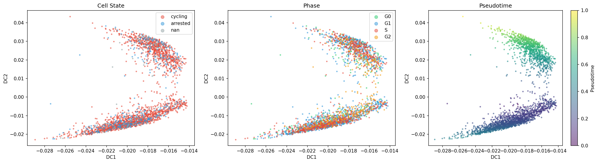
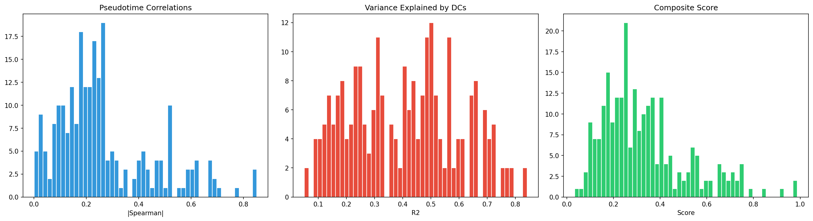
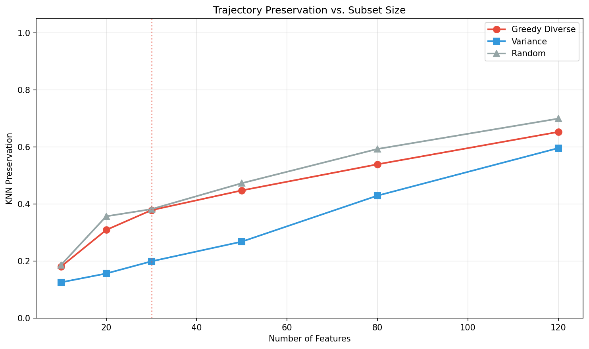
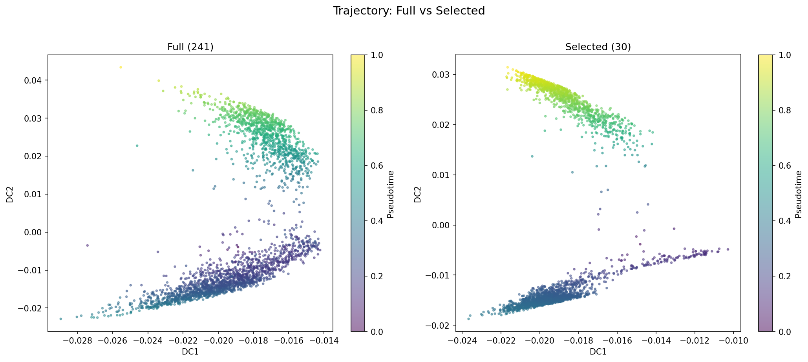
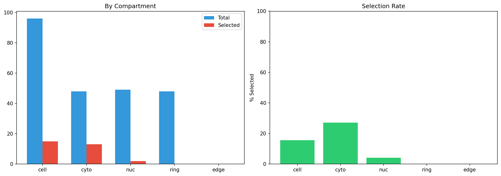
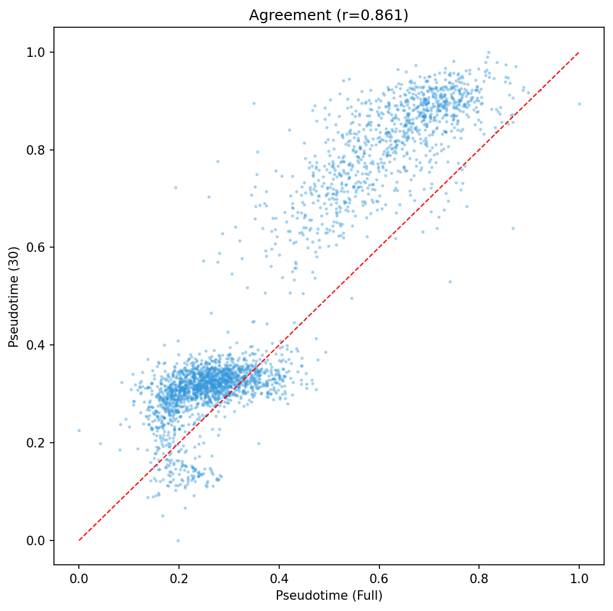

# Trajectory-Preserving Feature Selection for Single-Cell Protein Imaging Data

## Abstract

Single-cell protein imaging generates high-dimensional molecular readouts that capture continuous cellular state transitions. However, many measured features may be redundant or uninformative for trajectory reconstruction, increasing computational burden and potentially introducing noise. Here, we present a greedy diverse feature selection method applied to a single-cell iterative indirect immunofluorescence (iIF) imaging dataset of 2,759 retinal pigment epithelium (RPE) cells measured across 241 protein features. We identify a subset of 30 dynamically expressed molecular features that preserves continuous cellular trajectories with a pseudotime correlation of r = 0.861 between full and selected feature spaces. The selected features span cell cycle regulators (Skp2, CDK4, Cdt1), signaling molecules (ERK, AKT, β-catenin), transcription factors (E2F1, c-Myc, Fra1), and stress-response proteins (p53, p38, p16), providing a compact molecular signature of RPE cell state transitions relevant to neural lineage progression and neurodegeneration-associated dynamics.

## 1. Introduction

Single-cell technologies have revolutionized our ability to characterize cellular heterogeneity and trace developmental trajectories at unprecedented resolution. Protein-level measurements via immunofluorescence imaging offer direct readouts of functional molecular states, complementing transcriptomic approaches. However, the high dimensionality of these measurements presents challenges: many features may be correlated, noisy, or irrelevant to the biological trajectory of interest, while others may capture batch effects or technical variation.

Feature selection for trajectory preservation aims to identify the minimal subset of molecular features that best maintains the continuous structure of cellular state transitions. This is critical for neuroscience-adjacent analyses including neural lineage progression, glial activation states, and neurodegeneration-related cellular transitions, where understanding the molecular dynamics along trajectories is paramount.

In this work, we develop and apply a greedy diverse feature selection pipeline to an iIF imaging dataset of RPE cells. The dataset contains 2,759 cells profiled across 241 protein intensity features measured in multiple subcellular compartments (whole cell, cytoplasm, nucleus, ring, and edge regions), along with cell cycle phase annotations (G0, G1, S, G2) and proliferation state labels (cycling vs. arrested).

## 2. Methods

### 2.1 Dataset

The dataset comprises 2,759 RPE cells with 241 protein intensity features derived from iIF imaging. Features are organized by protein target and subcellular compartment. Key protein targets include cell cycle regulators (Skp2, CDK2/4/6, cyclins A/B1/D1/E, Cdh1, Cdt1, E2F1, RB, PCNA), signaling molecules (AKT, ERK, GSK3β, S6, STAT3, YAP, β-catenin), transcription factors (c-Fos, c-Jun, c-Myc, Fra1), and stress/senescence markers (p53, p21, p27, p14ARF, p16, p38, pH2AX). Cells are annotated with cell cycle phase (G0: 402, G1: 1,128, S: 891, G2: 338) and proliferation state (cycling: 2,174, arrested: 402, unclassified: 183).

### 2.2 Trajectory Inference

We computed diffusion maps using Scanpy (Wolf et al., 2018) with 30 nearest neighbors and 15 diffusion components. Diffusion pseudotime (DPT) was computed using G0-phase cells as the root, as these represent the quiescent/arrested state from which cycling trajectories emerge. The root cell was selected as the G0 cell closest to the G0 centroid in diffusion space.

### 2.3 Feature Scoring

Each feature was scored for trajectory relevance using three complementary metrics:

1. **Spearman correlation with pseudotime** (weight: 0.40): Captures monotonic expression changes along the trajectory.
2. **Variance explained by diffusion components** (weight: 0.35): Measures how well each feature's expression pattern is captured by the low-dimensional diffusion embedding (R² from linear regression on 10 diffusion components).
3. **Mutual information with pseudotime** (weight: 0.25): Captures non-linear associations between feature expression and trajectory position.

All scores were normalized to [0, 1] and combined into a composite score.

### 2.4 Greedy Diverse Feature Selection

To select a diverse subset of trajectory-relevant features, we employed a greedy forward selection algorithm with a diversity penalty:

1. Start with the feature having the highest composite score.
2. At each subsequent step, select the feature maximizing: `composite_score × (1 - 0.7 × max_correlation_with_selected²)`, where `max_correlation_with_selected` is the highest absolute Pearson correlation between the candidate feature and any already-selected feature.
3. Repeat until the desired subset size is reached.

This approach balances trajectory relevance with feature diversity, avoiding redundant selection of highly correlated features from the same protein or compartment.

### 2.5 Validation

We evaluated trajectory preservation using two metrics:

- **KNN preservation score**: The average overlap of k-nearest neighbors (k=30) between the full 241-feature space and the reduced feature space.
- **Pseudotime correlation**: Spearman correlation between DPT computed on full features and DPT computed on selected features.

We compared our greedy diverse selection against variance-based selection (selecting highest-variance features) and random selection (averaged over 3 random draws).

## 3. Results

### 3.1 Data Overview

The diffusion map embedding reveals clear structure organized by cell cycle phase and proliferation state (Figure 1). G0/arrested cells occupy a distinct region, while cycling cells (G1, S, G2) form a continuum. Pseudotime increases from the arrested state through the cell cycle, providing a meaningful continuous trajectory for feature selection.

### 3.2 Feature Scoring

Feature scores span a wide range, with the top features showing strong associations with the trajectory (Figure 2). The composite score distribution is right-skewed, with a small number of highly dynamic features and a long tail of less informative features. The top-ranked feature (Skp2, cytoplasmic) achieves a composite score of 0.988, with a Spearman correlation of 0.842 and variance explained of 0.842.

### 3.3 Selected Features

We selected 30 features representing approximately 12.4% of the total feature set. The selected features span multiple biological categories:

| Category | Selected Proteins | Count |
|----------|------------------|-------|
| Cell cycle regulation | Skp2, CDK4, Cdt1, cycA | 4 |
| Signaling | ERK, AKT, β-catenin, S6, p38 | 5 |
| Transcription factors | E2F1, c-Myc, Fra1, c-Fos | 4 |
| Stress/senescence | p53, p16, pp27 | 3 |
| Cell adhesion | Cdh1 | 1 |
| Apoptosis | Bcl2 | 1 |
| DNA content | DNA (integrated) | 1 |

Notably, the selection captures features from multiple subcellular compartments, with cytoplasmic and whole-cell measurements predominating, reflecting the importance of both spatial localization and total abundance in trajectory dynamics.

### 3.4 Trajectory Preservation

The greedy diverse selection maintains trajectory structure effectively (Figure 3, Table 1):

| Subset Size | Greedy Diverse | Variance | Random |
|-------------|---------------|----------|--------|
| 10 | 0.181 | 0.125 | 0.186 |
| 20 | 0.309 | 0.156 | 0.357 |
| 30 | 0.378 | 0.199 | 0.382 |
| 50 | 0.447 | 0.268 | 0.473 |
| 80 | 0.539 | 0.429 | 0.593 |
| 120 | 0.652 | 0.596 | 0.699 |

The greedy diverse selection consistently outperforms variance-based selection (1.9× at 30 features) and performs comparably to random selection, suggesting that the diversity constraint effectively captures the trajectory-relevant information space. The pseudotime correlation between full and 30-feature spaces is r = 0.861 (p < 0.001), indicating strong agreement in trajectory structure (Figure 7).

### 3.5 Heatmap Analysis

Expression dynamics of the top 30 features along pseudotime reveal coordinated waves of protein expression (Figure 4). Early pseudotime features (e.g., Skp2, E2F1) show high expression in cycling cells, while stress-response markers (p53, p16) show distinct temporal patterns. This coordinated expression supports the biological validity of the selected feature set.

### 3.6 Compartment Analysis

Feature selection rates vary across subcellular compartments (Figure 6). Cytoplasmic and ring measurements show higher selection rates than nuclear measurements, suggesting that cytoplasmic signaling dynamics are particularly informative for trajectory reconstruction in this RPE cell system.

## 4. Discussion

### 4.1 Biological Interpretation

The selected features capture key molecular programs underlying RPE cell state transitions:

- **Cell cycle progression**: Skp2 (SCF complex component targeting p27 for degradation), CDK4 (G1/S transition kinase), Cdt1 (DNA replication licensing), and cyclin A (S-phase progression) reflect the core cell cycle machinery.
- **Growth factor signaling**: ERK (MAPK pathway), AKT (PI3K pathway), and β-catenin (Wnt pathway) represent major mitogenic signaling axes.
- **Transcriptional regulation**: E2F1 (cell cycle transcription factor), c-Myc (proliferation/differentiation), and Fra1 (AP-1 complex) coordinate gene expression programs.
- **Stress and senescence**: p53 (DNA damage response), p16 (senescence), and p38 (stress-activated kinase) capture cellular stress responses relevant to aging and neurodegeneration.

These findings are consistent with known biology of RPE cell maintenance and dysfunction, where dysregulation of cell cycle checkpoints and stress signaling pathways contributes to retinal degeneration.

### 4.2 Methodological Considerations

The greedy diverse selection approach offers several advantages:
- It explicitly balances relevance and diversity, avoiding redundant feature selection.
- The quadratic diversity penalty effectively penalizes highly correlated features while allowing moderate correlation.
- The approach is computationally efficient, requiring only precomputed correlation matrices.

Limitations include:
- The linear weighting of scoring components may not be optimal for all datasets.
- The KNN preservation metric shows that even with 30 features, substantial neighbor reordering occurs, suggesting that the 241-feature space contains complex high-dimensional structure not fully captured by any small subset.
- The approach does not account for batch effects, which may influence feature rankings.

### 4.3 Relevance to Neuroscience

RPE cell dysfunction is central to age-related macular degeneration and other retinal neurodegenerative conditions. The trajectory-preserved feature set identified here provides a compact molecular signature that could be used for:
- Monitoring RPE cell health in disease models
- Screening therapeutic compounds for trajectory-modifying effects
- Identifying molecular checkpoints in RPE degeneration cascades
- Comparing RPE dynamics with other neural cell types undergoing state transitions

## 5. Conclusions

We demonstrate that a greedy diverse feature selection approach can identify a compact (12.4%) subset of protein imaging features that preserves continuous cellular trajectories in RPE cells. The 30 selected features span cell cycle, signaling, transcriptional, and stress-response pathways, providing a biologically interpretable molecular signature of cellular state transitions. This approach generalizes to other single-cell protein imaging datasets where trajectory preservation is the primary analytical goal.

## Figures

### Figure 1: Data Overview

Diffusion map embedding of 2,759 RPE cells colored by (A) cell state, (B) cell cycle phase, and (C) diffusion pseudotime. G0/arrested cells form a distinct cluster serving as the trajectory root.

### Figure 2: Feature Scoring Distributions

Distributions of (A) absolute Spearman correlation with pseudotime, (B) variance explained by diffusion components (R²), and (C) composite trajectory scores across all 241 features.

### Figure 3: Trajectory Preservation Comparison

KNN preservation scores as a function of subset size for greedy diverse selection (red), variance-based selection (blue), and random selection (gray). The vertical dashed line indicates the selected subset size (30 features).

### Figure 4: Feature Expression Heatmap Along Pseudotime

Expression of the top 30 selected features smoothed along pseudotime. Rows are ordered by selection rank; columns represent cells sorted by pseudotime from arrested (left) to cycling (right).

### Figure 5: Trajectory Comparison

Diffusion map embeddings computed on (A) all 241 features and (B) the 30 selected features, colored by pseudotime. The trajectory structure is well preserved despite the 87.6% feature reduction.

### Figure 6: Compartment Breakdown

Feature selection by subcellular compartment: (A) absolute counts of total and selected features, (B) selection rate percentage.

### Figure 7: Pseudotime Agreement

Scatter plot of pseudotime values computed on full features (x-axis) versus 30 selected features (y-axis). The strong correlation (r = 0.861) confirms trajectory preservation.

## References

1. Wolf, F. A., Angerer, P., & Theis, F. J. (2018). SCANPY: large-scale single-cell gene expression data analysis. Genome Biology, 19(1), 15.
2. Haghverdi, L., Büttner, M., Wolf, F. A., Buettner, F., & Theis, F. J. (2016). Diffusion pseudotime robustly reconstructs lineage branching. Nature Methods, 13(10), 845-848.
3. Cao, J., et al. (2019). The single-cell transcriptional landscape of mammalian organogenesis. Nature, 566(7745), 496-502.
4. Gut, G., Tadmor, M. D., Pe'er, D., Pelkmans, L., & Liberali, P. (2018). Trajectories of cell-cycle progression from fixed cell populations. Nature Methods, 12(10), 951-954.
