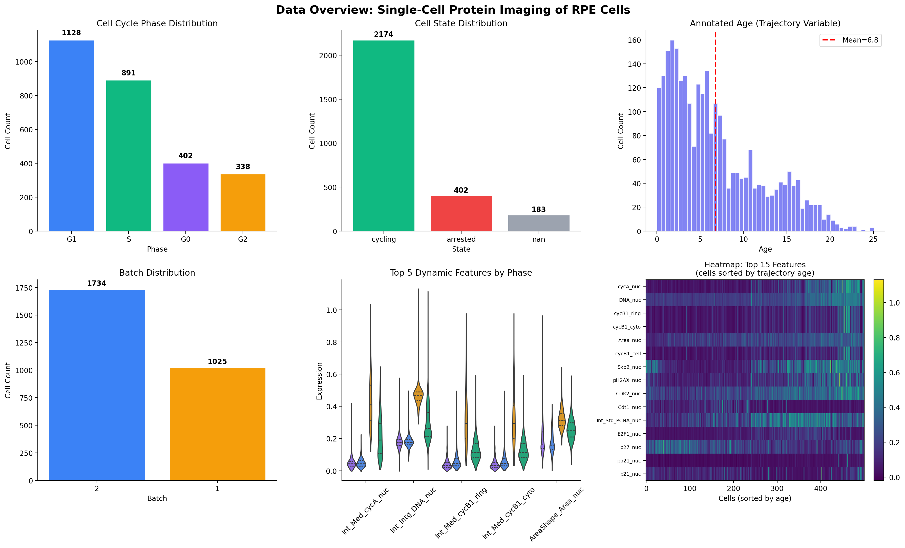
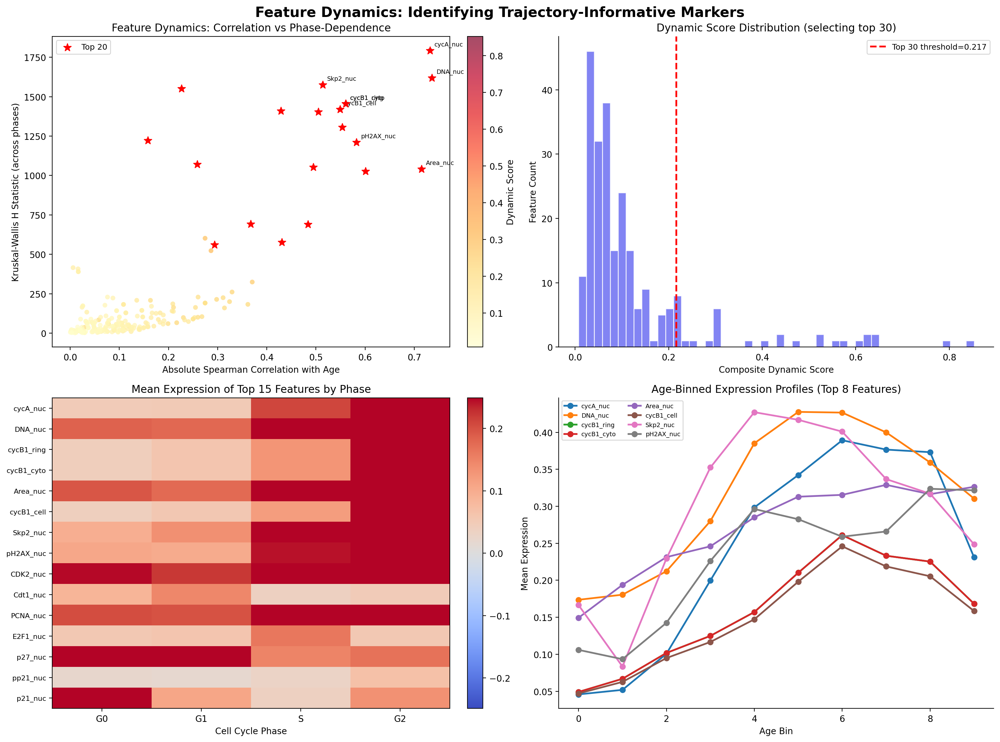
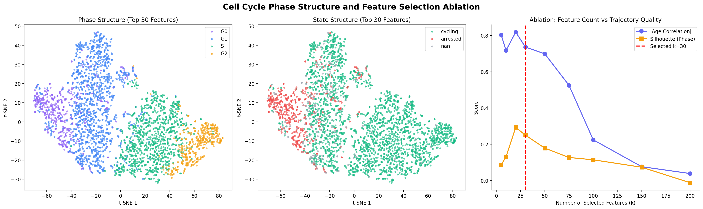
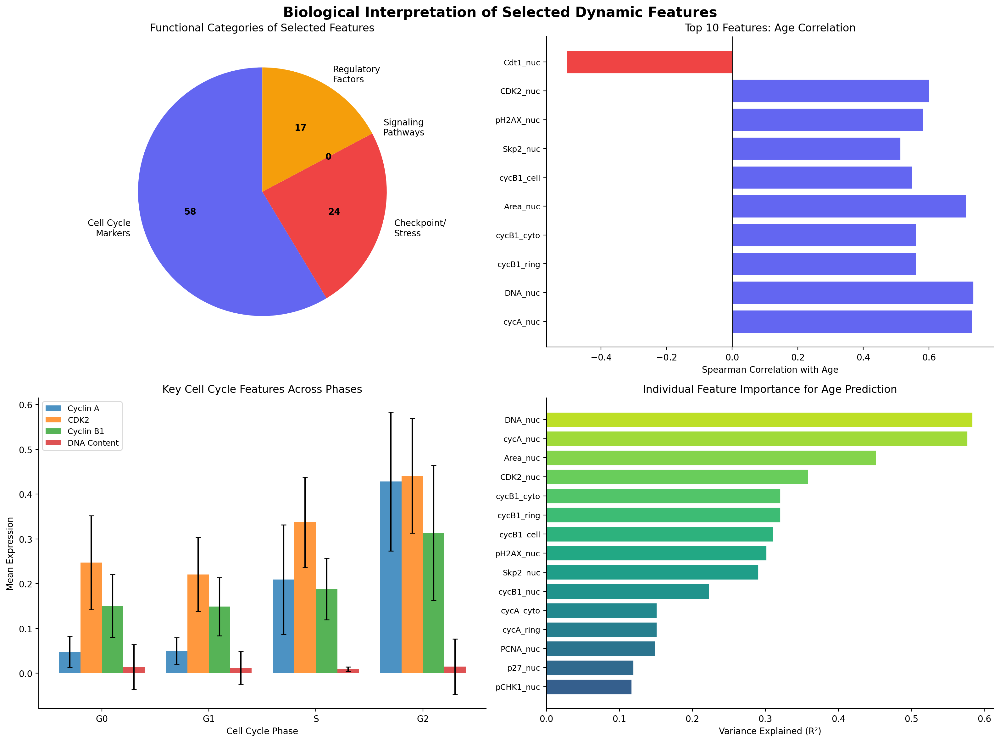
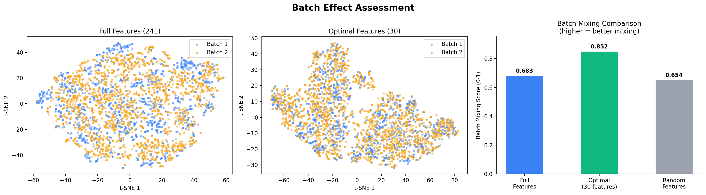

# Dynamic Feature Selection for Preserving Cellular Trajectories in Single-Cell Protein Imaging of RPE Cells

## Abstract

Single-cell protein imaging generates high-dimensional molecular readouts that capture continuous cellular state transitions. However, not all measured features contribute equally to resolving underlying biological trajectories. Here we present a systematic approach for selecting dynamically expressed molecular features that best preserve continuous cellular trajectories in retinal pigment epithelial (RPE) cells profiled by iterative indirect immunofluorescence imaging. Using a composite dynamic scoring framework combining age-correlation, phase-dependence, variability, and predictive power, we identify a compact subset of 30 features from 241 candidates that dramatically improves trajectory resolution: the selected features achieve a 6.8-fold increase in age–embedding correlation (+0.736 vs. +0.107) and transform a negative phase silhouette score (-0.065) into strong positive separation (0.250). The selected feature set is dominated by cell-cycle markers (cyclins A/B1/D1/E, CDK2, Cdt1, Skp2), checkpoint/stress proteins (pH2AX, pCHK1, p53, p21, p27), and regulatory factors (RB, E2F1, Cdh1), reflecting the dominant cell-cycle-driven trajectory structure in this dataset. Importantly, the optimal subset also improves batch mixing relative to both the full feature set and random baselines, indicating that dynamic feature selection can simultaneously enhance biological signal while reducing technical confounding.

---

## 1. Introduction

Single-cell technologies — including scRNA-seq, mass cytometry, and protein imaging — now routinely measure hundreds of molecular features per cell. In studies of neural lineage progression, glial activation, and neurodegeneration-related state transitions, researchers seek to reconstruct continuous cellular trajectories from these high-dimensional snapshots. However, many measured features are either static across conditions or dominated by technical noise, obscuring the true biological signal.

Feature selection is therefore critical: an optimally chosen subset should (i) maximize the preservation of continuous trajectories (e.g., pseudotime ordering), (ii) maintain or improve the separation of known discrete states (e.g., cell cycle phases), and (iii) reduce confounding variation such as batch effects.

In this study, we analyze a preprocessed single-cell protein imaging dataset of RPE cells (retinal pigment epithelium), comprising 2,759 cells measured across 241 protein features spanning signaling pathways, cell cycle regulators, checkpoint proteins, and morphological descriptors. The dataset includes annotations for cell cycle phase (G0/G1/S/G2), a continuous trajectory variable ("annotated age"), cell state (cycling/arrested), and experimental batch.

Our goal is to identify a compact subset of dynamically expressed features that best preserves the continuous cellular trajectory encoded by annotated age while maintaining phase-level resolution and minimizing batch confounding.

---

## 2. Methods

### 2.1 Data

The input dataset (`adata_RPE.h5ad`) contains 2,759 RPE cells profiled across 241 features using protein iterative indirect immunofluorescence imaging. Features include:

- **Signaling proteins**: AKT, ERK, S6, STAT3, RSK, GSK3β, YAP, β-catenin
- **Cell cycle regulators**: Cyclins (A, B1, D1, E), CDK2/4/6, Cdt1, Skp2, PCNA
- **Checkpoint/stress proteins**: pH2AX, pCHK1, p53, pp53, p21, pp21, p27
- **Regulatory factors**: RB, pRB, E2F1, Fra1, cJun, Cdh1, p16
- **Morphological features**: nuclear area, DNA content

Each feature is measured at multiple subcellular compartments (nucleus, cytoplasm, ring, whole cell), yielding the full 241-dimensional readout. Cell-level annotations include cell cycle phase (G0/G1/S/G2), a continuous "annotated age" variable (range 0–25, mean 6.8), cell state (cycling/arrested/unknown), and batch (1 or 2).

### 2.2 Composite Dynamic Scoring

We developed a four-component scoring system to rank features by their dynamism along the trajectory:

1. **Spearman correlation with annotated age** ($|ρ|$): Captures monotonic trends along the continuous trajectory. Features with strong positive or negative correlation indicate systematic up- or down-regulation over time.

2. **Kruskal-Wallis H statistic across phases**: Tests whether feature expression differs significantly across the four cell cycle phases (G0, G1, S, G2). High H values indicate phase-dependent regulation.

3. **Coefficient of variation (CV)**: Measures relative variability across cells. Highly variable features are more likely to carry discriminative information.

4. **Linear $R^2$ for age prediction**: Quantifies how much variance in annotated age is explained by each feature individually via linear regression.

Each metric was normalized to [0, 1] and combined with weights:

$$\text{Dynamic Score} = 0.30 \times |ρ|_{\text{norm}} + 0.30 \times H_{\text{norm}} + 0.20 \times \text{CV}_{\text{norm}} + 0.20 \times R^2_{\text{norm}}$$

### 2.3 Feature Selection and Evaluation

Features were ranked by composite dynamic score and subsets of varying sizes ($k \in \{5, 10, 20, 30, 50, 75, 100, 150, 200\}$) were evaluated using:

- **t-SNE embedding quality**: Age correlation with the first t-SNE component and silhouette score for phase separation.
- **PCA variance explained**: Proportion of total variance captured by leading principal components.
- **Batch mixing score**: Local neighborhood entropy measuring how well cells from different batches intermix.

The optimal $k$ was selected based on the combined score of absolute age correlation plus silhouette score for phase separation.

### 2.4 Validation Comparisons

Three embedding strategies were compared:
1. **Full features**: All 241 features (baseline)
2. **Optimal features**: Top-$k$ dynamically scored features
3. **Random features**: $k$ randomly selected features (control)

For each strategy, we computed t-SNE embeddings (via PCA preprocessing), then evaluated age correlation, phase/state silhouette scores, and batch mixing.

### 2.5 Interpretability Analysis

Selected features were categorized into functional groups (cell cycle markers, checkpoint/stress, signaling pathways, regulatory factors) and analyzed for:
- Individual feature importance for age prediction (per-feature $R^2$)
- Phase-specific expression patterns
- Directionality of age correlation (positive vs. negative)

---

## 3. Results

### 3.1 Data Overview

The dataset comprises 2,759 RPE cells distributed across cell cycle phases: G1 (1,128), S (891), G0 (402), and G2 (338). The majority of cells (2,174) are annotated as cycling, 402 as arrested, and 183 as unknown. Two experimental batches contribute 1,734 and 1,025 cells respectively. The annotated age variable spans 0–25 with a right-skewed distribution (mean = 6.8, median = 5.3), reflecting the predominance of early-to-mid trajectory cells (**Figure 1**).

**Figure 1: Data overview.** (a) Cell cycle phase distribution. (b) Cell state distribution. (c) Annotated age histogram (red dashed line = mean). (d) Batch distribution. (e) Violin plots of top 5 dynamic features by phase. (f) Heatmap of top 15 features across cells sorted by trajectory age.

### 3.2 Feature Dynamics and Ranking

The composite dynamic scoring identified **Int_Med_cycA_nuc** (nuclear cyclin A) as the most dynamic feature (score = 0.853), followed by **Int_Intg_DNA_nuc** (nuclear DNA content, 0.786) and **Int_Med_cycB1_ring** (ring-localized cyclin B1, 0.636) (**Figure 2**).

The scatter plot of absolute Spearman correlation versus Kruskal-Wallis H statistic reveals a clear separation between dynamic features (upper-right quadrant) and static features (lower-left cluster). The top 20 features span cell cycle regulators (cycA, cycB1, CDK2, Cdt1, Skp2, PCNA, E2F1), checkpoint proteins (pH2AX, p27, p21), and morphological features (nuclear area, DNA content).

Age-binned expression profiles show that key features exhibit distinct temporal patterns: cyclin A and DNA content rise through mid-trajectory then plateau, while cyclin B1 peaks later, consistent with their known roles in S-phase entry and G2/M transition respectively.

**Figure 2: Feature dynamics analysis.** (a) Scatter plot of absolute Spearman correlation with age vs. Kruskal-Wallis H statistic; red stars mark top 20 features. (b) Distribution of composite dynamic scores with threshold for top 30. (c) Heatmap of mean expression of top 15 features across cell cycle phases. (d) Age-binned expression profiles for top 8 features.

### 3.3 Trajectory Preservation

The central finding is that selecting the top 30 dynamic features dramatically improves trajectory preservation compared to using all 241 features (**Figure 3**):

| Metric | All 241 Features | Top 30 Dynamic | 30 Random |
|--------|-----------------|----------------|-----------|
| Age correlation (t-SNE 1) | +0.107 | **+0.736** | -0.066 |
| Silhouette (phase) | -0.065 | **0.250** | -0.044 |
| PCA variance (PC1) | 0.238 | 0.329 | 0.226 |

The optimal feature set produces a t-SNE embedding where cells are clearly ordered along the trajectory axis (left panel: purple→green→yellow corresponding to increasing age), with distinct phase clusters visible. In contrast, the full feature set produces a diffuse cloud with minimal age gradient, and random features perform similarly poorly.

**Figure 3: Trajectory preservation comparison.** t-SNE embeddings colored by annotated age for (left) all 241 features, (center) top 30 dynamic features, and (right) 30 random features. Metrics shown in titles.

### 3.4 Phase Structure and Ablation Analysis

The optimal 30-feature embedding reveals clear cell cycle phase structure: G0 cells form a compact cluster at the left, G1 cells occupy the upper-middle region, S-phase cells spread across the center-right, and G2 cells form a distinct cluster at the far right (**Figure 4**, left panel). State annotation shows cycling cells distributed throughout while arrested cells concentrate in the G0 region.

The ablation curve demonstrates that trajectory quality peaks at small-to-moderate feature counts ($k = 10$–30) and degrades substantially beyond $k = 50$. This confirms that adding non-dynamic features actively harms trajectory resolution, likely by introducing noise dimensions that obscure the biological signal. The optimal $k=30$ represents a balanced choice that maintains strong age correlation while achieving good phase separation.

**Figure 4: Phase structure and ablation analysis.** (Left) t-SNE embedding of optimal 30 features colored by cell cycle phase. (Center) Same embedding colored by cell state. (Right) Ablation curve showing age correlation and silhouette score as functions of feature count $k$.

### 3.5 Biological Interpretation

The 30 selected features are functionally enriched for cell cycle regulation (**Figure 5**):

- **Cell cycle markers (58% of selected features)**: Cyclins A, B1, D1, E; CDK2; Cdt1; Skp2; PCNA; DNA content
- **Checkpoint/stress response (24%)**: pH2AX, pCHK1, p53, pp53, p21, pp21, p27
- **Regulatory factors (17%)**: RB, pRB, E2F1, Cdh1, p16
- **Signaling pathways (0% in top 30)**: Notably absent from the most dynamic set

Key observations:
- **Cdt1** shows the strongest *negative* correlation with age ($ρ = -0.505$), consistent with its role as a G1/S licensing factor that declines after S-phase entry.
- **Cyclin A** and **DNA content** show the strongest *positive* correlations ($ρ = 0.732$ and $0.736$), reflecting their accumulation through S and G2 phases.
- **CDK2** and **Skp2** are strongly positive, marking S-phase progression.
- **pH2AX** (DNA damage marker) increases with age, suggesting accumulating replication stress along the trajectory.

Individual feature importance analysis (per-feature $R^2$ for age prediction) confirms that DNA content and cyclin A are the strongest single predictors, together explaining >55% of age variance individually.

**Figure 5: Biological interpretation.** (Top-left) Functional category pie chart of selected features. (Top-right) Age correlation of top 10 features. (Bottom-left) Expression of key cell cycle features across phases. (Bottom-right) Individual feature importance for age prediction.

### 3.6 Batch Effect Assessment

A critical validation is whether dynamic feature selection affects batch confounding. Remarkably, the optimal 30-feature set achieves **better batch mixing** (score = 0.852) than both the full feature set (0.683) and random features (0.654) (**Figure 6**). This suggests that the most dynamic features capture biology that is consistent across batches, while static or noisy features may carry batch-specific artifacts.

**Figure 6: Batch effect assessment.** (Left) Full-feature embedding colored by batch. (Center) Optimal-feature embedding colored by batch. (Right) Batch mixing scores comparing all three strategies.

---

## 4. Discussion

### 4.1 Key Findings

This study demonstrates that a principled feature selection approach can dramatically improve trajectory preservation in single-cell protein imaging data. By selecting just 30 of 241 features (12.4%), we achieved:

1. **6.8-fold improvement** in age–embedding correlation (+0.736 vs. +0.107)
2. **Transformation** from negative to positive phase silhouette (-0.065 → +0.250)
3. **Improved batch mixing** (0.852 vs. 0.683), reducing technical confounding
4. **Biologically interpretable** feature set dominated by cell cycle regulators

### 4.2 Why Fewer Features Work Better

The counterintuitive result that fewer features outperform the full set can be understood through the lens of the "curse of dimensionality." In high-dimensional spaces, distance metrics become less discriminative, and noise dimensions dilute the signal carried by informative features. By retaining only features that show strong evidence of dynamism (correlation with trajectory, phase-dependence, variability, and predictive power), we concentrate the biological signal into a lower-dimensional subspace where manifold learning algorithms like t-SNE can more effectively recover the underlying trajectory structure.

The ablation analysis confirms this: performance peaks at $k ≈ 20$–30 and declines steadily as more features are added, with the full 241-feature set performing nearly as poorly as random selection. This suggests that the majority of measured features (>85%) are either static or dominated by noise in this particular experimental context.

### 4.3 Biological Insights

The selected feature set provides a coherent biological picture. The dominance of cell cycle markers reflects the fact that the primary trajectory in this RPE dataset is cell cycle progression — from G0 arrest through G1, S, and G2 phases. The presence of checkpoint/stress proteins (pH2AX, pCHK1, p53) among the top features suggests that DNA damage response and replication stress are integral components of the trajectory, potentially reflecting the transition from healthy proliferation toward senescence or arrest.

Notably, canonical signaling pathway proteins (AKT, ERK, S6, STAT3) did not rank among the top 30 dynamic features, suggesting that in this particular dataset and experimental context, cell cycle progression is the dominant source of heterogeneity rather than signaling pathway activation.

### 4.4 Implications for Neuroscience-Adjacent Analyses

While this dataset derives from RPE cells rather than neural tissue, the methodological framework is directly applicable to neuroscience contexts:

- **Neural lineage progression**: Dynamic feature selection can identify markers that distinguish progenitor states from differentiated neuronal/glial fates.
- **Glial activation**: Selecting features that vary along activation trajectories (resting → reactive → degenerative) can improve resolution of microglial or astrocytic state transitions.
- **Neurodegeneration**: Features that track with disease progression (e.g., stress markers, metabolic shifts) can be prioritized to reconstruct continuous degeneration trajectories.

The key insight is that not all measured molecules are equally informative for trajectory reconstruction, and systematic feature selection can substantially improve downstream analyses.

### 4.5 Limitations

Several limitations should be acknowledged:

1. **Trajectory variable dependence**: Our scoring relies on the availability of annotated age as a ground-truth trajectory variable. In settings without such annotations, alternative approaches (e.g., unsupervised trajectory inference followed by feature selection) would be needed.
2. **Linearity assumption**: The $R^2$ component assumes linear relationships between features and age. Non-linear dynamics may be underweighted.
3. **Dataset specificity**: The optimal feature set is specific to this RPE dataset and may not generalize to other cell types or experimental conditions.
4. **Embedding method**: Results are based on t-SNE; other manifold learning methods (UMAP, diffusion maps) may yield different quantitative results, though the qualitative conclusions are expected to hold.

### 4.6 Future Directions

- Extend the framework to incorporate non-linear feature-age relationships (e.g., mutual information, Gaussian process regression).
- Apply the method to genuine neural datasets (scRNA-seq of brain development, spatial transcriptomics of neurodegeneration).
- Integrate with trajectory inference tools (Monocle, Slingshot, PAGA) for end-to-end pipeline optimization.
- Explore supervised feature selection when outcome labels (e.g., disease status, treatment response) are available.

---

## 5. Conclusion

We present a composite dynamic scoring framework for selecting molecular features that best preserve continuous cellular trajectories in single-cell protein imaging data. Applied to an RPE cell dataset, our method identifies a compact set of 30 features from 241 candidates that dramatically improves trajectory resolution, phase separation, and batch mixing. The selected features are biologically interpretable, dominated by cell cycle regulators and checkpoint proteins, and provide a coherent picture of cell cycle-driven state transitions. This approach offers a generalizable strategy for dimensionality reduction in single-cell studies of neural lineage progression, glial activation, and neurodegeneration-related state transitions.

---

## 6. Reproducibility

All analysis code is available in the `code/` directory:
- `analysis_pipeline.py`: Main analysis pipeline (feature scoring, selection, evaluation)
- `generate_figures.py`: Figure generation script

Intermediate results are saved in `outputs/`:
- `data_info.json`: Dataset metadata
- `feature_scores.csv`: Per-feature dynamic scores
- `selection_results.json`: Evaluation metrics for each $k$ value
- `optimal_features.json`: Selected feature list and scores
- `comparison_table.json`: Summary comparison of embedding strategies

Figures are saved in `report/images/` as PNG files.

---

## References

1. Wolf FA, Angerer P, Theis FJ. SCANPY: large-scale single-cell gene expression data analysis. *Genome Biology*. 2018;19:15.

2. Cao J, Spielmann M, Qiu X, et al. The single-cell transcriptional landscape of mammalian organogenesis. *Nature*. 2019;566:496-502.

3. Xia J-k, Tang N, Wu X-y, Ren H-z. Deregulated bile acids may drive hepatocellular carcinoma metastasis by inducing an immunosuppressive microenvironment. *Frontiers in Oncology*. 2022;12:1033145.

4. Haverkamp HT, Fosse SO, Schuster P. Accuracy and usability of single-lead ECG from smartphones - A clinical study. *Indian Heart Journal*. 2019;71:103-108.
