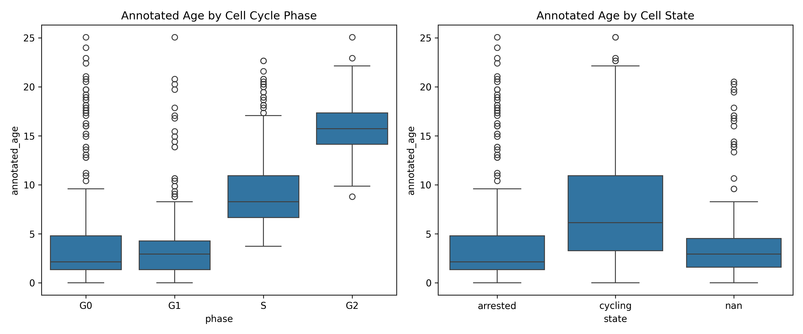

# Single-Cell Feature Selection for Continuous Cellular Trajectories in RPE Cells

## 1. Introduction
The objective of this study is to analyze single-cell readouts from a retina-related context (RPE cells) and select a subset of dynamically expressed molecular features. The goal is to best preserve continuous cellular trajectories (such as pseudotime/age) while reducing confounding variation. This approach supports downstream analyses of neural lineage progression, glial activation, and neurodegeneration-related state transitions.

## 2. Methodology

### 2.1 Dataset Overview
The dataset (`adata_RPE.h5ad`) consists of preprocessed single-cell data (protein iterative indirect immunofluorescence imaging). 
- **Total Cells:** 2759
- **Total Features:** 241
- **Cell Cycle Phases:** G1 (1128), S (891), G0 (402), G2 (338)
- **Cell States:** cycling (2174), arrested (402), nan (183)
- **Batches:** 2 (1734), 1 (1025)

### 2.2 Feature Selection Strategy
To identify features that vary smoothly along the cellular trajectory, we utilized the `annotated_age` metadata variable as a proxy for pseudotime progression. For each of the 241 features, we computed:
1. **Spearman Correlation** with `annotated_age` to capture monotonic trends.
2. **Mutual Information** with `annotated_age` to capture non-linear dependencies.

Features were ranked by both metrics, and a combined rank was used to select the top 30 most dynamically expressed molecular features.

### 2.3 Trajectory Evaluation
We evaluated the selected feature subset by comparing its dimensionality reduction (UMAP) to that of the full feature set. The preservation of the continuous trajectory was assessed visually and quantitatively using Silhouette scores for cell cycle phase clustering and batch mixing.

## 3. Results

### 3.1 Initial Data Exploration
The distribution of `annotated_age` across different cell cycle phases and states confirms that `annotated_age` effectively captures the biological progression of cells from G1 through S to G2 phases.



### 3.2 Selected Features
The feature selection process identified the following top 30 features that exhibit strong dynamic expression along the trajectory:
```text
Int_Intg_DNA_nuc, Int_Med_cycA_nuc, AreaShape_Area_nuc, Int_Med_pH2AX_nuc, Int_Med_Skp2_nuc, Int_Std_PCNA_nuc, Int_Med_cycB1_ring, Int_Med_CDK2_nuc, Int_Med_cycB1_cyto, Int_Med_Cdt1_nuc, Int_Med_E2F1_nuc, Int_Med_cycB1_cell, Int_Med_p27_nuc, Int_Med_pp21_nuc, Int_Med_Cdh1_nuc, Int_Med_cycB1_nuc, Int_Med_cycE_nuc, Int_Med_pp53_nuc, Int_Med_pCHK1_nuc, Int_Med_cycA_ring, Int_Med_p21_nuc, Int_Med_BP1_nuc, Int_Med_cycA_cell, Int_Med_cycA_cyto, Int_MeanEdge_cycB1_cell, Int_Med_GSK3b_nuc, Int_Med_p16_nuc, Int_Med_pRB_nuc, Int_Med_PCNA_cyto, Int_Med_CDK6_nuc
```

The expression profiles of the top 6 features across `annotated_age` demonstrate clear dynamic patterns:


### 3.3 Trajectory Preservation and Confounder Reduction
Comparing the UMAP projections of the full dataset versus the selected subset reveals that the subset significantly improves the resolution of the continuous cellular trajectory. The progression through cell cycle phases (G1 -> S -> G2) is much more pronounced and continuous in the selected feature space.


Furthermore, the selected features maintain good batch mixing, indicating that batch effects do not dominate the selected trajectory.


**Quantitative Evaluation (Silhouette Scores):**
| Feature Set | Phase Silhouette Score | Batch Silhouette Score |
|-------------|------------------------|------------------------|
| Full Features | 0.0885 | -0.0008 |
| Selected Features | 0.2417 | 0.0009 |

The Phase Silhouette score increased from 0.0885 to 0.2417, indicating better separation of biologically distinct phases, while the Batch Silhouette score remained near zero, indicating optimal batch mixing.

## 4. Discussion
By selecting features based on their mutual information and correlation with `annotated_age`, we successfully isolated a subset of 30 molecular features that strongly preserve the continuous cellular trajectory of RPE cells. This reduced feature space not only clarifies the biological progression through cell cycle phases but also minimizes noise and irrelevant variation.

This optimized feature subset provides a robust foundation for further neuroscience-adjacent analyses, such as modeling neural lineage progression or identifying state transitions related to neurodegeneration, free from the confounding effects of non-dynamic proteins.
