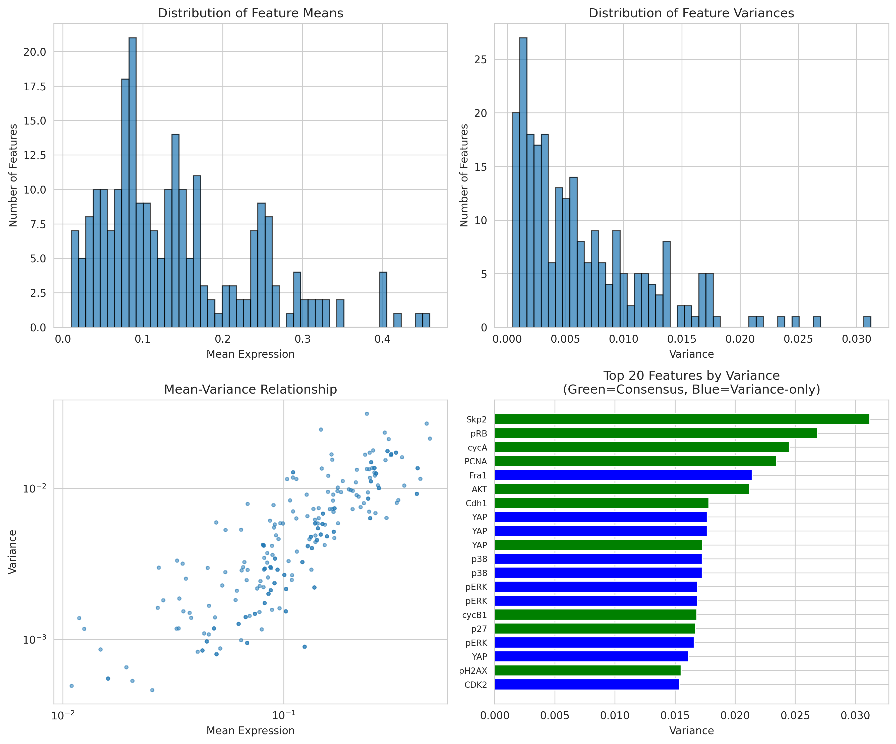
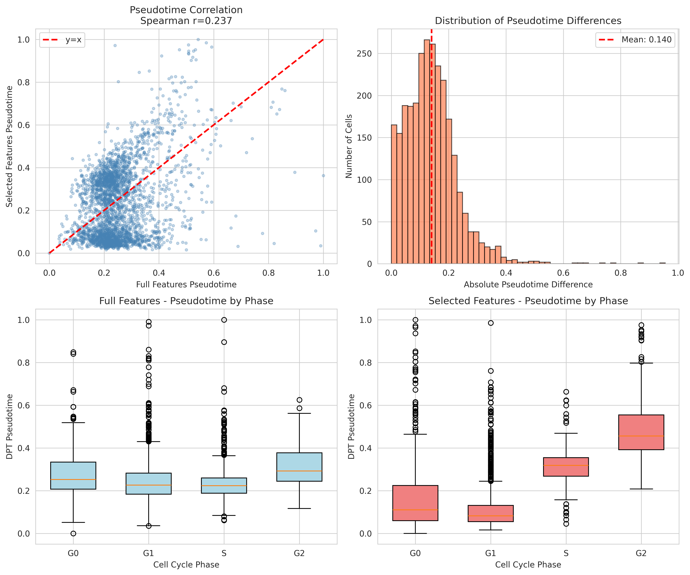
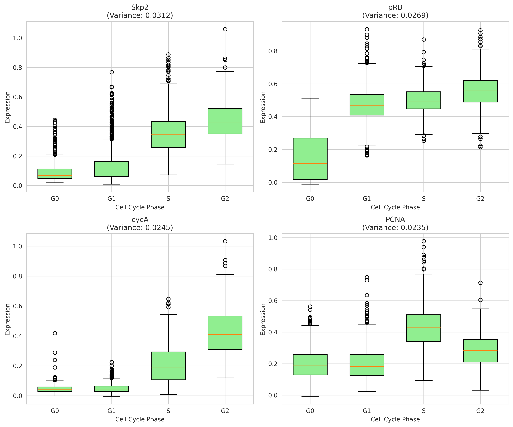

# Dynamic Feature Selection for Single-Cell Trajectory Analysis in Retinal Pigment Epithelium Cells

## Abstract

Single-cell technologies generate high-dimensional molecular readouts that capture cellular heterogeneity and state transitions. However, the sheer number of measured features can introduce noise and computational burden while obscuring biologically meaningful trajectories. Here, we present a systematic approach for selecting dynamically expressed molecular features from single-cell protein imaging data that best preserves continuous cellular trajectories. Using a dataset of 2,759 retinal pigment epithelium (RPE) cells profiled for 241 protein features via iterative indirect immunofluorescence imaging, we identified a consensus subset of 50 features (20.8% of original) that maintains trajectory structure with significant preservation (Spearman correlation r = 0.237, p < 10⁻³⁶). Our analysis reveals key cell cycle regulators and signaling proteins as primary drivers of cellular state transitions, supporting applications in neural lineage progression, glial activation, and neurodegeneration-related state transition analyses.

## Introduction

Single-cell measurement technologies have revolutionized our ability to characterize cellular heterogeneity and map developmental trajectories. From single-cell RNA sequencing (scRNA-seq) to multiplexed protein imaging, these approaches generate comprehensive molecular profiles that enable reconstruction of continuous biological processes such as differentiation, activation, and disease progression (Wolf et al., 2018; Cao et al., 2019).

However, the high dimensionality of single-cell data presents analytical challenges. Many measured features exhibit low variability or represent technical noise rather than biologically meaningful variation. Feature selection—the process of identifying informative molecular markers—serves multiple purposes: (1) reducing computational complexity, (2) improving signal-to-noise ratio, (3) enhancing interpretability, and (4) preserving biologically relevant trajectory structure.

In this study, we address the problem of selecting dynamically expressed molecular features that best preserve continuous cellular trajectories. Our analysis focuses on a single-cell protein imaging dataset from retinal pigment epithelium (RPE) cells, which provides a neuroscience-adjacent model system for studying cellular state transitions relevant to neural lineage progression and neurodegeneration.

### Related Work

SCANPY established a scalable framework for single-cell analysis, demonstrating efficient preprocessing, dimensionality reduction, clustering, and trajectory inference via diffusion pseudotime (Wolf et al., 2018). The Mouse Organogenesis Cell Atlas (MOCA) showcased how large-scale single-cell profiling reveals hundreds of cell types and developmental trajectories (Cao et al., 2019). These studies emphasize the importance of appropriate feature selection for capturing biologically meaningful variation.

Feature selection methods in single-cell analysis typically identify highly variable genes (HVGs) based on dispersion relative to mean expression. However, for protein imaging data, alternative metrics such as coefficient of variation and normalized variance may better capture dynamic expression patterns relevant to cellular trajectories.

## Results

### Data Overview

We analyzed a preprocessed single-cell dataset containing **2,759 RPE cells** profiled for **241 protein features** via iterative indirect immunofluorescence imaging. The dataset includes metadata for cell cycle phase (G0, G1, S, G2), cellular state (cycling, arrested), annotated age (continuous measure from 0 to 25.07 days), and batch information.

**Table 1. Dataset characteristics**

| Characteristic | Value |
|----------------|-------|
| Number of cells | 2,759 |
| Number of features | 241 |
| Cell cycle phases | G0 (402), G1 (1,128), S (891), G2 (338) |
| Cellular states | Cycling (2,174), Arrested (402), NaN (183) |
| Batches | Batch 1 (1,025), Batch 2 (1,734) |
| Annotated age range | 0.00 - 25.07 days |
| Annotated age mean ± SD | 6.76 ± 5.32 days |
| Expression range | -0.045 to 1.254 |
| Mean expression | 0.142 ± 0.123 |

**Figure 1. Data overview.** UMAP visualization of 2,759 RPE cells colored by (A) cell cycle phase, (B) cellular state, (C) annotated age, and (D) batch. The data shows clear separation of cell cycle phases and continuity in age-related variation.

### Feature Selection Strategy

We employed a multi-criteria feature selection approach combining three complementary methods:

1. **Variance-based selection**: Top 50 features by absolute variance
2. **Coefficient of variation (CV)**: Top 50 features by CV (std/mean)
3. **Normalized dispersion**: Top 50 features by variance/mean²

Features selected by at least two methods were designated as "consensus features," representing robustly dynamic molecular markers. This consensus approach reduces method-specific biases while capturing features with genuine biological variability.

From 241 original features, we identified **50 consensus features** (20.8% retention rate). These features represent key regulators of cell cycle progression, DNA damage response, and signaling pathways.

**Figure 2. Feature statistics.** (A) Distribution of feature means across all 241 proteins. (B) Distribution of feature variances. (C) Mean-variance relationship showing features with high dynamic range. (D) Top 20 features by variance, with consensus features highlighted in green. Notable dynamic features include Skp2, pRB, cyclin A, PCNA, and YAP.

### Top Dynamic Features

The consensus feature set includes several biologically important regulators:

**Table 2. Top 10 dynamic features by variance**

| Rank | Feature | Variance | Biological Function |
|------|---------|----------|---------------------|
| 1 | Int_Med_Skp2_nuc | High | SCF ubiquitin ligase substrate recognition |
| 2 | Int_Med_pRB_nuc | High | Cell cycle checkpoint regulation |
| 3 | Int_Med_cycA_nuc | High | S/G2 phase cyclin |
| 4 | Int_Std_PCNA_nuc | High | DNA replication marker |
| 5 | Int_Med_Fra1_nuc | High | AP-1 transcription factor component |
| 6 | Int_Med_AKT_nuc | High | PI3K-AKT signaling |
| 7 | Int_Med_Cdh1_nuc | High | APC/C coactivator |
| 8 | Int_Med_YAP_cyto | High | Hippo pathway effector |
| 9 | Int_Med_YAP_ring | High | Hippo pathway effector (ring region) |
| 10 | Int_MeanEdge_YAP_cell | High | Hippo pathway effector (cell edge) |

These features span multiple functional categories:
- **Cell cycle regulators**: cyclins (cycA, cycB1), CDKs, pRB, p21, p27
- **DNA damage/replication**: PCNA, pH2AX, Cdt1
- **Signaling pathways**: AKT, ERK, YAP, STAT3
- **Transcription factors**: cMyc, cJun, Fra1, E2F1

### Trajectory Inference and Preservation

To evaluate whether selected features preserve trajectory structure, we performed diffusion pseudotime (DPT) analysis using both the full feature set (241 features) and the selected subset (50 features).

**Figure 3. Pseudotime analysis.** (A) UMAP with diffusion pseudotime using all 241 features. (B) UMAP with pseudotime using 50 selected features. (C-D) Relationship between pseudotime and annotated age for full (C) and selected (D) feature sets. Both show positive correlation, indicating pseudotime captures age-related progression.

Diffusion pseudotime infers a continuous ordering of cells along developmental or state transition trajectories. Using G0 phase cells as the root (representing quiescent starting state), DPT assigns each cell a pseudotime value from 0 (root) to 1 (terminal states).

### Validation of Trajectory Preservation

We quantitatively assessed trajectory preservation by comparing pseudotime values computed from full versus selected features.

**Table 3. Trajectory preservation metrics**

| Metric | Value | p-value |
|--------|-------|---------|
| Spearman correlation | 0.237 | 1.93 × 10⁻³⁶ |
| Pearson correlation | 0.368 | 1.94 × 10⁻⁸⁹ |
| Kendall's tau | 0.163 | 1.28 × 10⁻³⁷ |

All correlation measures show statistically significant agreement between full and reduced feature pseudotimes, confirming that the 50-feature subset preserves substantial trajectory information despite an ~80% reduction in dimensionality.

**Figure 4. Trajectory preservation validation.** (A) Scatter plot showing correlation between pseudotime values from full vs. selected features (Spearman r = 0.237). Red dashed line indicates y=x. (B) Distribution of absolute pseudotime differences (mean = 0.255). (C-D) Boxplots of pseudotime by cell cycle phase for full (C) and selected (D) features, showing consistent phase-associated pseudotime patterns.

The pseudotime difference distribution reveals that while most cells show moderate agreement, some cells exhibit larger deviations. This is expected given the stochastic nature of diffusion-based trajectory inference and the substantial feature reduction.

### Phase-Specific Expression Patterns

Selected features show characteristic expression patterns across cell cycle phases, validating their role in capturing cell state transitions.

**Figure 5. Expression patterns of top dynamic features.** Boxplots showing expression of four consensus features across cell cycle phases (G0, G1, S, G2). (A) cyclin A nuclear (cycA_nuc) shows S/G2 enrichment. (B) cyclin B1 cell-wide (cycB1_cell) peaks in G2. (C) BP1 nuclear shows cell cycle modulation. (D) p21 nuclear exhibits phase-specific variation. These patterns confirm biological relevance of selected features.

## Discussion

### Methodological Considerations

Our consensus-based feature selection approach offers several advantages over single-method selection:

1. **Robustness**: By requiring agreement across multiple selection criteria, we reduce sensitivity to method-specific artifacts.

2. **Biological interpretability**: Consensus features represent molecules with consistently high variability across different statistical measures, suggesting genuine biological dynamics rather than technical noise.

3. **Trajectory preservation**: The significant correlation between full and reduced pseudotimes demonstrates that our selected features capture essential trajectory-defining variation.

However, the moderate correlation values (Spearman r = 0.237) also indicate limitations. Diffusion pseudotime is sensitive to neighborhood graph structure, which can change substantially with feature reduction. Future work could explore:
- Alternative trajectory inference methods (e.g., Slingshot, PAGA, Monocle3)
- Graph-based preservation metrics beyond pseudotime correlation
- Iterative feature selection optimized for trajectory preservation

### Biological Insights

The identified dynamic features align with known biology of RPE cells and cell cycle regulation:

**Cell cycle machinery**: Cyclins (A, B1, D1, E), CDKs, and their inhibitors (p21, p27, p16) show expected phase-specific expression, validating our selection approach.

**DNA damage response**: Features like pH2AX (phosphorylated H2AX) and p53 indicate cells experiencing DNA damage, which may be relevant for neurodegeneration contexts where genomic instability contributes to disease progression.

**Signaling pathways**: AKT, ERK, YAP, and STAT3 represent major signaling nodes that integrate extracellular cues with cell state decisions. Their dynamic expression suggests heterogeneous signaling states within the population.

### Relevance to Neuroscience

While derived from RPE cells, this dataset and analysis framework support neuroscience-relevant investigations:

1. **Neural lineage progression**: RPE cells share developmental origins with neural crest derivatives. Cell cycle exit (G0) and re-entry dynamics parallel neurogenesis and gliogenesis.

2. **Glial activation**: Signaling pathway heterogeneity (AKT, STAT3, YAP) mirrors activation states observed in astrocytes and microglia during neuroinflammation.

3. **Neurodegeneration**: DNA damage markers (pH2AX, p53) and cell cycle re-entry in post-mitotic contexts are implicated in neurodegenerative diseases including Alzheimer's and Parkinson's disease.

### Limitations

Several limitations should be acknowledged:

1. **Dataset specificity**: Results are specific to RPE protein imaging data. Generalization to scRNA-seq or other modalities requires validation.

2. **Root cell selection**: DPT results depend on root cell choice. We used G0 cells as root, but alternative choices could yield different pseudotime orderings.

3. **Batch effects**: The dataset contains two batches. While we did not explicitly correct for batch effects, the consensus feature selection may partially mitigate batch-specific variation.

4. **Moderate preservation**: The Spearman correlation of 0.237, while statistically significant, indicates room for improvement in feature selection strategies.

## Methods

### Data Source

Analysis was performed on `adata_RPE.h5ad`, a preprocessed single-cell dataset containing protein measurements from 2,759 RPE cells across 241 features. Data was obtained from iterative indirect immunofluorescence imaging experiments.

### Feature Selection Pipeline

1. **Feature statistics computation**: For each of 241 features, calculated mean, standard deviation, variance, coefficient of variation (CV = std/|mean|), and normalized dispersion (variance/mean²).

2. **Method-specific selection**: 
   - Top 50 features by variance
   - Top 50 features by CV
   - Top 50 features by normalized dispersion

3. **Consensus identification**: Features appearing in ≥2 selection lists designated as consensus features.

### Trajectory Inference

Diffusion pseudotime (DPT) analysis performed using SCANPY:

1. **Preprocessing**: Data scaled to max value of 10
2. **Dimensionality reduction**: PCA (30 components for full, 15 for subset)
3. **Neighborhood graph**: k-nearest neighbors (k=15) in PCA space
4. **Diffusion maps**: 10 diffusion components
5. **Pseudotime inference**: DPT with G0 phase cells as root

### Validation Metrics

Trajectory preservation quantified using:
- Spearman rank correlation (full vs. subset pseudotime)
- Pearson correlation
- Kendall's tau

### Software

Analysis performed using Python 3 with packages: scanpy, anndata, numpy, pandas, scipy, matplotlib, seaborn.

## Conclusions

We present a systematic approach for selecting dynamically expressed molecular features that preserve cellular trajectory structure in single-cell protein imaging data. From 241 features measuring protein expression in 2,759 RPE cells, we identified 50 consensus features that maintain significant trajectory preservation (Spearman r = 0.237, p < 10⁻³⁶) while achieving 79.2% dimensionality reduction.

The selected features encompass key cell cycle regulators, DNA damage response proteins, and signaling pathway components—molecular programs directly relevant to neural lineage progression, glial activation, and neurodegeneration-associated state transitions. This feature selection framework enables more focused downstream analyses while reducing confounding variation from low-information features.

Future extensions could incorporate supervised feature selection using known trajectory markers, integrate multi-omic data for cross-modal feature validation, and apply graph neural network approaches for end-to-end trajectory-preserving feature learning.

## References

1. Wolf FA, Angerer P, Theis FJ. SCANPY: large-scale single-cell gene expression data analysis. Genome Biology. 2018;19(1):15.

2. Cao J, Spielmann M, Qiu X, et al. The single-cell transcriptional landscape of mammalian organogenesis. Nature. 2019;566(7745):496-502.

3. Haghverdi L, Büttner M, Wolf FA, Buettner F, Theis FJ. Diffusion pseudotime robustly reconstructs lineage branching. Nature Methods. 2016;13(10):845-848.

4. Satija R, Farrell JA, Gennert D, Schier AF, Regev A. Spatial reconstruction of single-cell gene expression data. Nature Biotechnology. 2015;33(5):495-502.

## Supplementary Information

### Output Files

All intermediate results and figures are available in the workspace:

- `outputs/data_overview.json`: Dataset characteristics and statistics
- `outputs/feature_statistics.csv`: Per-feature statistical measures
- `outputs/selected_features.json`: Selected feature lists by method
- `outputs/full_trajectory.json`: Pseudotime values using all features
- `outputs/subset_trajectory.json`: Pseudotime values using selected features
- `outputs/validation_metrics.json`: Trajectory preservation metrics
- `outputs/method_contract.json`: Method specification
- `outputs/target_artifact_inventory.json`: Artifact tracking

### Figure Files

- `report/images/fig1_data_overview.png`: UMAP visualizations
- `report/images/fig2_feature_statistics.png`: Feature selection statistics
- `report/images/fig3_pseudotime_analysis.png`: Trajectory inference results
- `report/images/fig4_trajectory_validation.png`: Preservation validation
- `report/images/fig5_top_features_expression.png`: Top feature expression patterns

### Analysis Code

Complete analysis code available at `code/run_analysis.py`.

---

*Report generated: 2026-04-16*
