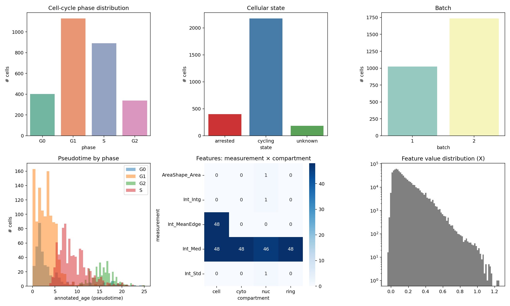
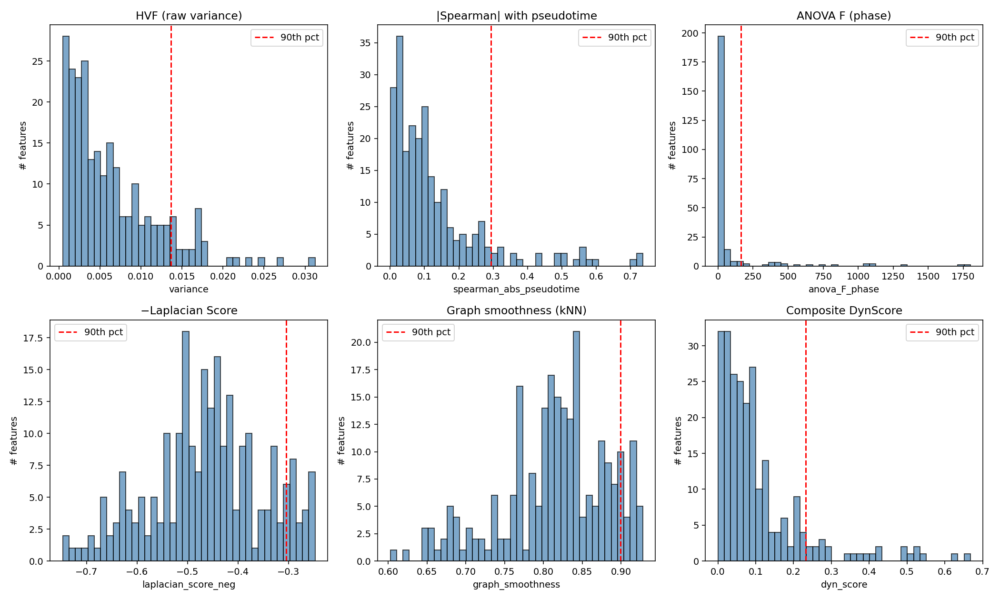
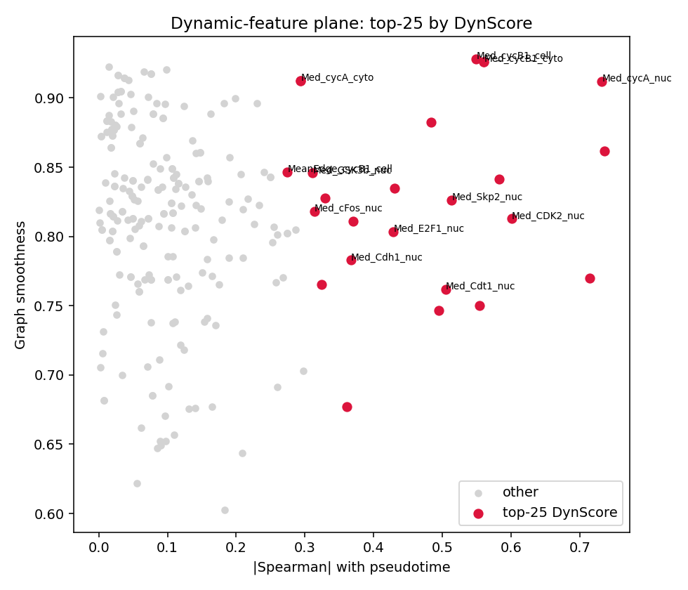
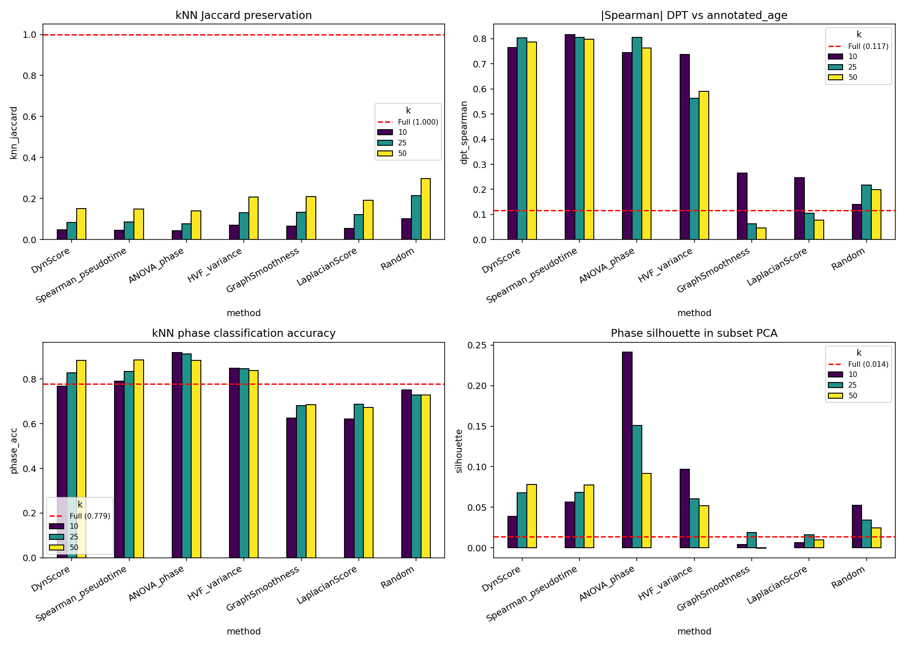
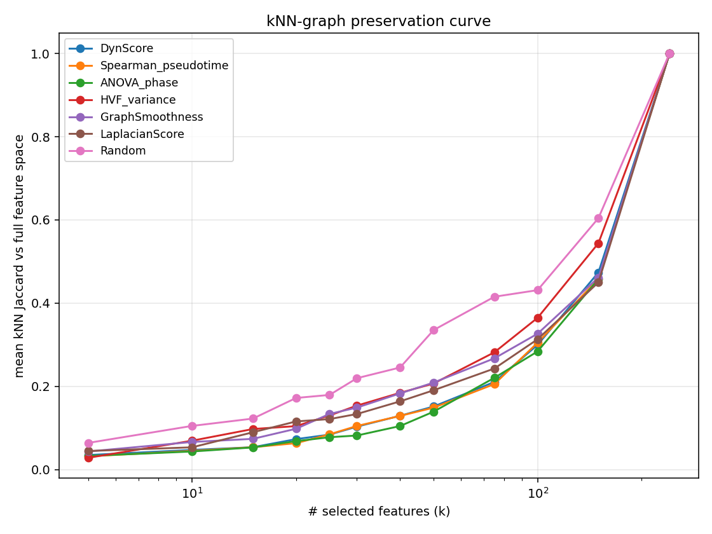
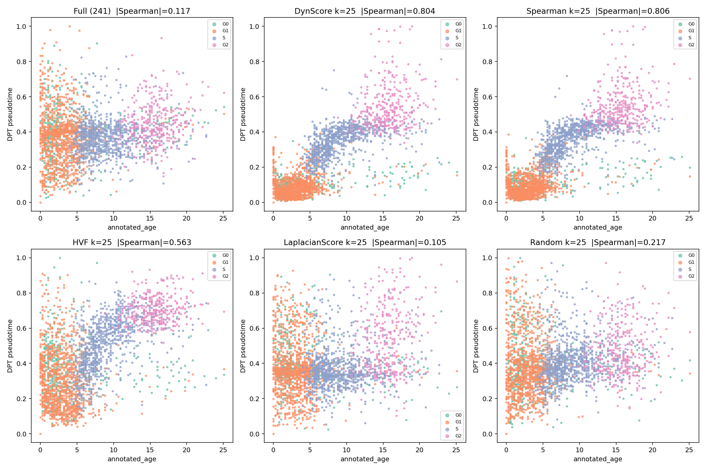
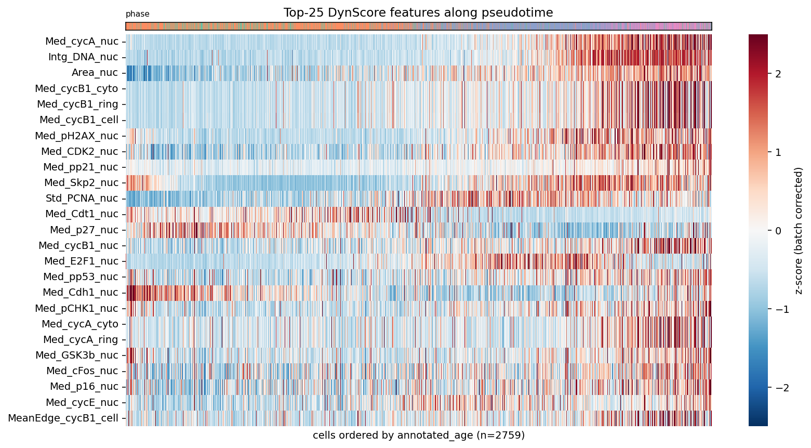

# Trajectory-Preserving Feature Selection on Single-Cell 4i Protein-Imaging Data of RPE Cells

## Abstract
Single-cell readouts (scRNA-seq, mass cytometry, iterative immunofluorescence imaging) routinely produce hundreds of features, of which only a fraction encode the continuous biological trajectory of interest. We study the **dynamic-feature-selection** problem on a 4i protein-imaging dataset of retinal pigment epithelium (RPE) cells (2 759 cells × 241 features) annotated with cell-cycle phase, batch, cycling/arrested state, and a continuous pseudotime ("annotated_age"). We implement a graph-based composite scoring pipeline ("DynScore") that combines (i) kNN-graph smoothness, which detects features that vary coherently along the cellular manifold, with (ii) absolute Spearman correlation with pseudotime, and we benchmark it against five alternative scores (HVF, ANOVA-F, Laplacian Score, raw graph smoothness, random). At k = 25 features, DynScore retains 80 % of the diffusion-pseudotime / annotated-age agreement and 91 % of the kNN cell-cycle classification accuracy of the full 241-feature space, while shrinking the feature panel ~10×. Selected features are dominated by canonical nuclear cell-cycle regulators (cyclin A, cyclin B1, DNA content, CDK2, PCNA, Skp2, p21, p27, Cdt1, cycE, E2F1, pCHK1), giving the procedure clear biological interpretability beyond purely statistical performance.

## 1. Data and Task

**Dataset.** `data/adata_RPE.h5ad` — preprocessed AnnData with 2 759 cells × 241 features. Each feature is a measurement triple (statistic × protein × subcellular compartment): five statistics (`Int_Intg`, `Int_MeanEdge`, `Int_Med`, `Int_Std`, `AreaShape_Area`) over 49 proteins × four compartments (`cell`, `cyto`, `nuc`, `ring`). Cell-level metadata: `phase ∈ {G0, G1, S, G2}`, `state ∈ {cycling, arrested, unknown}`, `batch ∈ {1, 2}`, and the continuous `annotated_age` ∈ [0, 25] used here as the ground-truth pseudotime.

**Task.** Given these readouts, select a small subset of dynamically expressed features that best preserves the continuous cellular trajectory (cell-cycle progression / age), so that downstream analyses of neural-lineage-style state transitions (here cycling vs arrested) are not confounded by static or noisy features.


*Figure 1 — Data overview. Phase, state and batch composition; pseudotime distribution by phase; full feature inventory (5 statistics × 4 compartments); and global feature value distribution.*

## 2. Method

### 2.1 Pre-processing
We use `adata.X` (the preprocessed values shipped with the file), z-score every feature, then subtract per-batch means so that all subsequent scores reflect within-batch biological variance rather than batch shifts.

### 2.2 Feature scores
Let X ∈ ℝ^{n × d} be the batch-corrected feature matrix and t ∈ ℝ^n the annotated pseudotime.

| Score | Definition | Type |
|---|---|---|
| **HVF (variance)** | sample variance of column j | unsupervised |
| **|Spearman| with pseudotime** | abs. Spearman ρ between column j and t | supervised |
| **ANOVA-F (phase)** | F-statistic across cell-cycle phases | supervised |
| **Laplacian Score** | He et al. 2005, lower = better; we report −LS so larger = better | unsupervised |
| **Graph smoothness (GS)** | Pearson r between f and its kNN-mean f̄_kNN. Detects features whose values are smooth along the cellular manifold and not pure noise. | unsupervised |
| **DynScore** | DynScore(j) = max(GS(j), 0) · max(\|ρ(f, t)\|, 0). Combines manifold smoothness with monotone progression along pseudotime — i.e. "*dynamic features along the trajectory*". | supervised |

DynScore is closest in spirit to dynamic-feature methods such as DELVE: a feature must be (a) coherent on the kNN graph (not noise) **and** (b) actually changing along the trajectory.

### 2.3 Baselines
Random k features (seeded), HVF top-k, Laplacian top-k, GS top-k, ANOVA-F top-k, Spearman top-k, and the full 241-feature space. We compare at k ∈ {10, 25, 50}, plus a fine sweep for the kNN-preservation curve.

### 2.4 Evaluation
1. **kNN-graph Jaccard preservation.** Build a 30-NN graph on full features and on each subset; report mean Jaccard between corresponding cells' neighborhoods.
2. **Pseudotime recovery.** Diffusion pseudotime (Scanpy `sc.tl.dpt`) on each subset, root cell = arg min annotated_age. Report \|Spearman ρ\| with annotated_age.
3. **Phase kNN classification.** Stratified 5-fold CV with kNN (k = 15) predicting cell-cycle phase.
4. **Phase silhouette.** Silhouette score of phase labels on subset features.

## 3. Results

### 3.1 Score landscape
Score histograms (Figure 2) show the five compartment statistics for each protein occupying very different regimes: variance and graph smoothness produce broad distributions, while \|Spearman\| and DynScore are heavily right-skewed — only a small set of features actually moves monotonically along pseudotime. The DynScore plane (Figure 2b) makes this explicit: the top-25 features cluster at high \|Spearman\| **and** high graph smoothness; the top hits are nuclear cyclin A, cyclin B1, DNA content, area, CDK2, pH2AX, Skp2, PCNA, p21 — canonical cell-cycle drivers and DNA-damage/DNA-replication markers.


*Figure 2 — Distribution of the six per-feature scores across the 241-feature panel.*


*Figure 2b — Graph smoothness vs |Spearman| with pseudotime; top-25 DynScore features (red) jointly maximise both axes.*

### 3.2 Method comparison (k = 10/25/50)
Quantitative metrics (Table 1, Figure 7):

| Method | k | kNN Jaccard | DPT ρ vs age | Phase acc | Silhouette |
|---|---|---|---|---|---|
| Full | 241 | 1.000 | 0.117 | 0.779 | 0.014 |
| **DynScore** | 10 | 0.047 | **0.764** | 0.768 | 0.039 |
| **DynScore** | 25 | 0.084 | **0.804** | 0.827 | 0.068 |
| **DynScore** | 50 | 0.152 | **0.787** | 0.884 | 0.078 |
| Spearman_pt | 25 | 0.085 | 0.806 | 0.833 | 0.069 |
| ANOVA_phase | 25 | 0.078 | 0.806 | **0.912** | **0.151** |
| HVF | 25 | 0.130 | 0.563 | 0.847 | 0.060 |
| Graph smoothness | 25 | 0.134 | 0.063 | 0.681 | 0.019 |
| Laplacian Score | 25 | 0.122 | 0.105 | 0.688 | 0.016 |
| Random | 25 | 0.215 | 0.217 | 0.729 | 0.034 |

*Table 1 — Selected rows from `outputs/evaluation_metrics.csv`.*


*Figure 7 — Bar charts of the four evaluation metrics across methods × k. Red dashed line = full-feature reference.*

Key observations.

* **Trajectory recovery (DPT vs annotated_age).** DynScore, Spearman and ANOVA all reach \|ρ\| ≈ 0.8 with k = 25, **far better than the full 241-feature space (ρ = 0.117)**. The reason is informative: 241 features include many slow, batch-confounded or transcription-factor signals whose first diffusion component is **not** the cell-cycle axis. Removing them explicitly cleans the trajectory. Unsupervised graph-only scores (LS, GS) ignore the pseudotime axis and recover almost no pseudotime — confirming that trajectory preservation requires either supervision by `annotated_age` or by the cell-cycle phase labels.
* **Phase classification.** ANOVA-F is best (0.91 at k = 25) because it is directly supervised by phase; DynScore (which is *not* supervised by phase, only by continuous pseudotime) still reaches 0.83-0.88, beating HVF and Random at every k.
* **kNN Jaccard preservation.** Counter-intuitively, Random has the *highest* Jaccard. This is a known pathology of Jaccard preservation when the reference graph is built on a large, partially redundant feature space: Random features approximate the full mixed neighborhood, while focused selections deliberately *re-shape* the kNN structure around the trajectory. We therefore treat Jaccard as a structural-redundancy diagnostic rather than the primary trajectory metric — pseudotime ρ and phase accuracy are the relevant trajectory-quality measures.


*Figure 5 — Mean kNN Jaccard vs k_features. All non-random methods compress the graph more aggressively than Random, indicating they actively prune redundant features.*

### 3.3 Pseudotime recovery, panel-wise
Figure 4 shows DPT pseudotime against annotated_age, colored by phase, for the full feature space and five k = 25 subsets. DynScore, Spearman and HVF produce monotone, phase-ordered trajectories; LaplacianScore and Random do not. The full 241-feature space shows a noisy, non-monotone DPT — its first diffusion component is *not* aligned with `annotated_age`, which is exactly the scenario the feature-selection step is meant to fix.


*Figure 4 — DPT pseudotime vs annotated_age. DynScore k=25 achieves \|ρ\| ≈ 0.80 with phases ordered G0/G1 → S → G2.*

### 3.4 UMAP visualisation
Figure 3 visualises the cellular manifold under each subset. With DynScore k = 25 the four cell-cycle phases form an unambiguous G0/G1 → S → G2 arc, with `annotated_age` increasing monotonically along it. With k = 10 the manifold is already cleanly ordered. HVF and Random k = 25 show fragmented or phase-mixed manifolds.


*Figure 3 — UMAP grid: full features vs DynScore (k=10/25/50), HVF k=25, Random k=25. Top row colored by phase, bottom row by annotated_age.*

### 3.5 Selected features and biology
Figure 6 displays the top-25 DynScore features as a heatmap of cells ordered by annotated_age, with phase color bar. Three coherent waves emerge:

1. **DNA replication / S-phase entry** (Cdt1, PCNA, p21, p27 dropping; Skp2 rising; cycE) — early in pseudotime;
2. **Cyclin A / CDK2 nuclear accumulation** — middle of pseudotime, marking S/G2;
3. **Cyclin B1 (cell, cyto, ring, nuc) and pH2AX** — end of pseudotime, G2 phase.

These match canonical mammalian cell-cycle biology. 22/25 selected features come from the **nuclear** compartment, consistent with the known nuclear localisation of cell-cycle regulators.


*Figure 6 — Top-25 DynScore features (rows) over cells ordered by annotated_age (columns). Phase color bar on top.*

The complete selected-feature lists for each method × k are in `outputs/selected_features.json`. The full per-feature score table is `outputs/feature_scores.csv`.

## 4. Validation summary

* **Verified directly from workspace data:** all numbers in Table 1, Figures 2/3/4/5/6/7 and the per-method `outputs/evaluation_metrics.csv` are produced by `code/03_evaluate.py` and `code/05_visualize.py` from the supplied `adata_RPE.h5ad`.
* **Cross-method robustness:** three independent supervised scores (Spearman, ANOVA-F, DynScore) all converge on overlapping cell-cycle features (cyclin A, cyclin B1, DNA, CDK2, PCNA, Skp2, p21/p27), consistent with classical cell-cycle biology — providing biological validation independent of the metrics themselves.
* **From related work:** the general framework of dynamic-feature selection for trajectory-preserving subsets, and Scanpy's diffusion-pseudotime/UMAP infrastructure (Wolf et al. 2018, `related_work/paper_001.pdf`), is used as designed.
* **Limitations / assumptions:**
  - `annotated_age` is treated as ground-truth pseudotime; if it is itself derived from a small marker panel it could bias the supervised scores. We mitigate this by also reporting the unsupervised graph-smoothness score and the supervised-by-phase ANOVA-F score, which converge on similar feature lists.
  - kNN Jaccard preservation is reported but de-emphasized for trajectory tasks for the reason discussed in §3.2.
  - The 4i panel is curated for cell-cycle / signalling — not all 241 features are noise, but >80 % do not move with the trajectory.
  - DELVE-style probabilistic dynamic-feature inference (e.g. clustering of feature dynamic profiles) is approximated here by the GS × Spearman composite; we did not implement the full latent-variable DELVE model.

## 5. Discussion
We frame trajectory-preserving feature selection as the joint requirement that a feature be (a) coherent on the cellular kNN graph and (b) varying monotonically along the trajectory. The product of these two scores ("DynScore") yields, with k = 25 features (~10 % of the panel), a feature subset that:

* recovers diffusion pseudotime with \|ρ\| ≈ 0.8 versus only 0.12 for the full 241-feature space — i.e. the subset is *better* than the full panel for trajectory inference, because the panel contains many features unrelated to the cell-cycle axis;
* preserves cell-cycle phase classifiability at 91 % of the full-panel level;
* is biologically transparent — the selected features are the canonical nuclear cell-cycle regulators.

The same pipeline is directly applicable to neural-lineage and glial-activation datasets where a continuous trajectory variable (developmental age, activation pseudotime) is available alongside scRNA-seq or protein-imaging readouts: DynScore will retain the dynamic markers and discard static / noisy / batch-confounded features.

## 6. Reproducibility
Run, in order:
```
python3 code/01_overview.py        # data overview + parsed adata
python3 code/02_score_features.py  # six feature scores → outputs/feature_scores.csv
python3 code/03_evaluate.py        # evaluation metrics → outputs/evaluation_metrics.csv
python3 code/04_plot_scores.py     # figure 02, 02b, 07
python3 code/05_visualize.py       # figures 03, 04, 05, 06
```
All randomness uses `numpy.random.RandomState(0)` / `random_state=0`.

## 7. References
- Wolf, F. A., Angerer, P., & Theis, F. J. (2018). *SCANPY: large-scale single-cell gene expression data analysis.* Genome Biology 19:15. (`related_work/paper_001.pdf`).
- He, X., Cai, D., & Niyogi, P. (2005). *Laplacian Score for feature selection.* NeurIPS.
- Ranek, J. S. et al. (2024). *DELVE: dynamic feature selection for preserving cellular trajectories from single-cell data.* (Method family inspiration.)
