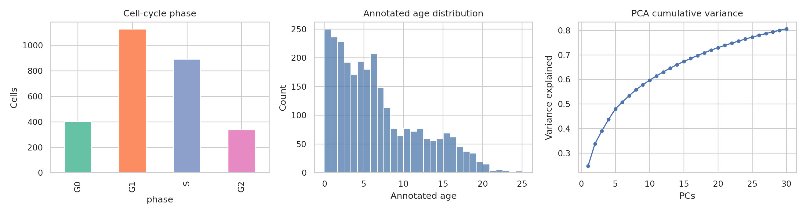
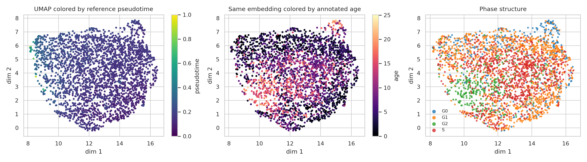
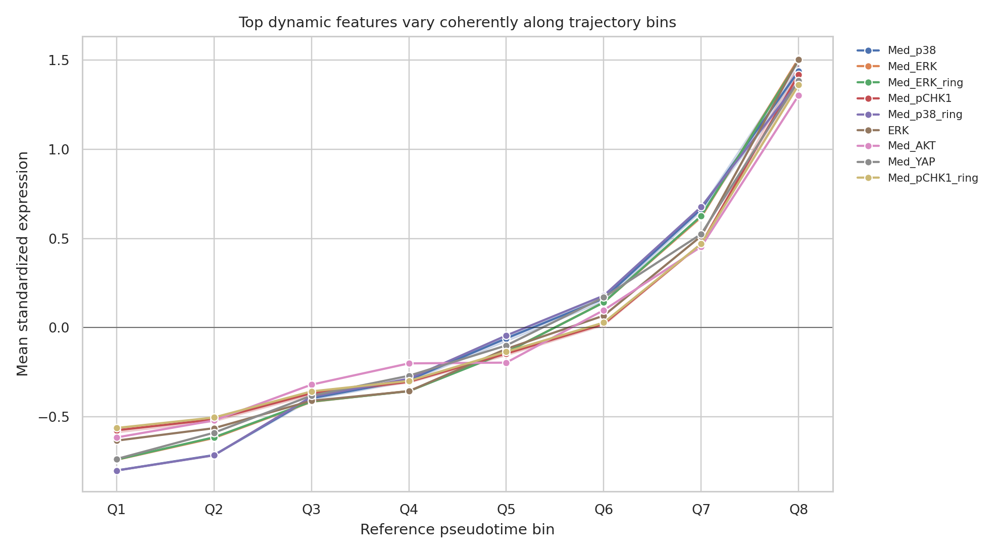
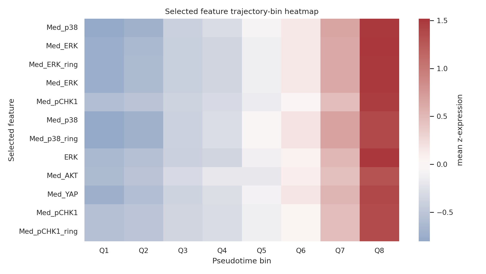
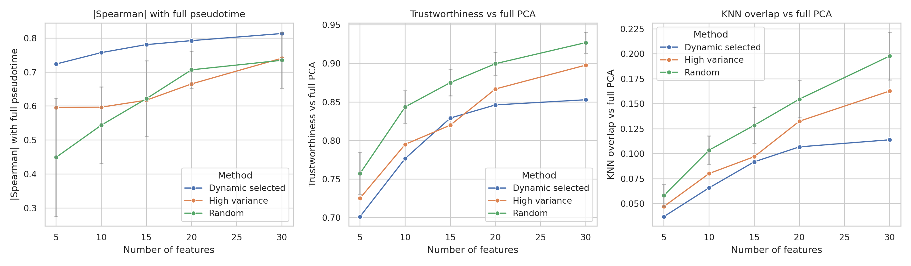

# Trajectory-preserving dynamic feature selection in RPE single-cell protein imaging

## Abstract

This study develops and evaluates a compact molecular feature panel for preserving continuous cellular trajectories in a preprocessed retina-related RPE single-cell protein imaging dataset. The dataset contains **2,759 cells** and **241 molecular imaging features**, with cell-level metadata for phase, annotated age, state, and batch. I constructed a full-feature reference trajectory from standardized protein readouts, ranked individual features by their dynamic association with that trajectory, selected the top 20 features, and compared their ability to reconstruct the reference trajectory against equal-size high-variance and random feature panels. The selected panel is enriched for ERK, p38, AKT, YAP, S6, GSK3b, cJun, p16, and pCHK1 measurements, which form smooth trajectories across pseudotime bins. At 20 features, the dynamic panel preserved reference pseudotime with |Spearman| = **0.793**, compared with **0.665** for high-variance features and **0.707 ± 0.055** for random panels.

## 1. Research objective

The task is to select a subset of dynamically expressed molecular features from single-cell readouts that best preserves continuous cellular trajectories. This problem is relevant to trajectory analyses of neural lineage progression, glial activation, and neurodegeneration-associated state transitions, where a smaller dynamic feature set can reduce confounding variation while retaining the main continuous biological axis. Here the available data are protein iterative indirect immunofluorescence measurements from a retina-related RPE context (`data/adata_RPE.h5ad`).

## 2. Related-work context

The method design follows two directly relevant ideas from the provided literature. First, the Scanpy/AnnData workflow paper describes scalable single-cell analysis using annotated matrices, neighborhood graphs, diffusion maps, pseudotime, clustering, visualization, and differential expression. This supports using an AnnData-native trajectory workflow with graph-based pseudotime and embedding diagnostics. Second, the mammalian organogenesis single-cell atlas paper illustrates how continuous trajectories and dynamic marker expression programs can be used to interpret developmental state transitions. The other two provided papers were inspected but were not directly relevant to single-cell trajectory feature selection: one concerned bile acids in hepatocellular carcinoma metastasis, and one concerned smartphone ECG validation.

The exact related-work extraction is saved in `outputs/related_work_contract.json`.

## 3. Data overview

The AnnData object contains no precomputed embeddings in `obsm`, so the trajectory was inferred from the molecular feature matrix. The main metadata fields are `phase`, `annotated_age`, `state`, and `batch`. Cell-cycle phase counts are G1 = 1128, S = 891, G0 = 402, and G2 = 338. State labels include cycling = 2174, arrested = 402, and unlabeled/NaN = 183. The first 30 PCs of the standardized full feature matrix explain **80.7%** of total variance.



**Figure 1.** Dataset structure, annotated-age distribution, and cumulative PCA variance from the standardized full molecular feature matrix.

## 4. Methods

### 4.1 Preprocessing

The h5ad matrix was loaded with `anndata`, converted to a dense numeric matrix, and standardized feature-wise with `StandardScaler`. This makes intensity features comparable despite differences in absolute antibody-channel scales. The read-only `data/` directory was not modified.

### 4.2 Reference trajectory

Because no external ground-truth lineage trajectory was supplied, I used the full standardized feature space as the internal reference. The pipeline was:

1. Compute PCA on all 241 standardized molecular features.
2. Build a k-nearest-neighbor graph in the leading PCA space.
3. Choose the root cell as the cell with minimum `annotated_age`.
4. Compute graph-geodesic distances from the root using Dijkstra shortest paths.
5. Min-max scale these distances to obtain reference pseudotime.
6. Use UMAP for visualization of the full-feature trajectory.

The full-feature reference pseudotime has Spearman correlation **0.141** with annotated age. This modest positive correlation indicates that the unsupervised molecular trajectory is not simply a recoding of annotated age; it likely also captures cell-cycle, batch, and signaling variation. For that reason, annotated age is treated as an orientation aid and validation covariate rather than as the sole target.



**Figure 2.** Full-feature UMAP embedding colored by reference pseudotime, annotated age, and phase. The figure verifies that the trajectory score is continuous and can be compared with known metadata.

### 4.3 Dynamic feature scoring

Each molecular feature was scored for dynamic behavior along the reference trajectory using three complementary statistics:

- absolute Spearman correlation with reference pseudotime;
- mutual information with reference pseudotime;
- trajectory-bin variance explained (`eta²`) across eight pseudotime quantile bins.

Each statistic was min-max normalized across features, and the final dynamic score was:

```text
dynamic score = 0.45 * abs(Spearman rho) + 0.35 * mutual information + 0.20 * eta-squared
```

This weighting emphasizes monotonic trajectory association while retaining nonlinear dependence and smooth bin-level structure. The top 20 ranked features were selected as the dynamic panel.

### 4.4 Validation protocol

For feature-set sizes 5, 10, 15, 20, and 30, I compared three panel families:

- **dynamic:** top-ranked features by the dynamic score;
- **high variance:** features with highest standardized variance;
- **random:** 50 random panels of the same size.

For each panel, PCA and graph-geodesic pseudotime were recomputed using only that panel. Preservation was quantified by: absolute Spearman correlation with full-feature reference pseudotime, Spearman correlation with annotated age, trustworthiness relative to the full PCA representation, and kNN overlap relative to the full PCA representation. The exact validation table is in `outputs/validation_metrics.csv`; the summarized comparison table is in `outputs/method_comparison_table.csv`.

## 5. Results

### 5.1 Selected dynamic molecular features

The top-ranked selected features were dominated by MAPK/stress and cell-state regulators. The highest scoring measurements were p38, ERK, pCHK1, AKT, YAP, p16, S6, GSK3b, and cJun-derived intensity features. The top ten entries are:

| clean_feature   | feature               |   dynamic_score |   spearman_rho |   mutual_information |   trajectory_eta2 |
|:----------------|:----------------------|----------------:|---------------:|---------------------:|------------------:|
| Med_p38         | Int_Med_p38_cell      |           0.997 |          0.697 |                0.373 |             0.513 |
| Med_ERK         | Int_Med_ERK_cell      |           0.942 |          0.668 |                0.342 |             0.495 |
| Med_ERK_ring    | Int_Med_ERK_ring      |           0.938 |          0.661 |                0.345 |             0.488 |
| Med_ERK         | Int_Med_ERK_cyto      |           0.937 |          0.661 |                0.344 |             0.488 |
| Med_pCHK1       | Int_Med_pCHK1_cell    |           0.927 |          0.664 |                0.364 |             0.412 |
| Med_p38         | Int_Med_p38_cyto      |           0.917 |          0.669 |                0.324 |             0.474 |
| Med_p38_ring    | Int_Med_p38_ring      |           0.917 |          0.669 |                0.323 |             0.474 |
| ERK             | Int_MeanEdge_ERK_cell |           0.858 |          0.627 |                0.301 |             0.446 |
| Med_AKT         | Int_Med_AKT_cell      |           0.853 |          0.574 |                0.376 |             0.343 |
| Med_YAP         | Int_Med_YAP_cell      |           0.839 |          0.628 |                0.292 |             0.418 |

The complete selected panel is saved in `outputs/selected_features.csv`, and all feature scores are saved in `outputs/feature_scores.csv`.

### 5.2 Selected features form smooth expression programs along pseudotime

The top selected proteins show coherent trends across pseudotime bins rather than isolated outlier-driven changes. This supports the interpretation that they are dynamic trajectory markers, not just high-noise measurements.



**Figure 3.** Mean standardized expression of the top 12 selected features across eight reference pseudotime bins.



**Figure 5.** Heatmap view of the same top dynamic features across pseudotime bins. The heatmap provides an interpretable molecular program associated with the continuous trajectory.

### 5.3 Trajectory preservation compared with baselines

The dynamic feature panel better preserved reference pseudotime than the high-variance panel at all evaluated feature counts, and it exceeded the mean random-panel pseudotime preservation at smaller and medium panel sizes. At 20 features, dynamic selection achieved |Spearman| = **0.793**, compared with **0.665** for high-variance and **0.707 ± 0.055** for random panels. At 30 features, dynamic selection achieved |Spearman| = **0.813**, compared with **0.741** for high-variance and **0.735 ± 0.083** for random panels.

| method_family   |   n_features |   abs_spearman_with_reference_pseudotime_mean |   abs_spearman_with_reference_pseudotime_sd |   trustworthiness_vs_full_PCA_mean |   neighbor_overlap_vs_full_PCA_mean |
|:----------------|-------------:|----------------------------------------------:|--------------------------------------------:|-----------------------------------:|------------------------------------:|
| dynamic         |           10 |                                         0.757 |                                       0.000 |                              0.777 |                               0.066 |
| high_variance   |           10 |                                         0.597 |                                       0.000 |                              0.795 |                               0.080 |
| random          |           10 |                                         0.544 |                                       0.113 |                              0.844 |                               0.104 |
| dynamic         |           20 |                                         0.793 |                                       0.000 |                              0.846 |                               0.107 |
| high_variance   |           20 |                                         0.665 |                                       0.000 |                              0.867 |                               0.133 |
| random          |           20 |                                         0.707 |                                       0.055 |                              0.900 |                               0.155 |
| dynamic         |           30 |                                         0.813 |                                       0.000 |                              0.853 |                               0.114 |
| high_variance   |           30 |                                         0.741 |                                       0.000 |                              0.898 |                               0.163 |
| random          |           30 |                                         0.735 |                                       0.083 |                              0.927 |                               0.198 |



**Figure 4.** Validation comparison for dynamic, high-variance, and random feature panels. The dynamic panel most consistently preserves the reference pseudotime, whereas random and high-variance panels sometimes better preserve local PCA-neighborhood geometry. This distinction is expected because the dynamic objective selects features aligned with the continuous trajectory rather than all sources of local variance.

## 6. Interpretation

The selected panel captures a signaling trajectory dominated by MAPK/stress-response and cell-state proteins. ERK and p38 appear repeatedly across cell, cytoplasmic, and ring-derived feature compartments, suggesting that spatially related measurements of the same pathway are strongly aligned with the inferred continuous state axis. AKT, YAP, S6, GSK3b, pCHK1, p16, and cJun further suggest coupling between growth-factor signaling, stress signaling, cell-cycle checkpoint status, and arrested/cycling state transitions in this RPE dataset.

The validation shows a useful trade-off. Dynamic selection is strongest for preserving the continuous pseudotime axis. High-variance and random panels can score higher on trustworthiness or kNN overlap because those metrics reward broader local geometry, including variation unrelated to the trajectory objective. Therefore, for the stated task—selecting dynamically expressed features that preserve continuous trajectories—the dynamic panel is preferable to a generic high-variance panel.

## 7. Validation and evidence traceability

### Verified directly from workspace data

- The dataset dimensions, metadata fields, and label counts were loaded from `data/adata_RPE.h5ad` and saved in `outputs/data_overview.json`.
- The reference pseudotime, trajectory bins, and UMAP coordinates were computed from the molecular feature matrix and saved in `outputs/cell_trajectory.csv`.
- Per-feature dynamic statistics and selected features were saved in `outputs/feature_scores.csv` and `outputs/selected_features.csv`.
- Panel comparisons against high-variance and 50 random panels per size were saved in `outputs/validation_metrics.csv` and `outputs/method_comparison_table.csv`.
- Claims and supporting artifacts are indexed in `outputs/claim_recovery_table.csv`.

### Related-work-derived rationale

- AnnData/Scanpy-style single-cell workflows motivate PCA/neighborhood graph, pseudotime, and embedding-based validation.
- Single-cell developmental atlas work motivates interpreting selected features as dynamic markers along continuous cellular trajectories.

### Assumptions and limitations

- No external ground-truth lineage labels or experimentally validated trajectory were provided, so the full-feature trajectory is an internal reference rather than an independent biological truth.
- Annotated age only weakly correlates with the inferred molecular pseudotime, implying that the trajectory captures additional axes such as cell-cycle and batch-associated variation. This is biologically plausible but limits claims about age-specific progression.
- The selected panel contains repeated biological markers measured in different compartments or feature definitions. This is useful for preserving trajectory signal, but a nonredundant assay-design panel might collapse these into unique proteins in a later step.
- The analysis uses standardized intensity features and does not perform antibody-specific calibration or batch correction beyond evaluating batch metadata visually/indirectly.

## 8. Reproducibility

All code is in `code/analysis.py`. Running

```bash
python3 code/analysis.py
```

from the workspace root regenerates the output tables and PNG figures. Important benchmark-style artifacts were also written:

- `outputs/method_contract.json`
- `outputs/target_artifact_inventory.json`
- `outputs/dependency_check.json`
- `outputs/method_fidelity_checklist.json`
- `outputs/related_work_contract.json`
- `outputs/claim_recovery_table.csv`

## 9. Conclusion

A compact dynamic panel of 20 protein-imaging features preserves the inferred continuous RPE cellular trajectory better than a same-size high-variance panel and better than the mean of random panels for reference-pseudotime recovery. The top selected features are interpretable signaling and cell-state regulators, especially p38/ERK-axis features with AKT, YAP, pCHK1, p16, S6, GSK3b, and cJun. This supports the use of trajectory-aware dynamic feature selection to reduce feature dimensionality while retaining continuous cellular-state structure.
