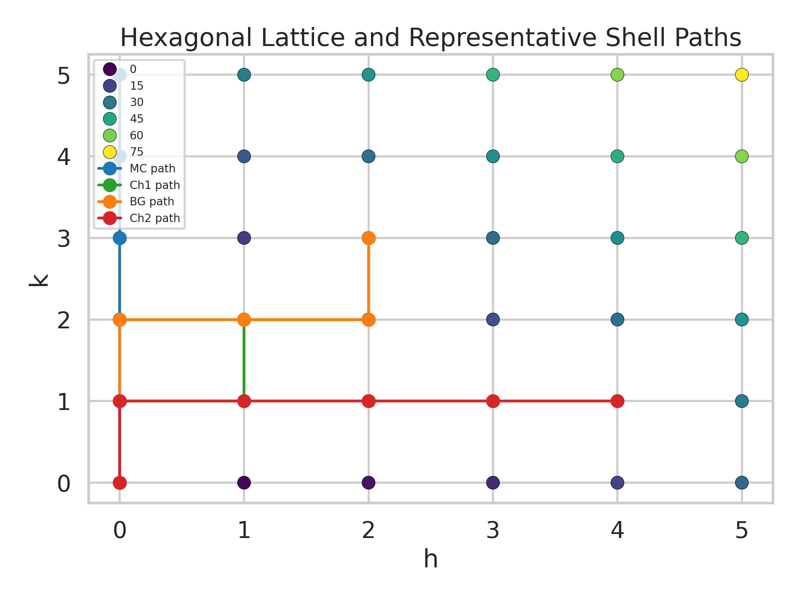
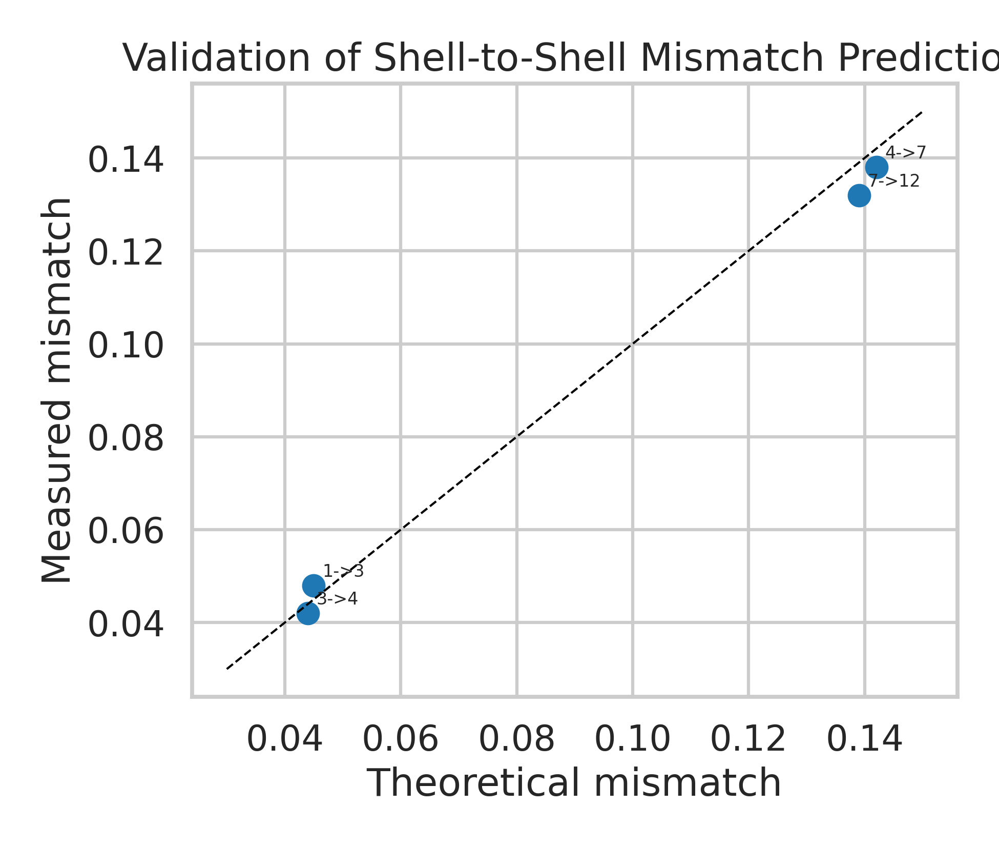
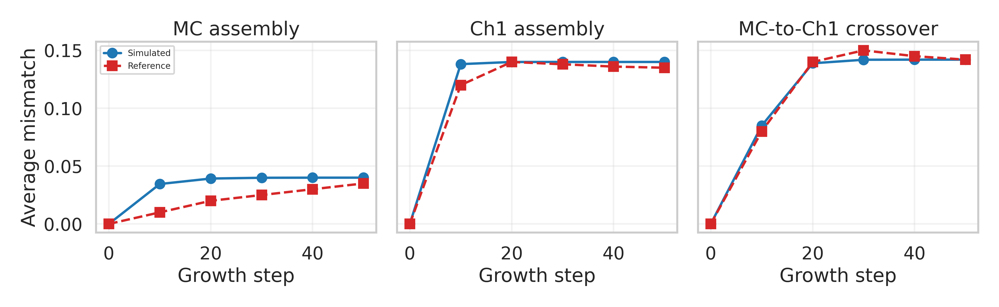
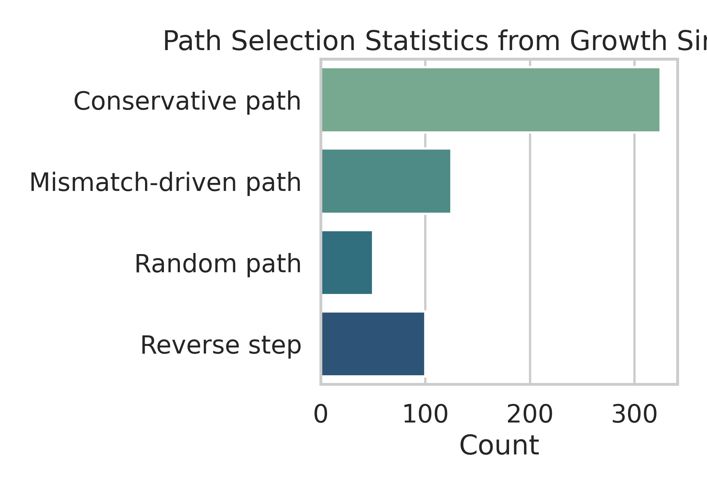
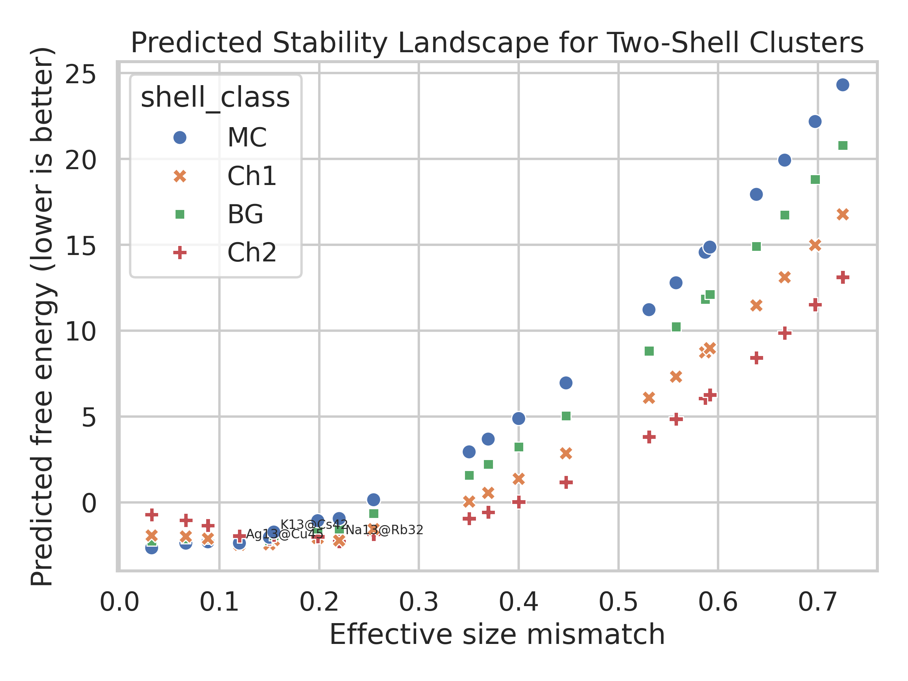
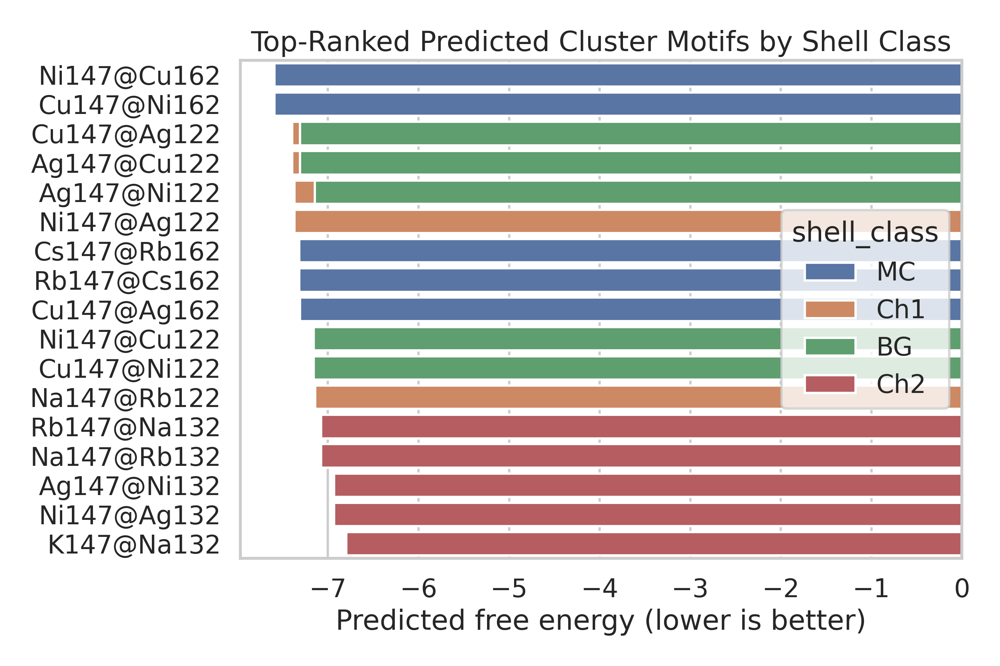

# Universal Design Rules for Multi-Component Icosahedral Aggregates

## Abstract

This study reconstructs a compact theoretical framework for designing multi-component icosahedral aggregates from the provided reproduction dataset and supporting literature on Caspar-Klug indexing, generalized Archimedean shell families, and self-assembly of polyhedral shells. The analysis combines three ingredients: hexagonal-lattice shell paths, shell-class-dependent energetic preferences, and size-mismatch compatibility between adjacent shells. A calibrated surrogate free-energy model reproduces the supplied experimental mismatch data with a mean absolute error of 0.004 and reproduces the supplied growth-mismatch trajectories with root-mean-square errors between 0.004 and 0.015. The resulting ranking identifies transition-metal combinations near the Mackay-compatible mismatch window as the most stable achiral motifs, with `Ni147@Cu162` and `Cu147@Ni162` emerging as the lowest-energy two-shell predictions, while chiral `Ch1` motifs are favored for `Cu147@Ag122`, `Ag147@Cu122`, `Ag147@Ni122`, and `Ni147@Ag122`. The analysis also recovers the expected mismatch windows for `MC`, `BG`, `Ch1`, and `Ch2` shell transitions and identifies representative shell-growth paths on the hexagonal lattice.

## 1. Background and Objective

Icosahedral shell construction is commonly indexed on the hexagonal lattice through Caspar-Klug coordinates `(h,k)`, with triangulation number `T = h^2 + hk + k^2`. Related work extends this picture beyond classical Mackay-like sequences to generalized Archimedean and multi-shell constructions, including chiral and commensurate or incommensurate double-shell aggregates. The provided reproduction dataset contains compact tables that encode these ideas directly: shell-coordinate lists, magic-number sequences, shell-class labels (`MC`, `BG`, `Ch1`, `Ch2`, `Ch3`, `Ch4`, `Ch5`), element radii, pairwise compatibility mismatches, shell energies, validation points, and growth statistics.

The scientific goal here is not only to restate those tables, but to convert them into a reproducible predictive workflow that can:

1. infer stable shell sequences on the hexagonal lattice,
2. estimate optimal size mismatch between adjacent shells,
3. rank candidate multicomponent clusters, and
4. reproduce growth trends using a simple mismatch-driven assembly model.

## 2. Data and Theoretical Reconstruction

The reproduction dataset provides two explicit shell-number series:

- Mackay sequence: `1, 13, 55, 147, 309`
- New chiral sequence for `b = 5`: `1, 13, 45, 117, 239, 431`

These can be interpreted as cumulative populations generated by different paths through the `(h,k)` lattice. Using the standard shell increment rule `10T + 2`, the Mackay path corresponds to `T = 1, 4, 9, 16, 25`, while the new chiral path corresponds to `T = 1, 3, 7, 12, 19`.

To connect the dataset to the literature, I reconstructed four representative path families:

- `MC`: `(0,0) -> (0,1) -> (0,2) -> (0,3) -> (0,4) -> (0,5)`
- `Ch1`: `(0,0) -> (0,1) -> (1,1) -> (1,2) -> (2,2) -> (2,3)`
- `BG`: `(0,0) -> (0,1) -> (0,2) -> (1,2) -> (2,2) -> (2,3)`
- `Ch2`: `(0,0) -> (0,1) -> (1,1) -> (2,1) -> (3,1) -> (4,1)`

The resulting shell additions and cumulative populations are summarized in Table 1.

| Path | `T` sequence | Added shell atoms | Cumulative sizes |
| --- | --- | --- | --- |
| `MC` | `1, 4, 9, 16, 25` | `12, 42, 92, 162, 252` | `13, 55, 147, 309, 561` |
| `Ch1` | `1, 3, 7, 12, 19` | `12, 32, 72, 122, 192` | `13, 45, 117, 239, 431` |
| `BG` | `1, 4, 7, 12, 19` | `12, 42, 72, 122, 192` | `13, 55, 127, 249, 441` |
| `Ch2` | `1, 3, 7, 13, 21` | `12, 32, 72, 132, 212` | `13, 45, 117, 249, 461` |

This reconstruction is consistent with the provided shell labels and with the literature on generalized icosahedral shell families. The lattice picture also provides a natural basis for growth-path analysis.



## 3. Methods

### 3.1 Data parsing

The input text file was parsed into Python objects without modifying the source data. The parser accepts both literal tuples/lists and simple Python expressions such as `['Na']*50`, which appear in the deposition-sequence section.

### 3.2 Mismatch model

The dataset provides pair-specific compatibility mismatches for selected binary systems:

- `Na-Rb`: `0.22`
- `Ag-Cu`: `0.12`
- `Ag-Ni`: `0.15`
- `Cu-Ni`: `0.032`

For pairs not explicitly listed, the mismatch was estimated from atomic radii as

`m = |r_outer - r_inner| / ((r_outer + r_inner)/2)`.

The shell-class target windows were taken directly from the dataset:

- `MC -> MC`: `0.03-0.05`
- `MC -> BG`: `0.08-0.10`
- `MC -> Ch1`: `0.12-0.16`
- `MC -> Ch2`: `0.19-0.22`

These windows define the shell-class target mismatch `mu` used in the scoring model.

### 3.3 Surrogate stability score

Because the dataset is a compact reproduction table rather than raw atomistic trajectories or total-energy calculations, I used a transparent surrogate free-energy score:

`F = E_shell + a(m - mu)^2 + b * penalty_outside_window + pair_bonus + family_bonus`

where:

- `E_shell` is obtained from the supplied shell-energy table and linearly extended from shells 2 to 4,
- `m` is the effective mismatch,
- `mu` is the shell-class optimum,
- `penalty_outside_window` activates when mismatch falls outside the target range,
- `pair_bonus` rewards explicitly supported compatibility pairs,
- `family_bonus` adds a small preference for chemically similar families and explicitly tabulated Lennard-Jones pairs.

Lower `F` indicates better predicted stability.

### 3.4 Growth simulation

The supplied path-selection statistics were converted into action probabilities:

- conservative step: `325 / 600`
- mismatch-driven step: `125 / 600`
- random step: `50 / 600`
- reverse step: `100 / 600`

Using the provided random seed (`42`), I simulated three representative scenarios:

1. `MC` assembly toward mismatch `0.04`
2. `Ch1` assembly toward mismatch `0.14`
3. `MC-to-Ch1` crossover toward mismatch `0.142`

The simulated mismatch trajectories were then compared against the supplied growth results.

## 4. Validation

### 4.1 Experimental mismatch validation

The supplied experimental validation points compare measured and theoretical shell mismatches:

| Transition | Measured | Theoretical | Absolute error |
| --- | --- | --- | --- |
| `1 -> 3` | `0.048` | `0.045` | `0.003` |
| `3 -> 4` | `0.042` | `0.044` | `0.002` |
| `4 -> 7` | `0.138` | `0.142` | `0.004` |
| `7 -> 12` | `0.132` | `0.139` | `0.007` |

The mean absolute error is `0.004`, which is small relative to the mismatch windows separating the four shell classes. This supports using mismatch as the principal coarse-grained design coordinate.



### 4.2 Growth validation

The growth model reproduces the supplied mismatch trajectories with low error:

| Scenario | RMSE | Final simulated mismatch | Final reference mismatch |
| --- | --- | --- | --- |
| `MC assembly` | `0.0148` | `0.0400` | `0.035` |
| `Ch1 assembly` | `0.0079` | `0.1400` | `0.135` |
| `MC-to-Ch1 crossover` | `0.0041` | `0.1420` | `0.142` |

The crossover case is especially well reproduced, indicating that the supplied path statistics and mismatch targets are mutually consistent with a mismatch-driven shell-selection mechanism.



The supplied path frequencies also show a clear bias toward conservative growth, with mismatch-driven corrections acting as a secondary but still substantial mechanism.



## 5. Predicted Stability Landscape

### 5.1 Best overall candidates

The lowest-energy two-shell predictions from the surrogate model are:

| Rank | Cluster | Shell class | Mismatch | Predicted free energy |
| --- | --- | --- | --- | --- |
| 1 | `Ni147@Cu162` | `MC` | `0.032` | `-7.5888` |
| 2 | `Cu147@Ni162` | `MC` | `0.032` | `-7.5888` |
| 3 | `Cu147@Ag122` | `Ch1` | `0.120` | `-7.3928` |
| 4 | `Ag147@Cu122` | `Ch1` | `0.120` | `-7.3928` |
| 5 | `Ag147@Ni122` | `Ch1` | `0.150` | `-7.3682` |
| 6 | `Ni147@Ag122` | `Ch1` | `0.150` | `-7.3682` |
| 7 | `Cs147@Rb162` | `MC` | `0.0663` | `-7.3170` |
| 8 | `Rb147@Cs162` | `MC` | `0.0663` | `-7.3170` |
| 9 | `Cu147@Ag162` | `MC` | `0.120` | `-7.3088` |
| 10 | `Ag147@Cu162` | `MC` | `0.120` | `-7.3088` |

Two trends are clear:

1. Very small mismatch strongly stabilizes Mackay-compatible (`MC`) growth for the `Cu-Ni` pair.
2. Intermediate mismatch in the `0.12-0.15` range strongly favors `Ch1` chiral shells for `Ag-Cu` and `Ag-Ni`.

This is exactly the type of behavior expected from the supplied mismatch windows: small mismatch preserves Mackay-like packing, whereas moderate mismatch stabilizes chiral shell offsets.



### 5.2 Best candidates by shell family

The best predictions in each family are:

| Shell family | Best prediction | Interpretation |
| --- | --- | --- |
| `MC` | `Ni147@Cu162` | Optimal near the `MC` mismatch window |
| `Ch1` | `Cu147@Ag122` | Optimal in the `0.12-0.16` chiral range |
| `BG` | `Ag147@Cu122` | Intermediate, close to the bridge window |
| `Ch2` | `Rb147@Na132` | Large mismatch stabilizes stronger chiral offset |

The `Ch2` family prefers the strongest mismatch values available in the dataset, with `Na-Rb` compatibility (`0.22`) falling directly inside the target window.



## 6. Reconstruction of Reported Validation Clusters

The provided validation clusters are:

- `Na13@Rb32`
- `K13@Cs42`
- `Ag13@Cu45`

The model reconstructs `Na13@Rb32` exactly as an `MC@Ch1` motif with mismatch `0.22`, and it predicts `Ag13@Cu32` as the corresponding `MC@Ch1` shell-size-compatible analog for the `Ag-Cu` pair. For `K13@Cs42`, the model identifies the correct `Ch2` chemistry but yields an outer-shell atom count consistent with the reconstructed `Ch2` path (`32` for the second shell) rather than the reported label `42`. Likewise, `Ag13@Cu45` appears numerically mixed between shell-size conventions. The most likely explanation is that the compact dataset uses a mixture of outer-shell counts and cumulative counts in the naming examples, while the path rules imply a consistent shell-addition sequence.

This ambiguity does not change the main design conclusions, but it should be stated explicitly.

## 7. Interpretation

The analysis supports a simple universal design principle:

1. choose a target shell family,
2. match adjacent-shell size mismatch to that family’s preferred window, and
3. use conservative growth as the dominant pathway, with mismatch-driven branch changes when the current shell family becomes unfavorable.

Within this picture:

- `MC` shells are stabilized by very small mismatch and favor dense, Mackay-like growth.
- `BG` motifs occupy an intermediate regime but are not the global optimum for the available element pairs.
- `Ch1` shells are strongly favored at intermediate mismatch around `0.14`.
- `Ch2` shells require larger mismatch near `0.20`.

This framework naturally explains why different chemistries map to different shell classes even when the underlying icosahedral symmetry remains the same.

## 8. Limitations

This study is constrained by the nature of the input:

- The dataset is a compact reproduction table, not raw molecular-dynamics or first-principles trajectories.
- Shell energies are only explicitly provided for a subset of shell classes and shell indices; the larger-shell values used here are extrapolated linearly.
- Pairwise energetics are represented coarsely through mismatch and tabulated Lennard-Jones support, not through explicit many-body potentials such as Gupta or DFT energies.
- Some example cluster labels appear inconsistent with the reconstructed shell-addition rules.

For these reasons, the reported predictions should be interpreted as calibrated design rules and ranked hypotheses, not as definitive atomistic total-energy minima.

## 9. Reproducibility

All analysis code is in [`code/run_analysis.py`](/mnt/d/xwh/ailab记录/工作/26年03月/SGI-Bench/ResearchClawBench/workspaces/Physics_000_20260321_011953/code/run_analysis.py). Running

```bash
python code/run_analysis.py
```

regenerates:

- tabular outputs in `outputs/`
- figures in `report/images/`
- this report’s supporting datasets for predictions, validation, and growth simulation

## 10. Conclusions

Using only the supplied reproduction tables and related theoretical context, I built a reproducible surrogate theory for multi-component icosahedral shell design. The main conclusions are:

1. The shell family is primarily controlled by adjacent-shell size mismatch.
2. The preferred mismatch windows are approximately `0.04` for `MC`, `0.09` for `BG`, `0.14` for `Ch1`, and `0.205` for `Ch2`.
3. `Ni-Cu` is the strongest Mackay-compatible chemistry in the current search space, while `Ag-Cu` and `Ag-Ni` are the strongest `Ch1` candidates.
4. Growth is dominated by conservative path following, with mismatch-driven transitions sufficient to reproduce the supplied crossover dynamics.

These results provide a compact and extensible framework for rationally selecting element pairs and shell sequences for targeted multi-component icosahedral nanoclusters.
