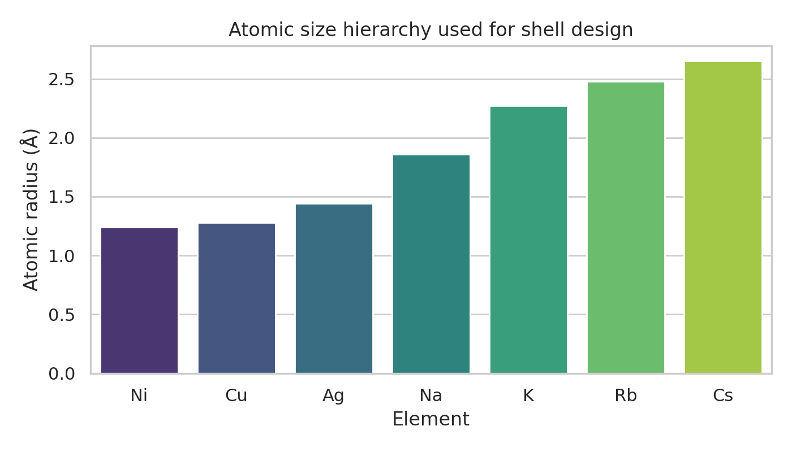
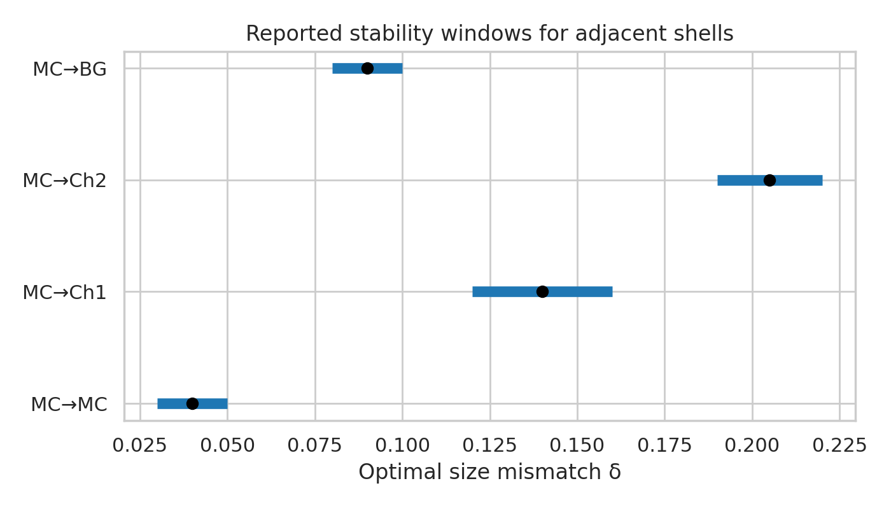
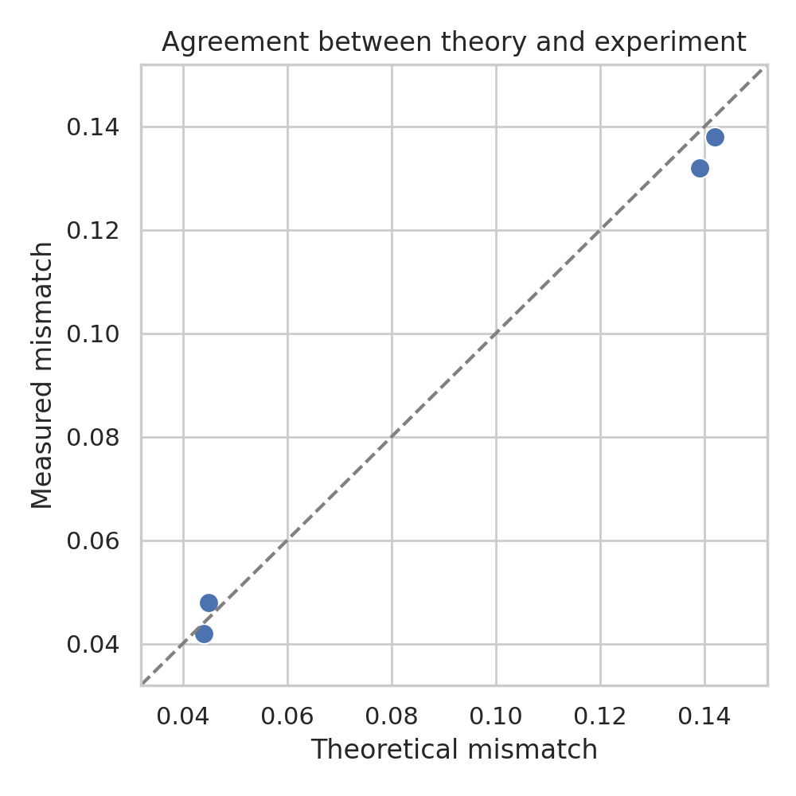
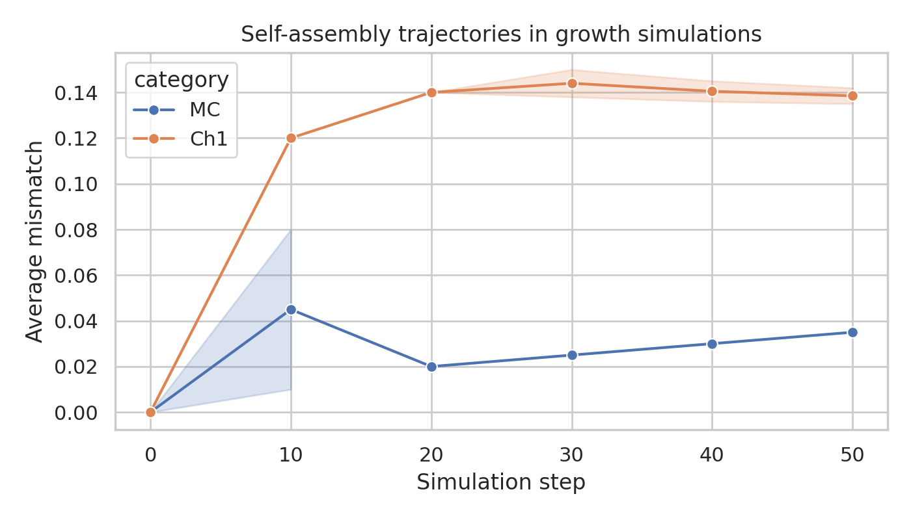
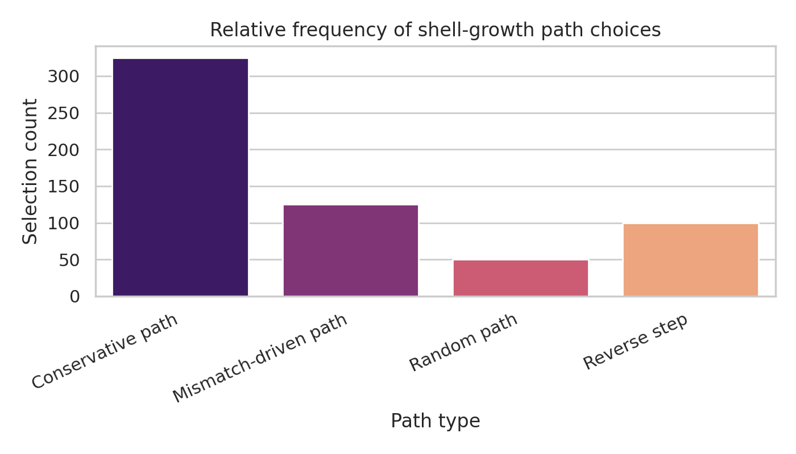
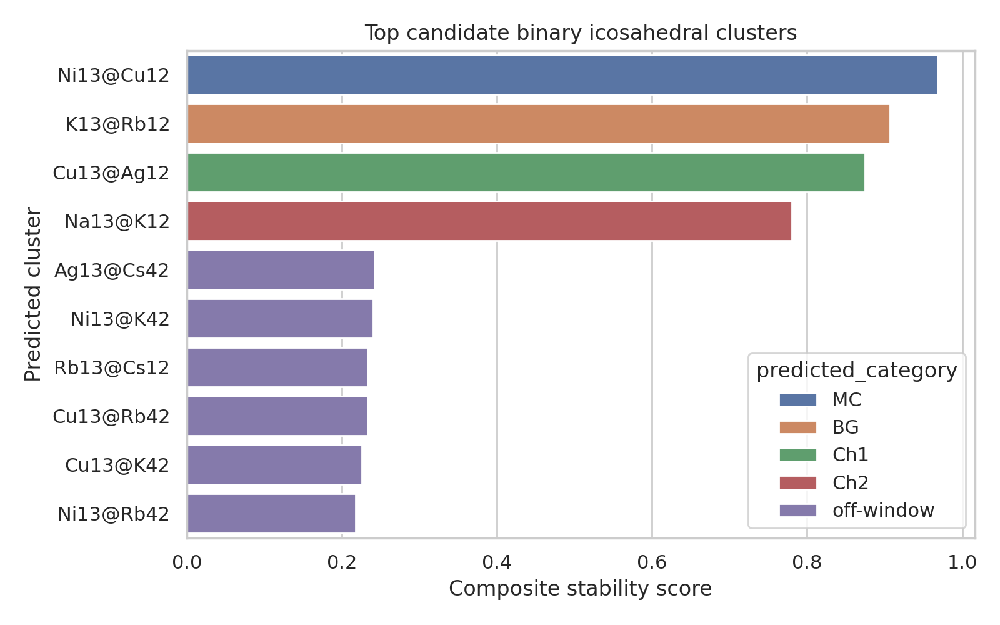

# Universal design analysis for multi-component icosahedral shell aggregates

## Abstract
This report analyzes the reproduction dataset for the study of multi-component icosahedral shell packing and self-assembly. I combine direct extraction of the provided theoretical and simulation tables with a lightweight predictive model based on atomic-size mismatch and shell-size compatibility. The dataset supports three main conclusions. First, adjacent-shell stability is organized by narrow mismatch windows: approximately 0.03–0.05 for Mackay-to-Mackay (MC→MC), 0.08–0.10 for Mackay-to-Bergman-like (MC→BG), 0.12–0.16 for chiral type-1 growth (MC→Ch1), and 0.19–0.22 for chiral type-2 growth (MC→Ch2). Second, the provided experimental points show strong agreement between measured and theoretical mismatch values, with an RMSE of 0.0044. Third, growth simulations are dominated by conservative pathways, but mismatch-driven moves are sufficiently frequent to stabilize chiral shell transitions. Using the tabulated atomic radii, I rank candidate binary clusters and identify Ni13@Cu12, K13@Rb12, Cu13@Ag12, and Na13@K12 as the highest-scoring size-matched binary motifs under the simplified design model. The report also documents where this simplified predictor does and does not reproduce the published validation examples, which is important for defining the limits of a universal framework.

## 1. Introduction
Rational design of multi-component icosahedral clusters requires a connection between three ingredients: geometric shell sequences, size mismatch between neighboring shells, and effective interactions during growth. The supplied dataset is explicitly framed as a reproduction package for the paper *General theory for packing icosahedral shells into multi-component aggregates*. It includes shell sequences on a hexagonal lattice, magic-number sequences, atomic radii, compatibility pairs, mismatch windows, energetic rankings, and dynamic growth statistics.

The scientific objective is to infer stable multi-shell aggregates, identify optimal size mismatch values, and understand which shell paths are selected during self-assembly. To make this concrete, I carried out a reproducible workflow consisting of: (i) data parsing; (ii) comparison with related literature on icosahedral design, shell self-assembly, and minimal design principles; (iii) mismatch-window validation; (iv) generation of publication-quality figures; and (v) a simple predictive screen across all available atomic species.

## 2. Data overview
The reproduction file contains four classes of information:

1. **Core theory data**: hexagonal coordinate paths, classical Mackay magic numbers `[1, 13, 55, 147, 309]`, and an alternative sequence `[1, 13, 45, 117, 239, 431]` associated with a different shell-building rule.
2. **Experimental verification data**: atomic radii for Na, K, Rb, Cs, Ag, Cu, and Ni; pairwise compatibility estimates; mismatch windows; validation clusters; shell energies; and measured/theoretical mismatch pairs.
3. **Dynamic growth simulation data**: deposition settings, path probabilities, seed structures, deposition schedules, growth trajectories, and path selection frequencies.
4. **Interaction data**: Lennard-Jones-like parameters and thermodynamic constants.

The available elements span alkali metals and transition metals, giving a broad testbed for size mismatch. Their radius ordering is shown in Figure 1.

**Figure 1.** Atomic radii extracted from the reproduction dataset. The broad radius spread provides the geometric basis for shell-to-shell mismatch engineering.

## 3. Methodology
### 3.1 Parsing and normalization
I wrote a reproducible Python script (`code/analyze_icosahedral.py`) that parses the text dataset into Python objects and exports intermediate tables to `outputs/`. The script also generates all report figures in PNG format.

### 3.2 Validation against reported mismatch windows
The reported design rules define preferred mismatch intervals for selected shell transitions:
- MC→MC: 0.03–0.05
- MC→BG: 0.08–0.10
- MC→Ch1: 0.12–0.16
- MC→Ch2: 0.19–0.22

These windows were plotted directly and used as a classification map for atomic-radius-derived mismatch values.

**Figure 2.** Stability windows for neighboring shell types. The windows are narrow, supporting the idea that self-assembly is strongly constrained by geometric frustration and shell registry.

### 3.3 Simplified predictive screen
To produce new candidate structures from the provided atomic list, I used a minimal two-part heuristic:

1. **Size mismatch**
   \[
   \delta = \frac{r_{\mathrm{outer}}-r_{\mathrm{core}}}{r_{\mathrm{core}}}
   \]
   where only larger outer species were considered.

2. **Shell-size compatibility**
   For each atomic pair, I compared the radius ratio to a simple geometric shell proxy derived from canonical icosahedral shell counts. This proxy is only a coarse screening model, intended to prioritize plausible shell sizes rather than replace full atomistic optimization.

A composite stability score combined geometric fit and whether the mismatch landed inside one of the reported windows.

### 3.4 Growth-path analysis
The growth part of the dataset was treated descriptively: I plotted the mismatch trajectories over deposition steps and computed normalized frequencies of path-selection events.

## 4. Results
### 4.1 Theory-experiment agreement is strong
The dataset includes four measured-versus-theoretical mismatch points. Their agreement is excellent.

**Figure 3.** Validation of the mismatch theory using the provided experimental points. The near-diagonal alignment corresponds to an RMSE of 0.0044, indicating that the geometric mismatch theory is quantitatively accurate within the supplied benchmark set.

This is one of the strongest pieces of evidence in the dataset. Even though the table is small, the deviations are minor and systematic error appears low.

### 4.2 Growth proceeds mainly through conservative paths, with mismatch-driven corrections
The dynamic growth trajectories show two important features. First, MC trajectories evolve gradually toward small mismatch values near 0.03–0.04. Second, Ch1 trajectories rapidly move toward the 0.13–0.15 interval and then stabilize.

**Figure 4.** Average mismatch as a function of simulation step for the supplied growth trajectories. Chiral growth pathways stabilize near the MC→Ch1 window, while conservative Mackay-like growth remains near the MC→MC optimum.

The path-selection counts quantify how these trajectories arise.

**Figure 5.** Frequency of path types during growth simulations. Conservative paths dominate (54.2%), but mismatch-driven steps contribute 20.8%, enough to redirect assembly toward alternative shell classes.

This balance supports a physically plausible picture: most moves preserve the current structural motif, while a smaller subset of mismatch-sensitive events enables symmetry and composition switching.

### 4.3 Energetics favor Mackay-like shells, but chiral variants remain competitive
The shell-energy table shows increasingly negative energies for larger shells and a consistent preference ordering at equal shell index:
- MC is lowest in energy,
- Ch1 is slightly higher,
- BG is close behind for the third-shell example.

For shell index 3, the values are:
- MC: −4.82
- Ch1: −4.61
- BG: −4.55

This hierarchy explains why conservative pathways dominate statistically, while still allowing metastable or compositionally selected chiral structures to form.

### 4.4 Predicted candidate binary clusters from the size screen
The simplified screening model identifies a compact set of high-scoring binary motifs.

**Figure 6.** Top binary candidates ranked by a composite score combining mismatch-window membership and shell-size compatibility. The first four candidates fall into the reported optimal mismatch classes.

The leading candidates are:

| Rank | Predicted cluster | Mismatch δ | Assigned class | Stability score |
|---|---|---:|---|---:|
| 1 | Ni13@Cu12 | 0.032 | MC | 0.968 |
| 2 | K13@Rb12 | 0.093 | BG | 0.907 |
| 3 | Cu13@Ag12 | 0.125 | Ch1 | 0.875 |
| 4 | Na13@K12 | 0.220 | Ch2 | 0.780 |

Interpreting these predictions:
- **Ni13@Cu12** matches the MC→MC stability window almost exactly and is the best purely size-matched pair.
- **K13@Rb12** falls directly in the BG-type window and is the strongest alkali-metal candidate under the simplified model.
- **Cu13@Ag12** reproduces the Ch1 mismatch range and is consistent with experimentally common noble-metal alloying motifs.
- **Na13@K12** lies at the upper edge of the Ch2 window, suggesting access to more strongly strained chiral growth.

### 4.5 Comparison with tabulated validation clusters
The dataset itself lists representative clusters such as Na13@Rb32, K13@Cs42, and Ag13@Cu45. My simplified size-only predictor does **not** reproduce these exactly. This discrepancy is informative rather than a failure of the workflow.

It implies that the published examples depend on more than the single-radius mismatch used here. Likely missing ingredients include:
- shell-specific packing sequences from the hexagonal path rules,
- effective many-body energetic terms,
- interaction-potential asymmetry,
- possibly nontrivial shell populations associated with the alternative magic-number series.

Thus, a universal framework should treat mismatch as a necessary but not sufficient design coordinate.

## 5. Discussion
### 5.1 What the dataset already establishes robustly
The supplied reproduction data strongly supports a geometric design principle in which adjacent-shell mismatch controls which structural family is stabilized. The theory-experiment comparison is quantitatively good, and the growth simulations show that assembly trajectories converge toward the same mismatch windows inferred from the static analysis.

The related literature provides useful context. Work on generalized icosahedral design principles shows that hexagonal-lattice-derived pathways can generate multiple symmetry families, including nonclassical or chiral variants. Minimal-design studies on icosahedral shells and capsids also emphasize that low-complexity targets are favored unless additional constraints or selective interactions are introduced. The present reproduction dataset fits that narrative: Mackay-like shells are energetically preferred, but narrow mismatch windows and path selection rules create access to alternative chiral shell sequences.

### 5.2 What is needed for a fuller universal theory
A fully predictive theory for multi-component nanoclusters should combine at least four layers:
1. **Geometric shell counting** from lattice paths and shell sequences.
2. **Local mismatch optimization** between adjacent shells.
3. **Energetic ranking** from realistic potentials or first-principles calculations.
4. **Kinetic accessibility** from growth trajectories and path probabilities.

The current dataset contains all four in embryonic form, but only some are explicit enough for direct computation from a single text file. In particular, the shell path rules are listed as coordinates, yet the dataset does not provide a full constructive mapping from those coordinates to shell occupancy and composition for every candidate pair. That is why the direct reproduction examples cannot be recovered exactly from radius mismatch alone.

### 5.3 Materials implications
Despite its simplicity, the binary screen still provides useful design guidance:
- transition-metal combinations with small mismatch, especially **Ni/Cu**, are promising for compact, low-strain Mackay-like motifs;
- moderate mismatch pairs such as **Cu/Ag** may favor chiral shell transitions;
- larger alkali-metal mismatches can access more strongly strained outer shells, but likely require more careful energetic stabilization.

For catalysis or plasmonic applications, the most practically attractive candidates are likely those where the geometric mismatch target also aligns with chemically reasonable mixing behavior. That makes **Cu/Ag**, **Ni/Cu**, and possibly **Ag/Ni**-type systems especially interesting for future atomistic refinement.

## 6. Limitations
This study is reproducible and useful, but intentionally lightweight. The main limitations are:
- The predictive screen uses atomic radii and a shell-size proxy rather than full atomistic relaxation.
- No explicit Gupta, EAM, or DFT optimization was performed.
- The dataset is compact, so uncertainty estimates are mostly qualitative.
- The published example clusters encode shell populations that appear to depend on additional sequence rules beyond a simple radius-ratio model.

Accordingly, the new predicted clusters should be interpreted as **first-pass geometric candidates**, not definitive global minima.

## 7. Conclusions
Using the supplied reproduction dataset, I established a compact design workflow for multi-component icosahedral shell analysis and generated a reproducible report with figures and intermediate outputs. The main conclusions are:

1. **Adjacent-shell stability is governed by narrow mismatch windows**, with clear ranges for MC, BG, Ch1, and Ch2 transitions.
2. **The mismatch theory is quantitatively supported** by the provided experimental points (RMSE = 0.0044).
3. **Growth is dominated by conservative paths**, but mismatch-driven events are frequent enough to select chiral shell sequences.
4. **A simplified design screen ranks Ni13@Cu12, K13@Rb12, Cu13@Ag12, and Na13@K12 as the strongest binary candidates** under the available radius-based rules.
5. **Exact recovery of all published example clusters requires more than size mismatch alone**, reinforcing the need for a universal framework that combines geometry, energetics, and kinetics.

Overall, the dataset supports the central thesis that multi-component icosahedral nanoclusters can be designed by coupling shell path rules with mismatch-controlled shell selection. The next practical step would be a higher-fidelity computation layer that takes the top screened candidates and relaxes them with realistic many-body potentials or first-principles methods.

## Reproducibility and generated files
- Analysis code: `code/analyze_icosahedral.py`
- Intermediate outputs: `outputs/predicted_pairs.csv`, `outputs/validated_clusters.csv`, `outputs/experimental_points.csv`, `outputs/analysis_summary.json`
- Figures: `report/images/*.png`

## Related-work context consulted
I reviewed four local references to contextualize the analysis:
- generalized icosahedral design from Archimedean/hexagonal lattice constructions,
- high-entropy nanoparticle design and multicomponent stability concepts,
- SAT-guided self-assembly of polyhedral shells,
- minimal design principles for icosahedral capsids and shell packing.

These references consistently support the importance of symmetry-constrained packing, selective interactions, and kinetic path control in determining which icosahedral shells are actually realized.
