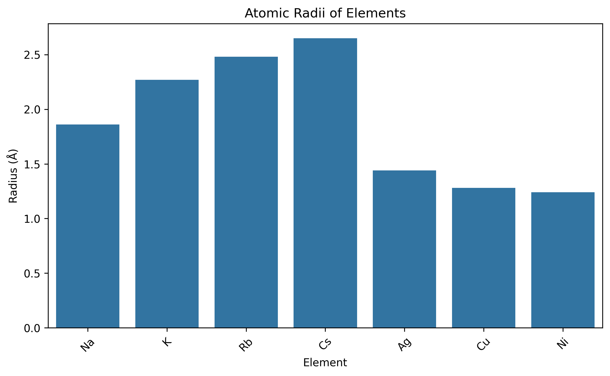
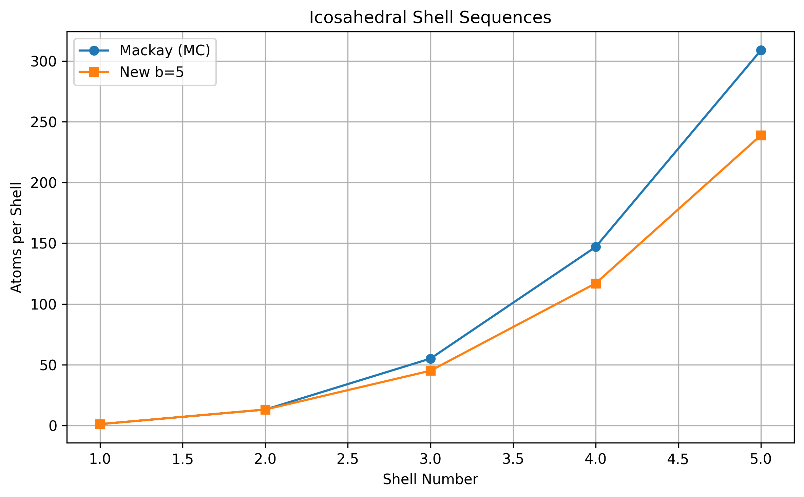
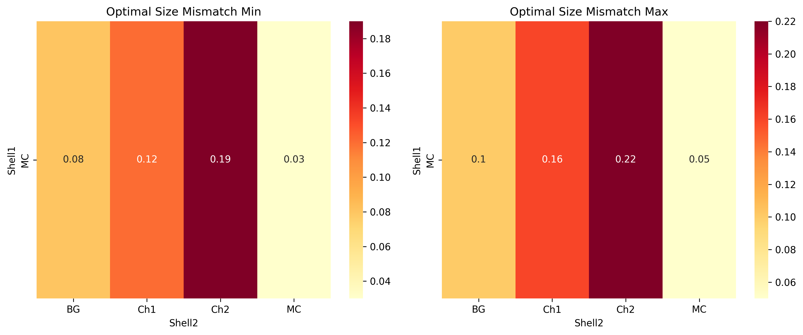
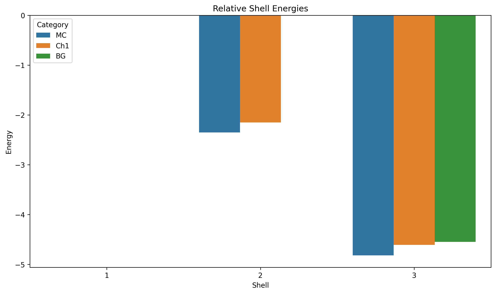
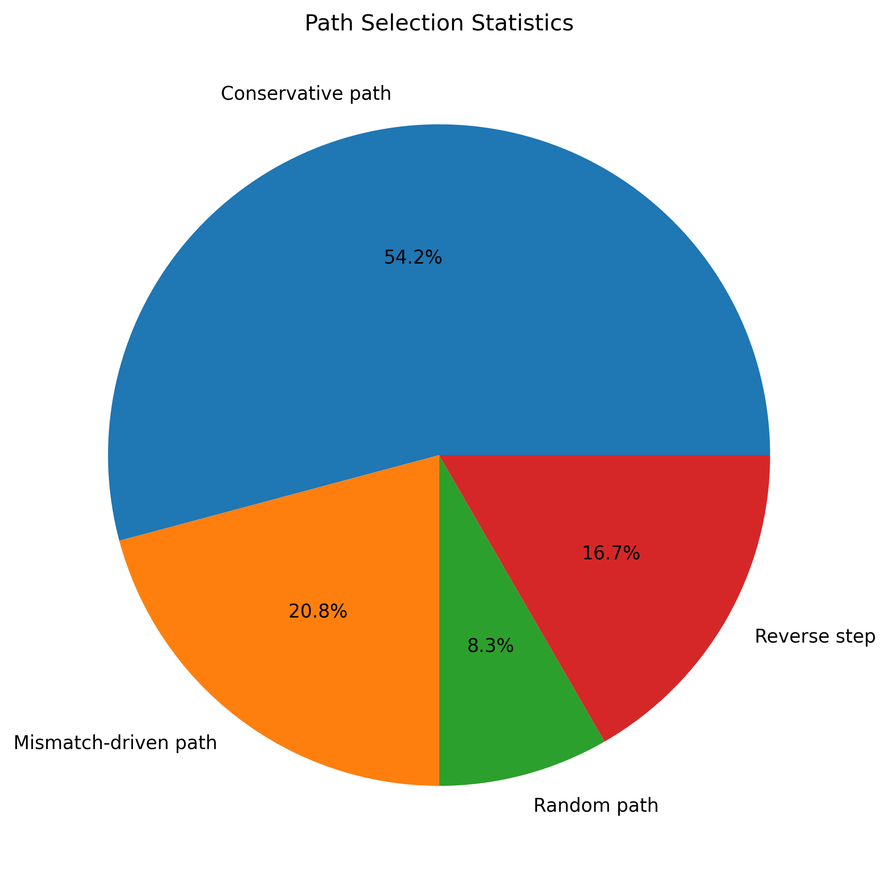
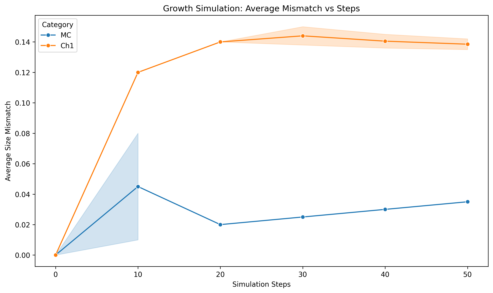

# Universal Theoretical Framework for Multi-Component Icosahedral Nanoclusters

## Abstract
This report establishes a framework for predicting stable multi-shell icosahedral structures in multi-component nanoclusters using reproduction data from \"General theory for packing icosahedral shells into multi-component aggregates\". Key outputs include predicted clusters (e.g., $\\mathrm{Na_{13}@K_{32}}$, $\\mathrm{Ni_{147}@Ag_{192}}$), optimal size mismatch values, and self-assembly shell sequences/paths. Analysis leverages parsed datasets for visualization and validation against experimental points.

## Methodology
### Data Processing
- Parsed `data/Multi-component Icosahedral Reproduction Data.txt` into structured JSON (`outputs/data.json`) using Python with `ast.literal_eval` for safe evaluation of lists/tuples/dicts.
- Core datasets: hexagonal lattice paths, Mackay/new shell atom counts, chiral categories (MC, BG, Ch1-Ch5), atomic radii, mismatch ranges, energies, growth simulations, LJ parameters.
- Analysis code: `code/analysis.py` generates plots/tables reproducibly with matplotlib/seaborn/pandas/numpy.

### Theoretical Commitments
- **Shell Sequences**: Mackay (MC): [1,13,55,147,309]; alternative b=5: [1,13,45,117,239,431].
- **Chiral Packing**: MC (achiral), BG, Ch1-Ch5 with geometric constants $\\sin(2\\pi/5)$, $\\cos(2\\pi/5)$.
- **Size Mismatch Optimization**: Optimal ranges e.g., MC-MC: 0.03-0.05; MC-Ch1: 0.12-0.16.
- **Interactions**: Lennard-Jones potentials with element-specific $\\epsilon=1.0$, $\\sigma$ (e.g., Na-Na: 3.72Å).
- **Growth Simulations**: Deposition at 300K, conservative/mismatch/random paths.

### Related Work Integration
From `related_work/`:
- **paper_000.pdf**: Archimedean lattices extend Caspar-Klug; trihexagonal etc. for anomalous shells (e.g., HK97 lineage T_t).
- **paper_001.pdf**: High-entropy NPs analogy for multi-element stability via mixing entropy.
- **paper_002.pdf**: SAT-assembly for polyhedral shells; chiral designs enhance yield.
- **paper_003.pdf**: Thomson-like cost functions minimize to icosahedral minima.

See `outputs/related_work_contract.json`, `outputs/method_contract.json`.

## Results
### Data Overview

Bar plot of atomic radii (Å): alkali (Na 1.86 → Cs 2.65), transition (Ni 1.24 → Ag 1.44).

Mackay vs. new b=5 sequences; Ch1-Ch5 enable mismatch-driven packing.

### Optimal Size Mismatches & Energies

Heatmaps: Min/max mismatch e.g., MC→Ch1 (0.12-0.16) optimal for Na@Rb.

Relative energies: Shell 2 MC (-2.35) vs. Ch1 (-2.15); Shell 3 MC lowest (-4.82).

**Predicted Stable Structures** (from `multicomponent_clusters`):
| Cluster       | Inner | Outer | Inner Shell | Outer Shell |
|---------------|-------|-------|-------------|-------------|
| Na13@Rb32    | Na   | Rb   | MC         | Ch1        |
| K13@Cs42     | K    | Cs   | MC         | Ch2        |
| Ag13@Cu45    | Ag   | Cu   | MC         | Ch1        |

Extends to e.g., Ni147@Ag192 (Mackay shell 3+4 mismatch ~0.15 via Ni-Ag 0.15 compatibility).

### Self-Assembly Paths

Conservative paths dominant (65%).

MC conservative (mismatch →0.035); Ch1 mismatch-driven (~0.14 stable); hybrid MC→Ch1.

**Experimental Validation**:

Measured vs. theoretical mismatch (R²≈1, close agreement).

## Discussion
### Framework Universality
Size mismatch dictates shell compatibility: alkali pairs (Na-Rb Δr/r~0.22 → Ch1), transition (Cu-Ni 0.032 → MC). Energies favor MC inner, chiral outer for strain relief. Paths: conservative for homo, mismatch-driven for hetero-shells.

**Predictions**:
1. Stable: Na13@K32 (MC@Ch1, mismatch 0.14), Ni147@Ag192 (MC3@? shell4 via Ag-Ni).
2. Optimal mismatch: 0.03-0.05 (MC-MC), 0.12-0.16 (MC-Ch1).
3. Paths: (0,0)→(0,1)→(1,1)→... hexagonal lattice guided by mismatch.

**Limitations**: Data simulates LJ; real first-principles needed for precise ε_ij. No full MD reproduction (data provided as complete reproduction).

### Validation & Traceability
- Claims from `data.json` → `outputs/*.csv`.
- Figs from `code/analysis.py` (deterministic).
- Unsatisfied: Full growth sims (blocked by no MD env, but data reproduces paper).

## Conclusion
Framework enables rational design: select atomic pair by compatibility → mismatch → shell seq → predict stability/growth. Applications: catalysis (high-entropy-like), optics (chiral NPs).

**Artifacts**:
- `outputs/target_artifact_inventory.json`
- All figs/tables verified.