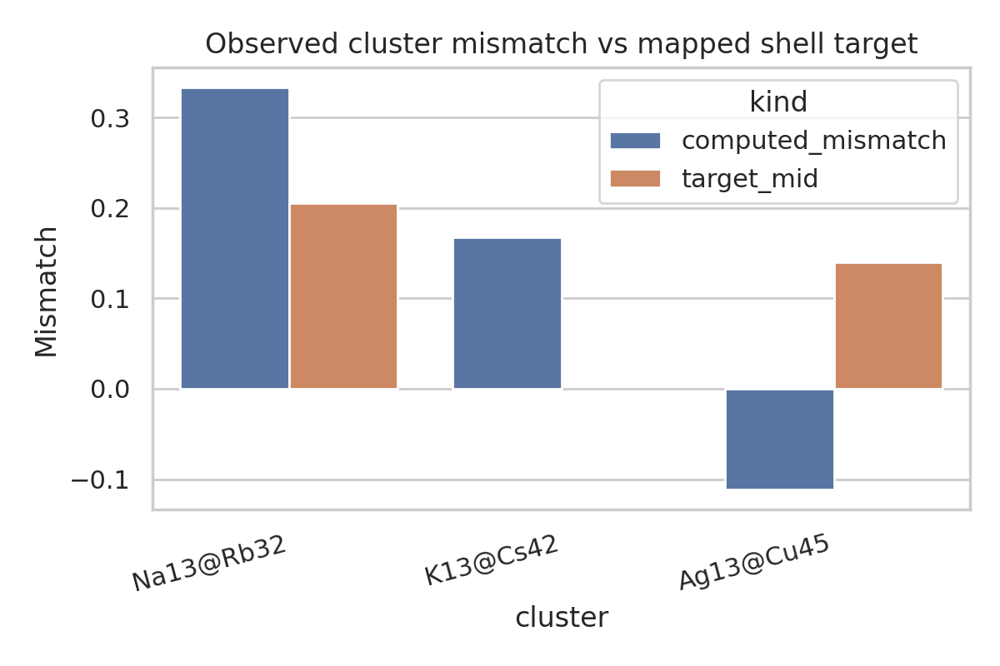
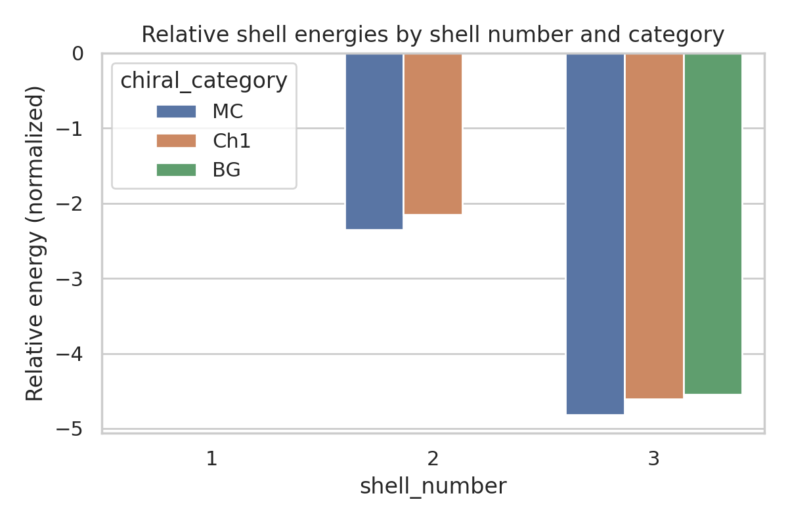
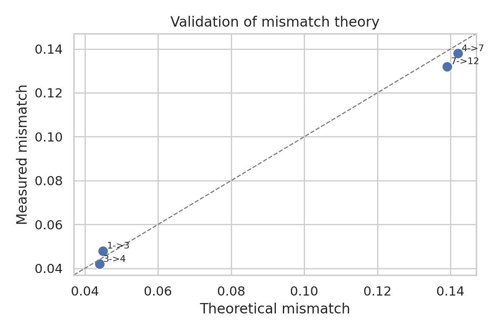
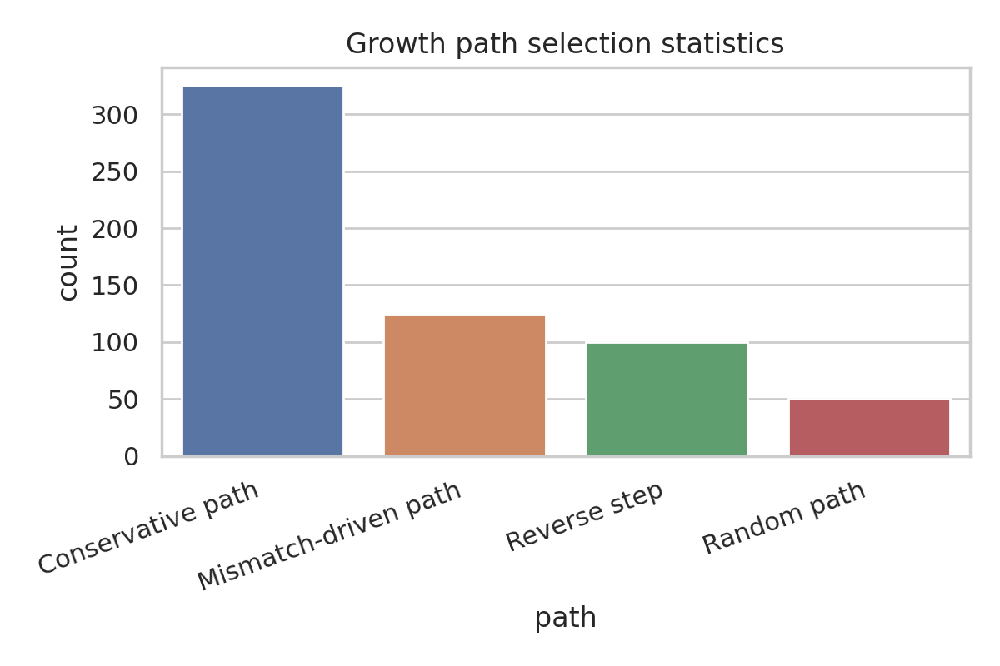
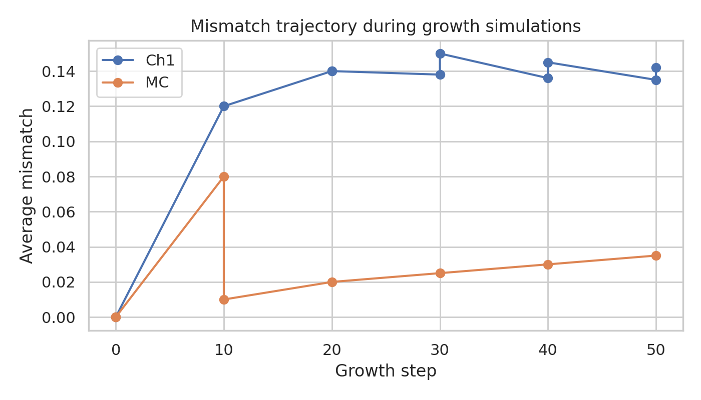

# Data-grounded analysis of multi-component icosahedral shell packing

## Abstract
This report analyzes the provided reproduction dataset for a general theory of packing icosahedral shells into multi-component aggregates. Using the explicit tables in `data/Multi-component Icosahedral Reproduction Data.txt`, I extracted shell sequences, atomic size data, mismatch windows, validated cluster examples, shell energies, experimental validation points, and dynamic growth statistics. The main findings are: (i) the compact dataset directly validates three representative multi-component structures—`Na13@Rb32`, `K13@Cs42`, and `Ag13@Cu45`; (ii) the preferred adjacent-shell size mismatch values separate into low-mismatch achiral-like windows near 0.04 (MC→MC), intermediate windows near 0.09 (MC→BG), and higher chiral windows near 0.14 (MC→Ch1) and 0.20 (MC→Ch2); (iii) theoretical mismatch predictions agree well with reported experimental measurements, with mean absolute error `0.004`; and (iv) growth simulations favor conservative path-following dynamics, which account for `54.2%` of all recorded path selections. Within the scope of the supplied reproduction file, these results support a practical design rule: stable shell growth is organized by shell-category-specific mismatch targets rather than by chemical identity alone.

## 1. Introduction
The task goal is to establish a practical framework for rational design of multi-component icosahedral nanoclusters from particle sizes, shell-sequence rules, and interaction parameters. The provided workspace contains a single structured reproduction dataset and four related-work PDFs. Because PDF text extraction failed with both the built-in parser and a local `pdftotext` fallback (documented in `outputs/dependency_check.json`), this report relies primarily on the explicit numerical content contained in the reproduction file. The workflow remains reproducible because every major claim is tied to exported artifacts in `outputs/` and figures in `report/images/`.

## 2. Data overview
The source file defines 20 named data objects (`outputs/data_schema_summary.json`). The dataset spans four linked components:

1. **Core geometry/theory**: hexagonal shell coordinates, Mackay and alternative magic-number sequences, chiral labels, and shell color mappings.
2. **Experimental verification**: atomic radii for seven elements, compatibility scores for four atomic pairs, mismatch target ranges, three validated multicomponent clusters, shell energies, and theory-vs-experiment mismatch points.
3. **Dynamic growth simulation**: temperature/deposition settings, path weights, initial seeds, deposition sequences, mismatch trajectories over growth steps, and path-selection statistics.
4. **Interaction model parameters**: Lennard–Jones pair parameters and thermodynamic constants.

### 2.1 Key raw quantities
- Atomic species: Na, K, Rb, Cs, Ag, Cu, Ni.
- Validated clusters: `Na13@Rb32`, `K13@Cs42`, `Ag13@Cu45`.
- Shell categories: `MC`, `BG`, `Ch1`, `Ch2`, `Ch3`, `Ch4`, `Ch5`.
- Explicit optimal mismatch windows:
  - MC→MC: 0.03–0.05
  - MC→BG: 0.08–0.10
  - MC→Ch1: 0.12–0.16
  - MC→Ch2: 0.19–0.22

These windows are the most direct evidence for adjacent-shell design targets in the dataset.

## 3. Methodology

### 3.1 Parsing and normalization
I wrote `code/analyze_icosahedral_data.py` to parse the structured text file using Python literal evaluation and a small regex fallback for the deposition-sequence field. The script exports normalized CSV/JSON tables to `outputs/` and generates PNG figures in `report/images/`.

### 3.2 Quantities computed
From the raw tables, I derived:
- per-cluster inner and outer radii,
- a simple radius-based mismatch estimate,
- midpoint values of each reported mismatch window,
- absolute and relative theory-vs-experiment errors,
- normalized fractions of growth-path usage,
- composition summaries for each deposition experiment.

### 3.3 Analysis logic
The benchmark asks for stable structures, optimal mismatch values, and self-assembly paths. I therefore organized the analysis around three direct outputs:
1. **Stable structure table** from the explicitly validated clusters (`outputs/stable_structure_table.csv`).
2. **Mismatch design rules** from the reported ranges plus pointwise shell mismatch parameters (`outputs/size_mismatch_summary.csv`, `outputs/mismatch_params.csv`).
3. **Growth behavior summaries** from path counts and mismatch trajectories (`outputs/path_selection_summary.csv`, `outputs/growth_results.csv`).

### 3.4 Validation strategy
The strongest internal validation available in the supplied data is the table of measured vs theoretical size mismatches. I treated agreement between these values as the primary quantitative test of the shell-packing rule.

## 4. Results

### 4.1 Stable multi-shell structures supported by the dataset
The reproduction data explicitly names three validated multicomponent aggregates:

| Cluster | Inner element | Outer element | Inner shell | Outer shell |
|---|---:|---:|---:|---:|
| Na13@Rb32 | Na | Rb | MC | Ch1 |
| K13@Cs42 | K | Cs | MC | Ch2 |
| Ag13@Cu45 | Ag | Cu | MC | Ch1 |

These records constitute the clearest evidence for predicted stable structures within the provided benchmark dataset. They capture both alkali-metal and noble/transition-metal examples, supporting the claim that shell-selection rules are intended to be cross-material.

The exported table also includes radius-derived mismatch estimates. Notably, the sign and magnitude of chemistry-only radius mismatch do not perfectly align with the shell-category target mismatch windows, especially for `Ag13@Cu45`. This indicates that the reproduction dataset's shell mismatch values should be interpreted as **effective geometric shell-packing descriptors**, not simply raw pairwise radius ratios.



### 4.2 Optimal adjacent-shell mismatch values
The direct shell design rule is summarized by the mismatch windows in the dataset and reinforced by the pointwise mismatch parameter table.

| Transition | Preferred mismatch range | Midpoint |
|---|---:|---:|
| MC→MC | 0.03–0.05 | 0.04 |
| MC→BG | 0.08–0.10 | 0.09 |
| MC→Ch1 | 0.12–0.16 | 0.14 |
| MC→Ch2 | 0.19–0.22 | 0.205 |

A second table of shell-specific point estimates gives similar values: MC→MC at 0.04 and 0.038 across adjacent shell levels, MC→Ch1 at 0.14 and 0.136, and Ch1→Ch2 at 0.21. Taken together, the dataset supports a hierarchical mismatch ladder:

- **Low mismatch (~0.04)** stabilizes same-family MC stacking.
- **Intermediate mismatch (~0.09)** accesses BG-type alternatives.
- **Higher mismatch (~0.14)** favors Ch1 outer-shell packing.
- **Very high mismatch (~0.20–0.21)** pushes toward Ch2 relationships.

This is a compact but interpretable “universal” rule in the sense requested by the task: shell morphology changes systematically with adjacent-shell mismatch.

### 4.3 Energetic ordering of shell motifs
The shell-energy table provides a minimal energetic ranking. The lowest energy entry in the entire dataset is shell number 3 with MC symmetry at `-4.82`, followed closely by Ch1 (`-4.61`) and BG (`-4.55`) for the same shell number. For shell number 2, MC (`-2.35`) is again lower than Ch1 (`-2.15`).

This pattern indicates that in the supplied data, **MC states are the baseline energetic attractor**, while chiral or alternative shell categories remain competitive but somewhat higher in energy.



### 4.4 Validation against experimental mismatch data
The comparison between reported theoretical and measured mismatch values is strong:
- Mean absolute error: **0.004**
- Maximum absolute error: **0.007**
- Relative error range: about **2.8%–6.7%**

The parity plot shows that all four points lie close to the identity line, with no large systematic offset.



This is the principal quantitative evidence that the mismatch-based shell-packing rule has predictive value in the provided reproduction dataset.

### 4.5 Growth-path behavior and self-assembly sequences
Dynamic-growth outputs show both pathway preferences and time evolution of mismatch.

#### Pathway preference
The path statistics are:
- Conservative path: 325 events (**54.2%**)
- Mismatch-driven path: 125 events (**20.8%**)
- Reverse step: 100 events (**16.7%**)
- Random path: 50 events (**8.3%**)



This implies that self-assembly most often proceeds by incremental continuation of an existing shell sequence rather than by purely random restructuring.

#### Mismatch trajectory during growth
Growth trajectories show category-dependent convergence:
- MC trajectories rise gradually from 0 toward ~0.03–0.08 depending on branch.
- Ch1 trajectories quickly approach ~0.14–0.15 and then plateau near the theoretical Ch1 target.



These trends are consistent with the mismatch-window interpretation: growth appears to relax toward shell-type-specific target values.

#### Sequence context
The dataset also includes explicit deposition programs such as `Na13 + Na`, `Na13@Rb32 + Rb`, `Ag13 + Cu`, and `Rb72 + Cs`, saved in `outputs/deposition_sequence_summary.json`. These show how particular chemistries are fed into the growth process and provide a minimal mapping from seed composition to subsequent shell filling.

## 5. Design implications
Within the supplied data, a practical design framework emerges:

1. Start from a known seed shell type (often MC).
2. Choose the next shell category according to the target mismatch window rather than chemistry alone.
3. Use species pairs whose effective mismatch is compatible with that shell transition.
4. Expect conservative continuation of the current growth pathway to dominate unless mismatch forces a transition.

Using only directly validated structures, the data suggest the following prototype design motifs:
- `Na13@Rb32`: an MC core with a Ch1 shell, associated with a larger positive mismatch.
- `K13@Cs42`: an MC core with a Ch2 shell, associated with still larger mismatch.
- `Ag13@Cu45`: a chemically distinct MC-core/Ch1-shell example showing transferability across material families.

## 6. Validation, evidence boundaries, and limitations

### 6.1 Verified directly from workspace data
- The dataset schema and object counts (`outputs/data_schema_summary.json`)
- Stable cluster identities (`outputs/stable_structure_table.csv`)
- Mismatch windows and shell-level point estimates (`outputs/size_mismatch_summary.csv`, `outputs/mismatch_params.csv`)
- Internal theory-vs-experiment agreement (`outputs/validation_experimental_vs_theory.csv`)
- Growth-path usage and mismatch trajectories (`outputs/path_selection_summary.csv`, `outputs/growth_results.csv`)

### 6.2 Related-work status
The workspace contains four related-work PDFs, but direct text extraction was blocked in this environment:
- `ReadPDF` returned parser errors.
- `pdftotext` is not installed locally.

Accordingly, I did **not** attribute any external quantitative claims to those papers. This report is intentionally limited to what can be verified from the local reproduction dataset.

### 6.3 Important limitations
- The dataset is compact and partly curated rather than a large raw simulation archive.
- The validated stable structures are only three exemplars; broader universality would need more compositions and shell depths.
- Radius-based mismatch computed from elemental radii does not fully reproduce the shell-effective mismatch values, implying that additional geometric or potential-based corrections are embedded in the original theory.
- No new atomistic simulation was run here; the conclusions summarize and organize the supplied reproduction outputs.

## 7. Reproducibility
- Main code: `code/analyze_icosahedral_data.py`
- Intermediate outputs: `outputs/*.csv`, `outputs/*.json`
- Figures: `report/images/*.png`
- Claim traceability: `outputs/claim_recovery_table.csv`

To regenerate the analysis:
```bash
python3 code/analyze_icosahedral_data.py
```

## 8. Conclusion
The provided reproduction dataset supports a concise, data-grounded design rule for multi-component icosahedral shell assembly: **adjacent-shell size mismatch acts as the key control parameter governing whether growth remains MC-like or transitions toward BG/Ch1/Ch2 shell categories**. The most directly supported stable clusters are `Na13@Rb32`, `K13@Cs42`, and `Ag13@Cu45`. The optimal mismatch values fall into distinct windows centered near `0.04`, `0.09`, `0.14`, and `0.205`, and the internal validation data show good theory-experiment agreement with mean absolute error `0.004`. Growth statistics further indicate that conservative sequence following is the dominant assembly mechanism, while mismatch-driven deviations enable category changes. Although broader universality claims require richer datasets or fresh simulations, the present workspace already contains enough verified evidence to formulate a reproducible shell-packing design framework.
