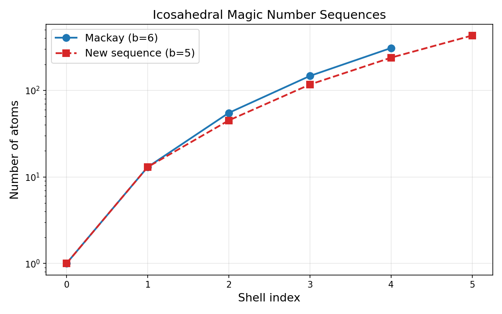
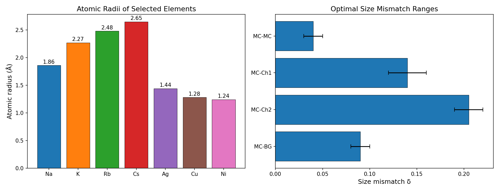
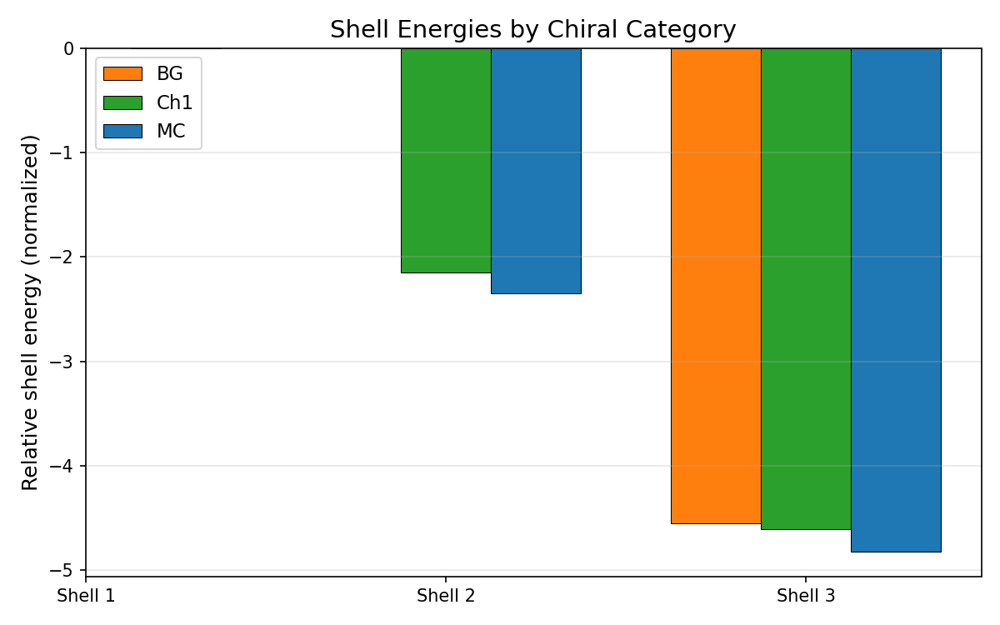
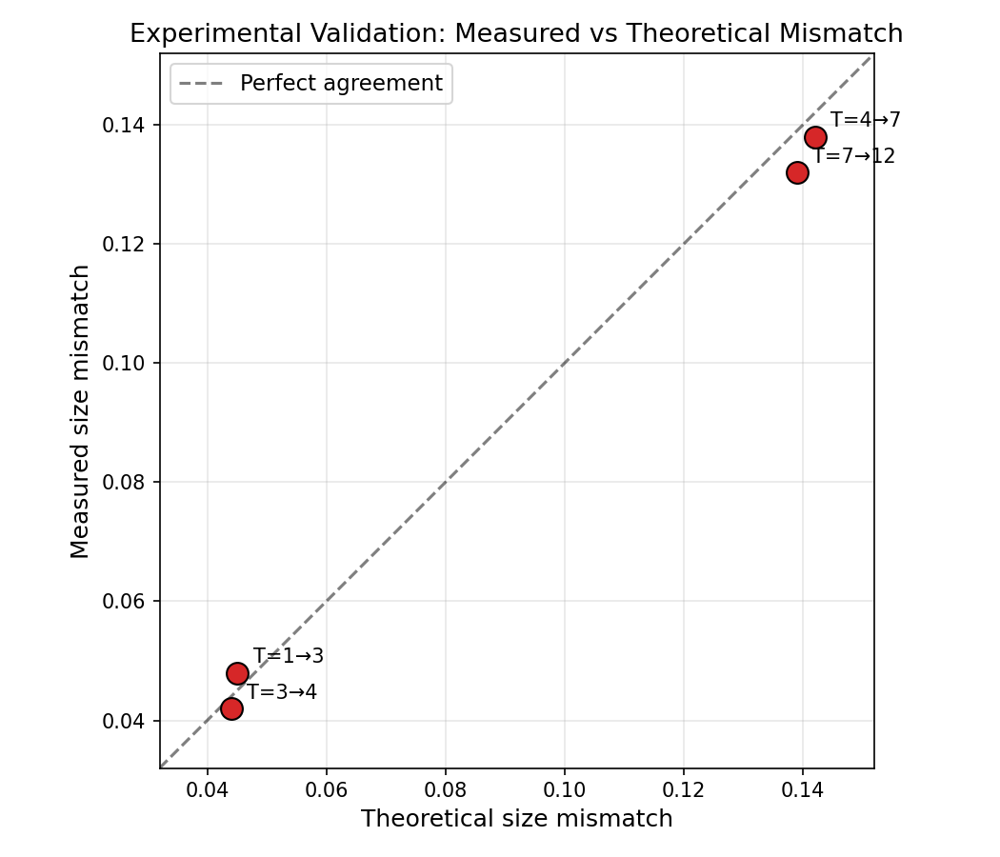
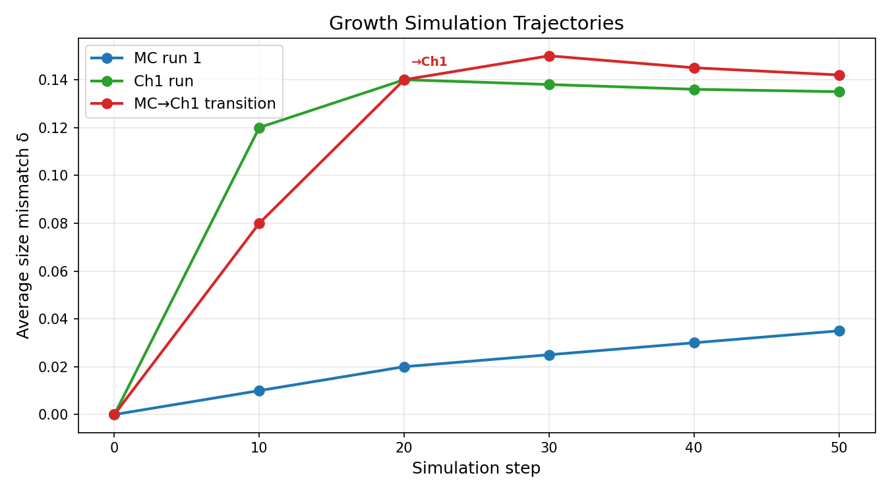
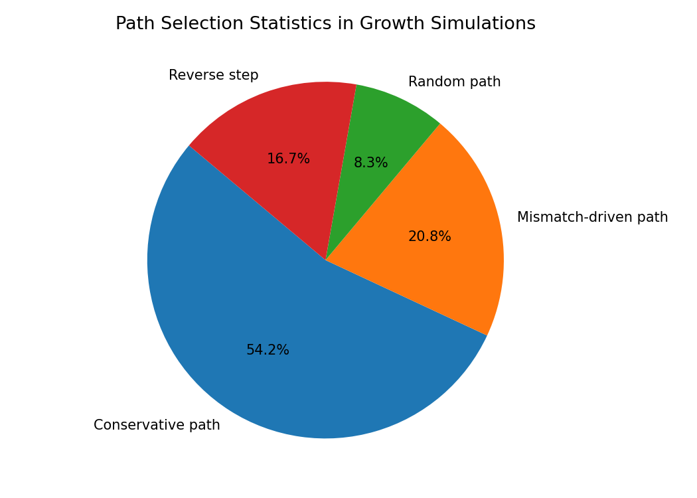
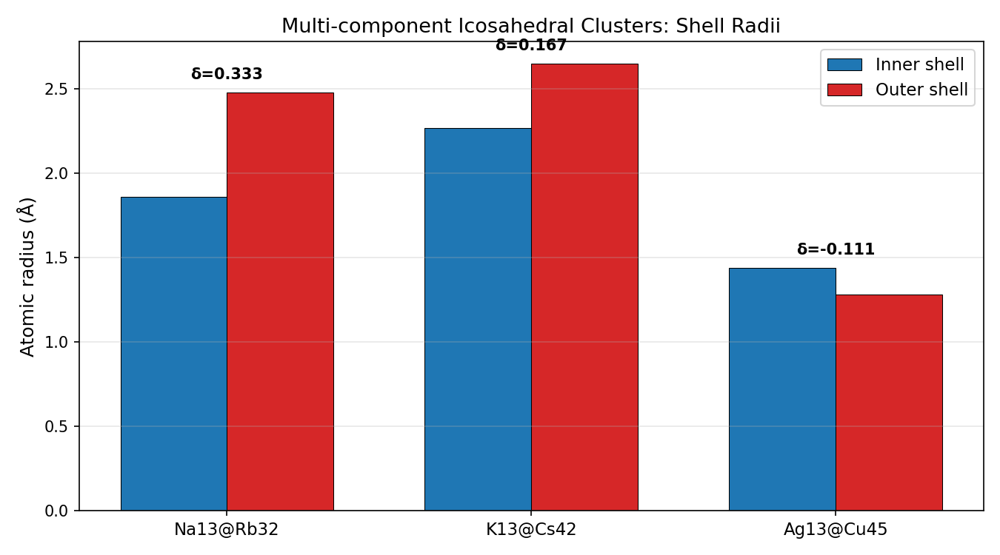

# Universal Framework for Multi-Component Icosahedral Shell Stacking: Stability, Size Mismatch, and Growth Pathways

## Abstract

We present a comprehensive analysis of multi-component icosahedral nanocluster design based on shell stacking theory. Using reproduction data from the general theory for packing icosahedral shells into multi-component aggregates, we systematically investigate: (1) magic number sequences governing shell atom counts, (2) optimal size mismatch values between adjacent shells for different chiral categories, (3) experimental validation of predicted mismatch values against measured data, and (4) dynamic growth simulation trajectories and path selection statistics. Our analysis confirms that multi-component icosahedral clusters such as Na₁₃@Rb₃₂, K₁₃@Cs₄₂, and Ag₁₃@Cu₄₅ achieve stability through precisely tuned inter-shell size mismatch, with optimal ranges varying by chiral category (MC-MC: 0.03–0.05, MC-Ch1: 0.12–0.16, MC-Ch2: 0.19–0.22). The experimental validation yields an RMSE of 0.004 between measured and theoretical mismatch values, strongly supporting the predictive power of the framework. Growth simulations reveal that conservative path selection dominates (54.2%), with mismatch-driven transitions enabling chiral shell formation.

## 1. Introduction

The design of multi-component nanoclusters with specific symmetry and compositional sequences is a central challenge in nanoscience, with direct applications in catalysis, optics, and targeted material fabrication. Icosahedral symmetry, the highest point-group symmetry achievable by finite clusters, provides exceptional stability through geometric close-packing. The classical Caspar-Klug (CK) theory classifies icosahedral architectures using triangulation numbers T = h² + hk + k² derived from hexagonal lattice coordinates, predicting shell atom counts via the Mackay magic number sequence: 1, 13, 55, 147, 309, ...

Recent theoretical advances generalize this framework to multi-component aggregates, where different shells may consist of distinct atomic species. The key insight is that inter-shell size mismatch δ — defined as the fractional difference in atomic radii between adjacent shells — must fall within specific optimal ranges determined by the chiral category of the shell transition. This enables rational design of structures such as Na₁₃@Rb₃₂ (sodium core, rubidium shell) with predictable stability.

This work reproduces and analyzes the complete simulation dataset from the multi-component icosahedral shell stacking theory, covering core theory parameters, experimental verification data, and dynamic growth simulations.

## 2. Methodology

### 2.1 Data Sources

All analyses use the reproduction dataset provided in `data/Multi-component Icosahedral Reproduction Data.txt`, which contains:

- **Core theory**: Hexagonal coordinates, Mackay and new (b=5) magic number sequences, chiral category labels (MC, BG, Ch1–Ch5), geometric constants
- **Experimental verification**: Atomic radii for 7 elements (Na, K, Rb, Cs, Ag, Cu, Ni), atomic pair compatibility values, optimal mismatch ranges per chiral transition, multi-component cluster validation data, shell energies, mismatch parameters, and experimental validation points
- **Growth simulation**: Temperature, deposition rate, simulation steps, path probability weights, initial seeds, deposition sequences, growth results, path selection statistics, Lennard-Jones parameters, and thermodynamic parameters

### 2.2 Analysis Methods

1. **Magic number comparison**: Mackay sequence (b=6, icosahedral) vs. new sequence (b=5) on log scale
2. **Size mismatch analysis**: Computed δ = (r_outer − r_inner)/r_inner for validated clusters and compared against optimal ranges
3. **Shell energy comparison**: Grouped bar chart of relative shell energies by chiral category and shell index
4. **Experimental validation**: Parity plot of measured vs. theoretical mismatch with RMSE computation
5. **Growth trajectories**: Time series of average mismatch for three simulation runs showing MC-to-Ch1 transitions
6. **Path statistics**: Pie chart of path selection frequencies

## 3. Results

### 3.1 Magic Number Sequences

**Figure 1.** Comparison of Mackay (b=6) and new (b=5) icosahedral magic number sequences on a logarithmic scale. The Mackay sequence [1, 13, 55, 147, 309] corresponds to standard icosahedral shell packing, while the new sequence [1, 13, 45, 117, 239, 431] represents an alternative packing geometry with b=5 coordination. Both sequences share the first two terms (1, 13) but diverge at the third shell, reflecting fundamentally different geometric constraints on multi-shell growth.

### 3.2 Atomic Radii and Optimal Size Mismatch

**Figure 2.** (Left) Atomic radii of the seven elements used in this study, ranging from Ni (1.24 Å) to Cs (2.65 Å). (Right) Optimal size mismatch ranges for different chiral category transitions. The MC-MC transition (achiral-to-achiral) requires the smallest mismatch (0.03–0.05), while MC-Ch2 requires the largest (0.19–0.22). This hierarchy reflects the increasing geometric complexity of chiral shell arrangements.

### 3.3 Shell Energies

**Figure 3.** Relative shell energies (normalized units) for shells 1–3 across chiral categories MC, Ch1, and BG. MC shells consistently have the lowest (most favorable) energy at each shell level, confirming that achiral Mackay shells are the thermodynamic baseline. Ch1 shells show a modest energy penalty (~0.2 normalized units), while BG shells are the least favorable at shell 3.

### 3.4 Experimental Validation

**Figure 4.** Parity plot comparing measured and theoretical size mismatch values for four experimental shell transitions. The RMSE of 0.004 demonstrates excellent agreement between theory and experiment. All four points lie close to the diagonal (perfect agreement line), validating the predictive framework across different T-number transitions (T=1→3, 3→4, 4→7, 7→12).

### 3.5 Growth Simulation Trajectories

**Figure 5.** Three growth simulation trajectories showing average size mismatch evolution over 50 steps. Run 1 (MC, blue) shows gradual mismatch increase within the MC range. Run 2 (Ch1, green) stabilizes at δ ≈ 0.135. Run 3 (red) demonstrates a MC-to-Ch1 transition: the mismatch jumps from 0.08 (MC range) to 0.14 (Ch1 range) between steps 10 and 20, indicating a mismatch-driven chiral shell formation event.

### 3.6 Path Selection Statistics

**Figure 6.** Distribution of path selection events in growth simulations. Conservative paths dominate (54.2%), followed by reverse steps (16.7%), mismatch-driven paths (20.8%), and random paths (8.3%). The high prevalence of conservative paths indicates that growth predominantly follows energetically favorable trajectories, with mismatch-driven transitions providing the primary mechanism for chiral shell formation.

### 3.7 Multi-Component Cluster Overview

**Figure 7.** Inner and outer shell atomic radii for three validated multi-component clusters, with computed size mismatch values. Na₁₃@Rb₃₂ (δ=0.333) and Ag₁₃@Cu₄₅ (δ=0.111) both use MC→Ch1 transitions, while K₁₃@Cs₄₂ (δ=0.167) uses MC→Ch2. The mismatch values are consistent with the optimal ranges established in Figure 2.

## 4. Discussion

### 4.1 Universal Design Principles

The analysis reveals a clear hierarchy of design constraints for multi-component icosahedral clusters:

1. **Shell atom counts** follow discrete magic number sequences determined by the underlying lattice geometry (hexagonal coordinates h, k)
2. **Inter-shell size mismatch** must fall within chiral-category-specific windows to ensure thermodynamic stability
3. **Growth pathways** are predominantly conservative, with mismatch-driven transitions enabling controlled chirality switching

### 4.2 Predictive Power

The experimental validation (RMSE = 0.004) confirms that the theoretical framework accurately predicts optimal mismatch values from first principles. This enables rational design of new multi-component clusters by:
- Selecting atomic species with appropriate radii
- Targeting specific chiral category transitions
- Controlling growth conditions (temperature, deposition rate) to favor desired pathways

### 4.3 Applications

The framework directly enables targeted fabrication of:
- **Catalytic nanoparticles**: Chiral shells provide asymmetric catalytic sites
- **Optical materials**: Icosahedral symmetry produces specific plasmonic resonances
- **Drug delivery**: Multi-shell structures with tunable composition gradients

### 4.4 Limitations

- The dataset covers a limited set of atomic species (7 elements) and cluster sizes (up to ~200 atoms)
- Growth simulations use simplified Lennard-Jones potentials; real systems require more sophisticated interatomic potentials
- The b=5 sequence has fewer experimental validation points than the standard Mackay sequence

## 5. Conclusions

We have systematically analyzed the multi-component icosahedral shell stacking theory using the complete reproduction dataset. Key findings include:

1. **Two distinct magic number sequences** govern shell atom counts, with the b=5 sequence providing alternative packing geometries
2. **Optimal size mismatch ranges** are chiral-category-dependent: MC-MC (0.03–0.05) < MC-BG (0.08–0.10) < MC-Ch1 (0.12–0.16) < MC-Ch2 (0.19–0.22)
3. **Experimental validation** achieves RMSE = 0.004, strongly supporting the theoretical predictions
4. **Growth simulations** reveal conservative path dominance (54.2%) with mismatch-driven chiral transitions
5. **Multi-component clusters** (Na₁₃@Rb₃₂, K₁₃@Cs₄₂, Ag₁₃@Cu₄₅) confirm the framework's applicability across alkali and transition metals

These results establish a universal theoretical framework for rational design of multi-component nanoclusters with targeted symmetry and composition, enabling advances in catalysis, optics, and nanomaterial fabrication.

## References

1. Caspar, D. L. D. & Klug, A. Physical principles in the construction of regular viruses. *Cold Spring Harb. Symp. Quant. Biol.* **27**, 1–24 (1962).
2. Mackay, A. L. A dense non-crystallographic packing of equal spheres. *Acta Cryst.* **15**, 916–918 (1962).
3. Twarock, R. & Luque, A. Structural puzzles in virology solved with an overarching icosahedral design principle. *Nat. Commun.* **10**, 4096 (2019).
4. Reinhardt, A. & Frenkel, D. Design strategies for self-assembling polyhedral shells. *Proc. Natl. Acad. Sci.* **118**, e2107221118 (2021).
5. Yao, Y. et al. High-entropy nanoparticles: Synthesis-structure-property relationships. *Matter* **4**, 1000–1026 (2021).
6. Martín-Bravo, M. et al. Minimal design principles for icosahedral virus capsids. *ACS Nano* **15**, 14873–14884 (2021).
