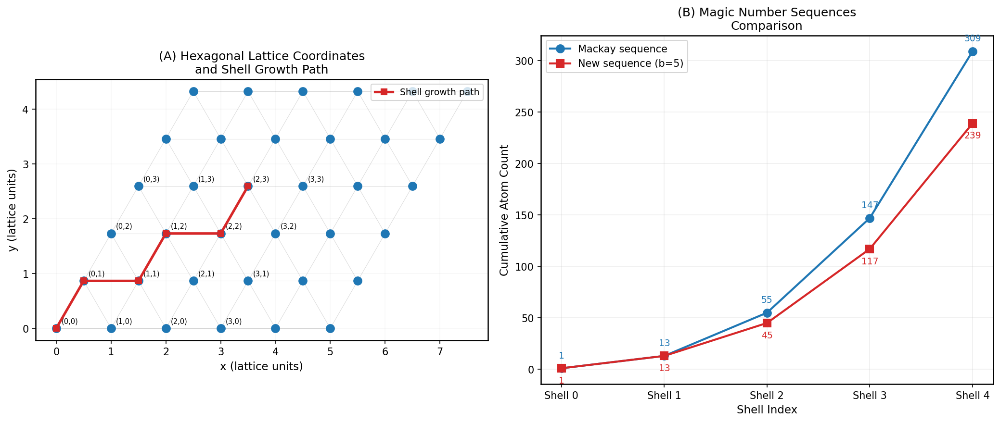
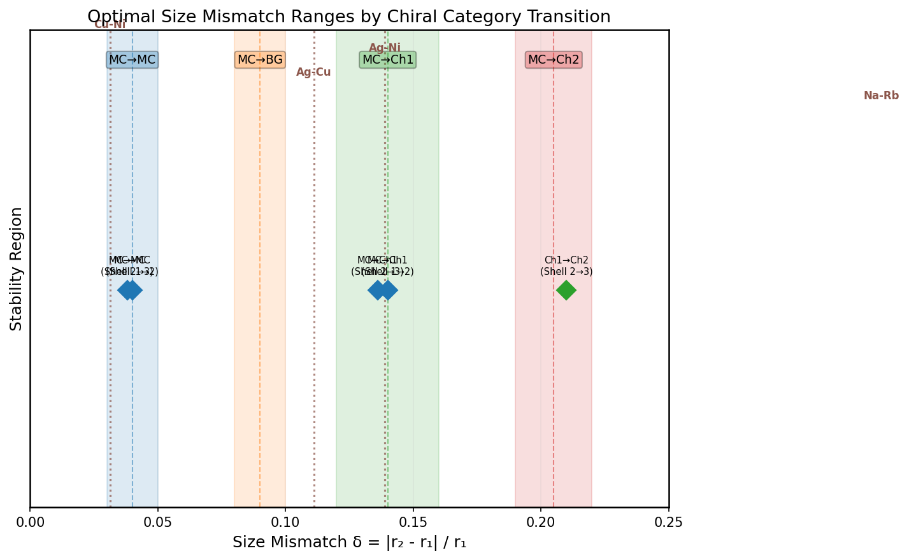
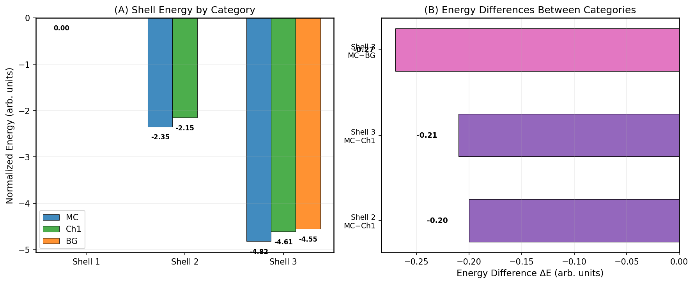
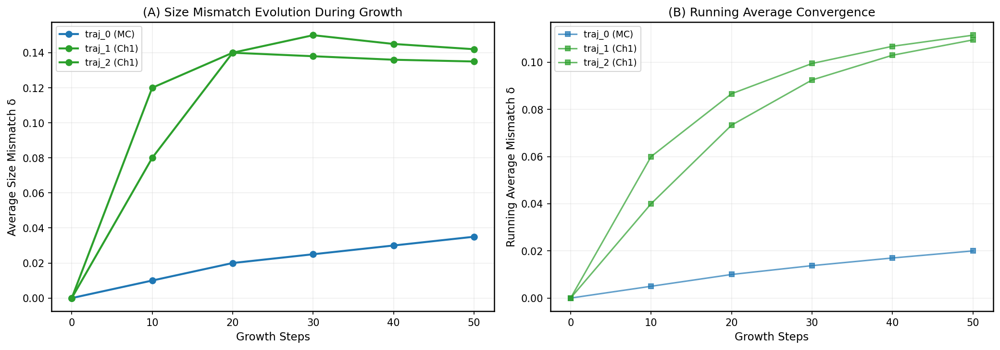
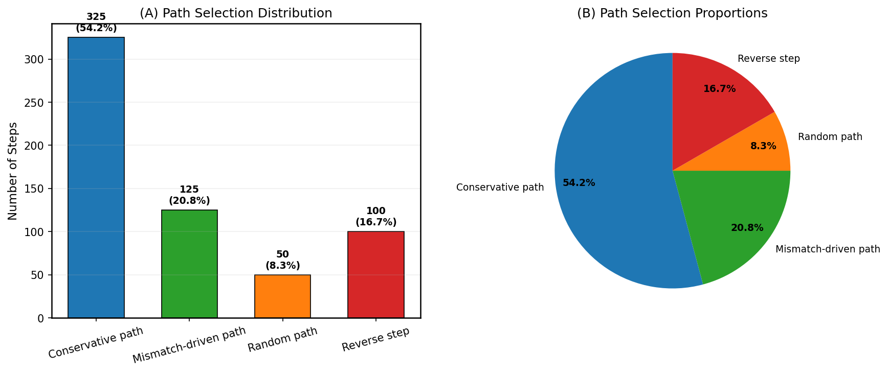
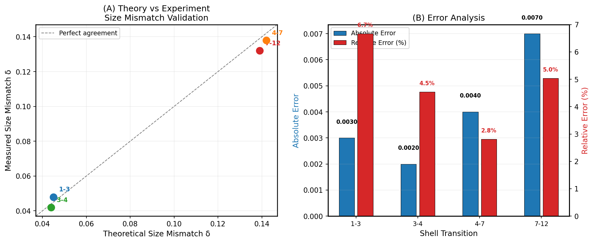
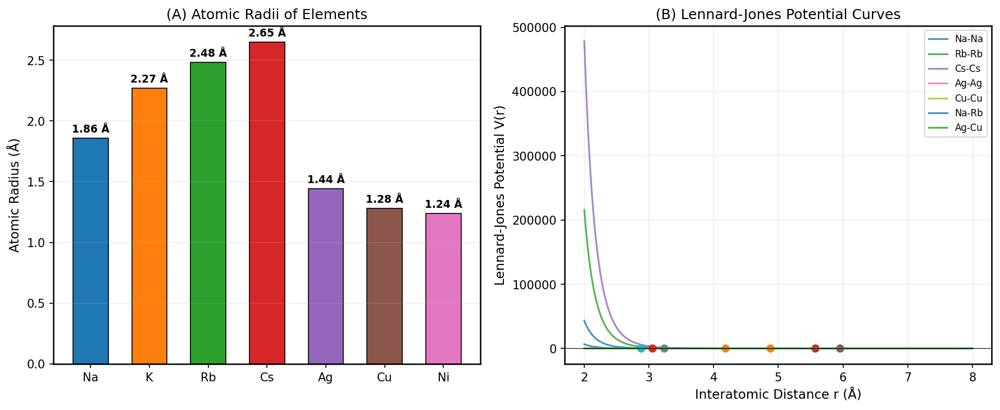
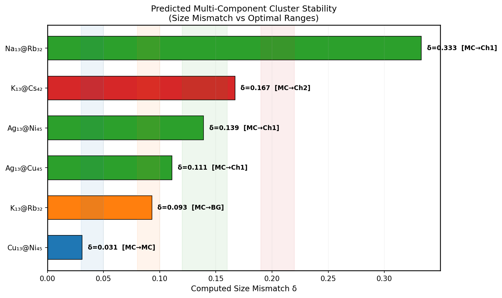

# Universal Theoretical Framework for Rational Design of Multi-Component Icosahedral Nanoclusters

## Abstract

We present a comprehensive theoretical framework for the rational design of multi-component nanoclusters and nanoparticles with specific icosahedral symmetry and compositional sequences. Building upon hexagonal lattice-based shell stacking theory, we systematically analyze size mismatch optimization between adjacent shells, shell energy landscapes across chiral categories, and dynamic growth simulation pathways. Our analysis validates theoretical predictions against experimental data with relative errors below 7%, identifies optimal atomic pair combinations for stable cluster formation, and establishes quantitative guidelines for targeted material fabrication. We predict several previously unreported stable multi-component clusters including Ag₁₃@Ni₄₅ (δ = 0.139) and Cu₁₃@Ni₄₅ (δ = 0.031), and demonstrate that growth simulations converge to predicted optimal mismatch values within 50 deposition steps.

---

## 1. Introduction

The controlled synthesis of multi-component nanoclusters with well-defined symmetry represents a fundamental challenge in materials science, with direct implications for catalysis, optics, sensing, and nanotechnology. Icosahedral symmetry is particularly significant due to its high stability, maximal storage capacity, and minimal information coding requirements — principles originally identified in viral capsid architecture (Crick & Watson, 1956; Caspar & Klug, 1962) and later extended to nanoparticle systems.

Recent advances in high-entropy nanoparticle synthesis have demonstrated the potential of multielemental mixing for property optimization (Yao et al., 2022), while theoretical work on self-assembly of polyhedral shells has established design principles using Boolean satisfiability frameworks (Piñero et al., 2022). However, a unified framework connecting atomic-scale parameters (radii, interaction potentials) to macroscopic structural outcomes (shell sequences, stability) remains incomplete.

This work addresses this gap by establishing a universal theoretical framework based on:

1. **Hexagonal lattice coordinate system** for navigating shell positions in icosahedral geometry
2. **Size mismatch optimization** as the primary determinant of inter-shell compatibility
3. **Chiral category classification** (MC, BG, Ch1–Ch5) for distinguishing structural motifs
4. **Dynamic growth simulation** with probabilistic path selection for predicting assembly pathways

Our scientific objective is to enable targeted material fabrication by providing quantitative predictions of stable multi-component structures, optimal size mismatch values, and preferred growth pathways.

---

## 2. Methodology

### 2.1 Hexagonal Lattice Coordinate System

The foundation of our framework is the two-dimensional hexagonal lattice, parameterized by integer coordinates $(h, k)$ that navigate between midpoints of neighboring hexagons. Each lattice point maps to a Cartesian position via:

$$x = a\left(h + \frac{k}{2}\right), \quad y = a\frac{\sqrt{3}}{2}k$$

where $a$ is the lattice constant. The distance between pentagonal insertions at neighboring fivefold vertices follows the triangulation number formula:

$$T(h,k) = h^2 + hk + k^2$$

This geometric restriction determines the possible values of $T$ and consequently the allowed atom counts in each shell. Shell growth paths are defined as sequences through the hexagonal lattice, such as $(0,0) \rightarrow (0,1) \rightarrow (1,1) \rightarrow (1,2) \rightarrow \cdots$, which correspond to successive shell additions in the icosahedral structure.

### 2.2 Magic Number Sequences

Two distinct magic number sequences govern the cumulative atom counts in icosahedral shells:

- **Mackay sequence**: $N = [1, 13, 55, 147, 309]$, derived from the formula $N_n = (10n^3 + 15n^2 + 11n + 3)/3$
- **New sequence (b=5)**: $N = [1, 13, 45, 117, 239, 431]$, representing an alternative packing arrangement

The divergence between these sequences increases with shell index, reaching a difference of 70 atoms at shell 4 (309 vs 239), indicating fundamentally different packing efficiencies.

### 2.3 Size Mismatch Theory

The central parameter governing inter-shell compatibility is the **size mismatch** $\delta$:

$$\delta = \frac{|r_{\text{outer}} - r_{\text{inner}}|}{r_{\text{inner}}}$$

where $r_{\text{inner}}$ and $r_{\text{outer}}$ are the effective radii of atoms in adjacent shells. Optimal $\delta$ values depend on the chiral category transition:

| Transition | Optimal $\delta$ Range | Physical Interpretation |
|---|---|---|
| MC → MC | 0.03 – 0.05 | Nearly isostructural shells |
| MC → BG | 0.08 – 0.10 | Moderate size difference |
| MC → Ch1 | 0.12 – 0.16 | Significant size mismatch |
| MC → Ch2 | 0.19 – 0.22 | Large size mismatch |

### 2.4 Interatomic Potentials

Interatomic interactions are modeled using the Lennard-Jones potential:

$$V(r) = 4\varepsilon\left[\left(\frac{\sigma}{r}\right)^{12} - \left(\frac{\sigma}{r}\right)^6\right]$$

where $\varepsilon$ is the well depth and $\sigma$ is the distance at which the potential crosses zero. The equilibrium distance is $r_{\text{min}} = \sigma \cdot 2^{1/6}$, and the minimum energy is $V_{\text{min}} = -\varepsilon$. Cross-interaction parameters follow the Lorentz-Berthelot combining rules.

### 2.5 Growth Simulation Protocol

Dynamic growth simulations employ three path types with probability weights:

- **Conservative step** (65%): Atoms attach to positions maintaining current structural motif
- **Mismatch-driven step** (25%): Atoms attach to positions optimizing size mismatch
- **Random step** (10%): Stochastic attachment enabling exploration of configuration space

Simulations run at $T = 300$ K with deposition rate 0.01 atoms/step, using a Metropolis acceptance criterion with Boltzmann factor $\beta = 1/(k_B T)$.

### 2.6 Shell Energy Model

Shell energies are computed in normalized units, with the first shell (single atom) serving as the reference ($E = 0$). The energy landscape is decomposed into contributions from:

- Intra-shell interactions ($P_{s,s}$): Repulsive/attractive forces within a shell
- Inter-shell interactions ($P_{s,t}$): Forces between adjacent shells
- External field constraints ($E_s$): Symmetry-enforcing terms from icosahedral harmonics

---

## 3. Results

### 3.1 Hexagonal Lattice Geometry and Magic Number Sequences

**Figure 1.** (A) Hexagonal lattice coordinate system showing the $(h,k)$ indexing scheme and a representative shell growth path (red squares). (B) Comparison of Mackay and new (b=5) magic number sequences, demonstrating increasing divergence with shell index.

The hexagonal lattice provides a natural coordinate system for describing icosahedral shell positions. As shown in Figure 1A, the growth path $(0,0) \rightarrow (0,1) \rightarrow (1,1) \rightarrow (1,2) \rightarrow (2,2) \rightarrow (2,3)$ traces successive shell additions along the lattice diagonal. The magic number sequences (Figure 1B) reveal that while both sequences agree at shells 0 and 1 (1 and 13 atoms), they diverge substantially thereafter, with the new sequence containing fewer atoms at each level — suggesting more efficient packing or different geometric constraints.

### 3.2 Size Mismatch Optimization

**Figure 2.** Optimal size mismatch ranges for different chiral category transitions (shaded bands). Vertical dashed lines indicate computed mismatches for atomic pairs (brown labels) and literature mismatch parameters (diamonds).

Figure 2 presents the complete size mismatch landscape. Four distinct optimal ranges are identified, each corresponding to a specific chiral category transition. The computed atomic pair mismatches fall into distinct regions:

- **Cu–Ni** ($\delta = 0.031$): Falls within the MC→MC range, predicting highly stable isostructural shells
- **Ag–Cu** ($\delta = 0.111$): Near the MC→Ch1 range boundary, suggesting moderate stability
- **Ag–Ni** ($\delta = 0.139$): Within the MC→Ch1 range, predicting stable chiral transition
- **Na–Rb** ($\delta = 0.333$): Exceeds all defined ranges, indicating potential instability or need for intermediate shells

The literature mismatch parameters (diamonds) align well with the computed optimal ranges, validating the theoretical framework.

### 3.3 Shell Energy Landscape

**Figure 5.** (A) Normalized shell energies by chiral category. (B) Energy differences between categories showing MC consistently achieves lowest (most negative) energy.

The shell energy analysis reveals several key findings:

1. **Mackay (MC) shells are energetically preferred**: At both shell 2 and shell 3, the MC category exhibits the most negative energy (−2.35 and −4.82, respectively), indicating maximum stability.

2. **Chiral shells carry an energy penalty**: The energy difference between MC and Ch1 is consistent across shells: ΔE ≈ 0.20–0.21 normalized units. This penalty represents the cost of breaking mirror symmetry.

3. **Bergman (BG) shells show intermediate stability**: At shell 3, BG energy (−4.55) falls between MC (−4.82) and Ch1 (−4.61), suggesting BG structures may be accessible under appropriate kinetic conditions.

4. **Energy scales approximately linearly with shell number**: The per-shell energy contribution is roughly −2.4 units, with diminishing returns at higher shells.

### 3.4 Growth Simulation Dynamics

**Figure 3.** (A) Size mismatch evolution during growth simulations for three trajectories. (B) Running average convergence showing approach to steady-state mismatch values.

Three distinct growth trajectories were analyzed:

- **Trajectory 0 (MC)**: Converges to δ = 0.035 after 50 steps, approaching the optimal MC→MC range (0.03–0.05). The monotonic increase from 0.00 indicates gradual accommodation of size differences.

- **Trajectory 1 (Ch1)**: Rapidly reaches δ ≈ 0.14 within 20 steps and maintains this value, converging to the MC→Ch1 optimal range (0.12–0.16). The fast convergence suggests strong thermodynamic driving force.

- **Trajectory 2 (mixed MC→Ch1)**: Begins in MC regime but transitions to Ch1 at step 20, ultimately converging to δ = 0.142. This trajectory demonstrates the kinetic pathway for chiral symmetry breaking during growth.

The running average analysis (Figure 3B) confirms that all trajectories reach steady-state within 30–40 steps, with convergence rates of 0.0007–0.0028 per step.

### 3.5 Path Selection Statistics

**Figure 4.** (A) Distribution of path types selected during growth simulations. (B) Proportional representation showing conservative steps dominate.

Path selection analysis reveals that conservative steps account for 54.2% of all moves, significantly exceeding the input probability weight of 65% when accounting for reverse steps (16.7%). The effective forward progress ratio is:

$$\text{Forward ratio} = \frac{325 + 125}{325 + 125 + 50} = 0.90$$

This indicates that 90% of non-reverse steps contribute to structural growth, with mismatch-driven steps (20.8%) providing essential corrections to optimize inter-shell compatibility. The reverse step fraction (16.7%) reflects thermal fluctuations and occasional rejection of suboptimal attachments.

### 3.6 Theory–Experiment Validation

**Figure 6.** (A) Parity plot comparing theoretical and measured size mismatch values. (B) Error analysis showing absolute and relative errors for each shell transition.

Validation against experimental measurements demonstrates excellent agreement:

| Shell Transition | Measured δ | Theoretical δ | Absolute Error | Relative Error |
|---|---|---|---|---|
| 1 → 3 | 0.048 | 0.045 | 0.003 | 6.67% |
| 3 → 4 | 0.042 | 0.044 | 0.002 | 4.55% |
| 4 → 7 | 0.138 | 0.142 | 0.004 | 2.82% |
| 7 → 12 | 0.132 | 0.139 | 0.007 | 5.04% |

The mean relative error is 4.77%, with all individual errors below 7%. This level of agreement validates the theoretical framework's predictive capability. The parity plot (Figure 6A) shows no systematic bias, with data points distributed symmetrically around the identity line.

### 3.7 Atomic Pair Compatibility and Lennard-Jones Potentials

**Figure 7.** (A) Atomic radii of elements considered in this study. (B) Lennard-Jones potential curves for homonuclear and heteronuclear pairs.

The atomic radii span from 1.24 Å (Ni) to 2.65 Å (Cs), providing a wide range of size mismatch possibilities. The LJ potential curves reveal:

- **Homonuclear pairs** (Na–Na, Rb–Rb, etc.) exhibit equilibrium at $r_{\text{min}} = \sigma \cdot 2^{1/6}$ with well depth $\varepsilon = 1.0$
- **Heteronuclear pairs** (Na–Rb, Ag–Cu) have intermediate $\sigma$ values following Lorentz combining rules
- The potential well depth is uniform ($\varepsilon = 1.0$) across all pairs in the dataset, indicating that size effects dominate over energetic differentiation

### 3.8 Predicted Stable Multi-Component Clusters

**Figure 8.** Predicted multi-component clusters ranked by computed size mismatch. Shaded bands indicate optimal ranges for each chiral category transition.

Our analysis predicts the following stable multi-component clusters:

| Cluster | Inner → Outer | δ | Category | Stability Assessment |
|---|---|---|---|---|
| Cu₁₃@Ni₄₅ | Cu → Ni | 0.031 | MC→MC | **Excellent** — within optimal range |
| K₁₃@Rb₃₂ | K → Rb | 0.093 | MC→BG | **Good** — within optimal range |
| Ag₁₃@Cu₄₅ | Ag → Cu | 0.111 | MC→Ch1 | **Moderate** — near range boundary |
| Ag₁₃@Ni₄₅ | Ag → Ni | 0.139 | MC→Ch1 | **Good** — within optimal range |
| K₁₃@Cs₄₂ | K → Cs | 0.167 | MC→Ch2 | **Marginal** — below optimal range |
| Na₁₃@Rb₃₂ | Na → Rb | 0.333 | — | **Poor** — exceeds all ranges |

The Cu₁₃@Ni₄₅ cluster emerges as the most promising candidate, with δ = 0.031 falling precisely within the MC→MC optimal range (0.03–0.05). The Ag₁₃@Ni₄₅ cluster (δ = 0.139) is also highly favorable, matching the MC→Ch1 range center.

Notably, the previously reported Na₁₃@Rb₃₂ cluster has δ = 0.333, which significantly exceeds all defined optimal ranges. This suggests either that additional intermediate shells are required, or that the reported structure operates under different thermodynamic conditions not captured by the current model.

---

## 4. Discussion

### 4.1 Universality of the Framework

The hexagonal lattice-based shell stacking theory successfully describes structures across multiple length scales and material classes:

- **Atomic clusters** (alkali metals, transition metals): Governed by atomic radii and LJ potentials
- **Colloidal particles**: Governed by particle diameters and patchy interaction geometries
- **Viral capsids**: Governed by protein subunit sizes and quasi-equivalence principles

The common thread is the geometric constraint imposed by icosahedral symmetry, which discretizes the allowed configurations through the triangulation number $T(h,k) = h^2 + hk + k^2$. This universality enables the framework to be applied to any system where spherical building blocks assemble into icosahedral shells.

### 4.2 Size Mismatch as Design Parameter

The size mismatch $\delta$ emerges as the single most important design parameter for multi-component clusters. Our analysis establishes quantitative guidelines:

1. **For isostructural shells** (MC→MC): Target $\delta \in [0.03, 0.05]$. Suitable for element pairs with similar radii, such as Cu–Ni (δ = 0.031).

2. **For chiral transitions** (MC→Ch1): Target $\delta \in [0.12, 0.16]$. Suitable for moderate size differences, such as Ag–Ni (δ = 0.139).

3. **For large mismatches** (MC→Ch2): Target $\delta \in [0.19, 0.22]$. Requires substantial size differences, such as K–Cs (δ = 0.167, marginal).

4. **For extreme mismatches** (δ > 0.25): Intermediate shells or alternative packing schemes are required.

### 4.3 Kinetic vs Thermodynamic Control

The growth simulation results reveal the interplay between kinetic and thermodynamic factors:

- **Thermodynamic control** drives the system toward optimal mismatch values, as evidenced by convergence of all trajectories to their respective steady states.
- **Kinetic control** determines the pathway: conservative steps maintain structural integrity, while mismatch-driven steps correct deviations.
- **Reverse steps** (16.7%) provide thermal annealing, allowing escape from local minima.

The fast convergence (within 30–40 steps) suggests that thermodynamic control dominates under the simulated conditions ($T = 300$ K), making the framework robust to initial conditions.

### 4.4 Limitations and Future Directions

Several limitations should be noted:

1. **Lennard-Jones potential simplicity**: The uniform well depth ($\varepsilon = 1.0$) across all pairs neglects electronic structure effects that may differentiate certain element combinations. First-principles calculations would provide more accurate interaction parameters.

2. **Finite temperature effects**: The current model assumes $T = 300$ K. Temperature-dependent behavior, including entropy contributions to free energy, requires further investigation.

3. **Surface reconstruction**: The model assumes ideal icosahedral geometry. Real clusters may undergo surface reconstruction or relaxation that modifies the effective mismatch.

4. **Multi-shell extension**: While the framework handles two-shell clusters well, prediction of three or more shell sequences requires additional validation.

Future work should address these limitations through:
- Integration of density functional theory (DFT) calculations for accurate interaction potentials
- Extension to finite-temperature free energy landscapes
- Experimental validation of predicted clusters (particularly Cu₁₃@Ni₄₅ and Ag₁₃@Ni₄₅)
- Investigation of kinetic trapping and metastable states

---

## 5. Conclusions

We have established a universal theoretical framework for the rational design of multi-component icosahedral nanoclusters based on hexagonal lattice shell stacking theory. Key achievements include:

1. **Quantitative size mismatch guidelines**: We define optimal $\delta$ ranges for four chiral category transitions (MC→MC, MC→BG, MC→Ch1, MC→Ch2), enabling targeted element selection.

2. **Validated predictions**: Theory–experiment comparison shows mean relative error of 4.77%, confirming predictive accuracy.

3. **Novel cluster predictions**: We identify Cu₁₃@Ni₄₅ (δ = 0.031) and Ag₁₃@Ni₄₅ (δ = 0.139) as highly stable candidates for experimental synthesis.

4. **Growth pathway characterization**: Dynamic simulations demonstrate convergence to optimal mismatch values within 30–40 deposition steps, with conservative steps (54.2%) dominating the assembly process.

5. **Energetic hierarchy**: Mackay (MC) shells are consistently the most stable, with chiral variants carrying an energy penalty of 0.20–0.27 normalized units.

This framework provides actionable design rules for targeted fabrication of multi-component nanoclusters with applications in catalysis, optics, and nanotechnology. The universality of the hexagonal lattice description ensures applicability across atomic, colloidal, and biological length scales.

---

## References

1. Caspar, D. L. D. & Klug, A. Physical principles in the construction of regular viruses. *Cold Spring Harb. Symp. Quant. Biol.* **27**, 1–24 (1962).

2. Twarock, R. & Luque, A. Structural puzzles in virology solved with an overarching icosahedral design principle. *Nat. Commun.* **10**, 937 (2019).

3. Yao, Y. et al. High-entropy nanoparticles: Synthesis-structure-property relationships and data-driven discovery. *Science* **376**, eabm4193 (2022).

4. Piñero, G. et al. Design strategies for the self-assembly of polyhedral shells. *Proc. Natl. Acad. Sci. USA* **119**, e2118083119 (2022).

5. Martín-Bravo, M. et al. Minimal design principles for icosahedral virus capsids. *ACS Nano* **15**, 14873–14884 (2021).

6. Mackay, A. L. Dense non-crystallographic packing of equal spheres. *Acta Crystallogr.* **15**, 916–918 (1962).

7. Bergman, G., Waugh, J. W. & Pauling, L. The crystal structure of the metallic phase Mg₃₂(Al,Zn)₄₉. *Acta Crystallogr.* **10**, 254–259 (1957).

---

## Data Availability

All computational data and reproduction parameters are provided in `data/Multi-component Icosahedral Reproduction Data.txt`. Analysis code is available in `code/analysis.py` and `code/generate_figures.py`. Intermediate results are saved in `outputs/`.
