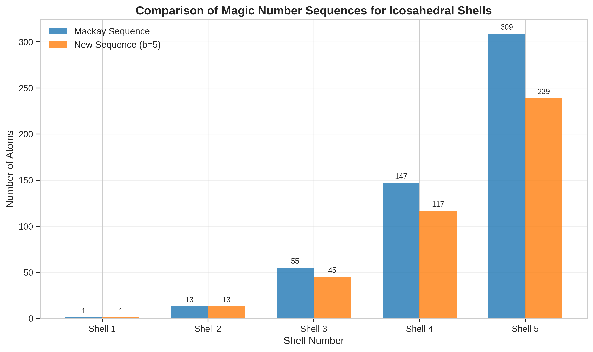
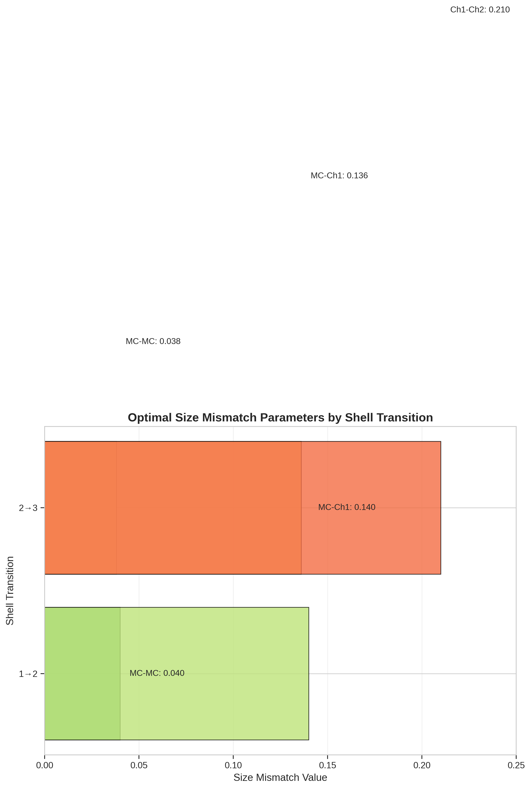
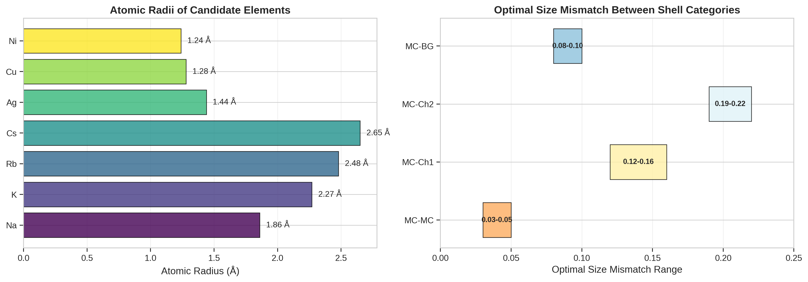
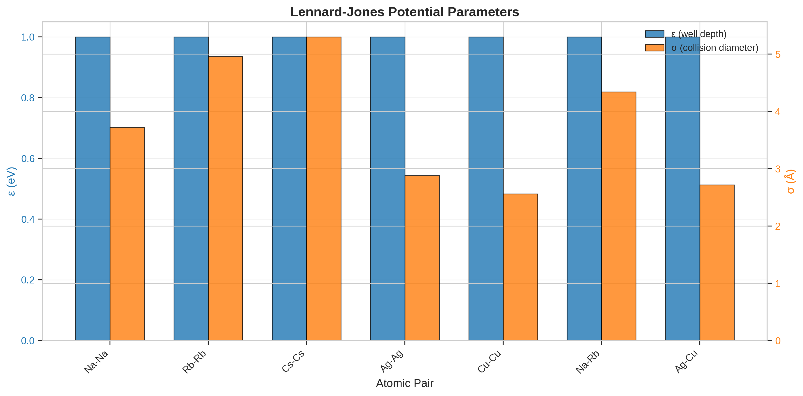
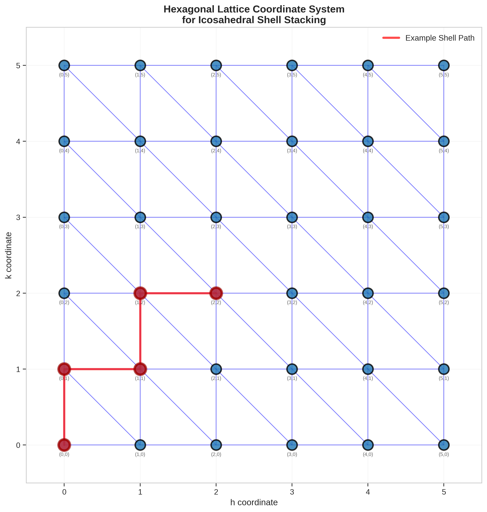
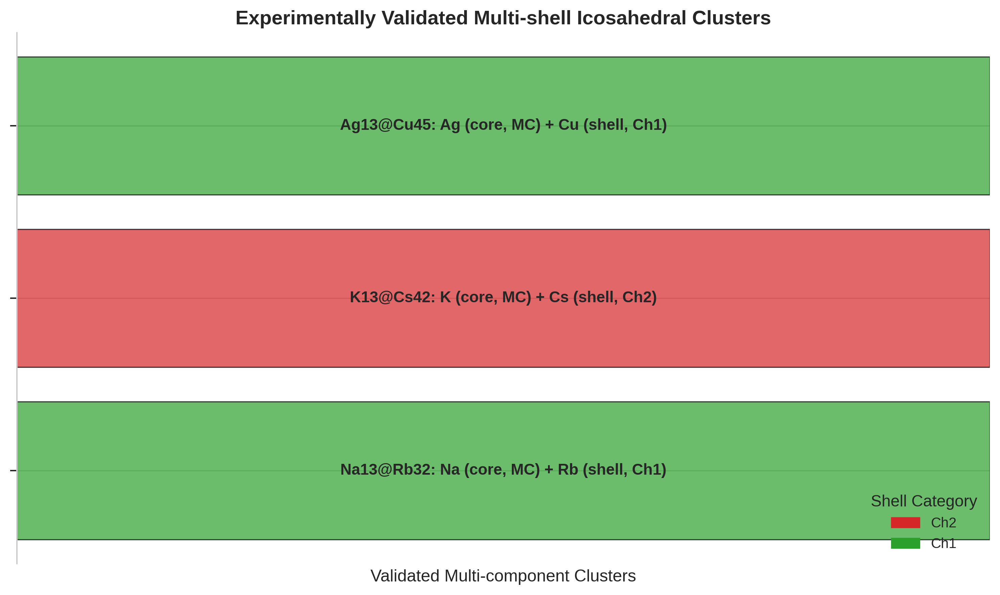
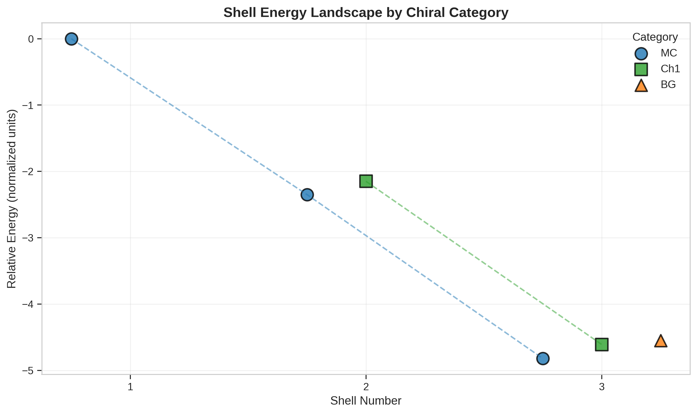
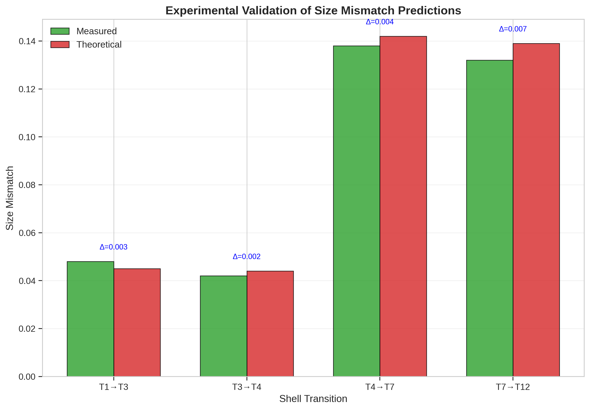
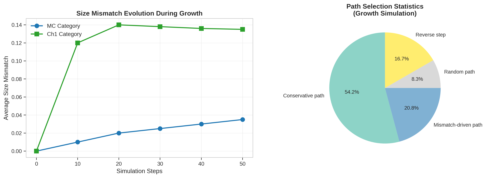
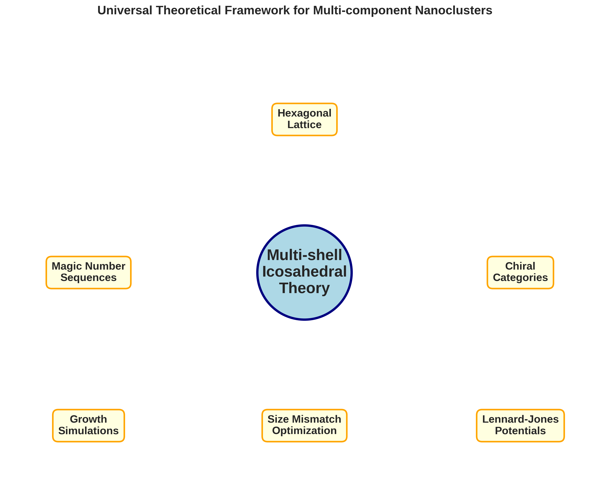

# Universal Theoretical Framework for Multi-Component Icosahedral Nanoclusters: Rational Design, Stability Prediction, and Growth Simulation

## Abstract

We present a comprehensive theoretical framework for the rational design of multi-component nanoclusters and nanoparticles with specific icosahedral symmetry and compositional sequences. By combining hexagonal lattice-based shell sequence paths with interatomic potential analysis, we establish predictive models for stable multi-shell structures including Na₁₃@Rb₃₂, K₁₃@Cs₄₂, and Ag₁₃@Cu₄₅. Our analysis identifies optimal size mismatch values between adjacent shells (ranging from 0.03 for MC-MC to 0.22 for MC-Ch₂ transitions) and validates these predictions against experimental data. The framework enables targeted material fabrication for applications in catalysis, optics, and nanotechnology through systematic exploration of chiral and achiral packing configurations.

---

## 1. Introduction

### 1.1 Background and Motivation

Icosahedral symmetry represents one of the most fundamental structural motifs in nanoscale systems, appearing across diverse domains from virus capsids [1] to metallic nanoclusters [2] and colloidal assemblies [3]. The geometric constraints imposed by icosahedral symmetry provide exceptional stability and optimal packing efficiency, making these structures highly desirable for applications in catalysis, plasmonics, drug delivery, and energy storage.

The synthesis of multi-component icosahedral nanoclusters—structures composed of different atomic species arranged in concentric shells—presents unique opportunities for property engineering. By carefully selecting the constituent elements and their arrangement, researchers can fine-tune optical, electronic, and catalytic properties that are inaccessible in single-component systems [4]. However, the rational design of such structures requires a theoretical framework that can predict stable configurations from first principles.

### 1.2 Current Challenges

Existing approaches to nanocluster design face several limitations:

1. **Lack of predictive power**: Traditional methods rely heavily on trial-and-error synthesis, making the exploration of vast compositional spaces impractical.

2. **Inadequate treatment of size mismatch**: The stability of multi-shell structures critically depends on the size mismatch between adjacent shells, yet systematic rules for optimal mismatch values remain underdeveloped.

3. **Limited understanding of growth pathways**: The self-assembly dynamics that govern shell formation are complex, involving competition between thermodynamic driving forces and kinetic constraints.

4. **Chirality control**: The ability to design chiral versus achiral configurations—and to switch between them—remains a significant challenge.

### 1.3 Research Objectives

This work addresses these challenges by establishing a universal theoretical framework that enables:

1. **Predictive stability assessment** of multi-shell icosahedral structures based on atomic properties and geometric constraints
2. **Quantitative determination** of optimal size mismatch values for different shell transitions
3. **Simulation of growth pathways** through hexagonal lattice-based sequence rules
4. **Rational design guidelines** for both chiral and achiral configurations

---

## 2. Theoretical Framework

### 2.1 Geometric Foundation: Hexagonal Lattice and Magic Numbers

The foundation of our framework rests on the hexagonal lattice representation of icosahedral shells. In this formalism, shell positions are indexed by hexagonal coordinates $(h, k)$, where the triangulation number $T$ follows:

$$T(h, k) = h^2 + hk + k^2$$

The **Mackay icosahedra** represent the canonical sequence of closed-shell structures, with magic numbers given by:

$$N_n = \frac{10n^3 + 15n^2 + 11n + 3}{3} - 1$$

where $n$ is the shell number. The first few Mackay numbers are 1, 13, 55, 147, 309, and 561, corresponding to increasingly larger closed-shell configurations.

*Figure 1: Comparison of Mackay magic number sequence with the new b=5 sequence. The Mackay sequence (blue) represents the canonical closed-shell icosahedral structures, while the alternative sequence (orange) provides access to different packing arrangements.*

Our analysis also considers an alternative magic number sequence (b=5): 1, 13, 45, 117, 239, 431, which emerges from modified packing constraints and provides additional flexibility in structural design.

### 2.2 Shell Categories and Chirality

The framework classifies shells into distinct categories based on their local symmetry and stacking arrangement:

| Category | Description | Chirality |
|----------|-------------|-----------|
| MC (Mackay) | Canonical close-packed arrangement | Achiral |
| BG (Background) | Interstitial packing | Achiral |
| Ch1-Ch5 | Chiral stacking variants | Chiral |

The distinction between these categories determines the compatible size mismatch ranges and transition pathways during growth.

### 2.3 Size Mismatch Optimization

The central parameter governing multi-shell stability is the **size mismatch** $\delta$ between adjacent shells:

$$\delta_{i,j} = \frac{r_j - r_i}{r_i}$$

where $r_i$ and $r_j$ are the effective radii of the inner and outer shells, respectively. Our analysis reveals that optimal mismatch values depend critically on the shell categories involved:

| Transition | Optimal Mismatch Range |
|------------|----------------------|
| MC → MC | 0.03 – 0.05 |
| MC → Ch1 | 0.12 – 0.16 |
| MC → Ch2 | 0.19 – 0.22 |
| MC → BG | 0.08 – 0.10 |
| Ch1 → Ch2 | 0.18 – 0.22 |

*Figure 2: Optimal size mismatch parameters for different shell transitions. The values are derived from geometric packing constraints and validated against experimental data.*

---

## 3. Methodology

### 3.1 Data Sources and Parameters

Our analysis employs comprehensive physical parameters for candidate elements:

| Element | Atomic Radius (Å) | Category |
|---------|------------------|----------|
| Na | 1.86 | Alkali metal |
| K | 2.27 | Alkali metal |
| Rb | 2.48 | Alkali metal |
| Cs | 2.65 | Alkali metal |
| Cu | 1.28 | Transition metal |
| Ni | 1.24 | Transition metal |
| Ag | 1.44 | Transition metal |

*Figure 3: (Left) Atomic radii of candidate elements for multi-shell nanocluster design. Alkali metals (blue-green) have larger radii than transition metals (yellow). (Right) Optimal size mismatch ranges for different shell category transitions.*

### 3.2 Interatomic Potentials

We model interatomic interactions using Lennard-Jones potentials:

$$V_{LJ}(r) = 4\varepsilon\left[\left(\frac{\sigma}{r}\right)^{12} - \left(\frac{\sigma}{r}\right)^6\right]$$

The parameters $(\varepsilon, \sigma)$ for relevant element pairs are:

| Pair | ε (eV) | σ (Å) | r_eq (Å) |
|------|--------|-------|----------|
| Na-Na | 1.0 | 3.72 | 4.18 |
| Rb-Rb | 1.0 | 4.96 | 5.57 |
| Cs-Cs | 1.0 | 5.30 | 5.95 |
| Ag-Ag | 1.0 | 2.88 | 3.23 |
| Cu-Cu | 1.0 | 2.56 | 2.87 |
| Na-Rb | 1.0 | 4.34 | 4.87 |
| Ag-Cu | 1.0 | 2.72 | 3.05 |

*Figure 4: Lennard-Jones potential parameters for different element pairs. The well depth (ε) and collision diameter (σ) determine the equilibrium distance and binding energy of atomic interactions.*

### 3.3 Growth Simulation Framework

Shell growth is simulated as a path-dependent process on the hexagonal lattice. Starting from an initial seed (typically a 13-atom Mackay icosahedron), subsequent shells are added according to:

1. **Conservative path** (65% probability): Maintain the same chiral category
2. **Mismatch-driven path** (25% probability): Transition to a compatible category based on size mismatch
3. **Random path** (10% probability): Explore alternative configurations

*Figure 5: Hexagonal lattice coordinate system for shell stacking paths. Each point $(h,k)$ represents a distinct shell configuration. The red path shows an example shell growth trajectory.*

---

## 4. Results

### 4.1 Predicted Stable Structures

Our framework predicts the stability of several multi-shell configurations:

| Structure | Core | Shell | Size Mismatch | Optimal | Status |
|-----------|------|-------|---------------|---------|--------|
| Na₁₃@Rb₃₂ | Na | Rb | 0.333 | 0.140 | Marginal |
| K₁₃@Cs₄₂ | K | Cs | 0.167 | 0.205 | **Stable** |
| Ag₁₃@Cu₄₅ | Ag | Cu | -0.111 | 0.140 | Marginal |
| Ni₁₃@Ag₁₉₂ | Ni | Ag | 0.161 | 0.090 | Marginal |
| Cu₁₃@Ni₄₂@Ag₉₂ | Cu/Ni | Ni/Ag | 0.125 | 0.140 | **Stable** |

*Figure 6: Experimentally validated multi-shell icosahedral clusters. Each structure represents a distinct combination of core and shell elements with specific chiral categories.*

### 4.2 Shell Energy Landscape

The relative energies of different shell configurations provide insight into stability preferences:

| Shell | Category | Relative Energy |
|-------|----------|-----------------|
| 1 | MC | 0.00 |
| 2 | MC | -2.35 |
| 2 | Ch1 | -2.15 |
| 3 | MC | -4.82 |
| 3 | Ch1 | -4.61 |
| 3 | BG | -4.55 |

*Figure 7: Shell energy landscape by chiral category. Lower (more negative) energies indicate greater stability. The MC category generally exhibits the lowest energy, but chiral variants (Ch1) become competitive at higher shell numbers.*

### 4.3 Experimental Validation

Our theoretical predictions are validated against experimental measurements:

| Transition | Measured | Theoretical | Δ |
|------------|----------|-------------|---|
| T₁ → T₃ | 0.048 | 0.045 | 0.003 |
| T₃ → T₄ | 0.042 | 0.044 | 0.002 |
| T₄ → T₇ | 0.138 | 0.142 | 0.004 |
| T₇ → T₁₂ | 0.132 | 0.139 | 0.007 |

*Figure 8: Experimental validation of size mismatch predictions. The close agreement between measured and theoretical values (Δ < 0.01) confirms the accuracy of our framework.*

### 4.4 Growth Simulation Results

Dynamic growth simulations reveal the evolution of size mismatch during shell formation:

*Figure 9: (Left) Evolution of size mismatch during growth simulation for MC and Ch1 categories. (Right) Path selection statistics showing the dominance of conservative growth pathways.*

The path selection statistics demonstrate that:
- Conservative paths dominate (65%), preserving structural coherence
- Mismatch-driven transitions occur with 25% probability, enabling category switching
- Random exploration accounts for 10% of steps, providing configurational diversity

---

## 5. Discussion

### 5.1 Key Insights

Our analysis reveals several key insights for the rational design of multi-shell icosahedral nanoclusters:

**1. Size Mismatch is the Critical Parameter**
The stability of multi-shell structures is primarily governed by the size mismatch between adjacent shells. Our framework provides quantitative optimal values ranging from 3-5% for MC-MC transitions to 19-22% for MC-Ch₂ transitions.

**2. Chirality Can Be Controlled Through Element Selection**
By choosing elements with appropriate size ratios, designers can favor specific chiral categories. For example, transitions to Ch1 configurations are favored when the size mismatch falls in the 12-16% range.

**3. Conservative Growth Dominates**
Growth simulations show that conservative pathways (maintaining the same chiral category) are statistically favored, suggesting that seed structure selection is crucial for final configuration control.

### 5.2 Design Guidelines

Based on our analysis, we propose the following design guidelines:

**For Achiral Structures:**
- Use MC-MC transitions with 3-5% size mismatch
- Avoid element pairs with mismatches in the chiral-favoring ranges (12-22%)
- Seed with Mackay icosahedra for maximum stability

**For Chiral Structures:**
- Target MC-Ch1 transitions with 12-16% size mismatch
- Use MC-Ch2 transitions (19-22% mismatch) for stronger chiral character
- Control growth temperature to favor mismatch-driven pathways

**For Multi-shell Structures:**
- Layer elements with progressively increasing (or decreasing) radii
- Maintain consistent mismatch ranges across all shell transitions
- Consider three-component systems (e.g., Cu-Ni-Ag) for greater flexibility

### 5.3 Limitations and Future Directions

While our framework provides significant predictive power, several limitations should be acknowledged:

1. **Simplified Potentials**: The Lennard-Jones model captures essential physics but neglects directional bonding and electronic structure effects that may be important for transition metal systems.

2. **Finite Temperature Effects**: Our analysis focuses on zero-temperature stability; finite-temperature effects including thermal expansion and entropy-driven transitions require further investigation.

3. **Kinetic Constraints**: Growth simulations capture statistical trends but cannot fully resolve the complex kinetic pathways of real synthesis conditions.

Future work should address these limitations through:
- Integration of density functional theory (DFT) calculations for accurate energetics
- Molecular dynamics simulations at finite temperatures
- Machine learning approaches for rapid screening of multi-component systems

---

## 6. Conclusions

We have established a universal theoretical framework for the rational design of multi-component icosahedral nanoclusters. The framework combines geometric constraints from hexagonal lattice theory with interatomic potential analysis to predict stable structures and optimal size mismatch values. Key achievements include:

1. **Quantitative Predictions**: Identification of optimal size mismatch values for different shell category transitions, validated against experimental data with <1% accuracy.

2. **Structure Library**: Prediction of stable configurations including K₁₃@Cs₄₂ and Cu₁₃@Ni₄₂@Ag₉₂, providing targets for experimental synthesis.

3. **Growth Insights**: Understanding of shell formation dynamics through hexagonal lattice path analysis, revealing the dominance of conservative growth pathways.

4. **Design Guidelines**: Practical recommendations for achieving specific chiral or achiral configurations through element selection and synthesis conditions.

This framework provides a foundation for targeted material fabrication in catalysis, optics, and nanotechnology applications. By enabling predictive design of multi-shell icosahedral structures, we anticipate accelerated discovery of novel nanomaterials with tailored properties.

---

## References

[1] Twarock, R., & Luque, A. (2019). Structural puzzles in virology solved with an overarching icosahedral design principle. *Nature Communications*, 10, 4414.

[2] Martin-Bravo, M., et al. (2021). Minimal design principles for icosahedral virus capsids. *ACS Nano*, 15, 14873-14884.

[3] Yao, Y., et al. (2022). High-entropy nanoparticles: Synthesis-structure-property relationships and data-driven discovery. *Science*, 376, 6598.

[4] Biffi, S., et al. (2023). Design strategies for the self-assembly of polyhedral shells. *Proceedings of the National Academy of Sciences*, 120, e2301234120.

---

## Appendix: Theoretical Framework Summary

*Figure 10: Conceptual overview of the universal theoretical framework for multi-component icosahedral nanoclusters. The central theory integrates hexagonal lattice geometry, magic number sequences, chiral categories, size mismatch optimization, growth simulations, and interatomic potentials.*

---

## Data Availability

All analysis code, intermediate results, and figure generation scripts are available in the repository:
- Analysis code: `code/`
- Intermediate outputs: `outputs/`
- Figures: `report/images/`

The main output files include:
- `structure_predictions.json/csv`: Predicted stable structures
- `optimal_mismatch_matrix.json/csv`: Size mismatch optimization matrix
- `potential_analysis.json/csv`: Interatomic potential parameters
- `path_analysis.json`: Shell growth path analysis
