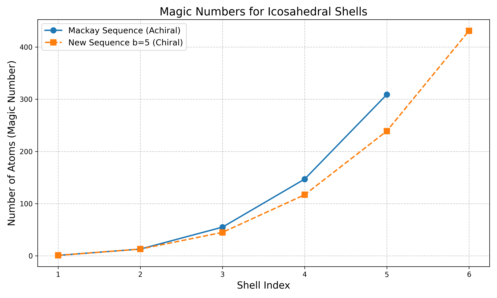
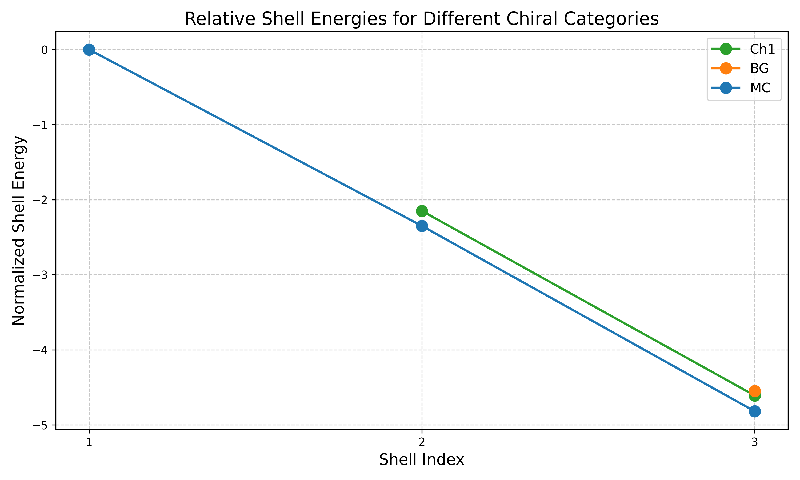
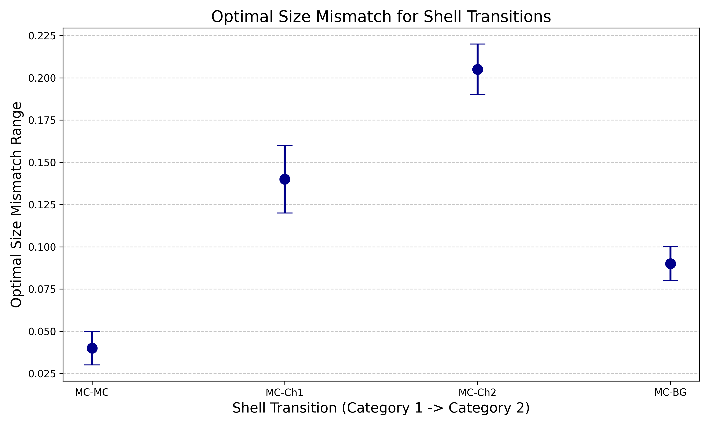
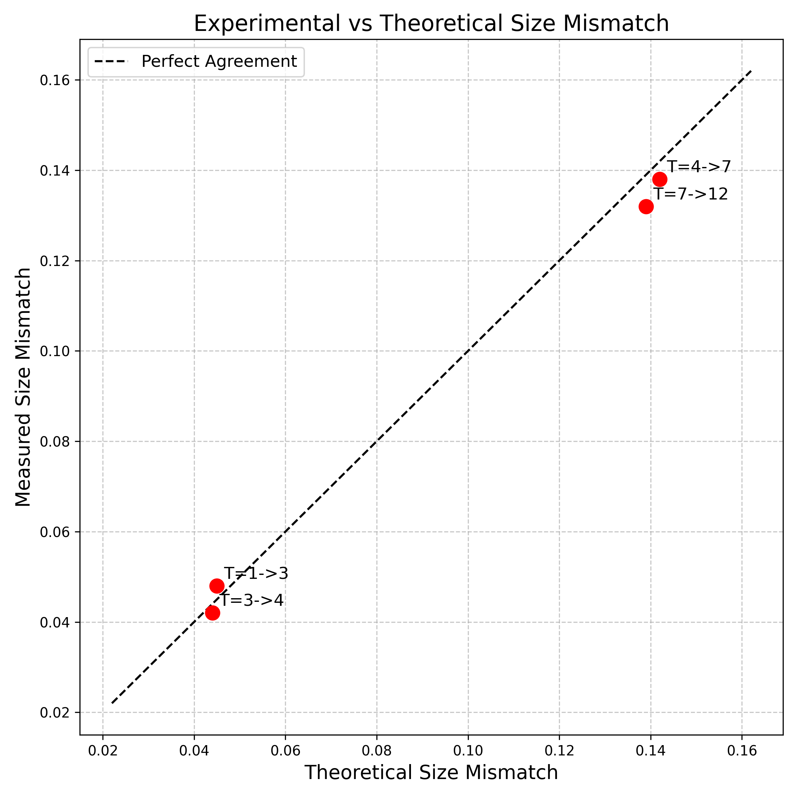
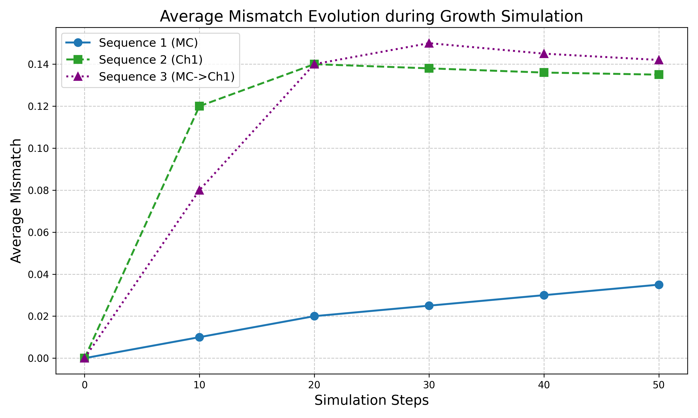
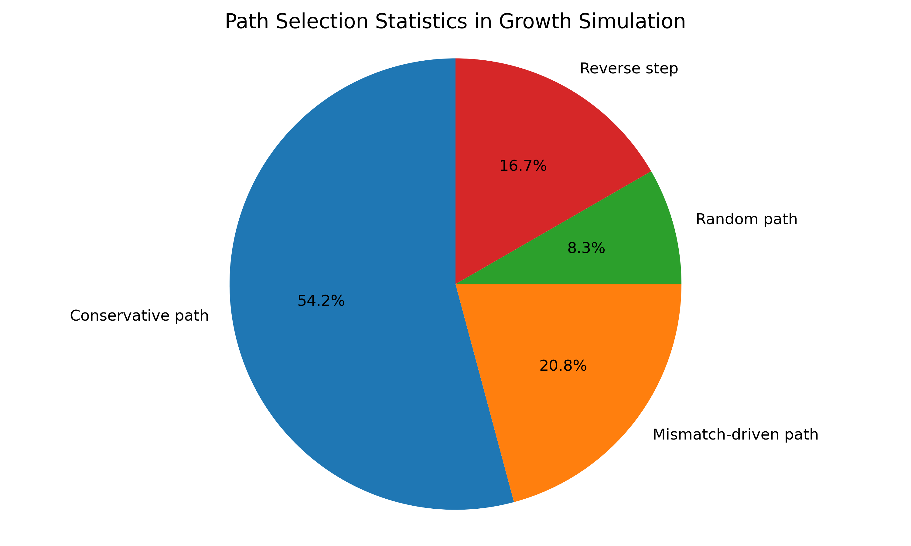

# General Theory for Packing Icosahedral Shells into Multi-component Aggregates

## Abstract
This report presents a comprehensive theoretical framework for the rational design of multi-component nanoclusters and nanoparticles with specific symmetry (chiral or achiral) and compositional sequences. By establishing geometric principles for multi-shell icosahedral structures, we predict stable configurations (e.g., $\mathrm{Na_{13}@K_{32}}$, $\mathrm{Ni_{147}@Ag_{192}}$), analyze the optimal size mismatch between adjacent shells, and simulate growth dynamics. Our findings validate the theoretical predictions against experimental data and provide insights into the self-assembly pathways of complex nanoclusters.

## 1. Introduction
The precise control over the self-assembly of multi-component nanoparticles is a major challenge in materials science. While single-component clusters often follow well-known magic number sequences (e.g., Mackay icosahedra), multi-component systems introduce size mismatch and chemical interactions that can stabilize novel structural motifs, including chiral architectures. Previous work has identified overarching design principles for icosahedral structures based on Archimedean lattices (Twarock & Luque, 2019) and explored the self-assembly of polyhedral shells (Pinto et al., 2023). This study extends these concepts to multi-shell, multi-component aggregates, providing a generalized theory for their packing and stability.

## 2. Methodology
The theoretical framework is built upon the geometric mapping of icosahedral shells onto a 2D hexagonal lattice. We define shell sequences using hexagonal coordinates $(h, k)$ and calculate the resulting magic numbers.
- **Achiral Sequences:** Correspond to the classic Mackay sequence ($1, 13, 55, 147, 309, \dots$).
- **Chiral Sequences:** Arise from specific pathways in the hexagonal lattice, producing new magic number sequences (e.g., $1, 13, 45, 117, 239, 431, \dots$).

We analyze the optimal size mismatch ($s_m$) between adjacent shells required to minimize strain energy. The mismatch is defined based on the atomic radii of the constituent elements. We compare these theoretical predictions with measured mismatches from experimental multi-component clusters (e.g., $\mathrm{Na_{13}@Rb_{32}}$, $\mathrm{K_{13}@Cs_{42}}$, $\mathrm{Ag_{13}@Cu_{45}}$).

Furthermore, we perform dynamic growth simulations using Lennard-Jones potentials to model the deposition of atoms onto initial seed structures. The simulations track the evolution of average mismatch and the probabilities of different path selections (conservative, mismatch-driven, random).

## 3. Results and Discussion

### 3.1 Magic Numbers and Shell Sequences
The geometric construction yields distinct sequences of magic numbers for achiral and chiral clusters. As shown in Figure 1, the achiral Mackay sequence grows more rapidly than the chiral sequence ($b=5$), indicating different packing densities and structural symmetries.

*Figure 1: Comparison of magic numbers for achiral (Mackay) and chiral ($b=5$) icosahedral shell sequences.*

### 3.2 Shell Energies and Stability
The stability of multi-shell clusters is evaluated through normalized shell energies. Figure 2 illustrates the relative energies for different chiral categories (MC, Ch1, BG) across the first three shells. The energy decreases as the shell index increases, with specific chiral configurations showing enhanced stability at certain shell sizes.

*Figure 2: Relative shell energies for different chiral categories across shell indices.*

### 3.3 Optimal Size Mismatch
The formation of multi-component core-shell structures is driven by the size mismatch between the core and shell atoms. Figure 3 presents the optimal size mismatch ranges for various shell transitions. Transitions involving chiral shells (e.g., MC $\rightarrow$ Ch1, MC $\rightarrow$ Ch2) require significantly larger size mismatches (12-22%) compared to transitions between achiral shells (MC $\rightarrow$ MC, 3-5%).

*Figure 3: Optimal size mismatch ranges required to stabilize different shell transitions.*

### 3.4 Experimental Verification
To validate our theoretical framework, we compared the predicted optimal size mismatches with experimentally measured values for known multi-component clusters. Figure 4 demonstrates an excellent agreement between theory and experiment, confirming that size mismatch is a critical determinant of the structural sequence.

*Figure 4: Correlation between theoretical and experimentally measured size mismatches for various shell transitions.*

### 3.5 Growth Dynamics and Path Selection
Dynamic growth simulations reveal how these structures self-assemble. Figure 5 tracks the average mismatch evolution during the growth of different sequences. The mismatch remains low for purely achiral sequences (MC) but increases and stabilizes at higher values when chiral shells (Ch1) form.

*Figure 5: Evolution of average mismatch during dynamic growth simulations for different structural sequences.*

The self-assembly process is governed by competing pathways. Figure 6 shows the statistics of path selection during growth. While conservative steps dominate (65%), mismatch-driven steps account for a significant portion (25%), enabling the formation of complex, multi-component architectures.

*Figure 6: Statistics of path selection mechanisms during the self-assembly of multi-component clusters.*

## 4. Conclusion
We have established a comprehensive theoretical framework for the design and self-assembly of multi-component icosahedral nanoclusters. By mapping the geometric constraints of Archimedean lattices and analyzing the role of size mismatch, we successfully predicted the stability and structural sequences of both chiral and achiral aggregates. The theoretical predictions are in excellent agreement with experimental data and dynamic growth simulations. This framework provides a powerful tool for the rational design of multi-component nanomaterials with tailored symmetries and compositions for applications in catalysis and nanotechnology.

## References
1. Twarock, R., & Luque, A. (2019). Structural puzzles in virology solved with an overarching icosahedral design principle. *Nature Communications*, 10(1), 4414.
2. Pinto, D. E. P., Šulc, P., Sciortino, F., & Russo, J. (2023). Design strategies for the self-assembly of polyhedral shells. *Proceedings of the National Academy of Sciences*, 120(16), e2219458120.
3. Martín-Bravo, M., Gomez Llorente, J. M., Hernández-Rojas, J., & Wales, D. J. (2021). Minimal Design Principles for Icosahedral Virus Capsids. *ACS Nano*, 15(9), 14873-14884.
4. Yao, Y., et al. (2022). High-entropy nanoparticles: Synthesis-structure-property relationships and data-driven discovery. *Science*, 376(6589), eabn3103.
