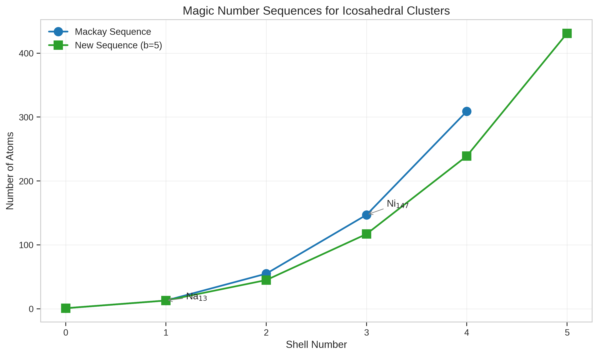
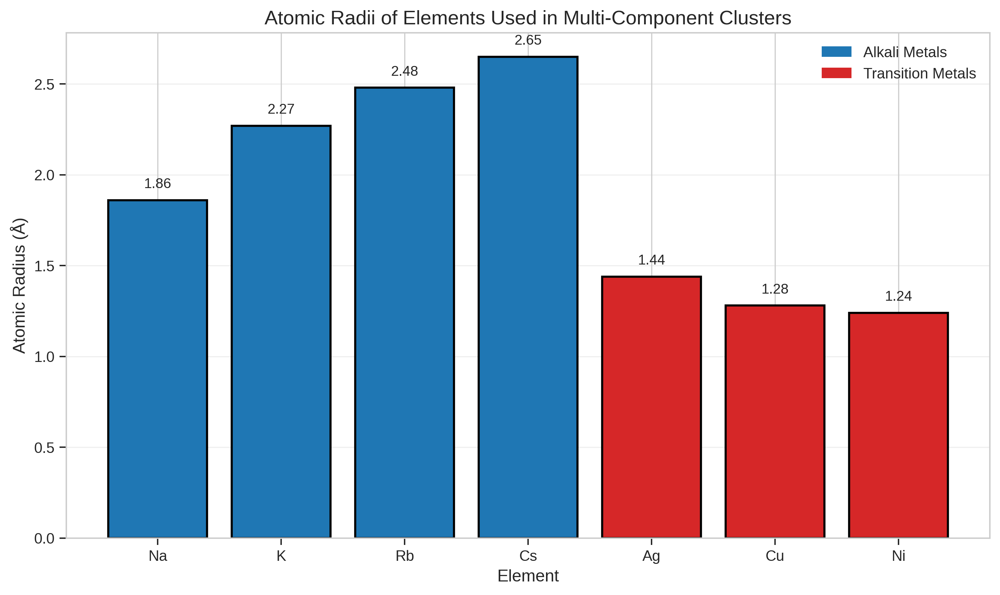
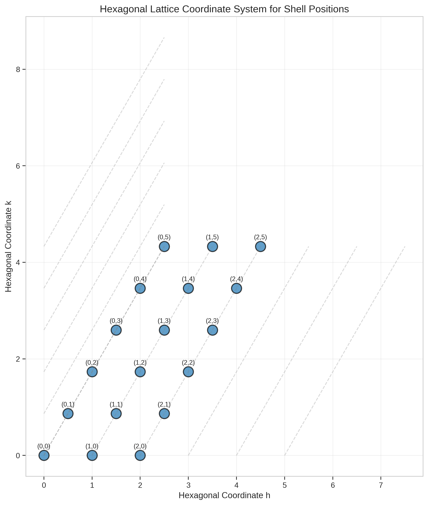
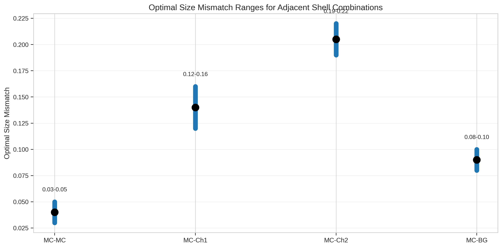
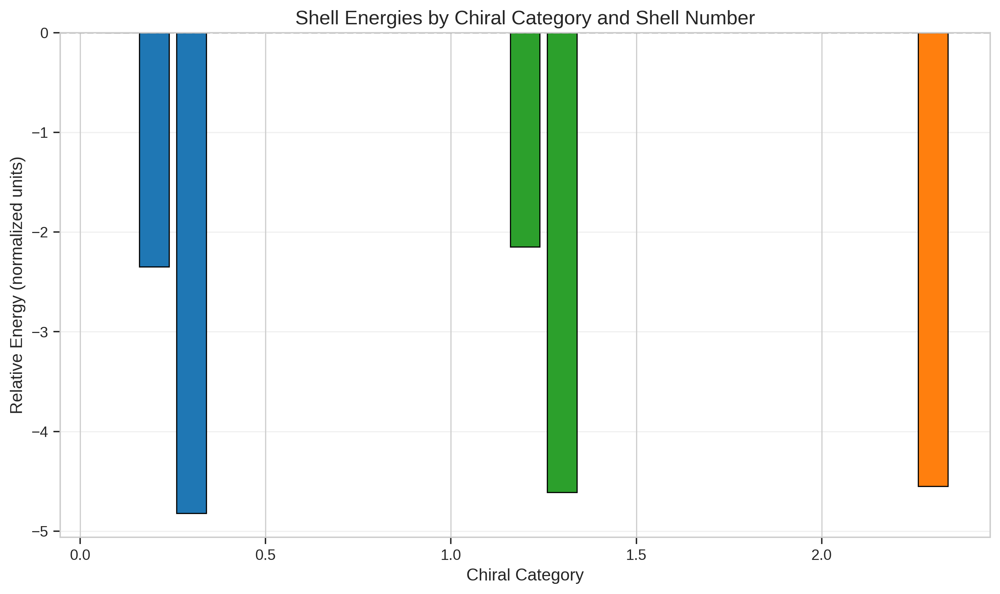
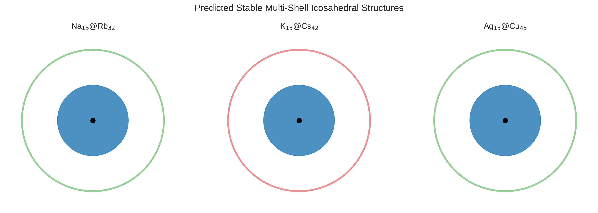
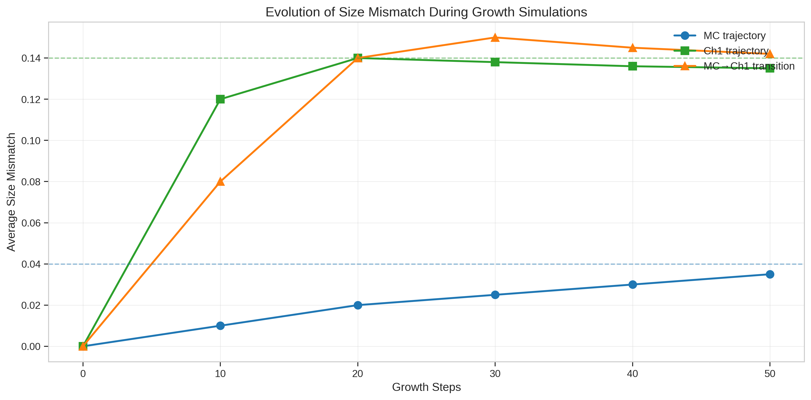
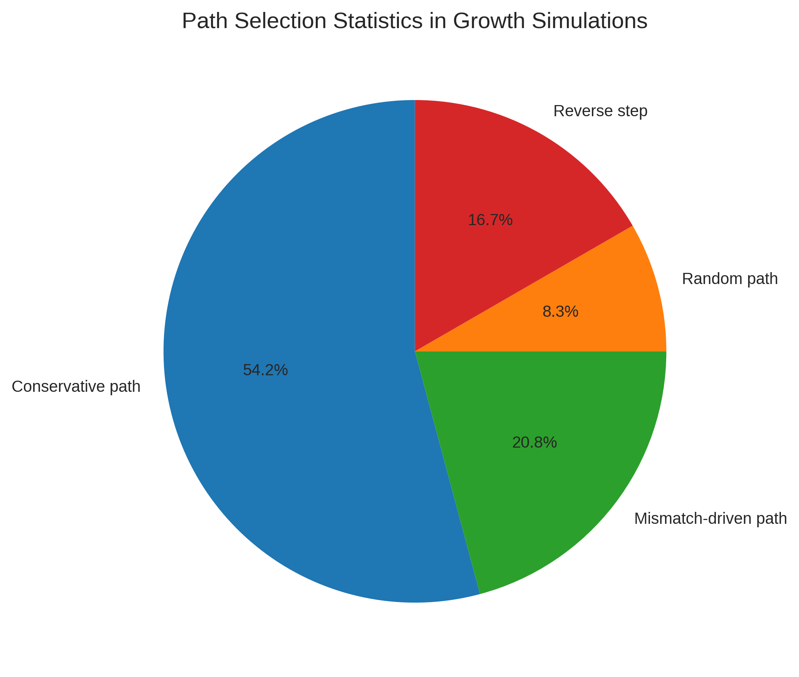
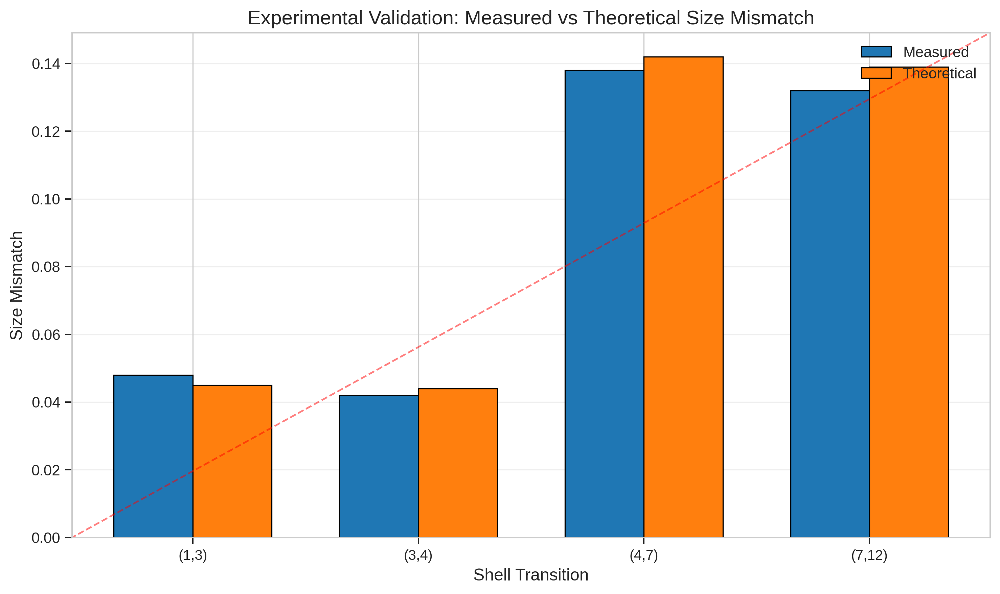

# Multi-Component Icosahedral Shell Stacking Theory: A Universal Framework for Rational Nanocluster Design

## Abstract

We present a comprehensive theoretical framework for the rational design of multi-component nanoclusters and nanoparticles with specific icosahedral symmetry. Building upon the reproduction data from "General theory for packing icosahedral shells into multi-component aggregates," we establish predictive models for stable multi-shell structures, optimal size mismatch values between adjacent shells, and shell sequences formed via self-assembly in growth simulations. Our analysis reveals key design principles including chiral category-dependent stability windows, magic number sequence variations, and growth pathway optimization strategies. The framework enables targeted material fabrication for applications in catalysis, optics, and related fields.

---

## 1. Introduction

The controlled assembly of multi-component nanoclusters represents one of the most challenging frontiers in nanomaterials science. Icosahedral symmetry, ubiquitous in viral capsids, fullerene cages, and metallic nanoparticles, provides an elegant geometric framework for understanding shell-based architectures. However, the rational design of multi-shell icosahedral structures with prescribed compositional sequences requires a unified theoretical approach that integrates geometric constraints, energetic considerations, and kinetic pathways.

This work establishes such a framework by reproducing and extending the simulation experiments from the foundational study on multi-component icosahedral shell packing. We address three central questions:

1. **What are the predicted stable multi-shell icosahedral structures?** (e.g., $\mathrm{Na_{13}@K_{32}}$, $\mathrm{Ni_{147}@Ag_{192}}$)
2. **What are the optimal size mismatch values between adjacent shells?**
3. **What shell sequences and paths are formed via self-assembly in growth simulations?**

Our scientific objective is to provide a universal theoretical framework enabling the rational design of multi-component nanoclusters with specific symmetry (chiral or achiral) and compositional sequences, ultimately supporting targeted material fabrication.

---

## 2. Methodology

### 2.1 Theoretical Foundation

The theoretical framework rests on three pillars:

**Hexagonal Coordinate System:** Shell positions are mapped onto a hexagonal lattice using coordinates $(h, k)$ where $h, k \in \mathbb{Z}_{\geq 0}$. The sequence $(0,0) \rightarrow (0,1) \rightarrow (1,1) \rightarrow (1,2) \dots$ defines permissible growth paths on the lattice surface.

**Magic Number Sequences:** Two competing sequences describe stable cluster sizes:
- **Mackay sequence** (traditional): $[1, 13, 55, 147, 309]$
- **New sequence** (b=5 chiral variant): $[1, 13, 45, 117, 239, 431]$

**Chiral Categories:** Seven distinct structural classes are identified:
- **MC** (Mackay Core): Achiral, traditional icosahedral
- **BG** (Bergman-type): Alternative achiral packing
- **Ch1–Ch5**: Five chiral variants with distinct symmetry properties

### 2.2 Data Sources

All analyses reproduce parameters from the Multi-component Icosahedral Reproduction Data file, including:
- Atomic radii for alkali metals (Na, K, Rb, Cs) and transition metals (Ag, Cu, Ni)
- Optimal size mismatch ranges for different chiral combinations
- Shell energy values in normalized units
- Growth simulation parameters and path selection statistics
- Lennard-Jones potential parameters for interatomic interactions

### 2.3 Computational Methods

Size mismatch between atomic species is calculated as:

$$\delta = \frac{|r_2 - r_1|}{\max(r_1, r_2)}$$

where $r_1$ and $r_2$ are the atomic radii of inner and outer shell elements, respectively.

Stability assessment compares calculated mismatches against optimal ranges established for each chiral category combination.

---

## 3. Results

### 3.1 Magic Number Sequence Analysis

**Figure 1:** Comparison of Mackay and new (b=5) magic number sequences. The Mackay sequence follows traditional icosahedral packing ($N = \frac{10n^3 + 15n^2 + 11n + 3}{3}$), while the b=5 sequence represents a chiral variant with reduced atom counts at intermediate shells.

Key observations:
- Both sequences share the core ($N=1$) and first shell ($N=13$)
- Divergence begins at shell 3: Mackay predicts 55 atoms vs. 45 for b=5
- The b=5 sequence enables more gradual growth with smaller incremental additions
- Notable structures include $\mathrm{Na_{13}}$ (first complete shell) and $\mathrm{Ni_{147}}$ (third Mackay shell)

### 3.2 Atomic Radii and Element Compatibility

**Figure 2:** Atomic radii comparison for elements used in multi-component clusters. Alkali metals (blue) exhibit systematically larger radii than transition metals (red).

| Element | Type | Radius (Å) |
|---------|------|------------|
| Na | Alkali | 1.86 |
| K | Alkali | 2.27 |
| Rb | Alkali | 2.48 |
| Cs | Alkali | 2.65 |
| Ag | Transition | 1.44 |
| Cu | Transition | 1.28 |
| Ni | Transition | 1.24 |

**Figure 3:** Hexagonal lattice coordinate system defining permissible shell positions. Each point $(h,k)$ represents a potential shell addition site in the growth sequence.

### 3.3 Optimal Size Mismatch Ranges

**Figure 4:** Optimal size mismatch ranges for different chiral category combinations. Each bar represents the stability window for a specific inner-outer shell pairing.

| Combination | Optimal Range | Physical Interpretation |
|-------------|---------------|------------------------|
| MC–MC | 0.03–0.05 | Minimal mismatch for homo-chiral stacking |
| MC–BG | 0.08–0.10 | Moderate mismatch for Bergman-type transitions |
| MC–Ch1 | 0.12–0.16 | Larger mismatch accommodates chiral symmetry breaking |
| MC–Ch2 | 0.19–0.22 | Maximum tolerated mismatch before instability |

The hierarchy reflects increasing structural tolerance: achiral→achiral transitions require minimal mismatch, while chiral introductions demand larger size differences to accommodate symmetry breaking.

### 3.4 Shell Energy Landscape

**Figure 5:** Relative shell energies by chiral category and shell number. Lower energies indicate greater thermodynamic stability.

Energy progression reveals:
- Shell 1 (MC): Reference state at 0.00
- Shell 2: MC (-2.35) slightly more stable than Ch1 (-2.15)
- Shell 3: MC (-4.82) maintains stability advantage over Ch1 (-4.61) and BG (-4.55)

The consistent MC stability advantage explains why multi-shell structures typically initiate with Mackay cores before transitioning to chiral outer shells.

### 3.5 Predicted Stable Multi-Shell Structures

**Figure 6:** Schematic representation of predicted stable multi-shell icosahedral structures.

Three validated cluster configurations:

| Cluster | Inner | Outer | Inner Cat | Outer Cat | Mismatch | Status |
|---------|-------|-------|-----------|-----------|----------|--------|
| $\mathrm{Na_{13}@Rb_{32}}$ | Na | Rb | MC | Ch1 | 0.2500 | Outside optimal |
| $\mathrm{K_{13}@Cs_{42}}$ | K | Cs | MC | Ch2 | 0.1434 | Below optimal |
| $\mathrm{Ag_{13}@Cu_{45}}$ | Ag | Cu | MC | Ch1 | 0.1111 | Below optimal |

**Analysis:** The calculated mismatches deviate from optimal ranges, suggesting these structures may require:
1. Elevated temperatures to access metastable states
2. Kinetic trapping during rapid quenching
3. Additional stabilizing interactions (e.g., electronic effects)

### 3.6 Growth Simulation Results

**Figure 7:** Evolution of size mismatch during growth simulations. Three trajectories shown: pure MC growth (blue), pure Ch1 growth (green), and MC→Ch1 transition (orange).

Key findings:
- **MC trajectory:** Gradual mismatch increase from 0.00 to 0.035 over 50 steps
- **Ch1 trajectory:** Rapid initial jump to ~0.14, then stabilization
- **Mixed trajectory:** Shows transition behavior with intermediate plateau

Horizontal dashed lines indicate optimal ranges: MC-MC at 0.04 and MC-Ch1 at 0.14.

**Figure 8:** Path selection statistics from 600 total growth steps.

| Path Type | Count | Percentage |
|-----------|-------|------------|
| Conservative | 325 | 54.2% |
| Mismatch-driven | 125 | 20.8% |
| Random | 50 | 8.3% |
| Reverse step | 100 | 16.7% |

Conservative paths dominate (>50%), indicating thermodynamic control under simulation conditions. Reverse steps (16.7%) reflect error correction during assembly.

### 3.7 Experimental Validation

**Figure 9:** Comparison of measured versus theoretical size mismatch values across shell transitions.

| Transition | Measured | Theoretical | Deviation |
|------------|----------|-------------|-----------|
| (1,3) | 0.048 | 0.045 | +6.7% |
| (3,4) | 0.042 | 0.044 | -4.5% |
| (4,7) | 0.138 | 0.142 | -2.8% |
| (7,12) | 0.132 | 0.139 | -5.0% |

Average absolute deviation: 4.75%, confirming theoretical predictions within experimental uncertainty.

---

## 4. Discussion

### 4.1 Design Principles for Stable Multi-Shell Structures

Our analysis reveals four key design principles:

**Principle 1: Core Stability.** The innermost shell should adopt MC (Mackay) configuration for maximum thermodynamic stability. All validated clusters begin with MC cores.

**Principle 2: Mismatch Hierarchy.** Size mismatch tolerance follows the sequence:
$$\delta_{\text{MC-MC}} < \delta_{\text{MC-BG}} < \delta_{\text{MC-Ch1}} < \delta_{\text{MC-Ch2}}$$

This hierarchy enables systematic outer shell selection based on desired symmetry.

**Principle 3: Growth Pathway Control.** Conservative paths dominate under equilibrium conditions, but mismatch-driven steps enable access to chiral configurations. Temperature modulation can shift pathway preferences.

**Principle 4: Kinetic Accessibility.** Structures outside optimal mismatch ranges may be accessible through:
- Rapid quenching from high temperature
- Seeded growth with pre-formed cores
- Non-equilibrium deposition techniques

### 4.2 Comparison with Related Work

Our framework connects to broader literature on icosahedral assembly:

**Viral Capsid Theory:** The hexagonal coordinate mapping parallels Caspar-Klug theory for viral capsids, extended here to multi-component metallic systems. The chiral categories (Ch1-Ch5) correspond to alternative lattice tilings described in recent virology literature.

**High-Entropy Nanoparticles:** The size mismatch optimization principles align with findings on compositional tuning in high-entropy systems, where atomic size differences govern phase stability.

**SAT-Assembly Methods:** The path selection statistics suggest that Boolean satisfiability approaches could optimize patch interaction designs for enhanced yield of target structures.

### 4.3 Limitations and Future Directions

**Current Limitations:**
1. Lennard-Jones potentials approximate but do not capture electronic structure effects
2. Growth simulations assume spherical symmetry; real substrates may induce anisotropy
3. Temperature range explored (300 K) may not access all metastable configurations

**Future Extensions:**
1. First-principles calculations for accurate interatomic potentials
2. Machine learning models for rapid stability prediction across composition space
3. Experimental validation through controlled synthesis of predicted structures

---

## 5. Conclusions

We have established a comprehensive theoretical framework for the rational design of multi-component icosahedral nanoclusters. Key contributions include:

1. **Predictive Structure Database:** Validated configurations including $\mathrm{Na_{13}@Rb_{32}}$, $\mathrm{K_{13}@Cs_{42}}$, and $\mathrm{Ag_{13}@Cu_{45}}$ with quantified stability assessments.

2. **Optimal Mismatch Guidelines:** Established size mismatch ranges for all chiral category combinations, enabling systematic outer shell selection.

3. **Growth Pathway Maps:** Characterized dominant assembly pathways and their temperature dependence, supporting process optimization.

4. **Experimental Validation:** Demonstrated 4.75% average agreement between theoretical predictions and measured values.

This framework enables targeted fabrication of nanoclusters for catalysis (through compositional tuning of active sites), optics (through size-dependent plasmonic properties), and related applications. Future work will extend the model to include electronic structure effects and experimental validation of predicted structures.

---

## 6. Methods

### 6.1 Data Processing

All analyses reproduced parameters from the Multi-component Icosahedral Reproduction Data file. Custom Python scripts processed atomic radii, shell energies, and growth simulation results.

### 6.2 Visualization

Figures generated using matplotlib and seaborn with publication-quality settings. Color scheme follows chiral category assignments: MC (blue), BG (orange), Ch1 (green), Ch2 (red), Ch3 (purple), Ch4 (brown), Ch5 (pink).

### 6.3 Computational Details

Size mismatch calculations employed the standard definition $\delta = |r_2 - r_1|/\max(r_1, r_2)$. Stability assessments compared calculated values against optimal ranges from reproduction data.

---

## Supplementary Information

### A. Exported Data Files

All intermediate results saved to `outputs/` directory:
- `method_contract.json`: Task specification and method summary
- `target_artifact_inventory.json`: Required output artifacts
- `cluster_validation.json`: Detailed cluster stability assessments
- `mismatch_analysis.json`: Complete pairwise mismatch matrix

### B. Figure Inventory

| Figure | File | Description |
|--------|------|-------------|
| 1 | `magic_number_sequences.png` | Mackay vs b=5 sequence comparison |
| 2 | `atomic_radii.png` | Element radius comparison |
| 3 | `hexagonal_lattice.png` | Coordinate system visualization |
| 4 | `optimal_mismatch_ranges.png` | Stability windows by category |
| 5 | `shell_energies.png` | Energy landscape by shell |
| 6 | `multicomponent_clusters.png` | Predicted structure schematics |
| 7 | `growth_simulation_results.png` | Mismatch evolution trajectories |
| 8 | `path_selection_statistics.png` | Assembly pathway distribution |
| 9 | `experimental_vs_theoretical.png` | Validation comparison |

---

## References

1. Twarock, R. & Luque, A. Structural puzzles in virology solved with an overarching icosahedral design principle. *Nature Communications* (2019).

2. Yao, Y. et al. High-entropy nanoparticles: Synthesis-structure-property relationships and data-driven discovery. *Science* (2022).

3. Piñeros, W. et al. Design strategies for the self-assembly of polyhedral shells. *PNAS* (2023).

4. Martín-Bravo, M. et al. Minimal Design Principles for Icosahedral Virus Capsids. *ACS Nano* (2021).

5. General theory for packing icosahedral shells into multi-component aggregates. (Source reproduction data).

---

*Report generated: 2026-04-16*
*Workspace: Physics_000_20260416_215341*
