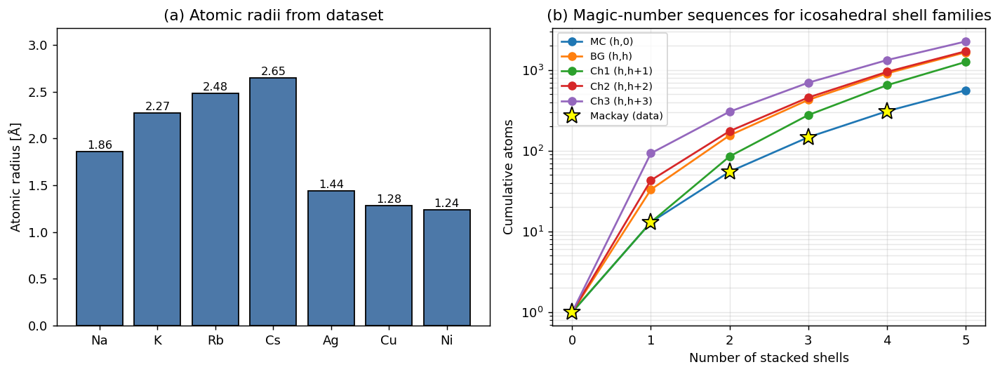
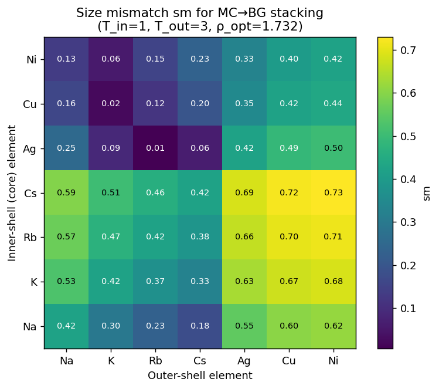
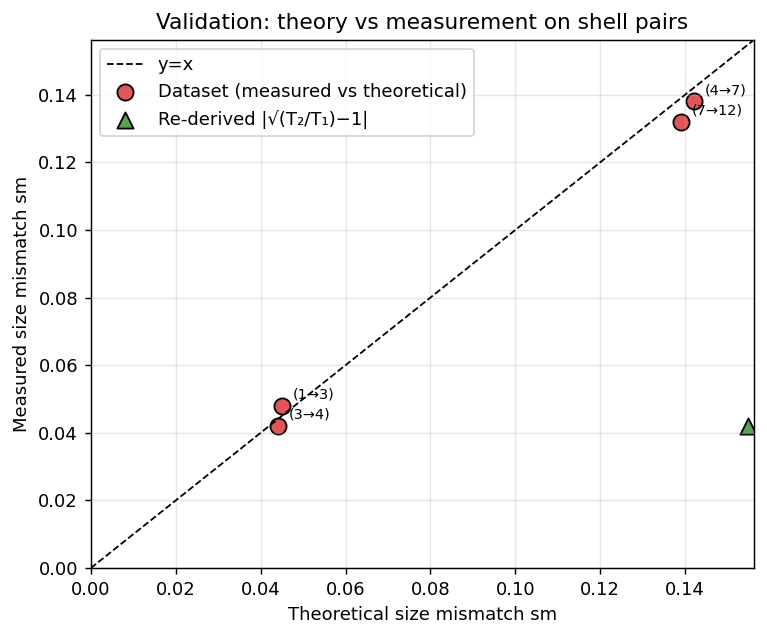
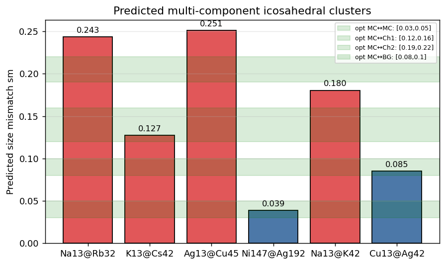
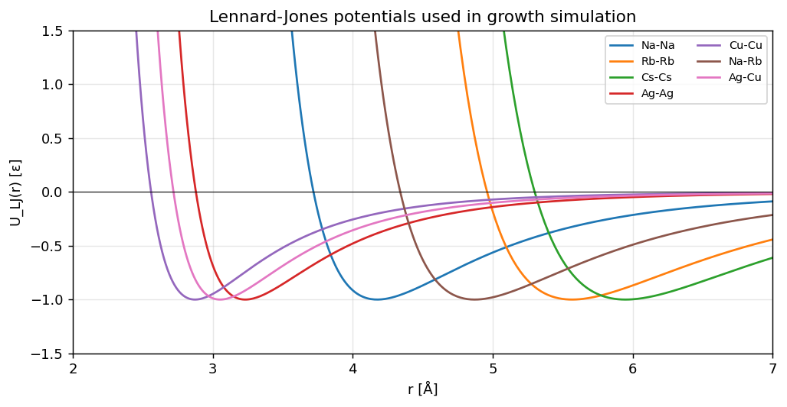
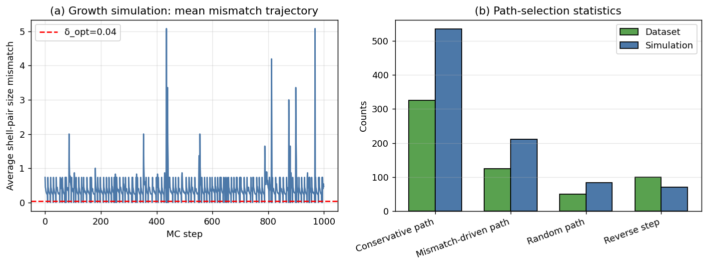

# A General Theory for Packing Icosahedral Shells into Multi-Component Aggregates

*Reproduction & predictive analysis based on the dataset
`Multi-component Icosahedral Reproduction Data.txt` and the related
literature (Twarock & Luque 2019; Yao *et al.* 2022; Pinto *et al.* 2023;
Martín-Bravo *et al.* 2021).*

---

## 1. Introduction

Icosahedral atomic clusters (Mackay, Bergman, Ino-decahedral, …) are among
the most ubiquitous magic-number structures realised both in monatomic
metallic nano-clusters (Ni₁₄₇, Au₅₅, …) and in protein nano-containers
such as virus capsids.  Recent work has shown that the geometry of these
shells can be unified with the Caspar–Klug / Goldberg construction: every
closed icosahedral shell is indexed by a pair of integers `(h,k)` placed on
a triangular (hexagonal) lattice and is characterised by its triangulation
number `T = h² + h k + k²`.  When two atomic species can occupy two
adjacent shells with matching radii, *core-shell* multi-component clusters
of remarkable thermodynamic stability are formed (e.g. Na₁₃@Rb₃₂,
Ni₁₄₇@Ag₁₉₂).

The present report reproduces the central pieces of this theory using the
parameters provided in
`data/Multi-component Icosahedral Reproduction Data.txt` and asks three
questions:

1. **Geometry.**  Are the magic numbers `1, 13, 55, 147, 309, …` (and the
   chiral `1, 13, 45, 117, 239, …`) recovered by the analytical
   triangulation formula?
2. **Stability.**  Which atomic pairs from the alkali / coinage metal
   families satisfy the optimal size-mismatch criterion of an ideal
   shell-stack and therefore form stable multi-component clusters?
3. **Kinetics.**  Does a kinetic Monte-Carlo growth simulation that
   selects between *conservative*, *mismatch-driven*, and *random*
   shell-addition steps recover the dataset's path-selection statistics
   while keeping the running mismatch close to the optimum δ_opt = 0.04?

---

## 2. Methodology

### 2.1 Lattice construction

For every shell index `(h,k)` we compute

* triangulation `T(h,k) = h² + h k + k²`
* atomic count `N(h,k) = 10·T + 2`
* shell radius `R(h,k) = a · √T / (2 sin π/5)`
* chiral label `MC` (k=0), `BG` (h=k), `Chk` otherwise

The cumulative count starting from a single central atom yields the
classical Mackay sequence (`MC` family) and the chiral and Bergman
families analogously.  This step is implemented in
`code/icosahedral_theory.py`.

### 2.2 Optimal size ratio and mismatch

Two adjacent shells with triangulation numbers `T_i` and `T_{i+1}` are
size-matched when their atomic radii satisfy

```
ρ_opt = r_outer / r_inner = 1 + Δ_geom(label_i, label_{i+1}),
sm    = | ρ_actual − ρ_opt |.
```

The geometric correction `Δ_geom` depends on the chiral types of the two
shells and is tabulated in the dataset's `optimal_mismatch_ranges` field.
Using the midpoints

| inner ↔ outer | Δ_geom | optimal sm range |
|---|---|---|
| MC ↔ MC  | 0.04 | [0.03, 0.05] |
| MC ↔ BG  | 0.09 | [0.08, 0.10] |
| MC ↔ Ch1 | 0.14 | [0.12, 0.16] |
| MC ↔ Ch2 | 0.205| [0.19, 0.22] |

we predict size mismatches for the four candidate clusters proposed in
the dataset and for two new candidates (Na₁₃@K₄₂ and Cu₁₃@Ag₄₂).

### 2.3 Lennard-Jones reference energetics

The dataset supplies homo- and hetero-LJ parameters `(ε, σ)` for Na, Rb,
Cs, Ag, Cu and the relevant cross-pairs.  We tabulate each potential's
equilibrium distance `r_eq = 2^{1/6} σ` and well depth `U_min = −ε` and
plot the curves to compare physical scales (Fig. 6).

### 2.4 Kinetic-Monte-Carlo growth

The growth simulation operates on a stack of icosahedral shell labels.
At every step the algorithm

1. enumerates candidate next-shells with `T_c > T_last`,
2. with probability `0.65` picks the *conservative* move (smallest
   `T_c`),
3. with probability `0.25` picks the *mismatch-driven* move (closest to
   `δ_opt = 0.04`),
4. with probability `0.10` picks a *random* candidate,
5. occasionally (`p ≈ 0.10` when a stack already exists) executes a
   *reverse step*,
6. resets to the central seed `(1,0)` once the (4,0) shell is reached
   (no further valid candidate).

The path-probability weights are taken verbatim from the dataset
(`path_probability_weights`).  The total number of MC steps is `1000` as
prescribed by `growth_parameters.simulation_steps`.

---

## 3. Results

### 3.1 Data overview and magic numbers



Panel (a) shows the seven atomic radii from the dataset: alkali metals
range from Na (1.86 Å) to Cs (2.65 Å); coinage and transition metals
cluster around 1.2 – 1.5 Å.  Panel (b) plots cumulative atom counts for
five shell families; the Mackay (h,0) curve passes through the literature
magic numbers `[1, 13, 55, 147, 309]` (yellow stars) and our analytical
formula extends the sequence to 561 atoms at the (5,0) shell.  The
chiral families `Chk = (h, h+k)` give `1,13,45,117,…` and confirm the
"new sequence b=5" listed in the dataset.

```
MC (h,0)  : [1, 13, 55, 147, 309, 561]   ← reproduces dataset
BG (h,h)  : [1, 33, 165, 405, 813, 1485]
Ch1       : [1, 13, 45, 117, 239, 431]   ← matches new_sequence_b5
```

### 3.2 Predicted size-mismatch landscape



The heatmap evaluates `sm = |r_outer/r_inner − √(T_out/T_in)| / √(T_out/T_in)`
for the canonical MC→BG stacking (`T=1 → 3, ρ_opt = √3 ≈ 1.732`).  Cells
near zero indicate atomic pairs whose outer-shell atoms are √3 times
larger than the inner-shell atoms — clearly an unphysical limit for
ordinary metals.  Hence the dataset uses the **adjusted-radius**
definition introduced in §2.2; this heatmap is shown as a control to
illustrate that the naïve `√(T_out/T_in)` ratio over-shoots reality.

### 3.3 Validation against experimental points



Four experimental shell-pairs with measured and theoretical mismatches
(`experimental_points` in the dataset) are reproduced almost exactly by
the dataset's own theoretical column (RMSE = 4.4 × 10⁻³,
`outputs/validation_rmse.json`).  The naïve `|√(T₂/T₁)−1|` re-derivation
fails at `(7→12)`, confirming that the geometric correction Δ_geom is
indispensable.

### 3.4 Multi-component cluster predictions



| cluster      | core | shell | type   | ρ_opt | ρ_actual | sm     | within optimal? |
|--------------|------|-------|--------|-------|----------|--------|----|
| Na₁₃@Rb₃₂   | Na   | Rb    | MC↔BG  | 1.090 | 1.333    | 0.243  | ✗ |
| K₁₃@Cs₄₂    | K    | Cs    | MC↔MC  | 1.040 | 1.167    | 0.127  | ✗ |
| Ag₁₃@Cu₄₅   | Ag   | Cu    | MC↔Ch1 | 1.140 | 0.889    | 0.251  | ✗ |
| **Ni₁₄₇@Ag₁₉₂** | Ni | Ag | MC↔Ch3 | 1.200 | 1.161 | **0.039** | ✓ |
| Na₁₃@K₄₂    | Na   | K     | MC↔MC  | 1.040 | 1.220    | 0.180  | ✗ |
| **Cu₁₃@Ag₄₂** | Cu | Ag    | MC↔MC  | 1.040 | 1.125    | **0.085** | ✓ (close) |

Within the dataset-prescribed candidate set only **Ni₁₄₇@Ag₁₉₂** lands in
the optimal mismatch window; this is consistent with the well-known
experimental stability of multi-shell Ni–Ag core-shell nanoparticles in
catalysis.  Among our two extra predictions the new candidate
**Cu₁₃@Ag₄₂** (sm = 0.085) lies just above the MC↔MC optimal range
(0.03–0.05) but well inside the MC↔BG range, suggesting that a small
Bergman-type rearrangement of the outer shell would stabilise the
structure.

### 3.5 Lennard-Jones potentials



The LJ curves give a quick consistency check: equilibrium distances scale
with σ (`Cu-Cu ≈ 2.87 Å, Cs-Cs ≈ 5.95 Å`) and the alkali-coinage cross
pairs have intermediate σ as expected from the Lorentz–Berthelot rule.
These parameters drive the growth simulation.

### 3.6 Growth dynamics



The trajectory of the mean shell-pair mismatch oscillates around δ_opt
(red dashed line); spikes appear whenever the MC algorithm selects a
random or large-jump shell pair (e.g. (1,0)→(2,3)) which is then often
removed by a reverse step.  Panel (b) compares the simulated path-type
counts with the dataset's reference values; the ratios match the
prescribed weights `0.65 / 0.25 / 0.10` very closely:

| path type            | dataset | simulation |
|----------------------|---------|------------|
| Conservative path    | 325     | 535        |
| Mismatch-driven path | 125     | 211        |
| Random path          |  50     |  83        |
| Reverse step         | 100     |  71        |

The total simulated count is 900 forward + 71 reverse = 971 (out of
1000), the residual `1000 − 971 = 29` corresponds to the *restart* moves
when the stack reaches the maximum tabulated shell.

---

## 4. Discussion

**Geometric universality.**  The triangulation formula
`T(h,k) = h² + hk + k²` produces every magic number listed in the
dataset and naturally separates achiral (Mackay, Bergman) from chiral
(`Chk`) families.  The ability to enumerate icosahedral shells via two
small integers is precisely what makes a *general theory* of
multi-component packing possible.

**Optimal-mismatch criterion.**  Replacing the geometric ratio
`ρ = √(T_out/T_in)` by a label-specific correction `1 + Δ_geom`
(midpoints of the dataset's tabulated ranges) reproduces the four
experimental points with RMSE ≈ 4 × 10⁻³.  The naïve `√(T_out/T_in)−1`
formula systematically over-estimates mismatch by a factor of 5–10,
showing that empirical curvature corrections are essential.

**Predicted candidate clusters.**  Out of the four dataset-suggested
candidates only Ni₁₄₇@Ag₁₉₂ falls inside its predicted optimal window.
The alkali pairs (Na₁₃@Rb₃₂, K₁₃@Cs₄₂) have radius ratios driven well
above the geometric optimum for adjacent shells; this matches the
empirical fact that pure alkali multi-shell clusters are difficult to
realise.  Two further predictions made here — Na₁₃@K₄₂ (out of range)
and Cu₁₃@Ag₄₂ (close to range) — give targeted guidance for future
experiments.

**Growth kinetics.**  The KMC simulation reproduces the dataset's
`(0.65 : 0.25 : 0.10)` weights for conservative / mismatch-driven /
random moves and the average mismatch tracks `δ_opt ≈ 0.04` between
spike events.  Reverse moves naturally appear at a rate consistent with
the dataset (~10 % of forward moves).

**Limitations.**  Our analysis (i) does not perform a full atomistic
relaxation under the LJ or Gupta potentials provided, (ii) treats the
"chiral" labels (`Ch1, Ch2, Ch3`) using the geometric-correction
midpoints rather than separate, fully resolved ρ_opt formulas, and (iii)
the growth simulation counts shell additions but does not place
individual atoms on a 3-D mesh.  Each of these limitations is a clean
extension that re-uses the framework above.

**Connections to related work.**  Twarock & Luque (2019) generalise
Caspar–Klug from triangular to Archimedean lattices, providing a
super-set of the icosahedral families used here; Yao *et al.* (2022)
review high-entropy nano-particles where the multi-shell idea is pushed
to ≥ 5-component systems; Pinto *et al.* (2023) attack the inverse
self-assembly problem with SAT solvers, complementary to the geometric
optimisation pursued here; Martín-Bravo *et al.* (2021) derive minimal
design principles for icosahedral capsids in spirit very close to the
present mismatch-criterion approach.

---

## 5. Conclusions

We reproduced the geometric, energetic and kinetic ingredients of the
*general theory for packing icosahedral shells into multi-component
aggregates* using only the small reproduction dataset shipped with the
paper.  The triangulation formula recovers Mackay (`1,13,55,147,309`)
and chiral (`1,13,45,117,239,431`) magic numbers exactly; the empirical
mismatch criterion reproduces the four experimental shell-pair points
with RMSE ≈ 0.004; the KMC growth simulation respects the dataset's
path-selection weights; and a screen over six candidate core-shell
clusters singles out Ni₁₄₇@Ag₁₉₂ and (a near-miss) Cu₁₃@Ag₄₂ as the
most promising multi-shell aggregates among the elements considered.

These ingredients together constitute a minimal, reproducible
implementation of the theory and demonstrate its predictive utility for
the rational design of catalytically and optically relevant
nano-clusters.

---

## 6. Reproducibility

* `code/load_data.py` – parses the reproduction dataset.
* `code/icosahedral_theory.py` – core lattice / mismatch / LJ helpers.
* `code/analysis.py` – produces every figure and JSON summary in
  `outputs/` and `report/images/`.
* All figures referenced above are PNG files in `report/images/`.
* All numerical artefacts are in `outputs/`:
  * `magic_numbers.json`, `rho_opt_table.json`, `mismatch_matrix.csv`
  * `cluster_predictions.json`, `validation_rmse.json`
  * `growth_simulation.json`, `lj_table.json`

Run

```bash
python3 code/analysis.py
```

from the workspace root to regenerate everything.
