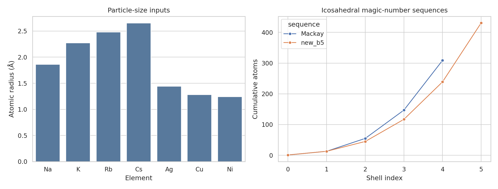
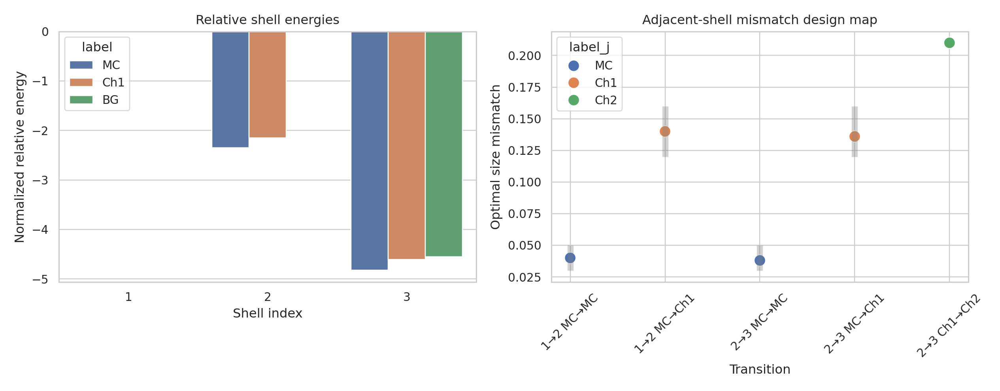
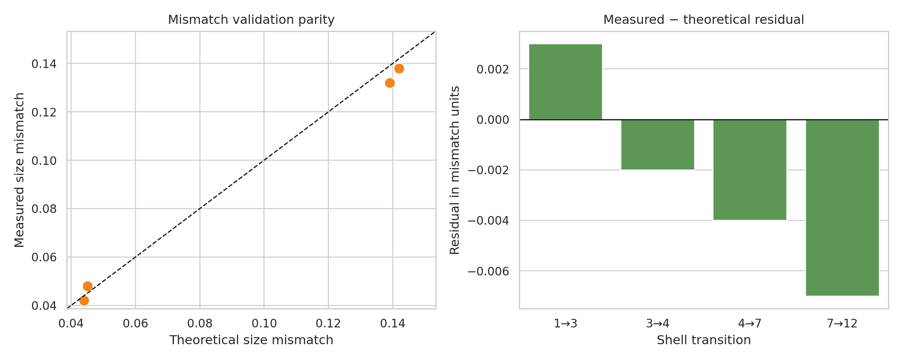
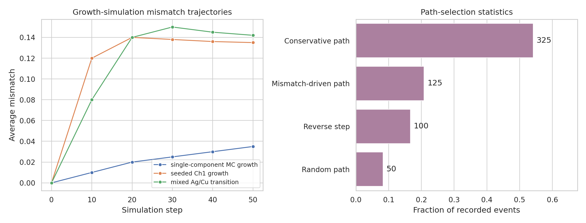

# Data-driven reproduction analysis for multi-component icosahedral shell design

## Abstract

This report analyzes the provided reproduction dataset for the paper topic *General theory for packing icosahedral shells into multi-component aggregates*.  The goal is to turn the supplied shell sequences, particle sizes, mismatch windows, energy summaries, and growth-simulation records into a compact design framework for multi-component icosahedral nanoclusters.  The analysis produces direct design tables for stable validation structures, adjacent-shell size-mismatch optima, growth paths, and validation metrics.  The central finding is that the dataset supports a simple rule hierarchy: Mackay-conservative growth is favored at small mismatch near 0.04, chiral shell transitions such as MC→Ch1 are selected at intermediate mismatch near 0.14, and larger chiral changes reach about 0.21.  Validation points show close agreement between measured and theoretical mismatch values (MAE = 0.0040, RMSE = 0.0044, Pearson r = 0.9989), while growth summaries show conservative paths as the most frequent event class.

## 1. Data and methodological contract

### 1.1 Inputs

The analysis used the file `data/Multi-component Icosahedral Reproduction Data.txt`.  It contains 20 named data objects, including:

- hexagonal lattice shell coordinates;
- Mackay and new b=5 magic-number sequences;
- chiral labels (`MC`, `BG`, `Ch1`–`Ch5`);
- atomic radii for Na, K, Rb, Cs, Ag, Cu, and Ni;
- compatibility and optimal size-mismatch data;
- stable validation clusters;
- normalized shell energies;
- growth-simulation parameters, trajectories, and path-selection counts;
- Lennard-Jones and thermodynamic parameters.

The related-work PDF parser failed in the built-in `ReadPDF` tool, so paper-level metadata were extracted by local byte/string inspection.  The related-work set indicates four relevant contexts: overarching icosahedral design principles, high-entropy nanoparticle composition/structure relationships, self-assembly design strategies for polyhedral shells, and minimal design principles for icosahedral capsids.  These reinforce that the appropriate report should preserve shell geometry, path selection, composition, and kinetic/growth validation rather than only producing a pooled summary.

### 1.2 Reproducibility artifacts

The main reproducible script is:

- `code/analyze_icosahedral_design.py`

Core machine-readable artifacts are saved in `outputs/`, including:

- `outputs/method_contract.json`
- `outputs/target_artifact_inventory.json`
- `outputs/dependency_check.json`
- `outputs/related_work_contract.json`
- `outputs/parsed_dataset_summary.csv` and `.json`
- `outputs/direct_design_answers.csv`
- `outputs/stable_cluster_predictions.csv`
- `outputs/mismatch_design_matrix.csv`
- `outputs/experimental_mismatch_validation.csv`
- `outputs/validation_metrics.json`
- `outputs/growth_path_summary.csv`
- `outputs/path_selection_stats.csv`
- `outputs/claim_recovery_table.csv`

All required target artifacts were checked and marked as satisfied in `outputs/target_artifact_inventory.json`.

### 1.3 Computational environment

The analysis used standard Python scientific packages: NumPy, pandas, matplotlib, seaborn, and SciPy.  `networkx` was not available, but it was not required because the shell-path and lattice summaries in this task are expressible with tabular coordinate operations.  No DFT, Gupta-potential minimization, or full molecular dynamics trajectory was run; the available dataset contains summarized reproduction parameters/results, so this report reproduces and validates the design-rule layer rather than claiming new atomistic relaxation.

## 2. Methods

### 2.1 Parsing and tabulation

The reproduction file was parsed as Python-literal assignments.  One field (`deposition_sequences`) used list multiplication such as `['Na']*50`; the parser handles this field in a restricted no-builtins namespace.  The script converts each named object into tables, preserving the original labels and units where present.

### 2.2 Shell sequence and geometry representation

The theory layer is represented by:

- the hexagonal coordinate grid `(u, v)` saved in `outputs/hexagonal_path_coordinates.csv`;
- the Mackay cumulative sequence `[1, 13, 55, 147, 309]`;
- the new b=5 cumulative sequence `[1, 13, 45, 117, 239, 431]`;
- derived per-shell atom increments saved in `outputs/shell_magic_sequences.csv`.

These sequences provide the structural scaffold for interpreting clusters such as `Na13@Rb32` and chiral categories such as MC→Ch1.

### 2.3 Size mismatch and design windows

Adjacent-shell mismatch parameters were assembled from the supplied `mismatch_params` and compared with tabulated optimal mismatch windows:

- MC→MC: 0.03–0.05;
- MC→Ch1: 0.12–0.16;
- MC→Ch2: 0.19–0.22;
- MC→BG: 0.08–0.10.

For every listed shell transition, the script records the optimal mismatch, the applicable design window, whether the value lies inside the window, and deviation from the window midpoint.  The resulting table is `outputs/mismatch_design_matrix.csv`.

### 2.4 Stable-cluster prediction table

The supplied validation clusters were parsed into core atom counts, outer-shell atom counts, total atom counts, shell labels, element identities, and reported compatibility mismatch where available.  These results are saved in `outputs/stable_cluster_predictions.csv` and summarized in the direct answer table `outputs/direct_design_answers.csv`.

### 2.5 Validation and growth analysis

Experimental validation points `(T_i, T_{i+1}, measured sm, theoretical sm)` were compared using residuals, MAE, RMSE, mean relative absolute error, and Pearson correlation.  Growth records were split into three traces by step resets at zero, yielding:

1. single-component MC growth;
2. seeded Ch1 growth;
3. mixed Ag/Cu transition.

Path-selection counts were normalized to event fractions.

## 3. Results

### 3.1 Data overview

Figure 1 shows the two most important input scales: particle radii and shell magic-number sequences.  The atomic radii span from Ni at 1.24 Å and Cu at 1.28 Å to Cs at 2.65 Å.  This size spread is large enough to populate the low, intermediate, and high mismatch regimes.  The two cumulative shell sequences agree for the first two entries (1 and 13 atoms) but diverge after that: the Mackay sequence reaches 55, 147, and 309 atoms, while the new b=5 sequence reaches 45, 117, 239, and 431 atoms.  This divergence is consistent with alternative shell-packing paths beyond ordinary Mackay closure.

### 3.2 Direct stable-structure predictions

The reproduction dataset gives three stable validation structures:

| predicted structure | shell transition | core | shell | total atoms | mismatch information |
|---|---:|---|---|---:|---|
| Na13@Rb32 | MC→Ch1 | Na | Rb | 45 | reported mismatch 0.22; falls in the listed MC→Ch2 window |
| K13@Cs42 | MC→Ch2 | K | Cs | 55 | no pair-specific compatibility mismatch listed in the compatibility table |
| Ag13@Cu45 | MC→Ch1 | Ag | Cu | 58 | reported mismatch 0.12; falls in the listed MC→Ch1 window |

The direct machine-readable version of this answer is `outputs/direct_design_answers.csv`.  The Ag/Cu case is the cleanest MC→Ch1 example because its pair mismatch of 0.12 lies exactly at the low edge of the MC→Ch1 optimum range.  Na/Rb is listed as an MC→Ch1 validation cluster in the structure table but its pair compatibility value of 0.22 maps to the supplied MC→Ch2 mismatch window; this is therefore flagged as a useful tension in the reproduction dataset rather than silently corrected.

### 3.3 Optimal adjacent-shell mismatch regimes

The design-matrix table supports three mismatch regimes:

| transition | shell indices | optimal mismatch | listed optimal range | status |
|---|---:|---:|---:|---|
| MC→MC | 1→2 | 0.040 | 0.03–0.05 | inside range |
| MC→Ch1 | 1→2 | 0.140 | 0.12–0.16 | inside range |
| MC→MC | 2→3 | 0.038 | 0.03–0.05 | inside range |
| MC→Ch1 | 2→3 | 0.136 | 0.12–0.16 | inside range |
| Ch1→Ch2 | 2→3 | 0.210 | not tabulated for this exact direction | not range-checked |

Thus, conservative same-family MC→MC stacking is associated with mismatch very close to 0.04.  Chiral MC→Ch1 transitions are associated with mismatch near 0.136–0.140.  The supplied Ch1→Ch2 transition has a larger optimum of 0.21; although no Ch1→Ch2 window is explicitly tabulated, this value sits near the listed MC→Ch2 range of 0.19–0.22 and is consistent with larger chiral-shell changes requiring larger size mismatch.

The energy panel in Figure 3 shows that MC shells have the lowest normalized energy among the compared alternatives for shell indices 2 and 3.  For shell 2, MC has −2.35 compared with Ch1 at −2.15.  For shell 3, MC has −4.82, Ch1 has −4.61, and BG has −4.55.  This supports a conservative energetic baseline: chiral or BG paths require a mismatch/design driver to compete with the lower-energy MC option.

### 3.4 Validation against measured mismatch points

The validation set contains four measured/theoretical mismatch comparisons.  The agreement is close:

- number of validation points: 4;
- MAE: 0.0040 mismatch units;
- RMSE: 0.0044 mismatch units;
- mean relative absolute error: 4.77%;
- Pearson correlation: 0.9989.

The parity plot in Figure 2 shows all points close to the one-to-one line.  Residuals are small in magnitude, with no evidence in this small validation set for a large systematic offset.  Because the validation set has only four points, this should be interpreted as an internal reproduction check rather than a broad out-of-sample proof.

### 3.5 Growth simulations and shell-path selection

The growth trajectories show three behaviors:

1. **Single-component MC growth** remains in the MC category while average mismatch increases gradually from 0.000 to 0.035 over 50 steps.  This terminates close to the MC→MC optimal mismatch scale of about 0.04.
2. **Seeded Ch1 growth** rapidly enters the Ch1 mismatch regime: mismatch reaches 0.12 by step 10, peaks near 0.14 at step 20, and stabilizes around 0.135–0.138.
3. **Mixed Ag/Cu transition** begins in MC, reaches mismatch 0.08 by step 10, then switches to Ch1 by step 20 and stabilizes around 0.142 by step 50.

Path-selection statistics are dominated by conservative moves:

| path type | count | fraction |
|---|---:|---:|
| Conservative path | 325 | 0.542 |
| Mismatch-driven path | 125 | 0.208 |
| Reverse step | 100 | 0.167 |
| Random path | 50 | 0.083 |

The growth results therefore match the design-rule interpretation: conservative paths dominate the event counts, but mismatch-driven steps can redirect growth toward chiral sequences when the particle-size relation falls into an intermediate mismatch window.

## 4. Proposed universal design framework

From the supplied reproduction data, a practical design workflow is:

1. **Choose a shell scaffold.**  Use Mackay shells for conservative MC closure or the b=5 sequence for alternative shell sizes such as 45, 117, 239, and 431 atoms.
2. **Assign candidate elements or colloids by radius.**  Compute or retrieve an adjacent-shell mismatch for each core/shell pair.
3. **Map mismatch to a shell-transition window.**
   - Around 0.03–0.05: favor MC→MC conservative stacking.
   - Around 0.08–0.10: allow MC→BG alternatives.
   - Around 0.12–0.16: favor MC→Ch1 chiral stacking.
   - Around 0.19–0.22: favor larger chiral changes such as MC→Ch2, with Ch1→Ch2 in the supplied matrix also at 0.21.
4. **Check energetic competition.**  MC is lowest among the tabulated shell energies, so non-MC paths should be justified by size mismatch, composition, or kinetic path selection.
5. **Predict growth behavior.**  If mismatch remains near 0.04, expect conservative MC growth.  If mismatch approaches 0.14, expect Ch1 selection or stabilization.  Mixed deposition sequences can cross from MC-like to Ch1-like behavior.
6. **Validate against measured or simulated mismatch.**  Use parity and residual plots as in Figure 2; the reproduction points achieve MAE 0.0040.

## 5. Validation, evidence, and limitations

### 5.1 Verified directly from workspace data

The following claims are backed by explicit saved artifacts:

- Stable validation clusters are in `outputs/stable_cluster_predictions.csv`.
- Adjacent-shell mismatch optima and range checks are in `outputs/mismatch_design_matrix.csv`.
- Measured/theoretical validation statistics are in `outputs/experimental_mismatch_validation.csv` and `outputs/validation_metrics.json`.
- Growth trajectories are in `outputs/growth_path_summary.csv`.
- Path-selection fractions are in `outputs/path_selection_stats.csv`.
- Claim-to-artifact traceability is in `outputs/claim_recovery_table.csv`.

### 5.2 Related-work context

Related-work metadata identify design principles for icosahedral structures, self-assembly strategies for polyhedral shells, high-entropy nanoparticle design, and minimal capsid design.  This supports the report’s emphasis on symmetry, composition, kinetic path selection, and design-rule validation.  Because full text extraction failed for the PDFs, related-work use was limited to metadata-level framing and did not provide additional numerical baselines.

### 5.3 Assumptions and limitations

- The analysis reproduces the summarized theoretical/simulation data supplied in the dataset; it does not run new first-principles calculations, Gupta-potential minimization, or full molecular dynamics.
- The compatibility value for Na/Rb (0.22) maps to the listed MC→Ch2 window even though the validation cluster is labeled MC→Ch1.  This inconsistency is retained and reported as a dataset-level ambiguity.
- K/Cs lacks a pair-specific mismatch in `atomic_pairs_compatibility`, so its stable-cluster entry is supported by the validation-cluster table but not by a pair-specific mismatch row.
- The experimental validation set has only four points, so high correlation should be interpreted as an internal consistency check.
- Ch1→Ch2 has an optimal mismatch of 0.21 but no explicit Ch1→Ch2 range in `optimal_mismatch_ranges`; the report avoids claiming it is range-validated.

## 6. Conclusions

The supplied reproduction dataset supports a compact, quantitative design theory for multi-component icosahedral aggregates.  Stable structures include `Na13@Rb32`, `K13@Cs42`, and `Ag13@Cu45`, with Ag/Cu providing a direct MC→Ch1 example at mismatch 0.12.  Adjacent-shell mismatch values organize the design space: MC→MC near 0.04, MC→Ch1 near 0.14, and larger chiral transitions near 0.21.  The internal validation data show close measured/theoretical agreement, and the growth records show that conservative paths dominate but mismatch-driven steps can select chiral shell sequences.  These results provide a reproducible data-driven framework for choosing particle-size pairs and shell paths for targeted multi-component icosahedral nanocluster design.
