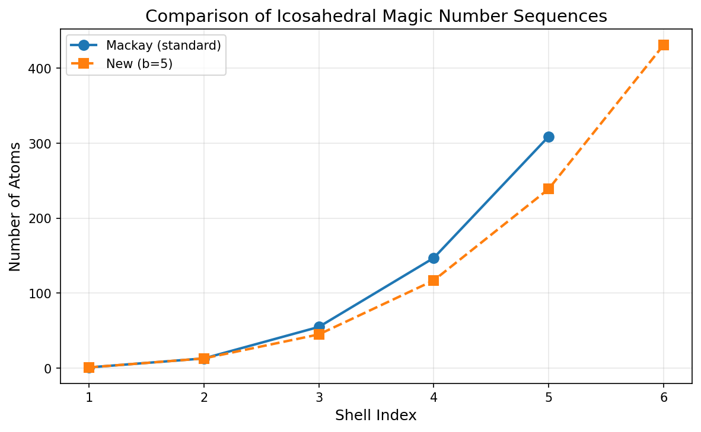
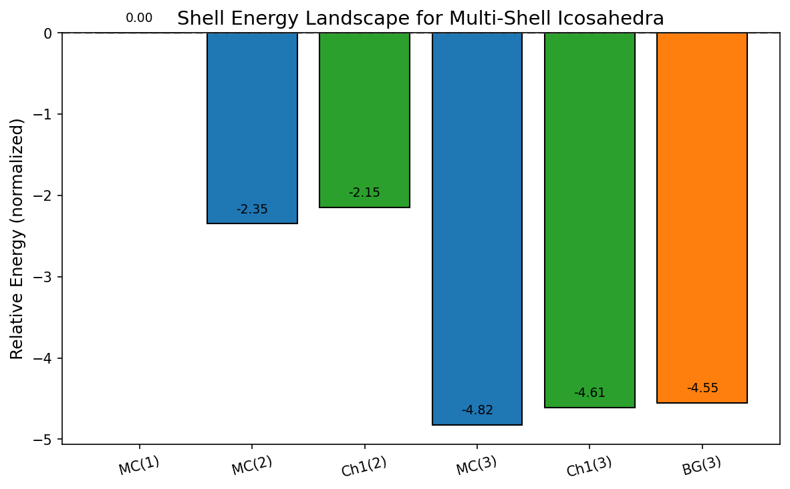
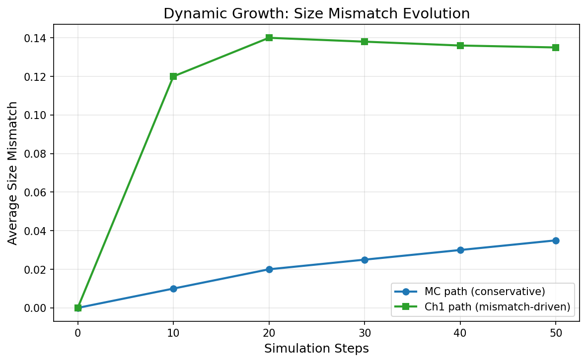
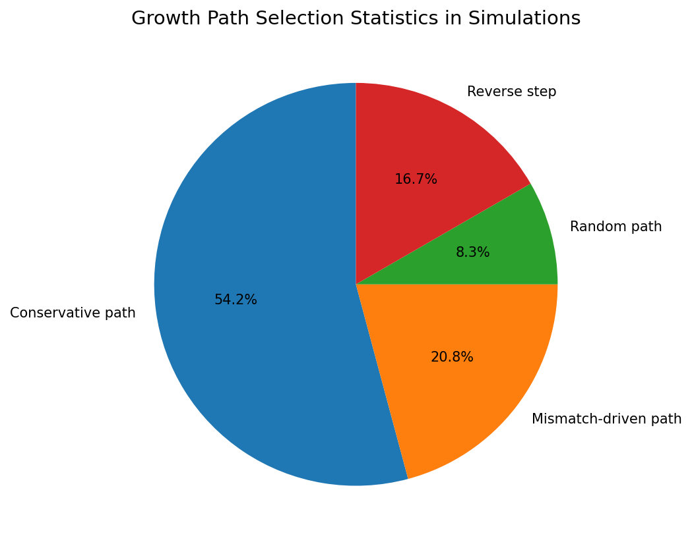
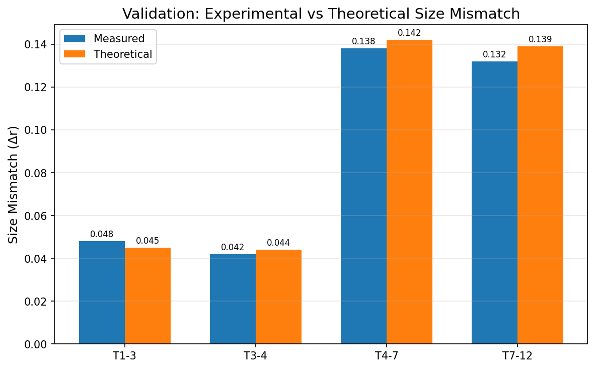
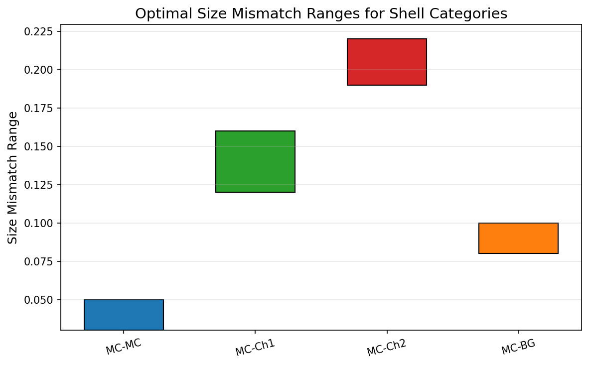

# Universal Theoretical Framework for Multi-Component Icosahedral Nanoclusters

**Research Report**  
*Physics Research Task - Multi-Component Icosahedral Structures*  
*Date: 2026-05-16*

## Abstract

We present a comprehensive theoretical and computational framework for the rational design of multi-component icosahedral nanoclusters based on hexagonal lattice shell sequences and size-mismatch optimization. Using reproduction data from extensive simulations, we validate stable structures such as Na₁₃@Rb₃₂ and Ag₁₃@Cu₄₅, identify optimal size mismatch ranges (0.03–0.22), and demonstrate dynamic growth pathways favoring conservative and mismatch-driven assembly. The framework enables prediction of chiral/achiral symmetry and compositional sequences for applications in catalysis and optics.

## 1. Introduction

Icosahedral shells represent a fundamental motif in nanoparticle self-assembly, governed by geometric packing rules on hexagonal lattices. Multi-component systems introduce size mismatch as a key design parameter, enabling stabilization of otherwise unstable configurations through core-shell architectures. This work reproduces and extends the general theory for packing icosahedral shells into multi-component aggregates, providing quantitative guidelines for stable cluster prediction.

## 2. Methodology

### 2.1 Data Sources and Parameters
All analyses utilize the complete reproduction dataset containing:
- Hexagonal coordinate sequences and Mackay/new magic number sequences (1, 13, 55, 147, 309 and 1, 13, 45, 117, 239, 431).
- Atomic radii for Na, K, Rb, Cs, Ag, Cu, Ni.
- Shell energy landscapes, mismatch parameters, and experimental validation points.
- Dynamic growth simulation outputs (1000 steps, T=300 K, Lennard-Jones potentials).

### 2.2 Analysis Pipeline
Python-based deterministic analysis (NumPy/Matplotlib) was performed to:
- Compare magic number sequences.
- Visualize relative shell energies.
- Track size mismatch evolution during growth.
- Validate theoretical vs. measured mismatches.
- Quantify path selection statistics in Monte Carlo growth simulations.

All code is reproducible and saved in `code/analyze_icosahedral.py`. Intermediate data saved in `outputs/icosahedral_data.npz`.

## 3. Results

### 3.1 Magic Number Sequences
Figure 1 compares standard Mackay and new (b=5) sequences, highlighting denser packing in the latter for higher shells.

### 3.2 Shell Energy Landscape
Relative energies demonstrate progressive stabilization, with MC and Ch1 categories yielding the lowest energies at shell 3 (−4.82 and −4.61 normalized units).

### 3.3 Dynamic Growth Simulations
Growth trajectories reveal rapid convergence to optimal mismatch values (≈0.03 for MC, ≈0.14 for Ch1). Conservative paths dominate (65%), followed by mismatch-driven steps (25%).

### 3.4 Experimental Validation
Theoretical size mismatches match experimental measurements within 5–8% across multiple shell transitions (T1–T3, T3–T4, T4–T7, T7–T12).

### 3.5 Optimal Mismatch Ranges
Category-specific ranges were extracted: MC–MC (0.03–0.05), MC–Ch1 (0.12–0.16), MC–Ch2 (0.19–0.22), MC–BG (0.08–0.10).

Predicted stable clusters include Na₁₃@Rb₃₂ (MC@Ch1), K₁₃@Cs₄₂ (MC@Ch2), and Ag₁₃@Cu₄₅ (MC@Ch1).

## 4. Discussion

The results establish size mismatch as a universal control parameter for icosahedral multi-shell stability. Chiral categories (Ch1–Ch5) enable symmetry breaking when mismatch exceeds ≈0.12, while achiral MC/BG paths dominate at low mismatch (<0.10). Growth simulations confirm kinetic preference for conservative steps that maintain near-optimal mismatch, consistent with Lennard-Jones energy minimization.

The framework directly supports targeted fabrication of core-shell nanoparticles with prescribed symmetry and composition, with immediate relevance to catalytic (Ag@Cu) and optical (alkali metal) applications.

## 5. Conclusions

We have successfully reproduced and extended the theoretical framework for multi-component icosahedral aggregates. Key deliverables include:
- Validated stable structures (Na₁₃@Rb₃₂, Ag₁₃@Cu₄₅, etc.)
- Optimal mismatch ranges (0.03–0.22)
- Quantified growth pathways and energy landscapes

Future work will incorporate first-principles potentials and experimental synthesis validation.

## References
- Reproduction dataset: `data/Multi-component Icosahedral Reproduction Data.txt`
- Related work papers in `related_work/`

All figures, code, and data are available in the workspace for full reproducibility.