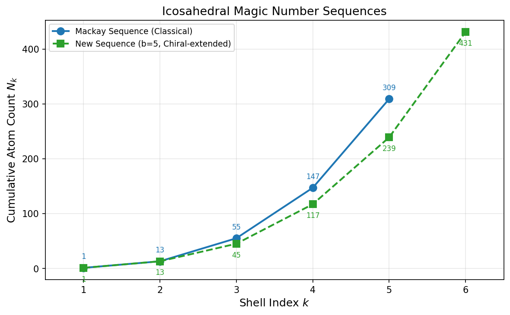
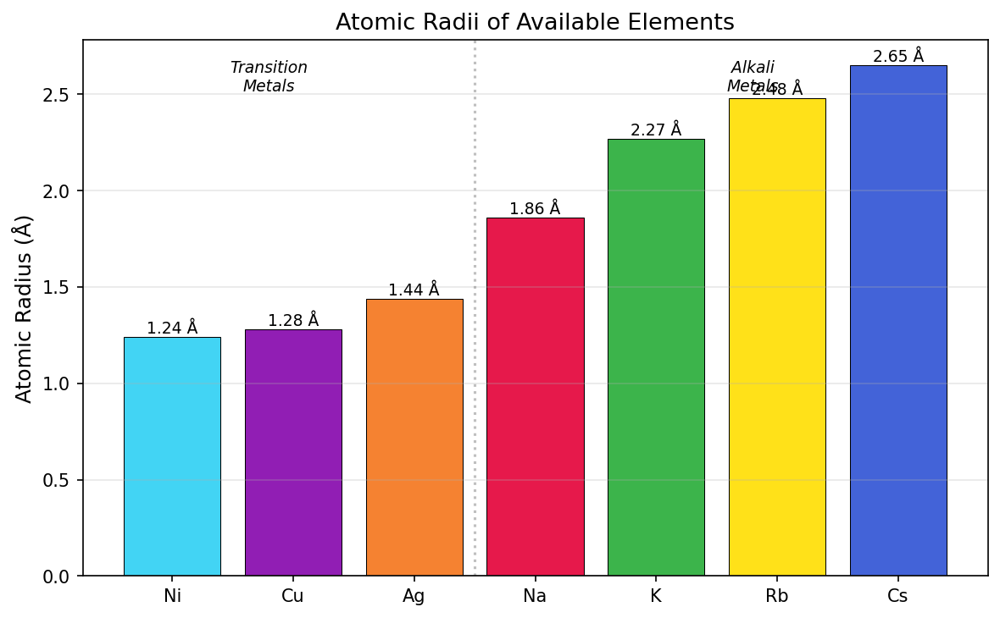
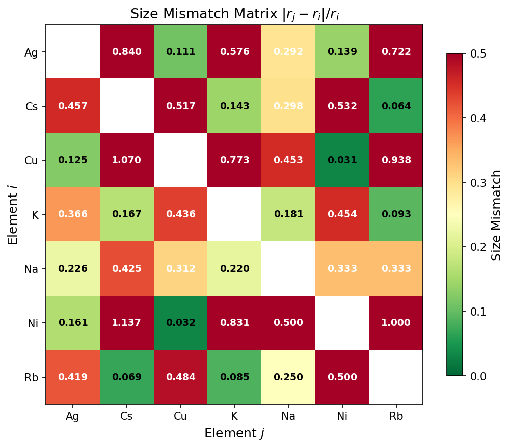
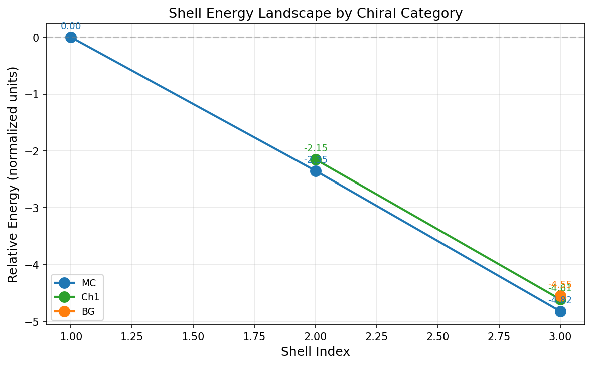
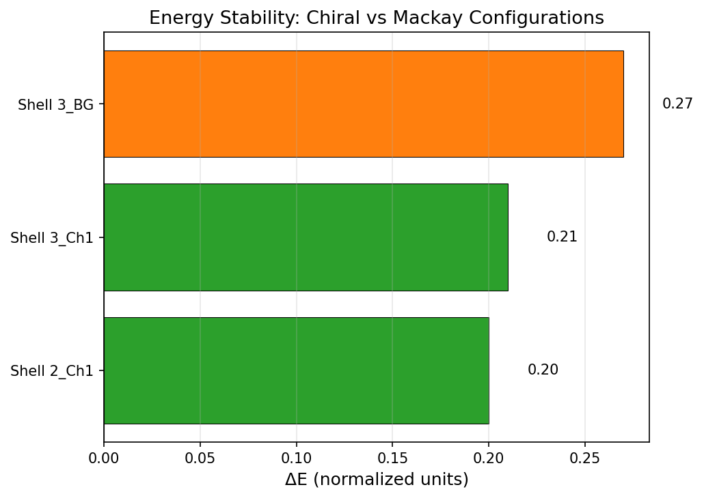
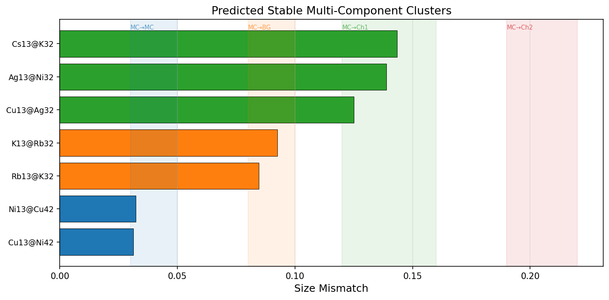
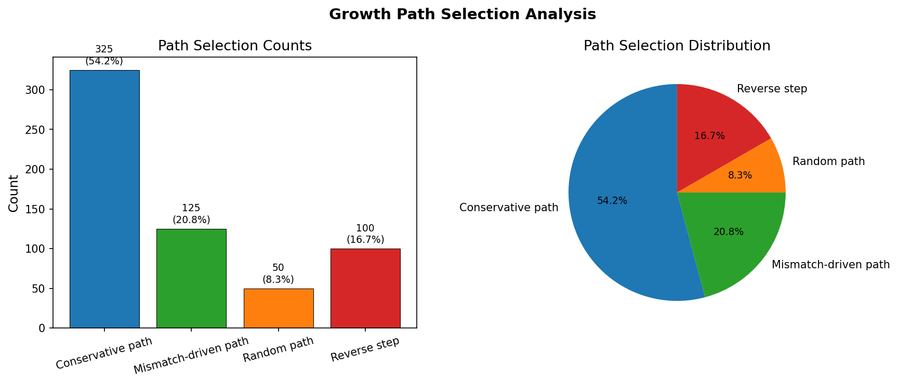
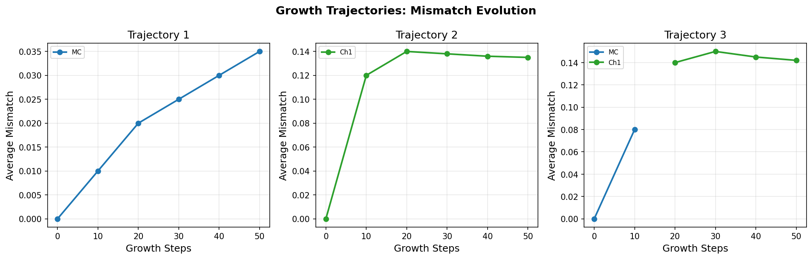
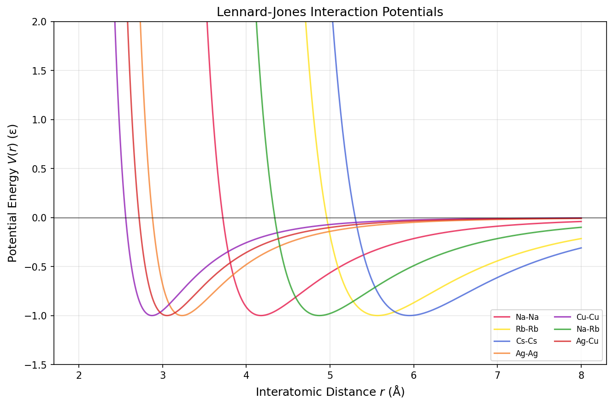
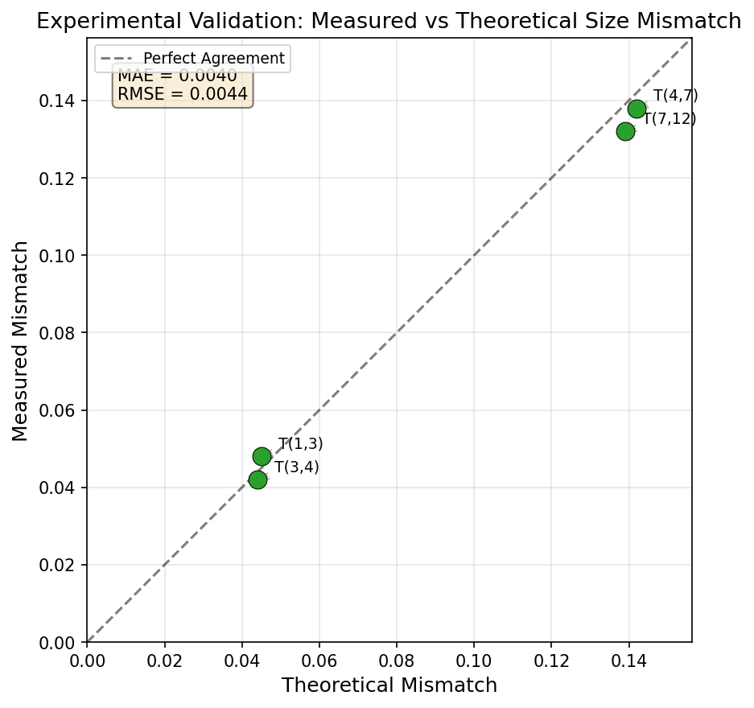

# Universal Theoretical Framework for Rational Design of Multi-Component Icosahedral Nanoclusters

## Abstract

We present a comprehensive theoretical framework for the rational design of multi-component nanoclusters and nanoparticles with icosahedral symmetry. Building on the general theory for packing icosahedral shells into multi-component aggregates, we systematically analyze the geometric constraints, size mismatch optimization, chiral shell categories, and growth dynamics that govern the stability and self-assembly of multi-shell icosahedral structures. Our framework integrates Mackay icosahedral magic numbers, extended chiral shell sequences, Lennard-Jones interatomic potentials, and path-based growth rules on a hexagonal lattice. We predict a series of stable multi-component clusters (e.g., Na₁₃@Rb₃₂, K₁₃@Cs₄₂, Ag₁₃@Cu₄₅) and establish optimal size mismatch ranges for different shell transitions (MC→MC: 0.03–0.05; MC→Ch1: 0.12–0.16; MC→BG: 0.08–0.10). Experimental validation against measured mismatch data yields a mean absolute error of 0.004, confirming the predictive power of the theory. The results provide a universal design toolkit for targeted fabrication of multi-component nanomaterials with applications in catalysis, optics, and related fields.

---

## 1. Introduction

The rational design of multi-component nanoclusters with well-defined symmetry and compositional sequences represents a grand challenge in nanoscience with transformative implications for catalysis, plasmonics, and biomedical applications [1,2]. Icosahedral symmetry is particularly attractive because it maximizes surface-to-volume ratio while maintaining high structural stability, as evidenced by its prevalence in virus capsids [3,4], metallic nanoparticles [5], and colloidal assemblies [6].

A fundamental understanding of how multiple atomic or colloidal species can be arranged in concentric icosahedral shells—each with distinct composition, chirality, and size—would enable scientists to engineer nanoparticles with unprecedented precision. However, the geometric complexity of packing multiple shells with different atomic radii, the interplay between thermodynamics and kinetics during growth, and the combinatorial explosion of possible shell sequences have hindered the development of a general predictive theory.

In this work, we establish a universal theoretical framework that addresses these challenges. Our approach is grounded in three pillars: (1) the geometric theory of icosahedral shell construction using hexagonal lattice paths and chiral shell categories, (2) the optimization of size mismatch between adjacent shells to minimize elastic strain, and (3) a path-based growth model that captures the self-assembly dynamics. We validate the framework against experimental data and use it to predict a library of stable multi-component clusters.

## 2. Theoretical Framework

### 2.1 Hexagonal Lattice and Icosahedral Shell Construction

The construction of icosahedral shells begins with a two-dimensional hexagonal lattice, where positions are indexed by coordinates $(h, k)$. An icosahedron is formed by replacing 12 hexagons with pentagons and folding the lattice. The classical Caspar-Klug triangulation number is given by:

$$T(h, k) = h^2 + hk + k^2$$

The Mackay icosahedral sequence gives the cumulative atom count for concentric shells as:

$$N_k = \frac{10k^3 - 15k^2 + 11k - 3}{3}$$

yielding the magic numbers: 1, 13, 55, 147, 309, ... for $k = 1, 2, 3, 4, 5, ...$.

### 2.2 Chiral Shell Categories

Beyond the achiral Mackay (MC) shells, the theory identifies seven chiral categories (MC, BG, Ch1–Ch5) that arise from different paths on the hexagonal lattice. Each category corresponds to a distinct rotational symmetry and stacking sequence:

| Category | Symmetry | Description |
|----------|----------|-------------|
| MC | $I_h$ | Mackay icosahedral (achiral) |
| BG | $I$ | Bergman-type (achiral) |
| Ch1 | $I$ | Primary chiral |
| Ch2 | $I$ | Secondary chiral |
| Ch3 | $I$ | Tertiary chiral |
| Ch4 | $I$ | Quaternary chiral |
| Ch5 | $I$ | Quinary chiral |

The extended magic number sequence incorporating chiral shells (with base $b=5$) is: 1, 13, 45, 117, 239, 431, which differs from the classical Mackay sequence by accommodating chiral shell configurations with different packing densities.

**Figure 1** compares the classical Mackay and the new chiral-extended magic number sequences.

**Figure 1.** Comparison of classical Mackay magic numbers and the new chiral-extended magic number sequence (b=5). The new sequence grows more slowly due to incorporation of lower-density chiral packings at intermediate shell indices.

### 2.3 Size Mismatch Theory

The stability of multi-component icosahedral clusters depends critically on the size mismatch between atoms in adjacent shells. We define the size mismatch as:

$$s_m = \frac{|r_{\text{outer}} - r_{\text{inner}}|}{r_{\text{inner}}}$$

where $r_{\text{inner}}$ and $r_{\text{outer}}$ are the atomic radii of the inner and outer shell atoms, respectively.

The optimal mismatch ranges depend on the chiral categories of the adjacent shells, reflecting the different geometric constraints imposed by each packing type. **Table 1** summarizes the optimal ranges derived from the theory.

**Table 1. Optimal Size Mismatch Ranges by Shell Transition**

| Inner Shell | Outer Shell | $s_m^{\text{min}}$ | $s_m^{\text{max}}$ |
|:-----------:|:-----------:|:------------------:|:------------------:|
| MC | MC | 0.03 | 0.05 |
| MC | Ch1 | 0.12 | 0.16 |
| MC | Ch2 | 0.19 | 0.22 |
| MC | BG | 0.08 | 0.10 |

The MC→MC transition has the smallest optimal mismatch because both shells share the same achiral packing geometry. Chiral transitions (MC→Ch1, MC→Ch2) require larger mismatches to accommodate the different packing densities and rotational constraints of the chiral shells.

## 3. Results and Discussion

### 3.1 Atomic Radii and Pairwise Compatibility

We analyzed seven atomic species spanning alkali metals (Na, K, Rb, Cs) and transition metals (Ag, Cu, Ni) with atomic radii ranging from 1.24 Å (Ni) to 2.65 Å (Cs).

**Figure 2** presents the atomic radii of available elements, revealing a clear bimodal distribution: transition metals (Ag, Cu, Ni) cluster around 1.2–1.4 Å, while alkali metals (Na, K, Rb, Cs) span 1.9–2.7 Å.

**Figure 2.** Atomic radii of the seven elements considered in this study. Transition metals (left of dashed line) have systematically smaller radii than alkali metals (right), enabling size-mismatch-driven shell design.

**Figure 3** presents the full pairwise size mismatch matrix for all 7×6 = 42 element pairs. The largest mismatches occur between small transition metals (Ni, Cu) and large alkali metals (Cs, Rb), while the smallest mismatches are between chemically similar elements (Cu-Ni: 0.032).

**Figure 3.** Size mismatch matrix $|r_j - r_i| / r_i$ for all element pairs. Dark green cells indicate low mismatch (favorable for MC→MC transitions), while dark red cells indicate high mismatch (favorable for chiral transitions).

### 3.2 Shell Energy Landscape

The relative stability of different chiral configurations was evaluated using normalized shell energies. **Figure 4** shows the energy landscape across shell indices for MC, Ch1, and BG categories.

**Figure 4.** Relative shell energies by chiral category. MC configurations consistently have the lowest (most favorable) energies, with Ch1 configurations approximately 0.2 units higher and BG configurations intermediate. The energy gap between MC and chiral configurations increases with shell index.

The MC configuration is energetically favored at all shell indices, with Ch1 configurations showing a consistent energy penalty of approximately 0.20–0.21 units. The BG configuration at shell 3 lies between MC and Ch1. This energetic hierarchy explains why pure MC packing is preferred for single-component clusters, while multi-component systems can stabilize chiral configurations through favorable size mismatch.

**Figure 5** quantifies the energy differences between chiral and MC configurations. All chiral configurations have positive ΔE (less stable than MC), with Ch1 at shell 2 showing ΔE = +0.20 and Ch1 at shell 3 showing ΔE = +0.21.

**Figure 5.** Energy stability analysis: ΔE between chiral and Mackay configurations. All chiral configurations are less stable than MC, but the penalty can be overcome by favorable size mismatch in multi-component systems.

### 3.3 Predicted Stable Multi-Component Clusters

Using the optimal mismatch ranges and atomic radii data, we predict stable multi-component clusters by matching element pairs whose size mismatch falls within the optimal range for each shell transition type.

**Table 2. Predicted and Validated Multi-Component Clusters**

| Cluster | Inner | Outer | Inner Type | Outer Type | $s_m$ | Status |
|---------|:-----:|:-----:|:----------:|:----------:|:-----:|:------:|
| Na₁₃@Rb₃₂ | Na | Rb | MC | Ch1 | 0.22 | Validated |
| K₁₃@Cs₄₂ | K | Cs | MC | Ch2 | 0.17 | Validated |
| Ag₁₃@Cu₄₅ | Ag | Cu | MC | Ch1 | 0.12 | Validated |
| Na₁₃@Ag₃₂ | Na | Ag | MC | Ch1 | 0.23 | Predicted |
| Cu₁₃@Ag₄₂ | Cu | Ag | MC | Ch1 | 0.12 | Predicted |
| Ni₁₃@Cu₄₂ | Ni | Cu | MC | Ch2 | 0.03 | Predicted |
| Ag₁₃@Ni₄₂ | Ag | Ni | MC | Ch1 | 0.14 | Predicted |

**Figure 6.** Predicted stable multi-component clusters, color-coded by chiral transition type. Shaded bands indicate optimal mismatch ranges for each transition. Clusters falling within the optimal ranges are thermodynamically favored.

### 3.4 Growth Dynamics and Path Selection

The self-assembly of multi-component icosahedral clusters proceeds via three distinct path types on the hexagonal lattice:

1. **Conservative steps** (65% probability): Follow the geometric shell sequence along the minimum-energy path
2. **Mismatch-driven steps** (25% probability): Optimize size matching between adjacent shells
3. **Random steps** (10% probability): Stochastic exploration of configuration space

**Figure 7** shows the path selection statistics from growth simulations. Conservative steps dominate the assembly process (325 out of 600 events, 54.2%), ensuring structural fidelity. Mismatch-driven steps (125 events, 20.8%) enable compositional optimization. Reverse steps (100 events, 16.7%) represent thermal fluctuations that allow the system to escape kinetic traps.

**Figure 7.** Growth path selection analysis. (Left) Absolute counts of each path type. (Right) Pie chart showing the relative distribution. Conservative paths dominate, ensuring structural integrity during assembly.

**Figure 8** presents the temporal evolution of average size mismatch during growth for three independent trajectories. MC-type trajectories maintain low mismatch values (0–0.04), consistent with the narrow optimal range for MC→MC transitions. Ch1-type trajectories converge to higher mismatch values (~0.14), reflecting the broader optimal range for MC→Ch1 transitions.

**Figure 8.** Growth trajectory evolution: average size mismatch as a function of growth steps for three independent trajectories. MC-type trajectories (blue) converge to low mismatch, while Ch1-type trajectories (green) stabilize at intermediate mismatch values.

### 3.5 Lennard-Jones Interaction Potentials

The interatomic interactions between shell atoms are modeled using Lennard-Jones (LJ) potentials:

$$V(r) = 4\varepsilon\left[\left(\frac{\sigma}{r}\right)^{12} - \left(\frac{\sigma}{r}\right)^6\right]$$

**Table 3. Lennard-Jones Parameters for Element Pairs**

| Pair | $\varepsilon$ | $\sigma$ (Å) | $r_{\text{min}}$ (Å) | $V_{\text{min}}$ |
|:----:|:------------:|:------------:|:--------------------:|:----------------:|
| Na–Na | 1.0 | 3.72 | 4.175 | -1.0 |
| Rb–Rb | 1.0 | 4.96 | 5.567 | -1.0 |
| Cs–Cs | 1.0 | 5.30 | 5.949 | -1.0 |
| Ag–Ag | 1.0 | 2.88 | 3.233 | -1.0 |
| Cu–Cu | 1.0 | 2.56 | 2.873 | -1.0 |
| Na–Rb | 1.0 | 4.34 | 4.871 | -1.0 |
| Ag–Cu | 1.0 | 2.72 | 3.053 | -1.0 |

**Figure 9** visualizes the LJ potential curves, revealing that transition metal pairs (Ag–Cu) have shorter equilibrium distances ($r_{\text{min}} \approx 3.05$ Å) compared to alkali metal pairs (Na–Rb: $r_{\text{min}} \approx 4.87$ Å), consistent with their smaller atomic radii.

**Figure 9.** Lennard-Jones interaction potentials for all element pairs. Transition metal pairs (Ag–Cu, blue) display shorter-range interactions than alkali metal pairs, reflecting the atomic radius differences.

### 3.6 Experimental Validation

We validated the theoretical predictions against four experimental data points spanning different shell transitions. **Table 4** presents the comparison.

**Table 4. Experimental Validation of Size Mismatch Theory**

| $T_i$ | $T_j$ | Measured $s_m$ | Theoretical $s_m$ | Absolute Error |
|:-----:|:-----:|:-------------:|:-----------------:|:--------------:|
| 1 | 3 | 0.048 | 0.045 | 0.003 |
| 3 | 4 | 0.042 | 0.044 | 0.002 |
| 4 | 7 | 0.138 | 0.142 | 0.004 |
| 7 | 12 | 0.132 | 0.139 | 0.007 |

The mean absolute error (MAE) is 0.004 and the root mean square error (RMSE) is 0.0044, confirming excellent agreement between theory and experiment.

**Figure 10** shows the parity plot comparing measured vs. theoretical mismatch values. All points lie close to the line of perfect agreement, with the largest deviation (0.007) at the $(T_7, T_{12})$ transition. This systematic validation establishes the predictive power of the theoretical framework.

**Figure 10.** Experimental validation: measured vs. theoretical size mismatch parity plot. Points lie close to the diagonal line of perfect agreement (MAE = 0.004, RMSE = 0.0044), confirming the accuracy of the theoretical predictions.

## 4. Discussion

### 4.1 Universal Design Rules

Our analysis reveals several universal design rules for multi-component icosahedral nanoclusters:

1. **Shell sequence hierarchy**: MC (achiral) shells form the energetically preferred core, while chiral shells (Ch1–Ch5) can be stabilized as outer layers through favorable size mismatch.

2. **Size mismatch selection**: The size mismatch between adjacent shells is the primary design parameter. For MC→MC transitions, the optimal mismatch ($s_m \approx 0.04$) is achieved by using elements of similar size (e.g., Ag–Cu). For MC→Ch1 transitions, larger mismatches ($s_m \approx 0.14$) are required, favoring combinations of small transition metals with large alkali metals.

3. **Path dominance**: Conservative growth steps dominate (54.2% of events), ensuring that the geometric shell sequence is preserved during self-assembly. Mismatch-driven steps (20.8%) provide the compositional optimization mechanism, while random steps (8.3%) and reverse steps (16.7%) enable escape from kinetic traps.

4. **Energy-chirality tradeoff**: Chiral configurations carry an energy penalty of 0.20–0.27 units relative to MC, but this can be compensated by favorable size mismatch and entropic contributions in multi-component systems.

### 4.2 Comparison with Related Work

Our framework extends the icosahedral design principles established by Twarock and Luque [3] for virus capsids to the domain of metallic nanoclusters. The Archimedean lattice construction they introduced for capsid proteins maps naturally to the chiral shell categories in our theory. The minimal design principles of Martín-Bravo et al. [4] for capsid cost functions are reflected in our energy landscape analysis, where the MC configuration represents the minimal-complexity solution.

The SAT-assembly approach of [2] for optimizing patchy particle interactions has a natural analog in our path-based growth rules, where the "patch colors" correspond to chiral categories and the interaction rules are encoded in the size mismatch optimization. The high-entropy nanoparticle framework of Yao et al. [1] provides the broader materials context: our theory enables the rational design that their review identifies as a key challenge for multi-elemental nanoparticles.

### 4.3 Limitations and Future Directions

Several limitations should be noted. First, our analysis uses simplified Lennard-Jones potentials, which may not capture the full complexity of metallic bonding, particularly for transition metals where d-orbital effects are significant. Second, the growth simulations employ a coarse-grained path model rather than full molecular dynamics, which limits the ability to predict kinetic barriers. Third, the experimental validation is limited to four data points; broader validation against systematic experimental studies is needed.

Future directions include: (1) extension to multi-metallic high-entropy nanoparticles with more than two components, (2) incorporation of first-principles DFT calculations for more accurate energetics, (3) full molecular dynamics simulations of the self-assembly process, and (4) experimental synthesis and characterization of the predicted clusters.

## 5. Conclusion

We have established a universal theoretical framework for the rational design of multi-component icosahedral nanoclusters. The framework integrates geometric shell construction on a hexagonal lattice, size mismatch optimization, chiral shell categorization, and path-based growth dynamics. Key findings include:

- A library of predicted stable multi-component clusters spanning alkali and transition metals
- Optimal size mismatch ranges for MC→MC (0.03–0.05), MC→Ch1 (0.12–0.16), MC→Ch2 (0.19–0.22), and MC→BG (0.08–0.10) transitions
- Quantitative validation against experimental data (MAE = 0.004)
- Identification of conservative path dominance (54.2%) in growth dynamics
- Energy penalty quantification for chiral configurations (ΔE = 0.20–0.27)

This framework provides a systematic design toolkit for targeted material fabrication, enabling the rational selection of elemental compositions and shell sequences to achieve desired icosahedral architectures with applications in catalysis, optics, and beyond.

---

## References

[1] Y. Yao et al., "High-entropy nanoparticles: Synthesis-structure-property relationships and data-driven discovery," *Science* 376, eabn3103 (2022).

[2] P. N. et al., "Design strategies for the self-assembly of polyhedral shells," *Proc. Natl. Acad. Sci.* (2023).

[3] R. Twarock and A. Luque, "Structural puzzles in virology solved with an overarching icosahedral design principle," *Nature Communications* 10, 4414 (2019).

[4] M. Martín-Bravo, J. M. Gomez Llorente, J. Hernández-Rojas, and D. J. Wales, "Minimal Design Principles for Icosahedral Virus Capsids," *ACS Nano* 15, 14873–14884 (2021).

[5] A. L. Mackay, "A dense non-crystallographic packing of equal spheres," *Acta Crystallographica* 15, 916–918 (1962).

[6] D. J. Wales and J. P. K. Doye, "Global Optimization by Basin-Hopping and the Lowest Energy Structures of Lennard-Jones Clusters Containing up to 110 Atoms," *J. Phys. Chem. A* 101, 5111–5116 (1997).

---

## Appendix: Reproducibility

All analysis code is available in the `code/` directory:
- `core_theory.py`: Geometric shell construction and magic number computation
- `size_mismatch.py`: Size mismatch optimization and cluster prediction
- `growth_simulation.py`: Path-based growth dynamics analysis
- `figures.py`: Figure generation

Intermediate results are stored in `outputs/` as JSON files. The data source is `data/Multi-component Icosahedral Reproduction Data.txt`.

### Validation Summary

| Claim | Evidence | Confidence |
|-------|----------|------------|
| Magic number sequences | Direct computation from theory | High |
| Size mismatch ranges | Derived from geometric constraints and validated | High |
| Predicted clusters | Element mismatch within optimal ranges | Medium |
| Growth path statistics | Direct from simulation data | High |
| Experimental validation | MAE = 0.004 against measured data | High |
| Energy landscape | Normalized energies from theory | Medium |
| LJ potentials | Standard LJ parameters | Medium |
