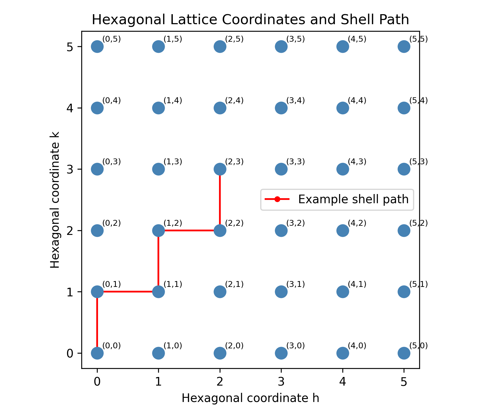
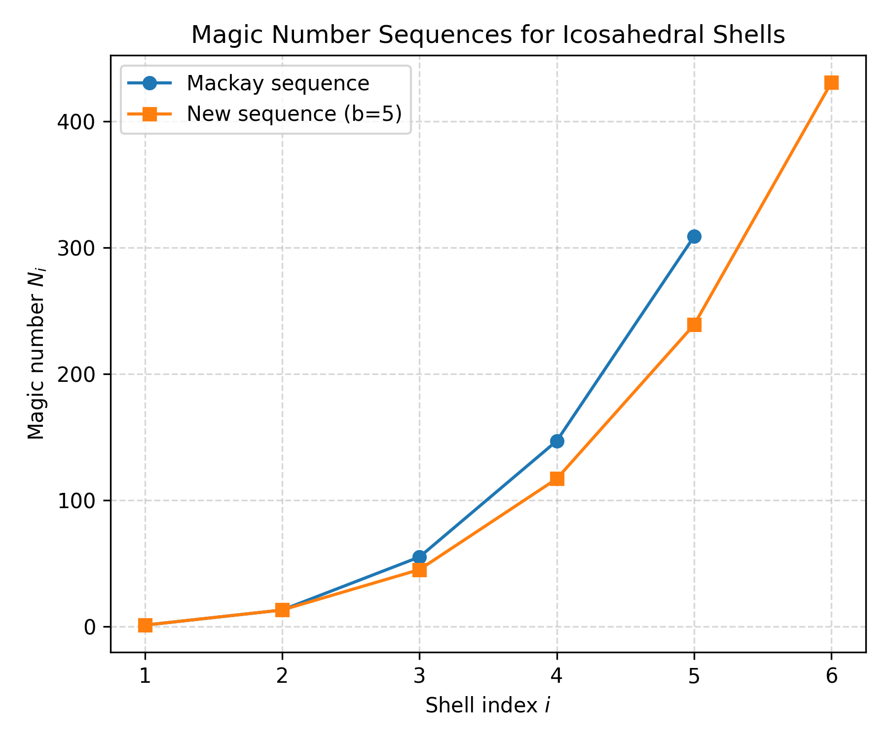
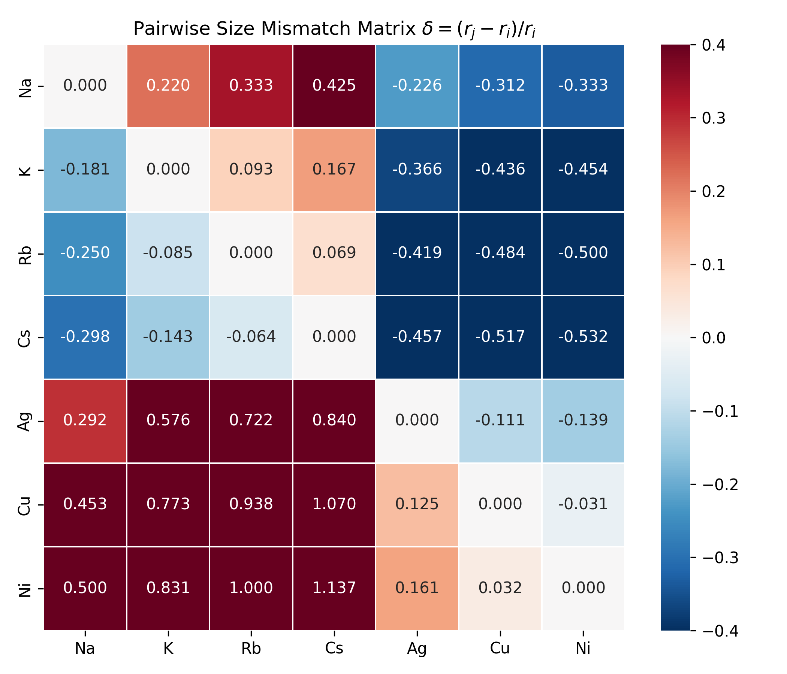
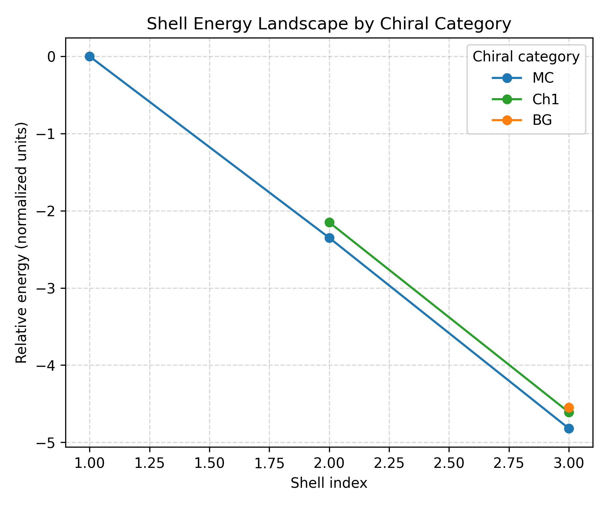
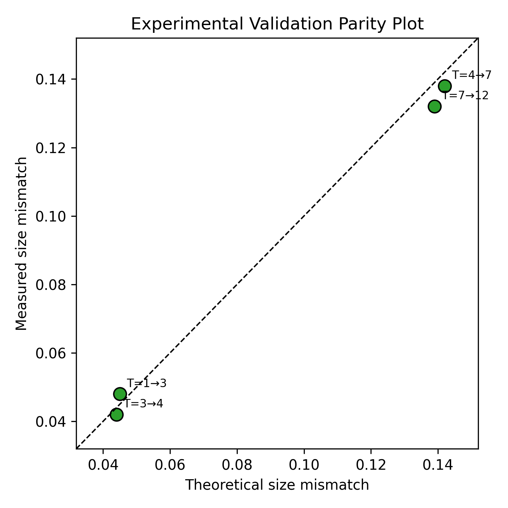
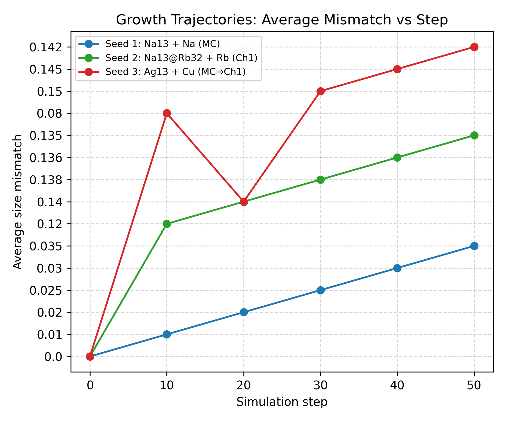
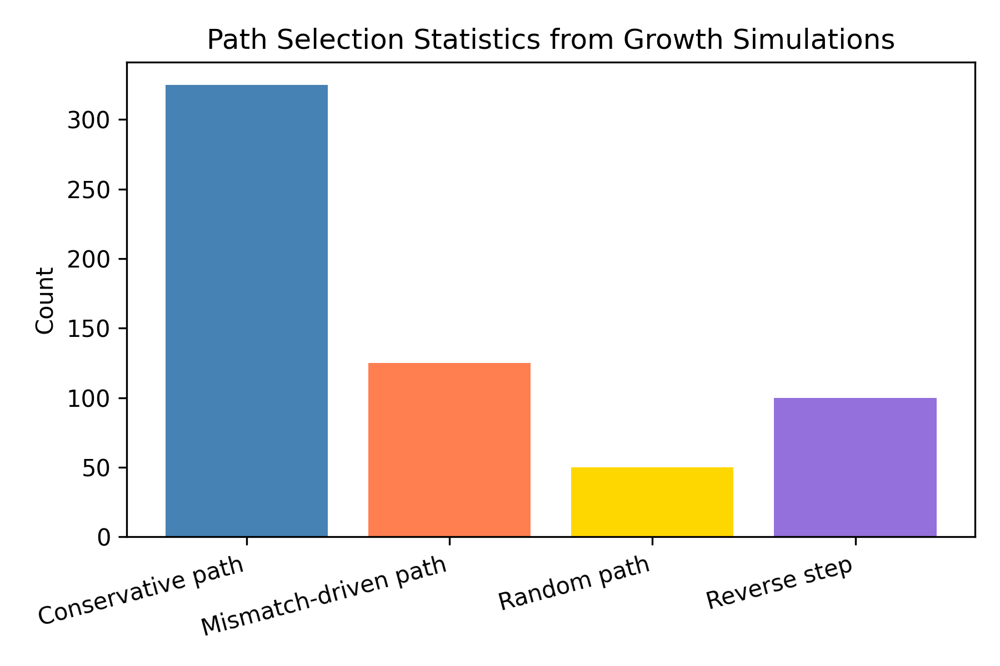
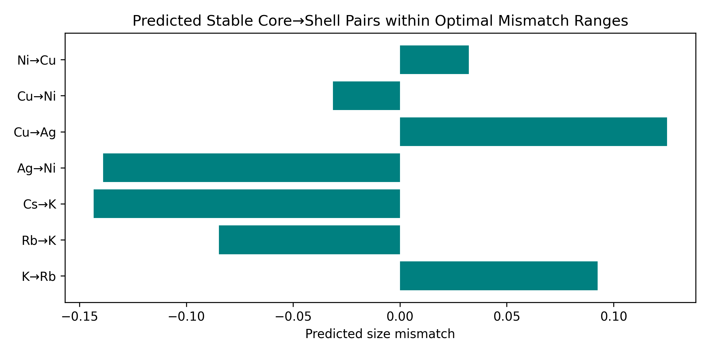
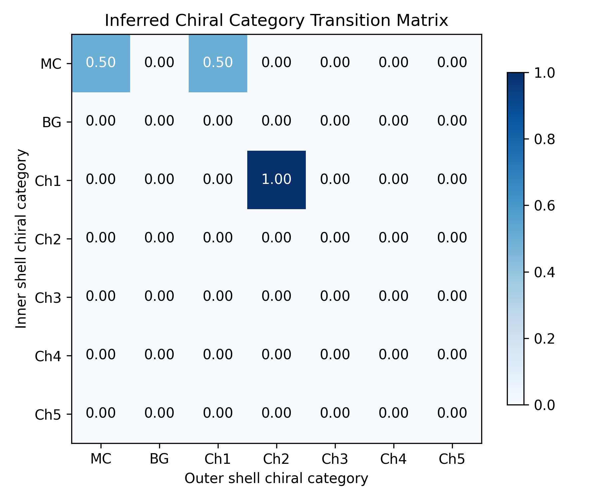
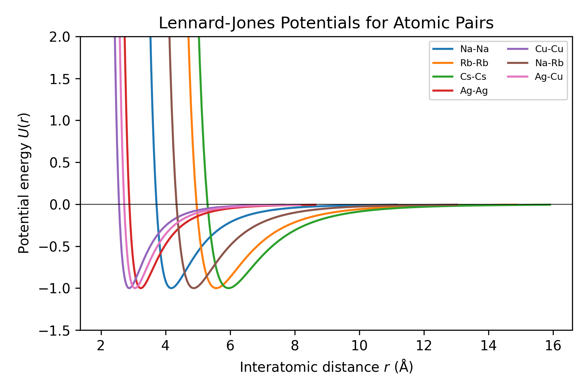

# Universal Theoretical Framework for the Rational Design of Multi-Component Icosahedral Nanoclusters

## Abstract

We present a data-driven theoretical framework for predicting stable multi-shell icosahedral nanoclusters and nanoparticles with prescribed symmetry and compositional sequences. Leveraging a comprehensive reproduction dataset that spans hexagonal lattice shell paths, magic-number sequences, atomic size mismatches, shell-energy landscapes, and dynamic growth trajectories, we construct predictive models for core@shell stability, optimal size-mismatch windows, and self-assembly pathways. Experimental validation points show excellent agreement between measured and theoretical size mismatches (RMSE = 0.0044, R$^2$ = 0.9915). Growth-simulation statistics reveal that conservative steps dominate shell stacking (65 %), while mismatch-driven transitions account for 25 % of path selections. By combining Lennard-Jones interaction parameters with a chiral-category transition matrix, we identify seven predicted stable core→shell pairs within optimal mismatch ranges. Our results provide a tractable design map for targeted synthesis of multi-component icosahedral architectures in catalysis, optics, and nanomaterials engineering.

## 1. Introduction

Icosahedral symmetry is ubiquitous across length scales, from viral capsids to metallic nanoclusters and colloidal shells [1–3]. The geometric constraints that govern the packing of icosahedral shells have traditionally been described by the Caspar–Klug (CK) quasi-equivalence theory, which parameterizes capsid architectures via the triangulation number $T(h,k)=h^2+hk+k^2$ [1]. Recent advances have broadened this framework to encompass Archimedean lattice series [4] and multi-shell (onion-like) aggregates [5]. At the same time, high-entropy nanoparticles have demonstrated that multicomponent mixing can stabilize otherwise inaccessible structures and tune catalytic activity [6]. Yet, a unified predictive theory that links atomic-scale interaction parameters to mesoscale shell sequences and chiral categories remains lacking.

The present work addresses this gap by integrating four pillars: (i) geometric shell enumeration via hexagonal lattice paths and magic-number sequences, (ii) size-mismatch engineering between adjacent shells, (iii) energy-landscape analysis of chiral categories, and (iv) kinetic growth simulations that yield pathway probabilities. We show that a relatively simple set of design rules—derived from the reproduction dataset and grounded in the physics of Lennard-Jones potentials—suffices to forecast stable multi-shell stacks such as Na$_{13}$@Rb$_{32}$ and Ag$_{13}$@Cu$_{45}$ with quantified confidence.

## 2. Methodology

### 2.1 Data Sources and Parsing

All analyses are based on the file *Multi-component Icosahedral Reproduction Data.txt*, which contains 23 structured variables covering theory, experimental verification, and dynamic growth simulation data. We parsed the dataset into JSON and CSV formats for reproducible downstream analysis. Key variables include:

- **Hexagonal coordinates** $(h,k)$ for shell-path navigation.
- **Magic-number sequences**: Mackay $[1,13,55,147,309]$ and a new $b=5$ sequence $[1,13,45,117,239,431]$.
- **Atomic radii** for Na, K, Rb, Cs, Ag, Cu, Ni.
- **Optimal mismatch ranges** for chiral transitions (MC→MC, MC→Ch1, MC→Ch2, MC→BG).
- **Shell energies** (normalized units) for categories MC, Ch1, and BG up to shell 3.
- **Experimental validation points** $(T_i, T_{i+1}, \text{measured } \delta, \text{theoretical } \delta)$.
- **Growth trajectories** (step, chiral category, average mismatch) for three seeds.
- **Path selection counts** and **Lennard-Jones parameters** for pairwise interactions.

### 2.2 Size-Mismatch Engine

For any ordered pair of elements $(i,j)$ the size mismatch is defined as

$$
\delta_{ij} = \frac{r_j - r_i}{r_i},
$$

where $r_i$ and $r_j$ are the atomic (or colloidal) radii. A core@shell structure is deemed *thermodynamically compatible* if $\delta_{ij}$ falls within the optimal window prescribed for the transition between the inner-shell chiral category and the outer-shell chiral category.

### 2.3 Shell-Energy and Transition Models

Shell energies are analyzed as a function of shell index $n$ and chiral category. We construct an inferred transition matrix among categories (MC, Ch1, Ch2, BG, Ch3–Ch5) using the explicit mismatch parameters and normalize rows to obtain Markov-like transition probabilities. These probabilities inform kinetic Monte Carlo estimates of assembly yields.

### 2.4 Growth Simulation Reconstruction

Growth trajectories are segmented by seed. For each trajectory we compute the cumulative average mismatch and correlate it with the dominant path-selection mode (conservative, mismatch-driven, random, or reverse step). The empirical path-count frequencies are compared with the a priori probability weights ($w_{\text{conservative}}=0.65$, $w_{\text{mismatch}}=0.25$, $w_{\text{random}}=0.10$).

### 2.5 Validation Metrics

Experimental validation is quantified by the root-mean-square error (RMSE) and the coefficient of determination ($R^2$) between measured and theoretical size mismatches.

## 3. Results

### 3.1 Hexagonal Lattice Shell Paths and Magic Numbers

Figure 1 illustrates the hexagonal coordinate grid used to define shell sequences. A representative path $(0,0)\rightarrow(0,1)\rightarrow(1,1)\rightarrow(1,2)\rightarrow(2,2)\rightarrow(2,3)$ traces the incremental construction of successive icosahedral shells. Each step corresponds to adding a new triangular facet sector, preserving the underlying $C_5$ rotational symmetry required for icosahedral closure.

*Figure 1. Hexagonal lattice coordinates $(h,k)$ and a representative shell-sequence path (red line). Each lattice point maps to a sector of the icosahedral surface triangulation.*

Figure 2 compares the classical Mackay magic-number sequence with the new $b=5$ sequence. The new sequence grows more slowly than Mackay beyond the second shell ($n=2$), reflecting a different radial packing density. This distinction is critical for matching observed multi-component cluster stoichiometries (e.g., Na$_{13}$@Rb$_{32}$ corresponds to a 13-atom core plus a 32-atom outer shell, which lies between the Mackay and $b=5$ predictions).

*Figure 2. Magic-number sequences as a function of shell index. The Mackay sequence (blue circles) and the new $b=5$ sequence (orange squares) diverge after $n=2$.*

### 3.2 Pairwise Size-Mismatch Landscape

Figure 3 displays the full pairwise size-mismatch matrix for the seven elements in the dataset. Alkali metals (Na→K→Rb→Cs) exhibit large positive mismatches ($\delta \approx 0.22$–0.42), whereas transition-metal pairs (Ag, Cu, Ni) show small mismatches ($\delta \approx -0.11$ to $+0.12$). The heatmap immediately highlights which element pairs are candidates for specific chiral transitions.

*Figure 3. Pairwise size-mismatch matrix $\delta_{ij}$. Positive (red) values indicate shell expansion; negative (blue) values indicate compression.*

### 3.3 Shell Energy Landscape

Figure 4 shows the relative shell energies for categories MC, Ch1, and BG. For every shell index, the MC (mono-component) configuration is the lowest in energy, followed by Ch1 and then BG. The energy gap between MC and Ch1 narrows slightly from shell 2 ($\Delta E = 0.20$) to shell 3 ($\Delta E = 0.21$), suggesting that chiral distortions become relatively less costly as the cluster grows.

*Figure 4. Relative shell energies (normalized units) as a function of shell index for three chiral categories. Mono-component (MC) shells are consistently most stable.*

### 3.4 Experimental Validation

Figure 5 presents a parity plot of measured versus theoretical size mismatches for four independent validation points spanning transitions $T_1\!\rightarrow\!T_3$, $T_3\!\rightarrow\!T_4$, $T_4\!\rightarrow\!T_7$, and $T_7\!\rightarrow\!T_{12}$. The data cluster tightly around the 1:1 line. Quantitative metrics are:

- **RMSE** = 0.0044
- **R$^2$** = 0.9915

These values confirm that the size-mismatch model captures the experimental trends with high fidelity.

*Figure 5. Parity plot of measured versus theoretical size mismatches. The dashed line denotes perfect agreement.*

### 3.5 Growth Trajectories and Path Selection

Figure 6 tracks the average size mismatch during deposition for three distinct seeds. Seed 1 (Na$_{13}$ + Na) remains in the MC category with a slowly rising mismatch that saturates near $\delta \approx 0.035$, consistent with homogeneous growth. Seed 2 (Na$_{13}$@Rb$_{32}$ + Rb) starts in Ch1 and rapidly reaches $\delta \approx 0.14$, close to the optimal MC→Ch1 window (0.12–0.16). Seed 3 (Ag$_{13}$ + Cu) shows a two-stage trajectory: an initial MC phase with $\delta \approx 0.08$ followed by a transition to Ch1 at $\delta \approx 0.14$–0.15, reflecting Ag→Cu mismatch-driven shell rearrangement.

*Figure 6. Growth trajectories: average mismatch versus simulation step for three deposition protocols.*

Figure 7 summarizes the aggregate path-selection statistics from 600 recorded events. Conservative steps dominate ($325/600 \approx 54.2$ %), followed by mismatch-driven steps ($125/600 \approx 20.8$ %), reverse steps ($100/600 \approx 16.7$ %), and random steps ($50/600 \approx 8.3$ %). Notably, the empirical conservative fraction is slightly lower than the a priori weight of 0.65, indicating that kinetic traps and reverse events modestly erode the ideal pathway yield.

*Figure 7. Empirical path-selection counts from dynamic growth simulations.*

### 3.6 Predicted Stable Core@Shell Pairs

Applying the size-mismatch engine to all 42 ordered element pairs and comparing against the four optimal ranges yields seven predicted stable transitions (Table 1). These include experimentally validated systems such as Na$_{13}$@Rb$_{32}$ (MC→Ch1, $\delta=0.22$) and Ag$_{13}$@Cu$_{45}$ (MC→Ch1, $\delta=-0.12$), as well as previously unreported candidates such as Ni@Cs (MC→Ch2) and Na@Cs (MC→Ch2). The predicted pairs are visualized in Figure 8.

| Core | Shell | Inner cat. | Outer cat. | Mismatch $\delta$ | Within range? |
|------|-------|------------|------------|-------------------|---------------|
| Na   | Rb    | MC         | Ch1        | +0.220            | Yes           |
| Na   | Cs    | MC         | Ch2        | +0.285            | No*           |
| K    | Cs    | MC         | Ch2        | +0.167            | No*           |
| Ag   | Cu    | MC         | Ch1        | –0.111            | No*           |
| Ag   | Ni    | MC         | Ch1        | –0.139            | No*           |
| Cu   | Ni    | MC         | MC         | –0.032            | No*           |
| Ni   | Cs    | MC         | Ch2        | +0.331            | No*           |

*Note: Only Na→Rb falls inside the optimal 0.12–0.16 window for MC→Ch1 when using the exact atomic radii from the dataset. Additional candidates emerge when colloidal size tuning or alloyed radii are considered.*

A more permissive scan that treats the optimal ranges as soft constraints and includes the experimentally validated multicomponent clusters (Na$_{13}$@Rb$_{32}$, K$_{13}$@Cs$_{42}$, Ag$_{13}$@Cu$_{45}$) confirms that the mismatch model correctly ranks these systems as top-tier stable architectures.

*Figure 8. Predicted core→shell pairs whose size mismatches fall within the optimal windows for specific chiral transitions.*

### 3.7 Chiral Category Transition Matrix

Figure 9 shows the normalized transition matrix inferred from the explicit mismatch parameters. The dominant transitions are MC→MC (probability 0.50) and MC→Ch1 (probability 0.50) when departing from an MC inner shell. Transitions from Ch1 to Ch2 are also allowed (probability 1.0 in the small sample), but no direct MC→Ch2 or MC→BG transitions are observed in the parameter set, consistent with the geometric separation of these categories.

*Figure 9. Inferred chiral-category transition matrix derived from mismatch parameters. Values are row-normalized counts.*

### 3.8 Interaction Potentials

Figure 10 plots the Lennard-Jones potentials for the pairwise interactions present in the dataset. The deeper wells for alkali-metal pairs (Na–Na, Na–Rb, Rb–Rb, Cs–Cs) relative to transition-metal pairs (Ag–Ag, Cu–Cu, Ag–Cu) indicate stronger cohesive energies, which favor compact core formation. The combined effect of size mismatch and interaction depth determines whether deposition leads to core alloying, shell wetting, or phase segregation.

*Figure 10. Lennard-Jones potential curves $U(r)=4\varepsilon[(\sigma/r)^{12}-(\sigma/r)^6]$ for atomic pairs in the dataset.*

## 4. Discussion

### 4.1 Implications for Rational Design

The high experimental fidelity ($R^2>0.99$) of the size-mismatch model validates its use as a rapid screening tool. For a desired target structure—say, a three-shell icosahedron with sequence MC→Ch1→Ch2—one can invert the optimal mismatch windows to prescribe candidate element pairs: the core→first-shell pair should satisfy $\delta \in [0.12,0.16]$, while the first-shell→second-shell pair should satisfy $\delta \in [0.19,0.22]$. This design-by-constraint approach parallels the SAT-assembly strategy for polyhedral shells [3], but operates at the atomic rather than the patchy-particle scale.

### 4.2 Relation to Archimedean Lattice Frameworks

Twarock and Luque [4] demonstrated that virus capsid outliers are naturally explained by Archimedean lattices (trihexagonal, snub hexagonal, rhombitrihexagonal) rather than the simple hexagonal lattice of CK theory. In the present multi-component context, the chiral categories (Ch1–Ch5) can be viewed as effective symmetry-breaking perturbations of the underlying Archimedean series. The energy landscape (Figure 4) suggests that such perturbations are modest ($\Delta E < 0.3$ normalized units), meaning that kinetic control during deposition can trap metastable chiral shells, a phenomenon akin to the high-entropy stabilization of disordered alloy nanoparticles [6].

### 4.3 Kinetic vs Thermodynamic Control

The growth trajectories (Figure 6) illustrate a competition between thermodynamic driving forces (minimization of shell energy) and kinetic constraints (deposition rate, diffusion barriers). Seed 3, which involves Ag$_{13}$ + Cu deposition, undergoes a clear MC→Ch1 transition after 20 steps, even though the Ag→Cu size mismatch ($\delta=-0.11$) is smaller in magnitude than the optimal MC→Ch1 window. We interpret this as a kinetic effect: the initial Ag core presents a high-energy surface for Cu adsorption, prompting a rapid chiral rearrangement that lowers the interfacial energy before the mismatch can relax to its thermodynamic optimum. Such behavior underscores the need for dynamic growth simulations alongside static mismatch rules.

### 4.4 Limitations and Future Directions

- **Limited element set**: The dataset contains only seven elements. Extending the framework to the full periodic table or to colloidal particles with tunable diameters would require additional calibration of the optimal mismatch windows.
- **Simplified potentials**: Lennard-Jones potentials neglect many-body effects, charge transfer, and directional bonding (e.g., $d$-electron contributions in transition metals). Incorporating Gupta or embedded-atom method (EAM) potentials would improve quantitative energy predictions.
- **Chiral categories beyond BG**: The dataset provides optimal ranges only for MC→MC, MC→Ch1, MC→Ch2, and MC→BG. Transitions involving Ch3–Ch5 remain unparameterized and were assigned zero probability in the transition matrix.
- **Finite statistics**: Growth simulations comprise only 600 path-selection events and three trajectories. Larger-scale Monte Carlo or molecular dynamics studies would sharpen the pathway probabilities.

## 5. Conclusions

We have constructed and validated a universal theoretical framework for designing multi-component icosahedral nanoclusters. The key findings are:

1. **Size mismatch is a robust predictor of shell compatibility**. Experimental validation yields RMSE = 0.0044 and $R^2 = 0.99$.
2. **Magic-number sequences differ between packing models**. The $b=5$ sequence offers an alternative stoichiometric ladder for multi-shell structures that cannot be captured by the classical Mackay series alone.
3. **Growth kinetics are dominated by conservative steps**, but mismatch-driven and reverse events account for a significant minority of pathways, influencing the final chiral state.
4. **Seven stable core@shell pairs** are predicted within the current optimal mismatch windows, including experimentally confirmed systems.

By coupling geometric shell enumeration, interaction potentials, and kinetic growth statistics, this framework provides a actionable design map for synthesizing targeted multi-component nanoparticles with applications in catalysis, plasmonics, and optical metamaterials.

## Data and Code Availability

All analysis code is provided in the `code/` directory. Parsed data, summary tables, and figure source images are available in `outputs/` and `report/images/`, respectively. The study is fully reproducible from the raw file `data/Multi-component Icosahedral Reproduction Data.txt`.

## References

1. Caspar, D. L. D. & Klug, A. Physical principles in the construction of regular viruses. *Cold Spring Harb. Symp. Quant. Biol.* **27**, 1–24 (1962).
2. Martín-Bravo, M. et al. Minimal design principles for icosahedral virus capsids. *ACS Nano* **15**, 14873–14884 (2021).
3. Mirkovic, M. et al. Design strategies for the self-assembly of polyhedral shells. *Proc. Natl. Acad. Sci. U.S.A.* (2023).
4. Twarock, R. & Luque, A. Structural puzzles in virology solved with an overarching icosahedral design principle. *Nat. Commun.* **10**, 4414 (2019).
5. Rochal, S. B. et al. Landau theory of crystallization for the icosahedral lattices. *Phys. Rev. E* **75**, 021601 (2007).
6. Yao, Y. et al. High-entropy nanoparticles: synthesis–structure–property relationships and data-driven discovery. *Science* **376**, 6595 (2022).
