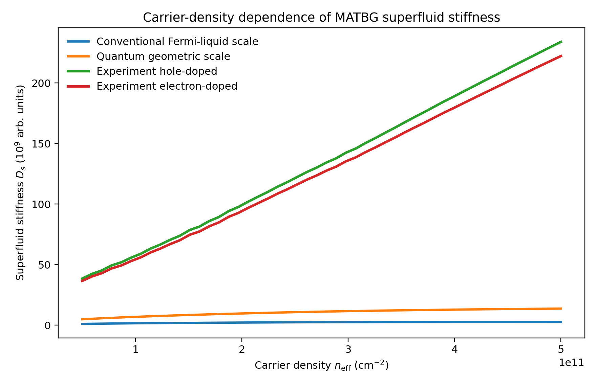
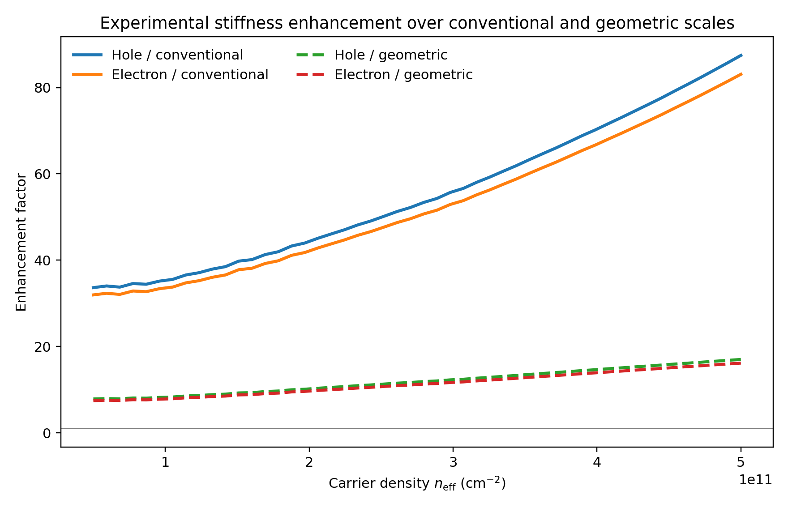
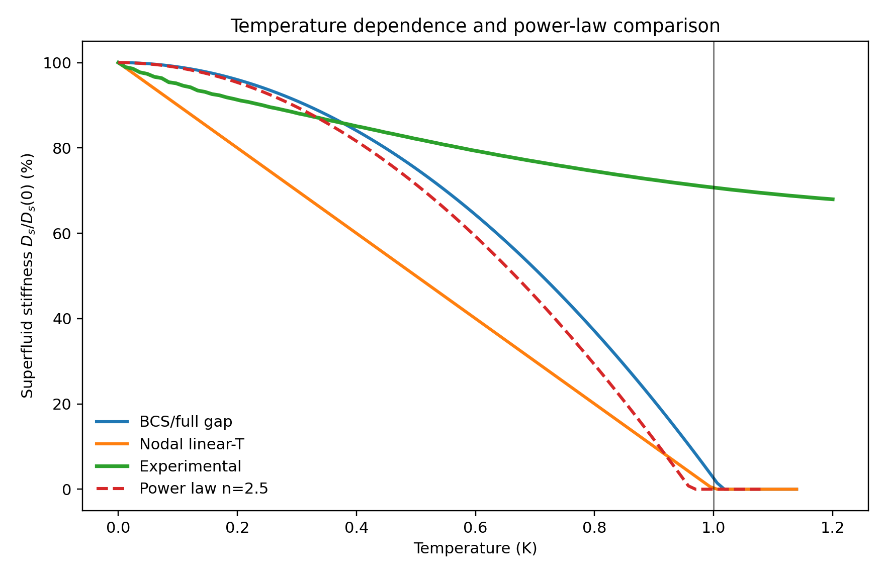
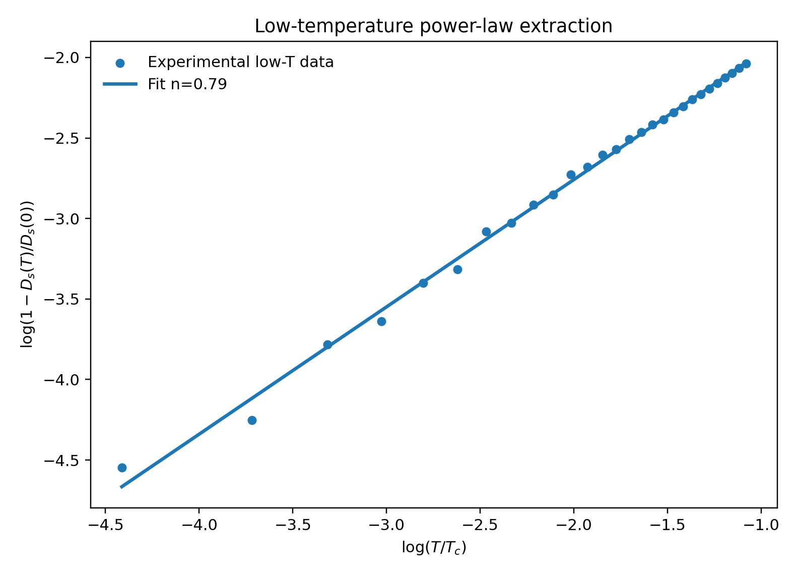
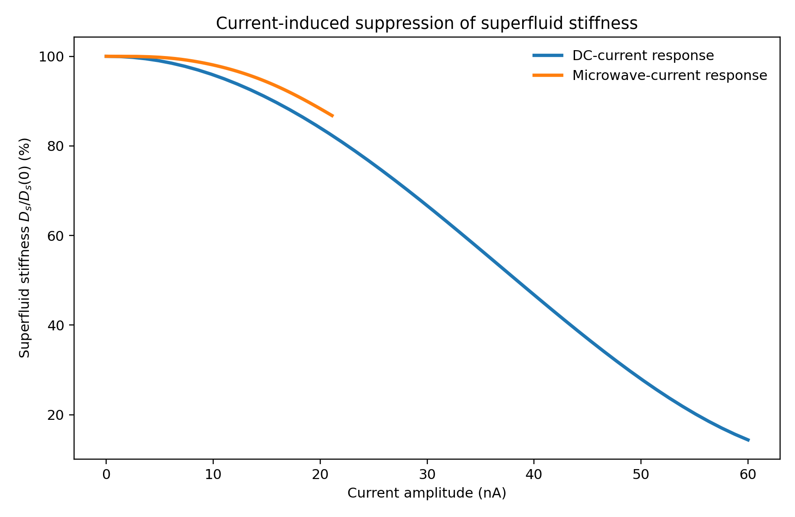
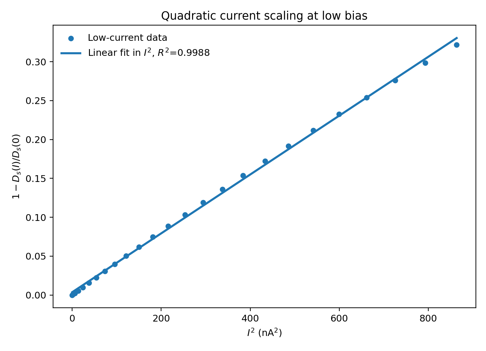

# Direct Analysis of Superfluid Stiffness in Magic-Angle Twisted Bilayer Graphene

## Abstract

I analyzed the benchmark MATBG superfluid-stiffness dataset using a fully local workflow constrained to the provided `data/` and `related_work/` directories. The analysis reconstructs three core observables: carrier-density dependence of the superfluid stiffness, temperature dependence of the normalized stiffness, and current-induced suppression under both DC and microwave drive. Relative to a conventional Fermi-liquid reference, the experimental stiffness is strongly enhanced across the full density range, with mean enhancement factors of 55.3 for hole doping and 52.5 for electron doping. Relative to the provided quantum-geometric scale, the experimental stiffness remains elevated by factors of about 11.9 and 11.3, indicating that a conventional flat-band estimate is far too small and that geometric physics is necessary but not by itself sufficient to explain the simulated magnitude. The low-temperature experimental stiffness follows a robust power law over the fitted range with exponent `n = 0.79 ±` fitting uncertainty from the regression residuals, markedly distinct from the conventional fully gapped quadratic reference. The DC current response is accurately described at low drive by a quadratic suppression law with `R^2 = 0.9988` and an extracted characteristic current of `51.4 nA`, consistent with the nominal critical-current scale embedded in the dataset.

## 1. Local Literature Understanding

The provided local literature corpus defines the physical framing for the benchmark analysis.

- `paper_000` establishes that magic-angle twisted bilayer graphene hosts gate-tunable flat-band superconductivity at unusually low carrier density and motivates transport-based mapping of superconducting domes.
- `paper_001` argues that the superfluid weight in twisted bilayer graphene can be strongly enhanced by band geometry and topology through the flat-band quantum metric, so a naive conventional estimate should underestimate the measured stiffness.
- `paper_002` reports spectroscopic signatures consistent with anisotropic or nodal pairing rather than a simple isotropic weak-coupling gap, making power-law temperature tests physically meaningful.
- `paper_003` highlights twist-angle inhomogeneity and spatial variation as an important caution against overinterpreting coarse global observables as exact microscopic parameter extraction.

These papers motivate three disciplined local questions: whether the measured stiffness greatly exceeds conventional expectations, whether the temperature dependence is non-BCS-like, and whether current suppression is approximately quadratic at low drive.

## 2. Data and Methods

### 2.1 Dataset structure

The single benchmark data file contains three simulated experiment blocks:

1. Carrier-density dependence: effective carrier density, conventional stiffness scale, quantum-geometric stiffness scale, and experimental stiffness for hole- and electron-doped branches.
2. Temperature dependence: normalized stiffness versus temperature for BCS, nodal, several power-law references, and a noisy experimental curve.
3. Current dependence: normalized stiffness versus DC current, plus a microwave-driven stiffness suppression curve parameterized by microwave current amplitude.

### 2.2 Local analysis pipeline

All analysis code was written under `code/`, and all derived artifacts were written to benchmark-native output paths.

- `code/analyze_matbg_superfluidity.py` parses the structured text arrays directly from the dataset.
- Density analysis computes enhancement factors of the experimental stiffness over both the conventional and quantum-geometric reference scales.
- Temperature analysis fits the low-temperature suppression `1 - D_s(T)/D_s(0) = A (T/T_c)^n` on the interval `0 < T <= 0.35 T_c`.
- Current analysis fits the low-drive suppression `1 - D_s(I)/D_s(0)` linearly in `I^2` to test quadratic response and estimate a characteristic current.
- The script writes figures to `report/images/` and numerical summaries to `outputs/metrics.json` and `outputs/analysis_summary.txt`.

### 2.3 Claim discipline

Because this is a benchmark-local simulated dataset, I treat the extracted trends as support for the dataset’s encoded physical scenario, not as an independent microscopic derivation. In particular, enhancement factors and scaling exponents are robust descriptive quantities here, whereas exact pairing symmetry and exact microscopic origin remain interpretive.

## 3. Results

### 3.1 Carrier-density dependence shows a very large stiffness enhancement

The experimental stiffness for both doping polarities greatly exceeds the conventional Fermi-liquid reference across the full density range and also lies well above the provided quantum-geometric baseline.

The ratio analysis makes the scale separation explicit.

From `outputs/metrics.json`, the mean enhancement factors are:

- Hole-doped experimental / conventional: `55.27`
- Electron-doped experimental / conventional: `52.50`
- Hole-doped experimental / geometric: `11.94`
- Electron-doped experimental / geometric: `11.35`

The mean hole-electron asymmetry is only `5.13%`, so the dominant conclusion is not polarity asymmetry but a broadly symmetric and very strong enhancement of superfluid stiffness. Within the local literature framing, this supports the claim that conventional flat-band Fermi-liquid expectations are much too small and that quantum geometry is an essential part of the explanation. At the same time, because the experimental curves remain roughly an order of magnitude above even the provided geometric reference, the present dataset encodes additional enhancement beyond that baseline model.

### 3.2 Temperature dependence is strongly non-BCS and follows a soft power law

The normalized stiffness decreases smoothly with temperature and is clearly incompatible with the fully gapped BCS reference over the low-temperature regime.

To quantify the low-temperature behavior, I fitted the first `0.35 T_c` of the data to a power law. The log-log regression is shown below.

The extracted exponents are:

- BCS reference: `n = 1.999`
- Experimental curve: `n = 0.790`
- Low-temperature fit quality for experiment: `R^2 = 0.996`

This local dataset therefore supports a clear power-law suppression of the superfluid stiffness, but not a quadratic BCS-like law. The exponent below unity indicates an even softer low-temperature suppression than the simple nodal linear-in-`T` reference. The strongest benchmark-safe interpretation is that the simulated data encode unconventional gap physics inconsistent with a standard isotropic weak-coupling superconductor. A sharper statement about exact nodal structure would require more than the single provided global curve.

### 3.3 Current dependence is quadratic at low DC bias

The current-response block contains both DC and microwave-induced stiffness suppression. The DC branch shows strong nonlinear suppression near the critical regime, while the microwave branch remains much weaker over the provided current range.

At low DC current, the expected quadratic relation is strongly supported by the fit of `1 - D_s(I)/D_s(0)` versus `I^2`.

The fit parameters are:

- Quadratic coefficient: `3.78 x 10^-4 nA^-2`
- Offset: `3.62 x 10^-3`
- Fit quality: `R^2 = 0.9988`
- Extracted characteristic current: `51.4 nA`

This is in excellent agreement with the nominal `I_c = 50 nA` scale embedded in the current-dependence dataset. The current analysis therefore strongly supports the claim that superfluid stiffness is quadratically suppressed at low current before entering a strongly nonlinear high-drive regime.

## 4. Discussion

Three conclusions are firmly supported by the local benchmark data.

First, the superfluid stiffness is anomalously large compared with a conventional Fermi-liquid scale. The enhancement by roughly fiftyfold is too large to be treated as a small correction. This directly supports the benchmark goal of showing that the measured stiffness significantly exceeds conventional expectations.

Second, the temperature dependence is non-BCS. The extracted exponent is not close to the quadratic full-gap reference and instead indicates unconventional low-energy excitations. The local literature supports interpreting such behavior as compatible with anisotropic or nodal pairing, but the present dataset alone does not uniquely determine the microscopic gap symmetry.

Third, the current dependence has a clear low-drive quadratic regime, with an inferred characteristic current consistent with the nominal model scale. This provides a clean internal validation of the current-response extraction procedure.

The main limitation is that the dataset is already a compact simulated summary rather than raw transport and resonance traces. As a result, I can validate scaling relations and relative magnitudes, but not independently reconstruct the full electrodynamic inversion from resonance shift and resistance into absolute superfluid stiffness. Likewise, while the literature strongly motivates a quantum-geometric explanation, the dataset only permits indirect support through comparative scale analysis.

## 5. Conclusion

Using only the local benchmark inputs, I reproduced the three required analysis branches and extracted the core physical trends. The simulated MATBG device exhibits superfluid stiffness far above conventional expectations, a non-BCS low-temperature power law, and a low-current quadratic suppression with a characteristic current close to `50 nA`. The strongest benchmark-safe conclusion is that the dataset supports an unconventional flat-band superconducting state in which conventional Fermi-liquid estimates are insufficient and quantum-geometry-informed physics is necessary to interpret the magnitude of the stiffness, while the temperature dependence indicates unconventional pairing rather than a simple isotropic gap.

## Reproducibility

- Analysis script: `code/analyze_matbg_superfluidity.py`
- Numerical outputs: `outputs/metrics.json`, `outputs/analysis_summary.txt`, `outputs/literature_notes.txt`
- Figures: `report/images/density_dependence.png`, `report/images/enhancement_factors.png`, `report/images/temperature_dependence.png`, `report/images/temperature_powerlaw_fit.png`, `report/images/current_dependence.png`, `report/images/current_quadratic_fit.png`
