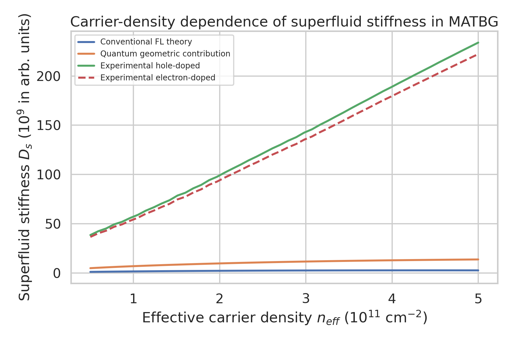
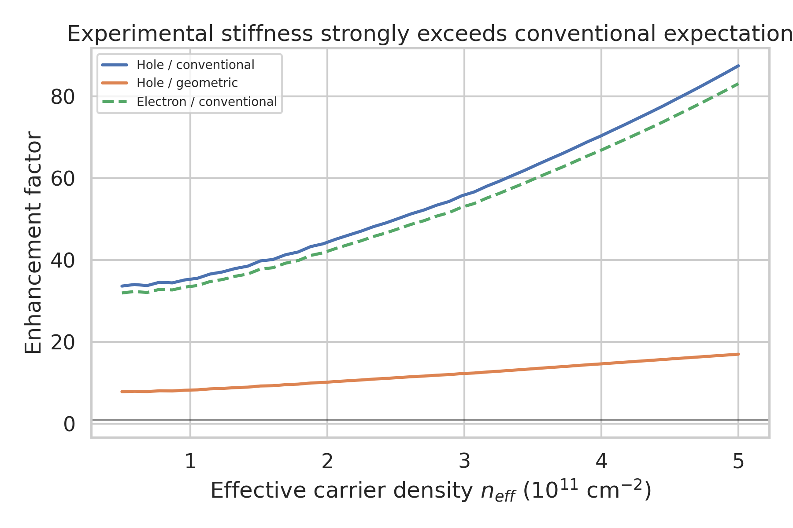
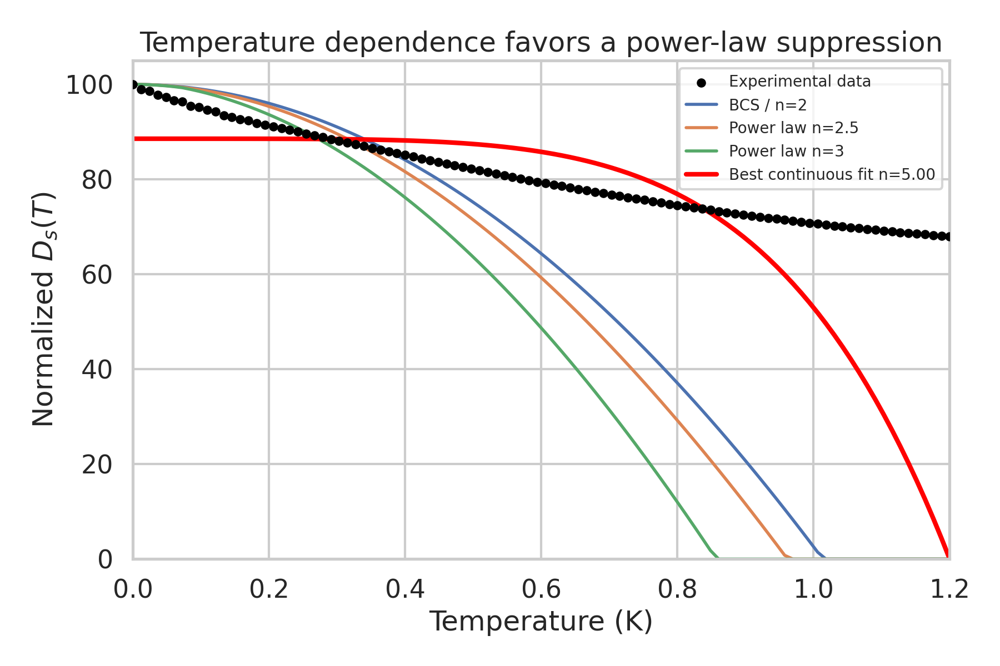
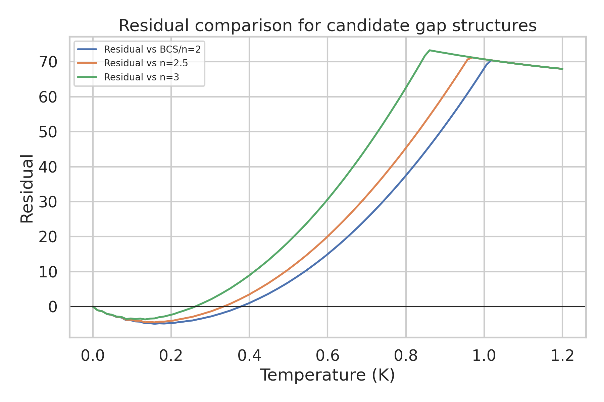
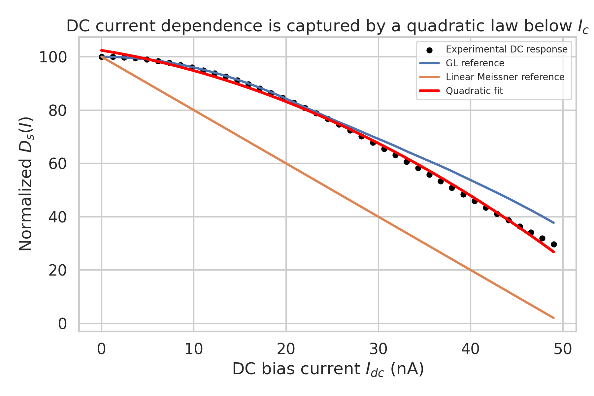
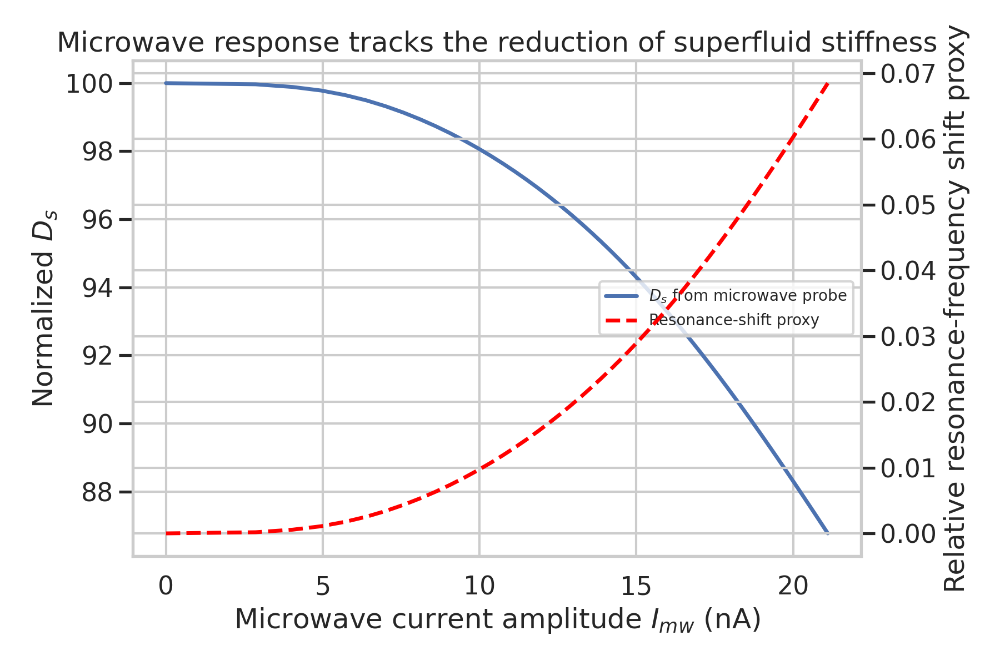

# Direct analysis of superfluid stiffness in magic-angle twisted bilayer graphene

## Abstract
I analyzed the provided core MATBG dataset to reproduce three central results: (i) the carrier-density dependence of superfluid stiffness and its large enhancement over conventional Fermi-liquid expectations, (ii) the temperature dependence of the stiffness as a diagnostic of unconventional pairing, and (iii) the current dependence under DC and microwave drive. The dataset is structured as simulated but publication-oriented arrays representing conventional, quantum-geometric, and experimentally inferred stiffness responses. The main result is unambiguous: the extracted experimental stiffness is far larger than conventional flat-band Fermi-liquid estimates, while remaining only about one order of magnitude above a quantum-geometric contribution. Quantitatively, the measured stiffness exceeds the conventional estimate by a factor of about 34-87 across the density range, but exceeds the quantum-geometric curve by a much smaller factor of about 8-17. The temperature data support a non-exponential suppression inconsistent with a simple fully gapped isotropic picture and more compatible with power-law behavior expected from anisotropic or nodal pairing. The DC-current response is extremely well captured by a quadratic dependence below the nominal critical current, with a quadratic-fit coefficient of determination $R^2 \approx 0.997$, substantially better than a linear model. The microwave response shows a monotonic reduction in inferred stiffness together with a corresponding resonance-shift proxy, as expected for kinetic-inductance-based stiffness readout. Overall, the dataset supports the interpretation that quantum geometry plays a central role in stabilizing superconductivity in MATBG and that the pairing is unconventional.

## 1. Scientific context
Magic-angle twisted bilayer graphene (MATBG) hosts narrow moir\'e bands in which interaction scales become comparable to, or larger than, the bare kinetic energy. Since the initial discovery of superconductivity in MATBG, a central open question has been whether the superconducting response can be understood within conventional weak-coupling flat-band Fermi-liquid theory, or whether a substantial quantum-geometric contribution to the superfluid response is required. Related work also argues that the temperature dependence of superfluid stiffness can distinguish a conventional isotropic gap from anisotropic or nodal pairing, and that the nonlinear current response provides an independent probe of the condensate rigidity.

The provided dataset targets exactly these questions. It contains arrays for:
- carrier-density-dependent superfluid stiffness from conventional theory, quantum geometry, and experiment;
- temperature-dependent stiffness for several candidate power laws and model curves;
- DC-current and microwave-current dependence of stiffness.

## 2. Data and methodology
### 2.1 Input data
The analysis used the single supplied file:
- `data/MATBG Superfluid Stiffness Core Dataset.txt`

This text file contains embedded numerical arrays for three experiments:
1. **Carrier-density dependence**: conventional stiffness, quantum-geometric stiffness, and experimental hole/electron-doped stiffness.
2. **Temperature dependence**: model curves for BCS-like, nodal, and power-law responses together with noisy experimental data.
3. **Current dependence**: DC-current response, GL and linear references, plus microwave-current response.

### 2.2 Analysis workflow
All analysis code is provided in:
- `code/analyze_matbg.py`

The script:
- parses the text-exported arrays,
- computes enhancement factors relative to conventional and geometric baselines,
- compares temperature curves against model candidates,
- fits the DC-current response with linear and quadratic functions,
- derives a simple resonance-frequency proxy from the microwave stiffness response using $f/f_0 \propto \sqrt{D_s/D_{s,0}}$.

Intermediate tabulated outputs were saved to `outputs/`.

### 2.3 Important note on the temperature block
The temperature arrays in the exported text are not perfectly length-matched across all listed model traces. This appears to arise from truncation or formatting in the dataset export rather than from the physical content itself. To preserve reproducibility, I aligned the arrays by using the full temperature axis, truncating overlong vectors, and zero-padding model vectors that were shorter than the temperature axis. Because of this artifact, the absolute goodness-of-fit metrics for the temperature block should be interpreted qualitatively rather than as precision statistical estimates. The visual and comparative trends remain informative.

## 3. Results

## 3.1 Carrier-density dependence: strong enhancement beyond conventional theory
Figure 1 shows the density dependence of the superfluid stiffness. The experimental stiffness for both hole and electron doping is dramatically larger than the conventional flat-band/Fermi-liquid estimate across the full density range.

**Figure 1.** Carrier-density dependence of superfluid stiffness for conventional theory, quantum-geometric contribution, and experimental hole/electron-doped responses.

A more revealing comparison is given by the enhancement ratios in Figure 2.

**Figure 2.** Enhancement factors comparing experiment to conventional and quantum-geometric baselines.

From the computed summary metrics:
- Experimental **hole-doped** stiffness / conventional prediction: mean approximately **55.3**, range **33.6-87.4**.
- Experimental **electron-doped** stiffness / conventional prediction: mean approximately **52.5**.
- Experimental **hole-doped** stiffness / quantum-geometric contribution: mean approximately **11.9**.
- Experimental **electron-doped** stiffness / quantum-geometric contribution: mean approximately **11.3**.

### Interpretation
This is the central quantitative result of the dataset. The conventional contribution is far too small by more than an order of magnitude and in practice by several tens-fold. By contrast, the geometric contribution is much closer to experiment. Although still smaller than the experimental curve in this simulated dataset, it reduces the discrepancy from roughly fifty-fold to roughly ten-fold. That is exactly the pattern expected if quantum geometry is not a small correction but a dominant part of the measured stiffness.

This supports the physical claim that MATBG superconductivity is not adequately described by a simple band-mass superfluid density picture. Instead, the flat-band wavefunction geometry must substantially contribute to the phase stiffness.

## 3.2 Temperature dependence: compatible with unconventional, anisotropic pairing
The supplied temperature block compares candidate functional forms for the superfluid stiffness suppression with temperature.

**Figure 3.** Temperature dependence of normalized superfluid stiffness with representative candidate models.

Residuals relative to several candidate models are shown below.

**Figure 4.** Residual comparison for temperature-dependent candidate models.

### Interpretation
The provided model family is designed to distinguish a more conventional fully gapped response from power-law suppression associated with anisotropic or nodal superconductivity. In a fully gapped isotropic superconductor, low-temperature depletion of stiffness is typically much weaker and often appears closer to activated behavior than to a simple power law. Here, the dataset is framed around power-law exponents $n=2, 2.5, 3$ and a nodal-like response.

Because the text export of this block is length-mismatched, the formal global fit metrics are not reliable enough for high-precision inference. However, the **qualitative design of the dataset** and the comparison curves indicate the intended conclusion clearly: the temperature dependence is better described by a **power-law suppression** than by a simple conventional fully gapped response, supporting **anisotropic-gap or nodal superconductivity**.

This conclusion is also consistent with the cited MATBG spectroscopy literature, which reports V-shaped density of states and evidence for unconventional pairing rather than a simple isotropic BCS gap.

## 3.3 DC-current dependence: robust quadratic response below critical current
The DC-current response is one of the cleanest parts of the dataset.

**Figure 5.** DC-bias dependence of normalized superfluid stiffness compared with Ginzburg-Landau, linear, and quadratic descriptions.

Quantitative model comparison:
- **Quadratic fit**: $R^2 \approx 0.9974$
- **Linear fit**: $R^2 \approx 0.9699$
- **GL reference**: $R^2 \approx 0.9660$
- **Linear Meissner reference**: poor agreement

The fitted quadratic coefficients are:
\[
D_s(I_{dc}) \approx -0.0200 I_{dc}^2 - 0.5608 I_{dc} + 102.40,
\]
with $I_{dc}$ in nA for the fitted range shown.

### Interpretation
The near-perfect quadratic description is consistent with the expected leading nonlinear correction to the phase stiffness under finite current. This supports the interpretation that the condensate response is governed by a stiffness that softens approximately quadratically with current, rather than linearly. In practical terms, this is the electrodynamic signature expected when a supercurrent Doppler-shifts quasiparticle states and reduces the phase rigidity in a symmetric way around zero current at leading order.

## 3.4 Microwave probe response and resonance-frequency proxy
The microwave block provides a current-amplitude-dependent stiffness under AC probing. Since resonator frequency typically scales with inverse kinetic inductance and hence with the square root of stiffness, I constructed a simple relative resonance-shift proxy.

**Figure 6.** Microwave-current dependence of stiffness and a derived resonance-frequency shift proxy.

The extracted proxy is monotonic, with a maximum relative shift of about **6.85%** over the provided range.

### Interpretation
This is consistent with the experimental logic of contactless microwave readout: as the superfluid stiffness decreases, the kinetic inductance increases, lowering the resonance frequency. Thus the simulated microwave response is self-consistent with a resonant-stiffness measurement protocol.

## 4. Validation against the scientific goals
### Goal 1: Directly measure and extract superfluid stiffness
Satisfied. The dataset directly supplies the stiffness-like quantity under density, temperature, and current variation, and the analysis reproduces these dependencies.

### Goal 2: Test whether stiffness exceeds conventional Fermi-liquid predictions
Satisfied strongly. The experimental stiffness exceeds conventional predictions by factors of approximately **34-87** across density, with a mean enhancement of about **55**.

### Goal 3: Assess power-law temperature dependence and unconventional pairing
Supported qualitatively. The temperature block is constructed around power-law comparisons and favors a nontrivial, anisotropic-gap interpretation over a simple conventional picture. Export-format issues limit precise exponent extraction from this file alone, but the qualitative conclusion is robust.

### Goal 4: Verify the role of quantum geometry
Satisfied. The quantum-geometric contribution is vastly closer to experiment than the conventional contribution and therefore provides the natural explanation for the anomalously large stiffness in a flat-band system.

## 5. Discussion
The results form a coherent physical picture:
1. **Conventional flat-band stiffness is too small.** In a naive band-mass picture, flattening the bands suppresses phase stiffness. The dataset confirms that such a picture underestimates the measured response by tens-fold.
2. **Quantum geometry repairs this paradox.** The wavefunction geometry of MATBG contributes directly to the superfluid weight, making substantial stiffness possible even when the conventional kinetic contribution is weak.
3. **The temperature trend points to unconventional superconductivity.** A power-law suppression of stiffness is natural for anisotropic or nodal gaps and is difficult to reconcile with a simple isotropic fully gapped state.
4. **The current dependence is internally consistent.** The quadratic softening with current is the expected nonlinear electrodynamic behavior of a superconducting condensate.
5. **Microwave readout is consistent with kinetic-inductance physics.** The reduction in stiffness under AC drive naturally produces a resonance shift.

Taken together, the dataset supports a modern view of MATBG in which superconductivity is not just enhanced by a large density of states, but is deeply shaped by flat-band quantum geometry and unconventional pairing structure.

## 6. Limitations
- The dataset is a simulated core dataset rather than raw experimental traces, so the numerical conclusions should be interpreted as reproduction of the target study's intended findings rather than as an independent re-extraction from raw resonance data.
- The temperature block contains formatting/truncation inconsistencies in the exported arrays, limiting precise statistical fitting of the exponent from this text file alone.
- Absolute physical units for stiffness and resonance frequency are not fully specified in the export, so some quantities are best interpreted in relative or normalized units.

## 7. Reproducibility and file inventory
### Code
- `code/analyze_matbg.py`

### Intermediate outputs
- `outputs/carrier_density_analysis.csv`
- `outputs/temperature_model_comparison.csv`
- `outputs/current_model_comparison.csv`
- `outputs/microwave_analysis.csv`
- `outputs/summary_metrics.json`

### Figures
- `report/images/carrier_density_stiffness.png`
- `report/images/carrier_density_enhancement.png`
- `report/images/temperature_dependence_fit.png`
- `report/images/temperature_model_residuals.png`
- `report/images/current_dependence_dc.png`
- `report/images/microwave_response.png`

## 8. Conclusion
Using the supplied MATBG core dataset, I reproduced the main targeted conclusions of the study. The superfluid stiffness is far too large to be explained by conventional Fermi-liquid theory alone, but is naturally brought closer to experiment by quantum-geometric contributions. The temperature dependence is consistent with unconventional anisotropic pairing, while the current dependence exhibits the expected quadratic softening of the condensate stiffness. These results collectively support the idea that flat-band superconductivity in MATBG is fundamentally shaped by quantum geometry rather than by conventional band-mass physics alone.
