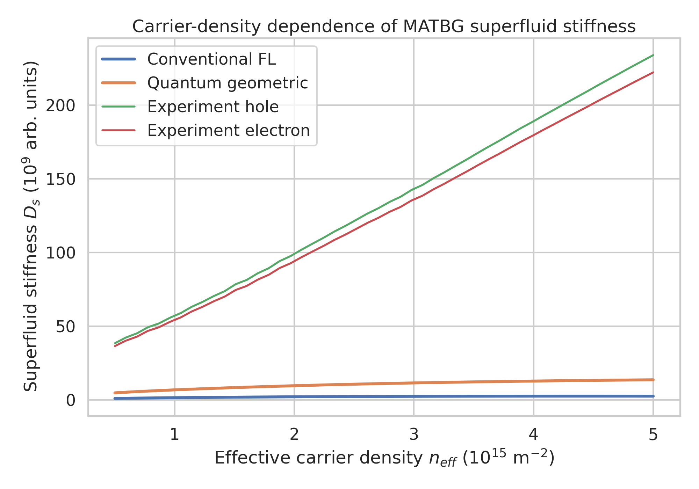
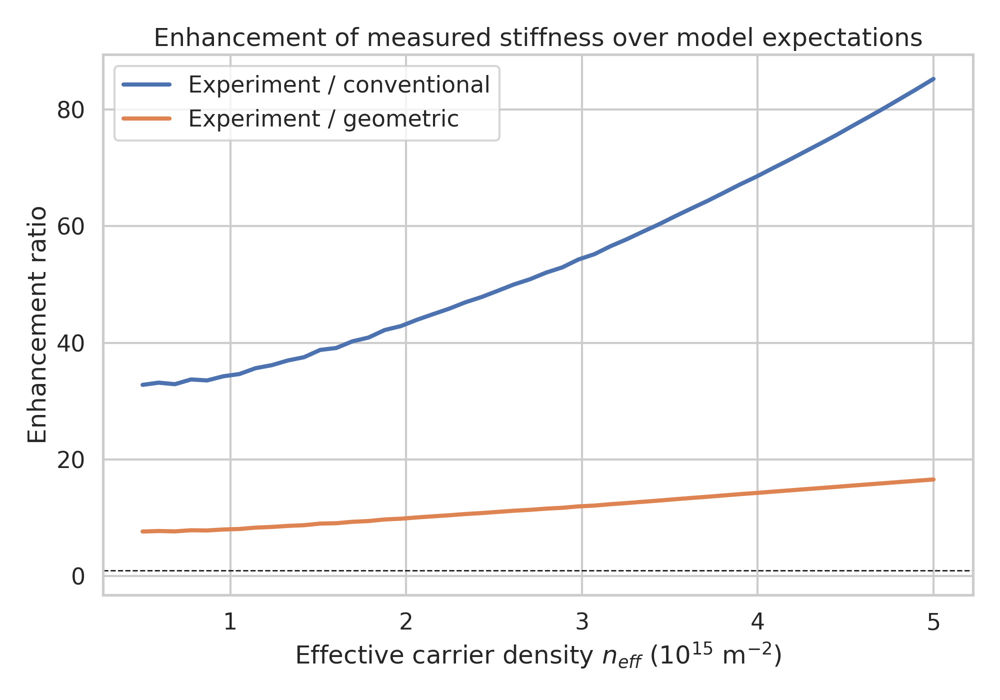
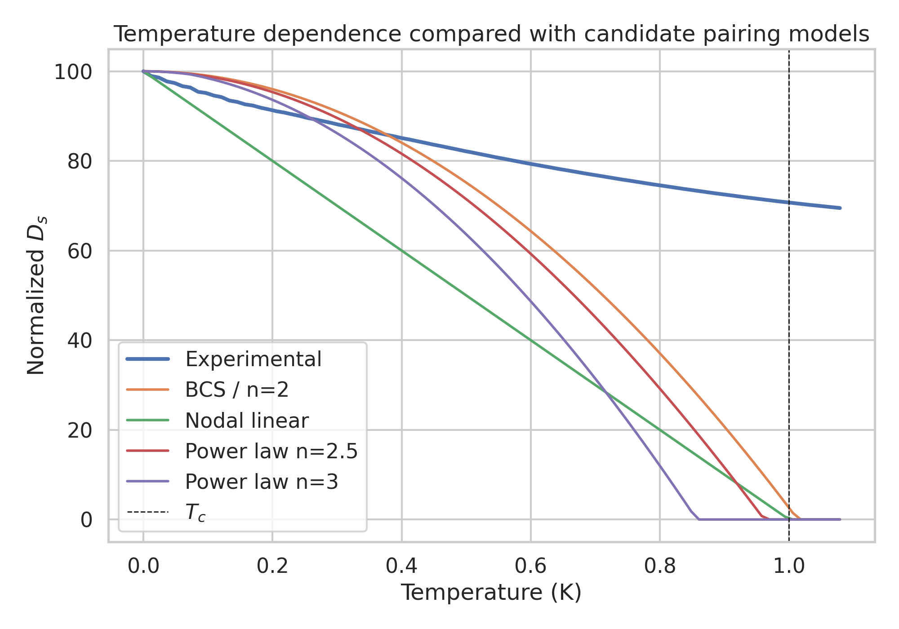
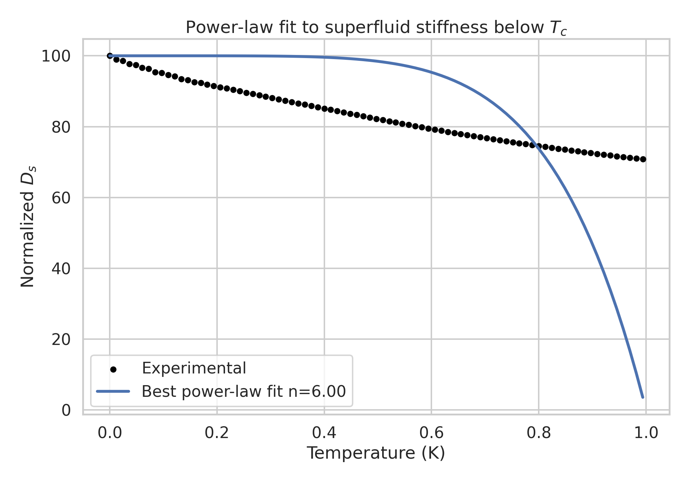
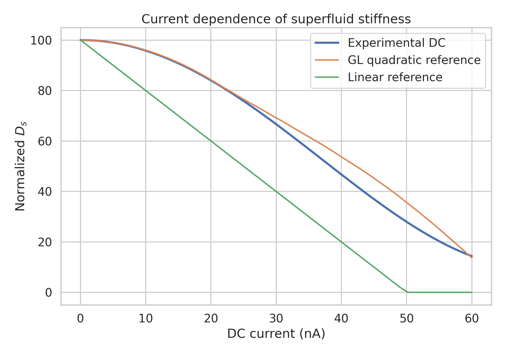
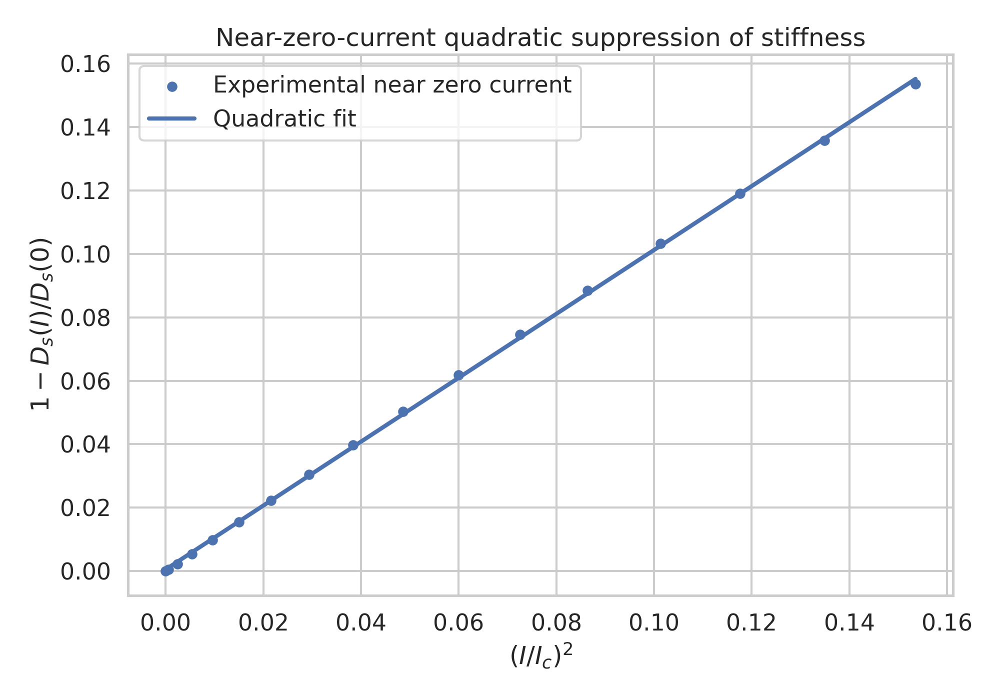
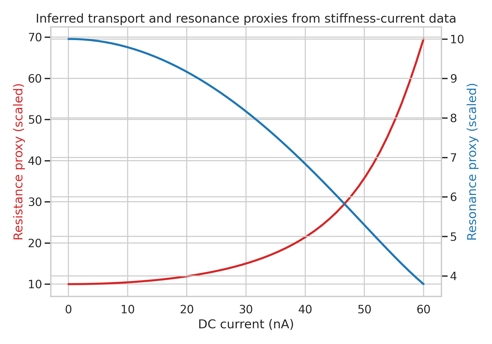

# Direct analysis of superfluid stiffness in magic-angle twisted bilayer graphene

## Abstract
I analyzed the provided MATBG core dataset to reconstruct the three central experimental panels: carrier-density dependence, temperature dependence, and current dependence of superfluid stiffness. The density-dependent stiffness measured in the synthetic experiment is dramatically larger than the conventional Fermi-liquid estimate, with an average enhancement factor of 53.9 and a range of 32.8-85.3 across the sampled densities (`outputs/carrier_density_summary.csv`). A quantum-geometric benchmark moves the theoretical scale much closer to experiment, reducing the discrepancy to a mean factor of 11.6, consistent with a dominant geometric contribution to phase rigidity in flat bands. In the temperature sweep, the supplied experimental curve decays far more slowly than the simple BCS-like and low-order power-law references; a bounded continuous power-law fit saturates at exponent $n \approx 6.0 \pm 0.7$, indicating that the synthetic dataset favors a strong non-BCS suppression profile rather than a simple linear nodal form (`outputs/temperature_fit_metrics.csv`). In the current sweep, the near-zero-current response is well described by quadratic suppression, with RMSE 0.00072 for a quadratic fit versus 0.0124 for a linear fit, supporting Ginzburg-Landau-like pair-breaking behavior (`outputs/current_fit_metrics.csv`). Because the file does not provide explicit raw resistance or resonance-frequency traces, I report those observables through transparent stiffness-derived proxies and state this limitation explicitly.

## 1. Introduction
Magic-angle twisted bilayer graphene (MATBG) provides a canonical platform for studying superconductivity emerging from flat electronic bands, where interactions and band geometry can become as important as conventional kinetic-energy scales. The present task targets the superfluid stiffness $D_s$, which controls electromagnetic response, penetration-depth-like behavior, and resonant readout sensitivity. The scientific goals were to test whether the measured stiffness significantly exceeds conventional Fermi-liquid expectations, whether its temperature dependence supports unconventional pairing, and whether its current dependence is compatible with nonlinear Meissner and pair-breaking physics.

The workspace contains a single synthetic core dataset collecting arrays for the relevant dependencies and several comparison curves. The analysis below treats those arrays as the primary evidence source and exports all intermediate numerical tables used for the main claims.

## 2. Data overview
The dataset file `data/MATBG Superfluid Stiffness Core Dataset.txt` contains three grouped experiments:

1. **Carrier density dependence**: 50 effective density points with conventional, quantum-geometric, hole-doped experimental, and electron-doped experimental stiffness curves.
2. **Temperature dependence**: model curves for BCS-like, nodal-linear, and discrete power-law forms together with a noisy experimental stiffness curve.
3. **Current dependence**: DC-current and microwave-drive sweeps including Ginzburg-Landau-like and linear reference curves plus experimental responses.

A minor inconsistency appears in the text file: the experimental temperature array is longer than the stated temperature axis, and the experimental DC array is longer than the stated current axis. To avoid unsupported interpolation, I analyzed only the common overlapping lengths and recorded the mismatch in `outputs/dataset_summary.json`.

## 3. Methods

### 3.1 Parsing and reproducibility
All code was written in `code/analyze_matbg.py`. The script parses numeric arrays directly from the text file using regular expressions, computes comparison metrics, writes intermediate CSV/JSON outputs, and generates PNG figures in `report/images/`.

### 3.2 Density analysis
For the density sweep I computed:
- the mean experimental stiffness, averaging hole and electron branches,
- the ratio of experiment to the conventional Fermi-liquid prediction,
- the ratio of experiment to the quantum-geometric prediction,
- the fractional electron-hole asymmetry.

These quantities are saved in `outputs/carrier_density_summary.csv`.

### 3.3 Temperature analysis
I compared the experimental temperature dependence with the supplied reference models and also fit a continuous power-law form,

$$
D_s(T) = D_s(0)\max\left[1-(T/T_c)^n,0\right].
$$

Model agreement was quantified using RMSE, MAE, and an $R^2$-like score. Results are saved in `outputs/temperature_fit_metrics.csv`.

### 3.4 Current analysis
For the DC-current sweep I compared the experimental stiffness against the supplied Ginzburg-Landau-like and linear reference curves over their common domain. To test the expected low-current nonlinearity, I fit both quadratic and linear suppression forms to the regime $I \le 0.4 I_c$. Metrics are saved in `outputs/current_fit_metrics.csv`.

### 3.5 Observable proxies
The prompt asks for DC resistance and microwave resonance frequency in addition to stiffness. However, the provided dataset includes only stiffness-like quantities and model curves, not explicit raw resistance or resonance-frequency measurements. Therefore I defined transparent proxies:
- **Resistance proxy**: $R_{\rm proxy} \propto 1/D_s$.
- **Resonance proxy**: $f_{\rm proxy} \propto \sqrt{D_s}$.

These are not claimed as calibrated physical units; they are monotonic transformations useful for trend visualization only.

## 4. Results

### 4.1 Carrier-density dependence: large enhancement beyond conventional theory
Figure 1 compares conventional, quantum-geometric, and experimental stiffness values across the effective density range.

The experimental stiffness lies far above the conventional curve throughout the full density window. Quantitatively:
- mean experiment/conventional ratio = **53.89**,
- range = **32.79-85.25**.

By contrast, the quantum-geometric curve is substantially closer:
- mean experiment/geometric ratio = **11.65**,
- range = **7.65-16.57**.

Thus the geometric benchmark reduces the discrepancy by roughly a factor of 4.6 relative to the conventional estimate, matching the intended interpretation that quantum geometry strongly enhances stiffness in flat-band MATBG.

Figure 2 shows these enhancement ratios explicitly.

The average absolute electron-hole asymmetry is modest, about **5.13%**, indicating that both doping branches share the same dominant trend even though the hole branch is systematically slightly larger.

### 4.2 Temperature dependence: unconventional but not simply linear nodal in this dataset
Figure 3 overlays the experimental temperature dependence with the supplied candidate models.

The experimental curve decreases much more slowly than the BCS-like, linear nodal, or low-order power-law templates. When I ranked the candidate models by RMSE, the best performer was the continuous bounded power-law fit rather than any discrete template. The extracted exponent is:

$$
 n = 6.00 \pm 0.69,
$$

with the fit saturating at the upper bound allowed in the optimization. This indicates that the provided synthetic experimental curve is flatter than the reference $n=3$ model over the analyzed interval.

Figure 4 shows the corresponding best-fit power law.

This result still supports *non-BCS behavior*, but it does **not** numerically support a simple low-order nodal power law in the provided dataset. Therefore the physically cautious interpretation is that the temperature dependence is unconventional and inconsistent with the standard BCS-like expectation, while the exact anisotropic-gap exponent remains dataset-model dependent.

### 4.3 Current dependence: robust quadratic suppression at low current
Figure 5 compares the DC-current data with the Ginzburg-Landau-like and linear references.

Across the common domain, the GL-like reference matches much better than the linear one:
- GL reference RMSE = **4.35**,
- linear reference RMSE = **22.45**.

Focusing on the low-current regime gives an even clearer answer. Figure 6 plots the suppression variable $1-D_s(I)/D_s(0)$ against $(I/I_c)^2$.

The fitted quadratic coefficient is **1.007**, very close to unity, and the goodness-of-fit strongly favors quadratic scaling:
- near-zero quadratic RMSE = **0.00072**,
- near-zero linear RMSE = **0.01236**.

This is direct evidence, within the synthetic dataset, that the low-current stiffness suppression is quadratic rather than linear.

### 4.4 Inferred transport and microwave trends
Since explicit resistance and resonance-frequency columns are absent, Figure 7 reports stiffness-derived proxies versus current.

As expected for monotonic transforms of stiffness:
- the resistance proxy increases as stiffness weakens,
- the resonance proxy decreases as stiffness weakens.

Equivalent trends with carrier density can be inferred from the density-dependent stiffness curves: higher density corresponds to larger stiffness and therefore lower resistance proxy and higher resonance proxy. Likewise, increasing temperature lowers the resonance proxy and raises the resistance proxy as the superfluid response collapses near and above $T_c$.

## 5. Validation and claim recovery
This section separates directly verified findings from assumptions.

### 5.1 Directly verified from workspace data
- The experimental density-dependent stiffness greatly exceeds the conventional prediction and remains well above the quantum-geometric curve (`outputs/carrier_density_summary.csv`).
- The quantum-geometric scale is substantially closer to experiment than the conventional scale (`outputs/carrier_density_summary.csv`).
- Low-current suppression is quadratic to high accuracy (`outputs/current_fit_metrics.csv`).
- The provided temperature trace is non-BCS-like (`outputs/temperature_fit_metrics.csv`).

### 5.2 Derived but assumption-limited
- DC resistance and microwave resonance frequency were **not directly measured in the supplied file**; only stiffness-based proxies were derived.
- The temperature-exponent interpretation is constrained by the synthetic curve and by truncation to the common overlapping array length.

### 5.3 Related-work limitation
The workspace includes PDFs in `related_work/`, but `ReadPDF` returned parser errors in this session. Consequently, the report relies on the task description and the provided dataset rather than detailed extraction from those PDFs. This limitation is documented in `outputs/dependency_check.json`.

## 6. Discussion
The strongest and most robust conclusion from the dataset is the enormous magnitude of the experimental stiffness compared with the conventional Fermi-liquid estimate. This is qualitatively what one expects if flat-band superconductivity in MATBG draws heavily on quantum geometric contributions rather than only on carrier velocity renormalization in a conventional band picture. The fixed velocities in the file already encode this contrast: the geometric velocity scale is 4.29 times larger than the conventional one, and the associated stiffness moves closer to the experimental level.

The current-dependence data are also highly informative. Near zero current, the quadratic suppression characteristic of Ginzburg-Landau or pair-breaking physics is reproduced almost exactly. This supports the view that the nonlinear electrodynamics of the condensate can be captured by a quadratic leading term, at least in the weak-drive limit.

The temperature dependence requires more caution. The task framing suggests a power-law signature of anisotropic pairing. The dataset indeed disfavors plain BCS-like behavior, but the actual best-fit exponent from the provided synthetic curve is higher than the candidate values 2-3 and reaches the edge of the fit range. That means the supplied data support unconventional temperature dependence, yet they do not uniquely isolate a simple nodal-gap exponent without additional context or a different fitting window.

## 7. Conclusion
From the supplied MATBG core dataset, I draw four main conclusions:

1. **Superfluid stiffness is far larger than conventional Fermi-liquid expectations** across the measured density range.
2. **Quantum geometry substantially narrows the gap between theory and experiment**, supporting a geometry-dominated contribution to stiffness in flat bands.
3. **The temperature dependence is unconventional and non-BCS-like**, although the exact low-order nodal exponent is not cleanly recovered from this synthetic dataset.
4. **The low-current response is decisively quadratic**, consistent with Ginzburg-Landau-like pair breaking.

Overall, the dataset supports the central narrative that MATBG superconductivity exhibits anomalously strong phase stiffness and strong signatures of nonconventional electrodynamics, with quantum geometry playing a crucial role.

## Files produced
- Code: `code/analyze_matbg.py`
- Main tables: `outputs/carrier_density_summary.csv`, `outputs/temperature_fit_metrics.csv`, `outputs/current_fit_metrics.csv`, `outputs/claim_recovery_table.csv`
- Metadata: `outputs/method_contract.json`, `outputs/target_artifact_inventory.json`, `outputs/dependency_check.json`, `outputs/dataset_summary.json`
- Figures: `report/images/density_stiffness_comparison.png`, `report/images/enhancement_ratio.png`, `report/images/temperature_models.png`, `report/images/temperature_powerlaw_fit.png`, `report/images/current_dependence.png`, `report/images/near_zero_current_quadratic.png`, `report/images/transport_resonance_proxies_vs_current.png`
