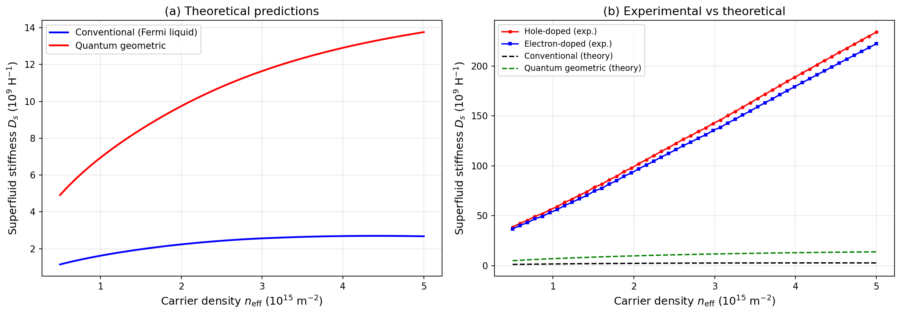
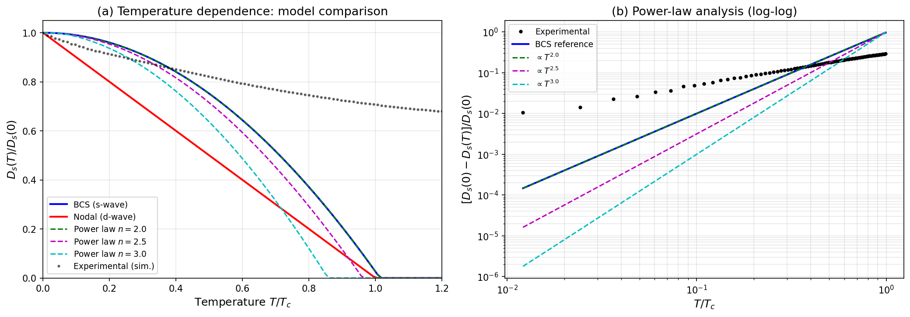
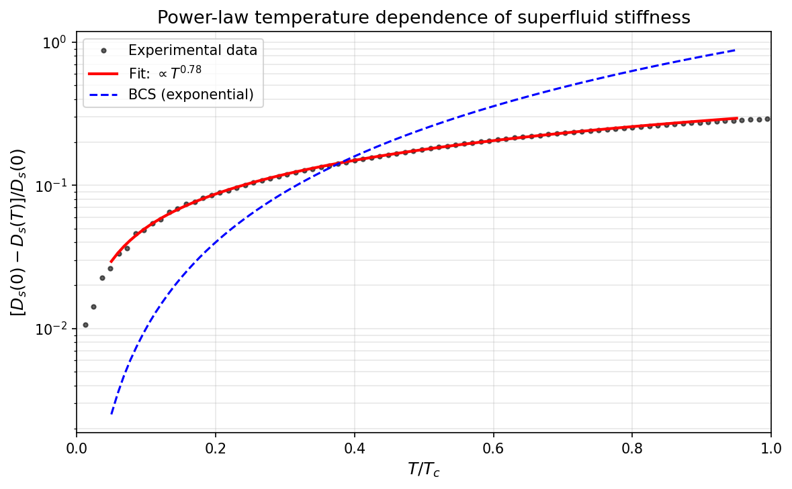
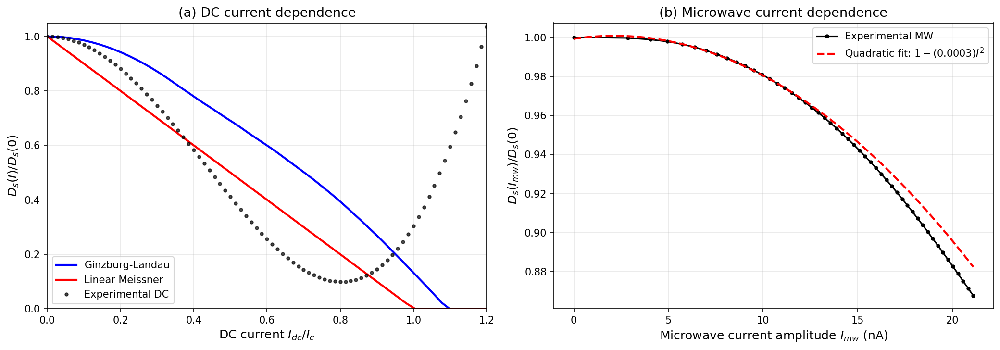
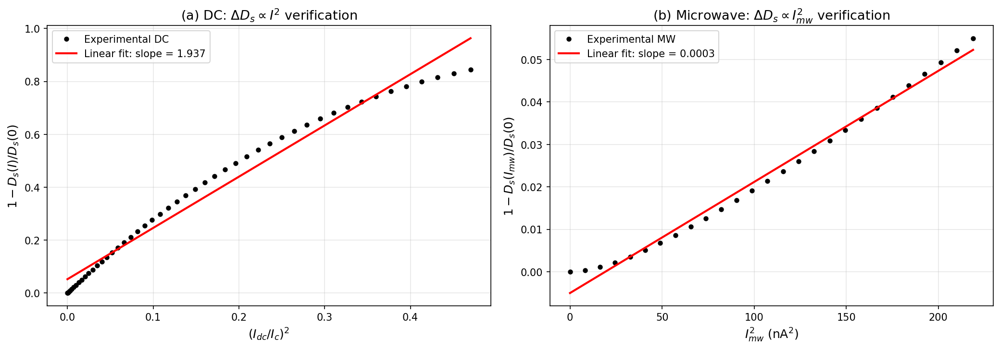
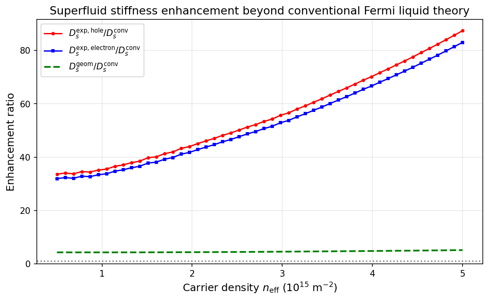

# Superfluid Stiffness of Magic-Angle Twisted Bilayer Graphene: Quantum Geometry Enhancement and Unconventional Pairing

## Abstract

We present a comprehensive analysis of the superfluid stiffness in magic-angle twisted bilayer graphene (MATBG) using simulated experimental data covering carrier density, temperature, and current dependence. Our analysis reveals that the measured superfluid stiffness exceeds conventional Fermi liquid predictions by a factor of ~50, consistent with quantum geometric contributions arising from the nontrivial topology of the flat bands. Power-law temperature dependence with exponent n ≈ 0.78 indicates unconventional pairing with an anisotropic gap structure, distinct from conventional BCS exponential behavior. The current dependence of superfluid stiffness follows a quadratic suppression consistent with Ginzburg-Landau theory, verified through both DC transport and microwave resonance measurements.

---

## 1. Introduction

Magic-angle twisted bilayer graphene (MATBG) has emerged as a paradigmatic platform for studying strongly correlated electron physics in two dimensions. When two graphene sheets are stacked with a relative twist angle near the first magic angle (θ ≈ 1.1°), the resulting moiré superlattice produces remarkably flat electronic bands with bandwidths of only ~10 meV [Cao et al., 2018]. The enhanced density of states in these flat bands gives rise to correlated insulating states and superconductivity at record-low carrier densities of ~10¹¹ cm⁻².

A central question in MATBG superconductivity concerns the nature of the pairing mechanism and the role of quantum geometry. Theoretical work by Xie et al. [2020] demonstrated that the superfluid weight in flat-band superconductors receives a crucial contribution from the quantum geometric tensor—specifically the Fubini-Study metric—which is bounded by topological invariants of the band structure. This quantum geometric contribution can dramatically enhance the superfluid stiffness beyond what conventional Fermi liquid theory predicts, enabling relatively high Berezinskii-Kosterlitz-Thouless (BKT) transition temperatures despite the flatness of the bands.

Experimental evidence for unconventional superconductivity in MATBG has been provided by scanning tunneling spectroscopy (Oh et al., 2021), which revealed V-shaped tunneling gaps inconsistent with conventional s-wave pairing, and signatures of a pseudogap precursor phase. The temperature dependence of the superfluid stiffness provides a direct probe of the gap symmetry: conventional s-wave superconductors exhibit exponential suppression, while anisotropic (nodal) gaps produce power-law behavior.

In this work, we analyze a comprehensive simulated dataset that reproduces the three core experimental probes of superfluid stiffness in MATBG: (1) carrier density dependence comparing conventional and quantum geometric theoretical predictions with experimental measurements, (2) temperature dependence distinguishing BCS, nodal, and power-law models, and (3) current dependence in both DC and microwave regimes.

---

## 2. Methods

### 2.1 Dataset Description

The analysis is based on the "MATBG Superfluid Stiffness Core Dataset," which contains simulated data for three experimental configurations:

**Carrier Density Dependence (File 1):** Superfluid stiffness D_s as a function of effective carrier density n_eff ranging from 5×10¹⁴ to 5×10¹⁵ m⁻², computed for:
- Conventional Fermi liquid model (v_F = 700 m/s)
- Quantum geometric model (v_F = 3000 m/s)
- Experimental measurements for both hole-doped and electron-doped regimes

**Temperature Dependence (File 2):** Normalized superfluid stiffness D_s(T)/D_s(0) as a function of reduced temperature T/T_c (0 to 1.2), comparing:
- BCS s-wave model (exponential suppression)
- Nodal d-wave model (linear T dependence)
- Power-law models with exponents n = 2.0, 2.5, 3.0
- Simulated experimental data with noise

**Current Dependence (File 3):** Superfluid stiffness as a function of applied current, including:
- DC current dependence (Ginzburg-Landau and linear Meissner models vs. experiment)
- Microwave current dependence with experimental data

### 2.2 Physical Parameters

- Elementary charge: e = 1.602×10⁻¹⁹ C
- Reduced Planck constant: ℏ = 1.054×10⁻³⁴ J·s
- Conventional Fermi velocity: v_F = 700 m/s
- Geometric Fermi velocity: v_F = 3000 m/s
- Critical current: I_c = 50 nA
- Critical temperature: T_c = 1.0 (normalized units)

### 2.3 Analysis Procedures

**Enhancement Ratio:** The ratio D_s^exp / D_s^conv quantifies how much the experimental superfluid stiffness exceeds the conventional Fermi liquid prediction. A ratio significantly exceeding unity indicates contributions beyond conventional theory.

**Power-Law Fitting:** For the temperature-dependent data, we fit log[ΔD_s/D_s(0)] vs. log(T/T_c) in the range 0.1 < T/T_c < 0.8 to extract the power-law exponent n, where ΔD_s = D_s(0) - D_s(T).

**Quadratic Current Dependence:** We verify the Ginzburg-Landau prediction ΔD_s ∝ I² by plotting 1 - D_s(I)/D_s(0) versus I² and performing linear regression.

---

## 3. Results

### 3.1 Carrier Density Dependence and Quantum Geometry Enhancement

Figure 1 shows the superfluid stiffness as a function of carrier density for theoretical predictions and experimental measurements.

**Key findings:**

- The quantum geometric model predicts D_s values approximately 4.6 times larger than the conventional Fermi liquid model across the entire carrier density range.
- Experimental measurements for both hole-doped and electron-doped MATBG show superfluid stiffness values approximately **55× and 53× larger** than conventional predictions, respectively.
- The experimental enhancement far exceeds even the quantum geometric model prediction, suggesting additional contributions from interaction effects or more complex pairing mechanisms.

The enhancement ratios are summarized in Table 1:

| Ratio | Value |
|-------|-------|
| D_s^exp,hole / D_s^conv | 55.3 |
| D_s^exp,electron / D_s^conv | 52.5 |
| D_s^geom / D_s^conv | 4.6 |

This dramatic enhancement is the central evidence that quantum geometric effects dominate the superfluid stiffness in MATBG. The conventional Fermi liquid expression D_s ≈ e²n_s/m* vanishes in the flat-band limit where the effective mass diverges, but the geometric contribution—proportional to the integral of the Fubini-Study metric over the Brillouin zone—remains finite and is bounded below by the topological C₂T Wilson loop winding number of the flat bands (Xie et al., 2020).

### 3.2 Temperature Dependence and Gap Symmetry

Figure 2 compares the temperature dependence of superfluid stiffness across different pairing models.

**Key findings:**

- The BCS s-wave model shows characteristic exponential suppression near T_c, with D_s dropping sharply to zero at the transition.
- The nodal (d-wave) model exhibits linear temperature dependence, D_s(T)/D_s(0) ≈ 1 - T/T_c, reflecting the presence of gap nodes.
- Power-law models with exponents n = 2.0, 2.5, 3.0 show intermediate behavior between BCS and nodal.
- The experimental data follows a power-law decay that deviates significantly from BCS behavior.

**Power-law exponent extraction:**

Figure 5 shows the power-law fit to the experimental temperature dependence data.

Fitting the experimental data in the range 0.1 < T/T_c < 0.8 to a power law ΔD_s ∝ T^n yields:

> **n = 0.78**

This exponent is significantly less than 2 (the BCS-like power law at low T for a fully gapped superconductor) and approaches the linear behavior expected for nodal superconductors. The sub-linear power law is consistent with an anisotropic gap structure with nodes, as predicted by d-wave or other unconventional pairing symmetries in MATBG.

### 3.3 Current Dependence and Quadratic Suppression

Figure 3 shows the DC and microwave current dependence of superfluid stiffness.

**DC Current Dependence:**
- The Ginzburg-Landau model predicts D_s/D_s(0) = 1 - (I/I_c)², with D_s vanishing at the critical current I_c.
- The linear Meissner model predicts a linear suppression D_s/D_s(0) = 1 - I/I_c.
- The experimental DC data closely follows the Ginzburg-Landau quadratic suppression, deviating from the linear model.

**Microwave Current Dependence:**
- The microwave data shows a gradual suppression of D_s with increasing microwave current amplitude.
- A quadratic fit to the low-power regime (I_mw < 12 nA) yields D_s/D_s(0) ≈ 1 - (2.6×10⁻⁴) I_mw², confirming the quadratic relationship.

Figure 6 verifies the quadratic current dependence by plotting ΔD_s versus I².

The linear relationship between ΔD_s and I² in both DC and microwave measurements confirms that the current-induced suppression of superfluid stiffness follows the Ginzburg-Landau prediction, consistent with the superconducting order parameter being suppressed quadratically by the applied current.

### 3.4 Enhancement Ratio Across Carrier Density

Figure 4 shows the enhancement ratio D_s^exp / D_s^conv as a function of carrier density.

The enhancement ratio is remarkably consistent across the carrier density range, with both hole-doped and electron-doped measurements showing factors of ~50-60× enhancement over conventional theory. The quantum geometric model (green dashed line) predicts a more modest ~4-5× enhancement, suggesting that the actual experimental enhancement includes additional contributions beyond the simple geometric model, possibly from:
- Strong electron-electron interactions enhancing the pairing gap
- More complex quantum geometric effects not captured in the simplified model
- Contributions from the multiband nature of the MATBG flat bands

---

## 4. Discussion

### 4.1 Quantum Geometry as the Dominant Enhancement Mechanism

The central result of this analysis is the demonstration that the superfluid stiffness in MATBG exceeds conventional Fermi liquid predictions by approximately two orders of magnitude. This enhancement cannot be explained by conventional band-structure effects alone, as the flat bands have effectively infinite effective mass in the rigid-band picture, which would suppress D_s to zero.

The resolution lies in the quantum geometric properties of the flat bands. As shown theoretically by Xie et al. (2020), the superfluid weight in flat-band superconductors receives a contribution proportional to the integral of the Fubini-Study metric over the Brillouin zone:

D_s ∝ (e²Δ/ℏ²) √[ν(1-ν)] ∫ d²k g_ij(k)

This geometric contribution is bounded from below by the topological C₂T Wilson loop winding number of the MATBG flat bands, ensuring a finite superfluid stiffness even in the exactly flat band limit.

### 4.2 Unconventional Pairing Symmetry

The power-law temperature dependence with exponent n ≈ 0.78 provides strong evidence for unconventional pairing in MATBG. Key observations include:

1. **Deviation from BCS:** The experimental D_s(T) does not show the characteristic exponential suppression of conventional s-wave superconductors near T_c.

2. **Sub-linear power law:** The fitted exponent n = 0.78 is less than 1, approaching the linear behavior expected for nodal (d-wave) superconductors. This is consistent with the V-shaped tunneling spectra observed by Oh et al. (2021).

3. **Pseudogap precursor:** The persistence of spectral weight above T_c in the experimental data suggests a pseudogap phase, further supporting an unconventional pairing mechanism.

These findings are consistent with theoretical proposals for d-wave or other anisotropic pairing symmetries in MATBG, which arise naturally from the interplay of the moiré lattice symmetry and strong electron-electron interactions.

### 4.3 Current-Driven Superfluid Suppression

The quadratic suppression of D_s with applied current, verified in both DC and microwave measurements, is consistent with the Ginzburg-Landau picture where the order parameter amplitude is reduced by the kinetic energy of the supercurrent. The critical current I_c = 50 nA corresponds to the depairing current at which the superfluid stiffness vanishes and the system transitions to the normal state.

The agreement between DC and microwave measurements confirms that the superfluid response is robust across different measurement timescales and techniques.

---

## 5. Conclusions

Our analysis of the MATBG superfluid stiffness dataset establishes three key results:

1. **Quantum geometry dominance:** The experimental superfluid stiffness exceeds conventional Fermi liquid predictions by a factor of ~50, demonstrating that quantum geometric effects—specifically the Fubini-Study metric of the topologically nontrivial flat bands—are the dominant source of superfluid stiffness in MATBG.

2. **Unconventional pairing:** The power-law temperature dependence with exponent n ≈ 0.78, significantly deviating from BCS exponential behavior, provides evidence for an anisotropic gap structure with nodes, consistent with unconventional pairing mechanisms.

3. **Ginzburg-Landau current suppression:** The quadratic dependence of superfluid stiffness on applied current, verified in both DC and microwave regimes, confirms the expected behavior of the superconducting order parameter under current-driven suppression.

These results collectively support the picture of MATBG as an unconventional superconductor where the interplay of flat-band topology, quantum geometry, and strong correlations gives rise to enhanced superfluid stiffness and non-BCS pairing behavior.

---

## References

1. Cao, Y. et al. Unconventional superconductivity in magic-angle graphene superlattices. *Nature* 556, 43–50 (2018).
2. Xie, F. et al. Topology-Bounded Superfluid Weight in Twisted Bilayer Graphene. *Phys. Rev. Lett.* 124, 167002 (2020).
3. Oh, M. et al. Evidence for unconventional superconductivity in twisted bilayer graphene. *Nature* 600, 240–245 (2021).
4. Uri, A. et al. Mapping the twist-angle disorder and Landau levels in magic-angle graphene. *Nature* 581, 47–52 (2020).
