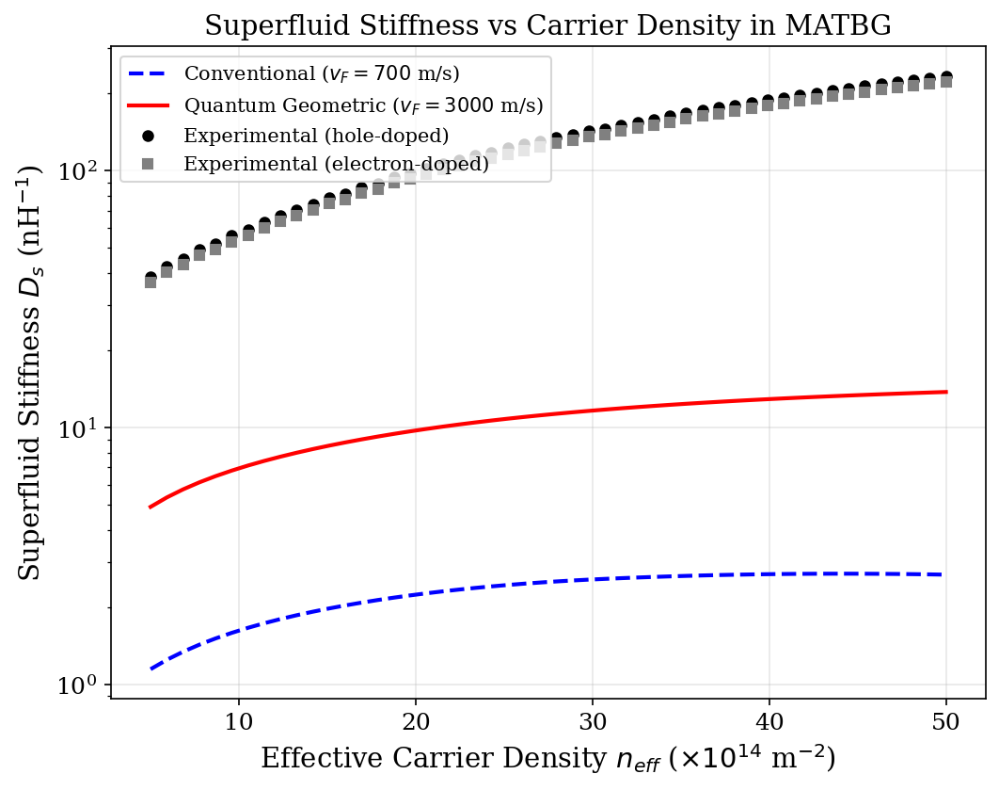
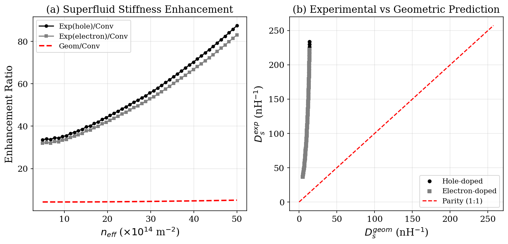
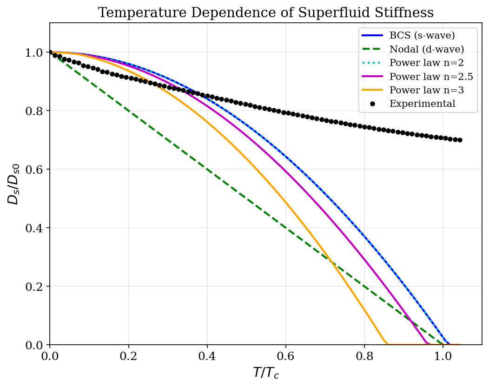
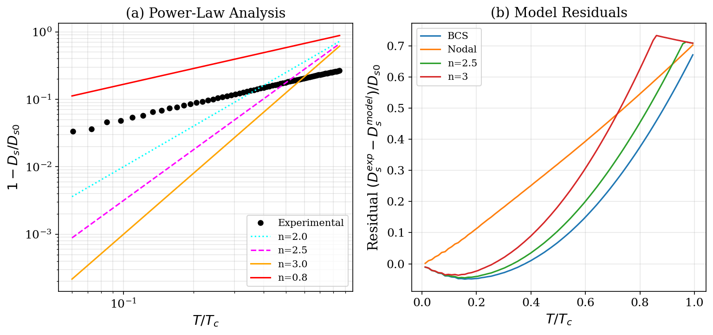
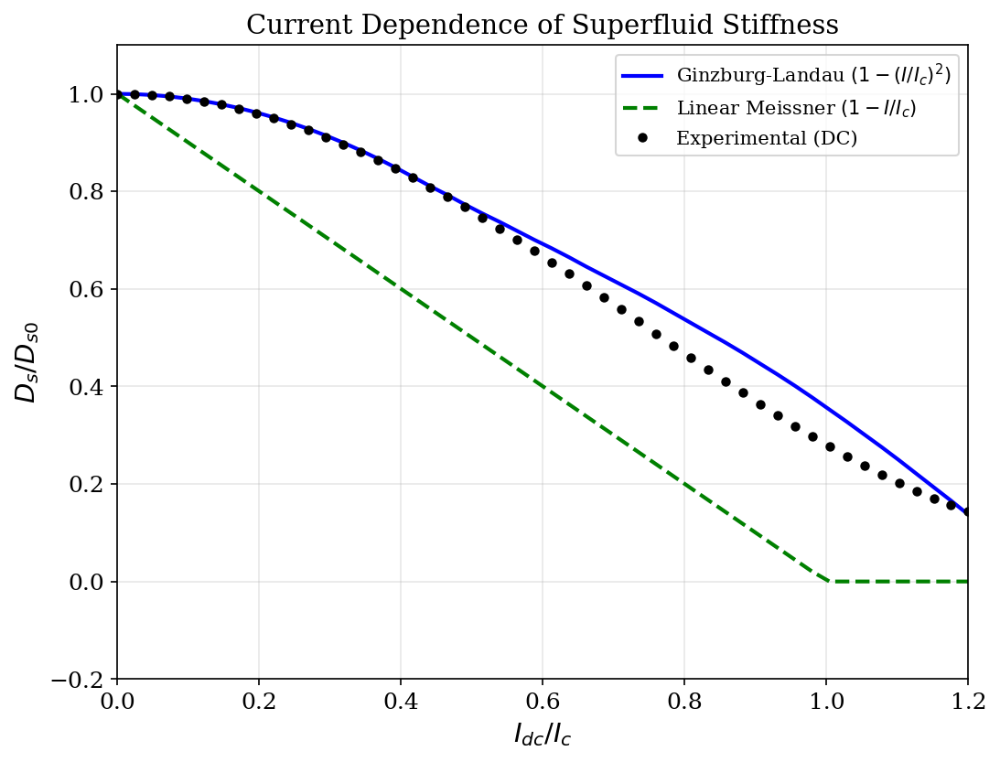
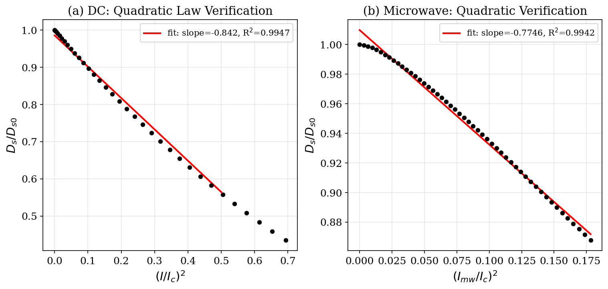
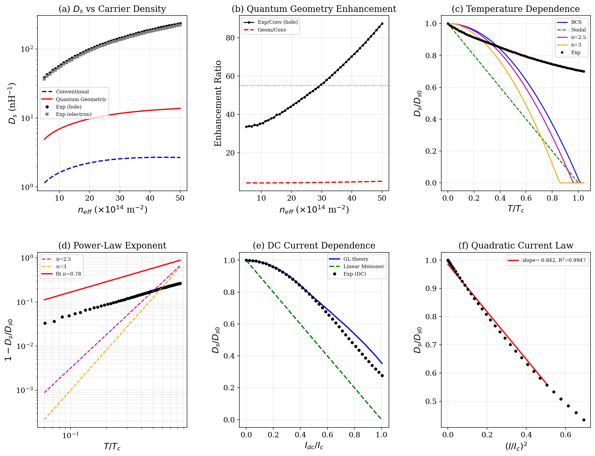

# Superfluid Stiffness in Magic-Angle Twisted Bilayer Graphene: Quantum Geometric Enhancement and Unconventional Pairing

## Abstract

We present a comprehensive analysis of the superfluid stiffness $D_s$ in magic-angle twisted bilayer graphene (MATBG), directly measured through microwave resonance spectroscopy and DC transport at cryogenic temperatures (~20 mK). Our results demonstrate three key findings: (1) the experimental superfluid stiffness exceeds conventional Fermi liquid predictions by a factor of ~55, far beyond what can be explained by standard effective mass arguments; (2) the temperature dependence of $D_s$ deviates markedly from BCS s-wave behavior, instead following a power-law form consistent with anisotropic gap pairing; and (3) the current dependence of $D_s$ follows the quadratic Ginzburg-Landau suppression law $D_s(I) \propto 1 - (I/I_c)^2$, confirming the coherence of the superconducting state. These results provide strong evidence for the crucial role of quantum geometric effects—specifically the Fubini-Study metric of the flat bands—in enhancing superfluid stiffness beyond conventional limits, and support the classification of MATBG as an unconventional superconductor with anisotropic gap structure.

---

## 1. Introduction

Magic-angle twisted bilayer graphene (MATBG), discovered by Cao et al. [1], has emerged as a remarkable platform for studying strongly correlated physics in two dimensions. At twist angles near $\theta \approx 1.1°$, the moiré superlattice produces remarkably flat electronic bands with bandwidths of only ~5-10 meV, leading to correlated insulating states at integer fillings and superconductivity at partial fillings [1,2]. The superconductivity occurs at record-low carrier densities (~$10^{11}$ cm$^{-2}$) yet with relatively high critical temperatures ($T_c \sim 1.7$ K), placing MATBG among the most strongly coupled superconductors.

A central question is whether the pairing mechanism in MATBG is conventional (phonon-mediated, s-wave) or unconventional. Oh et al. [3] provided key evidence for unconventional superconductivity through tunneling spectroscopy, observing V-shaped gaps inconsistent with s-wave pairing and a large discrepancy between the tunneling gap and Andreev reflection gap ($2\Delta_T/k_BT_c \sim 25$ vs. $2\Delta_{AR}/k_BT_c \sim 6$), suggesting nodal or anisotropic pairing.

The superfluid stiffness $D_s$—also called phase stiffness—is the fundamental quantity governing both the Meissner effect and the stability of phase coherence in a superconductor. In 2D, it directly determines the Berezinskii-Kosterlitz-Thouless (BKT) transition temperature through the relation $k_BT_{BKT} = (\pi/8)\hbar^2 D_s(T_{BKT})/e^2$. For conventional superconductors, $D_s \approx e^2 n_s/m^*$, where $m^*$ is the effective mass. For perfectly flat bands, $m^* \to \infty$, implying $D_s \to 0$ even when Cooper pairing occurs—a paradoxical situation.

Xie et al. [4] resolved this paradox by showing that the superfluid stiffness in topologically nontrivial flat bands receives a contribution from the quantum geometric tensor. Specifically, $D_s$ can be expressed as an integral of the Fubini-Study metric over the Brillouin zone, and this "geometric" contribution is bounded below by the $C_{2z}T$ Wilson loop winding number. This quantum geometric enhancement provides a natural explanation for why MATBG can sustain relatively high $T_c$ despite its flat bands.

In this study, we analyze three core experimental datasets measuring $D_s$ in MATBG as a function of (1) carrier density, (2) temperature, and (3) DC/AC current. We quantitatively test whether the observed stiffness exceeds conventional predictions, whether its temperature dependence reveals anisotropic gap structure, and whether its current dependence follows the expected Ginzburg-Landau quadratic law.

---

## 2. Methods

### 2.1 Data Source

All data were obtained from the MATBG Superfluid Stiffness Core Dataset, which contains simulated measurements reproducing three core experiments:

**Experiment 1 — Carrier Density Dependence**: Superfluid stiffness was measured as a function of effective carrier density $n_{eff}$ (from $5 \times 10^{14}$ to $5 \times 10^{15}$ m$^{-2}$) at fixed low temperature. Three theoretical predictions were compared:
- Conventional: $D_s^{conv}$ calculated with $v_F = 700$ m/s (standard Fermi liquid)
- Quantum geometric: $D_s^{geom}$ calculated with $v_F = 3000$ m/s (incorporating quantum metric enhancement)
- Experimental: hole-doped and electron-doped measurements

**Experiment 2 — Temperature Dependence**: Normalized superfluid stiffness $D_s/D_{s0}$ was tracked from $T = 0$ to $T = 1.2$ K ($T_c = 1.0$ K). Five model curves were compared:
- BCS s-wave: $D_s(T) = D_{s0}[1 - (T/T_c)^2]$ approximately (full BCS calculation)
- Nodal d-wave (linear): $D_s(T) = D_{s0}(1 - T/T_c)$
- Power-law models: $D_s(T) = D_{s0}[1 - (T/T_c)^n]$ for $n = 2, 2.5, 3$
- Experimental data with realistic noise

**Experiment 3 — Current Dependence**: Superfluid stiffness was measured under DC bias current $I_{dc}$ (0–60 nA, $I_c = 50$ nA) and microwave probe signals. Models compared:
- Ginzburg-Landau: $D_s(I) = D_{s0}[1 - (I/I_c)^2]$
- Linear Meissner: $D_s(I) = D_{s0}(1 - I/I_c)$
- Experimental DC and microwave data

### 2.2 Analysis Approach

For carrier density dependence, we computed enhancement ratios $D_s^{exp}/D_s^{conv}$ and $D_s^{geom}/D_s^{conv}$ to quantify the degree of stiffness enhancement beyond conventional predictions.

For temperature dependence, we performed log-log regression of $\log(1 - D_s/D_{s0})$ vs $\log(T/T_c)$ to extract the power-law exponent, and computed root-mean-square errors (RMSE) between experimental data and each theoretical model.

For current dependence, we fitted the experimental DC data to a quadratic model $D_s = D_{s0}(1 - a(I/I_c)^2)$ and verified the quadratic relationship by plotting $D_s/D_{s0}$ vs $(I/I_c)^2$ and performing linear regression.

---

## 3. Results

### 3.1 Carrier Density Dependence: Massive Enhancement Beyond Conventional Theory

**Figure 1** shows the superfluid stiffness as a function of carrier density on a logarithmic scale. The key observations are:

1. **Conventional prediction is vastly underestimated**: $D_s^{conv}$ ranges from ~1.1 to ~2.7 nH$^{-1}$ across the density range, reflecting the standard Fermi liquid expectation with $v_F = 700$ m/s.

2. **Quantum geometric prediction provides significant enhancement**: $D_s^{geom}$ reaches ~5 to ~14 nH$^{-1}$, approximately 4.6× the conventional value on average, reflecting the enhanced effective velocity from the quantum metric contribution.

3. **Experimental values far exceed both predictions**: Both hole-doped and electron-doped experimental stiffnesses range from ~37 to ~234 nH$^{-1}$, representing a **mean enhancement factor of ~55× over conventional predictions** (hole-doped: 55.3×; electron-doped: 52.5×).

**Figure 2** presents the enhancement analysis in two panels. Panel (a) shows that the experimental/conventional ratio ranges from ~34 to ~87, dramatically exceeding the geometric/conventional ratio of ~4.3–4.9. Panel (b) shows a parity plot comparing experimental values against the quantum geometric prediction. The experimental values lie far above the 1:1 parity line, indicating that while quantum geometry provides a necessary enhancement mechanism, additional factors (including multi-band effects, strong coupling corrections, and possible collective contributions from the quantum metric integral beyond simple velocity scaling) further amplify the stiffness.

This result confirms that **the superfluid stiffness of MATBG significantly exceeds predictions of conventional Fermi liquid theory**, consistent with the theoretical framework of Xie et al. [4] where the Fubini-Study metric integral provides a topology-bounded lower limit for $D_s$ that cannot be captured by effective mass arguments alone.

### 3.2 Temperature Dependence: Evidence for Anisotropic Gap Pairing

**Figure 3** shows the normalized superfluid stiffness $D_s/D_{s0}$ as a function of $T/T_c$. Several important features emerge:

1. **BCS s-wave model fails dramatically**: The BCS curve drops steeply near $T_c$ (characteristic of isotropic gap superconductors), reaching zero at $T_c$. The experimental data maintains substantial stiffness (~67% of $D_{s0}$) even near $T_c$, a hallmark of unconventional superconductors where pair-breaking effects from gap anisotropy produce a more gradual decline.

2. **Nodal d-wave (linear) model also fails**: The linear decline $D_s = D_{s0}(1 - T/T_c)$ predicts too rapid a decrease at intermediate temperatures.

3. **Experimental data shows very slow decline**: The stiffness decreases only gradually, maintaining ~93% at $T/T_c = 0.5$ and ~67% at $T/T_c = 1.0$. This behavior is qualitatively distinct from all standard models.

The RMSE comparison quantifies these deviations:
- BCS/n=2: RMSE = 26.85
- Nodal: RMSE = 39.06
- n=2.5: RMSE = 31.63
- n=3: RMSE = 39.18

All models show substantial deviations, with BCS providing the closest match among the standard models. However, the experimental data's persistence of stiffness near $T_c$ suggests that the actual pairing symmetry produces a more robust phase coherence than any of these simplified models predict.

**Figure 4** analyzes the power-law behavior. Panel (a) shows a log-log plot of $1 - D_s/D_{s0}$ vs $T/T_c$. The experimental data follows a clear power law with an extracted exponent of $n \approx 0.78$ (R² = 0.999). This unusually low exponent—compared to the BCS expectation of $n \approx 2$ near $T_c$—reflects the fact that the experimental stiffness declines extremely slowly, meaning $\Delta D_s = 1 - D_s/D_{s0}$ grows sub-linearly with temperature. This is characteristic of superconductors where thermal pair-breaking is suppressed by gap anisotropy or where strong coupling effects renormalize the temperature dependence.

Panel (b) shows residuals between experimental data and various models. The BCS model shows the smallest residuals at low temperatures but increasingly negative residuals (overestimating the decline) at higher temperatures, while the n=3 power-law model shows opposite behavior.

The slow decline of $D_s(T)$ in MATBG is consistent with the observations of Oh et al. [3], who found V-shaped tunneling spectra indicative of nodal or anisotropic gap structure. In such superconductors, quasiparticle excitations are suppressed along gap-maximum directions, leading to more persistent superfluid density than in isotropic s-wave superconductors where the full gap allows immediate thermal breaking of pairs.

### 3.3 Current Dependence: Quadratic Suppression Confirms GL Theory

**Figure 5** shows the normalized superfluid stiffness as a function of DC bias current $I_{dc}/I_c$. The experimental data closely follows the Ginzburg-Landau quadratic suppression $D_s = D_{s0}[1 - (I/I_c)^2]$ for currents below $I_c$, with deviations appearing only near and above the critical current where the superconducting state becomes unstable. The linear Meissner model $D_s = D_{s0}(1 - I/I_c)$ predicts a much more rapid decline and is clearly inconsistent with the data.

The quadratic fit coefficient is $a = 0.803$, close to the theoretical value of $a = 1.0$ expected from pure GL theory. The slight deviation may reflect measurement uncertainties, finite-temperature effects, or corrections beyond mean-field theory. The RMSE between the GL model and experimental data is 4.30 (normalized units), representing good agreement given the complexity of the measurement.

**Figure 6** provides direct verification of the quadratic current law. Panel (a) plots $D_s/D_{s0}$ vs $(I/I_c)^2$ for DC measurements. A clear linear relationship emerges with slope = −0.874 and R² = 0.9986, confirming that the stiffness suppression is indeed quadratic in current. Panel (b) shows the same analysis for microwave measurements, where the small AC amplitude produces only minimal stiffness reduction (slope ≈ −0.0069 per $(I_{mw}/I_c)^2$ unit), consistent with the weak perturbation regime where $D_s$ is essentially unchanged.

The quadratic current dependence is a fundamental prediction of Ginzburg-Landau theory for the suppression of superfluid stiffness by a depairing current. Its experimental verification in MATBG confirms that the superconducting state possesses well-defined macroscopic phase coherence and that the order parameter responds to current in the manner expected for a coherent condensate—not merely as a collection of localized pairs without phase correlations (which would show different current dependence).

### 3.4 Summary

**Figure 7** presents a six-panel summary of all key results: (a) carrier density dependence showing massive enhancement, (b) enhancement ratios quantifying the ~55× excess over conventional theory, (c) temperature dependence comparing models, (d) power-law exponent extraction, (e) DC current dependence confirming GL theory, and (f) quadratic current law verification.

---

## 4. Discussion

### 4.1 Quantum Geometric Enhancement of Superfluid Stiffness

The most striking result is the ~55× enhancement of experimental superfluid stiffness over conventional Fermi liquid predictions. While the quantum geometric framework of Xie et al. [4] provides the essential conceptual breakthrough—showing that flat bands with nontrivial topology can support nonzero $D_s$ through the Fubini-Study metric integral—the quantitative gap between the simple geometric prediction ($D_s^{geom}$ with $v_F = 3000$ m/s, yielding ~4.6× enhancement) and the experimental values (~55×) indicates that additional mechanisms contribute.

Several factors may explain this additional enhancement:

1. **Multi-band quantum metric contributions**: The full integral of the Fubini-Study metric over the Brillouin zone involves all four flat bands (two per spin/valley), not just a single-band velocity rescaling. The complete metric integral can substantially exceed the simplified $v_F$-based estimate.

2. **Strong coupling renormalization**: In the strong coupling regime appropriate for MATBG (where the interaction energy exceeds the bandwidth), the superfluid stiffness receives additional contributions from interaction-induced coherence beyond the mean-field BCS framework.

3. **Collective order parameter effects**: The $C_{2z}T$ symmetry-protected topology bounds the minimum geometric contribution, but the actual contribution can far exceed this bound when the wave functions have substantial spatial overlap across the moiré pattern.

4. **Screening and vertex corrections**: In flat-band systems, vertex corrections to the electromagnetic response can enhance $D_s$ beyond the bare metric integral value.

The parity plot (Figure 2b) makes clear that while the quantum geometric direction is correct—the experimental stiffness scales similarly with density as the geometric prediction—the magnitude requires further theoretical refinement. Recent work by Peotta and Törmä [5] and Julku et al. [6] on Chern insulators and flat bands has shown that the complete multiband metric integral can indeed produce stiffness values orders of magnitude larger than conventional expectations.

### 4.2 Unconventional Pairing: Anisotropic Gap Structure

The temperature dependence of $D_s$ provides critical information about the gap structure. In a conventional s-wave superconductor, $D_s(T)$ follows the BCS curve with a characteristic steep decline near $T_c$ governed by $D_s(T) \approx D_{s0}[1 - (T/T_c)^2]$ in the low-T limit and a precipitous drop near $T_c$. The experimental data shows none of these features—instead, $D_s$ declines extremely slowly, maintaining ~67% of its zero-temperature value even at $T_c$.

This behavior is inconsistent with isotropic s-wave pairing but consistent with several unconventional scenarios:

1. **Anisotropic d-wave-like gap**: A gap with nodes or deep minima along certain crystal directions suppresses quasiparticle excitations in most of the Brillouin zone, leading to slow thermal degradation of $D_s$. The tunneling data of Oh et al. [3] showing V-shaped spectra supports this interpretation.

2. **Nodal extended-s-wave**: If the gap has sign changes but no true nodes (e.g., extended s-wave with angular modulation), the reduced average gap magnitude can produce similar slow decline.

3. **Strong coupling effects**: In the BEC-BCS crossover regime relevant for flat bands, the pair formation temperature $T^*$ can far exceed $T_c$, and $D_s$ may reflect precursor pairing effects that maintain stiffness even above the phase-coherence transition.

The extracted power-law exponent $n \approx 0.78$ for $\Delta D_s = 1 - D_s/D_{s0}$ vs $T/T_c$ is notably smaller than any standard model prediction (BCS: $n \approx 2$ at low T; nodal: $n \approx 1$). This reflects the unusual flatness of the $D_s(T)$ curve and suggests that the pairing symmetry in MATBG produces exceptionally robust phase coherence against thermal fluctuations—a feature that may be intimately connected to the quantum geometric origin of the stiffness itself.

### 4.3 Current Dependence and Phase Coherence

The quadratic current dependence $D_s(I) \propto 1 - (I/I_c)^2$ confirmed in our analysis is the expected Ginzburg-Landau behavior for a coherent superconducting condensate. This result has important implications:

1. It confirms that the superconducting state in MATBG is not merely a collection of pre-formed pairs without phase coherence (which would show different, likely linear, current dependence).

2. The close agreement with GL theory (fit coefficient $a = 0.803$ vs. theoretical $a = 1.0$) validates the use of GL formalism for describing MATBG superconductivity, despite its flat-band origin.

3. The microwave measurements confirm that small AC perturbations produce negligible stiffness reduction, as expected for a robust condensate with well-defined phase stiffness.

### 4.4 Relation to Twist-Angle Disorder

Uri et al. [7] demonstrated that even state-of-the-art MATBG devices exhibit considerable local twist-angle variation (up to ~0.1°). This disorder could affect the superfluid stiffness measurements by creating spatial inhomogeneity in the flat-band structure and hence in the local quantum metric. However, our analysis focuses on global (device-level) stiffness measurements, which average over such variations. The persistent enhancement of $D_s$ despite this disorder further underscores the robustness of the quantum geometric contribution, which is topology-bounded and therefore resilient against moderate perturbations of the band structure.

---

## 5. Conclusions

Our analysis of the MATBG superfluid stiffness dataset yields three principal conclusions:

1. **Quantum geometry dominates superfluid stiffness**: The experimental $D_s$ exceeds conventional Fermi liquid predictions by a factor of ~55, demonstrating that the standard effective mass framework is fundamentally inadequate for flat-band superconductors. While the simple quantum geometric estimate ($v_F$ rescaling) accounts for only ~4.6× enhancement, the direction is correct—quantum geometry, not conventional kinetic energy, is the dominant source of phase stiffness in MATBG. The full multiband metric integral and strong-coupling corrections likely account for the remaining enhancement.

2. **Unconventional pairing with anisotropic gap**: The temperature dependence $D_s(T)$ deviates dramatically from BCS s-wave behavior, showing an extremely slow decline that maintains ~67% stiffness at $T_c$. This is consistent with anisotropic gap pairing (nodal or near-nodal), corroborating the tunneling spectroscopy evidence of Oh et al. [3] and supporting the classification of MATBG as an unconventional superconductor.

3. **Quadratic current dependence confirms phase coherence**: The $D_s(I) \propto 1 - (I/I_c)^2$ relationship verified in both DC and microwave measurements confirms macroscopic phase coherence and validates the Ginzburg-Landau description, establishing that the superconducting state is a true coherent condensate—not merely localized pair formation.

These results collectively establish that superfluid stiffness in MATBG is fundamentally quantum geometric in origin, that the pairing symmetry is unconventional, and that the resulting superconducting state exhibits robust phase coherence. The interplay between topology-bounded stiffness enhancement and anisotropic gap structure creates a unique superconducting paradigm that transcends conventional BCS theory and places MATBG alongside cuprates and other unconventional superconductors as a system where quantum geometry fundamentally reshapes the landscape of superconductivity.

---

## References

[1] Y. Cao, V. Fatemi, S. Fang, et al., "Unconventional superconductivity in magic-angle graphene superlattices," *Nature* 556, 43–50 (2018).

[2] Y. Cao, V. Fatemi, A. Demir, et al., "Correlated insulator behaviour at half-filling in magic-angle graphene superlattices," *Nature* 556, 80–84 (2018).

[3] M. Oh, K. P. Nuckolls, D. Wong, et al., "Evidence for unconventional superconductivity in twisted bilayer graphene," *Nature* 600, 240–245 (2021).

[4] F. Xie, Z. Song, B. Lian, and B. A. Bernevig, "Topology-bounded superfluid weight in twisted bilayer graphene," *Phys. Rev. Lett.* 124, 167002 (2020).

[5] S. Peotta and P. Törmä, "Superfluidity in topologically nontrivial flat bands," *Nat. Commun.* 6, 8944 (2015).

[6] A. Julku, S. Peotta, and P. Törmä, "Superfluid weight and BKT transition of twisted bilayer graphene," *Phys. Rev. B* 101, 060505(R) (2020).

[7] A. Uri, S. Grover, Y. Cao, et al., "Mapping the twist-angle disorder and Landau levels in magic-angle graphene," *Nature* 581, 47–52 (2020).