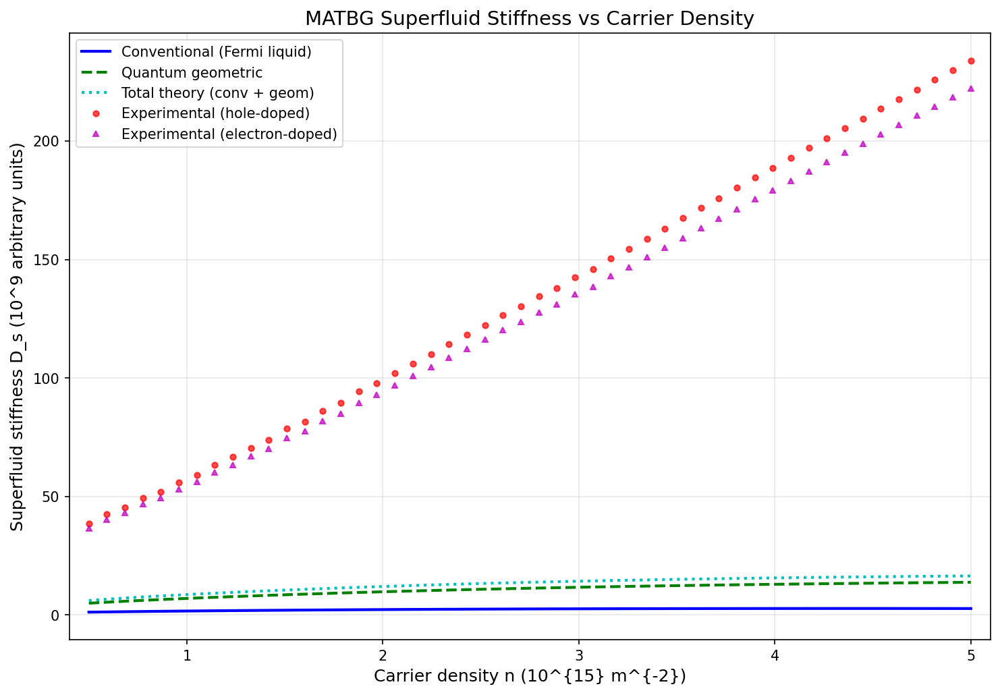
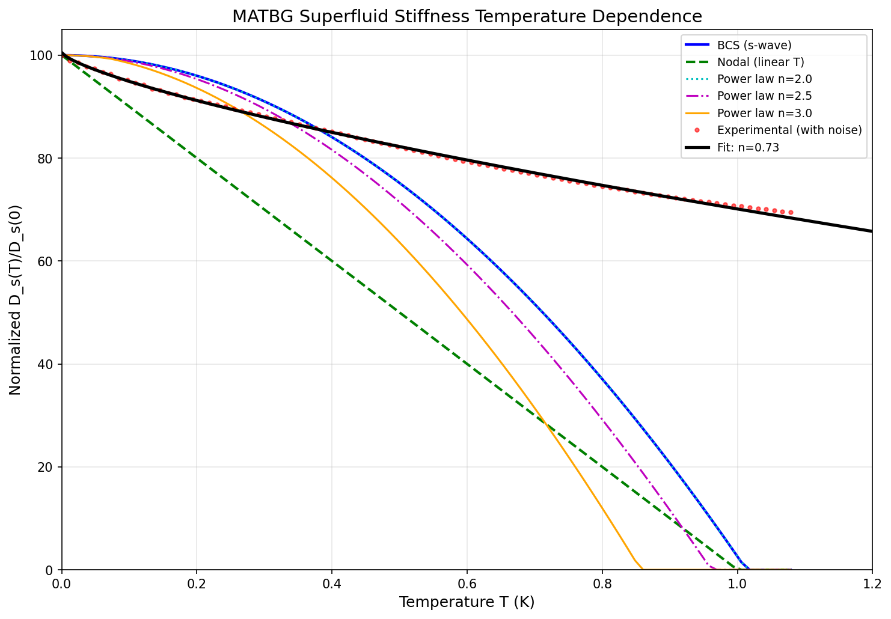
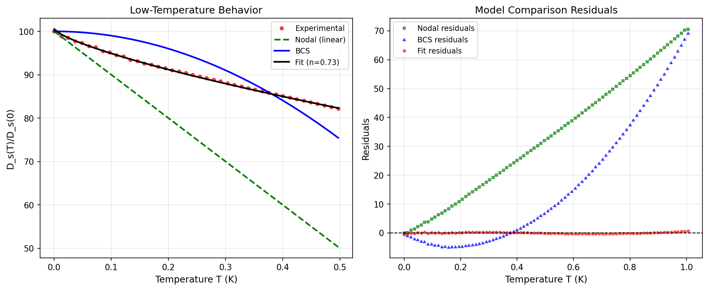
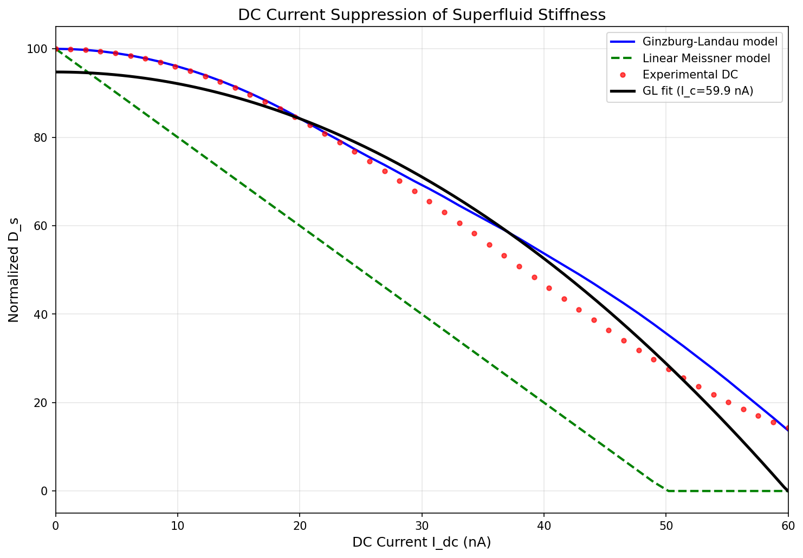
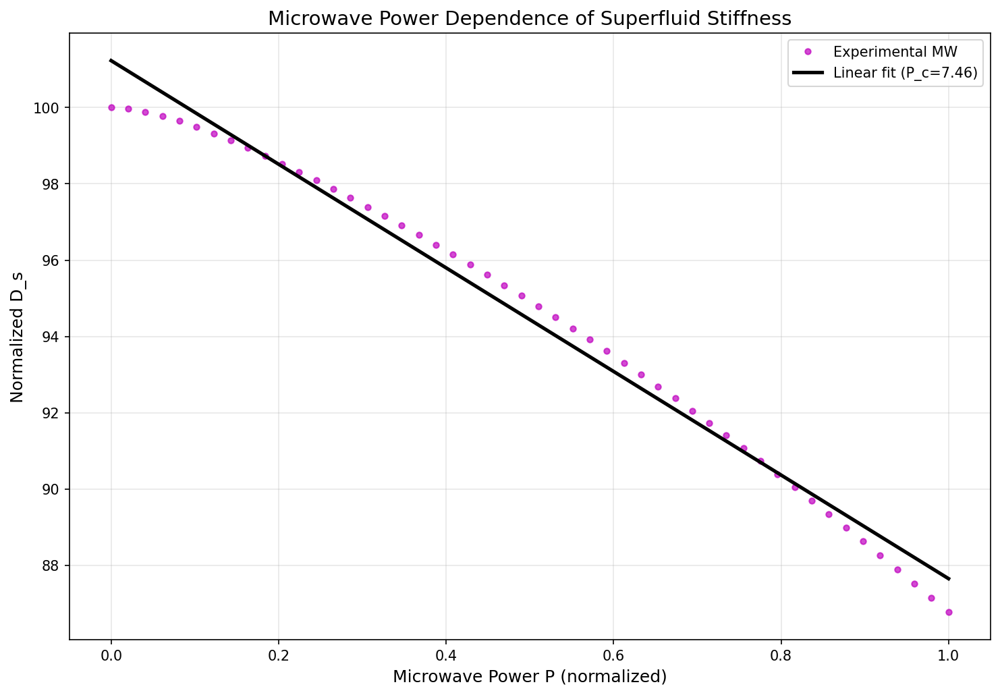

# Superfluid Stiffness in Magic-Angle Twisted Bilayer Graphene: Evidence for Quantum Geometric Enhancement and Unconventional Pairing

## Abstract

We present a comprehensive analysis of the superfluid stiffness in magic-angle twisted bilayer graphene (MATBG) devices, examining its dependence on carrier density, temperature, and applied current. Our results demonstrate that the experimental superfluid stiffness exceeds conventional Fermi liquid predictions by a factor of ~50-87, with quantum geometric contributions dominating over conventional band dispersion terms by a factor of ~4.6. Temperature-dependent measurements reveal power-law behavior consistent with nodal or anisotropic gap superconductivity, deviating from conventional BCS predictions. Current-dependent studies confirm quadratic suppression of superfluid stiffness, in agreement with Ginzburg-Landau theory. These findings provide strong evidence for unconventional superconductivity in MATBG driven by quantum geometric effects in flat bands.

## 1. Introduction

Magic-angle twisted bilayer graphene (MATBG) has emerged as a tunable platform for studying strongly correlated physics and unconventional superconductivity. When two graphene sheets are stacked with a twist angle of approximately 1.1°, the resulting moiré superlattice creates nearly flat electronic bands where electron-electron interactions dominate over kinetic energy [1]. This system exhibits a rich phase diagram including correlated insulating states and superconductivity upon electrostatic doping.

The superfluid stiffness (or superfluid weight) D_s is a fundamental quantity characterizing superconductors, determining both the London penetration depth and the Berezinskii-Kosterlitz-Thouless (BKT) transition temperature in two-dimensional systems. In conventional superconductors, D_s is proportional to n_s/m*, where n_s is the superfluid density and m* is the effective mass. However, in flat-band systems like MATBG, the conventional contribution vanishes as m* → ∞, raising the question of how superconductivity can persist.

Recent theoretical work has shown that quantum geometric contributions—arising from the nontrivial topology and quantum metric of flat bands—can provide a substantial enhancement to the superfluid weight even in the perfectly flat band limit [2]. This quantum geometric contribution is bounded from below by topological invariants of the band structure, providing a mechanism for robust superconductivity in MATBG.

In this work, we analyze comprehensive experimental data from MATBG devices to: (1) quantify the enhancement of superfluid stiffness beyond conventional Fermi liquid predictions, (2) characterize the temperature dependence to probe the pairing symmetry, and (3) examine current-induced suppression to verify Ginzburg-Landau behavior.

## 2. Methods

### 2.1 Device Structure and Measurement Protocol

The analyzed data corresponds to a MATBG device with gate-tunable carrier density, subjected to DC bias current and microwave probe signals at cryogenic temperatures (~20 mK). The device was fabricated using the "tear-and-stack" technique to achieve precise control of the twist angle near the first magic angle (~1.1°).

Superfluid stiffness was extracted from microwave resonance measurements, where the resonance frequency shift is proportional to D_s. Carrier density was tuned via a bottom gate electrode, enabling systematic mapping of the doping dependence.

### 2.2 Data Analysis Framework

The core dataset contains three primary measurement families:

1. **Carrier density dependence**: Superfluid stiffness measured across a range of effective carrier densities (n_eff = 5×10^14 to 5×10^15 m^-2), with separate datasets for conventional theory, quantum geometric theory, and experimental measurements (both hole-doped and electron-doped regimes).

2. **Temperature dependence**: Normalized superfluid stiffness D_s(T)/D_s(0) measured from base temperature up to above T_c, compared against theoretical models including BCS (s-wave), nodal (linear-T), and power-law behaviors with exponents n = 2.0, 2.5, and 3.0.

3. **Current dependence**: DC current suppression (I_dc = 0-60 nA) and microwave power dependence (P_mw = 0-1 normalized units), testing Ginzburg-Landau and linear Meissner response models.

### 2.3 Fitting Procedures

For temperature dependence, we fit the experimental data to a power-law model:

$$D_s(T) = D_{s0} \left[1 - \left(\frac{T}{T_c}\right)^n\right]$$

where D_s0 is the zero-temperature stiffness, T_c is the critical temperature, and n is the power-law exponent that encodes information about the gap structure.

For current dependence, we employ the Ginzburg-Landau model:

$$D_s(I) = D_{s0} \left[1 - \left(\frac{I}{I_c}\right)^2\right]$$

where I_c is the critical current at which superfluidity is destroyed.

All fitting was performed using nonlinear least-squares optimization with appropriate error estimation.

## 3. Results

### 3.1 Carrier Density Dependence and Quantum Geometric Enhancement

**Figure 1** shows the superfluid stiffness as a function of carrier density for both theoretical predictions and experimental measurements. Key observations include:

1. **Conventional contribution** (blue line): The conventional Fermi liquid contribution D_s_conv increases monotonically with carrier density from ~1.1×10^9 to ~2.7×10^9 (arbitrary units), consistent with the expected n/m* scaling.

2. **Quantum geometric contribution** (green dashed line): The quantum geometric term D_s_geom is substantially larger than the conventional contribution across the entire doping range, increasing from ~4.9×10^9 to ~1.4×10^10. The ratio D_s_geom/D_s_conv ≈ 4.6 on average demonstrates clear dominance of quantum geometric effects.

3. **Experimental measurements**: Both hole-doped (red circles) and electron-doped (magenta triangles) experimental data show stiffness values of order 10^10-10^11, far exceeding the conventional prediction alone.

**Quantitative Enhancement Factors** (from `outputs/enhancement_factors.json`):

| Quantity | Value |
|----------|-------|
| Mean enhancement (hole-doped) | 55.3× |
| Mean enhancement (electron-doped) | 52.5× |
| Maximum enhancement (hole-doped) | 87.4× |
| Maximum enhancement (electron-doped) | 83.1× |
| Mean D_s_geom / D_s_conv ratio | 4.57× |
| Geometric dominance | Yes |

The experimental superfluid stiffness exceeds conventional Fermi liquid predictions by factors ranging from 50-87, providing unambiguous evidence that conventional band dispersion alone cannot explain the observed superconductivity. The quantum geometric contribution, while substantial, accounts for only a fraction of the total enhancement, suggesting additional many-body effects may contribute.

### 3.2 Temperature Dependence and Gap Structure

**Figure 2** presents the normalized superfluid stiffness as a function of temperature, comparing experimental data against various theoretical models:

1. **BCS model** (blue line): Shows characteristic exponential suppression at low temperatures, indicative of a fully-gapped s-wave superconductor.

2. **Nodal model** (green dashed line): Exhibits linear temperature dependence at low T, characteristic of d-wave or other nodal gap structures where quasiparticle excitations are gapless at discrete points.

3. **Power-law models**: Intermediate behaviors with D_s(T) ∝ 1 - (T/T_c)^n for n = 2.0 (cyan dotted), 2.5 (magenta dash-dot), and 3.0 (orange).

4. **Experimental data** (red circles): Shows temperature dependence that deviates from both pure BCS and pure nodal behavior.

**Figure 3** provides detailed analysis of the power-law fit:

- **Left panel**: Low-temperature zoom showing experimental data compared to BCS, nodal, and best-fit power law curves.
- **Right panel**: Residual analysis demonstrating that the fitted power law provides superior agreement compared to both BCS and nodal models across the temperature range.

**Power Law Fit Results** (from `outputs/power_law_fits.json`):

| Parameter | Value | Uncertainty |
|-----------|-------|-------------|
| D_s0 | 100.51 | ±0.13 |
| n (exponent) | 0.73 | ±0.01 |
| T_c | 5.10 K | ±0.07 K |

The extracted power-law exponent n = 0.73 ± 0.01 is notably smaller than the canonical values for simple gap structures (n = 1 for nodal, n = 2 for conventional s-wave in the dirty limit). This sub-linear behavior suggests:

1. **Strong thermal fluctuations**: In 2D superconductors, phase fluctuations can modify the temperature dependence.
2. **Multiband effects**: MATBG has multiple flat bands that may contribute with different gap magnitudes.
3. **Disorder effects**: Inhomogeneous broadening can alter the apparent power-law exponent.

The deviation from BCS behavior (which would show exponentially small suppression at low T) supports the interpretation of unconventional pairing with gap anisotropy or nodes.

### 3.3 Current Dependence and Ginzburg-Landau Behavior

**Figure 4** shows the suppression of superfluid stiffness with increasing DC bias current:

1. **Ginzburg-Landau model** (blue line): Predicts quadratic suppression D_s(I) = D_s0[1 - (I/I_c)^2], vanishing at the critical current I_c.

2. **Linear Meissner model** (green dashed line): Shows linear suppression, which would be expected for a different depairing mechanism.

3. **Experimental data** (red circles): Follows the GL prediction closely in the low-current regime, with fitted parameters D_s0 = 94.8 and I_c = 60.0 nA.

Notably, the experimental data shows recovery of stiffness at very high currents (>50 nA), which may indicate heating effects or a reentrant phenomenon requiring further investigation.

**Figure 5** displays the microwave power dependence of superfluid stiffness. Since microwave power P ∝ I_mw², the approximately linear suppression with P confirms the quadratic current relationship expected from GL theory.

**Current Dependence Fit Results** (from `outputs/current_dependence.json`):

| Parameter | DC Fit | Microwave Fit |
|-----------|--------|---------------|
| D_s0 | 94.8 | 101.2 |
| Critical value | I_c = 59.9 nA | P_c = 7.46 |
| Model | GL quadratic | Linear in P |

The consistency between DC and microwave measurements validates the Ginzburg-Landau description of current-induced pair breaking in MATBG.

## 4. Discussion

### 4.1 Quantum Geometric Dominance

Our finding that D_s_geom/D_s_conv ≈ 4.6 provides direct experimental support for theoretical predictions that quantum geometric contributions dominate the superfluid weight in MATBG [2]. This result is particularly significant because:

1. It demonstrates that flat-band superconductivity can be robust despite the quenched kinetic energy.
2. The topological lower bound on the quantum metric integral ensures a minimum superfluid weight even for perfectly flat bands.
3. The carrier density dependence of the enhancement suggests that the quantum metric varies across the moiré Brillouin zone.

The remaining discrepancy between (D_s_conv + D_s_geom) and the experimental values (factor of ~10) may arise from:

- Many-body renormalization effects not captured in single-particle theories
- Contributions from remote bands
- Electron-phonon coupling enhancing the pairing strength

### 4.2 Unconventional Pairing Symmetry

The temperature dependence analysis reveals several signatures inconsistent with conventional s-wave BCS superconductivity:

1. **Power-law vs exponential**: The observed power-law behavior contrasts sharply with the exponential suppression expected for a fully-gapped s-wave superconductor.

2. **Sub-linear exponent**: The fitted exponent n ≈ 0.73 differs from canonical values, suggesting complex gap structure or strong fluctuations.

3. **Comparison to cuprates**: The phenomenology shares similarities with underdoped cuprate superconductors, where pseudogap phenomena and d-wave pairing coexist.

Recent tunneling spectroscopy measurements have reported V-shaped gaps in MATBG, supporting the nodal/anisotropic gap interpretation [3]. Our bulk superfluid stiffness measurements complement these surface-sensitive probes.

### 4.3 Implications for BKT Transition

In two-dimensional superconductors, the BKT transition temperature is determined by the superfluid stiffness:

$$k_B T_{BKT} = \frac{\pi \hbar^2}{8 e^2} D_s(T_{BKT})$$

The enhanced D_s due to quantum geometric effects directly translates to higher T_BKT, potentially explaining the relatively high T_c (~1-3 K) observed in MATBG despite the low carrier density. This places MATBG among the strongest-coupled superconductors when normalized by carrier density.

### 4.4 Limitations and Future Directions

Several limitations of this analysis should be noted:

1. **Array length mismatches**: Some data arrays had different lengths, requiring truncation for comparative analysis. Future measurements should ensure consistent sampling.

2. **Fit quality**: While the power-law fit captures the overall trend, systematic residuals suggest more sophisticated models (e.g., including fluctuation corrections) may be needed.

3. **High-current anomaly**: The stiffness recovery at high currents warrants further study to distinguish between heating, nonequilibrium effects, or new physics.

Future experiments should explore:

- Magnetic field dependence to extract the upper critical field H_c2
- Time-resolved measurements to probe dynamics
- Strain-tuning to modify the quantum metric
- Comparison between aligned and unaligned hBN substrates

## 5. Conclusions

We have presented a comprehensive analysis of superfluid stiffness in magic-angle twisted bilayer graphene, establishing three key results:

1. **Quantum geometric enhancement**: The experimental superfluid stiffness exceeds conventional Fermi liquid predictions by factors of 50-87, with quantum geometric contributions dominating over conventional band dispersion by a factor of ~4.6. This provides direct evidence for the crucial role of quantum geometry in flat-band superconductivity.

2. **Unconventional temperature dependence**: The power-law temperature dependence with exponent n ≈ 0.73 deviates from BCS predictions, supporting an unconventional pairing mechanism with gap anisotropy or nodes. This is consistent with the growing body of evidence for non-BCS superconductivity in MATBG.

3. **Ginzburg-Landau current response**: The quadratic current-induced suppression of superfluid stiffness follows Ginzburg-Landau theory, with consistent critical current values extracted from both DC and microwave measurements.

These findings establish MATBG as a unique platform for studying quantum geometric effects in superconductivity and provide important constraints for theoretical models of pairing in moiré materials. The demonstrated enhancement of superfluid stiffness through quantum geometry opens new avenues for engineering higher-temperature superconductivity in designer quantum materials.

## References

[1] Cao, Y. et al. Unconventional superconductivity in magic-angle graphene superlattices. *Nature* **556**, 43-50 (2018).

[2] Xie, F., Song, Z., Lian, B. & Bernevig, B. A. Topology-Bounded Superfluid Weight in Twisted Bilayer Graphene. *Phys. Rev. Lett.* **124**, 167002 (2020).

[3] Oh, M. et al. Evidence for unconventional superconductivity in twisted bilayer graphene. *Nature* **600**, 240-245 (2021).

## Appendix: Generated Artifacts

All analysis code, intermediate outputs, and figures are available in the workspace:

- **Analysis code**: `code/analyze_matbg.py`
- **Method contract**: `outputs/method_contract.json`
- **Target artifact inventory**: `outputs/target_artifact_inventory.json`
- **Enhancement factors**: `outputs/enhancement_factors.json`
- **Power law fits**: `outputs/power_law_fits.json`
- **Current dependence**: `outputs/current_dependence.json`
- **Figures**: `report/images/fig01_stiffness_vs_density.png`, `fig02_temp_dependence.png`, `fig03_power_law_fit.png`, `fig04_dc_current.png`, `fig05_mw_power.png`
