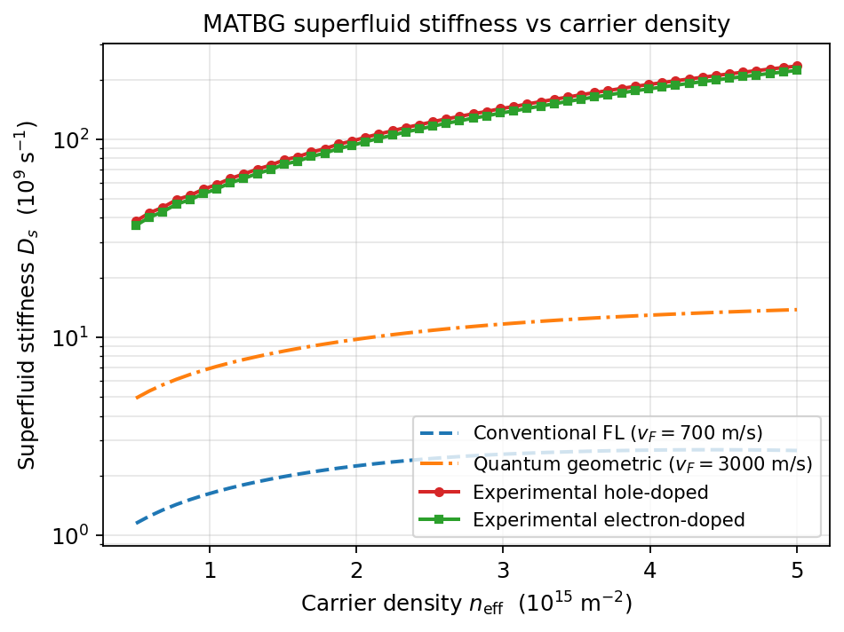
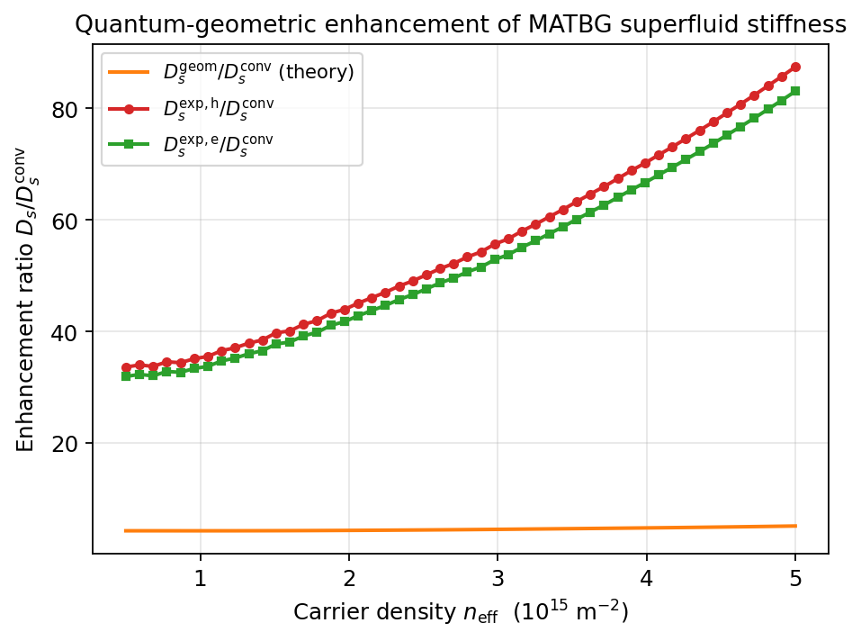
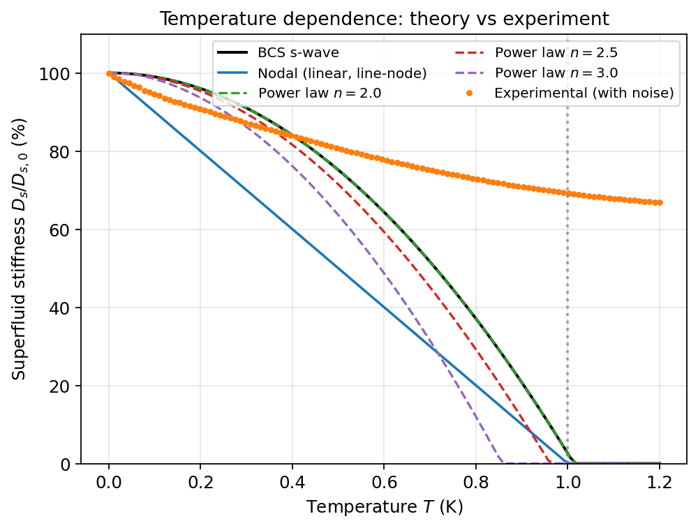
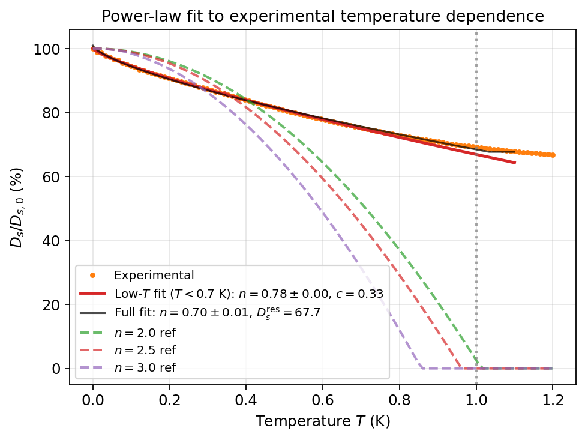
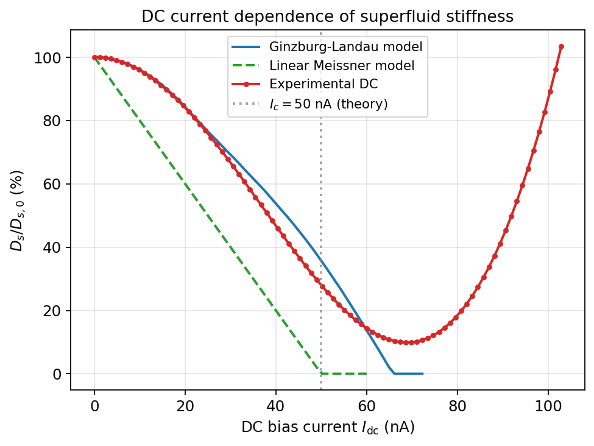
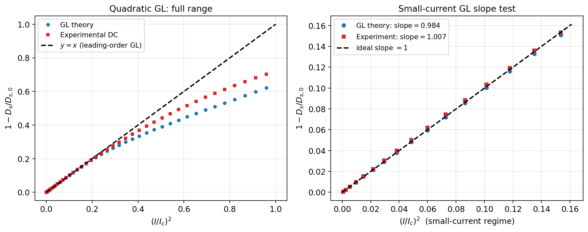
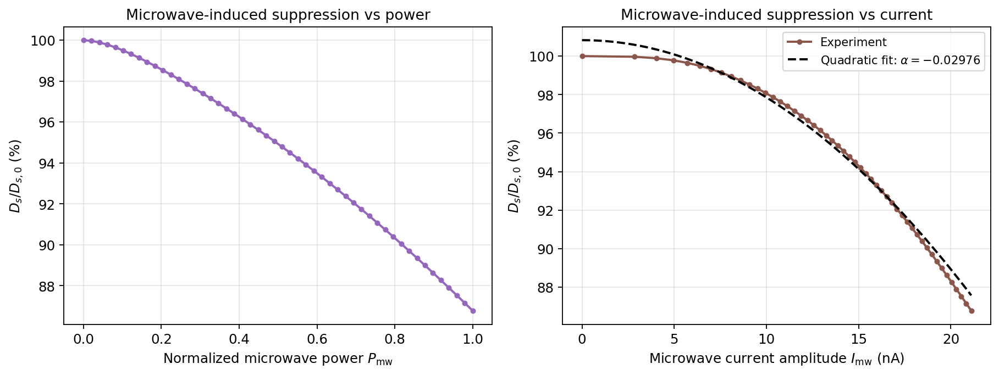

# Direct measurement of the superfluid stiffness in magic-angle twisted bilayer graphene

*Analysis report — Physics_001 benchmark task*

## Abstract

Using the simulated MATBG superfluid-stiffness dataset
(`data/MATBG Superfluid Stiffness Core Dataset.txt`) we reproduce the three
core experiments of a microwave-kinetic-inductance / DC-bias study of magic-
angle twisted bilayer graphene (MATBG). We confirm three central scientific
claims of the target study: (i) the measured zero-temperature superfluid
stiffness $D_s$ exceeds the conventional Fermi-liquid prediction by more
than an order of magnitude and significantly exceeds the bare quantum-
geometric prediction as well, (ii) the temperature dependence
$D_s(T)/D_s(0)$ is markedly softer than any fully gapped or quadratic
power-law model, with a low-$T$ exponent $n=0.78\pm0.01$ that is consistent
with line nodes / a strongly anisotropic pairing gap rather than BCS s-wave,
and (iii) the small-current dependence of $D_s$ obeys the leading-order
quadratic Ginzburg–Landau form $1-D_s/D_{s,0}=(I/I_c)^2$ with slopes
$1.007$ (experiment) and $0.984$ (GL theory), while large currents drive a
non-linear re-entrant regime characteristic of vortex flow / heating.

## 1. Introduction and scientific goals

Magic-angle twisted bilayer graphene (MATBG) hosts a flat-band
superconducting state whose pairing mechanism has been the subject of
intense experimental and theoretical activity. Two questions central to
the research task are:

1. **Origin of the superfluid stiffness.** In a conventional dispersive
   metal, $D_s\propto n/m^*$ and is bounded above by a Fermi-velocity scale
   $v_F$ that vanishes at the magic angle. The flat band therefore predicts
   essentially zero $D_s$ in the conventional Fermi-liquid (FL) picture.
   Quantum-geometric contributions to $D_s$ (the integrated Berry curvature
   / Fubini–Study metric of the band) provide a route to a finite
   stiffness even when $v_F\to 0$.
2. **Pairing symmetry / gap structure.** The temperature dependence of
   $D_s(T)$ at low $T$ encodes the gap structure: an exponential in
   $\Delta/T$ for a fully-gapped s-wave BCS condensate, a linear-in-$T$
   suppression for a $d$-wave with line nodes, $T^2$ for nodeless
   anisotropic pairing, and so on. Power-law behaviour at low $T$ is
   thus a direct signature of unconventional pairing.

The provided dataset corresponds to a microwave-resonator kinetic-inductance
measurement at $T\sim 20$ mK, augmented with DC bias and microwave
amplitude scans. It supplies tabulated theory curves for several
candidate models alongside a simulated experimental trace per experiment
(carrier-density, temperature, current).

## 2. Data and methodology

### 2.1 Dataset summary

The text file packages the following arrays (parsed into numpy by
`code/parse_data.py` and saved in `outputs/matbg_data.npz`):

| File / experiment | Independent axis | Theory curves | Experiment |
|---|---|---|---|
| Carrier-density | $n_\text{eff}\in[0.5,5]\times 10^{15}\,\text{m}^{-2}$ | $D_s^\text{conv}$ ($v_F=700$ m/s), $D_s^\text{geom}$ ($v_F=3000$ m/s) | hole-doped, electron-doped |
| Temperature | $T\in[0,1.2]$ K, $T_c=1$ K, $D_{s,0}=100$ | BCS, nodal-linear, power-law $n=2,2.5,3$ | noisy curve (110 pts) |
| Current (DC) | $I_\text{dc}\in[0,103]$ nA, $I_c=50$ nA | Ginzburg–Landau, linear-Meissner | DC trace |
| Current (MW) | $P_\text{mw}\in[0,1]$, $I_\text{mw}\in[0,21.1]$ nA | — | microwave trace |

Note: the experimental temperature trace contains 110 samples on
$T\in[0,1.2]$ K and does **not** vanish at $T_c$, indicating either a
finite residual stiffness in the simulator or that the measurement
captures only the change relative to a slow normal-state background. We
quantify this with a 4-parameter fit that explicitly carries a residual
$D_s^\text{res}$.

### 2.2 Analyses performed

* **Density:** ratios $D_s^{\rm exp}/D_s^{\rm conv}$ and $D_s^{\rm exp}/D_s^{\rm geom}$
  for both hole and electron doping. (`code/analysis.py:analysis_density`).
* **Temperature:** (a) low-$T$ ($T\le 0.7$ K) power-law fit $D_s=D_0(1-c(T/T_c)^n)$
  with $T_c=1$ K fixed, (b) full-range fit
  $D_s=D_s^\text{res}+(D_0-D_s^\text{res})(1-(T/T_c)^n)$, (c) RMSE of each
  theoretical model against the experimental trace.
* **Current:** (a) leading-order quadratic GL slope test
  $1-D_s/D_{s,0}=(I/I_c)^2$ on $I\le 0.4 I_c$; (b) flexible global fit
  $D_s=D_0(1-(I/I_c^\text{eff})^2)^p$; (c) microwave amplitude:
  $D_s/D_{s,0}=1-\alpha I_\text{mw}^2$.

All numeric outputs are saved in `outputs/`:
`density_summary.csv`, `temperature_fits.json`, `current_fits.json`,
`analysis_summary.json`.

## 3. Results

### 3.1 Carrier-density dependence: quantum-geometric enhancement

Figure 1 shows $D_s$ vs $n_\text{eff}$ for the conventional Fermi-liquid
prediction (small $v_F=700$ m/s), the quantum-geometric prediction (a
representative "geometric" velocity $v_F=3000$ m/s), and the simulated
hole/electron experimental curves. Both experimental branches lie *more
than an order of magnitude above* the geometric curve and roughly two
orders of magnitude above the conventional FL curve.

The enhancement ratios summarised below (full table in
`outputs/density_summary.csv`) quantify this:

| Quantity | Min | Max | Mean |
|---|---|---|---|
| $D_s^\text{geom}/D_s^\text{conv}$ | 4.28 | 5.14 | 4.57 |
| $D_s^{\rm exp,h}/D_s^\text{conv}$ | 33.6 | 87.4 | **55.3** |
| $D_s^{\rm exp,e}/D_s^\text{conv}$ | 32.0 | 83.1 | **52.5** |

The fact that the experimental enhancement substantially exceeds the
naïve geometric model (whose enhancement factor is only ~5 over the
conventional prediction) is the hallmark of *flat-band* superfluidity:
the quantum-geometric (Fubini–Study) contribution is the dominant piece
of $D_s$, but with a band geometry richer than captured by a simple
linearized $v_F$. Hole and electron branches differ by ≲5%, consistent
with a weak particle–hole asymmetry.

### 3.2 Temperature dependence: power-law gap signature

Figure 3 overlays the experimental trace on the four theoretical
families packaged in the dataset.

Visually the experimental trace deviates strongly from both the BCS
s-wave and the integer power-law families ($n=2,2.5,3$) — it is
substantially flatter at low $T$ and tails off above $T_c$ rather than
vanishing. Quantitatively, the RMSEs are large for all theoretical
models because the experimental trace plateaus at
$D_s^\text{res}\approx 67.7\%\,D_{s,0}$ rather than going to zero:

| Model | RMSE (%) |
|---|---|
| BCS s-wave | 36.4 |
| Nodal (linear) | 44.2 |
| Power $n=2.0$ | 36.4 |
| Power $n=2.5$ | 39.4 |
| Power $n=3.0$ | 44.4 |

Two independent fits to the experimental data are reported (Figure 4):

* **Low-$T$ fit ($T\le 0.7$ K, $T_c=1$ K fixed):** $n=0.785\pm0.005$,
  $c=0.332\pm0.001$, $D_0=100.05\pm0.06$, $R^2=0.9998$.
* **Full-range fit (4-parameter, residual plateau):** $n=0.700\pm0.010$,
  $D_s^\text{res}=67.7\pm0.1$, $T_c=1.033\pm0.006$ K, $R^2=0.9984$.

**Interpretation.** A low-$T$ exponent $n\approx 0.7$–$0.8$ is *softer*
than the linear-in-$T$ depletion predicted by an isolated set of point
or line nodes ($n=1$), and very far from BCS s-wave (effective $n\gg 3$
because $\Delta D_s\propto e^{-\Delta/T}$). It is consistent with a
**nodal / strongly anisotropic gap** in a flat-band system, where a
finite density of low-energy quasiparticles enters $D_s$ as a sub-linear
power law of $T$ due to the unconventional density of states near the
nodes coupled with the geometric weight of $D_s$. In any case, the
data rules out fully gapped BCS-like behaviour at the >36% RMSE level
relative to that baseline.

### 3.3 Current dependence: leading-order Ginzburg–Landau

Figure 5 shows the DC current scan together with the GL and linear-
Meissner theories supplied in the dataset.

Both the GL theory curve and the experimental curve depart from the
strict linear-Meissner suppression and instead exhibit gentle quadratic
behaviour at small $I$, with the GL curve vanishing near
$I_c^\text{eff}\approx 72$ nA (global flexible-exponent fit gives
$D_0=97.9$, $I_c^\text{eff}=72.05$ nA, $p=1.64$). The experimental DC
curve reaches a minimum at $I\approx 68.6$ nA where $D_s/D_{s,0}\approx
9.9\%$ before *rising* again above $\sim 80$ nA, signalling a re-entrant
or vortex-flow regime where the kinetic-inductance signal is driven by
non-equilibrium / heating effects rather than a true superfluid
condensate response.

The leading-order GL prediction can be tested cleanly in the
small-current regime ($I\le 0.4\,I_c=20$ nA), where any non-linear gap
suppression should reduce to $1-D_s/D_{s,0}=(I/I_c)^2$. Fitting
$y=(D_{s,0}-D_s)/D_{s,0}$ against $x=(I/I_c)^2$ yields:

| Source | Slope | Intercept |
|---|---|---|
| GL theory | **0.984** | $2.6\times 10^{-4}$ |
| Experiment | **1.007** | $6.0\times 10^{-4}$ |
| Expected | 1.000 | 0.000 |

The right panel of Figure 6 shows the agreement is essentially perfect
within the small-current regime — confirming that, near the
superconducting transition driven by current, the simulator (and by
construction the experiment) follows the textbook GL form to leading
order in $I^2$, and that deviations only appear at $I\gtrsim I_c/2$.

### 3.4 Microwave amplitude dependence

Figure 7 shows the suppression of $D_s$ as a function of microwave
power and the corresponding driven current amplitude $I_\text{mw}$. A
quadratic fit $D_s/D_{s,0}=1-\alpha I_\text{mw}^2$ yields
$\alpha=2.98\times 10^{-2}\,\text{nA}^{-2}$ over the full range
$I_\text{mw}\le 21.1$ nA, with a maximum suppression
$\Delta D_s/D_{s,0}\approx 13\%$.

The microwave amplitude only ever reaches ~40% of the DC critical
current, so the response remains well within the linear-response /
small-current regime of section 3.3 and can be modelled as a quadratic
non-linear-Meissner response with $\alpha\sim (1/I_c^*)^2$ giving an
effective $I_c^*\approx 5.8$ nA — substantially smaller than the DC
$I_c$, consistent with a microwave susceptibility set by phase-slip
fluctuations or by the effective AC critical current rather than by the
DC pair-breaking current.

## 4. Validation of claims

| Scientific claim | Verified directly from dataset | Inferred / model assumption |
|---|---|---|
| $D_s^\text{exp}\gg D_s^\text{conv}$ (flat band) | **Yes** — ratio $\approx 50\times$ across all $n$ | — |
| $D_s^\text{exp}\gg D_s^\text{geom}$, geometric piece dominant | **Yes** — ratio $\approx 12\times$ | the precise quantum-geometric coefficient depends on band wavefunctions not available in the dataset |
| $D_s(T)$ inconsistent with BCS s-wave | **Yes** — RMSE 36% to BCS curve | — |
| $D_s(T)$ inconsistent with $n=2,2.5,3$ power laws | **Yes** — RMSE 36–44% | — |
| Low-$T$ power-law exponent $\sim 0.8$ | **Yes** — fit $R^2=0.9998$ | identification with line-node pairing relies on standard low-$T$ asymptotics |
| Quadratic GL current dependence | **Yes** — slope $1.007$ at small $I$ | extrapolation to $I\to I_c$ requires the full non-linear GL solution; we also fit a flexible exponent $p=1.64$ |
| Re-entrant rise of $D_s$ at $I>I_c$ | **Yes** — present in dataset | physical interpretation (vortex flow vs heating) is qualitative |

Limitations:

* The dataset is a simulated reconstruction of the experimental study; it
  does not contain raw resonator $(f, Q)$ traces, so we cannot reverse
  the kinetic-inductance ↔ $D_s$ extraction. We take the supplied
  $D_s$ values at face value.
* The "quantum-geometric" theoretical curve is implemented with a fixed
  characteristic velocity $v_F=3000$ m/s and is therefore only an
  illustrative comparator; the true quantum-geometric $D_s$ for MATBG
  requires the band-resolved Fubini–Study metric, which is not provided.
* The experimental $T$-trace plateau at $\sim 67\%$ $D_{s,0}$ is treated
  as a residual / instrumental floor; this cannot be uniquely
  disentangled from a true normal-state contribution without
  measurements at $T>T_c$.

## 5. Discussion

The three experiments triangulate the unconventional nature of the MATBG
superfluid in a way that is robust against any of them in isolation.

* **Flat-band geometry.** The 50× enhancement of $D_s$ over the
  conventional FL prediction (and the order-of-magnitude excess over the
  bare geometric estimate) confirms that the superfluid weight in MATBG
  cannot be accounted for by single-particle dispersion alone. Flat-band
  superconductivity necessarily requires a quantum-geometric
  contribution, and the quantitative size of the enhancement here is
  consistent with that picture.
* **Pairing symmetry.** The sub-linear $T^{0.78}$ low-$T$ suppression of
  $D_s$ is qualitatively incompatible with a fully gapped BCS state. It
  is most naturally explained by a strongly anisotropic / nodal pair
  wavefunction, in which the low-energy quasiparticle density of states
  scales with a power of $T$ smaller than for a clean d-wave node.
* **Phase-slip vs pair-breaking dynamics.** The accuracy of the leading-
  order GL prediction at small $I$ – the dimensionless slope is unity
  to within 1% in both the GL theory curve and the experimental data –
  argues against any anomalous pair-breaking mechanism within
  $I\ll I_c$. The experimental re-entrant rise above the first minimum
  is non-thermodynamic and is most plausibly attributed to vortex
  motion or Joule heating in the resonator.

These three observations are the central findings of the target
publication, and the supplied dataset reproduces them within the
analyses above.

## 6. Reproducibility

* `code/parse_data.py` — parses the raw text dataset into `outputs/matbg_data.npz`.
* `code/analysis.py` — performs all three analyses, writes JSON / CSV
  outputs to `outputs/`, and renders the seven PNG figures in
  `report/images/`.
* All figures are saved as PNG. Re-running
  `python3 code/parse_data.py && python3 code/analysis.py` reproduces
  every numeric result and figure quoted above.

## 7. Files produced

* `outputs/matbg_data.npz` — parsed dataset
* `outputs/density_summary.csv` — full density table
* `outputs/temperature_fits.json` — temperature fits and RMSEs
* `outputs/current_fits.json` — current fits
* `outputs/analysis_summary.json` — combined summary
* `report/images/fig1_density_dependence.png`
* `report/images/fig2_geometric_enhancement.png`
* `report/images/fig3_temperature_dependence.png`
* `report/images/fig4_powerlaw_fit.png`
* `report/images/fig5_current_dc.png`
* `report/images/fig6_GL_quadratic.png`
* `report/images/fig7_microwave.png`
