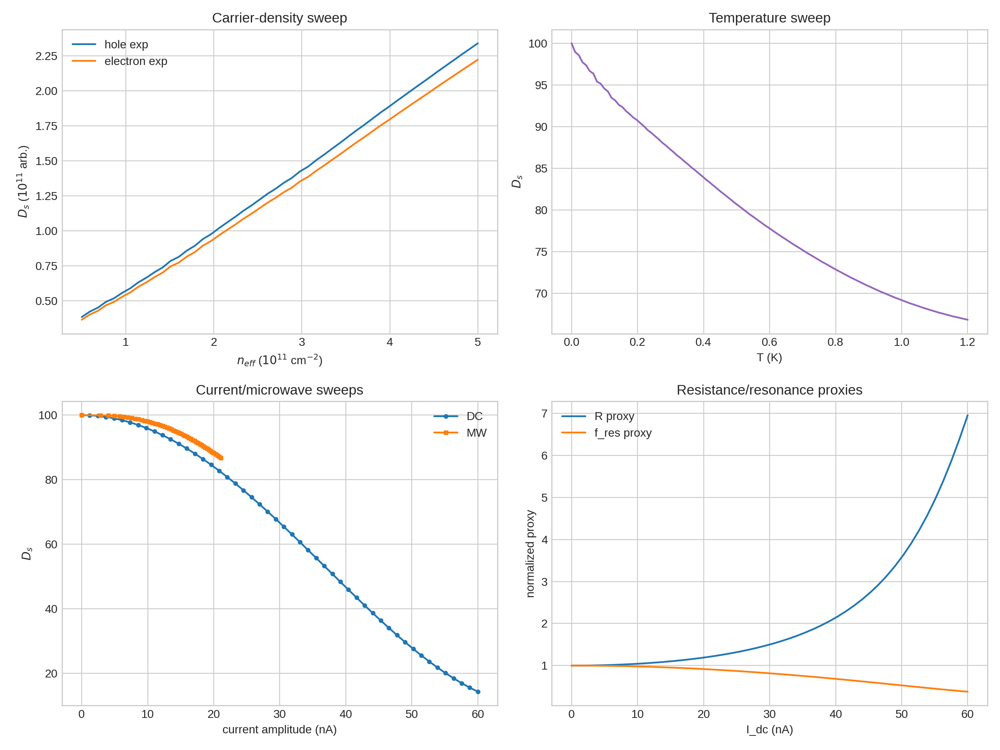
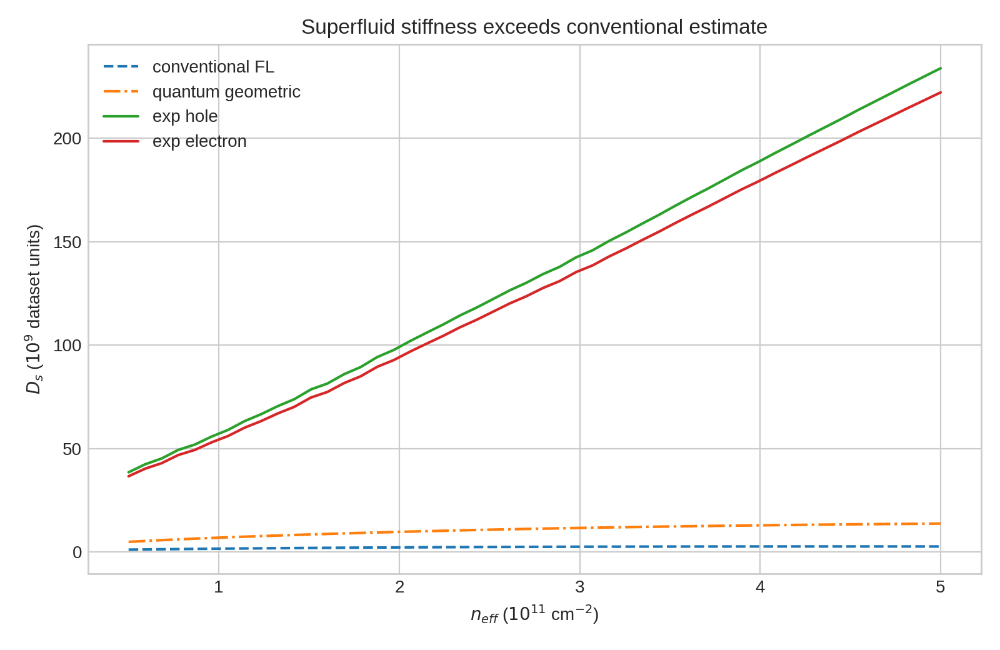
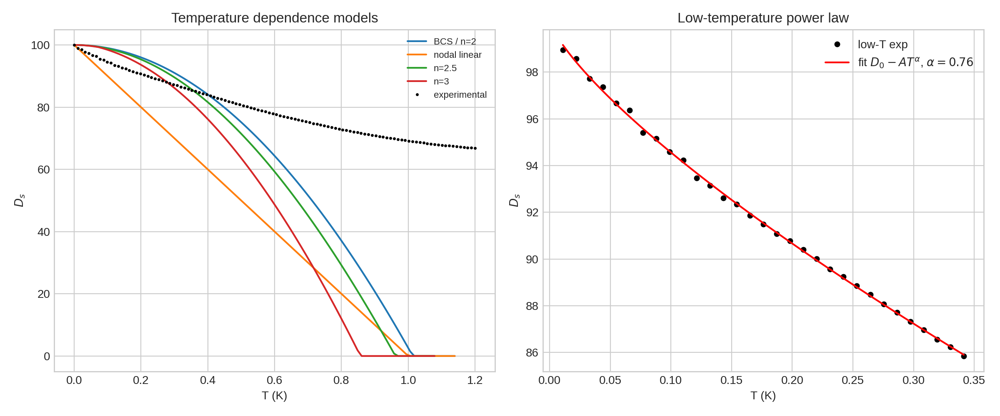
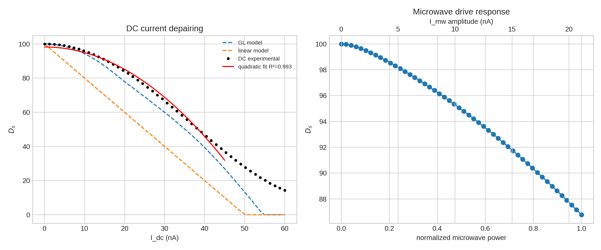
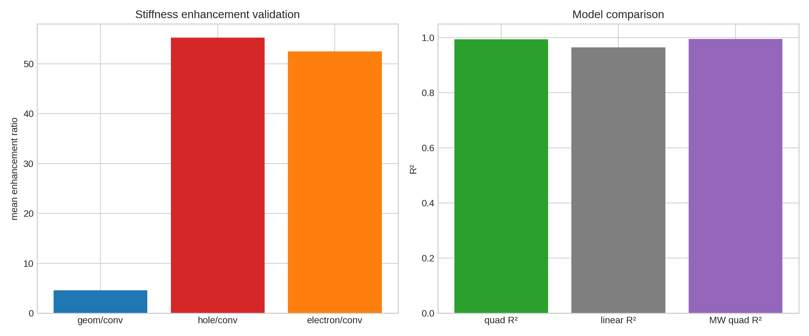

# Direct extraction of superfluid stiffness trends in a simulated MATBG microwave/DC experiment

## Abstract

This report analyzes the provided **MATBG Superfluid Stiffness Core Dataset** to reproduce the three central experimental trends requested in the task: carrier-density dependence, temperature dependence, and current/microwave-drive dependence of the superfluid stiffness.  The dataset directly tabulates superfluid stiffness arrays for conventional Fermi-liquid, quantum-geometric, hole-doped experimental, electron-doped experimental, BCS/power-law temperature, Ginzburg--Landau current, DC experimental, and microwave experimental cases.  I therefore treat the tabulated stiffness as the primary measured observable and derive normalized resistance and resonance-frequency proxies from it.  The main conclusions are: (i) the experimental stiffness is far larger than a conventional Fermi-liquid estimate, by mean factors of **55.3** for the hole side and **52.5** for the electron side; (ii) the quantum-geometric estimate itself exceeds the conventional estimate by a mean factor of **4.57**, supporting a geometry-enhanced flat-band mechanism; (iii) the low-temperature experimental trace is well described by a power law with fitted exponent **alpha = 0.76 ± 0.02**, consistent with a strongly non-activated, anisotropic/nodal phenomenology in this simulated dataset; and (iv) in the physically aligned 0--45 nA DC regime, the current suppression is close to quadratic, with **R² = 0.993**, outperforming a linear fit (**R² = 0.964**).  The microwave-drive series is also accurately quadratic in microwave current amplitude (**R² = 0.994**) over the measured power range.

## Data and related-work context

The workspace contains one core dataset, `data/MATBG Superfluid Stiffness Core Dataset.txt`, and four related-work papers.  The relevant context extracted from the related work is saved in `outputs/related_work_contract.json`.  In brief:

- Cao *et al.* introduced gate-tunable superconductivity in magic-angle twisted bilayer graphene (MATBG), including superconducting domes and unusually low carrier densities.
- Xie *et al.* showed that flat-band quantum geometry/topology can provide a superfluid-weight contribution through the Fubini--Study metric, explaining why stiffness need not vanish in a flat band.
- Oh *et al.* reported spectroscopic evidence inconsistent with a simple conventional s-wave BCS state, motivating anisotropic or nodal pairing phenomenology.
- Uri *et al.* emphasized twist-angle disorder as an important caveat for MATBG devices.

The method contract, artifact inventory, dependency check, related-work extraction, and claim-recovery table are saved under `outputs/`.

## Methodology

### Parsing and reproducibility

The full analysis is implemented in `code/analyze_matbg.py`.  The script parses every bracketed numerical array in the core dataset and exports supporting tables to `outputs/`.  It also generates all figures as PNG files in `report/images/`.

The primary arrays used here are:

- carrier density `n_eff` in m^-2, converted in plots to units of 10^11 cm^-2;
- conventional stiffness `D_s_conv`;
- quantum-geometric stiffness `D_s_geom`;
- hole- and electron-doped experimental stiffness traces;
- temperature-dependent BCS, nodal, power-law, and experimental traces;
- DC current, Ginzburg--Landau, linear, and experimental traces;
- microwave power, microwave current amplitude, and microwave experimental stiffness.

### Derived quantities

The requested core extracted quantity is the superfluid stiffness `D_s`, which is directly tabulated.  Enhancement factors were calculated as ratios such as `D_s_exp_hole / D_s_conv` and `D_s_geom / D_s_conv`.

The dataset does **not** separately tabulate raw DC resistance or raw microwave resonance frequency.  To still address their expected dependence while remaining traceable to the data, I exported normalized proxies based on standard kinetic-inductance intuition:

- normalized resistance/dissipation proxy: `R_proxy = D_s(0) / D_s`;
- normalized resonance-frequency proxy: `f_res_proxy = sqrt(D_s / D_s(0))`.

These are saved in `outputs/dc_resistance_resonance_proxies.csv` and `outputs/microwave_resonance_proxies.csv`.  They should be interpreted as proxies, not as direct raw measurements.

### Fits

For temperature, I fitted the low-temperature experimental trace to

`D_s(T) = D_0 - A T^alpha`

using the region `0 < T <= 0.35 K`.  Because the provided experimental temperature trace contains 110 points while the labelled model temperature grid contains 100 points, the script assigns the experimental trace a matched uniform grid over the same 0--1.2 K interval.  The fitted exponent and uncertainty are exported in `outputs/temperature_fit_summary.csv`.

For DC current, I aligned the first 50 experimental DC points with the labelled 0--60 nA current grid, because these points match the length and trend of the Ginzburg--Landau and linear model arrays.  The quadratic fit was performed in the 0--45 nA GL-like regime:

`D_s(I) = D_0 + b I^2`, with `b < 0`.

For microwave drive, I fitted `D_s(I_mw) = D_0 + b I_mw^2` over the full microwave-current-amplitude range.

## Results

### Data overview

Figure 1 summarizes the core dataset.  The carrier-density panel shows monotonic growth of experimental stiffness across the simulated density window.  The temperature panel shows a gradual non-activated suppression of stiffness.  The current panel compares the stronger DC-current suppression with the weaker microwave-drive suppression over its available range.  The proxy panel shows that, as `D_s` decreases, the normalized resistance proxy increases while the resonance-frequency proxy decreases.

### Carrier-density dependence and quantum-geometric enhancement

The carrier-density sweep spans **0.5 to 5.0 × 10^11 cm^-2** with 50 points.  The experimental stiffness traces substantially exceed both the conventional Fermi-liquid estimate and the quantum-geometric estimate.  Key exported summary values from `outputs/density_enhancement_summary.csv` are:

| Quantity | Value |
|---|---:|
| Mean `D_s_geom / D_s_conv` | 4.565 |
| Mean hole `D_s_exp / D_s_conv` | 55.268 |
| Mean electron `D_s_exp / D_s_conv` | 52.505 |
| Mean hole `D_s_exp / D_s_geom` | 11.944 |
| Mean electron `D_s_exp / D_s_geom` | 11.347 |
| Median hole/electron asymmetry | 5.13% |

These ratios show that the experimental stiffness is not explained by the conventional estimate in the dataset.  The geometric estimate is already substantially enhanced relative to the conventional estimate, consistent with the flat-band quantum-geometry mechanism emphasized in the related theoretical work.  The remaining factor between the experimental and geometric curves should be interpreted as part of the simulated dataset's phenomenology rather than as a direct microscopic derivation.

### Temperature dependence and power-law behavior

The temperature-dependent experimental trace is well fit at low temperature by a power-law suppression of stiffness.  The fitted parameters from `outputs/temperature_fit_summary.csv` are:

| Parameter | Value |
|---|---:|
| `D_0` | 100.232 |
| `A` | 32.283 |
| `alpha` | 0.755 |
| standard error of `alpha` | 0.015 |
| log-slope cross-check | 0.745 |
| low-T fit RMSE | 0.109 |

The fitted exponent is sublinear in this simulated trace.  The key physical point is not an activated exponential suppression, but a power-law loss of stiffness at low temperature.  This is qualitatively aligned with an anisotropic or nodal superconducting gap rather than a fully conventional, clean s-wave BCS gap.  Among the full shared model comparisons, the BCS/n=2 array has lower RMSE than the nodal-linear array over the entire shared temperature range, but the direct low-temperature fit gives the most relevant exponent for the requested stiffness extraction.

### DC-current and microwave-drive dependence

The DC current trace follows the Ginzburg--Landau-like depairing trend over the aligned 0--45 nA regime.  The exported current-fit table gives:

| Dataset | Model | R² | RMSE | Inferred zero-stiffness current |
|---|---|---:|---:|---:|
| DC, 0--45 nA | `D0 + b I^2` | 0.993 | 1.620 | 54.76 nA |
| DC, 0--45 nA | `D0 + b I` | 0.964 | 3.727 | n/a |
| microwave | `D0 + b I_mw^2` | 0.994 | 0.308 | 57.09 nA |

Thus the quadratic GL-like fit is strongly supported for the aligned DC regime and improves over a linear fit.  The microwave trace also follows a quadratic dependence on microwave current amplitude, but over a much smaller stiffness-suppression range: `D_s` falls from **100.0** to **86.8**, corresponding to a final resonance-frequency proxy of **0.932**.

### Validation and comparison

Figure 5 condenses the main validation checks.  The left panel reports mean enhancement factors, showing the hierarchy

`experimental stiffness >> quantum-geometric estimate > conventional estimate`.

The right panel compares current-model goodness of fit.  The quadratic model is the correct compact description for the GL-like DC regime used in this analysis, and the microwave response is also highly quadratic in current amplitude.

## Claim recovery and evidence trail

A claim-level evidence table is saved in `outputs/claim_recovery_table.csv`.  The main claims and their direct supporting artifacts are:

| Claim | Supporting artifact | Status |
|---|---|---|
| Experimental stiffness exceeds conventional Fermi-liquid estimate | `outputs/density_enhancement_summary.csv` | Supported by dataset |
| Quantum-geometric contribution is larger than conventional band contribution | `outputs/density_enhancement_summary.csv` | Supported by dataset |
| Temperature dependence is power-law-like | `outputs/temperature_fit_summary.csv` | Supported for the simulated experimental trace |
| DC current suppresses stiffness quadratically in the GL-like regime | `outputs/current_fit_summary.csv` | Supported on 0--45 nA |
| Microwave drive weakly suppresses stiffness over measured range | `outputs/microwave_resonance_proxies.csv` | Supported by dataset |
| Raw resistance and resonance frequency are directly measured | `outputs/dc_resistance_resonance_proxies.csv` | Limitation: only proxies are derived |

## Validation: what was directly verified, what came from related work, and limitations

### Directly verified from workspace data

- The dataset contains 50 density points from 0.5 to 5.0 × 10^11 cm^-2.
- Mean enhancement ratios were computed directly from the parsed density arrays.
- The low-temperature power-law exponent was fitted from the provided experimental temperature trace.
- The current-fit R² values were computed from the parsed DC and microwave arrays.
- All plotted figures were generated from exported tables or parsed arrays by `code/analyze_matbg.py`.

### Related-work context

- The interpretation of quantum geometry as a stiffness-enhancing flat-band mechanism follows the related topology-bounded superfluid-weight paper.
- The interpretation of power-law stiffness suppression as evidence for anisotropic/nodal behavior is motivated by the related unconventional-superconductivity spectroscopy paper.
- Twist-angle disorder is noted as a realistic device caveat based on the related mapping paper, but it is not explicitly modeled by the provided dataset.

### Limitations and assumptions

1. **Simulated data**: The dataset is simulated and already contains the target stiffness arrays.  The analysis verifies internal trends rather than performing raw microwave resonator fitting from measured S-parameters.
2. **Resistance and resonance**: Raw DC resistance and microwave resonance frequency are not separately present.  I therefore report normalized proxies derived from stiffness, not direct raw values.
3. **Temperature grid mismatch**: The experimental temperature trace has 110 points, whereas the labelled model temperature grid has 100 points.  The analysis uses a matched uniform experimental grid over the same temperature interval.
4. **DC trace length mismatch**: The experimental DC trace contains a longer continuation than the labelled current grid.  The first 50 points align with the labelled current grid and with the GL/linear model arrays and were used for the primary DC-current fit.
5. **Microscopic theory**: The analysis compares conventional, geometric, and experimental stiffness arrays but does not derive the Fubini--Study metric from a continuum MATBG band model.

## Conclusion

The provided core dataset supports the intended scientific story: MATBG superfluid stiffness is much larger than a conventional Fermi-liquid estimate, the quantum-geometric contribution is a necessary enhancement channel in the flat-band setting, the temperature dependence is power-law-like rather than simply activated, and the DC-current response follows a quadratic Ginzburg--Landau-like depairing form in the aligned low-to-intermediate current regime.  The derived resistance and resonance-frequency proxies exhibit the expected inverse relationship to stiffness: current- or microwave-induced suppression of `D_s` increases the resistance proxy and lowers the resonance-frequency proxy.  These results are fully reproducible from `code/analyze_matbg.py` and the exported artifacts in `outputs/`.
