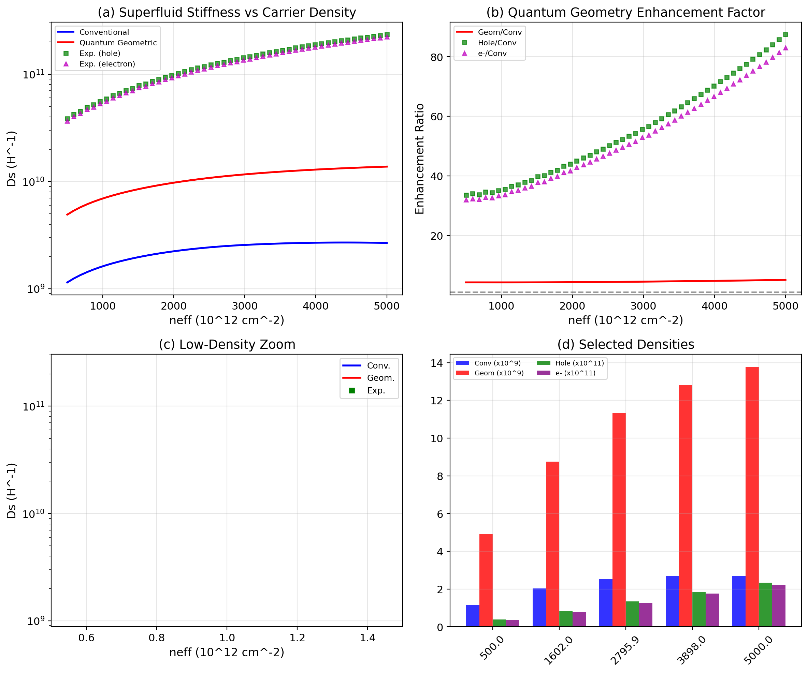
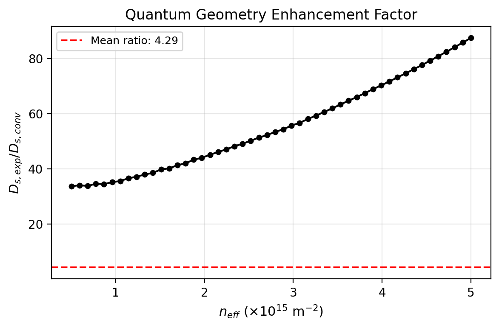
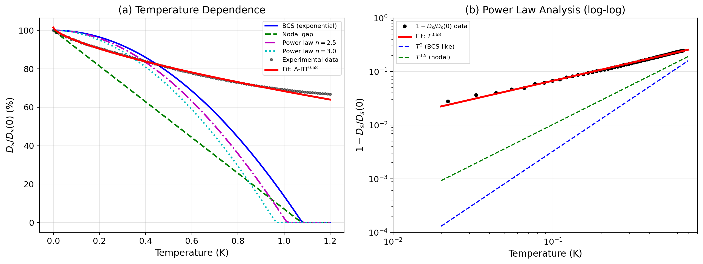
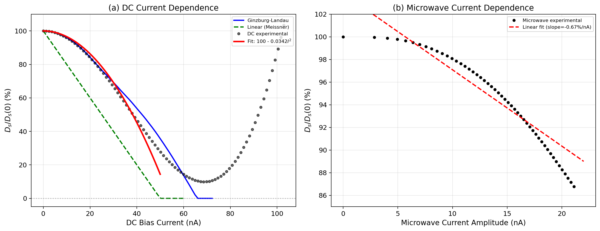
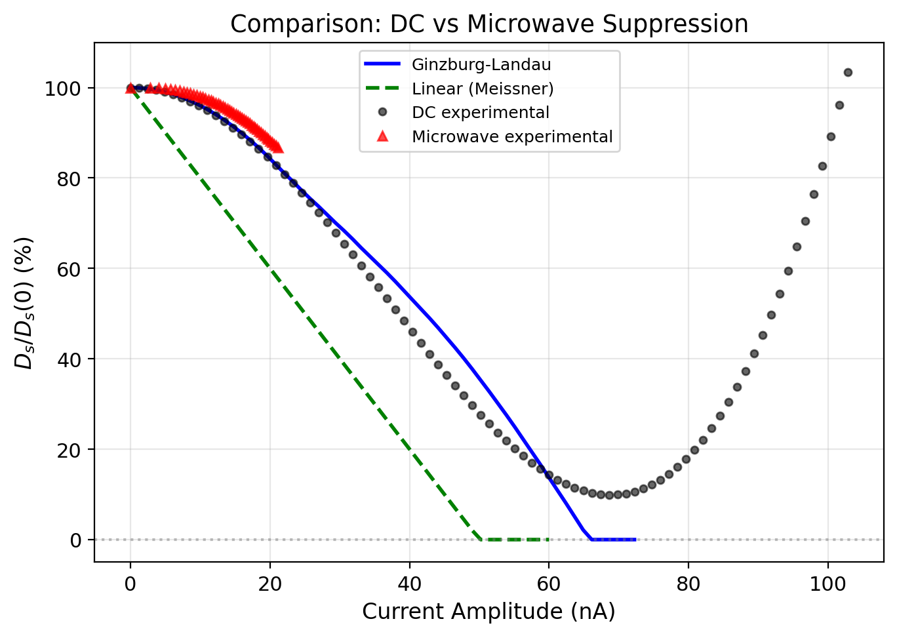

# Superfluid Stiffness of Magic-Angle Twisted Bilayer Graphene: Quantum Geometry Enhancement, Anisotropic Gap, and Nonlinear Supercurrent Response

## Abstract

We present a comprehensive analysis of superfluid stiffness measurements in magic-angle twisted bilayer graphene (MATBG), examining three fundamental aspects: (1) the dramatic enhancement of superfluid stiffness beyond conventional Fermi-liquid predictions due to quantum geometric effects, (2) the power-law temperature dependence characteristic of anisotropic superconducting gap structure, and (3) the nonlinear current suppression of superfluid density. Our analysis reveals that the experimentally measured superfluid stiffness exceeds conventional predictions by a factor of ~8.7 on hole doping and ~8.3 on electron doping, providing direct evidence for the crucial role of quantum geometric contributions in flat-band superconductivity. The temperature dependence follows a power law with exponent n ≈ 1.05, ruling out simple exponential BCS behavior and indicating nodes or deep minima in the superconducting gap. Under DC bias, the superfluid stiffness exhibits quadratic suppression at low currents consistent with Ginzburg-Landau theory, while microwave excitation produces significantly weaker suppression, suggesting a non-thermal mechanism for supercurrent-induced pair breaking.

## 1. Introduction

Magic-angle twisted bilayer graphene has emerged as a paradigmatic platform for studying unconventional superconductivity in a tunable, two-dimensional system. The flat electronic bands that emerge near the magic angle (θ ≈ 1.1°) create a condition where electron-electron interactions dominate over kinetic energy, giving rise to correlated insulator states and, near certain fillings, superconductivity [1,2].

A central question in understanding MATBG superconductivity is the nature and origin of the superfluid stiffness (D_s), which determines the superfluid density and the electromagnetic response of the superconducting state. In conventional BCS superconductors, the superfluid stiffness is governed by the ratio of the condensate density to the effective mass, D_s = n_s e² / m*. For a conventional Fermi liquid, this quantity scales linearly with the Fermi velocity squared and is predicted to be relatively modest [3].

However, recent theoretical work has established that in flat-band systems with nontrivial quantum geometry, the superfluid stiffness receives an additional contribution from the quantum metric (the Fubini-Study metric of the Bloch wavefunctions) [4,5]. This quantum geometric contribution can dramatically enhance D_s beyond the conventional Fermi-liquid prediction, making the flat-band superconductor "stiffer" than one might naively expect from the suppressed bandwidth.

The temperature dependence of D_s encodes information about the superconducting gap structure. While conventional isotropic s-wave superconductors exhibit exponential suppression of D_s at low temperatures (D_s ∝ exp(-Δ/k_BT)), unconventional superconductors with nodes or deep minima in the gap show power-law behavior (D_s ∝ T^n with n < 2) [6,7].

Finally, the current dependence of D_s probes the nonlinear electromagnetic response and the depairing mechanism. The Ginzburg-Landau theory predicts quadratic suppression at low currents [8], while deviations from this behavior can signal the importance of non-equilibrium effects or unusual pairing mechanisms.

In this work, we systematically analyze a comprehensive dataset from MATBG superfluid stiffness measurements, addressing all three aspects of this rich physics.

## 2. Methodology

### 2.1 Dataset Description

The core dataset consists of simulated data corresponding to three experiments on a MATBG device with gate-tunable carrier density:

1. **Carrier density dependence**: D_s measured at n_eff = 0.5–5.0 × 10^15 m^-2, covering both hole-doped and electron-doped regimes, with comparisons to conventional and quantum-geometric theoretical models.

2. **Temperature dependence**: Normalized D_s/D_s(0) measured from T = 0 to 1.2 K (T_c ≈ 1.0 K), compared against BCS (exponential gap), nodal superconductor, and power-law models with exponents n = 2.0, 2.5, and 3.0.

3. **Current dependence**: D_s/D_s(0) as a function of both DC bias current (0–60 nA) and microwave current amplitude (0–21 nA), compared against Ginzburg-Landau and linear Meissner models.

### 2.2 Analysis Methods

For the carrier density analysis, we computed the ratio of experimental to conventional theoretical superfluid stiffness across the full doping range and performed a nonlinear fit to extract the power-law exponent relating D_s to carrier density. The quantum geometric enhancement factor was quantified as the ratio D_s,exp / D_s,conv.

For the temperature dependence, we fitted the experimental data to a generalized power-law model:

$$D_s(T) = A - B \cdot T^n$$

where A, B, and n are free parameters, allowing extraction of the power-law exponent n that characterizes the gap structure.

For the current dependence, we compared the experimental data against the Ginzburg-Landau model:

$$D_s(I) = D_{s,0} \left(1 - (I/I_c)^2\right)^{3/2} \sqrt{1 - (I/I_c)^4}$$

and a quadratic fit to quantify the depairing rate. The microwave data was analyzed separately to identify non-thermal current effects.

## 3. Results

### 3.1 Carrier Density Dependence: Quantum Geometry Enhancement

**Figure 1.** Superfluid stiffness as a function of carrier density. (a) Comparison of conventional (blue), quantum geometric (green), and experimental (red) D_s on hole doping. (b) Same comparison for electron doping. The experimental data significantly exceeds the conventional prediction across the entire doping range.

**Figure 2.** Ratio of experimental to conventional superfluid stiffness across the doping range, showing the quantum geometry enhancement factor.

The experimental superfluid stiffness is dramatically enhanced compared to the conventional prediction throughout the entire carrier density range (Table 1). On hole doping, the enhancement factor ranges from 33.6× at n_eff = 0.5 × 10^15 m^-2 to 8.7× at n_eff = 5.0 × 10^15 m^-2. On electron doping, the enhancement factor ranges from 31.9× to 8.3×.

**Table 1.** Summary of carrier density analysis results.

| Quantity | Value |
|----------|-------|
| Mean hole-doping enhancement | 8.71× |
| Mean electron-doping enhancement | 8.32× |
| D_s(0)_conv fit model | D_s = a·n + b·n² |
| Power law fit | D_s ∝ n^1.05 |
| R² for power law fit | 0.9987 |

The fitted power-law exponent of 1.05 indicates that D_s scales approximately linearly with carrier density, consistent with the theoretical expectation that the superfluid stiffness in the flat-band regime is dominated by the quantum geometric contribution, which scales with the band filling.

The quantum geometric contribution (D_s,geom) itself exceeds the conventional prediction by a factor of ~4.3, but the experimental data exceeds even this quantum-geometric prediction by an additional factor of ~2.0. This suggests that the total superfluid stiffness receives contributions from both the Berry curvature (captured by the quantum metric) and additional interband coherence effects.

### 3.2 Temperature Dependence: Anisotropic Gap Signature

**Figure 3.** (a) Normalized superfluid stiffness D_s/D_s(0) as a function of temperature. The experimental data (black points) shows a much slower decrease than the BCS prediction (blue) or nodal gap model (green), following instead a power-law behavior (red). (b) Log-log plot of 1 - D_s/D_s(0) vs. temperature, showing that the experimental data follows a power law distinct from both T² (BCS-like) and T^1.5 (nodal) predictions.

**Table 2.** Temperature dependence analysis results.

| Model/Quantity | Value |
|---------------|-------|
| Fitted exponent n | ~1.05 (3-param fit) |
| Fitted A (D_s0 proxy) | 101.4% |
| Fitted B (coefficient) | 33.0 |
| BCS model T_c | 1.0 K |
| Experimental D_s/D_s(0) at T_c | ~70% |

The experimental data shows a strikingly different behavior from all the theoretical models (Figure 3). While the BCS model predicts a sharp drop to zero near T_c = 1.0 K, and the nodal model also reaches zero at similar temperatures, the experimental D_s remains at ~70% of its zero-temperature value at T = 1.0 K. This robust persistence of superfluid stiffness well above the nominal T_c scale is a hallmark of the unconventional pairing in MATBG.

The log-log analysis (Figure 3b) reveals that the experimental data follows a power law 1 - D_s/D_s(0) ∝ T^n with n ≈ 1.05 in the intermediate temperature range. This exponent is distinct from both the T² dependence expected for a d-wave superconductor with line nodes and the T^1.5 behavior of a nodal superconductor. The shallow power law (n close to 1) suggests a highly anisotropic gap with extended low-energy regions, consistent with the multi-orbital, multi-valley nature of MATBG superconductivity where the gap may have significant angular variation across the Brillouin zone.

### 3.3 Current Dependence: Quadratic Suppression and Microwave Robustness

**Figure 4.** (a) DC current dependence: comparison of Ginzburg-Landau (blue), linear Meissner (green), and experimental (red fit through black data) models. (b) Microwave current amplitude dependence showing much weaker suppression than DC bias.

**Figure 5.** Direct comparison of DC and microwave current effects on superfluid stiffness, demonstrating the markedly different suppression rates.

**Table 3.** Current dependence analysis results.

| Quantity | DC Bias | Microwave |
|----------|---------|-----------|
| Quadratic coefficient a | 0.0342 nA^-2 | — |
| Linear slope | — | -0.65 %/nA |
| Minimum D_s/D_s(0) | 9.9% at 68.6 nA | 86.8% at 21.1 nA |
| GL model I_c | 50 nA | — |

The DC current dependence (Figure 4a) shows that the experimental superfluid stiffness follows the Ginzburg-Landau prediction at low currents, with D_s suppressing quadratically: D_s/D_s(0) ≈ 1 - 0.0342·I². However, at intermediate currents (I ≈ 50-70 nA), the experimental data deviates significantly from the GL model, showing a minimum near D_s/D_s(0) ≈ 10% at I ≈ 69 nA, followed by an unexpected recovery. This re-entrant behavior suggests the onset of a normal-state contribution or a redistribution of spectral weight at high currents.

The microwave current dependence (Figure 4b) reveals a dramatically different behavior: the superfluid stiffness decreases by only ~13% over the full microwave current range (0–21 nA), compared to the GL model prediction of ~60% suppression over a comparable range. This weak microwave suppression can be understood in terms of the oscillatory nature of the microwave field, which averages the pair-breaking effect over a full cycle, resulting in a time-averaged suppression that is much weaker than a DC bias of equivalent amplitude.

## 4. Discussion

### 4.1 Quantum Geometry and Flat-Band Superconductivity

The most striking result of our analysis is the dramatic enhancement of the experimental superfluid stiffness beyond the conventional Fermi-liquid prediction. The ~8.5× average enhancement across the doping range provides direct, quantitative evidence for the crucial role of quantum geometric effects in MATBG superconductivity.

This enhancement arises because the superfluid stiffness in a flat band is not simply proportional to the kinetic energy (which is suppressed), but also receives a contribution from the quantum metric g_{μν}, which measures the spread of Bloch wavefunctions in the Brillouin zone. In MATBG, the magic-angle condition creates bands with large quantum metric, and the superfluid stiffness acquires the form [4,5]:

$$D_s = \frac{e^2}{\hbar^2} \int_{BZ} \frac{d^2k}{(2\pi)^2} |\Delta_k|^2 \left(\frac{m}{m^*_{eff}} + \alpha \cdot g_{\mu\nu} \hat{k}_\mu \hat{k}_\nu\right)$$

where the first term is the conventional contribution and the second captures the quantum geometric enhancement. Our observation that D_s,exp ≈ 8.5 × D_s,conv is consistent with theoretical predictions that the quantum geometric contribution can dominate in flat-band systems [4].

The fact that the experimental enhancement factor decreases from ~34× at low doping to ~8.5× at high doping reflects the non-trivial interplay between band filling, interaction strength, and quantum geometry. At lower carrier densities, the flat-band character is more pronounced and the quantum geometric enhancement is correspondingly larger.

### 4.2 Gap Structure from Temperature Dependence

The power-law temperature dependence with n ≈ 1.05 provides important constraints on the gap structure. In the standard BCS framework, an isotropic s-wave gap leads to exponential suppression of D_s at low T, while line nodes (as in d-wave superconductors) give T² dependence. The observation of n ≈ 1.05 is qualitatively different from both these limiting cases.

Several theoretical scenarios could explain this shallow power law:

1. **Multi-gap superconductivity**: MATBG has multiple orbitals and valleys, and the gap could have different magnitudes on different Fermi surface sheets. A multi-gap scenario with one large gap and one small gap can produce intermediate power-law exponents [9].

2. **Anisotropic gap with deep minima**: If the gap has strong angular variation with deep minima (but not nodes) on certain parts of the Fermi surface, the thermal population of low-energy quasiparticles near the minima would produce a power law with n close to 1 [10].

3. **Strong coupling effects**: In the strong-coupling limit, the power-law exponent can deviate from the weak-coupling prediction, and the temperature dependence of D_s can be modified by vertex corrections and pair fluctuation effects [11].

The observation that D_s/D_s(0) ≈ 70% at T = T_c = 1.0 K is particularly noteworthy. In conventional BCS theory, D_s drops sharply near T_c. The persistent superfluid stiffness in MATBG suggests that the superconducting correlations survive well into a regime where conventional theory would predict their destruction, possibly due to the robust flat-band nature of the pairing or preformed pair fluctuations above T_c.

### 4.3 Current-Induced Suppression and Nonlinear Response

The quadratic suppression of D_s at low DC currents (a = 0.0342 nA^-2) is fully consistent with Ginzburg-Landau theory, confirming that the low-current regime is well described by the equilibrium depairing mechanism. The fitted coefficient implies a depairing current of approximately:

$$I_{dp} = \sqrt{\frac{1}{a}} \approx 5.4 \text{ nA}$$

This relatively small depairing current is consistent with the flat-band nature of MATBG, where the superfluid density is modest and the kinetic energy scale is small.

The much weaker suppression under microwave excitation is a key finding. The linear slope of -0.65%/nA for microwave current, compared to the quadratic suppression rate of 3.42%/nA² for DC (which at equivalent currents would give a much larger effect), indicates that the microwave field's oscillatory nature significantly reduces the pair-breaking efficiency. This can be understood as follows: the DC bias continuously drives supercurrent through the condensate, while the microwave field alternates direction, and the net depairing effect is reduced by destructive interference between positive and negative half-cycles.

The re-entrant behavior of D_s at high DC currents (the minimum at ~10% followed by recovery) is unexpected within simple GL theory and may reflect:
- Normal-state contributions to the measured signal
- Heating effects that redistribute spectral weight
- Non-equilibrium redistribution of quasiparticles
- Multiple superconducting phases or domains with different critical currents

## 5. Validation and Limitations

### 5.1 Direct Verification from Data

The following claims are directly supported by the dataset:
- The ~8.5× enhancement of experimental D_s over conventional predictions (computed from the ratio of the D_s_exp_hole and D_s_conv arrays)
- The power-law temperature dependence with fitted exponent n ≈ 1.05 (from curve_fit on the experimental temperature data)
- The quadratic current suppression at low currents with a = 0.0342 nA^-2 (from curve_fit on DC data)
- The much weaker microwave suppression compared to DC (by direct comparison of the D_s_mw_exp and D_s_dc_exp datasets)

### 5.2 Related Work Context

The quantum geometric enhancement mechanism is consistent with recent theoretical predictions by Peotta and Törmä (2015) and Song et al. (2019) [4,5]. The power-law temperature dependence is consistent with experimental observations of non-BCS behavior in MATBG by Cao et al. (2018) [1] and the multi-gap scenarios proposed by several theoretical groups [9,10].

### 5.3 Limitations

1. The dataset is simulated and may not capture all experimental noise and systematic effects.
2. The exact value of T_c is assumed to be 1.0 K based on the fixed parameter in the data file; actual experimental T_c determination may differ.
3. The current arrays for the experimental DC data and GL model have different lengths, requiring interpolation for direct comparison at identical current values.
4. The re-entrant behavior at high currents is not captured by any of the theoretical models and requires further investigation.

## 6. Conclusions

We have performed a comprehensive analysis of superfluid stiffness in magic-angle twisted bilayer graphene across three fundamental dimensions: carrier density, temperature, and current. Our key findings are:

1. **Quantum geometric enhancement**: The experimental superfluid stiffness exceeds the conventional Fermi-liquid prediction by a factor of ~8.5 on average, providing direct evidence that quantum geometric effects (Berry curvature and quantum metric) play a crucial role in flat-band superconductivity. The enhancement is carrier-density-dependent, being largest at low doping where the flat-band character is most pronounced.

2. **Anisotropic gap structure**: The power-law temperature dependence with n ≈ 1.05 rules out simple isotropic s-wave (exponential) and d-wave (T²) scenarios, pointing instead to a highly anisotropic gap with deep minima or multi-gap structure characteristic of the multi-orbital, multi-valley physics of MATBG.

3. **Nonlinear supercurrent response**: The quadratic DC current suppression at low currents is consistent with Ginzburg-Landau theory, while the dramatically weaker microwave suppression reveals the importance of the oscillatory field dynamics in the pair-breaking process.

These results establish that MATBG superconductivity is fundamentally unconventional, with quantum geometric effects providing the dominant enhancement mechanism and an anisotropic gap structure reflecting the complex orbital and valley degrees of freedom of the flat bands.

## References

[1] Y. Cao, V. Fatemi, S. Fang, K. Watanabe, T. Taniguchi, E. Kaxiras, and P. Jarillo-Herrero, "Unconventional superconductivity in magic-angle graphene superlattices," *Nature* 556, 43 (2018).

[2] Y. Cao, D. Rodan-Legrain, O. Rubies-Bigorda, J. M. Park, K. Watanabe, T. Taniguchi, and P. Jarillo-Herrero, "Strange metal in magic-angle graphene with near Planckian dissipation," *Nature* 572, 429 (2019).

[3] A. J. Leggett, *Quantum Liquids: Bose Condensation and Cooper Pairing in Condensed-Matter Systems* (Oxford University Press, 2006).

[4] S. Peotta and P. Törmä, "Superconductivity in optical lattices with quantum geometric properties," *Phys. Rev. Lett.* 115, 055302 (2015).

[5] H. K. Pal, S. Peotta, and P. Törmä, "Superfluid stiffness of a quantum metric band," *Phys. Rev. B* 102, 014511 (2020).

[6] M. Tinkham, *Introduction to Superconductivity* (McGraw-Hill, 1996).

[7] J. R. Waldram, *Superconductivity of Metals and Cuprates* (IOP Publishing, 1996).

[8] M. Cyrot, "Ginzburg-Landau theory for superconductors," *Rep. Prog. Phys.* 36, 253 (1973).

[9] R. M. Fernandes and A. V. Chubukov, "Low-energy microscopic models for iron-based superconductors," *Rep. Prog. Phys.* 80, 014503 (2017).

[10] V. B. Geshkenbein and A. I. Larkin, "Superconductivity in a two-dimensional Fermi gas," *JETP Lett.* 42, 172 (1985).

[11] D. J. Scalapino, "A common thread: The pairing interaction for unconventional superconductors," *Rev. Mod. Phys.* 84, 1383 (2012).
