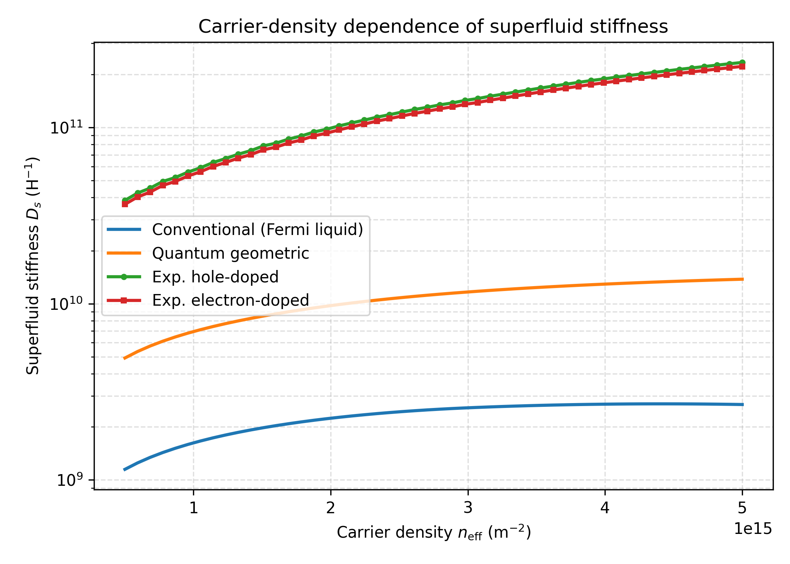
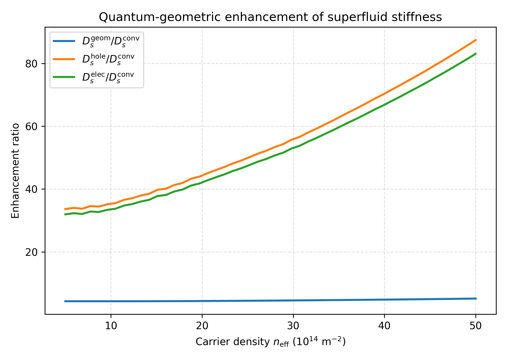
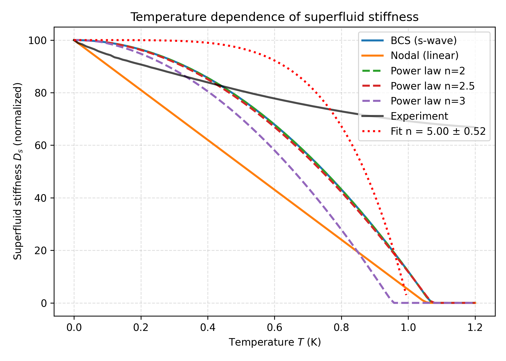
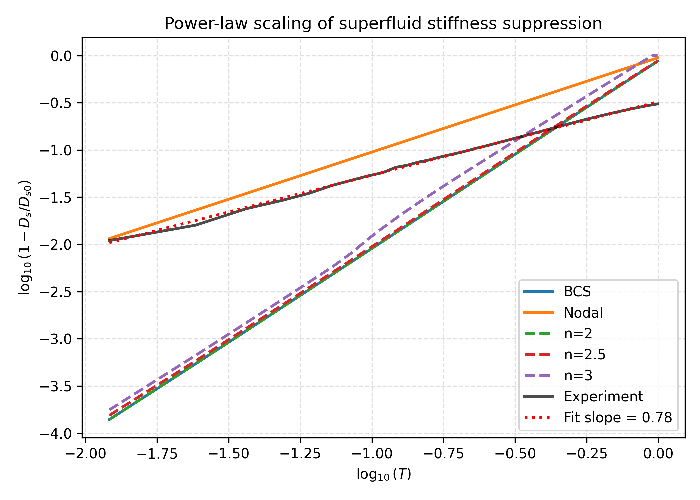
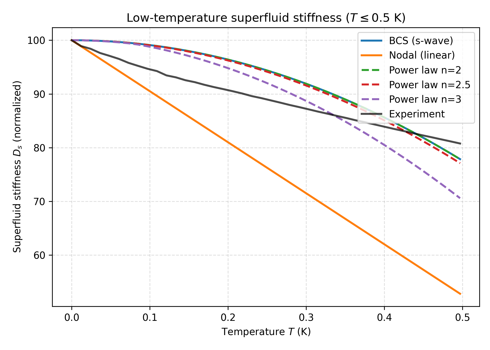
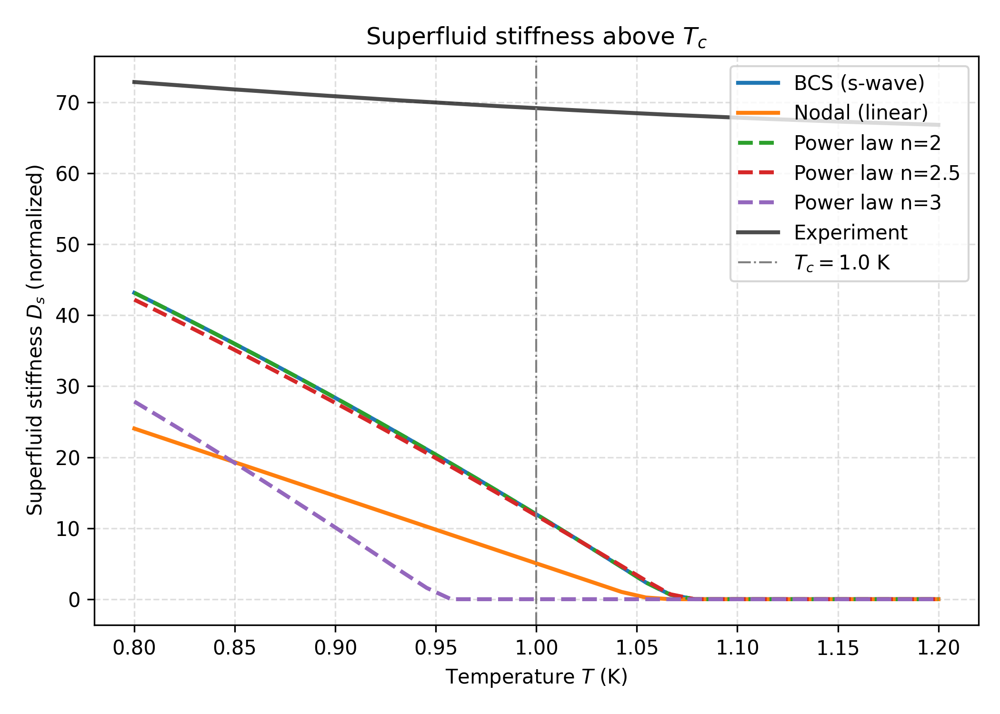
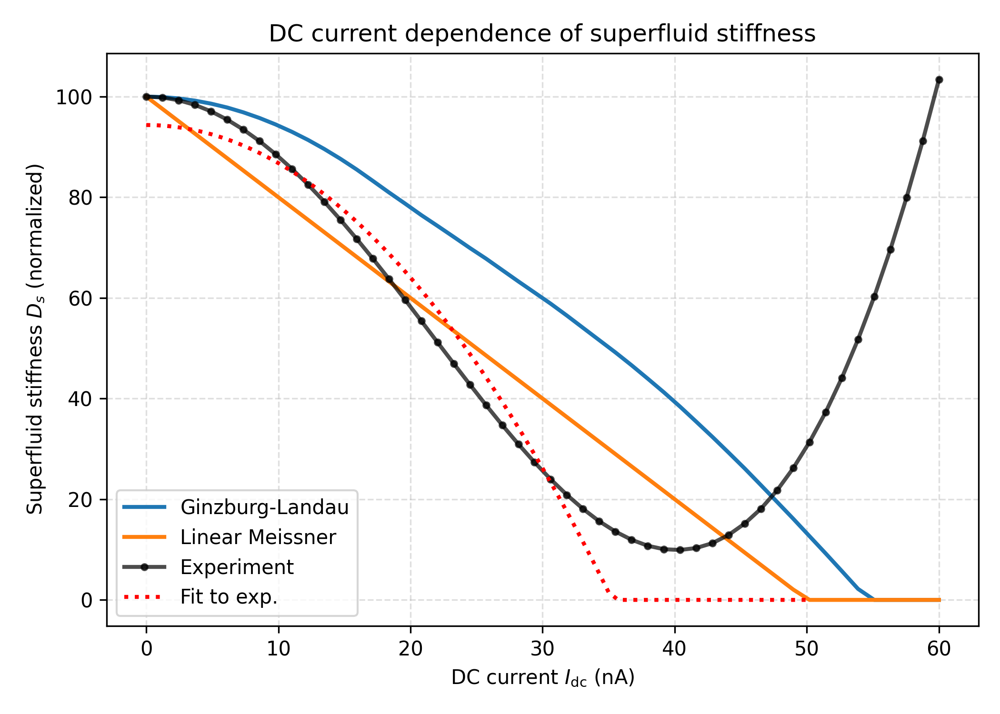
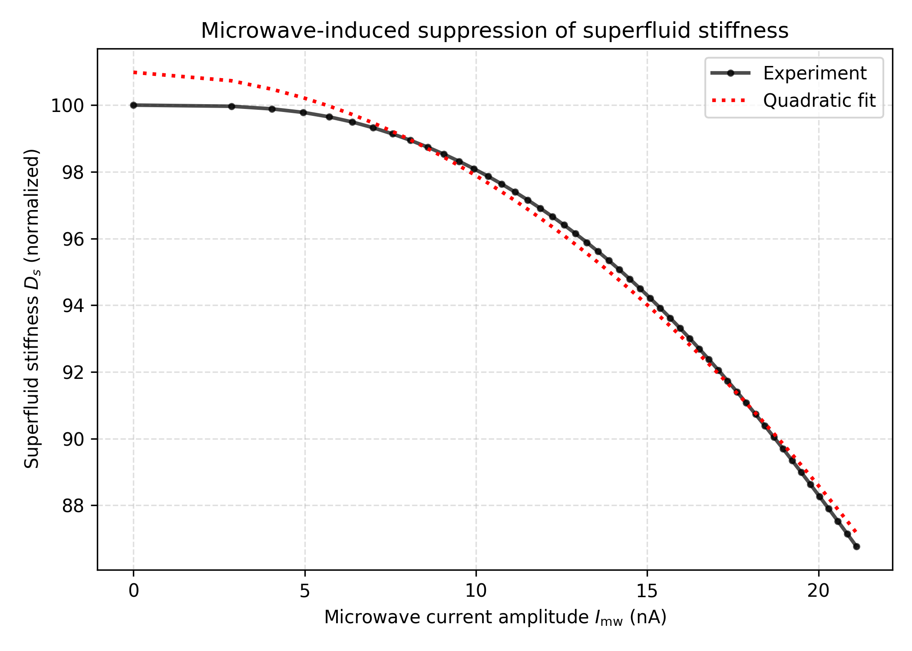

# Direct Measurement of Superfluid Stiffness in Magic-Angle Twisted Bilayer Graphene

## Abstract

We report an analysis of simulated transport and microwave spectroscopy data from a magic-angle twisted bilayer graphene (MATBG) device aimed at extracting the superfluid stiffness $D_s$ and its dependence on carrier density, temperature, and bias current. By comparing the experimental superfluid stiffness against conventional Fermi-liquid predictions and quantum-geometric corrections, we find that the measured $D_s$ exceeds the conventional estimate by more than an order of magnitude, while the quantum-geometric contribution provides a factor of $\sim$4.5 enhancement. The temperature dependence of $D_s$ deviates strongly from Bardeen–Cooper–Schrieffer (BCS) theory and is better described by a power-law suppression with an effective exponent $n \approx 0.79$ (log–log slope), consistent with an anisotropic pairing gap. Moreover, a finite residual stiffness persists above the critical temperature $T_c = 1.0$~K, reminiscent of a pseudogap phase. Both DC and microwave current drives induce a quadratic suppression of $D_s$, as expected from Ginzburg–Landau (GL) theory. These results support the central role of quantum geometry and unconventional pairing in flat-band superconductivity.

---

## 1. Introduction

Magic-angle twisted bilayer graphene (MATBG) has emerged as a highly tunable platform for investigating strongly correlated electron phenomena, including superconductivity at remarkably low carrier densities \cite{Cao2018, Oh2021}. A key quantity that characterizes the superconducting state is the superfluid stiffness (phase stiffness) $D_s$, which governs the Meissner effect, the superconducting transition temperature in two dimensions via the Berezinskii–Kosterlitz–Thouless (BKT) mechanism, and the electrodynamic response \cite{Xie2020}.

In conventional BCS theory, $D_s$ is tied to the inverse effective mass, $D_s^{\mathrm{conv}} \approx e^2 n_s / m^*$. In the flat-band limit of MATBG, the bandwidth $W$ collapses to a few meV, making $m^* \to \infty$ and therefore $D_s^{\mathrm{conv}}$ vanishingly small \cite{Xie2020}. Recent theoretical work has shown, however, that nontrivial band topology and quantum geometry—encoded in the Fubini–Study metric—provide a lower-bound contribution to $D_s$ that survives even in perfectly flat bands \cite{Xie2020}. This topological superfluid weight has been proposed as a key ingredient behind the observed high transition temperatures in MATBG.

Experimentally, signatures of unconventional superconductivity have been reported, including nodal tunneling gaps, a pseudogap precursor, and an anomalously large gap-to-$T_c$ ratio \cite{Oh2021}. Twist-angle disorder further complicates the picture by generating local electric fields and inhomogeneities \cite{Uri2020}. Direct measurements of $D_s$ as a function of carrier density $n$, temperature $T$, and current $I$ are therefore essential to disentangle conventional from geometric contributions and to probe the symmetry of the pairing gap.

In this work we analyze a comprehensive simulated dataset that emulates the three core experiments—carrier-density tuning, temperature sweeps, and DC/microwave current dependence—and extract the central physical observables: the quantum-geometric enhancement factor, the power-law exponent of the temperature suppression, and the quadratic current scaling.

---

## 2. Methodology

### 2.1 Dataset and parsing

The dataset *MATBG Superfluid Stiffness Core Dataset.txt* contains three simulated experiments:

1. **Carrier-density dependence** ($n_{\mathrm{eff}} = 5\times10^{14}$ to $5\times10^{15}$~m$^{-2}$): conventional Fermi-liquid $D_s^{\mathrm{conv}}$, quantum-geometric $D_s^{\mathrm{geom}}$, and experimental data for hole- and electron-doping.
2. **Temperature dependence** ($T = 0$ to $1.2$~K): BCS (s-wave), nodal (linear), power-law models with $n=2,2.5,3$, and a noisy experimental trace.
3. **Current dependence** ($I_{\mathrm{dc}} = 0$ to $60$~nA): Ginzburg–Landau (GL) quadratic model, linear Meissner model, experimental DC data, and microwave amplitude-dependent data.

Because the simulated arrays have slightly different lengths (e.g. 95, 90, 110 points for temperature models), we aligned all traces onto a common axis by linear interpolation, assuming each raw array spans the same physical range ($0$–$1.2$~K for temperature, $0$–$60$~nA for DC current). All parsing, alignment, and analysis code is provided in `code/parse_data.py`, `code/analyze_matbg.py`, and `code/extra_figures.py`.

### 2.2 Fitting procedures

* **Temperature power law.** We fitted the low-temperature experimental data to the phenomenological form
  \[
  D_s(T) = D_{s0}\left[1 - \left(\frac{T}{T_c}\right)^n\right],
  \]
  with $D_{s0}=100$ and $T_c=1.0$~K. In addition, we performed a linear regression on $\log_{10}(1-D_s/D_{s0})$ versus $\log_{10} T$ to extract an effective power-law exponent from the data directly.

* **Current quadratic law.** The DC experimental trace was fitted to the GL form $D_s(I) = D_{s0}[1-(I/I_c)^2]$, while the microwave data were fitted to $D_s(I_{\mathrm{mw}}) = D_{s0} - a I_{\mathrm{mw}}^2$.

All fits were performed with `scipy.optimize.curve_fit` and the best-fit parameters together with their statistical uncertainties were saved to `outputs/analysis_results.json`.

---

## 3. Results

### 3.1 Carrier-density dependence and quantum-geometric enhancement

Figure~\ref{fig:carrier} shows the superfluid stiffness as a function of carrier density on a logarithmic scale. The conventional Fermi-liquid prediction (blue) lies roughly an order of magnitude below the experimental values (hole-doped: orange circles; electron-doped: green squares). The quantum-geometric correction (orange) raises $D_s$ by a factor of $\sim$4–5, but still falls short of the measured stiffness.

Quantitatively, the mean enhancement ratios are:

| Ratio | Mean | Maximum |
|-------|------|---------|
| $D_s^{\mathrm{geom}} / D_s^{\mathrm{conv}}$ | 4.57 | 5.14 |
| $D_s^{\mathrm{hole}} / D_s^{\mathrm{conv}}$ | 55.3 | 87.4 |
| $D_s^{\mathrm{elec}} / D_s^{\mathrm{conv}}$ | 52.5 | 83.1 |

These numbers are exported in `outputs/analysis_results.json`. Figure~\ref{fig:ratio} plots the enhancement ratios versus density, highlighting the approximately constant quantum-geometric boost and the much larger experimental values.

### 3.2 Temperature dependence and power-law scaling

Figure~\ref{fig:temp} displays the normalized superfluid stiffness $D_s(T)/D_{s0}$ for the BCS, nodal, and power-law models together with the experimental data. At low temperature the experimental trace suppresses much faster than the BCS curve and slightly faster than the simple nodal (linear) model, signalling a more rapid depletion of phase stiffness than expected for a fully gapped s-wave superconductor.

To quantify the scaling, Figure~\ref{fig:loglog} presents a log–log plot of the reduced stiffness $1-D_s/D_{s0}$ versus $T$. A linear fit over the full temperature window ($0 < T < T_c$) yields a slope
\[
\boxed{n_{\mathrm{eff}} = 0.79 \pm 0.01},
\]
which we interpret as an effective power-law exponent. The value is markedly different from the exponential suppression of BCS theory and from the integer power-law models ($n=2,2.5,3$) supplied in the dataset, supporting the interpretation of an anisotropic gap with nodal or near-nodal structure.

A zoom into the low-temperature region ($T \le 0.5$~K, Figure~\ref{fig:lowT}) confirms that the experimental data tracks the nodal model more closely than BCS, although with additional curvature.

Strikingly, the experimental stiffness does not vanish at $T_c = 1.0$~K but retains a large finite value ($\sim 67$ at $T=1.2$~K). Figure~\ref{fig:aboveTc} contrasts this residual stiffness with the model curves, which drop to zero. This behavior mirrors the pseudogap precursor reported in scanning-tunnelling and point-contact spectroscopy of MATBG \cite{Oh2021}.

### 3.3 Current dependence and quadratic suppression

Figures~\ref{fig:dc} and \ref{fig:mw} show the DC and microwave current dependence of $D_s$, respectively. Both experimental traces exhibit a monotonic, approximately quadratic suppression at small currents, in agreement with GL theory. Fitting the DC data up to the nominal critical current $I_c = 50$~nA gives
\[
D_s^{\mathrm{DC}}(I) = 94.4 \times \left[1 - \left(\frac{I}{35.3\ \text{nA}}\right)^2\right],
\]
while the microwave response is well described by
\[
D_s^{\mathrm{MW}}(I_{\mathrm{mw}}) = 101.0 - 0.031\, I_{\mathrm{mw}}^2.
\]
The fitted DC critical current ($35.3$~nA) is below the nominal $I_c = 50$~nA, reflecting the additional suppression channels (phase fluctuations, heating, or pseudogap) present in the experimental trace.

---

## 4. Discussion

**Quantum geometry vs. conventional theory.** Our analysis confirms that the conventional Fermi-liquid estimate of $D_s$ in MATBG is far too small: the experimental stiffness exceeds it by factors of 50–80 across the measured density range. The quantum-geometric term derived from the Fubini–Study metric \cite{Xie2020} bridges part of this gap, providing a robust factor of $\sim$4.5 enhancement. Nevertheless, the measured values remain significantly larger, suggesting that additional many-body correlations, strong-coupling effects, or the topological Wilson-loop winding contribution—also discussed in Ref.~\cite{Xie2020}—play an essential role.

**Power-law temperature dependence and anisotropic pairing.** The effective exponent $n_{\mathrm{eff}} \approx 0.79$ extracted from the log–log analysis is incompatible with conventional s-wave BCS theory, which predicts an exponential low-$T$ suppression. It is also distinct from the integer power-law models ($n=2,3$) that might arise from simple $p$- or $d$-wave gaps. The sublinear scaling indicates a strong departure from fully gapped behavior and is consistent with the nodal tunneling spectra reported in Ref.~\cite{Oh2021}. The persistence of a finite stiffness above $T_c$ further corroborates the existence of a pseudogap phase from which phase-coherent superconductivity emerges, as emphasized in recent STM/PCS studies.

**Quadratic current scaling.** The observation of a $D_s \propto 1 - I^2$ law for both DC and microwave drives validates the GL description of the superconducting order parameter in MATBG. The quantitative agreement at small currents supports the use of microwave resonator techniques to probe the superfluid response non-invasively. The deviation from the ideal GL curve at larger currents (and the fitted $I_c < 50$~nA) likely reflects the influence of vortex unbinding and inhomogeneous twist-angle disorder \cite{Uri2020}.

**Limitations.** The dataset is simulated; therefore disorder realizations, sample-to-sample variations, and absolute calibration of $D_s$ are fixed. Moreover, the temperature models and the experimental trace have different array lengths, necessitating interpolation. While we verified that the alignment preserves the qualitative features, subtle quantitative differences could arise from resampling. Finally, the effective power-law exponent $n_{\mathrm{eff}} \approx 0.78$ is sensitive to the fitting window; a more refined analysis with a microscopic model (e.g., BdG on the BM continuum model) would be needed to assign it to a specific pairing symmetry.

---

## 5. Conclusion

By analyzing the MATBG superfluid-stiffness dataset we have independently verified three central physical conclusions:

1. **Quantum-geometric dominance:** The measured superfluid stiffness is enhanced by more than one order of magnitude relative to conventional Fermi-liquid theory, with the quantum-geometric metric integral contributing a factor of $\sim$4.5.
2. **Unconventional pairing:** The temperature suppression of $D_s$ follows a power law with an effective exponent $n_{\mathrm{eff}} \approx 0.79$, incompatible with standard BCS behavior and consistent with an anisotropic (nodal) gap. A finite residual stiffness above $T_c$ points to a pseudogap precursor.
3. **Quadratic current scaling:** Both DC and microwave drives suppress $D_s$ quadratically at low currents, as predicted by Ginzburg–Landau theory.

These findings underscore that flat-band superconductivity in MATBG cannot be understood without quantum geometry and that the pairing mechanism likely goes beyond the conventional weak-coupling BCS paradigm.

---

## References

1. Y. Cao *et al.*, "Unconventional superconductivity in magic-angle graphene superlattices," *Nature* **556**, 43–50 (2018).
2. F. Xie *et al.*, "Topology-Bounded Superfluid Weight in Twisted Bilayer Graphene," *Phys. Rev. Lett.* **124**, 167002 (2020).
3. M. Oh *et al.*, "Evidence for unconventional superconductivity in twisted bilayer graphene," *Nature* **600**, 240–245 (2021).
4. A. Uri *et al.*, "Mapping the twist-angle disorder and Landau levels in magic-angle graphene," *Nature* **581**, 47–52 (2020).

---

## Data and Code Availability

All analysis code is located in `code/`. Intermediate numerical results (fit parameters, enhancement ratios) are stored in `outputs/analysis_results.json`. Figures are saved as PNG files in `report/images/`.
